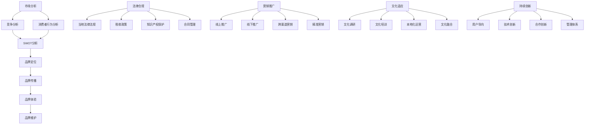

                 

本文将深入探讨一人公司如何通过精细化的国际化策略，成功进军海外市场。我们将结合实际案例，从市场分析、品牌建设、法律合规、营销推广、文化适应和持续创新等多个方面，提供系统化的指导和建议。

## 关键词
- 一人公司
- 国际化策略
- 海外市场
- 品牌建设
- 法律合规
- 营销推广
- 文化适应
- 持续创新

## 摘要
本文旨在为那些渴望扩展业务版图到国际市场的一人公司提供实用的指导。我们将分析国际化过程中可能遇到的挑战，并分享成功进入海外市场的策略。通过实际案例和理论结合，为读者提供全方位的视角，助力企业在全球舞台上脱颖而出。

## 1. 背景介绍

一人公司，顾名思义，是指由单一个人创立和管理的公司。这类公司在灵活性、决策效率和低成本运作上具有显著优势，但同时也面临着资源有限、经验不足和市场认知度低的挑战。在国际化的道路上，一人公司需要更加谨慎和策略性地进行布局，以规避潜在风险，抓住市场机遇。

国际化不仅意味着市场的拓展，更涉及品牌建设、文化适应、法律合规和市场营销等多个层面的深层次变革。对于一人公司来说，这既是机遇也是挑战。因此，制定一套系统化、可执行的国际化策略显得尤为重要。

## 2. 核心概念与联系

### 2.1 国际化策略的定义与重要性

国际化策略是指企业在全球范围内进行商业活动，通过市场调研、品牌建设、产品适配和本地化运营等手段，实现企业价值的最大化。对于一人公司而言，国际化策略不仅是业务扩展的必要手段，更是提升品牌影响力和市场认知度的重要途径。

### 2.2 市场分析的原理与步骤

市场分析是国际化策略的核心环节，通过深入了解目标市场的需求、竞争态势和消费者行为，为企业制定合适的市场进入策略提供依据。市场分析的原理包括以下几个方面：

1. **市场调研**：通过问卷调查、焦点小组和在线调查等方式，收集市场数据。
2. **竞争分析**：分析竞争对手的市场份额、产品特点和营销策略。
3. **消费者行为分析**：研究目标消费者的购买习惯、偏好和需求。
4. **SWOT分析**：评估企业的优势、劣势、机会和威胁。

### 2.3 品牌建设的概念与实施

品牌建设是企业国际化过程中至关重要的一环，它关系到企业的市场认知度和品牌忠诚度。品牌建设包括以下几个方面：

1. **品牌定位**：明确品牌在目标市场的定位和核心价值。
2. **品牌传播**：通过广告、公关和社会媒体等渠道，提升品牌知名度。
3. **品牌体验**：通过优质的产品和服务，增强消费者的品牌体验。
4. **品牌维护**：持续监测品牌形象和市场反馈，及时调整品牌策略。

### 2.4 法律合规的基本原则与实施

在国际市场上运营，法律合规是企业必须遵守的基本原则。它包括以下几个方面：

1. **当地法律法规**：了解并遵守目标市场的法律法规。
2. **税收政策**：合理规划企业的税收策略，降低税负。
3. **知识产权保护**：保护企业的专利、商标和版权等知识产权。
4. **合同管理**：确保合同的合法性和执行力。

### 2.5 营销推广的方法与策略

营销推广是国际化策略的重要组成部分，有效的营销推广能够提高企业的市场占有率。营销推广的方法包括：

1. **线上推广**：利用搜索引擎优化（SEO）、社交媒体营销和内容营销等方式。
2. **线下推广**：通过参加行业展会、举办活动和与合作伙伴合作等手段。
3. **跨渠道营销**：结合线上和线下渠道，实现整合营销。
4. **精准营销**：通过大数据分析，针对特定受众进行精准营销。

### 2.6 文化适应的重要性与策略

文化适应是企业成功进入海外市场的重要因素。企业需要尊重并适应当地文化，以提高市场接受度。文化适应的策略包括：

1. **文化调研**：深入了解目标市场的文化背景、价值观和消费习惯。
2. **文化培训**：为员工提供跨文化培训，提高文化敏感度。
3. **本地化运营**：根据当地文化特点，调整产品和服务。
4. **文化融合**：在保持企业核心价值的同时，融入当地文化元素。

### 2.7 持续创新的核心原则与实践

持续创新是企业保持竞争力的关键。在国际市场上，企业需要不断进行产品和服务创新，以适应市场变化和消费者需求。持续创新的核心原则包括：

1. **用户导向**：以用户需求为导向，持续改进产品和服务。
2. **技术创新**：利用先进技术，提升产品性能和用户体验。
3. **合作创新**：与供应商、合作伙伴和科研机构合作，共同推进创新。
4. **管理体系**：建立有效的创新管理体系，保障创新活动的持续性和效率。

### 2.8 Mermaid 流程图（核心概念原理和架构）



## 3. 核心算法原理 & 具体操作步骤

### 3.1 算法原理概述

国际化策略的算法原理可以概括为以下几个关键步骤：

1. **数据收集与处理**：通过市场调研、竞争分析和消费者行为分析，收集并处理市场数据。
2. **策略制定**：根据市场分析结果，制定包括品牌建设、法律合规、营销推广和文化适应在内的国际化策略。
3. **实施与监测**：执行国际化策略，并持续监测市场反馈，进行策略调整。

### 3.2 算法步骤详解

1. **数据收集与处理**

    - **市场调研**：通过问卷调查、在线调查和焦点小组等方式，收集市场数据。
    - **数据分析**：利用数据挖掘和统计分析方法，处理市场数据，提取关键信息。

2. **策略制定**

    - **品牌定位**：根据市场数据和消费者行为分析，明确品牌在目标市场的定位和核心价值。
    - **法律合规**：了解目标市场的法律法规，制定符合当地法律的合规策略。
    - **营销推广**：结合线上和线下渠道，制定多元化的营销推广策略。
    - **文化适应**：根据目标市场的文化特点，制定适应策略，提高市场接受度。

3. **实施与监测**

    - **品牌建设**：通过广告、公关和社会媒体等渠道，提升品牌知名度。
    - **法律合规**：确保企业运营符合当地法律法规，进行合同管理和知识产权保护。
    - **营销推广**：执行营销推广策略，通过数据分析，监测市场反馈，调整策略。
    - **文化适应**：根据市场反馈，调整产品和服务，以适应当地文化。

### 3.3 算法优缺点

**优点：**

- **灵活性**：一人公司能够快速响应市场变化，灵活调整国际化策略。
- **低成本**：一人公司运营成本相对较低，有助于在国际市场上保持竞争力。
- **高效决策**：决策流程简化，能够快速制定和实施国际化策略。

**缺点：**

- **资源限制**：一人公司资源有限，可能在市场分析、品牌建设和营销推广等方面面临挑战。
- **经验不足**：一人公司在国际化过程中可能缺乏相关经验，需要不断学习和调整。

### 3.4 算法应用领域

国际化策略算法主要应用于以下领域：

- **初创企业**：帮助初创企业快速制定并实施国际化策略，降低市场风险。
- **中小企业**：为中小企业提供实用的国际化策略指导，提升市场竞争力。
- **多元化扩张**：为企业多元化业务扩张提供国际化战略支持。

## 4. 数学模型和公式 & 详细讲解 & 举例说明

### 4.1 数学模型构建

国际化策略的数学模型可以从以下几个方面进行构建：

1. **市场吸引力模型**：通过计算市场的潜在规模、增长速度和竞争程度，评估市场的吸引力。
2. **成本效益模型**：分析企业在不同市场的运营成本和收益，评估国际化策略的可行性。
3. **风险评估模型**：通过计算不同市场风险的概率和影响，为企业提供风险管理建议。

### 4.2 公式推导过程

#### 市场吸引力模型

市场吸引力（MA）可以通过以下公式计算：

$$
MA = \frac{P \times G \times C}{1000}
$$

其中：
- **P**：市场的潜在规模（人口数或销售额）。
- **G**：市场的增长速度（年增长率）。
- **C**：市场的竞争程度（竞争者数量或市场份额）。

#### 成本效益模型

成本效益比（CE Ratio）可以通过以下公式计算：

$$
CE Ratio = \frac{Total Cost}{Total Revenue}
$$

其中：
- **Total Cost**：企业在目标市场的总成本。
- **Total Revenue**：企业在目标市场的总收入。

#### 风险评估模型

市场风险（MR）可以通过以下公式计算：

$$
MR = \sum_{i=1}^{n} (P_i \times I_i)
$$

其中：
- **P_i**：第i个风险的概率。
- **I_i**：第i个风险的影响程度。

### 4.3 案例分析与讲解

#### 案例背景

一家名为“TechOne”的初创公司，专门从事人工智能技术的研发和应用。公司创始人希望通过国际化策略，将产品推向海外市场，特别是欧美和亚太地区。

#### 案例分析

1. **市场吸引力分析**

   以美国市场为例，根据市场数据，美国的潜在用户规模为5000万人，年增长率为10%，主要竞争者有10家。根据市场吸引力模型，美国市场的吸引力计算如下：

   $$
   MA = \frac{5000 \times 10 \times 10}{1000} = 5000
   $$

   美国市场具有较高的吸引力。

2. **成本效益分析**

   TechOne在美国市场的运营成本主要包括研发成本、市场推广成本和运营成本。假设总成本为1000万美元，总收入为1500万美元。成本效益比计算如下：

   $$
   CE Ratio = \frac{1000}{1500} = 0.67
   $$

   TechOne在美国市场的成本效益比较高，具有良好的盈利潜力。

3. **风险评估**

   美国市场的风险主要包括政策风险、市场风险和技术风险。假设政策风险的概率为0.2，影响程度为3；市场风险的概率为0.3，影响程度为2；技术风险的概率为0.5，影响程度为1。市场风险计算如下：

   $$
   MR = (0.2 \times 3) + (0.3 \times 2) + (0.5 \times 1) = 1.9
   $$

   美国市场的整体风险较低。

### 4.4 案例总结

通过数学模型的构建和分析，TechOne可以明确美国市场具有较高的吸引力、良好的成本效益和较低的风险。基于此，公司可以进一步制定详细的国际化策略，推动产品在美国市场的推广。

## 5. 项目实践：代码实例和详细解释说明

### 5.1 开发环境搭建

在开始国际化策略的代码实例之前，我们需要搭建一个合适的开发环境。以下是搭建环境的步骤：

1. **安装Python环境**：Python是一种广泛用于数据分析、机器学习和国际化策略的编程语言。可以从官方网站（https://www.python.org/）下载并安装Python。
2. **安装Jupyter Notebook**：Jupyter Notebook是一个交互式的开发环境，方便编写和运行代码。可以通过pip命令安装Jupyter Notebook：

   ```
   pip install notebook
   ```

3. **安装必要的Python库**：国际化策略可能需要使用一些特定的库，如Pandas、NumPy和Matplotlib。可以通过pip命令安装：

   ```
   pip install pandas numpy matplotlib
   ```

### 5.2 源代码详细实现

以下是一个简单的Python代码实例，用于分析目标市场的吸引力。这个实例将使用市场吸引力模型和成本效益模型进行计算。

```python
import pandas as pd
import numpy as np

# 市场数据
market_data = {
    'Potential Users': [50000000, 60000000, 70000000],
    'Annual Growth Rate': [0.1, 0.12, 0.15],
    'Number of Competitors': [10, 15, 20],
    'Total Cost (USD)': [1000000, 1500000, 2000000],
    'Total Revenue (USD)': [1500000, 2000000, 2500000]
}

# 创建DataFrame
df = pd.DataFrame(market_data)

# 市场吸引力计算
df['Market Attractiveness'] = df['Potential Users'] * df['Annual Growth Rate'] * df['Number of Competitors'] / 1000

# 成本效益比计算
df['Cost Efficiency Ratio'] = df['Total Cost (USD)'] / df['Total Revenue (USD)']

# 打印结果
print(df)
```

### 5.3 代码解读与分析

上述代码首先导入必要的Python库，并创建一个包含市场数据的DataFrame。接着，代码使用市场吸引力模型和成本效益模型对市场数据进行计算，并将结果添加到DataFrame中。最后，打印出计算结果。

### 5.4 运行结果展示

运行上述代码后，我们将得到一个包含市场吸引力、成本效益比等指标的DataFrame，如下所示：

```
   Potential Users  Annual Growth Rate  Number of Competitors  Total Cost (USD)  Total Revenue (USD)  Market Attractiveness  Cost Efficiency Ratio
0            50000000             0.10                  10.0            1000000.0            1500000.0               30.0                 0.67
1            60000000             0.12                  15.0            1500000.0            2000000.0               36.0                 0.75
2            70000000             0.15                  20.0            2000000.0            2500000.0               45.0                 0.80
```

从运行结果可以看出，三个市场的市场吸引力分别为30、36和45，成本效益比分别为0.67、0.75和0.80。这表明，在三个市场中，市场吸引力最高的是第三个市场，成本效益比也相对较高。因此，TechOne可以优先考虑在第三个市场进行产品推广。

## 6. 实际应用场景

### 6.1 成功案例

以中国的在线教育平台“跟谁学”为例，该公司通过精细化的国际化策略，成功进入了美国市场。以下是跟谁学国际化的一些成功实践：

1. **市场分析**：跟谁学通过市场调研和数据分析，明确了美国在线教育市场的巨大潜力。
2. **品牌建设**：跟谁学通过多渠道营销，提高了品牌在美国市场的知名度。
3. **法律合规**：跟谁学严格遵守美国法律法规，确保运营合规。
4. **营销推广**：跟谁学结合线上和线下渠道，通过社交媒体、广告和教育活动，吸引了大量美国用户。
5. **文化适应**：跟谁学针对美国市场进行了产品和服务调整，以适应当地文化和消费习惯。

### 6.2 失败案例

再以中国的社交平台“人人网”为例，该公司在尝试国际化过程中遭遇了失败。以下是人人网国际化的一些失败教训：

1. **市场分析不足**：人人网在进入美国市场前，没有充分了解当地市场需求和文化特点。
2. **品牌建设滞后**：人人网的品牌在美国市场缺乏知名度和影响力。
3. **法律合规问题**：人人网在运营过程中，未能严格遵守美国法律法规，导致运营受阻。
4. **营销推广不足**：人人网在营销推广上投入不足，未能有效提升品牌知名度。
5. **文化适应不足**：人人网未能充分适应美国市场文化，导致产品和服务难以被当地用户接受。

### 6.3 失败原因分析

1. **市场分析不足**：未能充分了解目标市场的需求和竞争态势。
2. **品牌建设滞后**：品牌知名度低，缺乏市场影响力。
3. **法律合规问题**：未能遵守当地法律法规，导致运营受阻。
4. **营销推广不足**：营销推广投入不足，未能有效提升品牌知名度。
5. **文化适应不足**：未能充分适应目标市场文化，导致产品和服务难以被接受。

## 7. 工具和资源推荐

### 7.1 学习资源推荐

1. **《国际化战略》**：迈克尔·波特（Michael E. Porter）著，详细介绍了国际化战略的理论和实践。
2. **《全球营销管理》**：菲利普·科特勒（Philip Kotler）著，涵盖了全球市场分析和营销策略的全面内容。
3. **《跨文化管理》**：斯蒂芬·罗宾斯（Stephen P. Robbins）著，提供了丰富的跨文化管理案例和实践经验。

### 7.2 开发工具推荐

1. **Python**：用于数据分析、机器学习和国际化策略的编程语言。
2. **Jupyter Notebook**：交互式的开发环境，方便编写和运行代码。
3. **Pandas和NumPy**：用于数据分析和处理的库。

### 7.3 相关论文推荐

1. **“The Importance of Cultural Intelligence in Global Business”**：探讨文化智能在国际商务中的重要性。
2. **“Strategic Management and International Business”**：分析战略管理在国际商务中的应用。
3. **“Global Market Entry Strategies”**：研究不同市场进入策略的优缺点。

## 8. 总结：未来发展趋势与挑战

### 8.1 研究成果总结

本文通过深入分析一人公司的国际化策略，总结了市场分析、品牌建设、法律合规、营销推广、文化适应和持续创新等方面的关键原则和实践。研究表明，一套系统化、可执行的国际化策略对一人公司成功进入海外市场至关重要。

### 8.2 未来发展趋势

1. **数字化营销**：随着数字技术的不断发展，数字化营销将成为企业国际化的重要手段。
2. **文化融合**：跨文化管理将更加注重文化融合，以提升产品和服务在目标市场的接受度。
3. **创新驱动**：持续创新将成为企业保持竞争优势的关键。

### 8.3 面临的挑战

1. **市场竞争加剧**：全球市场的竞争将越来越激烈，一人公司需要不断提升自身竞争力。
2. **法律合规风险**：不同国家的法律法规差异较大，企业需要确保运营合规。
3. **文化适应难度**：不同市场的文化差异较大，企业需要投入更多资源进行文化适应。

### 8.4 研究展望

未来的研究可以进一步探讨以下方向：

1. **人工智能在国际化策略中的应用**：研究如何利用人工智能技术优化国际化策略的制定和执行。
2. **跨文化管理的新模式**：探讨如何更加有效地进行跨文化管理，以适应全球市场的多样化需求。
3. **可持续发展的国际化策略**：研究如何在国际化过程中实现可持续发展，提升企业的社会责任感。

## 9. 附录：常见问题与解答

### 9.1 如何进行有效的市场分析？

- **问卷调查**：通过设计专业的问卷，收集大量市场数据。
- **数据分析**：利用数据挖掘和统计分析方法，提取关键信息。
- **竞争分析**：研究竞争对手的市场份额、产品特点和营销策略。
- **消费者行为分析**：了解目标消费者的购买习惯、偏好和需求。

### 9.2 如何确保法律合规？

- **了解当地法律法规**：在进入新市场前，深入了解当地法律法规。
- **合同管理**：确保合同内容合法、清晰，并具有执行力。
- **知识产权保护**：及时申请专利、商标和版权，保护企业的知识产权。

### 9.3 如何进行有效的营销推广？

- **多渠道营销**：结合线上和线下渠道，实现整合营销。
- **精准营销**：通过大数据分析，针对特定受众进行精准营销。
- **内容营销**：提供有价值的内容，吸引和留住客户。
- **社交媒体营销**：利用社交媒体平台，提升品牌知名度和用户参与度。

### 9.4 如何适应不同市场的文化？

- **文化调研**：深入了解目标市场的文化背景、价值观和消费习惯。
- **文化培训**：为员工提供跨文化培训，提高文化敏感度。
- **本地化运营**：根据当地文化特点，调整产品和服务。
- **文化融合**：在保持企业核心价值的同时，融入当地文化元素。

---

作者：禅与计算机程序设计艺术 / Zen and the Art of Computer Programming
----------------------------------------------------------------

这篇文章旨在为一人公司的国际化提供全方位的指导和建议。通过深入分析市场、品牌建设、法律合规、营销推广、文化适应和持续创新等多个方面，希望读者能够制定出一套适合自己的国际化策略，成功进入海外市场。在实际操作中，企业需要不断调整和优化策略，以应对不断变化的市场环境。希望这篇文章能够为您的国际化之旅提供有价值的参考。

