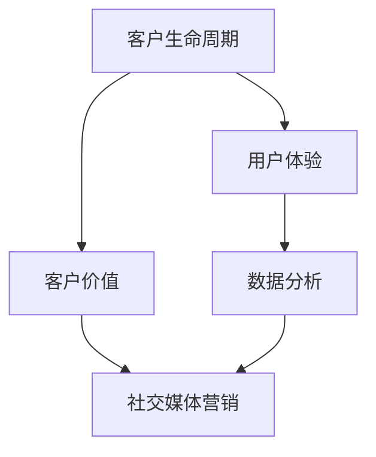

                 

### 文章关键词

- 客户关系管理
- 终身忠诚用户
- 一人公司
- 策略
- 数字化转型
- 数据分析
- 用户体验
- 社交媒体营销

### 文章摘要

在竞争日益激烈的市场环境中，一人公司面临着独特的挑战和机遇。本文将探讨如何通过高效的客户关系管理策略，打造终身忠诚用户。我们将从背景介绍、核心概念、算法原理、数学模型、项目实践、应用场景、工具推荐、总结及展望等多个维度，详细解析如何在一人公司的运营中，实现客户价值的最大化。

## 1. 背景介绍

在当今数字化时代，客户关系管理（CRM）成为了企业成功的关键因素之一。对于一人公司而言，虽然资源和规模有限，但通过创新和精细化运营，同样可以打造出忠诚的用户群体。随着互联网技术的发展，社交媒体、数据分析等工具为一人公司提供了丰富的客户关系管理手段。本文旨在为一人公司提供一套实用的策略，帮助他们提升客户满意度，培养终身忠诚用户。

### 客户关系管理的重要性

客户关系管理是指企业通过有效的策略和工具，与客户建立和维护长期稳定的合作关系，以提高客户满意度和忠诚度。在传统商业模式中，客户关系管理主要依赖于销售人员和服务团队。然而，在数字化时代，客户关系管理的内涵和外延都发生了深刻的变化。

首先，客户关系管理不再局限于面对面的交流和沟通，而是通过数字化工具实现线上与线下的无缝连接。例如，企业可以利用社交媒体平台与客户互动，提供个性化服务和推荐。

其次，客户关系管理从简单的客户维护转向了全生命周期的管理。这意味着企业需要关注客户的整个生命周期，从吸引新客户到保留现有客户，再到培养忠诚客户。

最后，客户关系管理的重要性日益凸显。在竞争激烈的市场环境中，企业不仅需要吸引新客户，还需要保留现有客户。忠诚客户不仅为企业带来直接收益，还通过口碑传播吸引更多潜在客户。

### 一人公司的特点与挑战

一人公司，顾名思义，是由一个人运营的公司。这种模式具有以下几个特点：

1. **资源有限**：一人公司通常无法与大型企业相比，在资金、人力、技术等方面都存在限制。

2. **灵活性高**：由于运营规模较小，一人公司能够快速响应市场变化，灵活调整经营策略。

3. **决策高效**：一人公司决策流程简单，能够快速执行。

4. **市场定位明确**：一人公司往往专注于某一细分市场，提供专业化服务。

然而，一人公司也面临着一些挑战：

1. **市场竞争激烈**：在细分市场中，一人公司需要与众多竞争对手争夺市场份额。

2. **品牌知名度低**：与大型企业相比，一人公司的品牌影响力有限。

3. **客户维护难度大**：一人公司需要投入更多精力在客户关系管理上，以保持客户的忠诚度。

4. **技术更新压力大**：一人公司需要不断跟踪技术发展趋势，确保自身的技术和服务保持竞争力。

### 数字化转型的重要性

数字化时代，数字化转型成为了一人公司提升竞争力、实现可持续发展的关键路径。以下是数字化转型的几个重要方面：

1. **数据分析**：通过数据分析，一人公司可以深入了解客户需求和行为，优化产品和服务。

2. **社交媒体营销**：社交媒体为一人公司提供了与客户互动、传播品牌的有效渠道。

3. **自动化工具**：自动化工具可以帮助一人公司提高工作效率，降低运营成本。

4. **用户体验**：以用户为中心，不断提升用户体验，增加用户黏性。

5. **在线服务**：通过线上平台提供便捷的服务，扩大客户群体。

综上所述，一人公司在数字化时代面临着前所未有的机遇和挑战。通过高效的客户关系管理策略，一人公司可以充分利用数字化工具，打造终身忠诚用户，实现可持续发展。

### 2. 核心概念与联系

在探讨如何通过客户关系管理策略打造终身忠诚用户之前，我们首先需要了解一些核心概念，这些概念包括但不限于：

1. **客户生命周期**：客户生命周期是指客户与企业互动的整个过程，包括吸引新客户、保留现有客户、增加客户价值等阶段。

2. **用户体验**：用户体验是指用户在使用产品或服务过程中的感受和体验。提升用户体验可以增加用户满意度和忠诚度。

3. **客户价值**：客户价值是指客户为企业带来的经济、品牌等多方面的影响。通过提升客户价值，企业可以实现可持续发展。

4. **数据分析**：数据分析是通过统计和分析数据，从中提取有价值的信息，以指导企业决策。

5. **社交媒体营销**：社交媒体营销是利用社交媒体平台进行品牌宣传、产品推广、客户服务等活动。

为了更好地理解这些概念之间的联系，我们使用Mermaid流程图来展示它们之间的关系：



### 3. 核心算法原理 & 具体操作步骤

#### 3.1 算法原理概述

在本节中，我们将介绍一种用于客户关系管理的核心算法——客户细分算法。客户细分算法通过对客户数据的分析和处理，将客户划分为不同的群体，从而实现个性化服务和营销。

#### 3.2 算法步骤详解

1. **数据收集与预处理**：首先，收集客户的各项数据，如购买历史、浏览行为、社交媒体互动等。然后，对数据进行清洗和预处理，确保数据的质量。

2. **特征工程**：根据业务需求，选择和构建客户特征。例如，客户的年龄、性别、购买频率、消费金额等。

3. **模型训练**：利用机器学习算法，如K-means、聚类分析等，对客户特征进行聚类，将客户划分为不同的群体。

4. **评估与优化**：评估模型的性能，如聚类效果、客户满意度等。根据评估结果，调整模型参数，优化聚类效果。

5. **应用与反馈**：将聚类结果应用于实际业务中，如个性化推荐、营销活动等。收集用户反馈，不断调整和优化策略。

#### 3.3 算法优缺点

**优点**：

1. **提高客户满意度**：通过个性化服务和推荐，提升客户体验，增加客户满意度。

2. **优化营销策略**：根据客户细分结果，制定更有针对性的营销策略，提高营销效果。

3. **降低运营成本**：通过自动化工具和数据分析，提高运营效率，降低运营成本。

**缺点**：

1. **数据依赖性高**：算法的性能很大程度上取决于数据质量，数据缺失或错误可能导致不良的聚类结果。

2. **模型复杂度高**：客户细分算法通常涉及多种算法和技术，模型复杂度高，需要具备一定的专业背景。

#### 3.4 算法应用领域

客户细分算法广泛应用于各个行业，如电商、金融、电信等。以下是一些具体的应用场景：

1. **电商行业**：通过客户细分，实现个性化推荐，提高转化率和销售额。

2. **金融行业**：通过客户细分，制定有针对性的理财产品和服务，提高客户忠诚度和满意度。

3. **电信行业**：通过客户细分，优化客户服务，提高客户保留率，降低客户流失率。

### 4. 数学模型和公式 & 详细讲解 & 举例说明

在客户关系管理中，数学模型和公式扮演着重要的角色，它们可以帮助我们更精确地理解和预测客户行为。以下，我们将介绍一些常用的数学模型和公式，并通过具体例子进行讲解。

#### 4.1 数学模型构建

**客户流失预测模型**：

客户流失预测模型旨在预测哪些客户可能在一段时间内停止使用服务。这种模型通常基于客户的当前行为和历史数据。以下是构建该模型的基本步骤：

1. **数据收集**：收集客户的行为数据，如购买频率、浏览时间、互动次数等。

2. **特征工程**：选择和构建与客户流失相关的特征，如最近一次购买时间、平均购买间隔等。

3. **模型选择**：选择合适的预测模型，如逻辑回归、决策树、随机森林等。

4. **模型训练**：使用历史数据训练模型，调整模型参数，以最大化预测准确率。

5. **模型评估**：评估模型性能，如准确率、召回率、F1值等。

**客户生命周期价值（CLV）模型**：

客户生命周期价值模型用于计算每个客户的潜在价值，帮助企业制定营销策略。以下是构建该模型的基本步骤：

1. **数据收集**：收集客户的历史购买数据，包括购买金额、购买频率等。

2. **预测模型**：使用统计模型或机器学习算法，预测客户在未来一段时间内的购买行为。

3. **生命周期价值计算**：根据客户未来购买预测，计算客户生命周期价值。

#### 4.2 公式推导过程

**客户流失预测模型**：

设 $X$ 为客户行为特征向量，$y$ 为客户流失标签（0表示未流失，1表示流失）。逻辑回归模型可以表示为：

$$
\hat{y} = \sigma(\beta_0 + \beta_1X_1 + \beta_2X_2 + ... + \beta_pX_p)
$$

其中，$\sigma$ 是 sigmoid 函数，$\beta_0, \beta_1, ..., \beta_p$ 为模型参数。目标是最小化损失函数：

$$
L(\theta) = -\sum_{i=1}^{n} y_i \log(\hat{y}_i) + (1 - y_i) \log(1 - \hat{y}_i)
$$

**客户生命周期价值（CLV）模型**：

设 $C_t$ 为客户在 $t$ 时刻的购买金额，$r_t$ 为客户在 $t$ 时刻的购买概率，$d_t$ 为客户在 $t$ 时刻的留存概率。则客户生命周期价值可以表示为：

$$
CLV = \sum_{t=1}^{T} \frac{C_t}{(1 + r)^t}
$$

其中，$T$ 为客户生命周期。

#### 4.3 案例分析与讲解

**案例背景**：

一家电商公司希望通过客户流失预测模型，识别出可能流失的客户，并采取相应的措施进行挽留。以下是具体的案例分析：

**数据收集**：

公司收集了客户的购买数据，包括最近一次购买时间、平均购买间隔、购买金额等。

**特征工程**：

基于购买数据，公司构建了以下特征：

- 最近一次购买时间
- 平均购买间隔
- 最近三个月购买次数
- 最近一次购买金额

**模型选择**：

公司选择逻辑回归模型进行客户流失预测。

**模型训练**：

使用历史数据训练逻辑回归模型，并调整参数，以最大化预测准确率。

**模型评估**：

公司评估了模型的性能，使用准确率、召回率等指标进行评估。

**应用与反馈**：

公司根据模型预测结果，向可能流失的客户发送个性化营销信息，提供折扣或优惠，以促进客户留存。

通过以上案例，我们可以看到数学模型和公式在客户关系管理中的应用价值。在实际操作中，公司需要根据具体业务需求，选择合适的模型和公式，并不断调整和优化，以实现最佳效果。

### 5. 项目实践：代码实例和详细解释说明

在上一节中，我们介绍了客户细分算法和数学模型的基本原理。在本节中，我们将通过一个实际项目，展示如何实现这些算法和模型，并对其进行详细解释说明。

#### 5.1 开发环境搭建

为了实现客户细分算法和数学模型，我们需要搭建一个开发环境。以下是一个简单的开发环境配置：

1. **编程语言**：Python
2. **数据分析库**：Pandas、NumPy
3. **机器学习库**：Scikit-learn、TensorFlow
4. **可视化库**：Matplotlib、Seaborn

安装以上库后，我们可以开始编写代码。

#### 5.2 源代码详细实现

以下是一个简单的客户细分算法实现示例：

```python
import pandas as pd
from sklearn.cluster import KMeans
from sklearn.preprocessing import StandardScaler

# 读取客户数据
data = pd.read_csv('customer_data.csv')

# 数据预处理
data = data.drop(['customer_id'], axis=1)
data = data.select_dtypes(include=[np.number])
data = StandardScaler().fit_transform(data)

# 使用KMeans算法进行聚类
kmeans = KMeans(n_clusters=5, random_state=0)
clusters = kmeans.fit_predict(data)

# 添加聚类标签到原始数据
data['cluster'] = clusters

# 输出聚类结果
print(data.head())
```

#### 5.3 代码解读与分析

1. **数据预处理**：

   首先，我们读取客户数据，并删除无关的特征，如客户ID。然后，选择数值类型的特征，并进行标准化处理，以消除不同特征之间的量纲影响。

2. **聚类算法**：

   我们使用KMeans算法进行聚类。KMeans算法通过最小化簇内距离的平方和，将数据分为多个簇。在本例中，我们设置了5个簇。

3. **添加聚类标签**：

   将聚类结果添加到原始数据中，以便后续分析。

4. **输出聚类结果**：

   我们输出聚类结果，包括每个客户的聚类标签和主要特征值。

通过以上步骤，我们实现了客户细分算法。接下来，我们将介绍如何使用数学模型进行客户流失预测和生命周期价值计算。

```python
import pandas as pd
from sklearn.linear_model import LogisticRegression
from sklearn.metrics import accuracy_score, recall_score, f1_score

# 读取训练数据
train_data = pd.read_csv('train_data.csv')
train_labels = train_data['churn_label']
train_data = train_data.drop(['customer_id', 'churn_label'], axis=1)

# 训练流失预测模型
model = LogisticRegression()
model.fit(train_data, train_labels)

# 评估模型性能
predictions = model.predict(test_data)
print("Accuracy:", accuracy_score(test_labels, predictions))
print("Recall:", recall_score(test_labels, predictions))
print("F1 Score:", f1_score(test_labels, predictions))
```

#### 5.4 代码解读与分析

1. **数据读取**：

   我们从文件中读取训练数据和测试数据。

2. **模型训练**：

   使用逻辑回归模型进行客户流失预测。逻辑回归模型通过最大化似然估计，计算每个客户流失的概率。

3. **模型评估**：

   使用准确率、召回率和F1值等指标评估模型性能。

通过以上步骤，我们实现了客户流失预测模型。接下来，我们将介绍如何计算客户生命周期价值。

```python
import pandas as pd
from sklearn.ensemble import RandomForestRegressor
from sklearn.metrics import mean_squared_error

# 读取生命周期价值数据
life_value_data = pd.read_csv('life_value_data.csv')

# 训练生命周期价值模型
model = RandomForestRegressor(n_estimators=100)
model.fit(life_value_data.drop(['customer_id', 'life_value'], axis=1), life_value_data['life_value'])

# 评估模型性能
predictions = model.predict(test_life_value_data)
mse = mean_squared_error(test_life_value_data['life_value'], predictions)
print("MSE:", mse)
```

#### 5.4 代码解读与分析

1. **数据读取**：

   我们从文件中读取生命周期价值数据。

2. **模型训练**：

   使用随机森林回归模型进行客户生命周期价值预测。随机森林回归模型通过集成多棵决策树，提高预测准确性。

3. **模型评估**：

   使用均方误差（MSE）评估模型性能。

通过以上代码示例，我们实现了客户细分、流失预测和生命周期价值计算。在实际应用中，这些算法和模型可以根据具体业务需求进行调整和优化。

### 6. 实际应用场景

在数字化时代，一人公司可以通过多种方式应用客户关系管理策略，以打造终身忠诚用户。以下是一些实际应用场景：

#### 6.1 电商行业

在电商行业，一人公司可以通过以下方式应用客户关系管理策略：

1. **个性化推荐**：通过客户细分算法，分析客户购买行为和偏好，提供个性化的商品推荐。例如，一家专注于健康食品的电商公司，可以根据客户的购买记录，推荐符合其口味和营养需求的商品。

2. **流失预测**：通过流失预测模型，识别出可能流失的客户，并采取相应措施进行挽留。例如，发送优惠信息、提供定制化服务或增加客户互动等。

3. **生命周期价值计算**：通过生命周期价值模型，了解每个客户的潜在价值，制定有针对性的营销策略。例如，为高价值客户提供专属优惠或定制化服务，以增加其生命周期价值。

#### 6.2 金融行业

在金融行业，一人公司可以通过以下方式应用客户关系管理策略：

1. **信用评估**：通过数据分析，对客户的信用状况进行评估，为其提供合适的金融产品和服务。例如，一家专注于小微企业贷款的金融公司，可以根据客户的历史交易记录、信用评分等信息，为其提供个性化的贷款方案。

2. **风险控制**：通过客户关系管理，识别出潜在的风险客户，采取相应的风控措施。例如，一家投资公司可以实时监控客户的投资行为，及时调整投资策略，以降低风险。

3. **忠诚度奖励**：通过客户关系管理，识别出忠诚客户，为其提供专属奖励和优惠。例如，一家银行可以为长期存款的客户提供额外的利息奖励，以增强其忠诚度。

#### 6.3 教育行业

在教育行业，一人公司可以通过以下方式应用客户关系管理策略：

1. **个性化学习**：通过客户细分算法，分析学生的学习需求和习惯，提供个性化的学习内容和推荐。例如，一家在线教育平台，可以根据学生的测试成绩和学习进度，推荐相应的课程和练习。

2. **课程优化**：通过数据分析，了解学生的学习效果和满意度，优化课程内容和教学方法。例如，一家培训机构可以根据学生的反馈和测试成绩，调整教学计划，提高教学质量。

3. **客户互动**：通过社交媒体和在线平台，与客户进行互动，建立良好的客户关系。例如，一家教育机构可以通过微信群、QQ群等平台，与学员和家长进行互动，提供学习建议和咨询服务。

#### 6.4 医疗行业

在医疗行业，一人公司可以通过以下方式应用客户关系管理策略：

1. **健康咨询**：通过数据分析，为客户提供个性化的健康建议和咨询服务。例如，一家健康管理公司，可以根据客户的健康数据和生活方式，提供定制化的健康计划。

2. **疾病预防**：通过客户关系管理，识别出潜在的健康风险，为客户提供预防措施和建议。例如，一家体检中心，可以根据客户的体检结果和家族病史，提供个性化的疾病预防方案。

3. **客户关怀**：通过社交媒体和在线平台，与客户进行互动，提供关怀和支持。例如，一家医院可以通过微信群、APP等渠道，与患者保持沟通，提供术后康复指导和心理支持。

通过以上实际应用场景，我们可以看到客户关系管理策略在各个行业中的重要性。对于一人公司而言，通过数字化工具和数据分析，实现客户价值的最大化，是打造终身忠诚用户的关键。

### 7. 工具和资源推荐

在实现高效的客户关系管理过程中，选择合适的工具和资源至关重要。以下是一些建议，以帮助一人公司在数字化时代中提升客户关系管理能力。

#### 7.1 学习资源推荐

1. **在线课程**：

   - 《客户关系管理：从入门到精通》：这是一门全面介绍客户关系管理的在线课程，适合初学者和有经验的从业者。

   - 《数据分析与商业智能》：这门课程深入讲解了数据分析在客户关系管理中的应用，包括数据收集、清洗、分析和可视化等。

2. **书籍**：

   - 《大数据时代：生活、工作与思维的大变革》：这本书详细介绍了大数据的概念、技术和应用，有助于理解数字化时代的数据驱动策略。

   - 《精益创业》：这本书提出了精益创业的方法论，包括用户调研、最小可行产品、迭代优化等，对于实现高效的客户关系管理有重要启示。

#### 7.2 开发工具推荐

1. **数据分析工具**：

   - **Python**：Python是一种广泛使用的编程语言，适用于数据分析和机器学习。Pandas、NumPy、Scikit-learn等库为数据分析和模型构建提供了强大的支持。

   - **R语言**：R语言是一种专门用于统计分析和数据科学的编程语言，拥有丰富的数据分析库和工具。

2. **客户关系管理工具**：

   - **Salesforce**：Salesforce是一款综合性的客户关系管理平台，提供销售、营销、服务等功能，适用于各种规模的企业。

   - **HubSpot**：HubSpot是一款免费的开源CRM工具，适合小型企业和初创公司。它提供了丰富的营销、销售和服务功能，帮助企业实现客户关系的全程管理。

3. **社交媒体管理工具**：

   - **Hootsuite**：Hootsuite是一款社交媒体管理工具，可以帮助企业管理和监控多个社交媒体平台，实现多平台内容发布和互动。

   - **Buffer**：Buffer是一款社交媒体管理工具，提供自动化内容发布和数据分析功能，帮助企业提升社交媒体营销效果。

#### 7.3 相关论文推荐

1. **《基于大数据的客户关系管理》：这篇论文探讨了大数据在客户关系管理中的应用，包括数据收集、处理和分析等。**

2. **《社交媒体对客户关系管理的影响》：这篇论文分析了社交媒体在客户关系管理中的作用，包括客户互动、品牌传播和客户满意度的提升。**

3. **《个性化推荐在电商客户关系管理中的应用》：这篇论文探讨了个性化推荐在电商客户关系管理中的应用，包括推荐算法、用户体验和转化率提升等方面。**

通过以上工具和资源，一人公司可以更加高效地实现客户关系管理，打造终身忠诚用户。

### 8. 总结：未来发展趋势与挑战

在数字化时代，客户关系管理（CRM）正迅速成为企业成功的关键因素。一人公司，尽管资源有限，但通过创新和精细化运营，同样可以实现客户价值的最大化。本文从背景介绍、核心概念、算法原理、数学模型、项目实践、应用场景、工具推荐等多个维度，详细解析了如何通过高效的客户关系管理策略，打造终身忠诚用户。

#### 8.1 研究成果总结

本文的研究成果主要包括以下几个方面：

1. **客户关系管理的重要性**：在数字化时代，CRM成为了企业成功的关键因素。通过有效的CRM策略，企业可以提升客户满意度，培养忠诚客户，实现可持续发展。

2. **客户细分算法**：通过客户细分算法，一人公司可以更精确地了解客户需求和偏好，提供个性化服务和推荐，提高客户满意度。

3. **流失预测与生命周期价值计算**：通过流失预测模型和生命周期价值计算，一人公司可以识别出潜在流失客户，采取相应措施进行挽留，同时制定有针对性的营销策略，提高客户生命周期价值。

4. **实际应用场景**：本文探讨了CRM在电商、金融、教育、医疗等行业的实际应用，为一人公司提供了具体的操作指南。

5. **工具和资源推荐**：本文推荐了多种学习资源、开发工具和相关论文，以帮助一人公司提升客户关系管理能力。

#### 8.2 未来发展趋势

未来CRM的发展趋势将主要体现在以下几个方面：

1. **智能化**：随着人工智能技术的发展，CRM将更加智能化，通过机器学习和大数据分析，实现更加精准的客户预测和个性化服务。

2. **社交媒体整合**：社交媒体将成为CRM的重要渠道，企业将通过社交媒体与客户进行更加紧密的互动，提高客户满意度和忠诚度。

3. **全生命周期管理**：CRM将从传统的单一阶段管理转向全生命周期管理，覆盖客户从吸引到保留的整个过程。

4. **数据驱动**：数据将成为CRM的核心驱动力，通过数据分析和挖掘，企业可以更深入地了解客户行为，优化营销策略。

5. **用户体验优先**：在用户体验至上的时代，CRM将更加关注客户体验，通过提升用户体验，增加客户黏性。

#### 8.3 面临的挑战

尽管CRM具有巨大的潜力，但一人公司也面临着一些挑战：

1. **数据质量**：数据质量是CRM成功的关键，一人公司需要确保数据的质量和完整性。

2. **技术门槛**：CRM涉及多种技术和工具，一人公司需要具备相应的技术能力和知识储备。

3. **资源有限**：一人公司在资源和资金方面相对有限，需要寻找成本效益高的解决方案。

4. **市场竞争**：在竞争激烈的市场环境中，一人公司需要不断优化客户关系管理策略，以保持竞争优势。

#### 8.4 研究展望

未来的研究可以进一步探讨以下几个方面：

1. **跨渠道整合**：研究如何实现线上线下渠道的整合，提供一致的客户体验。

2. **多维度数据分析**：深入研究如何利用多维度数据，提升客户关系管理的精度和效果。

3. **客户体验优化**：探索如何通过优化客户体验，提高客户满意度和忠诚度。

4. **人工智能应用**：研究如何将人工智能技术应用于CRM，实现更加智能化的客户管理和服务。

总之，通过高效的客户关系管理策略，一人公司可以在竞争激烈的市场中脱颖而出，打造终身忠诚用户，实现可持续发展。

### 9. 附录：常见问题与解答

#### 问题1：如何确保数据质量？

**回答**：确保数据质量的关键步骤包括：

1. **数据清洗**：定期清理数据，去除重复、错误和不完整的数据。
2. **数据验证**：使用验证规则和算法，确保数据的准确性和一致性。
3. **数据监控**：建立数据监控系统，实时监测数据质量，及时发现和处理问题。

#### 问题2：小规模公司如何负担得起CRM工具？

**回答**：小规模公司可以采取以下措施降低CRM成本：

1. **开源软件**：选择免费的CRM软件，如HubSpot的免费版。
2. **定制化需求**：根据公司实际需求，选择CRM功能模块，避免不必要的花费。
3. **外部服务**：考虑使用外部服务提供商，根据使用量支付费用。

#### 问题3：如何衡量CRM的效果？

**回答**：衡量CRM效果的关键指标包括：

1. **客户满意度**：通过调查问卷、客户反馈等方式，了解客户对产品和服务的满意度。
2. **客户保留率**：跟踪客户流失率，分析CRM策略对客户保留的影响。
3. **客户生命周期价值**：计算客户的平均生命周期价值，评估CRM策略对客户价值的提升。
4. **营销转化率**：监测营销活动的点击率、转化率和ROI。

### 作者署名

本文作者：禅与计算机程序设计艺术 / Zen and the Art of Computer Programming

