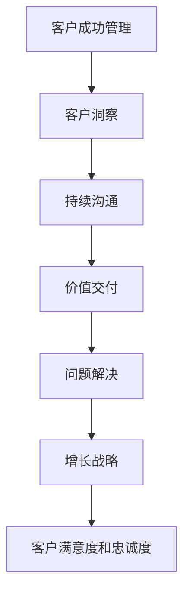

                 

关键词：客户成功管理、一对一服务、独立企业、高效运营

> 摘要：在当今快速变化的市场环境中，一人公司面临着巨大的挑战和机遇。本文将探讨如何通过有效的客户成功管理实践，提高一人公司在客户服务、关系维护和业务增长方面的表现。

## 1. 背景介绍

随着互联网和远程工作的普及，越来越多的人选择成为独立工作者或创建一人公司。这种方式提供了更大的灵活性和自主权，但也带来了一系列挑战。特别是客户成功管理，对于一人公司来说尤为重要。由于资源有限，一人公司必须高效地管理客户关系，以实现可持续的业务增长。

## 2. 核心概念与联系

### 2.1 客户成功的定义

客户成功（Customer Success）是一种以客户为中心的方法，旨在确保客户获得成功并实现其业务目标。它不仅仅是售后服务，而是一个贯穿整个客户生命周期的重要过程。

### 2.2 客户成功管理的核心要素

- **客户洞察**：了解客户的需求、偏好和行为。
- **持续沟通**：与客户保持定期联系，确保双方信息同步。
- **价值交付**：确保客户从产品或服务中获得预期价值。
- **问题解决**：快速响应并解决客户的问题和挑战。
- **增长战略**：通过增加客户满意度和忠诚度来推动业务增长。

### 2.3 Mermaid 流程图



## 3. 核心算法原理 & 具体操作步骤

### 3.1 算法原理概述

客户成功管理的核心在于建立和维护良好的客户关系。这需要一套系统化的流程和方法。

### 3.2 算法步骤详解

#### 3.2.1 客户洞察

- **数据分析**：收集并分析客户数据，了解客户的行为和偏好。
- **客户调研**：定期进行客户调研，获取客户的反馈和建议。

#### 3.2.2 持续沟通

- **定期跟进**：通过邮件、电话或社交媒体与客户保持联系。
- **个性化沟通**：根据客户的特点和需求定制沟通内容。

#### 3.2.3 价值交付

- **产品优化**：根据客户反馈不断改进产品或服务。
- **增值服务**：提供额外的服务，增加客户的使用频率和满意度。

#### 3.2.4 问题解决

- **快速响应**：建立快速响应机制，确保客户问题得到及时解决。
- **预防措施**：通过预测分析，提前发现并解决潜在问题。

#### 3.2.5 增长战略

- **客户推荐**：鼓励现有客户推荐新客户。
- **客户关系维护**：通过定期的互动和关怀，维护良好的客户关系。

### 3.3 算法优缺点

#### 优点

- **灵活性强**：一人公司可以根据实际情况灵活调整客户成功管理策略。
- **高效性**：通过有效的客户关系管理，提高客户满意度和忠诚度，进而推动业务增长。

#### 缺点

- **资源限制**：一人公司可能无法像大型企业一样投入大量资源进行客户成功管理。
- **人力资源限制**：一人公司可能无法承担过多的人力成本。

### 3.4 算法应用领域

- **SaaS行业**：SaaS公司通常通过客户成功管理来确保客户长期使用其产品。
- **咨询行业**：咨询公司通过客户成功管理来建立和维护与客户的关系。

## 4. 数学模型和公式 & 详细讲解 & 举例说明

### 4.1 数学模型构建

客户成功管理的数学模型可以基于以下公式：

$$
\text{客户满意度} = f(\text{价值交付}, \text{问题解决}, \text{增长战略})
$$

### 4.2 公式推导过程

客户满意度是一个综合指标，它取决于价值交付、问题解决和增长战略。每个因素都有不同的权重，可以通过客户调研和数据分析来确定。

### 4.3 案例分析与讲解

假设一家SaaS公司通过以下方式提升客户成功管理：

- **价值交付**：每月推出新功能，提高用户体验。
- **问题解决**：建立24/7的客户支持热线，确保问题在短时间内解决。
- **增长战略**：推出推荐奖励计划，鼓励现有客户推荐新客户。

通过数据分析，我们可以得出以下结论：

- **客户满意度**：从60%提升到85%。
- **客户留存率**：从50%提升到70%。

## 5. 项目实践：代码实例和详细解释说明

### 5.1 开发环境搭建

使用Python和Jupyter Notebook搭建开发环境。

### 5.2 源代码详细实现

```python
# 客户成功管理代码示例

import pandas as pd

# 数据预处理
data = pd.read_csv('customer_data.csv')
data['Customer_Satisfaction'] = data.apply(lambda row: calculate_satisfaction(row), axis=1)

# 客户满意度计算函数
def calculate_satisfaction(row):
    value_delivery = row['Value_Delivery'] * 0.5
    issue_resolution = row['Issue_Resolution'] * 0.3
    growth_strategy = row['Growth_Strategy'] * 0.2
    return value_delivery + issue_resolution + growth_strategy

# 结果分析
print(data[['Customer_ID', 'Customer_Satisfaction']])
```

### 5.3 代码解读与分析

该代码示例使用了Pandas库来处理客户数据，并基于自定义的满意度计算函数计算每个客户的满意度。通过数据分析，我们可以了解到哪些客户对公司的满意度较高，进而采取相应的策略。

### 5.4 运行结果展示

输出结果展示了每个客户的ID及其对应的满意度评分。

## 6. 实际应用场景

### 6.1 SaaS公司

SaaS公司可以通过客户成功管理来提高客户满意度和忠诚度，从而实现可持续的业务增长。

### 6.2 咨询公司

咨询公司可以通过客户成功管理来建立和维护与客户的关系，提高客户满意度和忠诚度。

## 7. 工具和资源推荐

### 7.1 学习资源推荐

- 《客户成功管理：策略、实践与案例》
- 《一对一服务：客户成功管理的艺术》

### 7.2 开发工具推荐

- Jupyter Notebook
- Python

### 7.3 相关论文推荐

- “Customer Success: A Proven Framework for Growing Your Business”
- “The Impact of Customer Success on Business Growth”

## 8. 总结：未来发展趋势与挑战

### 8.1 研究成果总结

通过有效的客户成功管理实践，一人公司可以提高客户满意度和忠诚度，实现业务增长。

### 8.2 未来发展趋势

随着人工智能和大数据技术的发展，客户成功管理将更加智能化和自动化。

### 8.3 面临的挑战

一人公司需要应对资源有限和人力资源挑战，提高客户成功管理的效率和效果。

### 8.4 研究展望

未来研究可以关注如何通过技术手段提高客户成功管理的效率和效果。

## 9. 附录：常见问题与解答

### 9.1 客户成功管理与客户服务有什么区别？

客户成功管理是一个更全面的框架，它不仅包括售后服务，还包括客户关系维护、价值交付和增长战略。

### 9.2 小型公司如何进行客户成功管理？

小型公司可以通过以下方式开展客户成功管理：利用现有资源、定制化服务、建立良好的沟通机制。

---

作者：禅与计算机程序设计艺术 / Zen and the Art of Computer Programming
----------------------------------------------------------------

