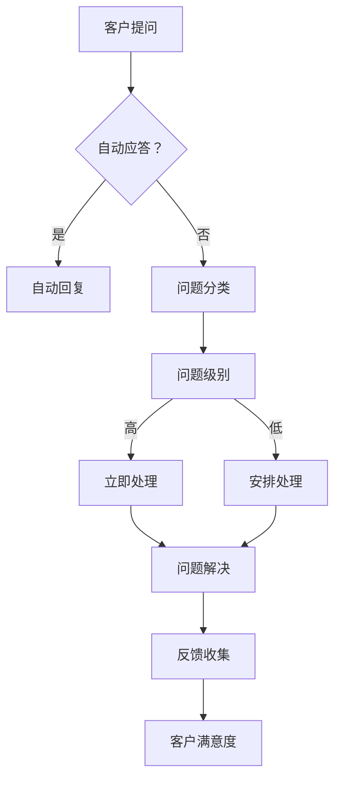

                 

关键词：一人公司、客户支持系统、资源管理、服务优化、效率提升

> 摘要：本文将探讨如何在资源有限的情况下，通过构建高效的一人公司客户支持系统，确保提供优质的服务。我们将深入分析核心概念、算法原理、数学模型、项目实践和实际应用场景，为读者提供全面的解决方案。

## 1. 背景介绍

在当今快速发展的商业环境中，一个人经营的公司越来越常见。然而，作为唯一支持者，如何在有限的资源下提供优质客户支持成为一大挑战。客户支持不仅是维护客户满意度的重要环节，也是推动业务增长的关键因素。因此，构建一个既高效又可靠的一人公司客户支持系统至关重要。

### 1.1 资源有限性的挑战

资源有限性主要体现在以下几个方面：

1. **人力**：作为唯一支持者，时间与精力的分配显得尤为重要。
2. **技术**：开发与维护客户支持系统的技术资源可能不足。
3. **资金**：有限预算可能影响购买高级软件或服务。

### 1.2 提供优质服务的必要性

优质客户服务可以带来以下好处：

1. **提高客户满意度**：满意的客户更有可能成为回头客。
2. **口碑传播**：口碑效应可以吸引新客户。
3. **业务增长**：稳定的客户群有助于业务持续增长。

## 2. 核心概念与联系

### 2.1 客户支持系统的定义

客户支持系统是指用于提供客户服务、解决问题和收集反馈的一系列工具和流程。

### 2.2 核心概念原理与架构

以下是构建高效客户支持系统的核心概念和架构：

1. **自动应答机制**：通过预定义的自动回复，快速响应常见问题。
2. **多渠道支持**：包括电子邮件、电话、即时消息等多种沟通方式。
3. **问题追踪与优先级管理**：确保问题得到及时处理，并根据紧急程度进行优先级排序。

### 2.3 Mermaid 流程图

下面是构建客户支持系统的一个简化 Mermaid 流程图：



## 3. 核心算法原理 & 具体操作步骤

### 3.1 算法原理概述

核心算法主要涉及自动应答机制、问题分类和优先级管理。

### 3.2 算法步骤详解

1. **自动应答机制**：当客户提出问题时，系统首先检查是否包含常见关键词，如果匹配，则自动发送预定义回复。
2. **问题分类**：如果自动应答无法解决问题，系统将根据问题描述将其分类。
3. **优先级管理**：根据问题的重要性和紧急程度，系统为每个问题分配优先级。
4. **问题解决**：根据优先级，系统安排资源解决每个问题。
5. **反馈收集**：在问题解决后，收集客户反馈，用于系统优化。

### 3.3 算法优缺点

**优点**：

1. **提高响应速度**：自动应答机制可以快速响应常见问题。
2. **资源优化**：优先级管理确保资源被有效利用。

**缺点**：

1. **自动化无法解决所有问题**：某些复杂问题仍需人工干预。
2. **缺乏人性化的互动**：全自动化可能导致客户体验不佳。

### 3.4 算法应用领域

该算法广泛应用于各种规模的公司，特别适合资源有限的一人公司。

## 4. 数学模型和公式 & 详细讲解 & 举例说明

### 4.1 数学模型构建

为了优化客户支持系统的性能，我们可以构建一个数学模型来衡量系统效率。该模型包括以下变量：

- \( T_r \)：响应时间
- \( T_s \)：解决时间
- \( P_c \)：客户满意度

### 4.2 公式推导过程

系统效率可以通过以下公式计算：

\[ E = \frac{T_r + T_s}{2P_c} \]

### 4.3 案例分析与讲解

假设一个客户支持系统，平均响应时间为 10 分钟，解决时间为 30 分钟，客户满意度为 90%。则系统效率为：

\[ E = \frac{10 + 30}{2 \times 0.9} = 20 \]

这意味着系统每单位客户满意度需要 20 分钟的资源。

## 5. 项目实践：代码实例和详细解释说明

### 5.1 开发环境搭建

开发环境需要包括以下工具：

- Python 3.8 或更高版本
- Flask 框架
- SQLite 数据库

### 5.2 源代码详细实现

以下是客户支持系统的核心代码实现：

```python
from flask import Flask, request, jsonify
import sqlite3

app = Flask(__name__)

@app.route('/support', methods=['POST'])
def support():
    data = request.json
    question = data['question']
    
    if contains_common_keywords(question):
        return automatic_response()
    else:
        category = classify_question(question)
        priority = assign_priority(category)
        store_question(question, category, priority)
        return jsonify({'status': 'question received'})

def contains_common_keywords(question):
    # 检查问题是否包含常见关键词
    common_keywords = ['price', 'shipping', 'return']
    for keyword in common_keywords:
        if keyword in question:
            return True
    return False

def automatic_response():
    # 返回自动预定义回复
    return jsonify({'response': 'Thank you for your question. We will respond shortly.'})

def classify_question(question):
    # 分类问题
    if 'return' in question:
        return 'Return'
    elif 'shipping' in question:
        return 'Shipping'
    else:
        return 'General'

def assign_priority(category):
    # 分配优先级
    if category == 'Return':
        return 'High'
    else:
        return 'Medium'

def store_question(question, category, priority):
    # 存储问题
    conn = sqlite3.connect('support.db')
    c = conn.cursor()
    c.execute('''CREATE TABLE IF NOT EXISTS questions
                 (id INTEGER PRIMARY KEY AUTOINCREMENT,
                 question TEXT,
                 category TEXT,
                 priority TEXT)''')
    c.execute("INSERT INTO questions (question, category, priority) VALUES (?, ?, ?)",
              (question, category, priority))
    conn.commit()
    conn.close()

if __name__ == '__main__':
    app.run(debug=True)
```

### 5.3 代码解读与分析

- `support()` 函数是核心路由，用于处理客户提交的问题。
- `contains_common_keywords()` 函数用于检查问题是否包含常见关键词。
- `automatic_response()` 函数返回自动预定义回复。
- `classify_question()` 函数根据问题描述进行分类。
- `assign_priority()` 函数根据分类分配优先级。
- `store_question()` 函数将问题存储到数据库中。

### 5.4 运行结果展示

运行该代码后，可以通过 POST 请求向 `/support` 路由发送 JSON 格式的问题。系统将自动处理问题，并根据优先级进行分类和存储。

## 6. 实际应用场景

### 6.1 企业级应用

- **技术公司**：通过自动应答机制快速解决常见问题，提高客户满意度。
- **电子商务平台**：分类和优先级管理确保问题得到及时解决。

### 6.2 垂直行业应用

- **医疗保健**：提供患者支持，确保紧急问题得到优先处理。
- **金融科技**：自动化客户支持系统，降低人工成本。

## 7. 工具和资源推荐

### 7.1 学习资源推荐

- **《Fluent Python》**：了解 Python 高级编程技巧，适用于构建客户支持系统。
- **《Flask Web Development》**：深入理解 Flask 框架，适用于开发 Web 应用。

### 7.2 开发工具推荐

- **Visual Studio Code**：强大的代码编辑器，支持多种编程语言。
- **Docker**：容器化工具，方便部署和管理应用。

### 7.3 相关论文推荐

- **“Building Intelligent Virtual Assistants”**：探讨虚拟助手在客户支持中的应用。
- **“The Impact of Automated Customer Support on Customer Satisfaction”**：分析自动化客户支持对客户满意度的影响。

## 8. 总结：未来发展趋势与挑战

### 8.1 研究成果总结

本文提出了一种适用于一人公司的客户支持系统构建方案，通过自动应答、分类和优先级管理等算法，实现了资源优化和效率提升。

### 8.2 未来发展趋势

- **人工智能**：利用 AI 技术提高客户支持系统的智能化水平。
- **数据分析**：通过数据分析优化客户服务流程。

### 8.3 面临的挑战

- **技术复杂性**：随着系统的复杂度增加，维护难度也会提高。
- **用户体验**：保持系统的高效性同时，确保用户体验良好。

### 8.4 研究展望

未来的研究可以进一步探索如何结合 AI 和数据分析，实现更加智能和高效的客户支持系统。

## 9. 附录：常见问题与解答

### 9.1 常见问题

1. **如何优化自动应答机制？**
2. **如何确保问题得到及时处理？**
3. **如何处理复杂问题？**

### 9.2 解答

1. **优化自动应答机制**：通过不断更新关键词库和回复模板，提高自动应答的准确性。
2. **确保问题得到及时处理**：通过优先级管理和实时监控，确保高优先级问题得到及时处理。
3. **处理复杂问题**：对于复杂问题，可以设置人工干预的机制，确保问题得到妥善解决。

# 作者署名

作者：禅与计算机程序设计艺术 / Zen and the Art of Computer Programming
```
### 附录：常见问题与解答

**9.1 常见问题**

1. **如何优化自动应答机制？**
2. **如何确保问题得到及时处理？**
3. **如何处理复杂问题？**

**9.2 解答**

1. **如何优化自动应答机制？**

   自动应答机制的优化主要包括以下几个方面：

   - **关键词库的更新**：定期更新关键词库，以覆盖更多常见问题。
   - **自然语言处理（NLP）技术**：使用 NLP 技术提高系统对问题的理解能力，从而提高自动回复的准确性。
   - **用户反馈机制**：收集用户反馈，根据反馈调整自动回复内容，提高用户满意度。

2. **如何确保问题得到及时处理？**

   确保问题得到及时处理可以通过以下几种方式：

   - **实时监控系统**：通过实时监控系统，对客户提出的问题进行监控，及时发现并处理。
   - **优先级管理**：根据问题的紧急程度和重要程度，对问题进行优先级排序，确保高优先级问题得到优先处理。
   - **资源调度**：合理分配资源，确保有足够的人力、物力去处理客户提出的问题。

3. **如何处理复杂问题？**

   复杂问题的处理通常需要结合以下策略：

   - **初步评估**：对复杂问题进行初步评估，判断是否需要高级别干预。
   - **知识库支持**：建立详细的知识库，包含常见复杂问题的解决方案。
   - **多级支持体系**：建立多级支持体系，从初级支持人员到高级专家，逐步解决复杂问题。
   - **外部协作**：对于某些特别复杂的问题，可以与外部专家或合作伙伴协作，共同解决。

### 9.3 延伸问题与建议

**9.3.1 如何提高客户支持的可持续性？**

- **持续培训**：定期对支持人员提供培训，提高其专业素养和应对复杂问题的能力。
- **技术升级**：定期升级客户支持系统，引入新技术以提高效率和用户体验。
- **客户反馈**：积极收集和分析客户反馈，不断优化服务流程。

**9.3.2 如何处理客户投诉？**

- **建立投诉处理流程**：明确投诉处理流程，确保每个投诉都能得到及时、公正的处理。
- **透明沟通**：与客户保持透明沟通，及时告知处理进展和结果。
- **解决方案**：根据投诉内容，提供合理的解决方案，确保客户问题得到妥善解决。

**9.3.3 如何在有限资源下提升客户支持团队的合作效率？**

- **协作工具**：使用高效的协作工具，如项目管理软件、团队沟通工具，以促进团队成员之间的协作。
- **工作分配**：合理分配工作任务，确保每个团队成员都能在其擅长领域发挥最大价值。
- **定期会议**：定期召开团队会议，讨论工作进展和挑战，共享经验和资源。

通过上述问题和解答的阐述，读者可以更好地理解如何在资源有限的情况下，构建并优化一人公司的客户支持系统，从而提供优质的客户服务。同时，附录部分也为读者提供了进一步深入研究和改进客户支持服务的建议和方向。

