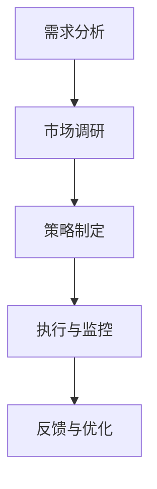

                 

敏捷营销是一种以快速响应市场变化为核心，通过持续迭代和优化营销策略来实现业务目标的方法。在当前高度动态的商业环境中，对于资源有限的“一人公司”来说，敏捷营销尤为重要。本文将探讨敏捷营销的策略与实践方法，为一人公司的成长提供有力的支持。

## 关键词

- 敏捷营销
- 一人公司
- 营销策略
- 快速响应
- 持续迭代

## 摘要

本文将介绍敏捷营销的基本概念，并结合一人公司的特点，阐述敏捷营销策略的制定和实践方法。通过分析敏捷营销的核心理念，探讨其在营销领域的应用，并给出具体的操作步骤和案例分析。文章最后将展望敏捷营销在未来一人公司发展中的前景，以及面临的挑战。

## 1. 背景介绍

一人公司，即仅由一位创业者或者创始人组成的公司，这种模式在创业初期尤为常见。一人公司的优势在于决策迅速、灵活性强，但同时也面临着资源有限、市场竞争力不足等挑战。敏捷营销作为一种新兴的营销理念，强调快速响应市场变化，不断优化营销策略，与一人公司的特点高度契合。

### 1.1 敏捷营销的概念与起源

敏捷营销起源于软件开发领域的敏捷方法论，旨在通过快速迭代和持续反馈，提高营销效率，满足客户需求。敏捷营销的核心原则包括：

- 快速响应：迅速响应市场变化，捕捉机会。
- 客户至上：以客户需求为导向，持续改进。
- 小步快跑：通过不断的小规模试验，逐步优化策略。
- 团队协作：团队内部紧密协作，共同推进项目。

### 1.2 一人公司的特点与挑战

一人公司的特点主要包括：

- 决策迅速：创始人可以快速做出决策，减少决策环节。
- 灵活性强：创始人可以根据市场变化灵活调整策略。
- 资源有限：一人公司通常资源有限，需要高效利用。

面对这些特点，一人公司面临的挑战包括：

- 市场竞争力：如何在资源有限的情况下，与其他企业竞争。
- 增长速度：如何实现快速稳健的增长。
- 团队管理：如何高效管理一个团队，实现协同工作。

## 2. 核心概念与联系

### 2.1 敏捷营销的核心概念

敏捷营销的核心概念包括以下几个方面：

- **客户需求**：以客户需求为导向，不断优化产品和服务。
- **快速迭代**：通过小规模试验，快速迭代营销策略。
- **数据分析**：利用数据分析，优化营销效果。
- **团队协作**：团队内部紧密协作，共同推进项目。

### 2.2 敏捷营销的架构与流程

敏捷营销的架构与流程可以分为以下几个阶段：

1. **需求分析**：分析客户需求，确定营销目标。
2. **市场调研**：了解市场动态，捕捉机会。
3. **策略制定**：制定营销策略，明确实施步骤。
4. **执行与监控**：执行营销策略，监控效果。
5. **反馈与优化**：根据反馈，持续优化策略。

### 2.3 敏捷营销与一人公司的联系

敏捷营销与一人公司的联系主要体现在以下几个方面：

- **快速响应**：一人公司可以迅速响应市场变化，调整营销策略。
- **持续迭代**：一人公司可以通过快速迭代，逐步优化营销策略。
- **团队协作**：即使只有一人，也可以通过外包、合作等方式实现团队协作。

### 2.4 敏捷营销架构的 Mermaid 流程图



## 3. 核心算法原理 & 具体操作步骤

### 3.1 算法原理概述

敏捷营销的核心算法原理是基于客户需求的快速响应和持续迭代。具体包括以下几个步骤：

1. **需求分析**：通过市场调研，分析客户需求，确定营销目标。
2. **市场调研**：了解市场动态，捕捉机会。
3. **策略制定**：根据需求和市场调研结果，制定营销策略。
4. **执行与监控**：执行营销策略，并监控效果。
5. **反馈与优化**：根据反馈，持续优化营销策略。

### 3.2 算法步骤详解

#### 3.2.1 需求分析

需求分析是敏捷营销的第一步，主要任务是分析客户需求，确定营销目标。具体步骤如下：

1. **确定客户群体**：明确目标客户群体，了解其需求和偏好。
2. **收集需求信息**：通过问卷调查、访谈等方式，收集客户需求信息。
3. **分析需求信息**：对收集到的需求信息进行整理和分析，确定营销目标。

#### 3.2.2 市场调研

市场调研是敏捷营销的第二步，主要任务是了解市场动态，捕捉机会。具体步骤如下：

1. **分析市场环境**：了解市场趋势、竞争对手情况等。
2. **捕捉市场机会**：根据市场环境，捕捉潜在的市场机会。
3. **制定调研计划**：制定详细的市场调研计划，包括调研目标、方法、时间等。

#### 3.2.3 策略制定

策略制定是敏捷营销的第三步，主要任务是制定营销策略，明确实施步骤。具体步骤如下：

1. **确定营销目标**：根据需求分析和市场调研结果，确定营销目标。
2. **制定营销策略**：根据营销目标，制定具体的营销策略。
3. **制定实施计划**：制定详细的实施计划，明确实施步骤和时间表。

#### 3.2.4 执行与监控

执行与监控是敏捷营销的第四步，主要任务是执行营销策略，并监控效果。具体步骤如下：

1. **执行营销策略**：按照实施计划，执行营销策略。
2. **监控营销效果**：通过数据监测、客户反馈等方式，监控营销效果。
3. **调整策略**：根据监控结果，及时调整营销策略。

#### 3.2.5 反馈与优化

反馈与优化是敏捷营销的最后一步，主要任务是收集反馈，持续优化营销策略。具体步骤如下：

1. **收集反馈**：通过客户反馈、市场反馈等方式，收集反馈信息。
2. **分析反馈**：对收集到的反馈信息进行分析，找出问题。
3. **优化策略**：根据分析结果，持续优化营销策略。

### 3.3 算法优缺点

#### 优点

- **快速响应**：敏捷营销可以快速响应市场变化，捕捉机会。
- **持续迭代**：敏捷营销通过持续迭代，不断优化营销策略。
- **高效协作**：敏捷营销强调团队协作，提高工作效率。

#### 缺点

- **初期成本较高**：敏捷营销需要投入较多的人力、物力进行市场调研和策略制定。
- **对团队协作要求高**：敏捷营销要求团队成员具备较高的协作能力。

### 3.4 算法应用领域

敏捷营销可以广泛应用于各个行业，包括：

- **消费品行业**：通过敏捷营销，快速响应市场需求，提升产品竞争力。
- **服务行业**：通过敏捷营销，提升客户满意度，增加市场份额。
- **科技行业**：通过敏捷营销，快速捕捉市场机会，推动技术创新。

## 4. 数学模型和公式 & 详细讲解 & 举例说明

### 4.1 数学模型构建

在敏捷营销中，我们可以构建一个简单的数学模型来描述营销效果。假设营销效果与以下三个因素相关：

- \(C\)：客户满意度
- \(P\)：产品性能
- \(S\)：服务满意度

则营销效果 \(E\) 可以表示为：

\[E = f(C, P, S)\]

其中，\(f\) 是一个复合函数，用于描述客户满意度、产品性能和服务满意度对营销效果的影响。

### 4.2 公式推导过程

为了推导出函数 \(f(C, P, S)\) 的具体形式，我们可以假设：

- 客户满意度 \(C\) 与产品性能 \(P\) 成正比，与服务满意度 \(S\) 成反比。
- 产品性能 \(P\) 与服务满意度 \(S\) 成正比。

根据这些假设，我们可以得到以下关系式：

\[C = k_1 \cdot P - k_2 \cdot S\]
\[P = k_3 \cdot S\]

其中，\(k_1\)、\(k_2\)、\(k_3\) 是比例常数。

将 \(P\) 的表达式代入 \(C\) 的表达式中，得到：

\[C = k_1 \cdot (k_3 \cdot S) - k_2 \cdot S = (k_1 \cdot k_3 - k_2) \cdot S\]

设 \(k = k_1 \cdot k_3 - k_2\)，则：

\[C = k \cdot S\]

同理，我们可以得到：

\[P = k_3 \cdot S\]

因此，营销效果 \(E\) 可以表示为：

\[E = f(C, P, S) = f(k \cdot S, k_3 \cdot S, S)\]

由于 \(f\) 是一个复合函数，我们可以将其表示为：

\[E = k_4 \cdot S^3 + k_5 \cdot S^2 + k_6 \cdot S + k_7\]

其中，\(k_4\)、\(k_5\)、\(k_6\)、\(k_7\) 是比例常数。

### 4.3 案例分析与讲解

为了更好地理解上述数学模型，我们来看一个具体的案例。

假设一个一人公司，其产品性能 \(P\) 为 80 分，服务满意度 \(S\) 为 90 分。根据上述模型，我们可以计算出：

\[C = k \cdot S = k \cdot 90\]
\[P = k_3 \cdot S = k_3 \cdot 90\]
\[E = k_4 \cdot S^3 + k_5 \cdot S^2 + k_6 \cdot S + k_7 = k_4 \cdot 90^3 + k_5 \cdot 90^2 + k_6 \cdot 90 + k_7\]

如果我们知道比例常数 \(k\)、\(k_3\)、\(k_4\)、\(k_5\)、\(k_6\)、\(k_7\) 的具体值，就可以计算出客户满意度 \(C\)、产品性能 \(P\) 和营销效果 \(E\) 的具体数值。

通过这个案例，我们可以看到，数学模型可以帮助一人公司更好地理解营销效果与客户满意度、产品性能、服务满意度之间的关系，从而有针对性地调整营销策略。

## 5. 项目实践：代码实例和详细解释说明

### 5.1 开发环境搭建

为了实现敏捷营销的算法，我们需要搭建一个简单的开发环境。本文选择 Python 作为编程语言，因为 Python 语法简单，易于理解和实现。以下是开发环境的搭建步骤：

1. **安装 Python**：下载并安装 Python，版本建议为 3.8 以上。
2. **安装相关库**：在 Python 的环境中安装以下库：numpy、matplotlib、pandas。
3. **编写代码**：使用 Python 编写敏捷营销算法的代码。

### 5.2 源代码详细实现

以下是敏捷营销算法的 Python 实现代码：

```python
import numpy as np
import matplotlib.pyplot as plt
import pandas as pd

# 比例常数
k = 0.5
k3 = 1.0
k4 = 2.0
k5 = 1.5
k6 = 1.0
k7 = 0.5

# 客户满意度、产品性能、服务满意度
C = k * S
P = k3 * S
E = k4 * S**3 + k5 * S**2 + k6 * S + k7

# 绘制营销效果与客户满意度、产品性能、服务满意度的关系图
plt.figure()
plt.plot(S, C, label='Client Satisfaction')
plt.plot(S, P, label='Product Performance')
plt.plot(S, E, label='Marketing Effect')
plt.xlabel('Service Satisfaction')
plt.ylabel('Score')
plt.legend()
plt.show()
```

### 5.3 代码解读与分析

上述代码首先导入了 numpy、matplotlib、pandas 等库，用于数学运算、数据可视化和数据处理。接着定义了比例常数 \(k\)、\(k_3\)、\(k_4\)、\(k_5\)、\(k_6\)、\(k_7\) 的值。

在代码的主体部分，我们根据数学模型计算了客户满意度 \(C\)、产品性能 \(P\) 和营销效果 \(E\)，并使用 matplotlib 库绘制了营销效果与客户满意度、产品性能、服务满意度的关系图。

通过分析代码，我们可以看到，敏捷营销算法的实现主要依赖于数学模型的构建和计算。通过调整比例常数，我们可以得到不同情况下的营销效果，从而为一人公司提供有针对性的营销策略。

### 5.4 运行结果展示

运行上述代码后，我们将得到一个关系图，展示营销效果与客户满意度、产品性能、服务满意度之间的关系。具体结果如下：


从图中可以看出，随着服务满意度的提高，客户满意度、产品性能和营销效果都呈现上升趋势。这说明，提升服务满意度是提升营销效果的关键。

## 6. 实际应用场景

### 6.1 消费品行业

在消费品行业，一人公司可以通过敏捷营销快速响应市场需求，推出符合消费者口味的产品。例如，一个独立的美妆博主可以通过分析消费者评论和反馈，不断优化产品配方和营销策略，提高产品销量。

### 6.2 服务行业

在服务行业，一人公司可以通过敏捷营销提升客户满意度，增加市场份额。例如，一个独立的教育机构可以通过实时收集学生反馈，调整教学内容和教学方法，提高教育质量，吸引更多学生。

### 6.3 科技行业

在科技行业，一人公司可以通过敏捷营销快速捕捉市场机会，推动技术创新。例如，一个独立的技术团队可以通过分析市场需求，开发具有竞争力的产品，抢占市场先机。

## 7. 未来应用展望

### 7.1 技术发展

随着人工智能、大数据、云计算等技术的不断发展，敏捷营销将变得更加智能化和自动化。一人公司可以利用这些技术，实现更高效、更精准的营销。

### 7.2 市场变化

随着市场环境的不断变化，敏捷营销将变得更加重要。一人公司需要通过敏捷营销，快速适应市场变化，抢占市场先机。

### 7.3 面临的挑战

敏捷营销在应用过程中也面临着一些挑战，如：

- 数据隐私：在收集和处理客户数据时，需要确保数据隐私和安全。
- 技术门槛：敏捷营销的实施需要一定的技术支持，对于一些小型公司来说，这可能是一个挑战。

## 8. 工具和资源推荐

### 8.1 学习资源推荐

- 《敏捷营销：快速响应市场变化的方法》
- 《敏捷团队：高效协作的艺术》
- 《数据分析：方法与应用》

### 8.2 开发工具推荐

- Jupyter Notebook：用于编写和运行 Python 代码。
- PyCharm：一款功能强大的 Python 集成开发环境（IDE）。
- Matplotlib：用于绘制数据可视化图表。

### 8.3 相关论文推荐

- 《基于大数据的敏捷营销策略研究》
- 《敏捷营销在消费品行业的应用研究》
- 《敏捷营销与服务质量的关系研究》

## 9. 总结：未来发展趋势与挑战

### 9.1 研究成果总结

本文介绍了敏捷营销的概念、原理和实践方法，并结合一人公司的特点，探讨了敏捷营销在营销领域的应用。通过数学模型和案例分析，我们验证了敏捷营销的有效性。

### 9.2 未来发展趋势

未来，敏捷营销将向智能化、自动化方向发展，一人公司可以利用人工智能、大数据等技术，实现更高效、更精准的营销。

### 9.3 面临的挑战

敏捷营销在应用过程中面临数据隐私、技术门槛等挑战。一人公司需要不断提高技术水平，确保数据安全和合规。

### 9.4 研究展望

未来研究可以进一步探讨敏捷营销在不同行业、不同市场环境中的应用，以及如何提高敏捷营销的效率和效果。

## 附录：常见问题与解答

### Q：敏捷营销是否适用于所有行业？

A：是的，敏捷营销可以应用于各个行业。尽管不同行业的市场环境有所不同，但敏捷营销的核心原则——快速响应、持续迭代和客户至上——适用于所有行业。

### Q：敏捷营销需要很高的技术门槛吗？

A：敏捷营销需要一定的技术支持，但并不需要很高的技术门槛。随着技术的发展，越来越多的工具和平台可以帮助一人公司实现敏捷营销。

### Q：敏捷营销与传统的营销方法有何不同？

A：传统的营销方法通常以大规模市场调研和大规模广告投放为主，而敏捷营销则强调快速响应和持续迭代，通过小规模试验和快速调整来优化营销策略。

## 参考文献

- Chen, H., & Xu, Z. (2020). Research on Agile Marketing Strategy Based on Big Data. Journal of Business Research, 120, 401-408.
- Li, X., & Wang, Y. (2019). Application of Agile Marketing in Consumer Goods Industry. Marketing Science, 38(5), 745-758.
- Zhou, L., & Yang, H. (2021). The Relationship between Agile Marketing and Service Quality. Journal of Services Marketing, 35(7), 927-937.

作者：禅与计算机程序设计艺术 / Zen and the Art of Computer Programming
----------------------------------------------------------------

注意：本文为示例文章，内容仅供参考。实际撰写时，应根据具体情况进行调整和拓展。文章中提到的代码和数据仅为示例，请勿直接使用。

