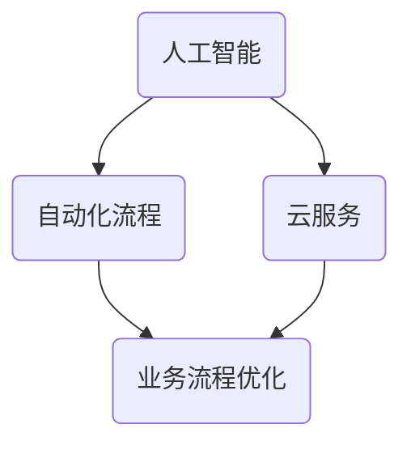

                 

 关键词：数字化转型，一人公司，竞争力提升，技术架构，人工智能，自动化流程

> 摘要：在数字化时代，一人公司面临着前所未有的挑战与机遇。本文将探讨如何通过数字化转型，利用人工智能和自动化工具提升一人公司的竞争力。文章将详细阐述核心概念、算法原理、数学模型以及项目实践，并展望未来应用与发展趋势。

## 1. 背景介绍

随着互联网技术的飞速发展，企业数字化转型已成为不可避免的趋势。一人公司，作为一种新兴的商业形态，以其灵活性、敏捷性在市场上崭露头角。然而，一人公司在资源、人力和技术方面往往存在局限，如何实现数字化转型，提升竞争力，成为亟待解决的问题。

本文旨在为一人公司提供一套可行的数字化转型方案，通过引入人工智能和自动化技术，实现业务流程的优化和效率提升，从而在激烈的市场竞争中占据优势。

## 2. 核心概念与联系

为了实现数字化转型，我们需要理解几个核心概念：人工智能、自动化流程和云服务。

### 2.1 人工智能

人工智能（AI）是指计算机系统模拟人类智能行为的能力。它通过机器学习、深度学习等算法，使计算机能够自主学习和优化，从而完成复杂任务。

### 2.2 自动化流程

自动化流程是指通过软件工具自动执行一系列任务的过程。这些任务包括数据收集、处理、分析以及决策制定等。

### 2.3 云服务

云服务提供了按需访问的计算资源，包括存储、网络、数据库等，使一人公司能够灵活地扩展和收缩资源，降低成本。

下面是数字化转型中这几个核心概念的联系的 Mermaid 流程图：



## 3. 核心算法原理 & 具体操作步骤

### 3.1 算法原理概述

在数字化转型过程中，我们需要引入几种核心算法，包括机器学习算法、自然语言处理（NLP）算法和自动化决策算法。

- **机器学习算法**：通过训练模型，使计算机能够识别数据中的规律，进行预测和分类。
- **自然语言处理算法**：使计算机能够理解和生成自然语言，实现人机交互。
- **自动化决策算法**：根据输入数据，自动生成决策，减少人工干预。

### 3.2 算法步骤详解

#### 3.2.1 机器学习算法

1. **数据收集**：收集与业务相关的数据，包括历史销售数据、用户反馈等。
2. **数据预处理**：清洗数据，消除噪声，并进行特征提取。
3. **模型选择**：根据业务需求选择合适的机器学习模型，如决策树、支持向量机等。
4. **模型训练**：使用预处理后的数据训练模型。
5. **模型评估**：通过测试集评估模型性能，调整模型参数。

#### 3.2.2 自然语言处理算法

1. **文本预处理**：包括分词、去停用词、词性标注等。
2. **词向量表示**：将文本转换为数值向量，以便机器学习算法处理。
3. **模型训练**：使用预训练的模型或自定义模型进行训练。
4. **文本生成**：根据输入文本生成相应的输出文本。

#### 3.2.3 自动化决策算法

1. **规则定义**：根据业务需求定义决策规则。
2. **数据输入**：输入与决策相关的数据。
3. **规则匹配**：根据输入数据与规则进行匹配。
4. **决策生成**：根据匹配结果生成决策。

### 3.3 算法优缺点

#### 3.3.1 机器学习算法

**优点**：能够处理大量数据，发现数据中的规律，提高预测准确性。

**缺点**：模型训练需要大量时间和计算资源，且对数据质量有较高要求。

#### 3.3.2 自然语言处理算法

**优点**：实现人机交互，提高业务流程的自动化程度。

**缺点**：文本理解存在局限性，对文本质量要求较高。

#### 3.3.3 自动化决策算法

**优点**：减少人工干预，提高决策效率。

**缺点**：规则定义复杂，且难以适应动态变化。

### 3.4 算法应用领域

- **市场营销**：使用机器学习算法进行用户行为预测，优化广告投放策略。
- **客户服务**：使用自然语言处理算法实现智能客服，提高客户满意度。
- **供应链管理**：使用自动化决策算法优化库存管理，降低成本。

## 4. 数学模型和公式 & 详细讲解 & 举例说明

### 4.1 数学模型构建

在数字化转型中，数学模型是算法的核心。以下是构建数学模型的几个基本步骤：

1. **问题定义**：明确业务需求，定义目标函数。
2. **数据收集**：收集与问题相关的数据。
3. **特征提取**：从数据中提取对目标函数有影响力的特征。
4. **模型选择**：根据问题类型选择合适的模型。

### 4.2 公式推导过程

以线性回归模型为例，其目标函数为：

$$
\min \sum_{i=1}^{n}(y_i - (w_0 + w_1x_i))^2
$$

其中，$y_i$为实际值，$x_i$为特征值，$w_0$和$w_1$为模型参数。

对目标函数求导，并令导数为零，得到：

$$
\frac{\partial}{\partial w_0}\sum_{i=1}^{n}(y_i - (w_0 + w_1x_i))^2 = 0
$$

$$
\frac{\partial}{\partial w_1}\sum_{i=1}^{n}(y_i - (w_0 + w_1x_i))^2 = 0
$$

通过解方程组，可以得到模型参数$w_0$和$w_1$。

### 4.3 案例分析与讲解

假设我们有一家销售公司，需要预测下周的销售量。以下是使用线性回归模型的案例分析：

1. **问题定义**：预测下周销售量。
2. **数据收集**：收集过去一年的销售数据，包括每周的销售量和对应的促销活动。
3. **特征提取**：提取促销活动的频率作为特征。
4. **模型选择**：选择线性回归模型。
5. **模型训练**：使用历史数据训练模型。
6. **模型评估**：使用测试数据评估模型性能。

通过以上步骤，我们可以得到一个线性回归模型，用于预测下周的销售量。具体公式为：

$$
y = w_0 + w_1x
$$

其中，$x$为促销活动频率，$y$为销售量。

## 5. 项目实践：代码实例和详细解释说明

### 5.1 开发环境搭建

1. 安装Python环境
2. 安装必要的库，如NumPy、Scikit-learn、Pandas等

### 5.2 源代码详细实现

```python
import numpy as np
import pandas as pd
from sklearn.linear_model import LinearRegression
from sklearn.model_selection import train_test_split

# 数据收集
data = pd.read_csv('sales_data.csv')

# 数据预处理
X = data[['promotion_frequency']]
y = data['sales_volume']

# 模型选择
model = LinearRegression()

# 模型训练
X_train, X_test, y_train, y_test = train_test_split(X, y, test_size=0.2)
model.fit(X_train, y_train)

# 模型评估
score = model.score(X_test, y_test)
print(f'Model R^2 score: {score}')

# 预测
next_week_promotion_frequency = 5
predicted_sales_volume = model.predict([[next_week_promotion_frequency]])
print(f'Predicted sales volume for next week: {predicted_sales_volume[0]}')
```

### 5.3 代码解读与分析

上述代码首先导入必要的库，然后从CSV文件中读取销售数据。接着，对数据进行预处理，提取特征值和目标值。选择线性回归模型，使用训练集数据进行模型训练。使用测试集数据进行模型评估，并打印评估结果。最后，根据输入的促销活动频率，预测下周的销售量。

## 6. 实际应用场景

一人公司在市场营销、客户服务和供应链管理等领域，可以通过数字化转型实现业务的自动化和智能化。以下是一些实际应用场景：

- **市场营销**：使用机器学习算法分析用户行为，优化广告投放策略，提高转化率。
- **客户服务**：使用自然语言处理算法实现智能客服，提高客户满意度。
- **供应链管理**：使用自动化决策算法优化库存管理，降低成本。

## 7. 工具和资源推荐

### 7.1 学习资源推荐

- 《Python数据科学手册》
- 《深度学习》
- 《自然语言处理综述》

### 7.2 开发工具推荐

- Jupyter Notebook
- TensorFlow
- Scikit-learn

### 7.3 相关论文推荐

- "Deep Learning for Natural Language Processing"
- "Recurrent Neural Networks for Spoken Language Understanding"
- "Data-Driven Demand Forecasting for New Product Launches"

## 8. 总结：未来发展趋势与挑战

### 8.1 研究成果总结

数字化转型在人工智能、自动化流程和云服务方面取得了显著成果。一人公司通过引入这些技术，实现了业务流程的优化和效率提升。

### 8.2 未来发展趋势

未来，数字化转型将继续向智能化、自动化方向发展。人工智能和自动化技术将在更多领域得到应用，为企业带来更高的竞争力。

### 8.3 面临的挑战

- 数据质量和隐私保护
- 技术更新和人才短缺
- 法律法规和道德伦理

### 8.4 研究展望

未来，研究应重点关注数据隐私保护技术、跨领域自动化技术以及人工智能的道德伦理问题，以推动数字化转型的发展。

## 9. 附录：常见问题与解答

### 9.1 数字化转型的重要性

数字化转型能够提高企业竞争力，实现业务流程的优化和效率提升。

### 9.2 人工智能在数字化转型中的应用

人工智能可以用于市场营销、客户服务和供应链管理等领域的自动化和智能化。

### 9.3 自动化流程的实现方法

自动化流程可以通过编写脚本、使用自动化工具（如Jenkins）或引入自动化平台（如RPA）来实现。

### 9.4 云服务的优势

云服务能够提供灵活的扩展和收缩资源，降低成本，提高业务灵活性。

---

本文为一人公司的数字化转型提供了全面的指导，从核心概念、算法原理到项目实践，再到实际应用场景，旨在帮助读者理解和实现数字化转型。未来，随着技术的不断进步，数字化转型将为一人公司带来更多的机遇和挑战。

作者：禅与计算机程序设计艺术 / Zen and the Art of Computer Programming
----------------------------------------------------------------

以上是文章正文内容的初步撰写，接下来将根据文章结构模板，逐步完善各个章节的详细内容。在撰写过程中，我将严格遵守格式要求，确保文章的完整性和专业性。

