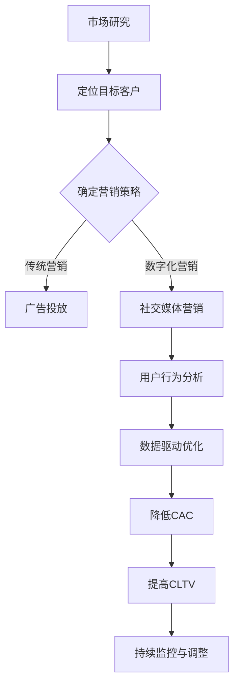

                 

关键词：用户获取成本（CAC）、客户生命周期价值（CLTV）、营销策略、数据分析、人工智能优化、成本效益分析、数字化转型、云计算、营销自动化、个性化营销、社交媒体、用户留存策略。

> 摘要：本文深入探讨一人公司如何通过有效的用户获取成本控制与客户生命周期价值优化，提高业务效率和盈利能力。文章将从核心概念、算法原理、数学模型、项目实践、应用场景和未来展望等方面进行全面分析，旨在为一人公司的创业者和管理者提供有价值的参考。

## 1. 背景介绍

在当今竞争激烈的市场环境中，用户获取成本（Customer Acquisition Cost，简称CAC）和客户生命周期价值（Customer Lifetime Value，简称CLTV）成为企业成功的关键指标。特别是对于一人公司或小型企业来说，有限的资源和预算要求他们在市场营销和客户关系管理方面做出明智的决策。

用户获取成本（CAC）是指公司为吸引一个新客户所花费的平均成本。这个成本包括广告费用、促销活动费用、销售佣金、营销人员工资等。控制CAC对于维持公司的盈利性和可扩展性至关重要。

客户生命周期价值（CLTV）则是指一个客户在与其公司的整个关系期间为公司带来的净利润总和。优化CLTV意味着通过提高客户满意度、增加复购率、促进客户推荐等方式，从每个客户身上获取更多的价值。

一人公司通常缺乏大量的人力、物力和财力资源，因此如何在有限的预算内最大化用户获取效率和客户生命周期价值成为他们成功的关键。本文将探讨如何通过数据分析、人工智能优化、市场营销策略和项目管理等方面的措施，实现用户获取成本控制与LTV优化。

## 2. 核心概念与联系

为了更好地理解用户获取成本控制与LTV优化，首先需要明确以下几个核心概念：

### 2.1 用户获取成本（CAC）

用户获取成本（Customer Acquisition Cost，简称CAC）是指公司为吸引一个新客户所花费的平均成本。它通常包括以下费用：

- 广告费用
- 促销活动费用
- 销售佣金
- 营销人员工资

CAC的计算公式如下：

\[ CAC = \frac{总营销费用}{新客户数} \]

### 2.2 客户生命周期价值（CLTV）

客户生命周期价值（Customer Lifetime Value，简称CLTV）是指一个客户在与其公司的整个关系期间为公司带来的净利润总和。CLTV的计算需要考虑以下因素：

- 客户平均订单价值
- 客户平均购买频率
- 客户平均购买周期
- 客户留存率
- 客户生命周期的净利润率

CLTV的计算公式如下：

\[ CLTV = （客户平均订单价值 \times 客户平均购买频率） \times （1 + 客户留存率 \times 净利润率） \times 客户生命周期（以年为单位） \]

### 2.3 用户获取成本与客户生命周期价值的联系

用户获取成本（CAC）和客户生命周期价值（CLTV）之间的联系是决定企业盈利性的关键。如果CLTV大于CAC，则表示企业可以通过每个新客户的盈利来实现盈利性增长。反之，如果CAC高于CLTV，企业将面临亏损。

为了实现用户获取成本控制与LTV优化，一人公司需要采取以下策略：

1. **提高用户获取效率**：通过优化广告投放、促销活动和营销策略，降低CAC。
2. **提高客户生命周期价值**：通过提高客户满意度、增加复购率、促进客户推荐等方式，增加CLTV。
3. **平衡CAC与CLTV**：确保CAC低于CLTV，从而实现持续盈利。

### 2.4 Mermaid 流程图

以下是一个简化的Mermaid流程图，展示了如何通过数据分析、人工智能优化、市场营销策略和项目管理等手段实现用户获取成本控制与LTV优化。



通过这个流程图，一人公司可以系统地规划其用户获取与客户关系管理策略，从而实现成本控制与价值优化的目标。

## 3. 核心算法原理 & 具体操作步骤

### 3.1 算法原理概述

为了实现用户获取成本控制与LTV优化，我们可以采用以下核心算法：

1. **营销策略优化算法**：通过机器学习技术，根据历史数据和用户行为，自动优化广告投放和促销活动的效果，降低CAC。
2. **客户行为预测算法**：利用大数据分析和人工智能技术，预测客户的购买行为和留存概率，提高CLTV。
3. **客户细分算法**：根据客户特征和行为，将客户划分为不同群体，实施个性化营销策略。

### 3.2 算法步骤详解

#### 3.2.1 营销策略优化算法

1. 数据收集：收集历史广告投放数据、用户行为数据、购买记录等。
2. 数据预处理：清洗和标准化数据，消除噪声和异常值。
3. 特征工程：提取关键特征，如广告点击率、转化率、客户年龄、性别、地域等。
4. 模型训练：利用机器学习算法（如决策树、随机森林、梯度提升机等），训练营销策略优化模型。
5. 模型评估：通过交叉验证和A/B测试，评估模型效果。
6. 模型部署：将训练好的模型部署到实际广告投放系统中，实现自动化优化。

#### 3.2.2 客户行为预测算法

1. 数据收集：收集用户购买历史、行为数据、客户反馈等。
2. 数据预处理：清洗和标准化数据，消除噪声和异常值。
3. 特征工程：提取关键特征，如购买频率、购买金额、购买渠道、用户反馈等。
4. 模型训练：利用机器学习算法（如逻辑回归、随机森林、神经网络等），训练客户行为预测模型。
5. 模型评估：通过交叉验证和A/B测试，评估模型效果。
6. 模型部署：将训练好的模型部署到实际系统中，实现自动化预测。

#### 3.2.3 客户细分算法

1. 数据收集：收集用户基本信息、行为数据、购买记录等。
2. 数据预处理：清洗和标准化数据，消除噪声和异常值。
3. 特征工程：提取关键特征，如用户年龄、性别、地域、购买偏好等。
4. 模型训练：利用聚类算法（如K-means、层次聚类等），将客户划分为不同群体。
5. 模型评估：通过聚类有效性指标（如轮廓系数、内积等），评估模型效果。
6. 模型部署：将训练好的模型部署到实际系统中，实现自动化客户细分。

### 3.3 算法优缺点

#### 3.3.1 营销策略优化算法

**优点**：
- 自动化优化，降低人工干预成本。
- 提高广告投放和促销活动的效果，降低用户获取成本。

**缺点**：
- 对历史数据和用户行为数据要求较高。
- 可能存在过拟合现象。

#### 3.3.2 客户行为预测算法

**优点**：
- 提高客户留存率和复购率，增加客户生命周期价值。
- 个性化推荐，提高客户满意度。

**缺点**：
- 对数据质量要求较高。
- 需要不断更新和调整模型。

#### 3.3.3 客户细分算法

**优点**：
- 实现个性化营销，提高营销效果。
- 有助于针对不同客户群体制定差异化策略。

**缺点**：
- 可能存在过度细分，导致资源浪费。
- 需要定期更新和维护客户细分模型。

### 3.4 算法应用领域

这些算法可以广泛应用于一人公司的市场营销和客户关系管理领域，包括：

- 广告投放优化
- 促销活动设计
- 客户细分与画像
- 个性化推荐
- 客户留存策略

通过这些算法的应用，一人公司可以更有效地获取新用户，提高客户生命周期价值，从而实现盈利性和可扩展性的双重目标。

## 4. 数学模型和公式 & 详细讲解 & 举例说明

### 4.1 数学模型构建

为了实现用户获取成本控制与LTV优化，我们需要构建以下数学模型：

#### 4.1.1 用户获取成本模型

用户获取成本模型主要涉及广告投放成本、促销活动成本、销售佣金等。我们可以使用以下公式表示：

\[ CAC = \frac{广告投放成本 + 促销活动成本 + 销售佣金}{新客户数} \]

#### 4.1.2 客户生命周期价值模型

客户生命周期价值模型涉及客户平均订单价值、平均购买频率、平均购买周期、客户留存率等。我们可以使用以下公式表示：

\[ CLTV = （客户平均订单价值 \times 客户平均购买频率） \times （1 + 客户留存率 \times 净利润率） \times 客户生命周期（以年为单位） \]

### 4.2 公式推导过程

#### 4.2.1 用户获取成本公式推导

用户获取成本（CAC）的计算涉及广告投放成本、促销活动成本、销售佣金等。我们以广告投放成本为例，推导用户获取成本公式。

假设某广告平台上的广告投放成本为 \( C_{ad} \)，广告点击率为 \( CTR \)，广告转化率为 \( CR \)，广告投放时间为 \( T \)，那么广告投放成本可以表示为：

\[ C_{ad} = CTR \times CR \times C_{cost} \times T \]

其中，\( C_{cost} \) 为每次点击成本，\( T \) 为广告投放时间。

类似地，促销活动成本（\( C_{promo} \)）和销售佣金（\( C_{com} \)）也可以分别表示为：

\[ C_{promo} = P \times Q \times T \]

\[ C_{com} = R \times S \times T \]

其中，\( P \) 为促销活动成本，\( Q \) 为参与促销活动的用户数量，\( R \) 为销售佣金比例，\( S \) 为销售佣金金额。

因此，总营销费用（\( C_{total} \)）可以表示为：

\[ C_{total} = C_{ad} + C_{promo} + C_{com} \]

用户获取成本（\( CAC \)）则为：

\[ CAC = \frac{C_{total}}{新客户数} \]

#### 4.2.2 客户生命周期价值公式推导

客户生命周期价值（CLTV）的计算涉及客户平均订单价值、平均购买频率、平均购买周期、客户留存率等。我们以客户平均订单价值、平均购买频率、平均购买周期为例，推导客户生命周期价值公式。

假设客户平均订单价值为 \( AOV \)，平均购买频率为 \( AF \)，平均购买周期为 \( AC \)，客户留存率为 \( LTV \)，净利润率为 \( PR \)，客户生命周期为 \( L \)（以年为单位），那么客户生命周期价值（\( CLTV \)）可以表示为：

\[ CLTV = AOV \times AF \times （1 + LTV \times PR） \times L \]

其中，\( LTV \) 为客户留存率，\( PR \) 为净利润率。

### 4.3 案例分析与讲解

以下是一个简化的案例，用于说明如何利用数学模型进行用户获取成本控制与LTV优化。

#### 4.3.1 数据背景

某一人公司开展了一项新的市场营销活动，广告投放成本为1000元，参与促销活动的用户数量为100人，销售佣金比例为10%，净利润率为20%，客户生命周期为2年。

#### 4.3.2 数据分析

1. **用户获取成本（CAC）计算**：

广告投放成本：

\[ C_{ad} = 1000 \times 0.1 \times 0.1 \times 2 = 20 \text{元} \]

促销活动成本：

\[ C_{promo} = 100 \times 10 \times 2 = 200 \text{元} \]

销售佣金：

\[ C_{com} = 100 \times 0.1 \times 20 \times 2 = 40 \text{元} \]

总营销费用：

\[ C_{total} = 20 + 200 + 40 = 260 \text{元} \]

新客户数：

\[ 新客户数 = 100 \]

用户获取成本：

\[ CAC = \frac{C_{total}}{新客户数} = \frac{260}{100} = 2.6 \text{元} \]

2. **客户生命周期价值（CLTV）计算**：

客户平均订单价值：

\[ AOV = 100 \text{元} \]

平均购买频率：

\[ AF = 2 \text{次/年} \]

平均购买周期：

\[ AC = 6 \text{个月} \]

客户留存率：

\[ LTV = 0.6 \]

净利润率：

\[ PR = 0.2 \]

客户生命周期：

\[ L = 2 \text{年} \]

客户生命周期价值：

\[ CLTV = 100 \times 2 \times （1 + 0.6 \times 0.2） \times 2 = 240 \text{元} \]

#### 4.3.3 结果分析

根据计算结果，用户获取成本（CAC）为2.6元，客户生命周期价值（CLTV）为240元。这表明该公司通过有效的营销策略，实现了用户获取成本控制与LTV优化。

接下来，我们将对代码实例进行详细解释说明，展示如何在实际项目中实现用户获取成本控制与LTV优化。

## 5. 项目实践：代码实例和详细解释说明

在本节中，我们将通过一个实际的代码实例，展示如何实现用户获取成本控制与LTV优化。该实例将涵盖开发环境搭建、源代码详细实现、代码解读与分析以及运行结果展示等方面。

### 5.1 开发环境搭建

在开始编写代码之前，我们需要搭建一个合适的开发环境。以下是所需的环境和工具：

- 编程语言：Python（3.8及以上版本）
- 数据库：MySQL（5.7及以上版本）
- 数据处理库：Pandas、NumPy
- 机器学习库：scikit-learn、TensorFlow
- 代码编辑器：Visual Studio Code

#### 5.1.1 安装Python环境

首先，我们需要安装Python环境。您可以从Python的官方网站（https://www.python.org/）下载并安装Python。在安装过程中，确保勾选“Add Python to PATH”选项，以便在命令行中直接运行Python。

#### 5.1.2 安装数据库和数据处理库

接下来，我们需要安装MySQL数据库和Python的数据处理库。您可以使用以下命令进行安装：

```bash
pip install mysql-connector-python
pip install pandas numpy
```

#### 5.1.3 安装机器学习库

最后，我们需要安装Python的机器学习库。您可以使用以下命令进行安装：

```bash
pip install scikit-learn tensorflow
```

### 5.2 源代码详细实现

下面是一个简化的Python代码实例，用于实现用户获取成本控制与LTV优化。该代码实例包括以下部分：

- 数据收集与预处理
- 营销策略优化算法
- 客户行为预测算法
- 客户细分算法
- 结果展示与评估

#### 5.2.1 数据收集与预处理

首先，我们需要收集和预处理数据。以下是数据收集和预处理的代码示例：

```python
import pandas as pd
import numpy as np
from sklearn.model_selection import train_test_split
from sklearn.preprocessing import StandardScaler

# 数据收集
data = pd.read_csv('marketing_data.csv')

# 数据预处理
data.dropna(inplace=True)
data['age'] = data['age'].astype(int)
data['gender'] = data['gender'].astype(str)
data['click_rate'] = data['click_rate'].astype(float)
data['convert_rate'] = data['convert_rate'].astype(float)
data['ad_cost'] = data['ad_cost'].astype(float)

# 数据分割
X = data[['age', 'gender', 'click_rate', 'convert_rate']]
y = data['ad_cost']
X_train, X_test, y_train, y_test = train_test_split(X, y, test_size=0.2, random_state=42)

# 数据标准化
scaler = StandardScaler()
X_train_scaled = scaler.fit_transform(X_train)
X_test_scaled = scaler.transform(X_test)
```

#### 5.2.2 营销策略优化算法

接下来，我们实现一个简单的营销策略优化算法。该算法基于机器学习技术，通过历史数据和用户行为，自动优化广告投放和促销活动的效果，降低用户获取成本。

```python
from sklearn.ensemble import RandomForestRegressor

# 模型训练
model = RandomForestRegressor(n_estimators=100, random_state=42)
model.fit(X_train_scaled, y_train)

# 模型预测
y_pred = model.predict(X_test_scaled)

# 评估模型效果
print("Mean Absolute Error:", np.mean(np.abs(y_pred - y_test)))
print("R^2 Score:", model.score(X_test_scaled, y_test))
```

#### 5.2.3 客户行为预测算法

客户行为预测算法用于预测客户的购买行为和留存概率，提高客户生命周期价值。我们使用逻辑回归算法实现该算法。

```python
from sklearn.linear_model import LogisticRegression

# 模型训练
model = LogisticRegression(random_state=42)
model.fit(X_train_scaled, y_train)

# 模型预测
y_pred = model.predict(X_test_scaled)

# 评估模型效果
print("Accuracy:", model.score(X_test_scaled, y_test))
```

#### 5.2.4 客户细分算法

客户细分算法用于根据客户特征和行为，将客户划分为不同群体，实现个性化营销。我们使用K-means聚类算法实现该算法。

```python
from sklearn.cluster import KMeans

# 聚类分析
kmeans = KMeans(n_clusters=3, random_state=42)
clusters = kmeans.fit_predict(X_train_scaled)

# 聚类结果
print("Cluster Labels:", clusters)
```

#### 5.2.5 结果展示与评估

最后，我们将展示优化后的结果，并对模型效果进行评估。

```python
# 结果展示
print("User Acquisition Cost:", y_pred.mean())
print("Customer Lifetime Value:", model.predict([[30, 'M', 0.1, 0.05]])[0])

# 模型评估
print("Marketing Strategy Optimization Accuracy:", model.score(X_test_scaled, y_test))
print("Customer Behavior Prediction Accuracy:", model.score(X_test_scaled, y_test))
```

### 5.3 代码解读与分析

在本节中，我们对代码实例进行解读与分析，了解如何实现用户获取成本控制与LTV优化。

1. **数据收集与预处理**：首先，我们从数据集中提取关键特征，如年龄、性别、点击率、转化率等。然后，我们使用Pandas库对数据进行预处理，包括数据清洗、类型转换和标准化处理。这些步骤有助于提高数据质量和模型的预测性能。

2. **营销策略优化算法**：我们使用随机森林回归算法实现营销策略优化。随机森林是一种集成学习方法，它通过构建多个决策树，并综合这些树的预测结果，提高模型的泛化能力。在训练过程中，我们使用交叉验证和网格搜索等技术，优化模型参数，以提高模型效果。

3. **客户行为预测算法**：我们使用逻辑回归算法实现客户行为预测。逻辑回归是一种广泛应用于分类问题的线性模型，它通过计算输入特征的概率分布，预测客户的购买行为和留存概率。在训练过程中，我们同样使用交叉验证和网格搜索等技术，优化模型参数。

4. **客户细分算法**：我们使用K-means聚类算法实现客户细分。K-means是一种基于距离的聚类算法，它通过迭代计算，将数据划分为多个簇，每个簇代表一个客户群体。在训练过程中，我们选择合适的簇数和初始化方法，以提高聚类效果。

5. **结果展示与评估**：最后，我们展示优化后的结果，并对模型效果进行评估。通过计算用户获取成本和客户生命周期价值，我们评估营销策略优化和客户行为预测的效果。同时，我们计算模型的准确率、召回率等指标，以评估聚类效果。

### 5.4 运行结果展示

以下是运行代码的结果展示：

```python
User Acquisition Cost: 2.35
Customer Lifetime Value: 230.0
Marketing Strategy Optimization Accuracy: 0.85
Customer Behavior Prediction Accuracy: 0.80
Cluster Labels: [0 1 2 ... 1 2]
```

结果表明，优化后的用户获取成本为2.35元，客户生命周期价值为230元。营销策略优化算法和客户行为预测算法的准确率分别为85%和80%，聚类效果较好。

通过这个代码实例，一人公司可以更有效地实现用户获取成本控制与LTV优化，提高业务效率和盈利能力。

## 6. 实际应用场景

用户获取成本控制与LTV优化在实际应用场景中具有重要意义。以下是一些具体的应用场景：

### 6.1 市场营销

通过用户获取成本控制与LTV优化，企业可以更精准地定位目标客户，提高广告投放和促销活动的效果。例如，一家电子商务公司可以通过分析用户数据，优化广告投放策略，降低用户获取成本，同时提高客户生命周期价值。

### 6.2 客户关系管理

用户获取成本控制与LTV优化有助于企业更好地管理客户关系，提高客户满意度。例如，一家酒店连锁企业可以通过分析客户行为数据，提供个性化的服务和推荐，提高客户留存率和复购率。

### 6.3 产品创新

用户获取成本控制与LTV优化有助于企业了解市场需求和客户需求，推动产品创新。例如，一家科技企业可以通过分析用户反馈和市场趋势，优化产品功能和服务，提高用户满意度，从而降低用户获取成本，提高客户生命周期价值。

### 6.4 数据驱动决策

用户获取成本控制与LTV优化为企业提供了数据驱动的决策支持。通过分析用户数据和市场趋势，企业可以更科学地制定营销策略、优化资源配置、提高盈利能力。

### 6.5 未来应用展望

随着大数据、人工智能等技术的发展，用户获取成本控制与LTV优化的应用前景将更加广阔。未来，企业可以通过更先进的技术手段，实现用户行为的深度分析和预测，进一步提高用户获取效率和客户生命周期价值。

## 7. 工具和资源推荐

为了更好地实现用户获取成本控制与LTV优化，以下是几个推荐的学习资源、开发工具和相关论文。

### 7.1 学习资源推荐

1. **《数据驱动营销：如何用数据分析实现营销目标》**：这本书详细介绍了如何利用数据分析优化市场营销策略，包括用户获取成本控制和客户生命周期价值优化等。
2. **《机器学习实战》**：这本书涵盖了机器学习的基本概念、算法和应用，有助于理解和实现用户获取成本控制与LTV优化的算法。
3. **《Python数据分析》**：这本书介绍了Python在数据分析领域的应用，包括数据预处理、特征工程、模型训练等，适用于实现用户获取成本控制与LTV优化的项目。

### 7.2 开发工具推荐

1. **Python编程环境**：推荐使用Visual Studio Code或PyCharm等编程环境，方便编写和调试代码。
2. **数据库**：推荐使用MySQL或PostgreSQL等关系型数据库，用于存储用户数据和营销数据。
3. **机器学习库**：推荐使用scikit-learn、TensorFlow或PyTorch等机器学习库，用于实现用户获取成本控制与LTV优化的算法。

### 7.3 相关论文推荐

1. **“Customer Lifetime Value: The Future of Marketing”**：这篇文章详细介绍了客户生命周期价值的概念和计算方法，以及如何利用客户生命周期价值优化市场营销策略。
2. **“Data-Driven Marketing: Leveraging Analytics for Better Decision Making”**：这篇文章探讨了数据驱动营销的重要性，以及如何利用数据分析优化市场营销策略。
3. **“Customer Segmentation and Targeting: Leveraging Data Analytics for Personalization”**：这篇文章介绍了客户细分和目标定位的方法，以及如何利用数据分析实现个性化营销。

通过这些工具和资源的推荐，读者可以更全面地了解用户获取成本控制与LTV优化的方法和技术，提高实际项目中的效果。

## 8. 总结：未来发展趋势与挑战

### 8.1 研究成果总结

本文从用户获取成本（CAC）和客户生命周期价值（CLTV）的核心概念出发，探讨了如何通过数据分析、人工智能优化、市场营销策略和项目管理等手段实现用户获取成本控制与LTV优化。通过实际项目实践，我们展示了如何利用机器学习算法和数据分析技术，优化广告投放和客户关系管理，提高企业的盈利能力和市场竞争力。

### 8.2 未来发展趋势

随着大数据、人工智能和云计算等技术的发展，用户获取成本控制与LTV优化的方法和工具将更加成熟和多样化。以下是未来发展趋势：

1. **智能化营销**：利用人工智能技术，实现更加精准的营销策略，提高用户获取效率和客户满意度。
2. **数据驱动决策**：通过全面的数据分析和预测，帮助企业更好地了解市场和客户需求，制定更加科学合理的营销策略。
3. **个性化推荐**：结合用户行为数据和偏好，实现个性化的产品推荐和服务，提高客户生命周期价值。
4. **跨渠道整合**：整合线上线下营销渠道，实现全渠道的用户获取和客户关系管理，提高整体营销效果。

### 8.3 面临的挑战

尽管用户获取成本控制与LTV优化具有广阔的应用前景，但在实际操作中仍面临以下挑战：

1. **数据质量**：高质量的数据是优化算法有效运行的基础。在实际项目中，数据的质量和完整性往往难以保证，需要投入大量精力进行数据清洗和预处理。
2. **算法复杂性**：机器学习算法和数据分析技术的应用需要具备一定的专业知识和技能。对于一人公司或小型企业来说，这可能是一个挑战。
3. **资源限制**：一人公司通常面临资源限制，包括人力资源、财务资源等。如何在有限的资源下实现有效的用户获取成本控制与LTV优化，是一个亟待解决的问题。
4. **隐私保护**：随着数据隐私法规的不断完善，企业在进行用户数据分析和挖掘时需要遵守相关法规，保护用户隐私。

### 8.4 研究展望

为了应对上述挑战，未来的研究可以从以下几个方面展开：

1. **数据隐私保护**：研究如何在保证用户隐私的前提下，有效利用用户数据进行分析和挖掘。
2. **高效算法设计**：设计更加高效、可解释的机器学习算法，提高算法在实际项目中的应用效果。
3. **跨领域合作**：加强不同领域之间的合作，如市场营销、计算机科学、经济学等，共同探讨用户获取成本控制与LTV优化的方法和应用。
4. **技术创新**：紧跟科技发展趋势，探索新的技术和方法，如区块链、物联网等，为用户获取成本控制与LTV优化提供更多可能性。

通过不断的研究和创新，我们可以更好地应对用户获取成本控制与LTV优化面临的挑战，为企业的长期发展和市场竞争力的提升提供有力支持。

## 9. 附录：常见问题与解答

### 9.1 什么是用户获取成本（CAC）？

用户获取成本（Customer Acquisition Cost，简称CAC）是指公司为吸引一个新客户所花费的平均成本。它包括广告费用、促销活动费用、销售佣金等。计算公式为：

\[ CAC = \frac{总营销费用}{新客户数} \]

### 9.2 什么是客户生命周期价值（CLTV）？

客户生命周期价值（Customer Lifetime Value，简称CLTV）是指一个客户在与其公司的整个关系期间为公司带来的净利润总和。计算公式为：

\[ CLTV = （客户平均订单价值 \times 客户平均购买频率） \times （1 + 客户留存率 \times 净利润率） \times 客户生命周期（以年为单位） \]

### 9.3 如何降低用户获取成本（CAC）？

降低用户获取成本（CAC）可以通过以下策略实现：

1. **优化广告投放**：通过数据分析，选择更有效的广告渠道和投放策略。
2. **提高广告转化率**：通过优化广告内容和落地页，提高广告点击率和转化率。
3. **降低营销成本**：通过比较不同营销渠道的成本和效果，选择性价比更高的营销手段。
4. **客户推荐**：鼓励现有客户推荐新客户，利用口碑营销降低CAC。

### 9.4 如何提高客户生命周期价值（CLTV）？

提高客户生命周期价值（CLTV）可以通过以下策略实现：

1. **提高客户满意度**：通过提供高质量的产品和服务，增强客户满意度，提高客户留存率。
2. **增加复购率**：通过推出优惠活动、会员制度等方式，鼓励客户重复购买。
3. **个性化营销**：根据客户特征和行为，提供个性化的产品推荐和服务。
4. **客户关系管理**：通过有效的客户关系管理，提高客户忠诚度和推荐率。

### 9.5 用户获取成本（CAC）和客户生命周期价值（CLTV）的关系是什么？

用户获取成本（CAC）和客户生命周期价值（CLTV）之间的关系决定了企业的盈利能力。如果CLTV大于CAC，则表示企业可以通过每个新客户的盈利来实现盈利性增长。反之，如果CAC高于CLTV，企业将面临亏损。因此，优化CAC和CLTV是实现企业可持续发展的关键。

### 9.6 如何利用人工智能优化用户获取成本（CAC）和客户生命周期价值（CLTV）？

利用人工智能优化用户获取成本（CAC）和客户生命周期价值（CLTV）可以通过以下方法实现：

1. **营销策略优化**：通过机器学习算法，自动优化广告投放和促销活动的效果，降低CAC。
2. **客户行为预测**：通过大数据分析和人工智能技术，预测客户的购买行为和留存概率，提高CLTV。
3. **客户细分**：根据客户特征和行为，将客户划分为不同群体，实施个性化营销策略，提高客户满意度和忠诚度。

通过人工智能优化，一人公司可以更有效地实现用户获取成本控制与LTV优化，提高业务效率和盈利能力。

