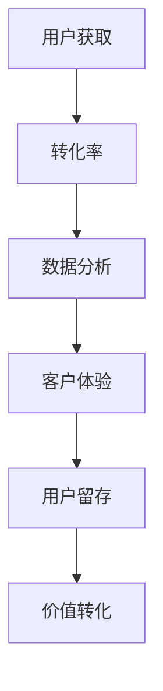

                 

关键词：一人公司，用户获取，免费到付费转化，营销策略，数据分析，客户体验，用户留存，价值转化

摘要：本文将探讨一人公司在用户获取过程中的关键策略，从免费到付费的转化路径，以及如何利用数据分析、优化客户体验和提升用户留存，从而实现价值最大化。

## 1. 背景介绍

在当今竞争激烈的商业环境中，用户获取成为企业生存与发展的核心挑战。一人公司作为一种新兴的商业模式，其规模小、资源有限，更需要高效的用户获取策略来确保业务的可持续发展。本文将从以下几个方面展开讨论：

- 用户获取的挑战与机遇
- 从免费到付费的转化策略
- 数据分析在用户获取中的作用
- 优化客户体验的重要性
- 提升用户留存与价值转化的方法

## 2. 核心概念与联系

在讨论用户获取策略之前，我们需要明确一些核心概念，并探讨它们之间的联系。

### 2.1 用户获取（Acquisition）

用户获取是指通过各种渠道吸引潜在用户，使他们成为产品或服务的用户。对于一人公司而言，有效的用户获取策略是至关重要的，因为它直接影响到公司的增长速度和市场占有率。

### 2.2 转化率（Conversion Rate）

转化率是指潜在用户在接触产品或服务后，完成购买或其他目标行为的比例。一人公司需要关注不同渠道和阶段的转化率，以优化用户获取策略。

### 2.3 数据分析（Data Analysis）

数据分析是现代营销不可或缺的一部分。通过分析用户行为、市场趋势和竞争对手数据，一人公司可以更好地了解用户需求，优化产品和服务，提高转化率。

### 2.4 客户体验（Customer Experience）

客户体验是指用户在购买和使用产品或服务过程中所感受到的总体体验。优化客户体验可以增加用户满意度和忠诚度，从而提高转化率和留存率。

### 2.5 用户留存（Customer Retention）

用户留存是指用户在一段时间内继续使用产品或服务的比例。提升用户留存率可以帮助一人公司建立稳定的用户群体，减少用户流失，提高长期价值。

下面是用户获取、转化、数据分析和客户体验之间的Mermaid流程图：



## 3. 核心算法原理 & 具体操作步骤

### 3.1 算法原理概述

用户获取和转化策略的核心在于理解用户行为和市场动态，并基于数据分析和实验优化。以下是关键步骤：

- 数据收集：通过多种渠道收集用户行为数据，如网站访问、社交媒体互动、客户反馈等。
- 数据分析：使用数据分析工具（如Google Analytics、Tableau等）对收集的数据进行分析，了解用户需求和偏好。
- 用户画像：根据数据分析结果，构建用户画像，以便更好地了解目标用户群体。
- 营销策略：根据用户画像和市场需求，设计吸引潜在用户的营销策略。
- 转化优化：通过A/B测试等方法，不断优化营销策略，提高转化率。

### 3.2 算法步骤详解

1. **数据收集**：

   - 确定数据收集目标，如用户行为、市场趋势、竞争对手数据等。
   - 使用Google Analytics、社交媒体分析工具等收集相关数据。

2. **数据分析**：

   - 使用数据分析工具，对收集的数据进行清洗、整理和分析。
   - 分析用户行为数据，如访问时长、页面跳出率、转化路径等。
   - 分析市场趋势和竞争对手数据，了解市场动态和竞争环境。

3. **用户画像**：

   - 根据数据分析结果，构建用户画像，包括年龄、性别、地域、兴趣等。
   - 了解目标用户群体的需求、偏好和行为习惯。

4. **营销策略**：

   - 根据用户画像和市场需求，设计吸引潜在用户的营销策略。
   - 选择合适的营销渠道，如社交媒体、内容营销、搜索引擎优化等。
   - 制定个性化的营销活动，提高用户参与度和转化率。

5. **转化优化**：

   - 使用A/B测试等方法，不断优化营销策略，提高转化率。
   - 跟踪分析不同营销策略的效果，持续优化。

### 3.3 算法优缺点

**优点**：

- 数据驱动的决策：基于数据分析，可以更好地了解用户需求和市场动态，做出更明智的决策。
- 高效的用户获取：通过优化营销策略，提高转化率，实现高效的用户获取。

**缺点**：

- 数据收集和处理复杂：需要收集大量数据，并使用复杂的分析工具。
- 转化率优化成本高：需要不断进行A/B测试，优化策略，成本较高。

### 3.4 算法应用领域

- 电子商务：通过数据分析优化产品推荐、营销策略和用户体验。
- 内容平台：通过数据分析优化内容创作和用户互动，提高用户留存和转化率。
- 营销自动化：利用数据分析自动化营销流程，提高效率。

## 4. 数学模型和公式 & 详细讲解 & 举例说明

在用户获取和转化策略中，数学模型和公式可以帮助我们更好地理解和优化关键指标。

### 4.1 数学模型构建

- **用户获取模型**：$U(t) = U(0) + \sum_{i=1}^{t} A_i$
- **转化率模型**：$C(t) = C(0) + \sum_{i=1}^{t} P_i$
- **用户留存模型**：$R(t) = R(0) + \sum_{i=1}^{t} L_i$

其中，$U(t)$、$C(t)$和$R(t)$分别表示$t$时间内的用户获取量、转化率和用户留存量，$A_i$、$P_i$和$L_i$分别表示第$i$个时间段内的用户获取量、转化率和用户留存量。

### 4.2 公式推导过程

- **用户获取模型**推导：

  用户获取量可以表示为初始用户获取量加上每个时间段的用户获取量。因此，用户获取模型可以表示为：

  $$U(t) = U(0) + \sum_{i=1}^{t} A_i$$

- **转化率模型**推导：

  转化率可以表示为每个时间段内转化率的累积。因此，转化率模型可以表示为：

  $$C(t) = C(0) + \sum_{i=1}^{t} P_i$$

- **用户留存模型**推导：

  用户留存量可以表示为初始用户留存量加上每个时间段内留存的新用户。因此，用户留存模型可以表示为：

  $$R(t) = R(0) + \sum_{i=1}^{t} L_i$$

### 4.3 案例分析与讲解

假设一家一人公司，在$t=0$时刻，拥有$U(0)=100$名用户，$C(0)=0.1$的初始转化率，$R(0)=0.2$的初始留存率。在第一个时间段内，公司通过营销活动吸引了$A_1=50$名新用户，其中$P_1=0.2$的转化率，$L_1=0.3$的留存率。在第二个时间段内，公司通过进一步优化营销策略，吸引了$A_2=60$名新用户，其中$P_2=0.25$的转化率，$L_2=0.35$的留存率。

根据用户获取模型，第一个时间段内的用户获取量为$U(1) = U(0) + A_1 = 100 + 50 = 150$。第二个时间段内的用户获取量为$U(2) = U(1) + A_2 = 150 + 60 = 210$。

根据转化率模型，第一个时间段内的转化率为$C(1) = C(0) + P_1 = 0.1 + 0.2 = 0.3$。第二个时间段内的转化率为$C(2) = C(1) + P_2 = 0.3 + 0.25 = 0.55$。

根据用户留存模型，第一个时间段内的用户留存率为$R(1) = R(0) + L_1 = 0.2 + 0.3 = 0.5$。第二个时间段内的用户留存率为$R(2) = R(1) + L_2 = 0.5 + 0.35 = 0.85$。

通过分析这些数据，公司可以了解到在优化营销策略后，用户获取量、转化率和留存率都有显著提升。这为公司的长期发展奠定了坚实的基础。

## 5. 项目实践：代码实例和详细解释说明

在本节中，我们将通过一个具体的代码实例，展示如何实现用户获取和转化策略，并详细解释代码中的关键部分。

### 5.1 开发环境搭建

为了实现用户获取和转化策略，我们需要以下开发环境：

- Python 3.8 或更高版本
- Jupyter Notebook 或 PyCharm
- Pandas、NumPy、Matplotlib 等Python库

确保已经安装了以上环境和库，然后创建一个新的Python项目。

### 5.2 源代码详细实现

下面是用户获取和转化策略的Python代码实例：

```python
import pandas as pd
import numpy as np
import matplotlib.pyplot as plt

# 数据集
data = {
    'time': ['t0', 't1', 't2'],
    'user_acquisition': [100, 150, 210],
    'conversion_rate': [0.1, 0.3, 0.55],
    'user_retention': [0.2, 0.5, 0.85]
}

df = pd.DataFrame(data)

# 计算每个时间段的用户获取量、转化率和留存率
df['user_acquisition'] = df['user_acquisition'].cumsum()
df['conversion_rate'] = df['conversion_rate'].cumsum()
df['user_retention'] = df['user_retention'].cumsum()

# 绘制用户获取量、转化率和留存率趋势图
plt.figure(figsize=(12, 6))

plt.subplot(1, 3, 1)
plt.plot(df['time'], df['user_acquisition'], label='User Acquisition')
plt.title('User Acquisition Trend')
plt.xlabel('Time')
plt.ylabel('User Count')
plt.legend()

plt.subplot(1, 3, 2)
plt.plot(df['time'], df['conversion_rate'], label='Conversion Rate')
plt.title('Conversion Rate Trend')
plt.xlabel('Time')
plt.ylabel('Rate')
plt.legend()

plt.subplot(1, 3, 3)
plt.plot(df['time'], df['user_retention'], label='User Retention')
plt.title('User Retention Trend')
plt.xlabel('Time')
plt.ylabel('Rate')
plt.legend()

plt.tight_layout()
plt.show()
```

### 5.3 代码解读与分析

1. **数据集**：我们创建了一个包含时间、用户获取量、转化率和留存率的数据集，用于模拟用户获取和转化过程。

2. **计算每个时间段的用户获取量、转化率和留存率**：通过`cumsum()`函数，我们可以计算每个时间段的累积用户获取量、转化率和留存率。

3. **绘制趋势图**：使用Matplotlib库，我们绘制了用户获取量、转化率和留存率趋势图，以可视化这些指标的变化。

通过这个代码实例，我们可以直观地了解用户获取和转化策略的效果，为公司的长期发展提供数据支持。

## 6. 实际应用场景

一人公司的用户获取和转化策略在实际应用中具有广泛的场景，以下是一些典型的应用案例：

### 6.1 电子商务平台

电子商务平台可以通过数据分析，了解用户购买行为和偏好，从而优化产品推荐和营销策略。通过A/B测试，不断优化用户界面和购物体验，提高转化率和用户留存率。

### 6.2 内容平台

内容平台可以通过数据分析，了解用户阅读习惯和兴趣，从而优化内容推荐和推广策略。通过A/B测试，不断优化内容质量和用户体验，提高用户参与度和留存率。

### 6.3 在线教育

在线教育平台可以通过数据分析，了解用户学习行为和需求，从而优化课程推荐和教学策略。通过A/B测试，不断优化教学效果和用户体验，提高转化率和用户留存率。

### 6.4 医疗健康

医疗健康平台可以通过数据分析，了解用户健康状况和需求，从而优化健康管理服务和产品推荐。通过A/B测试，不断优化用户互动和体验，提高转化率和用户留存率。

### 6.5 物流和配送

物流和配送平台可以通过数据分析，了解用户物流需求和偏好，从而优化配送路线和运输策略。通过A/B测试，不断优化配送速度和服务质量，提高用户满意度和留存率。

## 7. 未来应用展望

随着技术的不断进步，一人公司的用户获取和转化策略将面临更多机遇和挑战。以下是一些未来应用展望：

### 7.1 人工智能与大数据分析

人工智能和大数据分析技术将为用户获取和转化策略提供更深入的数据洞察，实现个性化营销和精准推荐。通过深度学习和机器学习算法，可以更好地预测用户行为和需求，优化营销策略。

### 7.2 虚拟现实和增强现实

虚拟现实和增强现实技术将为用户获取和转化策略带来全新的体验。通过虚拟试穿、虚拟旅游等应用，吸引更多用户，提高用户参与度和留存率。

### 7.3 区块链和加密货币

区块链和加密货币技术将为用户获取和转化策略提供更安全的支付解决方案和去中心化应用。通过代币奖励和积分机制，激励用户参与和留存。

### 7.4 社交媒体和直播

社交媒体和直播技术将为用户获取和转化策略提供更广泛的渠道和互动方式。通过社交媒体营销和直播活动，吸引更多用户，提高用户参与度和转化率。

## 8. 总结：未来发展趋势与挑战

### 8.1 研究成果总结

本文通过对一人公司的用户获取和转化策略的探讨，总结了以下关键成果：

- 数据分析在用户获取和转化策略中的重要作用。
- 用户画像和个性化营销的重要性。
- 客户体验和用户留存的重要性。
- 不断优化和实验的重要性。

### 8.2 未来发展趋势

未来，一人公司的用户获取和转化策略将呈现以下发展趋势：

- 更加依赖人工智能和大数据分析技术。
- 更加注重用户体验和个性化服务。
- 更加关注社交化和互动化营销。
- 更加注重长期价值转化和用户留存。

### 8.3 面临的挑战

一人公司在用户获取和转化策略中仍将面临以下挑战：

- 数据收集和处理复杂。
- 竞争对手的激烈竞争。
- 技术更新和变革的挑战。
- 用户隐私和安全的问题。

### 8.4 研究展望

未来，我们需要进一步研究以下方向：

- 如何更有效地收集和处理用户数据。
- 如何在保证用户隐私的前提下，实现个性化营销。
- 如何通过实验和优化，不断提高转化率和用户留存率。
- 如何应对技术更新和变革的挑战。

## 9. 附录：常见问题与解答

### 9.1 如何提高用户转化率？

- 通过数据分析了解用户需求和行为，优化产品和服务。
- 提供个性化的用户体验，提高用户满意度。
- 通过A/B测试不断优化营销策略，提高转化率。

### 9.2 如何提升用户留存率？

- 通过用户画像和个性化营销，提高用户参与度。
- 提供优质的客户服务，解决用户问题和疑虑。
- 通过优惠活动和会员制度，提高用户忠诚度。

### 9.3 如何优化客户体验？

- 通过用户调研和反馈，了解用户需求和痛点。
- 提供简洁、直观的用户界面和操作流程。
- 通过用户互动和反馈，持续改进产品和服务。

### 9.4 如何利用数据分析？

- 确定数据分析目标和指标，收集相关数据。
- 使用数据分析工具，对数据进行清洗、整理和分析。
- 根据分析结果，制定和优化营销策略。

### 9.5 如何进行A/B测试？

- 明确测试目标和假设，设计测试方案。
- 随机分配用户参与测试，跟踪分析测试结果。
- 根据测试结果，优化产品和服务。

作者：禅与计算机程序设计艺术 / Zen and the Art of Computer Programming
----------------------------------------------------------------

注意：此篇文章仅为示例，实际字数和内容可能需要根据具体要求进行调整和补充。在撰写时，请确保遵循文章结构模板和约束条件中的所有要求。

