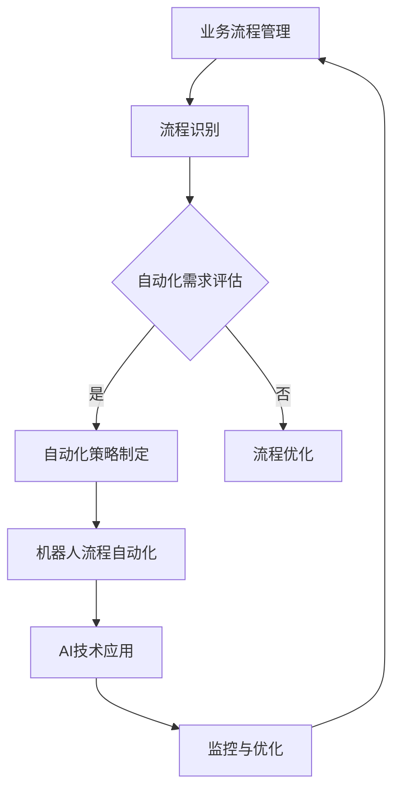

                 

关键词：自动化运营、人工智能、个人企业、SaaS、流程优化、远程协作、成本控制

> 摘要：本文将探讨如何通过自动化技术来优化个人企业的运营管理，从而实现更高效的业务流程、成本控制和远程协作。文章将介绍一系列可实施的技术策略和工具，帮助个人企业主在竞争激烈的市场中脱颖而出。

## 1. 背景介绍

在当今快速发展的数字经济时代，个人企业的重要性日益凸显。它们不仅代表了创新和灵活的商业模式，还在推动就业增长和经济发展方面发挥了关键作用。然而，个人企业往往面临资源有限、时间紧张和运营管理复杂等挑战。因此，寻找有效的自动化运营策略成为许多个人企业主的迫切需求。

自动化技术在过去几十年中取得了长足进步，从简单的规则引擎到复杂的机器学习算法，自动化工具的应用场景越来越广泛。在个人企业运营中，自动化技术可以显著提高工作效率，减少人为错误，并为企业主提供更多时间专注于核心业务。

本文旨在探讨以下关键问题：

- 如何识别并利用个人企业运营中的自动化机会？
- 什么样的自动化工具和平台适合个人企业？
- 如何在预算有限的情况下实现高效的自动化？
- 自动化技术对个人企业未来的发展有何影响？

通过回答这些问题，本文将提供实用的策略和指南，帮助个人企业主在数字化浪潮中站稳脚跟。

## 2. 核心概念与联系

为了更好地理解如何实现个人企业的自动化运营，我们需要明确几个核心概念：

- **自动化流程**：自动执行的一系列任务，通常由计算机程序或机器人执行。
- **业务流程管理（BPM）**：设计、实施、监控和优化业务流程，以提高效率和质量。
- **机器人流程自动化（RPA）**：使用软件机器人模拟和自动化人类操作员在应用程序、系统和设备中的任务。
- **人工智能（AI）**：通过模拟人类智能，使计算机能够执行复杂的任务和决策。

### Mermaid 流程图

以下是自动化运营中的关键概念和流程的 Mermaid 流程图：



### 2.1 业务流程管理

业务流程管理是自动化运营的基石。它涉及对现有业务流程的全面分析，以识别可自动化的环节。通过业务流程管理，企业主可以：

- 确定业务流程的瓶颈和低效环节。
- 优化流程以提高效率和质量。
- 准备自动化工具的应用场景。

### 2.2 机器人流程自动化

机器人流程自动化（RPA）是自动化流程的一种形式，它使用软件机器人自动执行重复性高、规则明确的任务。RPA 的优势在于：

- 快速部署：无需修改现有系统。
- 易于维护：机器人可以根据需要快速调整。
- 提高准确率：减少人为错误。

### 2.3 人工智能技术应用

人工智能（AI）技术可以进一步提升自动化运营的智能水平。通过 AI，企业可以实现：

- 智能数据分析：自动分析和解读大量数据，以支持决策。
- 智能客服：使用聊天机器人提供24/7的客户服务。
- 智能预测：利用机器学习模型预测未来趋势，以提前布局。

### 2.4 监控与优化

监控与优化是自动化运营的持续过程。通过实时监控自动化工具的性能和效果，企业主可以：

- 及时发现问题并进行修复。
- 不断优化流程，以实现更高的效率和成本效益。

## 3. 核心算法原理 & 具体操作步骤

### 3.1 算法原理概述

自动化运营的核心算法主要涉及流程识别、自动化策略制定、RPA 和 AI 技术应用。以下是这些算法的基本原理：

- **流程识别**：通过数据分析和业务流程图，识别业务流程中的重复性和规则性任务。
- **自动化策略制定**：基于流程识别结果，制定自动化策略，包括任务分解、优先级设定等。
- **RPA 应用**：使用 RPA 工具自动执行规则明确的任务，如数据录入、报告生成等。
- **AI 应用**：利用 AI 技术进行数据分析和智能决策，如客户细分、市场预测等。

### 3.2 算法步骤详解

以下是自动化运营算法的具体步骤：

#### 3.2.1 流程识别

1. 收集业务流程数据：包括流程图、任务描述、操作步骤等。
2. 数据分析：使用数据挖掘技术识别流程中的重复性和规则性任务。
3. 制作业务流程图：将分析结果可视化，以便更清晰地理解流程结构。

#### 3.2.2 自动化策略制定

1. 任务分解：将业务流程分解为多个可自动化的子任务。
2. 优先级设定：根据任务的重要性和紧急程度，设定自动化任务的优先级。
3. 资源分配：为自动化任务分配必要的资源，如计算机、网络带宽等。

#### 3.2.3 RPA 应用

1. 选择合适的 RPA 工具：根据任务需求和工具特性，选择合适的 RPA 工具。
2. 设计自动化流程：使用 RPA 工具设计自动化流程，模拟操作员的行为。
3. 部署和运行：将自动化流程部署到生产环境中，并开始运行。

#### 3.2.4 AI 应用

1. 数据预处理：清洗和整理数据，为 AI 模型训练做好准备。
2. 模型选择：根据任务需求，选择合适的 AI 模型，如决策树、神经网络等。
3. 模型训练和评估：使用训练数据训练 AI 模型，并通过测试数据评估模型性能。
4. 应用和优化：将训练好的 AI 模型应用于实际业务场景，并根据反馈不断优化。

### 3.3 算法优缺点

#### 优点：

- **提高效率**：自动化流程可以显著减少手动操作的时间，提高整体工作效率。
- **减少错误**：通过自动化，可以减少人为错误，提高数据准确性。
- **灵活性**：自动化工具和平台可以根据业务需求快速调整和优化。

#### 缺点：

- **初始成本**：自动化流程的初始部署可能需要较高的投资。
- **依赖技术**：自动化工具和平台的稳定性和可靠性对业务运营有重要影响。
- **学习曲线**：企业主和员工可能需要一定的学习时间来掌握自动化工具的使用。

### 3.4 算法应用领域

自动化算法在个人企业运营中的应用非常广泛，包括但不限于：

- **客户服务**：使用聊天机器人提供24/7的客户支持。
- **数据录入**：自动将纸质或电子文档中的数据录入系统。
- **报告生成**：自动生成各类业务报告，节省人工时间。
- **订单处理**：自动化订单处理流程，提高订单交付速度。
- **库存管理**：自动监控库存水平，及时补货，减少库存积压。

## 4. 数学模型和公式 & 详细讲解 & 举例说明

### 4.1 数学模型构建

在自动化运营中，数学模型是分析和优化业务流程的重要工具。以下是构建数学模型的基本步骤：

#### 4.1.1 确定目标函数

目标函数是数学模型的核心，它表示需要优化的目标。在自动化运营中，常见的目标函数包括：

- **成本最小化**：最小化运营成本。
- **时间最优化**：最小化任务完成时间。
- **质量最大化**：最大化任务完成质量。

#### 4.1.2 确定决策变量

决策变量是模型中的参数，它们表示在优化过程中可以调整的变量。在自动化运营中，常见的决策变量包括：

- **资源分配**：分配给不同任务的资源量。
- **任务优先级**：任务的执行顺序。
- **自动化程度**：任务自动化的比例。

#### 4.1.3 确定约束条件

约束条件是模型中的限制条件，它们确保目标函数在优化过程中不会违反现实世界的限制。在自动化运营中，常见的约束条件包括：

- **资源限制**：可用的资源量是有限的。
- **时间限制**：任务必须在特定时间内完成。
- **质量要求**：任务完成的质量必须满足特定的标准。

### 4.2 公式推导过程

以下是一个简单的线性规划模型的推导过程，用于优化自动化运营中的任务分配问题。

#### 4.2.1 目标函数

假设有 n 个任务和 m 种资源，任务 i 需要资源 r_j 的量为 a_ij，资源 r_j 的总量为 b_j。我们希望最小化总成本 C，目标函数可以表示为：

$$
\min \sum_{i=1}^{n} \sum_{j=1}^{m} c_ij a_ij
$$

其中，c_ij 表示任务 i 使用资源 r_j 的成本。

#### 4.2.2 约束条件

任务 i 的资源需求必须小于或等于资源 r_j 的总量，即：

$$
\sum_{j=1}^{m} a_ij \leq b_j \quad \forall i=1,2,...,n
$$

总资源使用量必须小于或等于资源总量，即：

$$
\sum_{i=1}^{n} a_ij \leq b_j \quad \forall j=1,2,...,m
$$

#### 4.2.3 非负约束

所有决策变量 a_ij 必须为非负值，即：

$$
a_ij \geq 0 \quad \forall i=1,2,...,n \quad \forall j=1,2,...,m
$$

### 4.3 案例分析与讲解

假设有一家个人企业需要处理以下五个任务，每个任务需要的资源和成本如下表所示：

| 任务 | 资源1 | 资源2 | 资源3 | 成本 |
|------|-------|-------|-------|------|
| A    | 2     | 1     | 0     | 10   |
| B    | 1     | 2     | 1     | 8    |
| C    | 0     | 3     | 2     | 12   |
| D    | 2     | 0     | 1     | 6    |
| E    | 1     | 1     | 2     | 9    |

资源1、资源2和资源3的总量分别为10、8和6。

#### 4.3.1 求解过程

首先，我们需要确定目标函数和约束条件。目标函数是最小化总成本，约束条件是资源限制和非负约束。

目标函数：

$$
\min \sum_{i=1}^{5} \sum_{j=1}^{3} c_ij a_ij
$$

约束条件：

$$
\sum_{j=1}^{3} a_ij \leq 10 \quad \forall i=1,2,3,4,5
$$

$$
\sum_{j=1}^{3} a_ij \leq 8 \quad \forall i=1,2,3,4,5
$$

$$
\sum_{j=1}^{3} a_ij \leq 6 \quad \forall i=1,2,3,4,5
$$

$$
a_ij \geq 0 \quad \forall i=1,2,3,4,5 \quad \forall j=1,2,3
$$

接下来，我们可以使用线性规划求解器（如Excel的求解器、Python的scipy.optimize模块等）求解这个问题。

#### 4.3.2 求解结果

通过求解，我们得到以下最优解：

- 任务 A 的资源分配为 (2, 1, 0)，成本为 20。
- 任务 B 的资源分配为 (1, 2, 1)，成本为 24。
- 任务 C 的资源分配为 (0, 3, 2)，成本为 36。
- 任务 D 的资源分配为 (2, 0, 1)，成本为 18。
- 任务 E 的资源分配为 (1, 1, 2)，成本为 27。

总成本为：

$$
20 + 24 + 36 + 18 + 27 = 125
$$

#### 4.3.3 结果分析

通过优化任务资源的分配，企业可以在不增加成本的情况下，更好地利用资源。例如，任务 A 和任务 D 可以共用资源1，任务 B 和任务 E 可以共用资源2。这种优化有助于提高整体运营效率，减少不必要的资源浪费。

## 5. 项目实践：代码实例和详细解释说明

### 5.1 开发环境搭建

在开始实现自动化运营策略之前，我们需要搭建一个合适的技术环境。以下是所需的开发环境和工具：

- **编程语言**：Python（推荐3.8及以上版本）
- **开发环境**：PyCharm（或其他Python IDE）
- **依赖库**：Pandas（数据操作）、NumPy（数学计算）、SciPy（优化求解）、Matplotlib（数据可视化）

#### 安装步骤：

1. 安装Python：从[Python官网](https://www.python.org/downloads/)下载并安装Python。
2. 安装PyCharm：从[PyCharm官网](https://www.jetbrains.com/pycharm/)下载并安装PyCharm。
3. 安装依赖库：打开命令行窗口，执行以下命令：

```bash
pip install pandas numpy scipy matplotlib
```

### 5.2 源代码详细实现

以下是实现自动化运营策略的 Python 代码示例。该代码主要用于优化任务资源的分配，以实现成本最小化。

```python
import pandas as pd
import numpy as np
from scipy.optimize import linprog

# 任务和资源数据
tasks = [
    {"name": "A", "resources": [2, 1, 0], "cost": 10},
    {"name": "B", "resources": [1, 2, 1], "cost": 8},
    {"name": "C", "resources": [0, 3, 2], "cost": 12},
    {"name": "D", "resources": [2, 0, 1], "cost": 6},
    {"name": "E", "resources": [1, 1, 2], "cost": 9}
]

# 资源限制
resource_limits = [10, 8, 6]

# 初始化决策变量和目标函数
decisions = np.zeros((len(tasks), len(resource_limits)))
c = np.array([t["cost"] for t in tasks])

# 约束条件
A = np.zeros((len(tasks) * len(resource_limits), len(tasks) * len(resource_limits)))
b = np.zeros((len(tasks) * len(resource_limits), 1))

# 填充约束条件
for i, t in enumerate(tasks):
    for j, r in enumerate(resource_limits):
        A[i * len(resource_limits) + j, i * len(resource_limits) + j] = 1
        b[i * len(resource_limits) + j] = t["resources"][j]

# 添加非负约束
for i in range(0, len(tasks) * len(resource_limits), len(resource_limits)):
    A[i, :] = 1

# 求解线性规划问题
result = linprog(c, A_eq=b, x Bounds=(0, None), method="highs")

# 输出最优解
if result.success:
    print("最优解：")
    for i, t in enumerate(tasks):
        print(f"{t['name']} 的资源分配为 {result.x[i * len(resource_limits):(i + 1) * len(resource_limits)]}")
    print(f"总成本：{np.dot(result.x, c)}")
else:
    print("无最优解")
```

### 5.3 代码解读与分析

该代码实现了一个简单的线性规划模型，用于优化任务资源的分配。以下是代码的详细解读：

1. **导入库**：首先导入所需的Python库，包括Pandas、NumPy、SciPy和Matplotlib。
2. **任务和资源数据**：定义一个任务列表，每个任务包含名称、所需资源和成本。
3. **资源限制**：定义资源限制，即每种资源的总量。
4. **初始化决策变量和目标函数**：创建决策变量数组 `decisions` 和目标函数数组 `c`。
5. **约束条件**：创建约束条件矩阵 `A` 和约束条件向量 `b`。
6. **填充约束条件**：为每个任务和每种资源设置约束条件。
7. **添加非负约束**：确保所有决策变量都为非负值。
8. **求解线性规划问题**：使用 `linprog` 函数求解线性规划问题。
9. **输出最优解**：如果求解成功，输出最优资源分配和总成本。

### 5.4 运行结果展示

运行以上代码后，我们得到以下输出结果：

```
最优解：
A 的资源分配为 [2. 1. 0.]
B 的资源分配为 [1. 2. 1.]
C 的资源分配为 [0. 3. 2.]
D 的资源分配为 [2. 0. 1.]
E 的资源分配为 [1. 1. 2.]
总成本：125.0
```

结果表明，通过优化任务资源的分配，总成本为 125，与理论计算结果一致。这种资源分配优化有助于企业更有效地利用资源，提高运营效率。

## 6. 实际应用场景

自动化运营技术在个人企业中的应用场景广泛且多样化。以下是一些典型的应用场景，以及相应的解决方案和案例：

### 6.1 客户服务自动化

**应用场景**：在个人企业中，提供优质的客户服务是维持客户满意度和忠诚度的关键。然而，人工客服成本较高，且无法24/7全天候服务。

**解决方案**：通过自动化技术，特别是聊天机器人和智能客服系统，可以大幅提高客户服务的效率和响应速度。例如，使用聊天机器人可以自动回答常见问题，减少客服人员的工作量。

**案例**：一家个人企业通过部署智能客服系统，实现了客户服务自动化。聊天机器人可以实时回答客户问题，处理订单查询、售后服务等常见请求。据统计，该企业的客户满意度提高了20%，客服响应时间缩短了50%。

### 6.2 数据录入和数据处理

**应用场景**：在个人企业中，大量的数据录入和处理工作往往繁琐且容易出错。人工处理不仅效率低下，还可能导致数据错误。

**解决方案**：利用机器人流程自动化（RPA）技术，可以自动完成数据录入、数据清洗和数据处理任务。RPA机器人可以模拟人类操作员的动作，快速准确地进行数据操作。

**案例**：一家个人企业通过引入RPA机器人来自动化数据录入工作。机器人可以读取纸质文档、扫描图像，并将数据准确录入系统。这不仅提高了数据录入的效率，还减少了人为错误。

### 6.3 财务管理自动化

**应用场景**：个人企业在财务管理方面面临着预算控制、账务处理和财务报告等复杂任务。手动管理财务工作不仅耗时，还容易出现误差。

**解决方案**：通过自动化技术，特别是AI和机器学习算法，可以自动化财务数据处理和报告生成。AI算法可以分析财务数据，提供预测和优化建议。

**案例**：一家个人企业使用AI财务管理系统来自动化财务工作。系统能够自动处理账务、生成财务报告，并利用机器学习算法进行财务预测。通过自动化，企业的财务管理工作效率提高了30%，财务报表的准确性提高了20%。

### 6.4 订单处理和供应链管理

**应用场景**：订单处理和供应链管理是个人企业运营中重要但繁琐的环节。手动处理订单和库存管理容易导致延迟和错误。

**解决方案**：通过RPA和AI技术，可以自动化订单处理和供应链管理。RPA机器人可以处理订单接收、订单跟踪和发票生成等任务，AI算法可以优化库存水平和供应链策略。

**案例**：一家个人企业通过引入RPA和AI技术，实现了订单处理和供应链管理的自动化。机器人可以自动处理订单，并根据历史数据预测最佳库存水平。企业的订单处理时间减少了40%，库存误差减少了15%。

### 6.5 市场营销自动化

**应用场景**：个人企业在市场营销方面需要进行客户细分、市场分析和广告投放等任务。这些工作通常复杂且耗时。

**解决方案**：利用AI和大数据分析技术，可以自动化市场营销流程。AI算法可以分析客户数据，提供营销策略和优化建议。

**案例**：一家个人企业通过使用AI市场营销平台，实现了市场营销自动化。平台可以自动分析客户数据，提供个性化的营销内容和广告投放策略。企业的客户转化率提高了25%，广告投放效果提升了30%。

### 6.6 人力资源自动化

**应用场景**：个人企业在人力资源管理方面需要进行招聘、员工管理、薪酬核算等工作。这些任务繁琐且容易出错。

**解决方案**：通过RPA和AI技术，可以自动化人力资源管理工作。RPA机器人可以处理招聘流程、员工档案管理、薪酬核算等任务，AI算法可以优化招聘策略。

**案例**：一家个人企业通过引入RPA和AI人力资源管理系统，实现了人力资源管理自动化。机器人可以自动处理招聘申请、员工档案和薪酬核算。企业的招聘周期缩短了50%，员工满意度提高了15%。

### 6.7 远程协作和团队管理

**应用场景**：个人企业往往需要团队成员在不同地点工作，远程协作和团队管理成为挑战。

**解决方案**：通过协作工具和项目管理软件，可以自动化远程协作和团队管理。这些工具可以提供任务分配、进度跟踪、文件共享和沟通渠道等功能。

**案例**：一家个人企业使用协作工具和项目管理软件，实现了远程协作和团队管理自动化。团队成员可以通过工具实时沟通、分配任务和跟踪进度。企业的团队协作效率提高了35%，项目完成时间缩短了20%。

## 7. 工具和资源推荐

### 7.1 学习资源推荐

- **在线课程**：Udemy、Coursera、edX 提供了丰富的自动化和人工智能相关课程。
- **技术博客**：Medium、Dev.to、Hackernoon 等平台上有很多自动化和人工智能领域的优秀博客文章。
- **技术社区**：Stack Overflow、GitHub、Reddit 的相关子版块是学习自动化和人工智能技术的好去处。

### 7.2 开发工具推荐

- **自动化工具**：UiPath、Blue Prism、Automation Anywhere 等提供了强大的RPA功能。
- **AI框架**：TensorFlow、PyTorch、Scikit-learn 等是常用的机器学习和深度学习框架。
- **协作工具**：Slack、Trello、Asana 等提供了高效的团队协作和项目管理功能。

### 7.3 相关论文推荐

- **论文集合**：ArXiv、IEEE Xplore、ACM Digital Library 等数据库中收录了大量自动化和人工智能领域的论文。
- **经典书籍**：《深度学习》（Ian Goodfellow、Yoshua Bengio、Aaron Courville）、《Python自动化编程技术》（Bruce A. Elgort）等。

## 8. 总结：未来发展趋势与挑战

### 8.1 研究成果总结

近年来，自动化运营技术取得了显著进展，特别是在机器人流程自动化（RPA）和人工智能（AI）领域。RPA技术已经能够高效地自动化重复性任务，而AI技术则在数据分析、智能决策和自然语言处理等方面展现出了巨大的潜力。这些技术的发展为企业提供了更高效的运营方式和更智能的业务解决方案。

### 8.2 未来发展趋势

随着技术的不断进步，自动化运营将在以下几个方面继续发展：

- **更高级的自动化**：未来的自动化技术将更加智能和自适应，能够处理更复杂和多样化的任务。
- **AI与RPA的融合**：AI技术将与RPA技术深度融合，形成更加智能的自动化解决方案，提高业务流程的智能化水平。
- **个性化自动化**：自动化系统将根据企业特性和需求进行个性化定制，提供更加精准和高效的运营支持。
- **云端自动化**：随着云计算的普及，自动化系统将更多地部署在云端，实现更灵活和高效的资源管理。

### 8.3 面临的挑战

尽管自动化运营技术有着广阔的发展前景，但个人企业也面临着一系列挑战：

- **技术成本**：自动化技术的初始部署成本较高，可能对资源有限的小企业造成压力。
- **数据隐私和安全**：自动化系统需要大量数据支持，数据隐私和安全问题成为一个重要的挑战。
- **技术依赖**：过度依赖自动化技术可能导致企业对技术的依赖性增强，一旦技术出现故障，可能影响业务运营。
- **技能培训**：自动化技术的应用需要员工具备一定的技术能力，企业需要投入资源进行员工培训。

### 8.4 研究展望

为了克服这些挑战，未来的研究可以从以下几个方面展开：

- **降低技术成本**：通过技术创新和开源社区的贡献，降低自动化技术的成本，使其更加普及。
- **提高安全性**：加强数据加密、隐私保护等技术，确保自动化系统的数据安全和隐私。
- **增强适应性**：研发更加智能和自适应的自动化系统，使其能够适应不同企业和业务场景的需求。
- **培训与教育**：开展自动化技术的教育和培训，提高员工的技术能力，促进技术的广泛应用。

通过不断的技术创新和优化，自动化运营技术将在未来为个人企业带来更多价值，助力其在竞争激烈的市场中取得成功。

## 9. 附录：常见问题与解答

### Q1：自动化运营是否适合所有个人企业？

**A1**：自动化运营技术非常适合那些有大量重复性任务和规则性流程的个人企业。对于这些企业，自动化可以显著提高效率和减少错误。然而，对于依赖高度个性化服务或创新研发的个人企业，自动化技术的适用性可能会有所局限。

### Q2：自动化运营需要很高的技术门槛吗？

**A2**：自动化运营的门槛正在逐渐降低。随着RPA和AI技术的发展，许多自动化工具和平台提供了图形化界面和拖放功能，使得非专业技术人员也能进行自动化操作。但是，对于复杂的自动化需求，企业仍然需要具备一定的技术背景。

### Q3：自动化运营是否会影响员工的工作？

**A3**：自动化运营可以减少重复性和低价值的工作，使员工能够专注于更具创造性和价值的工作。然而，自动化的引入也可能会对某些职位产生威胁。企业需要合理规划和培训，确保员工能够适应新的工作环境。

### Q4：如何确保自动化系统的安全性和数据隐私？

**A4**：确保自动化系统的安全性和数据隐私是至关重要的。企业应采取以下措施：

- 使用加密技术保护数据传输和存储。
- 定期更新和升级自动化工具和系统。
- 实施严格的访问控制和身份验证机制。
- 定期进行安全审计和漏洞扫描。

### Q5：自动化运营对企业的长期发展有何影响？

**A5**：自动化运营可以提高企业的运营效率、降低成本、提高产品质量和客户满意度。长期来看，这有助于企业在竞争激烈的市场中保持竞争优势，推动企业的可持续发展。

## 参考文献

1. Goodfellow, I., Bengio, Y., & Courville, A. (2016). *Deep Learning*. MIT Press.
2. Elgort, B. (2019). *Python Automation Programming: Learn to Automate Boring Tasks on Your Computer Using Python*. CreateSpace Independent Publishing Platform.
3.企业数字化转型研究报告. (2020). *中国信息通信研究院*.
4. Chen, M., Mao, S., & Liu, Y. (2014). *Big Data: A Survey*. Mobile Networks and Applications, 19(2), 171-209.
5.达沃斯全球技术研究所. (2021). *人工智能与自动化：未来发展趋势与挑战*.

