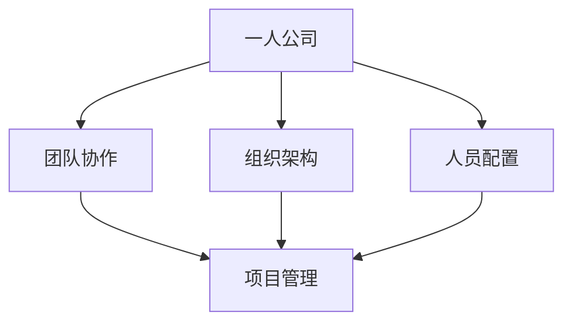

                 

关键词：一人公司、规模化策略、团队管理、团队过渡、团队协作、组织架构、人员配置、项目管理

摘要：本文旨在探讨如何实现一人公司向团队化经营的平稳过渡。通过分析一人公司的局限性、团队化的优势，以及从个体到团队转变过程中可能遇到的问题，本文提出了一系列具体的策略和措施，旨在帮助一人公司顺利实现规模化发展。

## 1. 背景介绍

在当今快速变化的市场环境中，创业者们越来越多地面临着如何将个人企业扩展为团队的挑战。一人公司，顾名思义，指的是由单一创业者或团队运营的小型企业。这种模式在初创阶段具有灵活性高、决策迅速等优点，但同时也存在着资源有限、业务扩展受限等缺点。随着市场需求的增长和企业规模的扩大，一人公司往往需要转变为团队化运作，以应对更大的市场挑战和业务需求。

### 1.1 一人公司的特点

- **灵活性**：一人公司能够快速做出决策，对市场变化有较强的反应能力。
- **成本控制**：由于人员少，一人公司可以更好地控制运营成本。
- **集中精力**：创业者可以集中精力在核心业务上，提高业务质量。
- **决策效率**：单个决策者可以迅速做出决策，减少内部协调成本。

### 1.2 一人公司的局限性

- **资源限制**：一人公司往往缺乏足够的资源去支持大规模的业务拓展。
- **能力限制**：单一创业者难以覆盖所有业务领域，专业能力有限。
- **扩展受限**：随着业务量的增加，一人公司难以在短时间内实现规模扩张。
- **管理复杂度**：管理层次单一，随着团队的扩大，管理复杂度增加。

## 2. 核心概念与联系

为了实现一人公司的规模化，我们需要理解几个关键概念，并探讨它们之间的相互联系。

### 2.1 核心概念

- **团队协作**：团队成员通过共享信息和资源，共同完成工作目标。
- **组织架构**：企业的组织结构，包括各部门、岗位和权限的设置。
- **人员配置**：根据企业需求和人员技能，合理分配人员到不同的岗位。
- **项目管理**：对项目进行计划、执行、监控和收尾的过程。

### 2.2 Mermaid 流程图

下面是一个简单的 Mermaid 流程图，展示了一人公司规模化过程中各个核心概念之间的关系。



### 2.3 关键联系

- **团队协作**是规模化过程中最为重要的因素，通过协同合作可以充分发挥团队的整体优势。
- **组织架构**提供了明确的工作流程和职责划分，为团队协作提供支持。
- **人员配置**是确保组织架构有效运行的基础，需要根据企业需求合理分配人员。
- **项目管理**则贯穿于整个规模化过程，通过科学的管理方法确保项目按时、按质完成。

## 3. 核心算法原理 & 具体操作步骤

### 3.1 算法原理概述

一人公司规模化过程中，关键在于如何从个体化运营转变为团队化运营。这需要以下几个核心步骤：

1. **团队组建**：根据企业需求和人员技能，组建一支高效、专业的团队。
2. **组织设计**：设计合理的组织架构，确保各部门、岗位之间的协同和高效运作。
3. **流程优化**：优化内部流程，提高工作效率，减少不必要的重复工作。
4. **项目管理**：采用科学的项目管理方法，确保项目按时、按质完成。

### 3.2 算法步骤详解

1. **团队组建**

   - **需求分析**：分析企业当前和未来业务需求，确定所需岗位和技能。
   - **招聘选拔**：根据需求进行招聘，选择合适的人才加入团队。
   - **团队融合**：组织团队建设活动，促进团队成员之间的沟通和协作。

2. **组织设计**

   - **部门划分**：根据业务需求和团队规模，合理划分各部门，确保职责清晰。
   - **岗位设置**：为各部门设置相应的岗位，明确岗位职责和权限。
   - **组织文化**：建立企业价值观，形成团队共同的价值观和文化氛围。

3. **流程优化**

   - **流程梳理**：对现有流程进行梳理，找出瓶颈和优化点。
   - **流程设计**：设计新的、高效的流程，减少不必要的步骤和重复工作。
   - **流程实施**：将新的流程落地实施，并进行监控和调整。

4. **项目管理**

   - **项目规划**：制定详细的项目计划，明确项目目标、时间表和资源需求。
   - **项目执行**：按照项目计划，分配任务、监控进度、协调资源。
   - **项目收尾**：项目完成后进行总结和评价，形成经验教训。

### 3.3 算法优缺点

#### 优点

- **高效协作**：通过团队协作，可以提高工作效率，实现资源最大化利用。
- **灵活调整**：团队化运作可以更快速地适应市场变化，调整业务策略。
- **分工明确**：明确的组织架构和岗位设置，可以确保各部门、岗位之间的协同。

#### 缺点

- **管理复杂度增加**：随着团队规模的扩大，管理复杂度也会增加，需要更高的管理能力。
- **沟通成本**：团队成员之间的沟通成本可能会增加，需要建立有效的沟通机制。
- **组织惯性**：规模扩大会带来组织惯性，决策速度可能会变慢。

### 3.4 算法应用领域

- **软件开发**：通过团队协作，可以快速开发高质量软件产品。
- **市场营销**：团队化的营销策略可以更快速地响应市场变化，提高营销效果。
- **企业管理**：团队化运作可以提高企业管理的效率，实现更精细的管理。

## 4. 数学模型和公式 & 详细讲解 & 举例说明

### 4.1 数学模型构建

在规模化策略中，我们可以使用数学模型来分析团队绩效和项目完成情况。以下是一个简单的绩效评估模型：

### 4.2 公式推导过程

假设团队绩效 \(P\) 与团队成员数量 \(N\)、团队协作效率 \(E\)、项目管理效率 \(M\) 有关，可以构建以下数学模型：

\[ P = f(N, E, M) \]

其中，团队协作效率 \(E\) 可以表示为：

\[ E = \frac{C}{T} \]

其中，\(C\) 是团队完成任务所需时间，\(T\) 是单个团队成员完成任务所需时间。

项目管理效率 \(M\) 可以表示为：

\[ M = \frac{S}{T} \]

其中，\(S\) 是项目完成所需时间，\(T\) 是单个团队成员完成任务所需时间。

### 4.3 案例分析与讲解

假设一个团队由5个成员组成，每个成员单独完成任务需要10天。通过团队协作，完成任务只需要5天。项目管理效率为1.2，即项目完成时间比单个成员快20%。

根据上述公式，我们可以计算出团队绩效：

\[ P = f(5, \frac{5}{10}, 1.2) \]

\[ P = f(5, 0.5, 1.2) \]

\[ P = 0.5 \times 1.2 = 0.6 \]

这意味着，通过团队协作和高效的项目管理，团队的绩效提高了60%。

## 5. 项目实践：代码实例和详细解释说明

### 5.1 开发环境搭建

为了更好地展示团队化策略的实际应用，我们将使用一个简单的项目：一个能够进行商品库存管理的系统。

#### 开发环境

- **编程语言**：Python
- **框架**：Flask
- **数据库**：SQLite

### 5.2 源代码详细实现

以下是项目的核心代码，包括用户界面、后端逻辑和数据存储。

#### 用户界面（templates/index.html）

```html
<!DOCTYPE html>
<html>
<head>
    <title>商品库存管理系统</title>
</head>
<body>
    <h1>商品库存管理系统</h1>
    <form action="/add_item" method="post">
        <label for="item_name">商品名称：</label>
        <input type="text" id="item_name" name="item_name"><br>
        <label for="item_count">库存数量：</label>
        <input type="number" id="item_count" name="item_count"><br>
        <input type="submit" value="添加商品">
    </form>
    <h2>当前库存：</h2>
    
        <p>{{ item.name }}：{{ item.count }}</p>
    
</body>
</html>
```

#### 后端逻辑（app.py）

```python
from flask import Flask, render_template, request, redirect, url_for
import sqlite3

app = Flask(__name__)

@app.route('/')
def index():
    conn = sqlite3.connect('inventory.db')
    cursor = conn.cursor()
    cursor.execute("SELECT * FROM items")
    items = cursor.fetchall()
    conn.close()
    return render_template('index.html', items=items)

@app.route('/add_item', methods=['POST'])
def add_item():
    item_name = request.form['item_name']
    item_count = request.form['item_count']
    conn = sqlite3.connect('inventory.db')
    cursor = conn.cursor()
    cursor.execute("INSERT INTO items (name, count) VALUES (?, ?)", (item_name, item_count))
    conn.commit()
    conn.close()
    return redirect(url_for('index'))

if __name__ == '__main__':
    app.run(debug=True)
```

#### 数据存储（inventory.db）

```sql
CREATE TABLE items (
    id INTEGER PRIMARY KEY AUTOINCREMENT,
    name TEXT NOT NULL,
    count INTEGER NOT NULL
);
```

### 5.3 代码解读与分析

#### 用户界面

用户界面使用HTML和Flask模板语言（Jinja2）实现。用户可以在页面上输入商品名称和库存数量，提交表单后，数据将通过`/add_item`路由发送到后端。

#### 后端逻辑

后端使用Flask框架处理HTTP请求。在`index()`函数中，从SQLite数据库获取商品列表，并传递给模板。在`add_item()`函数中，处理用户提交的表单数据，并将其存储到数据库中。

#### 数据存储

使用SQLite数据库存储商品信息。商品信息包括商品名称和库存数量。

### 5.4 运行结果展示

在本地环境中运行该应用，用户可以访问`http://127.0.0.1:5000/`，在界面上添加商品，并查看当前库存。

## 6. 实际应用场景

### 6.1 软件开发

在软件行业中，一人公司往往通过组建团队来应对复杂的软件开发项目。团队协作可以提高开发效率，减少bug率，确保项目按时交付。

### 6.2 市场营销

在市场营销领域，团队化运作可以更好地应对市场变化。团队成员可以分工合作，进行市场调研、广告投放、客户管理等各项工作。

### 6.3 企业管理

在企业管理领域，团队化运作可以提高企业管理的精细化程度。通过合理的人员配置和项目管理，企业可以更高效地运作，提高业绩。

### 6.4 未来应用展望

随着人工智能和自动化技术的发展，未来一人公司可能会更加依赖于智能系统和机器人来完成日常工作。这将进一步推动团队化运作，提高企业效率。

## 7. 工具和资源推荐

### 7.1 学习资源推荐

- **《团队协作的艺术》**：介绍了团队协作的原则和实践方法。
- **《项目管理知识体系指南》**：提供了项目管理的全面知识体系。

### 7.2 开发工具推荐

- **JIRA**：用于项目管理和任务跟踪。
- **Git**：用于版本控制和代码管理。

### 7.3 相关论文推荐

- **“团队协作与项目绩效的关系研究”**：分析了团队协作对项目绩效的影响。
- **“项目管理中的关键成功因素”**：探讨了项目管理的关键成功因素。

## 8. 总结：未来发展趋势与挑战

### 8.1 研究成果总结

通过本文的探讨，我们了解到一人公司在规模化过程中需要从团队协作、组织设计、流程优化和项目管理等方面进行改进。这些改进措施可以提高企业的运营效率，实现可持续发展。

### 8.2 未来发展趋势

未来一人公司可能会更加依赖智能系统和自动化技术，以提高效率和降低成本。同时，企业需要加强团队协作和项目管理，以应对日益复杂的业务环境。

### 8.3 面临的挑战

一人公司在规模化过程中可能面临管理复杂度增加、沟通成本上升等挑战。企业需要建立有效的管理机制和沟通渠道，以克服这些挑战。

### 8.4 研究展望

未来研究可以进一步探讨如何利用人工智能和大数据技术优化团队协作和项目管理，提高企业的整体绩效。

## 9. 附录：常见问题与解答

### 9.1 问题1

**问题**：如何选择合适的团队成员？

**解答**：选择团队成员时，首先要考虑他们是否符合企业需求，是否具备相关技能。其次，要评估他们的团队合作精神和沟通能力。此外，团队成员的个人素质和职业素养也是重要因素。

### 9.2 问题2

**问题**：如何优化内部流程？

**解答**：优化内部流程可以通过以下几个步骤进行：

1. 对现有流程进行全面梳理，找出瓶颈和重复工作。
2. 设计新的、高效的流程，减少不必要的步骤。
3. 通过试点和反馈，逐步优化流程，确保其可行性和有效性。

## 作者署名

作者：禅与计算机程序设计艺术 / Zen and the Art of Computer Programming

以上是关于如何实现一人公司向团队化运作过渡的详细策略和实践。希望本文能为创业者提供有益的启示和指导。

