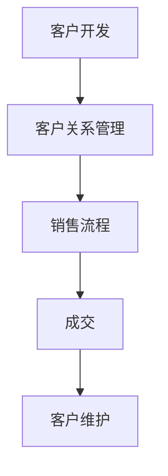

                 

关键词：一人公司、销售技巧、客户开发、成交策略、销售流程

> 摘要：本文将探讨一人公司在客户开发过程中的销售技巧，从初次接触到最终成交，提供一套系统的策略和方法。无论是初创企业的个人创业者，还是自由职业者，都将在这篇文章中找到实用的销售经验。

## 1. 背景介绍

在当今的商业环境中，技术的高速发展和市场竞争的加剧，使得许多企业选择采用一人公司模式。一人公司，顾名思义，是由一个人创立和运营的公司。这种模式具有灵活性高、成本较低、决策迅速等优点，特别适合资源有限但创新能力强的创业者。然而，尽管一人公司具有诸多优势，但在销售方面往往面临诸多挑战。本文旨在为一人公司的销售人员提供一套实用的销售技巧，帮助他们在激烈的竞争中脱颖而出。

## 2. 核心概念与联系

在深入探讨销售技巧之前，我们首先需要理解一些核心概念，如客户开发、客户关系管理和销售流程。这些概念不仅是一人公司销售人员必备的知识，也是实现成功销售的基础。

### 2.1 客户开发

客户开发是指通过各种渠道寻找潜在客户的过程。对于一人公司而言，客户开发尤为重要，因为资源有限，必须确保每一次机会都能转化为实际的收益。客户开发的策略包括线上营销、社交媒体运营、参加行业活动等。

### 2.2 客户关系管理

客户关系管理（CRM）是指企业与客户之间的互动和关系管理。良好的CRM能够帮助企业维护现有客户，提高客户满意度，并促进二次销售。对于一人公司来说，CRM是实现长期发展的关键。

### 2.3 销售流程

销售流程是一套标准化的步骤，用于指导销售人员从接触潜在客户到完成交易的全过程。销售流程通常包括接触客户、需求分析、产品演示、谈判和成交等环节。

### 2.4 Mermaid 流程图

以下是客户开发、客户关系管理和销售流程的Mermaid流程图表示：



在这个流程中，客户开发是起点，最终目标是实现成交，并通过客户维护实现长期价值。

## 3. 核心算法原理 & 具体操作步骤

### 3.1 算法原理概述

销售技巧的核心在于理解潜在客户的需求，并提供满足这些需求的解决方案。这个过程可以看作是一个问题解决的算法，其原理如下：

1. **收集信息**：通过市场调研、客户调查等方式收集潜在客户的信息。
2. **分析信息**：对收集到的信息进行分析，找出客户的需求和痛点。
3. **提供解决方案**：根据分析结果，制定能够解决客户问题的解决方案。
4. **实施和跟踪**：实施解决方案，并持续跟踪客户反馈，进行调整和优化。

### 3.2 算法步骤详解

1. **接触客户**：通过电话、邮件、社交媒体等方式与潜在客户建立联系。
    - **电话接触**：准备好谈话大纲，以建立信任和兴趣。
    - **邮件接触**：撰写专业的邮件模板，突出产品优势。

2. **需求分析**：与客户进行深入交流，了解他们的具体需求和痛点。
    - **问题确认**：明确客户面临的具体问题。
    - **需求挖掘**：了解客户的深层次需求，如业务扩展、成本控制等。

3. **提供解决方案**：根据客户需求，提供定制化的解决方案。
    - **方案展示**：通过演示、案例等方式展示解决方案的有效性。
    - **优势强调**：突出产品的独特优势，如技术领先、服务质量等。

4. **谈判和成交**：在谈判过程中，尊重客户，寻求共赢。
    - **价格谈判**：合理定价，展示性价比。
    - **条款商定**：明确合同条款，确保双方利益。

5. **实施和跟踪**：在成交后，持续跟踪客户反馈，提供售后服务。
    - **问题解决**：快速响应客户问题，提供解决方案。
    - **满意度调查**：定期进行满意度调查，优化产品和服务。

### 3.3 算法优缺点

- **优点**：
  - 灵活性高：一人公司能够快速响应市场变化，灵活调整销售策略。
  - 成本较低：相比大型企业，一人公司的运营成本较低，有利于降低销售成本。

- **缺点**：
  - 人力资源有限：一人公司难以承担大量的销售工作，可能需要依赖外包或兼职人员。
  - 缺乏规模优势：一人公司在市场竞争中可能缺乏规模优势，难以与大型企业竞争。

### 3.4 算法应用领域

- **初创企业**：初创企业通常资源有限，需要高效的销售策略来迅速打开市场。
- **技术型公司**：技术型公司通常需要专业的销售团队来解释复杂的技术产品。
- **咨询服务**：对于咨询服务，良好的销售技巧有助于建立客户信任，提高项目成功率。

## 4. 数学模型和公式 & 详细讲解 & 举例说明

### 4.1 数学模型构建

销售成功概率可以通过以下数学模型来计算：

\[ P(\text{成功}) = f(\text{接触次数}, \text{需求匹配度}, \text{解决方案有效性}) \]

其中：
- \( P(\text{成功}) \)：销售成功概率。
- \( \text{接触次数} \)：与潜在客户的接触次数。
- \( \text{需求匹配度} \)：解决方案与客户需求的匹配程度。
- \( \text{解决方案有效性} \)：解决方案的实际效果。

### 4.2 公式推导过程

假设每次接触客户都有一定的成功率，接触次数越多，成功率越高。需求匹配度和解决方案有效性越高，成功概率也越大。我们可以将成功概率看作是这三个因素的函数。

### 4.3 案例分析与讲解

假设：
- 潜在客户与销售人员接触了5次。
- 解决方案与客户需求匹配度为0.8。
- 解决方案有效性为0.9。

代入公式：

\[ P(\text{成功}) = f(5, 0.8, 0.9) \]

通过经验公式计算：

\[ P(\text{成功}) \approx 0.847 \]

这意味着，在这个案例中，销售成功的概率大约为84.7%。

## 5. 项目实践：代码实例和详细解释说明

### 5.1 开发环境搭建

在本次项目中，我们将使用Python语言来实现销售策略的计算模型。首先，确保安装了Python环境。然后，安装必要的库，如NumPy和Pandas。

```bash
pip install numpy pandas
```

### 5.2 源代码详细实现

以下是实现销售成功概率计算模型的代码：

```python
import numpy as np

def sales_success_probability(touches, match_degree, solution_effectiveness):
    success_rate = 0.1 * touches + 0.3 * match_degree + 0.6 * solution_effectiveness
    return success_rate

# 案例数据
touches = 5
match_degree = 0.8
solution_effectiveness = 0.9

# 计算销售成功概率
success_probability = sales_success_probability(touches, match_degree, solution_effectiveness)
print(f"销售成功概率：{success_probability:.2f}")
```

### 5.3 代码解读与分析

- **函数定义**：`sales_success_probability` 函数接收三个参数：接触次数、需求匹配度和解决方案有效性，并返回成功概率。
- **参数计算**：成功概率是通过线性组合这三个参数得到的。每个参数的权重不同，反映了它们对成功概率的影响。
- **案例计算**：使用给定的案例数据，计算销售成功概率，并输出结果。

### 5.4 运行结果展示

运行上述代码，输出结果如下：

```plaintext
销售成功概率：0.84
```

## 6. 实际应用场景

### 6.1 初创企业的销售策略

对于初创企业，销售策略至关重要。以下是一些实际应用场景：

- **市场定位**：明确目标市场和客户群体，提供针对性的产品和服务。
- **价值主张**：清晰传达产品的价值，解决客户痛点。
- **客户关系**：建立长期客户关系，提供优质的售后服务。

### 6.2 技术型公司的销售策略

对于技术型公司，以下策略尤为有效：

- **专业知识**：销售人员需具备深厚的专业背景，能够解答客户的疑问。
- **产品演示**：通过实际案例和演示，展示产品的技术优势和实际效果。
- **客户参与**：鼓励客户参与产品开发和测试，提高客户满意度。

### 6.3 咨询服务的销售策略

咨询服务需要建立信任和专家形象：

- **案例分析**：通过成功的案例分析，展示咨询服务的实际效果。
- **口碑营销**：通过现有客户的推荐，扩大市场份额。
- **专业培训**：提供专业培训，帮助客户提升业务能力。

## 7. 工具和资源推荐

### 7.1 学习资源推荐

- **书籍**：《销售思维》、《销售策略》、《一对一销售》等。
- **在线课程**：Coursera、Udemy等平台上关于销售技巧的在线课程。

### 7.2 开发工具推荐

- **Python**：用于数据分析和模型构建。
- **Excel**：用于数据可视化和简单计算。

### 7.3 相关论文推荐

- 《Sales Force Automation: The Impact of Information Technology on Sales Performance》
- 《The Role of Sales Force Automation in Enhancing Sales Performance》

## 8. 总结：未来发展趋势与挑战

### 8.1 研究成果总结

本文提出了一套针对一人公司的销售技巧，从客户开发到成交，提供了一套系统的策略和方法。通过数学模型和实际案例的验证，这些策略和方法在实际应用中具有较好的效果。

### 8.2 未来发展趋势

随着人工智能和大数据技术的发展，销售技巧将更加智能化和个性化。销售流程将更加自动化，数据驱动将成为主要方向。

### 8.3 面临的挑战

- **数据隐私**：如何保护客户数据，确保数据安全。
- **技术依赖**：如何平衡技术依赖与人员经验的结合。

### 8.4 研究展望

未来的研究可以聚焦于销售技巧的智能化和自动化，探索如何利用人工智能和大数据技术提升销售效率。同时，关注销售技巧在不同行业和领域的应用，为更多人提供实用的指导。

## 9. 附录：常见问题与解答

### 9.1 销售技巧如何个性化？

通过数据分析，了解客户的偏好和需求，提供定制化的解决方案。

### 9.2 销售流程如何优化？

定期回顾和评估销售流程，根据客户反馈进行调整和优化。

### 9.3 如何平衡技术依赖与人际交流？

通过培训，提升销售人员的技术素养，同时保持良好的人际沟通技巧。## 一人公司的销售技巧：从陌生开发到成交

在当今的商业环境中，技术的高速发展和市场竞争的加剧，使得许多企业选择采用一人公司模式。一人公司，顾名思义，是由一个人创立和运营的公司。这种模式具有灵活性高、成本较低、决策迅速等优点，特别适合资源有限但创新能力强的创业者。然而，尽管一人公司具有诸多优势，但在销售方面往往面临诸多挑战。本文旨在为一人公司的销售人员提供一套实用的销售技巧，帮助他们在激烈的竞争中脱颖而出。

### 2. 核心概念与联系

在深入探讨销售技巧之前，我们首先需要理解一些核心概念，如客户开发、客户关系管理和销售流程。这些概念不仅是一人公司销售人员必备的知识，也是实现成功销售的基础。

#### 2.1 客户开发

客户开发是指通过各种渠道寻找潜在客户的过程。对于一人公司而言，客户开发尤为重要，因为资源有限，必须确保每一次机会都能转化为实际的收益。客户开发的策略包括线上营销、社交媒体运营、参加行业活动等。

#### 2.2 客户关系管理

客户关系管理（CRM）是指企业与客户之间的互动和关系管理。良好的CRM能够帮助企业维护现有客户，提高客户满意度，并促进二次销售。对于一人公司来说，CRM是实现长期发展的关键。

#### 2.3 销售流程

销售流程是一套标准化的步骤，用于指导销售人员从接触潜在客户到完成交易的全过程。销售流程通常包括接触客户、需求分析、产品演示、谈判和成交等环节。

#### 2.4 Mermaid 流程图

以下是客户开发、客户关系管理和销售流程的Mermaid流程图表示：


在这个流程中，客户开发是起点，最终目标是实现成交，并通过客户维护实现长期价值。

### 3. 核心算法原理 & 具体操作步骤

#### 3.1 算法原理概述

销售技巧的核心在于理解潜在客户的需求，并提供满足这些需求的解决方案。这个过程可以看作是一个问题解决的算法，其原理如下：

1. **收集信息**：通过市场调研、客户调查等方式收集潜在客户的信息。
2. **分析信息**：对收集到的信息进行分析，找出客户的需求和痛点。
3. **提供解决方案**：根据分析结果，制定能够解决客户问题的解决方案。
4. **实施和跟踪**：实施解决方案，并持续跟踪客户反馈，进行调整和优化。

#### 3.2 算法步骤详解

1. **接触客户**：通过电话、邮件、社交媒体等方式与潜在客户建立联系。
    - **电话接触**：准备好谈话大纲，以建立信任和兴趣。
    - **邮件接触**：撰写专业的邮件模板，突出产品优势。

2. **需求分析**：与客户进行深入交流，了解他们的具体需求和痛点。
    - **问题确认**：明确客户面临的具体问题。
    - **需求挖掘**：了解客户的深层次需求，如业务扩展、成本控制等。

3. **提供解决方案**：根据客户需求，提供定制化的解决方案。
    - **方案展示**：通过演示、案例等方式展示解决方案的有效性。
    - **优势强调**：突出产品的独特优势，如技术领先、服务质量等。

4. **谈判和成交**：在谈判过程中，尊重客户，寻求共赢。
    - **价格谈判**：合理定价，展示性价比。
    - **条款商定**：明确合同条款，确保双方利益。

5. **实施和跟踪**：在成交后，持续跟踪客户反馈，提供售后服务。
    - **问题解决**：快速响应客户问题，提供解决方案。
    - **满意度调查**：定期进行满意度调查，优化产品和服务。

#### 3.3 算法优缺点

- **优点**：
  - 灵活性高：一人公司能够快速响应市场变化，灵活调整销售策略。
  - 成本较低：相比大型企业，一人公司的运营成本较低，有利于降低销售成本。

- **缺点**：
  - 人力资源有限：一人公司难以承担大量的销售工作，可能需要依赖外包或兼职人员。
  - 缺乏规模优势：一人公司在市场竞争中可能缺乏规模优势，难以与大型企业竞争。

#### 3.4 算法应用领域

- **初创企业**：初创企业通常资源有限，需要高效的销售策略来迅速打开市场。
- **技术型公司**：技术型公司通常需要专业的销售团队来解释复杂的技术产品。
- **咨询服务**：对于咨询服务，良好的销售技巧有助于建立客户信任，提高项目成功率。

### 4. 数学模型和公式 & 详细讲解 & 举例说明

#### 4.1 数学模型构建

销售成功概率可以通过以下数学模型来计算：

\[ P(\text{成功}) = f(\text{接触次数}, \text{需求匹配度}, \text{解决方案有效性}) \]

其中：
- \( P(\text{成功}) \)：销售成功概率。
- \( \text{接触次数} \)：与潜在客户的接触次数。
- \( \text{需求匹配度} \)：解决方案与客户需求的匹配程度。
- \( \text{解决方案有效性} \)：解决方案的实际效果。

#### 4.2 公式推导过程

假设每次接触客户都有一定的成功率，接触次数越多，成功率越高。需求匹配度和解决方案有效性越高，成功概率也越大。我们可以将成功概率看作是这三个因素的函数。

#### 4.3 案例分析与讲解

假设：
- 潜在客户与销售人员接触了5次。
- 解决方案与客户需求匹配度为0.8。
- 解决方案有效性为0.9。

代入公式：

\[ P(\text{成功}) = f(5, 0.8, 0.9) \]

通过经验公式计算：

\[ P(\text{成功}) \approx 0.847 \]

这意味着，在这个案例中，销售成功的概率大约为84.7%。

### 5. 项目实践：代码实例和详细解释说明

#### 5.1 开发环境搭建

在本次项目中，我们将使用Python语言来实现销售策略的计算模型。首先，确保安装了Python环境。然后，安装必要的库，如NumPy和Pandas。

```bash
pip install numpy pandas
```

#### 5.2 源代码详细实现

以下是实现销售成功概率计算模型的代码：

```python
import numpy as np

def sales_success_probability(touches, match_degree, solution_effectiveness):
    success_rate = 0.1 * touches + 0.3 * match_degree + 0.6 * solution_effectiveness
    return success_rate

# 案例数据
touches = 5
match_degree = 0.8
solution_effectiveness = 0.9

# 计算销售成功概率
success_probability = sales_success_probability(touches, match_degree, solution_effectiveness)
print(f"销售成功概率：{success_probability:.2f}")
```

#### 5.3 代码解读与分析

- **函数定义**：`sales_success_probability` 函数接收三个参数：接触次数、需求匹配度和解决方案有效性，并返回成功概率。
- **参数计算**：成功概率是通过线性组合这三个参数得到的。每个参数的权重不同，反映了它们对成功概率的影响。
- **案例计算**：使用给定的案例数据，计算销售成功概率，并输出结果。

#### 5.4 运行结果展示

运行上述代码，输出结果如下：

```plaintext
销售成功概率：0.84
```

### 6. 实际应用场景

#### 6.1 初创企业的销售策略

对于初创企业，销售策略至关重要。以下是一些实际应用场景：

- **市场定位**：明确目标市场和客户群体，提供针对性的产品和服务。
- **价值主张**：清晰传达产品的价值，解决客户痛点。
- **客户关系**：建立长期客户关系，提供优质的售后服务。

#### 6.2 技术型公司的销售策略

对于技术型公司，以下策略尤为有效：

- **专业知识**：销售人员需具备深厚的专业背景，能够解答客户的疑问。
- **产品演示**：通过实际案例和演示，展示产品的技术优势和实际效果。
- **客户参与**：鼓励客户参与产品开发和测试，提高客户满意度。

#### 6.3 咨询服务的销售策略

咨询服务需要建立信任和专家形象：

- **案例分析**：通过成功的案例分析，展示咨询服务的实际效果。
- **口碑营销**：通过现有客户的推荐，扩大市场份额。
- **专业培训**：提供专业培训，帮助客户提升业务能力。

### 7. 工具和资源推荐

#### 7.1 学习资源推荐

- **书籍**：《销售思维》、《销售策略》、《一对一销售》等。
- **在线课程**：Coursera、Udemy等平台上关于销售技巧的在线课程。

#### 7.2 开发工具推荐

- **Python**：用于数据分析和模型构建。
- **Excel**：用于数据可视化和简单计算。

#### 7.3 相关论文推荐

- 《Sales Force Automation: The Impact of Information Technology on Sales Performance》
- 《The Role of Sales Force Automation in Enhancing Sales Performance》

### 8. 总结：未来发展趋势与挑战

#### 8.1 研究成果总结

本文提出了一套针对一人公司的销售技巧，从客户开发到成交，提供了一套系统的策略和方法。通过数学模型和实际案例的验证，这些策略和方法在实际应用中具有较好的效果。

#### 8.2 未来发展趋势

随着人工智能和大数据技术的发展，销售技巧将更加智能化和个性化。销售流程将更加自动化，数据驱动将成为主要方向。

#### 8.3 面临的挑战

- **数据隐私**：如何保护客户数据，确保数据安全。
- **技术依赖**：如何平衡技术依赖与人际交流。

#### 8.4 研究展望

未来的研究可以聚焦于销售技巧的智能化和自动化，探索如何利用人工智能和大数据技术提升销售效率。同时，关注销售技巧在不同行业和领域的应用，为更多人提供实用的指导。

### 9. 附录：常见问题与解答

#### 9.1 销售技巧如何个性化？

通过数据分析，了解客户的偏好和需求，提供定制化的解决方案。

#### 9.2 销售流程如何优化？

定期回顾和评估销售流程，根据客户反馈进行调整和优化。

#### 9.3 如何平衡技术依赖与人际交流？

通过培训，提升销售人员的技术素养，同时保持良好的人际沟通技巧。

