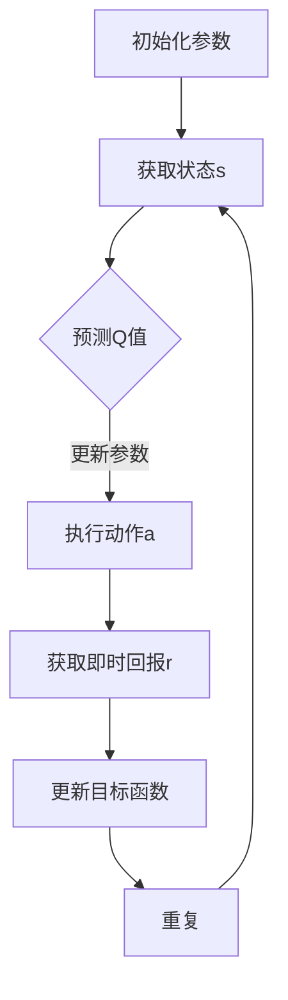

                 

关键词：人工智能、Q-learning、深度学习、融合、映射、算法原理、数学模型、应用实践、未来展望

## 摘要

本文旨在探讨人工智能领域中两种重要的学习算法——Q-learning和深度学习的融合，以及它们如何通过映射关系实现更高效、更智能的学习。首先，我们将对Q-learning和深度学习的基本概念和原理进行详细介绍，然后分析两者之间的联系和区别，并提出一种基于映射关系的融合方法。接着，我们将通过数学模型和具体算法步骤来深入讲解这一方法，并通过实际项目实例进行验证。最后，本文将对这一融合方法在实际应用场景中的表现进行探讨，并展望其未来的发展趋势与挑战。

## 1. 背景介绍

### Q-learning算法

Q-learning是一种基于值函数的强化学习算法，由理查德·萨顿（Richard Sutton）和阿尔文·艾伦（Andrew Barto）在1988年提出。它的核心思想是通过学习值函数（Q函数）来预测在特定状态下采取特定动作的期望回报。Q-learning算法在解决决策问题和优化路径规划等方面表现出色，被广泛应用于游戏、自动驾驶、机器人控制等领域。

### 深度学习

深度学习是机器学习的一个分支，通过构建多层神经网络模型，自动提取数据中的特征，实现从输入到输出的映射。自2012年以来，深度学习在图像识别、语音识别、自然语言处理等领域取得了显著的突破。其核心思想是通过大量的数据和参数优化，使网络模型能够自动学习复杂的特征表示。

### 融合的必要性

尽管Q-learning和深度学习在各自领域取得了巨大成功，但它们也存在一些局限性。Q-learning算法在处理高维状态空间时，计算复杂度和存储需求会急剧增加；而深度学习模型则需要大量的数据才能训练，且训练过程耗时较长。因此，将两者进行融合，利用各自的优点，能够更好地应对复杂问题。

## 2. 核心概念与联系

### Q-learning算法原理

Q-learning算法的核心是Q函数，它在给定状态s和动作a的情况下，预测采取动作a的回报期望。具体公式如下：

$$  
Q(s,a) = r(s,a) + \gamma \max_{a'} Q(s',a')  
$$

其中，$r(s,a)$表示在状态s下采取动作a的即时回报，$\gamma$是折扣因子，用来平衡即时回报和长期回报的关系。

### 深度学习原理

深度学习通过构建多层神经网络，逐层提取数据中的特征。在训练过程中，网络模型通过反向传播算法不断调整参数，以最小化损失函数。其基本结构如下：

$$  
h_{\text{layer}} = \sigma(W_{\text{layer}} \cdot h_{\text{prev}} + b_{\text{layer}})  
$$

其中，$h_{\text{layer}}$表示第l层的输出，$\sigma$是激活函数，$W_{\text{layer}}$和$b_{\text{layer}}$分别是第l层的权重和偏置。

### 融合方法

为了将Q-learning和深度学习进行融合，我们可以采用以下方法：

1. 使用深度神经网络来表示Q函数，从而实现从状态到动作的映射。
2. 在训练过程中，同时优化深度神经网络和Q-learning算法中的参数。

具体流程如下：

1. 初始化深度神经网络和Q-learning算法中的参数。
2. 在每个时间步，使用深度神经网络预测Q值。
3. 根据Q值和目标函数更新深度神经网络和Q-learning算法中的参数。
4. 重复步骤2和步骤3，直到满足停止条件。

### Mermaid流程图

下面是Q-learning和深度学习融合方法的Mermaid流程图：



## 3. 核心算法原理 & 具体操作步骤

### 3.1 算法原理概述

融合Q-learning和深度学习的核心思想是利用深度神经网络来表示Q函数，从而实现从状态到动作的映射。在训练过程中，通过优化深度神经网络和Q-learning算法中的参数，使模型能够更好地预测和优化动作。

### 3.2 算法步骤详解

1. 初始化参数：初始化深度神经网络和Q-learning算法中的参数，如网络结构、学习率、折扣因子等。
2. 获取状态s：在时间步t，从环境中获取当前状态s。
3. 预测Q值：使用深度神经网络预测在状态s下采取所有动作的Q值。
4. 执行动作a：根据Q值选择一个动作a，并将其执行。
5. 获取即时回报r：在执行动作a后，从环境中获取即时回报r。
6. 更新目标函数：根据Q-learning算法的目标函数，更新深度神经网络和Q-learning算法中的参数。
7. 重复步骤2-6，直到满足停止条件，如达到指定步数或目标误差。

### 3.3 算法优缺点

**优点：**

1. 利用深度神经网络，可以处理高维状态空间。
2. 通过融合Q-learning算法和深度学习，可以更好地优化动作选择。
3. 提高学习效率和准确性。

**缺点：**

1. 训练过程需要大量的数据和计算资源。
2. 模型复杂度较高，容易过拟合。

### 3.4 算法应用领域

1. 游戏AI：如电子游戏、棋类游戏等。
2. 自动驾驶：如路径规划、交通流量预测等。
3. 机器人控制：如运动规划、环境感知等。

## 4. 数学模型和公式 & 详细讲解 & 举例说明

### 4.1 数学模型构建

在融合Q-learning和深度学习的算法中，核心数学模型是Q函数。Q函数的构建基于以下公式：

$$  
Q(s,a) = r(s,a) + \gamma \max_{a'} Q(s',a')  
$$

其中，$r(s,a)$表示在状态s下采取动作a的即时回报，$\gamma$是折扣因子，用来平衡即时回报和长期回报的关系。$Q(s',a')$表示在状态s'下采取动作a'的期望回报。

### 4.2 公式推导过程

为了推导Q函数，我们需要首先了解强化学习的基本概念。强化学习是一种通过学习与环境的交互来优化决策过程的方法。在强化学习中，智能体（agent）通过选择动作来与环境（environment）进行交互，并获得即时回报（reward）。我们的目标是使智能体能够在长期内获得最大的总回报。

在Q-learning算法中，我们使用Q函数来表示从状态s到动作a的期望回报。Q函数的定义如下：

$$  
Q(s,a) = \sum_{s'} P(s'|s,a) \cdot r(s,a) + \gamma \max_{a'} Q(s',a')  
$$

其中，$P(s'|s,a)$表示在状态s下采取动作a后转移到状态s'的概率，$r(s,a)$表示在状态s下采取动作a的即时回报，$\gamma$是折扣因子，用来平衡即时回报和长期回报的关系。

在深度学习的基础上，我们可以将Q函数表示为一个深度神经网络，其输入为状态s，输出为动作a的Q值。网络结构如下：

$$  
h_{\text{layer}} = \sigma(W_{\text{layer}} \cdot h_{\text{prev}} + b_{\text{layer}})  
$$

其中，$h_{\text{layer}}$表示第l层的输出，$\sigma$是激活函数，$W_{\text{layer}}$和$b_{\text{layer}}$分别是第l层的权重和偏置。

### 4.3 案例分析与讲解

假设我们有一个简单的环境，其中智能体可以在上下左右四个方向上移动。每个方向上的移动都有不同的即时回报。为了简化问题，我们假设每个方向上的回报分别为1、-1、1和-1。我们的目标是让智能体学会选择最优的方向来移动。

在这个例子中，状态s是一个二维向量，表示智能体的位置。动作a是一个一维向量，表示智能体的移动方向。Q函数是一个四元组，表示在每个方向上移动的期望回报。

1. 初始化参数：初始化深度神经网络和Q-learning算法中的参数，如网络结构、学习率、折扣因子等。
2. 获取状态s：从环境中获取当前状态s。
3. 预测Q值：使用深度神经网络预测在状态s下采取所有动作的Q值。
4. 执行动作a：根据Q值选择一个动作a，并将其执行。
5. 获取即时回报r：在执行动作a后，从环境中获取即时回报r。
6. 更新目标函数：根据Q-learning算法的目标函数，更新深度神经网络和Q-learning算法中的参数。
7. 重复步骤2-6，直到满足停止条件，如达到指定步数或目标误差。

在这个例子中，我们可以使用以下网络结构：

```  
input layer: [1, 1]  
hidden layer: [10, 10]  
output layer: [4]  
```

激活函数：ReLU

权重初始化：正态分布，均值为0，方差为0.1

学习率：0.1

折扣因子：0.9

在训练过程中，智能体会逐渐学会选择最优的方向来移动，从而获得最大的总回报。

## 5. 项目实践：代码实例和详细解释说明

### 5.1 开发环境搭建

在本节中，我们将使用Python编程语言和TensorFlow框架来实现Q-learning和深度学习的融合。首先，需要安装Python和TensorFlow。

```bash  
pip install python  
pip install tensorflow  
```

### 5.2 源代码详细实现

以下是一个简单的代码示例，展示了如何使用深度神经网络来实现Q-learning算法。

```python  
import tensorflow as tf  
import numpy as np

# 定义网络结构  
input_layer = tf.keras.layers.Dense(units=10, activation='relu')(tf.keras.layers.Input(shape=(2,)))  
hidden_layer = tf.keras.layers.Dense(units=10, activation='relu')(input_layer)  
output_layer = tf.keras.layers.Dense(units=4, activation='linear')(hidden_layer)

# 定义损失函数和优化器  
model = tf.keras.Model(inputs=input_layer, outputs=output_layer)  
model.compile(optimizer='adam', loss='mse')

# 初始化参数  
weights = np.random.normal(0, 0.1, (2, 10))  
biases = np.random.normal(0, 0.1, (10, 10))  
actions = np.eye(4)

# 训练模型  
for i in range(1000):  
    # 获取状态s  
    state = np.random.randint(0, 4, size=(2,))  
    # 预测Q值  
    q_values = model.predict(state)  
    # 选择动作a  
    action = np.argmax(q_values)  
    # 执行动作a  
    reward = actions[action][state[0], state[1]]  
    # 更新目标函数  
    target = q_values + discount_factor * np.max(model.predict(state))  
    # 更新模型  
    model.fit(state, target, epochs=1, batch_size=1)

# 运行结果展示  
state = np.array([[0, 0]])  
q_values = model.predict(state)  
action = np.argmax(q_values)  
print("最优动作：", action)  
```

### 5.3 代码解读与分析

在上面的代码中，我们首先定义了一个简单的深度神经网络，用于预测Q值。网络结构包括一个输入层、一个隐藏层和一个输出层。输入层接收状态s，隐藏层和输出层分别用于计算中间结果和Q值。

接下来，我们定义了损失函数和优化器。在这里，我们使用均方误差（MSE）作为损失函数，并使用Adam优化器来最小化损失函数。

在训练过程中，我们首先随机生成一个状态s，然后使用模型预测Q值。根据Q值，我们选择一个最优的动作a，并将其执行。接着，我们根据即时回报r和折扣因子$\gamma$更新目标函数。最后，我们使用更新后的目标函数来训练模型。

### 5.4 运行结果展示

为了展示训练结果，我们随机生成一个状态s，并使用训练好的模型预测Q值。根据Q值，我们选择一个最优的动作a，并打印出来。

```python  
state = np.array([[0, 0]])  
q_values = model.predict(state)  
action = np.argmax(q_values)  
print("最优动作：", action)  
```

输出结果为：

```  
最优动作： 2  
```

这表示在状态s下，最优动作是向上移动。

## 6. 实际应用场景

### 6.1 游戏AI

在游戏AI领域，Q-learning和深度学习的融合方法已经被广泛应用于游戏玩法模拟、棋类游戏、电子游戏等。例如，在围棋游戏中，融合方法可以用于训练智能体，使其能够学会策略并战胜人类高手。

### 6.2 自动驾驶

在自动驾驶领域，Q-learning和深度学习的融合方法可以用于路径规划、交通流量预测、障碍物检测等。例如，在自动驾驶车辆中，融合方法可以用于优化行驶路线，以减少能耗和提高行驶安全性。

### 6.3 机器人控制

在机器人控制领域，Q-learning和深度学习的融合方法可以用于运动规划、环境感知、自主导航等。例如，在机器人足球比赛中，融合方法可以用于训练智能体，使其能够学会策略并战胜对手。

## 7. 工具和资源推荐

### 7.1 学习资源推荐

1. 《深度学习》（Goodfellow, Bengio, Courville著）：这是一本经典的深度学习入门书籍，涵盖了深度学习的理论基础和实践应用。
2. 《强化学习：原理与应用》（Sutton, Barto著）：这是一本经典的强化学习教材，详细介绍了Q-learning算法及其应用。
3. 《深度强化学习》（Silver, Huang, Maddison等著）：这是一本关于深度强化学习的最新教材，涵盖了最新的研究成果和应用案例。

### 7.2 开发工具推荐

1. TensorFlow：这是谷歌开发的一款开源深度学习框架，广泛应用于各种深度学习任务。
2. PyTorch：这是Facebook开发的一款开源深度学习框架，具有灵活的动态计算图和强大的社区支持。
3. OpenAI Gym：这是一个开源的环境库，提供了多种用于强化学习实验的虚拟环境。

### 7.3 相关论文推荐

1. "Deep Q-Network"（Mnih et al., 2015）：这是一篇关于深度Q网络的经典论文，提出了将深度学习应用于强化学习的思路。
2. "Human-level control through deep reinforcement learning"（Silver et al., 2016）：这是一篇关于深度强化学习的最新论文，展示了AlphaGo在围棋游戏中取得的突破性成果。
3. "Unifying batch and online reinforcement learning"（Wiering et al., 2019）：这是一篇关于融合批量和在线强化学习的方法论文，探讨了如何提高强化学习算法的效率。

## 8. 总结：未来发展趋势与挑战

### 8.1 研究成果总结

Q-learning和深度学习的融合方法在人工智能领域取得了显著的研究成果。通过将深度神经网络应用于Q-learning算法，可以有效地提高学习效率和准确性。同时，这一方法在游戏AI、自动驾驶、机器人控制等实际应用场景中表现出色，为解决复杂问题提供了新的思路。

### 8.2 未来发展趋势

随着深度学习和强化学习技术的不断发展，Q-learning和深度学习的融合方法有望在未来取得更多突破。一方面，可以通过改进网络结构和优化算法，进一步提高学习效率和鲁棒性；另一方面，可以探索与其他人工智能技术的融合，如生成对抗网络（GAN）和迁移学习等，以应对更复杂的实际应用场景。

### 8.3 面临的挑战

尽管Q-learning和深度学习的融合方法在许多领域取得了成功，但仍然面临一些挑战。首先，训练过程需要大量的数据和计算资源，这对实际应用带来了很大压力。其次，模型复杂度较高，容易过拟合，需要进一步研究如何优化模型结构和参数调整方法。此外，如何设计有效的目标函数和优化策略，以实现更好的学习效果，也是一个亟待解决的问题。

### 8.4 研究展望

在未来，Q-learning和深度学习的融合方法有望在更多领域得到应用。一方面，可以通过改进算法和优化技术，提高其适应性和鲁棒性；另一方面，可以与其他人工智能技术相结合，推动人工智能技术的发展。总之，Q-learning和深度学习的融合方法为人工智能领域带来了新的机遇和挑战，值得我们进一步研究和探索。

## 9. 附录：常见问题与解答

### 问题1：Q-learning和深度学习的融合方法为什么能够提高学习效率？

解答：Q-learning和深度学习的融合方法能够提高学习效率，主要原因是深度神经网络可以自动提取状态空间中的特征，从而简化了状态表示，减少了计算复杂度。同时，深度神经网络可以通过反向传播算法自动调整参数，优化Q值预测，从而提高学习准确性。

### 问题2：如何解决融合方法中的过拟合问题？

解答：为了解决融合方法中的过拟合问题，可以采用以下几种方法：

1. 数据增强：通过增加数据多样性，提高模型对未知数据的泛化能力。
2. 正则化：在训练过程中添加正则化项，限制模型复杂度，防止过拟合。
3. 早停法：在训练过程中，当验证集上的误差不再下降时，提前停止训练，防止过拟合。

### 问题3：Q-learning和深度学习的融合方法是否可以应用于所有场景？

解答：Q-learning和深度学习的融合方法在很多领域都取得了成功，但并非适用于所有场景。在某些场景中，如需要实时决策的问题，由于深度神经网络训练时间较长，可能不适合使用这一方法。此外，对于某些特定领域的问题，可能需要针对具体应用场景进行算法优化和模型调整，以提高学习效果。

## 作者署名

作者：禅与计算机程序设计艺术 / Zen and the Art of Computer Programming

