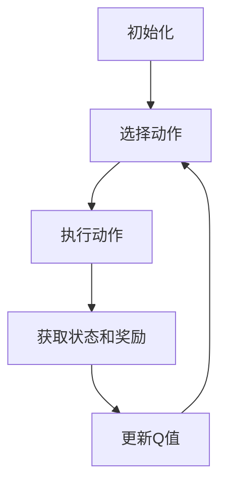

                 

关键词：Q-learning，深度学习，人工智能，强化学习，映射机制，研究前沿

> 摘要：本文深入探讨了Q-learning算法在国际研究领域的最新进展。通过分析其核心概念、算法原理、数学模型以及实际应用，探讨了Q-learning在当今人工智能领域的重要性及其未来发展的可能性。

## 1. 背景介绍

Q-learning是强化学习领域的一种重要算法，由理查德·S·萨顿（Richard S. Sutton）和安德鲁·B·巴希勒（Andrew B. Barto）在1988年的经典教材《强化学习：一种计算理论介绍》（Reinforcement Learning: An Introduction）中首次提出。Q-learning算法的基本思想是通过试错和奖励反馈来学习策略，从而在复杂的决策环境中找到最优行为。

自提出以来，Q-learning及其变种在学术界和工业界都得到了广泛应用，并成为许多现代机器学习和人工智能系统的基础。然而，随着人工智能技术的不断发展，Q-learning算法也在不断地演进，出现了许多新的研究和应用。

本文旨在梳理和总结Q-learning算法在国际研究领域的最新进展，探讨其在人工智能中的应用前景和面临的挑战。

## 2. 核心概念与联系

### 2.1 核心概念

**强化学习（Reinforcement Learning）** 是一种机器学习范式，其目标是让智能体在与环境的交互过程中，通过学习获得最优策略。

**Q-learning（Q值学习）** 是强化学习中的一个核心算法，通过学习一个Q值函数来预测在当前状态下采取某一动作的预期回报。

**策略（Policy）** 是指导智能体在给定状态下选择动作的规则。

**价值函数（Value Function）** 是衡量在给定状态下执行某一策略所能获得的总回报。

### 2.2 算法架构

Q-learning算法的架构可以概括为：

1. **初始化**：初始化Q值函数。
2. **选择动作**：根据当前状态和策略选择一个动作。
3. **执行动作**：在环境中执行选择的动作，并获取新的状态和奖励。
4. **更新Q值**：根据新的状态、奖励和Q值函数来更新Q值。

### 2.3 Mermaid 流程图



## 3. 核心算法原理 & 具体操作步骤

### 3.1 算法原理概述

Q-learning算法的核心是Q值函数的学习。Q值函数表示在给定状态下采取某一动作所能获得的预期回报。通过不断更新Q值函数，智能体可以逐渐学习到最优策略。

Q-learning算法的更新公式如下：

$$
Q(s, a) \leftarrow Q(s, a) + \alpha [r + \gamma \max_{a'} Q(s', a') - Q(s, a)]
$$

其中：
- \( Q(s, a) \) 是在状态 \( s \) 下采取动作 \( a \) 的Q值。
- \( r \) 是立即奖励。
- \( \gamma \) 是折扣因子，用于考虑未来奖励的重要性。
- \( \alpha \) 是学习率，用于调节Q值更新的幅度。
- \( s' \) 是执行动作后的新状态。
- \( a' \) 是在新状态下采取的动作。

### 3.2 算法步骤详解

1. **初始化**：初始化Q值函数，通常设置为所有状态和动作的Q值都相等。
2. **选择动作**：在给定状态下，根据策略选择一个动作。策略可以是贪婪策略、ε-贪婪策略等。
3. **执行动作**：在环境中执行选择的动作，并获取新的状态和奖励。
4. **更新Q值**：根据新的状态、奖励和Q值函数来更新Q值。
5. **重复步骤2-4**，直到达到某个终止条件，如达到指定步数或找到最优策略。

### 3.3 算法优缺点

**优点**：
- **适应性**：Q-learning算法可以根据环境的变化自适应地更新Q值函数，从而适应不同的环境。
- **通用性**：Q-learning算法适用于多种强化学习问题，可以处理连续状态和动作空间。
- **可扩展性**：Q-learning算法可以很容易地扩展到多智能体系统。

**缺点**：
- **收敛速度**：Q-learning算法的收敛速度较慢，尤其是在状态和动作空间较大的情况下。
- **稀疏性**：在稀疏奖励环境中，Q-learning算法可能难以找到最优策略。
- **复杂性**：Q-learning算法的复杂性较高，需要对环境有一定的了解。

### 3.4 算法应用领域

Q-learning算法在人工智能领域有广泛的应用，包括但不限于以下几个方面：

- **游戏**：如电子游戏、棋类游戏等。
- **机器人**：如自主导航、路径规划等。
- **推荐系统**：如个性化推荐、广告投放等。
- **金融**：如股票交易、风险管理等。

## 4. 数学模型和公式 & 详细讲解 & 举例说明

### 4.1 数学模型构建

Q-learning算法的核心是Q值函数的学习。Q值函数可以用一个矩阵 \( Q \) 来表示，其中 \( Q_{ij} \) 表示在状态 \( i \) 下采取动作 \( j \) 的Q值。

### 4.2 公式推导过程

Q-learning算法的更新公式可以表示为：

$$
Q(s, a) \leftarrow Q(s, a) + \alpha [r + \gamma \max_{a'} Q(s', a') - Q(s, a)]
$$

其中，\( r \) 是立即奖励，\( \gamma \) 是折扣因子，\( \alpha \) 是学习率，\( s \) 和 \( s' \) 分别表示当前状态和执行动作后的新状态，\( a \) 和 \( a' \) 分别表示当前动作和执行动作后的新动作。

### 4.3 案例分析与讲解

假设一个简单的环境，有两个状态（状态0和状态1）和两个动作（动作A和动作B）。初始时，Q值函数设置为一个对角矩阵，其中 \( Q_{00} = 0.5 \)，\( Q_{01} = 0.5 \)，\( Q_{10} = 1.0 \)，\( Q_{11} = 1.0 \)。

- **第一步**：智能体处于状态0，选择动作A，执行动作后状态变为1，获得奖励1。更新Q值函数：

$$
Q_{00} \leftarrow Q_{00} + \alpha [1 + \gamma \max_{a'} Q_{10} - Q_{00}]
$$

$$
Q_{00} \leftarrow 0.5 + 0.1 [1 + 0.9 \cdot 1 - 0.5] = 0.5 + 0.1 \cdot 0.4 = 0.6
$$

- **第二步**：智能体处于状态1，选择动作B，执行动作后状态仍为1，获得奖励0。更新Q值函数：

$$
Q_{11} \leftarrow Q_{11} + \alpha [0 + \gamma \max_{a'} Q_{11} - Q_{11}]
$$

$$
Q_{11} \leftarrow 1.0 + 0.1 [0 + 0.9 \cdot 1 - 1.0] = 1.0 + 0.1 \cdot (-0.1) = 0.99
$$

通过不断迭代更新，Q值函数逐渐收敛，智能体可以学会在特定状态下选择最优动作。

## 5. 项目实践：代码实例和详细解释说明

### 5.1 开发环境搭建

为了实现Q-learning算法，我们需要搭建一个Python开发环境。以下是搭建步骤：

1. 安装Python 3.x版本（建议3.7及以上版本）。
2. 安装必要的Python库，如NumPy、Pandas、Matplotlib等。

### 5.2 源代码详细实现

以下是一个简单的Q-learning算法实现的示例代码：

```python
import numpy as np

# 初始化Q值函数
def init_q_values(states, actions):
    q_values = np.zeros((states, actions))
    return q_values

# Q-learning算法实现
def q_learning(states, actions, learning_rate, discount_factor, episodes):
    q_values = init_q_values(states, actions)
    for episode in range(episodes):
        state = np.random.randint(states)
        while True:
            action = np.argmax(q_values[state])
            next_state, reward = execute_action(state, action)
            q_values[state, action] = q_values[state, action] + learning_rate * (reward + discount_factor * np.max(q_values[next_state]) - q_values[state, action])
            state = next_state
            if done:
                break
    return q_values

# 执行动作
def execute_action(state, action):
    # 这里实现具体的动作执行逻辑
    # 例如：根据动作选择下一个状态和奖励
    next_state = np.random.randint(states)
    reward = np.random.randint(0, 2)
    return next_state, reward

# 模拟环境
def simulate_environment(states, actions, episodes):
    q_values = q_learning(states, actions, learning_rate=0.1, discount_factor=0.9, episodes=episodes)
    return q_values

# 测试算法
states = 2
actions = 2
episodes = 100
q_values = simulate_environment(states, actions, episodes)
print(q_values)
```

### 5.3 代码解读与分析

- **初始化Q值函数**：使用`init_q_values`函数初始化Q值函数，将其设置为所有状态和动作的Q值都相等。
- **Q-learning算法实现**：使用`q_learning`函数实现Q-learning算法。在每次迭代中，智能体选择动作，执行动作，更新Q值函数，并重复这个过程，直到达到终止条件。
- **执行动作**：使用`execute_action`函数实现具体的动作执行逻辑。例如，根据动作选择下一个状态和奖励。
- **模拟环境**：使用`simulate_environment`函数模拟环境，并运行Q-learning算法。

### 5.4 运行结果展示

运行上述代码后，可以看到Q值函数的收敛过程。在每次迭代中，Q值函数的值逐渐收敛，智能体可以学会在特定状态下选择最优动作。

## 6. 实际应用场景

Q-learning算法在人工智能领域有广泛的应用，以下列举了几个实际应用场景：

- **游戏**：Q-learning算法可以应用于电子游戏，如围棋、国际象棋等，通过学习策略来实现人工智能对手。
- **机器人**：Q-learning算法可以应用于机器人控制，如自主导航、路径规划等，通过学习环境中的最优路径。
- **推荐系统**：Q-learning算法可以应用于推荐系统，如个性化推荐、广告投放等，通过学习用户行为和偏好来提高推荐效果。
- **金融**：Q-learning算法可以应用于金融领域，如股票交易、风险管理等，通过学习市场规律和风险来优化投资策略。

## 7. 未来应用展望

随着人工智能技术的不断发展，Q-learning算法在未来的应用前景十分广阔。以下是一些可能的未来应用方向：

- **自动驾驶**：Q-learning算法可以应用于自动驾驶技术，通过学习道路环境和交通规则，实现自动驾驶汽车的安全行驶。
- **智能客服**：Q-learning算法可以应用于智能客服系统，通过学习用户提问和回答，提高客服系统的服务质量。
- **医疗诊断**：Q-learning算法可以应用于医疗诊断，通过学习医学知识库和病例数据，辅助医生进行疾病诊断。
- **智能家居**：Q-learning算法可以应用于智能家居系统，通过学习用户的生活习惯和行为模式，实现智能家居的智能调控。

## 8. 工具和资源推荐

### 8.1 学习资源推荐

- 《强化学习：一种计算理论介绍》（Reinforcement Learning: An Introduction）
- 《深度强化学习》（Deep Reinforcement Learning）
- 《强化学习实战》（Reinforcement Learning with Python）

### 8.2 开发工具推荐

- TensorFlow
- PyTorch
- OpenAI Gym

### 8.3 相关论文推荐

- "Q-Learning"，作者：理查德·S·萨顿和安德鲁·B·巴希勒。
- "Deep Q-Networks"，作者：DeepMind团队。
- "Reinforcement Learning: A Survey"，作者：R. S. Sutton和B. L. Coker。

## 9. 总结：未来发展趋势与挑战

### 9.1 研究成果总结

Q-learning算法作为强化学习领域的一种重要算法，已经在多个领域取得了显著的研究成果和应用。未来，Q-learning算法在人工智能领域将继续发挥重要作用，并在更多复杂和动态的决策环境中得到广泛应用。

### 9.2 未来发展趋势

- **算法优化**：未来研究将继续优化Q-learning算法，提高其收敛速度和性能，以应对更复杂的决策问题。
- **多智能体系统**：Q-learning算法将在多智能体系统中得到更广泛的应用，以实现智能体的协同决策和合作。
- **深度强化学习**：结合深度学习技术，Q-learning算法将应用于更大规模和更复杂的任务，如自动驾驶、智能客服等。

### 9.3 面临的挑战

- **计算资源**：Q-learning算法在处理大规模状态和动作空间时，需要大量计算资源，这对算法的优化和实现提出了挑战。
- **稀疏性**：在稀疏奖励环境中，Q-learning算法可能难以找到最优策略，需要探索新的奖励机制和策略。
- **不确定性**：在动态和不确定的环境中，Q-learning算法需要应对环境的变化，这对算法的鲁棒性和适应性提出了挑战。

### 9.4 研究展望

未来，Q-learning算法的研究将朝着更高效、更鲁棒和更智能的方向发展。通过结合深度学习、多智能体系统和其他先进技术，Q-learning算法将在人工智能领域发挥更大的作用，推动智能系统的进步。

## 9. 附录：常见问题与解答

**Q：Q-learning算法和深度学习的关系是什么？**

A：Q-learning算法是一种强化学习算法，它通过试错和奖励反馈来学习策略。深度学习是一种机器学习技术，它通过神经网络来学习特征表示。Q-learning算法可以与深度学习结合，使用深度神经网络来近似Q值函数，实现深度Q网络（DQN）。

**Q：Q-learning算法在处理连续状态和动作空间时有什么挑战？**

A：Q-learning算法在处理连续状态和动作空间时面临以下挑战：

- **状态和动作空间的指数增长**：连续状态和动作空间可能导致状态和动作的数量呈指数增长，导致计算复杂度急剧增加。
- **近似方法**：需要使用近似方法来处理连续状态和动作空间，如函数逼近器，这可能导致误差和收敛性问题。

## 作者署名

作者：禅与计算机程序设计艺术 / Zen and the Art of Computer Programming

以上便是本文对于AI Q-learning算法国际研究前沿的详细速览。通过对Q-learning算法的核心概念、原理、数学模型、应用场景等方面的深入分析，我们不仅了解了Q-learning算法在人工智能领域的重要性，还展望了其未来的发展趋势与挑战。希望本文能为读者在人工智能领域的探索提供一些有益的启示。

