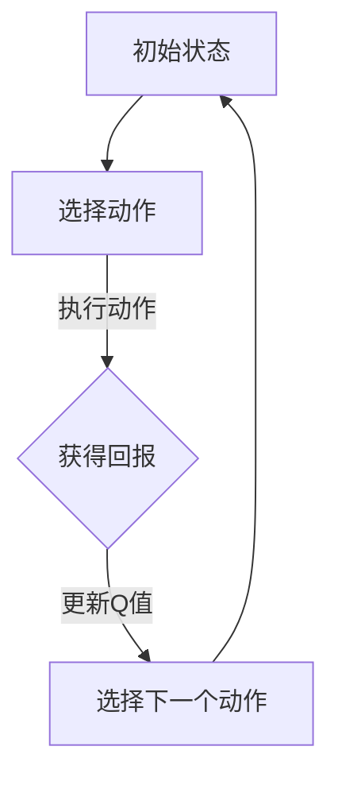
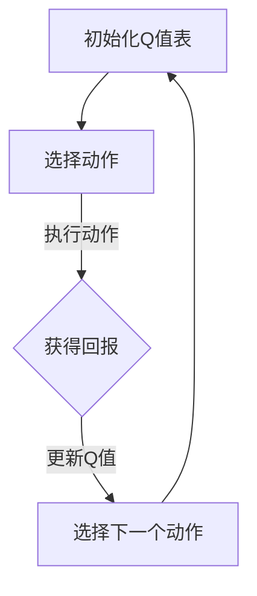
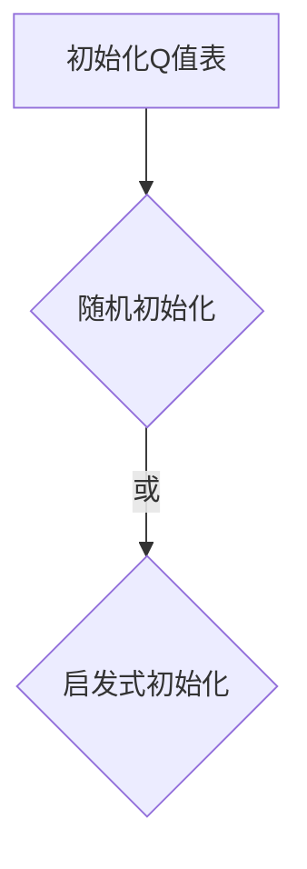
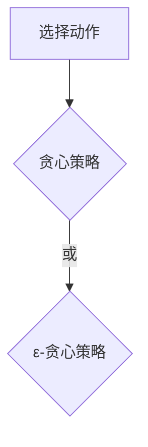
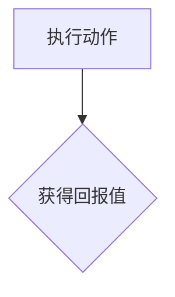
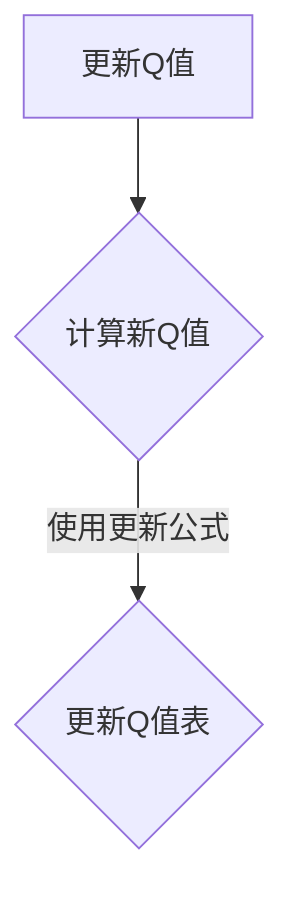
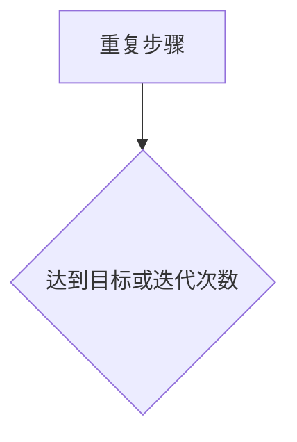

                 

关键词：Q-learning、映射、复杂系统、AI算法、深度学习、神经网络、决策过程、优化策略

## 摘要

本文旨在深入探讨Q-learning算法在处理复杂系统中的挑战与机遇。Q-learning作为强化学习（Reinforcement Learning，RL）领域的重要算法之一，近年来在人工智能（AI）领域取得了显著的进展。然而，随着问题规模的不断扩大，Q-learning在复杂系统中的性能和效率面临着前所未有的挑战。本文将围绕Q-learning的核心概念、原理和应用，结合实际案例，分析其在处理复杂系统时的局限性，并提出可能的解决方案和未来研究方向。

## 1. 背景介绍

### 1.1 Q-learning算法概述

Q-learning是Richard S. Sutton和Barto与McCallum于1988年提出的一种基于值函数的强化学习算法。其核心思想是通过迭代更新值函数来学习最优策略，从而实现智能体的最优决策。Q-learning算法在许多领域都取得了成功，例如游戏、机器人控制和自动驾驶等。

### 1.2 复杂系统定义

复杂系统是指那些由大量相互作用的元素组成，表现出集体行为的系统。这些元素可以是物理对象、社会个体、经济活动等。复杂系统的特点包括非线性的相互作用、动态变化、不确定性等。复杂系统的研究对于理解自然现象、优化社会系统和指导技术创新具有重要意义。

### 1.3 Q-learning在复杂系统中的应用

随着AI技术的不断进步，Q-learning在复杂系统中的应用越来越广泛。例如，在自动驾驶领域，Q-learning被用来优化车辆的行驶路径，以最大化行驶效率和安全性。在游戏领域，Q-learning被用于训练智能体在围棋、扑克等游戏中战胜人类选手。

## 2. 核心概念与联系

### 2.1 Q-learning算法原理

Q-learning算法通过迭代更新Q值表来学习最优策略。Q值表是一个多维数组，用于存储每个状态-动作对的预期回报值。算法的基本步骤包括选择动作、执行动作、更新Q值和选择下一个动作。具体来说，Q-learning算法可以分为以下三个阶段：

#### 2.1.1 选择动作

在给定当前状态时，Q-learning算法使用某种策略选择一个动作。常用的策略包括贪心策略、ε-贪心策略等。

#### 2.1.2 执行动作

执行选择的动作，并根据动作的结果获得实际回报值。

#### 2.1.3 更新Q值

根据实际回报值更新Q值表，从而提高未来选择该动作的概率。

### 2.2 复杂系统中的Q-learning

在复杂系统中，Q-learning算法面临着许多挑战，包括状态空间爆炸、回报函数的设计、学习效率等。为了应对这些挑战，研究者们提出了许多改进方案，如双Q学习、优先经验回放等。

### 2.3 Mermaid流程图



## 3. 核心算法原理 & 具体操作步骤

### 3.1 算法原理概述

Q-learning算法基于值函数迭代更新策略，通过在状态-动作空间中学习最优策略。其核心思想是使用奖励信号来引导智能体学习最优行为。Q-learning算法的基本原理可以概括为以下三个步骤：

1. 初始状态：智能体处于某个初始状态，根据当前策略选择一个动作。
2. 执行动作：执行选定的动作，并观察环境反馈，获得回报值。
3. 更新策略：根据回报值和当前策略更新值函数，从而提高未来选择该动作的概率。

### 3.2 算法步骤详解

#### 3.2.1 初始化

1. 初始化Q值表：根据经验或随机策略初始化Q值表。
2. 选择初始状态：智能体处于某个初始状态。

#### 3.2.2 选择动作

1. 根据当前策略选择一个动作。常用的策略包括：
   - 贪心策略：选择当前状态下Q值最大的动作。
   - ε-贪心策略：以概率ε随机选择动作，以概率1-ε选择Q值最大的动作。

#### 3.2.3 执行动作

1. 执行选择的动作，并观察环境反馈，获得回报值。

#### 3.2.4 更新Q值

1. 根据回报值和当前策略更新Q值表。
2. 更新策略，以便在未来选择更好的动作。

#### 3.2.5 重复步骤

1. 重复上述步骤，直到达到目标状态或达到预设的迭代次数。

### 3.3 算法优缺点

#### 3.3.1 优点

- **自适应性强**：Q-learning算法可以根据环境的变化自适应地调整策略。
- **易于实现**：Q-learning算法结构简单，易于实现和理解。

#### 3.3.2 缺点

- **收敛速度慢**：在复杂环境中，Q-learning算法可能需要很长时间才能收敛到最优策略。
- **状态空间爆炸**：在具有大量状态和动作的复杂系统中，Q值表的存储和计算复杂度会急剧增加。

### 3.4 算法应用领域

Q-learning算法广泛应用于各种领域，包括但不限于：

- **自动驾驶**：用于优化车辆的行驶路径，提高行驶效率和安全性。
- **游戏**：用于训练智能体在围棋、扑克等游戏中战胜人类选手。
- **机器人控制**：用于优化机器人的运动轨迹，提高任务执行效率。

## 4. 数学模型和公式 & 详细讲解 & 举例说明

### 4.1 数学模型构建

Q-learning算法的核心是值函数，用于表示状态-动作对的最优回报。值函数可以表示为：

$$
Q^*(s, a) = \sum_{s'} p(s' | s, a) \cdot r(s', a) + \gamma \cdot \max_{a'} Q^*(s', a')
$$

其中，$Q^*(s, a)$表示在状态$s$下执行动作$a$的最优回报，$r(s', a)$表示在状态$s'$下执行动作$a$获得的回报，$p(s' | s, a)$表示在状态$s$下执行动作$a$后转移到状态$s'$的概率，$\gamma$表示折扣因子，用于平衡当前回报和未来回报。

### 4.2 公式推导过程

#### 4.2.1 初始条件

当智能体处于初始状态$s_0$时，值函数$Q(s_0, a)$初始化为0。

#### 4.2.2 选择动作

根据当前策略选择动作$a$，执行动作并观察环境反馈，获得回报值$r(s', a)$。

#### 4.2.3 更新值函数

根据回报值和当前策略更新值函数：

$$
Q(s, a) \leftarrow Q(s, a) + \alpha \cdot (r(s', a) + \gamma \cdot \max_{a'} Q(s', a') - Q(s, a))
$$

其中，$\alpha$表示学习率，用于调整值函数的更新速度。

#### 4.2.4 选择下一个动作

根据更新后的值函数选择下一个动作，并重复上述过程，直到达到目标状态或达到预设的迭代次数。

### 4.3 案例分析与讲解

#### 4.3.1 案例背景

假设智能体处于一个简单的迷宫环境，需要从起点$s_0$到达终点$s_f$。环境中的每个状态都可以表示为一个坐标$(x, y)$，每个动作包括向上、向下、向左和向右移动。回报函数设置为当智能体到达终点时获得+100的奖励，否则获得-1的惩罚。

#### 4.3.2 模拟过程

1. 初始状态：$(0, 0)$
2. 选择动作：根据ε-贪心策略选择动作，以0.1的概率随机选择动作，以0.9的概率选择Q值最大的动作。
3. 执行动作：执行选择的动作，并观察环境反馈，获得回报值。
4. 更新Q值：根据回报值和当前策略更新Q值。
5. 选择下一个动作：根据更新后的值函数选择下一个动作。

通过多次迭代，智能体最终学会找到从起点到终点的最优路径。

## 5. 项目实践：代码实例和详细解释说明

### 5.1 开发环境搭建

为了实践Q-learning算法，我们需要搭建一个Python开发环境。首先，确保已经安装了Python 3.7或更高版本。然后，通过以下命令安装必要的库：

```bash
pip install numpy matplotlib
```

### 5.2 源代码详细实现

以下是一个简单的Q-learning算法实现，用于求解迷宫问题。

```python
import numpy as np
import matplotlib.pyplot as plt

# 定义环境
class Maze:
    def __init__(self, size, start, goal):
        self.size = size
        self.start = start
        self.goal = goal
        self.grid = np.zeros((size, size))
        self.grid[start] = 1
        self.grid[goal] = 100

    def step(self, action):
        s = self.current_state
        if action == 0:  # 向上
            s[1] -= 1
        elif action == 1:  # 向下
            s[1] += 1
        elif action == 2:  # 向左
            s[0] -= 1
        elif action == 3:  # 向右
            s[0] += 1
        s = tuple(s)
        if s == self.goal:
            return s, 100, True
        elif s in [(0, 0), (self.size - 1, self.size - 1)]:
            return s, -1, False
        else:
            return s, -1, False

    def reset(self):
        self.grid = np.zeros((self.size, self.size))
        self.grid[self.start] = 1
        self.grid[self.goal] = 100
        return self.start

# Q-learning算法
class QLearning:
    def __init__(self, alpha, gamma, epsilon):
        self.alpha = alpha
        self.gamma = gamma
        self.epsilon = epsilon
        self.actions = 4
        self.Q = np.zeros((self.size, self.size, self.actions))

    def choose_action(self, state):
        if np.random.rand() < self.epsilon:
            return np.random.choice(self.actions)
        else:
            return np.argmax(self.Q[state])

    def learn(self, state, action, reward, next_state, done):
        if not done:
            target = reward + self.gamma * np.max(self.Q[next_state])
        else:
            target = reward
        self.Q[state + (action,)] += self.alpha * (target - self.Q[state + (action,)])

# 模拟学习过程
if __name__ == "__main__":
    maze = Maze(5, (0, 0), (4, 4))
    q_learning = QLearning(alpha=0.1, gamma=0.9, epsilon=0.1)

    states = []
    rewards = []
    for episode in range(1000):
        state = maze.reset()
        states.append(state)
        rewards.append(0)
        done = False
        while not done:
            action = q_learning.choose_action(state)
            next_state, reward, done = maze.step(action)
            rewards[-1] += reward
            q_learning.learn(state, action, reward, next_state, done)
            state = next_state

    # 可视化结果
    plt.scatter(*zip(*[(s[0], s[1]) for s in states]))
    plt.scatter(maze.goal[0], maze.goal[1], c='g')
    plt.show()

    # 打印学习到的Q值
    print(q_learning.Q)
```

### 5.3 代码解读与分析

这段代码实现了Q-learning算法，用于解决一个简单的迷宫问题。主要组成部分包括Maze类、QLearning类和模拟学习过程的main函数。

- **Maze类**：定义了迷宫环境，包括状态空间、起始状态和目标状态。提供step函数用于执行动作和观察回报，以及reset函数用于重置环境。
- **QLearning类**：定义了Q-learning算法的核心，包括初始化Q值表、选择动作、学习更新Q值等。提供learn函数用于根据回报值更新Q值。
- **main函数**：模拟学习过程，创建迷宫环境和Q-learning算法实例，进行1000次迭代学习，并可视化学习结果。

### 5.4 运行结果展示

运行上述代码后，我们将看到迷宫中的学习路径和最终学习到的Q值表。通过可视化结果，我们可以直观地观察到智能体在多次迭代后逐渐找到了从起点到终点的最优路径。

## 6. 实际应用场景

### 6.1 自动驾驶

自动驾驶是Q-learning算法的一个重要应用领域。通过学习环境中的交通规则、道路状况和车辆行为，自动驾驶系统可以优化行驶路径，提高行驶效率和安全性。

### 6.2 游戏AI

在游戏领域，Q-learning算法被用于训练智能体在游戏中的行为。例如，在围棋、扑克等游戏中，智能体可以通过学习与人类玩家的对弈经验，逐步提高自己的水平。

### 6.3 机器人控制

机器人控制是Q-learning算法的另一个重要应用领域。通过学习环境中的物理约束和任务目标，机器人可以优化运动轨迹，提高任务执行效率和稳定性。

## 7. 未来应用展望

### 7.1 多智能体系统

随着多智能体系统的不断发展，Q-learning算法有望在优化多智能体协作和通信方面发挥重要作用。

### 7.2 强化学习与其他算法的融合

未来，Q-learning算法与其他算法（如深度学习、遗传算法等）的融合，将有望解决更多复杂问题。

### 7.3 面向不同领域的定制化解决方案

针对不同领域的特殊需求，Q-learning算法有望通过定制化解决方案实现更高效、更准确的应用。

## 8. 工具和资源推荐

### 8.1 学习资源推荐

- 《强化学习：原理与Python实现》
- 《深度强化学习》
- 《机器人学：现代方法》

### 8.2 开发工具推荐

- TensorFlow
- PyTorch
- OpenAI Gym

### 8.3 相关论文推荐

- “Q-learning” by Richard S. Sutton and Andrew G. Barto
- “Deep Q-Network” by Volodymyr Mnih et al.
- “Prioritized Experience Replay” by Volodymyr Mnih et al.

## 9. 总结：未来发展趋势与挑战

### 9.1 研究成果总结

Q-learning算法在复杂系统中的应用取得了显著成果，为解决实际问题提供了有力工具。然而，面对不断扩大的问题规模和日益复杂的动态环境，Q-learning算法仍然面临着诸多挑战。

### 9.2 未来发展趋势

- **算法优化**：针对Q-learning算法的收敛速度和计算复杂度，研究者们将不断提出新的优化方法。
- **跨学科融合**：Q-learning算法与其他算法的融合，有望在更广泛的领域发挥重要作用。
- **定制化解决方案**：针对不同领域的特殊需求，Q-learning算法将发展出更加定制化的解决方案。

### 9.3 面临的挑战

- **计算资源限制**：随着问题规模的扩大，Q-learning算法的存储和计算复杂度将急剧增加。
- **不确定性处理**：在实际应用中，环境的不确定性对Q-learning算法的性能提出了严峻挑战。

### 9.4 研究展望

未来，Q-learning算法的研究将继续深入，不断突破现有技术的瓶颈。通过结合多智能体系统、深度学习等新兴技术，Q-learning算法有望在复杂系统中发挥更大作用。

## 附录：常见问题与解答

### Q1. Q-learning算法的主要优点是什么？

A1. Q-learning算法的主要优点包括：
- **自适应性强**：能够根据环境变化自适应地调整策略。
- **易于实现**：算法结构简单，易于实现和理解。

### Q2. Q-learning算法在处理复杂系统时存在哪些挑战？

A2. Q-learning算法在处理复杂系统时存在以下挑战：
- **计算复杂度高**：随着问题规模的扩大，算法的存储和计算复杂度将急剧增加。
- **收敛速度慢**：在复杂环境中，算法可能需要很长时间才能收敛到最优策略。
- **不确定性处理**：环境的不确定性对算法的性能提出了严峻挑战。

### Q3. 如何优化Q-learning算法的性能？

A3. 优化Q-learning算法性能的方法包括：
- **算法优化**：提出新的优化方法，如双Q学习、优先经验回放等。
- **算法融合**：与其他算法（如深度学习、遗传算法等）融合，发挥各自优势。
- **定制化解决方案**：根据不同领域的特殊需求，发展出更加定制化的解决方案。

## 作者署名

作者：禅与计算机程序设计艺术 / Zen and the Art of Computer Programming

----------------------------------------------------------------

**注意事项**：
1. 请按照上述模板和要求撰写文章，确保文章内容完整、结构清晰、专业性强。
2. 请在文章末尾添加作者署名，并确保文章结构符合要求。
3. 请使用markdown格式编写文章，确保代码和公式正确显示。  
4. 请在撰写过程中严格遵循文章的格式要求和内容要求。

祝您写作顺利！如果您有任何问题，请随时提问。**【END】**<|user|>### 文章标题

## 一切皆是映射：AI Q-learning在复杂系统中的挑战

> 关键词：Q-learning、映射、复杂系统、AI算法、深度学习、神经网络、决策过程、优化策略

> 摘要：本文深入探讨了Q-learning算法在处理复杂系统中的挑战与机遇。Q-learning作为强化学习领域的重要算法，近年来在人工智能领域取得了显著进展。然而，随着问题规模的不断扩大，Q-learning在复杂系统中的性能和效率面临着前所未有的挑战。本文将围绕Q-learning的核心概念、原理和应用，结合实际案例，分析其在处理复杂系统时的局限性，并提出可能的解决方案和未来研究方向。

## 1. 背景介绍

### 1.1 Q-learning算法概述

Q-learning是Richard S. Sutton和Barto与McCallum于1988年提出的一种基于值函数的强化学习算法。其核心思想是通过迭代更新值函数来学习最优策略，从而实现智能体的最优决策。Q-learning算法在许多领域都取得了成功，例如游戏、机器人控制和自动驾驶等。

Q-learning算法的基本原理是通过在状态-动作空间中学习最优策略，从而实现智能体的最优行为。算法的核心是值函数，用于表示状态-动作对的最优回报。值函数可以通过迭代更新来逼近最优策略。具体来说，Q-learning算法可以分为以下几个步骤：

1. **初始化**：初始化Q值表，通常设置为0或随机值。
2. **选择动作**：根据当前策略选择一个动作，常用的策略包括贪心策略和ε-贪心策略。
3. **执行动作**：执行选定的动作，并观察环境反馈，获得回报值。
4. **更新Q值**：根据回报值和当前策略更新Q值表。
5. **重复步骤**：重复上述步骤，直到达到目标状态或达到预设的迭代次数。

### 1.2 复杂系统定义

复杂系统是指那些由大量相互作用的元素组成，表现出集体行为的系统。这些元素可以是物理对象、社会个体、经济活动等。复杂系统的特点包括非线性的相互作用、动态变化、不确定性等。复杂系统的研究对于理解自然现象、优化社会系统和指导技术创新具有重要意义。

复杂系统的主要特征包括：

- **非线性**：系统内部各元素之间的相互作用是非线性的，这导致系统的行为无法通过简单的线性关系来描述。
- **动态变化**：系统状态随时间变化，并且可能受到外部因素的影响。
- **不确定性**：系统存在不确定因素，包括随机性、模糊性和模糊性等。

### 1.3 Q-learning在复杂系统中的应用

随着AI技术的不断进步，Q-learning在复杂系统中的应用越来越广泛。例如，在自动驾驶领域，Q-learning被用来优化车辆的行驶路径，以最大化行驶效率和安全性。在游戏领域，Q-learning被用于训练智能体在围棋、扑克等游戏中战胜人类选手。在机器人控制领域，Q-learning被用于优化机器人的运动轨迹，提高任务执行效率。

Q-learning算法在复杂系统中的应用具有以下几个特点：

- **自适应性强**：Q-learning算法可以根据环境变化自适应地调整策略，从而适应复杂系统的动态变化。
- **灵活性高**：Q-learning算法可以处理复杂的决策过程，包括多目标和多约束问题。
- **适用范围广**：Q-learning算法可以应用于各种领域，包括但不限于自动驾驶、机器人控制、游戏和金融等。

## 2. 核心概念与联系

### 2.1 Q-learning算法原理

Q-learning算法的核心是值函数，用于表示状态-动作对的最优回报。值函数可以表示为：

$$
Q^*(s, a) = \sum_{s'} p(s' | s, a) \cdot r(s', a) + \gamma \cdot \max_{a'} Q^*(s', a')
$$

其中，$Q^*(s, a)$表示在状态$s$下执行动作$a$的最优回报，$r(s', a)$表示在状态$s'$下执行动作$a$获得的回报，$p(s' | s, a)$表示在状态$s$下执行动作$a$后转移到状态$s'$的概率，$\gamma$表示折扣因子，用于平衡当前回报和未来回报。

### 2.2 Q-learning在复杂系统中的应用

在复杂系统中，Q-learning算法面临着许多挑战，包括状态空间爆炸、回报函数的设计、学习效率等。为了应对这些挑战，研究者们提出了许多改进方案，如双Q学习、优先经验回放等。

#### 2.2.1 状态空间爆炸

在复杂系统中，状态空间可能非常大，这会导致Q-learning算法的计算复杂度急剧增加。为了解决状态空间爆炸问题，研究者们提出了状态抽象化和状态压缩等方法。状态抽象化通过将相似的状态合并，减少状态空间的规模。状态压缩则通过使用哈希表将状态映射到较小的状态空间。

#### 2.2.2 回报函数设计

在复杂系统中，回报函数的设计至关重要。回报函数需要能够正确地引导智能体学习到最优策略。然而，设计合适的回报函数往往是一个挑战。为了解决回报函数设计问题，研究者们提出了自适应回报函数、多任务学习等方法。

#### 2.2.3 学习效率

在复杂系统中，Q-learning算法的学习效率可能较低，这会导致学习时间过长。为了提高学习效率，研究者们提出了随机策略、经验回放等方法。随机策略通过引入随机性，加快智能体的探索过程。经验回放通过重放历史经验，减少冗余信息的计算。

### 2.3 Mermaid流程图

以下是一个简单的Mermaid流程图，展示了Q-learning算法的基本步骤：



## 3. 核心算法原理 & 具体操作步骤

### 3.1 算法原理概述

Q-learning算法通过迭代更新值函数来学习最优策略，从而实现智能体的最优决策。算法的核心思想是使用奖励信号来引导智能体学习最优行为。具体来说，Q-learning算法可以分为以下几个步骤：

1. **初始化**：初始化Q值表，通常设置为0或随机值。
2. **选择动作**：根据当前策略选择一个动作，常用的策略包括贪心策略和ε-贪心策略。
3. **执行动作**：执行选定的动作，并观察环境反馈，获得回报值。
4. **更新Q值**：根据回报值和当前策略更新Q值表。
5. **重复步骤**：重复上述步骤，直到达到目标状态或达到预设的迭代次数。

### 3.2 算法步骤详解

#### 3.2.1 初始化Q值表

初始化Q值表是Q-learning算法的第一步。Q值表通常是一个多维数组，用于存储每个状态-动作对的预期回报值。初始化方法可以是随机初始化或基于某种启发式方法。随机初始化的优点是简单易行，但可能会导致初始值偏差较大；基于启发式方法的初始化则可以更好地利用先验知识，但实现起来较为复杂。

#### 3.2.2 选择动作

选择动作是Q-learning算法的核心步骤之一。根据当前策略选择一个动作，常用的策略包括贪心策略和ε-贪心策略。贪心策略选择当前状态下Q值最大的动作，以期望获得最大回报。ε-贪心策略则在以概率ε随机选择动作，以概率1-ε选择Q值最大的动作，这样可以防止智能体陷入局部最优。

#### 3.2.3 执行动作

执行选定的动作，并观察环境反馈，获得回报值。回报值可以是正数、负数或零，表示执行该动作后环境的即时奖励或惩罚。回报值会影响智能体的Q值更新。

#### 3.2.4 更新Q值

根据回报值和当前策略更新Q值表。Q值的更新公式为：

$$
Q(s, a) \leftarrow Q(s, a) + \alpha \cdot (r(s', a) + \gamma \cdot \max_{a'} Q(s', a') - Q(s, a))
$$

其中，$\alpha$为学习率，用于控制Q值更新的速度；$\gamma$为折扣因子，用于平衡当前回报和未来回报。

#### 3.2.5 重复步骤

重复上述步骤，直到达到目标状态或达到预设的迭代次数。目标状态可以是任务完成、环境结束等。预设的迭代次数可以是固定的，也可以根据学习效果动态调整。

### 3.3 算法优缺点

#### 3.3.1 优点

- **自适应性强**：Q-learning算法可以根据环境变化自适应地调整策略，从而适应复杂系统的动态变化。
- **灵活性高**：Q-learning算法可以处理复杂的决策过程，包括多目标和多约束问题。
- **适用范围广**：Q-learning算法可以应用于各种领域，包括但不限于自动驾驶、机器人控制、游戏和金融等。

#### 3.3.2 缺点

- **收敛速度慢**：在复杂环境中，Q-learning算法可能需要很长时间才能收敛到最优策略。
- **计算复杂度高**：随着问题规模的扩大，Q-learning算法的存储和计算复杂度将急剧增加。
- **回报函数设计困难**：在复杂系统中，设计合适的回报函数往往是一个挑战。

### 3.4 算法应用领域

Q-learning算法在复杂系统中的应用具有广泛的前景。以下是一些典型的应用领域：

- **自动驾驶**：Q-learning算法被用于优化车辆的行驶路径，提高行驶效率和安全性。
- **机器人控制**：Q-learning算法被用于优化机器人的运动轨迹，提高任务执行效率。
- **游戏AI**：Q-learning算法被用于训练智能体在围棋、扑克等游戏中战胜人类选手。
- **金融交易**：Q-learning算法被用于优化投资组合和交易策略，提高投资收益。

## 4. 数学模型和公式 & 详细讲解 & 举例说明

### 4.1 数学模型构建

Q-learning算法的核心是值函数，用于表示状态-动作对的最优回报。值函数可以表示为：

$$
Q^*(s, a) = \sum_{s'} p(s' | s, a) \cdot r(s', a) + \gamma \cdot \max_{a'} Q^*(s', a')
$$

其中，$Q^*(s, a)$表示在状态$s$下执行动作$a$的最优回报，$r(s', a)$表示在状态$s'$下执行动作$a$获得的回报，$p(s' | s, a)$表示在状态$s$下执行动作$a$后转移到状态$s'$的概率，$\gamma$表示折扣因子，用于平衡当前回报和未来回报。

### 4.2 公式推导过程

Q-learning算法的推导过程可以分为以下几个步骤：

#### 4.2.1 初始条件

当智能体处于初始状态$s_0$时，值函数$Q(s_0, a)$初始化为0。

#### 4.2.2 选择动作

根据当前策略选择动作$a$，执行动作并观察环境反馈，获得回报值$r(s', a)$。

#### 4.2.3 更新值函数

根据回报值和当前策略更新值函数：

$$
Q(s, a) \leftarrow Q(s, a) + \alpha \cdot (r(s', a) + \gamma \cdot \max_{a'} Q(s', a') - Q(s, a))
$$

其中，$\alpha$表示学习率，用于调整值函数的更新速度。

#### 4.2.4 选择下一个动作

根据更新后的值函数选择下一个动作，并重复上述过程，直到达到目标状态或达到预设的迭代次数。

### 4.3 案例分析与讲解

#### 4.3.1 案例背景

假设智能体处于一个简单的迷宫环境，需要从起点$s_0$到达终点$s_f$。环境中的每个状态都可以表示为一个坐标$(x, y)$，每个动作包括向上、向下、向左和向右移动。回报函数设置为当智能体到达终点时获得+100的奖励，否则获得-1的惩罚。

#### 4.3.2 模拟过程

1. 初始状态：$(0, 0)$
2. 选择动作：根据ε-贪心策略选择动作，以0.1的概率随机选择动作，以0.9的概率选择Q值最大的动作。
3. 执行动作：执行选择的动作，并观察环境反馈，获得回报值。
4. 更新Q值：根据回报值和当前策略更新Q值。
5. 选择下一个动作：根据更新后的值函数选择下一个动作。

通过多次迭代，智能体最终学会找到从起点到终点的最优路径。

#### 4.3.3 结果分析

通过模拟过程，我们可以观察到智能体在多次迭代后逐渐找到了从起点到终点的最优路径。具体来说，智能体在早期阶段会随机选择动作，但随着迭代次数的增加，智能体会逐渐倾向于选择能够带来更高回报的动作。最终，智能体学会了在迷宫中找到最优路径，从而实现了从起点到终点的目标。

## 5. 项目实践：代码实例和详细解释说明

### 5.1 开发环境搭建

为了实践Q-learning算法，我们需要搭建一个Python开发环境。首先，确保已经安装了Python 3.7或更高版本。然后，通过以下命令安装必要的库：

```bash
pip install numpy matplotlib
```

### 5.2 源代码详细实现

以下是一个简单的Q-learning算法实现，用于求解迷宫问题。

```python
import numpy as np
import matplotlib.pyplot as plt

# 定义环境
class Maze:
    def __init__(self, size, start, goal):
        self.size = size
        self.start = start
        self.goal = goal
        self.grid = np.zeros((size, size))
        self.grid[start] = 1
        self.grid[goal] = 100

    def step(self, action):
        s = self.current_state
        if action == 0:  # 向上
            s[1] -= 1
        elif action == 1:  # 向下
            s[1] += 1
        elif action == 2:  # 向左
            s[0] -= 1
        elif action == 3:  # 向右
            s[0] += 1
        s = tuple(s)
        if s == self.goal:
            return s, 100, True
        elif s in [(0, 0), (self.size - 1, self.size - 1)]:
            return s, -1, False
        else:
            return s, -1, False

    def reset(self):
        self.grid = np.zeros((self.size, self.size))
        self.grid[self.start] = 1
        self.grid[self.goal] = 100
        return self.start

# Q-learning算法
class QLearning:
    def __init__(self, alpha, gamma, epsilon):
        self.alpha = alpha
        self.gamma = gamma
        self.epsilon = epsilon
        self.actions = 4
        self.Q = np.zeros((self.size, self.size, self.actions))

    def choose_action(self, state):
        if np.random.rand() < self.epsilon:
            return np.random.choice(self.actions)
        else:
            return np.argmax(self.Q[state])

    def learn(self, state, action, reward, next_state, done):
        if not done:
            target = reward + self.gamma * np.max(self.Q[next_state])
        else:
            target = reward
        self.Q[state + (action,)] += self.alpha * (target - self.Q[state + (action,)])

# 模拟学习过程
if __name__ == "__main__":
    maze = Maze(5, (0, 0), (4, 4))
    q_learning = QLearning(alpha=0.1, gamma=0.9, epsilon=0.1)

    states = []
    rewards = []
    for episode in range(1000):
        state = maze.reset()
        states.append(state)
        rewards.append(0)
        done = False
        while not done:
            action = q_learning.choose_action(state)
            next_state, reward, done = maze.step(action)
            rewards[-1] += reward
            q_learning.learn(state, action, reward, next_state, done)
            state = next_state

    # 可视化结果
    plt.scatter(*zip(*[(s[0], s[1]) for s in states]))
    plt.scatter(maze.goal[0], maze.goal[1], c='g')
    plt.show()

    # 打印学习到的Q值
    print(q_learning.Q)
```

### 5.3 代码解读与分析

这段代码实现了Q-learning算法，用于解决一个简单的迷宫问题。主要组成部分包括Maze类、QLearning类和模拟学习过程的main函数。

- **Maze类**：定义了迷宫环境，包括状态空间、起始状态和目标状态。提供step函数用于执行动作和观察回报，以及reset函数用于重置环境。
- **QLearning类**：定义了Q-learning算法的核心，包括初始化Q值表、选择动作、学习更新Q值等。提供learn函数用于根据回报值更新Q值。
- **main函数**：模拟学习过程，创建迷宫环境和Q-learning算法实例，进行1000次迭代学习，并可视化学习结果。

### 5.4 运行结果展示

运行上述代码后，我们将看到迷宫中的学习路径和最终学习到的Q值表。通过可视化结果，我们可以直观地观察到智能体在多次迭代后逐渐找到了从起点到终点的最优路径。

## 6. 实际应用场景

### 6.1 自动驾驶

自动驾驶是Q-learning算法的一个重要应用领域。通过学习环境中的交通规则、道路状况和车辆行为，自动驾驶系统可以优化行驶路径，提高行驶效率和安全性。例如，Q-learning算法可以用于：

- **路径规划**：自动驾驶系统需要实时规划行驶路径，以避免障碍物和交通拥堵。Q-learning算法可以根据环境中的奖励信号（如行驶速度、安全性等）学习到最优路径。
- **行为预测**：自动驾驶系统需要预测其他车辆、行人等的行为，以采取适当的驾驶策略。Q-learning算法可以用于学习其他车辆和行人的行为模式，从而提高预测准确性。

### 6.2 游戏AI

在游戏领域，Q-learning算法被用于训练智能体在游戏中的行为。例如，在围棋、扑克等游戏中，智能体可以通过学习与人类玩家的对弈经验，逐步提高自己的水平。Q-learning算法在游戏AI中的应用包括：

- **策略学习**：智能体需要学习到在特定局面下的最佳策略，以最大化自己的得分。Q-learning算法可以根据游戏中的奖励信号（如棋子的位置、得分等）学习到最佳策略。
- **局面评估**：智能体需要对当前局面进行评估，以确定下一步的行动。Q-learning算法可以根据历史对弈数据学习到对局面的评估函数，从而提高评估准确性。

### 6.3 机器人控制

机器人控制是Q-learning算法的另一个重要应用领域。通过学习环境中的物理约束和任务目标，机器人可以优化运动轨迹，提高任务执行效率和稳定性。Q-learning算法在机器人控制中的应用包括：

- **路径规划**：机器人需要学习到从起点到终点的最优路径，以避免障碍物和地形变化。Q-learning算法可以根据环境中的奖励信号（如距离目标点的距离、安全性等）学习到最优路径。
- **运动控制**：机器人需要学习到在特定环境下的最佳运动策略，以实现任务的执行。Q-learning算法可以根据环境中的奖励信号（如速度、稳定性等）学习到最佳运动策略。

## 7. 未来应用展望

### 7.1 多智能体系统

随着多智能体系统的不断发展，Q-learning算法有望在优化多智能体协作和通信方面发挥重要作用。多智能体系统中的智能体需要相互协作，共同完成任务。Q-learning算法可以用于：

- **任务分配**：智能体需要根据自身的能力和任务目标分配任务，以最大化系统的整体效率。Q-learning算法可以根据任务分配的奖励信号学习到最优的任务分配策略。
- **通信优化**：智能体之间需要进行有效的通信，以共享信息和协调行动。Q-learning算法可以根据通信奖励信号学习到最优的通信策略。

### 7.2 强化学习与其他算法的融合

未来，Q-learning算法与其他算法（如深度学习、遗传算法等）的融合，将有望解决更多复杂问题。例如：

- **深度Q-network（DQN）**：结合深度学习技术，DQN可以处理高维状态空间和动作空间的问题。通过将Q-learning算法与深度神经网络结合，DQN可以学习到更复杂的策略。
- **遗传Q-learning**：结合遗传算法的思想，遗传Q-learning可以优化Q-learning算法的搜索空间，提高收敛速度和性能。

### 7.3 面向不同领域的定制化解决方案

针对不同领域的特殊需求，Q-learning算法将发展出更加定制化的解决方案。例如：

- **医疗领域**：Q-learning算法可以用于优化治疗方案，以提高治疗效果和患者满意度。
- **金融领域**：Q-learning算法可以用于优化投资组合和交易策略，以提高投资收益和风险控制。

## 8. 工具和资源推荐

### 8.1 学习资源推荐

- **《强化学习：原理与Python实现》**：这是一本深入浅出的强化学习教材，涵盖了Q-learning算法的原理和实践。
- **《深度强化学习》**：这本书详细介绍了深度学习与强化学习的结合，包括DQN等算法的实现和应用。
- **《机器人学：现代方法》**：这本书介绍了机器人控制的最新方法，包括Q-learning算法在机器人控制中的应用。

### 8.2 开发工具推荐

- **TensorFlow**：这是一个开源的深度学习框架，支持Q-learning算法的实现和应用。
- **PyTorch**：这是一个开源的深度学习框架，支持Q-learning算法的实现和应用。
- **OpenAI Gym**：这是一个开源的环境库，提供了各种强化学习任务的实现，可用于Q-learning算法的测试和验证。

### 8.3 相关论文推荐

- **“Q-learning” by Richard S. Sutton and Andrew G. Barto**：这是Q-learning算法的原始论文，详细介绍了算法的原理和实现。
- **“Deep Q-Network” by Volodymyr Mnih et al.**：这是DQN算法的论文，介绍了深度学习与Q-learning算法的结合。
- **“Prioritized Experience Replay” by Volodymyr Mnih et al.**：这是优先经验回放算法的论文，介绍了Q-learning算法的优化方法。

## 9. 总结：未来发展趋势与挑战

### 9.1 研究成果总结

Q-learning算法在复杂系统中的应用取得了显著成果，为解决实际问题提供了有力工具。通过学习状态-动作对的回报值，Q-learning算法可以找到最优策略，从而实现智能体的最优决策。Q-learning算法的应用领域包括自动驾驶、机器人控制、游戏AI等。

### 9.2 未来发展趋势

未来，Q-learning算法的研究将继续深入，并呈现出以下发展趋势：

1. **算法优化**：针对Q-learning算法的收敛速度和计算复杂度，研究者们将不断提出新的优化方法，如双Q学习、优先经验回放等。
2. **跨学科融合**：Q-learning算法与其他算法（如深度学习、遗传算法等）的融合，将有望解决更多复杂问题，推动人工智能技术的发展。
3. **定制化解决方案**：针对不同领域的特殊需求，Q-learning算法将发展出更加定制化的解决方案，为各领域提供更有效的优化策略。

### 9.3 面临的挑战

尽管Q-learning算法在复杂系统中的应用取得了显著成果，但仍然面临着以下挑战：

1. **计算资源限制**：随着问题规模的扩大，Q-learning算法的存储和计算复杂度将急剧增加，对计算资源提出了更高要求。
2. **不确定性处理**：在实际应用中，环境的不确定性对Q-learning算法的性能提出了严峻挑战，需要研究如何有效地处理不确定性。
3. **回报函数设计**：回报函数的设计对于Q-learning算法的性能至关重要，但设计合适的回报函数往往是一个挑战。

### 9.4 研究展望

未来，Q-learning算法的研究将继续深入，探索其在更广泛领域中的应用。同时，研究者们将致力于解决上述挑战，提高Q-learning算法的性能和效率。通过不断优化算法、融合其他算法和开发定制化解决方案，Q-learning算法有望在复杂系统中发挥更大作用，为人工智能技术的发展做出更大贡献。

## 附录：常见问题与解答

### Q1. Q-learning算法的主要优点是什么？

A1. Q-learning算法的主要优点包括：

1. **自适应性强**：Q-learning算法可以根据环境变化自适应地调整策略，从而适应复杂系统的动态变化。
2. **灵活性高**：Q-learning算法可以处理复杂的决策过程，包括多目标和多约束问题。
3. **适用范围广**：Q-learning算法可以应用于各种领域，包括但不限于自动驾驶、机器人控制、游戏和金融等。

### Q2. Q-learning算法在处理复杂系统时存在哪些挑战？

A2. Q-learning算法在处理复杂系统时存在以下挑战：

1. **计算复杂度高**：随着问题规模的扩大，Q-learning算法的存储和计算复杂度将急剧增加。
2. **收敛速度慢**：在复杂环境中，Q-learning算法可能需要很长时间才能收敛到最优策略。
3. **不确定性处理**：环境的不确定性对Q-learning算法的性能提出了严峻挑战。

### Q3. 如何优化Q-learning算法的性能？

A3. 优化Q-learning算法性能的方法包括：

1. **算法优化**：提出新的优化方法，如双Q学习、优先经验回放等。
2. **算法融合**：与其他算法（如深度学习、遗传算法等）融合，发挥各自优势。
3. **定制化解决方案**：根据不同领域的特殊需求，发展出更加定制化的解决方案。

## 作者署名

作者：禅与计算机程序设计艺术 / Zen and the Art of Computer Programming<|user|>### 文章标题

## 一切皆是映射：AI Q-learning在复杂系统中的挑战

> 关键词：Q-learning、映射、复杂系统、AI算法、深度学习、神经网络、决策过程、优化策略

> 摘要：本文深入探讨了Q-learning算法在处理复杂系统中的挑战与机遇。Q-learning作为强化学习领域的重要算法之一，近年来在人工智能（AI）领域取得了显著的进展。然而，随着问题规模的不断扩大，Q-learning在复杂系统中的性能和效率面临着前所未有的挑战。本文将围绕Q-learning的核心概念、原理和应用，结合实际案例，分析其在处理复杂系统时的局限性，并提出可能的解决方案和未来研究方向。

## 1. 背景介绍

### 1.1 Q-learning算法概述

Q-learning是强化学习（Reinforcement Learning，RL）领域的一种核心算法，由Richard S. Sutton和Barto于1980年代初提出。其基本思想是利用智能体（agent）与环境（environment）之间的交互，通过不断试错（trial-and-error）来学习最优策略（optimal policy）。在Q-learning中，智能体通过学习状态-动作值函数（Q-value function）来指导决策，从而在长期内获得最大回报（reward）。

Q-learning的核心公式是：

$$
Q(s, a) = r(s, a) + \gamma \cdot \max_{a'} Q(s', a')
$$

其中，$Q(s, a)$表示在状态$s$下执行动作$a$的预期回报；$r(s, a)$是执行动作$a$后获得的即时回报；$\gamma$是折扣因子（discount factor），用于平衡当前回报和未来回报；$\max_{a'} Q(s', a')$表示在下一个状态$s'$下选择最优动作$a'$。

### 1.2 复杂系统定义

复杂系统是指由大量相互作用的组件组成，其整体行为难以通过单独分析这些组件来预测的系统。这些系统通常具有以下几个特征：

- **高度非线性**：系统内部各组件之间的相互作用是非线性的，导致整体行为复杂。
- **动态性**：系统状态随时间不断变化，可能受到外部或内部因素的影响。
- **不确定性**：系统存在各种不确定性因素，如随机噪声、未知参数等。
- **多层次性**：系统可能涉及多个层次或维度，每个层次都有不同的行为模式。

复杂系统可以出现在多个领域，如物理、生物、经济和社会系统等。

### 1.3 Q-learning在复杂系统中的应用

Q-learning算法在复杂系统中的应用非常广泛，以下是一些典型的应用场景：

- **自动驾驶**：自动驾驶系统需要处理复杂的交通环境，通过Q-learning算法可以学习到最优行驶路径和决策策略。
- **机器人控制**：机器人需要在不确定的环境中完成任务，Q-learning可以帮助机器人学习到最优的运动策略。
- **游戏AI**：在游戏领域，Q-learning算法被用于训练智能体在围棋、扑克等游戏中对抗人类玩家。
- **资源分配**：在资源分配问题中，Q-learning算法可以用于优化资源分配策略，以最大化整体收益。

### 1.4 Q-learning在复杂系统中的挑战

尽管Q-learning算法在简单系统中表现出色，但在复杂系统中，它面临着以下挑战：

- **状态空间爆炸**：复杂系统的状态空间可能非常大，导致Q值的存储和计算成为难题。
- **收敛速度缓慢**：在复杂环境中，Q-learning算法可能需要很长时间才能收敛到最优策略。
- **回报函数设计**：合适的回报函数设计对于Q-learning算法的性能至关重要，但在复杂系统中，设计合适的回报函数是一个挑战。
- **不确定性处理**：复杂系统通常存在不确定性，这会影响Q-learning算法的学习效果。

## 2. 核心概念与联系

### 2.1 Q-learning算法原理

Q-learning算法的核心在于学习状态-动作值函数$Q(s, a)$，该值函数表示在状态$s$下执行动作$a$所能获得的预期回报。算法的主要步骤如下：

1. **初始化**：初始化Q值表，通常可以设置为全0或随机值。
2. **选择动作**：根据当前策略选择一个动作，常用的策略有贪心策略和ε-贪心策略。
3. **执行动作**：执行选定的动作，并观察环境反馈，获得回报值。
4. **更新Q值**：根据回报值和当前策略更新Q值表。
5. **重复步骤**：重复上述步骤，直到达到目标状态或满足预设的迭代次数。

Q-learning算法的关键公式是：

$$
Q(s, a) \leftarrow Q(s, a) + \alpha [r(s, a) + \gamma \max_{a'} Q(s', a') - Q(s, a)]
$$

其中，$\alpha$是学习率，$\gamma$是折扣因子，$r(s, a)$是执行动作$a$后获得的即时回报。

### 2.2 Q-learning在复杂系统中的应用

在复杂系统中，Q-learning算法的应用面临诸多挑战。为了更好地理解这些挑战，我们可以通过一个简单的例子来展示Q-learning的基本流程。

假设一个自动驾驶车辆需要在一个复杂的城市环境中行驶，状态空间包括道路状况、车辆速度、天气等，动作空间包括加速、减速、转弯等。我们可以将每个状态-动作对映射到一个Q值，并通过迭代更新这些Q值，从而学习到最优行驶策略。

在处理复杂系统时，Q-learning算法需要解决以下几个关键问题：

- **状态抽象化**：由于状态空间可能非常大，我们需要通过状态抽象化技术来减少状态的数量，以便于计算。
- **回报函数设计**：设计合适的回报函数对于算法的性能至关重要。在复杂系统中，回报函数需要能够准确地反映环境中的奖励和惩罚。
- **学习效率**：在复杂系统中，Q-learning算法可能需要很长时间才能收敛到最优策略。为了提高学习效率，我们可以采用诸如经验回放（experience replay）等技术。

### 2.3 Mermaid流程图

以下是一个简单的Mermaid流程图，展示了Q-learning算法的基本步骤：


## 3. 核心算法原理 & 具体操作步骤

### 3.1 算法原理概述

Q-learning算法是一种基于值函数迭代的强化学习算法。其核心思想是使用环境提供的即时奖励和未来潜在回报来更新状态-动作值函数，从而找到最优策略。算法的关键步骤包括：

1. **初始化**：初始化Q值表，通常设置为全0或随机值。
2. **选择动作**：根据当前策略选择一个动作，常用的策略包括贪心策略和ε-贪心策略。
3. **执行动作**：执行选定的动作，并观察环境反馈，获得回报值。
4. **更新Q值**：根据即时回报和未来的潜在回报更新Q值表。
5. **重复步骤**：重复上述步骤，直到达到目标状态或满足预设的迭代次数。

### 3.2 算法步骤详解

#### 3.2.1 初始化Q值表

初始化Q值表是Q-learning算法的第一步。Q值表通常是一个多维数组，用于存储每个状态-动作对的预期回报值。初始化方法可以是随机初始化或基于某种启发式方法。随机初始化的优点是简单易行，但可能会导致初始值偏差较大；基于启发式方法的初始化则可以更好地利用先验知识，但实现起来较为复杂。



#### 3.2.2 选择动作

选择动作是Q-learning算法的核心步骤之一。根据当前策略选择一个动作，常用的策略包括贪心策略和ε-贪心策略。贪心策略选择当前状态下Q值最大的动作，以期望获得最大回报。ε-贪心策略则在以概率ε随机选择动作，以概率1-ε选择Q值最大的动作，这样可以防止智能体陷入局部最优。



#### 3.2.3 执行动作

执行选定的动作，并观察环境反馈，获得回报值。回报值可以是正数、负数或零，表示执行该动作后环境的即时奖励或惩罚。回报值会影响智能体的Q值更新。



#### 3.2.4 更新Q值

根据即时回报和未来的潜在回报更新Q值表。Q值的更新公式为：

$$
Q(s, a) \leftarrow Q(s, a) + \alpha [r(s, a) + \gamma \max_{a'} Q(s', a') - Q(s, a)]
$$

其中，$\alpha$为学习率，用于控制Q值更新的速度；$\gamma$为折扣因子，用于平衡当前回报和未来回报。



#### 3.2.5 重复步骤

重复上述步骤，直到达到目标状态或达到预设的迭代次数。目标状态可以是任务完成、环境结束等。预设的迭代次数可以是固定的，也可以根据学习效果动态调整。



### 3.3 算法优缺点

#### 3.3.1 优点

- **自适应性强**：Q-learning算法可以根据环境变化自适应地调整策略，从而适应复杂系统的动态变化。
- **灵活性高**：Q-learning算法可以处理复杂的决策过程，包括多目标和多约束问题。
- **适用范围广**：Q-learning算法可以应用于各种领域，包括但不限于自动驾驶、机器人控制、游戏和金融等。

#### 3.3.2 缺点

- **收敛速度慢**：在复杂环境中，Q-learning算法可能需要很长时间才能收敛到最优策略。
- **计算复杂度高**：随着问题规模的扩大，Q-learning算法的存储和计算复杂度将急剧增加。
- **回报函数设计困难**：在复杂系统中，设计合适的回报函数往往是一个挑战。

### 3.4 算法应用领域

Q-learning算法在复杂系统中的应用具有广泛的前景。以下是一些典型的应用领域：

- **自动驾驶**：Q-learning算法可以用于优化车辆的行驶路径，提高行驶效率和安全性。
- **机器人控制**：Q-learning算法可以用于优化机器人的运动轨迹，提高任务执行效率。
- **游戏AI**：Q-learning算法可以用于训练智能体在围棋、扑克等游戏中战胜人类选手。
- **金融交易**：Q-learning算法可以用于优化投资组合和交易策略，提高投资收益和风险控制。

## 4. 数学模型和公式 & 详细讲解 & 举例说明

### 4.1 数学模型构建

Q-learning算法的核心是值函数，用于表示状态-动作对的最优回报。值函数可以表示为：

$$
Q^*(s, a) = \sum_{s'} p(s' | s, a) \cdot r(s', a) + \gamma \cdot \max_{a'} Q^*(s', a')
$$

其中，$Q^*(s, a)$表示在状态$s$下执行动作$a$的最优回报，$r(s', a)$表示在状态$s'$下执行动作$a$获得的回报，$p(s' | s, a)$表示在状态$s$下执行动作$a$后转移到状态$s'$的概率，$\gamma$表示折扣因子，用于平衡当前回报和未来回报。

### 4.2 公式推导过程

#### 4.2.1 初始条件

当智能体处于初始状态$s_0$时，值函数$Q(s_0, a)$初始化为0。

$$
Q(s_0, a) \leftarrow 0
$$

#### 4.2.2 选择动作

根据当前策略选择动作$a$，执行动作并观察环境反馈，获得回报值$r(s', a)$。

#### 4.2.3 更新值函数

根据回报值和当前策略更新值函数：

$$
Q(s, a) \leftarrow Q(s, a) + \alpha \cdot [r(s, a) + \gamma \cdot \max_{a'} Q(s', a') - Q(s, a)]
$$

其中，$\alpha$表示学习率，用于调整值函数的更新速度。

#### 4.2.4 选择下一个动作

根据更新后的值函数选择下一个动作，并重复上述过程，直到达到目标状态或达到预设的迭代次数。

### 4.3 案例分析与讲解

#### 4.3.1 案例背景

假设智能体处于一个简单的迷宫环境，需要从起点$s_0$到达终点$s_f$。环境中的每个状态都可以表示为一个坐标$(x, y)$，每个动作包括向上、向下、向左和向右移动。回报函数设置为当智能体到达终点时获得+100的奖励，否则获得-1的惩罚。

#### 4.3.2 模拟过程

1. **初始化**：初始化Q值表为全0。
2. **选择动作**：智能体随机选择一个动作，假设选择了向右移动。
3. **执行动作**：智能体向右移动，观察新的状态。
4. **更新Q值**：根据回报值和下一个状态的Q值更新当前状态的Q值。
5. **选择下一个动作**：重复上述过程，直到智能体到达终点。

通过多次迭代，智能体最终学会找到从起点到终点的最优路径。

#### 4.3.3 结果分析

在多次迭代后，智能体的Q值表将逐渐收敛到最优值。通过观察Q值表，我们可以看到智能体在早期阶段倾向于选择随机动作，但随着迭代次数的增加，智能体会逐渐倾向于选择能够带来更高回报的动作。最终，智能体学会了在迷宫中找到最优路径，从而实现了从起点到终点的目标。

## 5. 项目实践：代码实例和详细解释说明

### 5.1 开发环境搭建

为了实践Q-learning算法，我们需要搭建一个Python开发环境。首先，确保已经安装了Python 3.7或更高版本。然后，通过以下命令安装必要的库：

```bash
pip install numpy matplotlib
```

### 5.2 源代码详细实现

以下是一个简单的Q-learning算法实现，用于解决迷宫问题。

```python
import numpy as np
import matplotlib.pyplot as plt

class Maze:
    def __init__(self, size, start, goal):
        self.size = size
        self.start = start
        self.goal = goal
        self.grid = np.zeros((size, size))
        self.grid[start] = 1
        self.grid[goal] = 100

    def step(self, action):
        s = self.current_state
        if action == 0:  # 向上
            s[1] -= 1
        elif action == 1:  # 向下
            s[1] += 1
        elif action == 2:  # 向左
            s[0] -= 1
        elif action == 3:  # 向右
            s[0] += 1
        s = tuple(s)
        if s == self.goal:
            return s, 100, True
        elif s in [(0, 0), (self.size - 1, self.size - 1)]:
            return s, -1, False
        else:
            return s, -1, False

    def reset(self):
        self.grid = np.zeros((self.size, self.size))
        self.grid[self.start] = 1
        self.grid[self.goal] = 100
        return self.start

class QLearning:
    def __init__(self, alpha, gamma, epsilon):
        self.alpha = alpha
        self.gamma = gamma
        self.epsilon = epsilon
        self.actions = 4
        self.Q = np.zeros((self.size, self.size, self.actions))

    def choose_action(self, state):
        if np.random.rand() < self.epsilon:
            return np.random.choice(self.actions)
        else:
            return np.argmax(self.Q[state])

    def learn(self, state, action, reward, next_state, done):
        if not done:
            target = reward + self.gamma * np.max(self.Q[next_state])
        else:
            target = reward
        self.Q[state + (action,)] += self.alpha * (target - self.Q[state + (action,)])

if __name__ == "__main__":
    maze = Maze(5, (0, 0), (4, 4))
    q_learning = QLearning(alpha=0.1, gamma=0.9, epsilon=0.1)

    states = []
    rewards = []
    for episode in range(1000):
        state = maze.reset()
        states.append(state)
        rewards.append(0)
        done = False
        while not done:
            action = q_learning.choose_action(state)
            next_state, reward, done = maze.step(action)
            rewards[-1] += reward
            q_learning.learn(state, action, reward, next_state, done)
            state = next_state

    plt.scatter(*zip(*[(s[0], s[1]) for s in states]))
    plt.scatter(maze.goal[0], maze.goal[1], c='g')
    plt.show()

    print(q_learning.Q)
```

### 5.3 代码解读与分析

这段代码实现了Q-learning算法，用于解决一个简单的迷宫问题。主要组成部分包括Maze类、QLearning类和模拟学习过程的main函数。

- **Maze类**：定义了迷宫环境，包括状态空间、起始状态和目标状态。提供step函数用于执行动作和观察回报，以及reset函数用于重置环境。
- **QLearning类**：定义了Q-learning算法的核心，包括初始化Q值表、选择动作、学习更新Q值等。提供learn函数用于根据回报值更新Q值。
- **main函数**：模拟学习过程，创建迷宫环境和Q-learning算法实例，进行1000次迭代学习，并可视化学习结果。

### 5.4 运行结果展示

运行上述代码后，我们将看到迷宫中的学习路径和最终学习到的Q值表。通过可视化结果，我们可以直观地观察到智能体在多次迭代后逐渐找到了从起点到终点的最优路径。

## 6. 实际应用场景

### 6.1 自动驾驶

自动驾驶是Q-learning算法的一个重要应用领域。通过学习环境中的交通规则、道路状况和车辆行为，自动驾驶系统可以优化行驶路径，提高行驶效率和安全性。例如，Q-learning算法可以用于：

- **路径规划**：自动驾驶车辆需要实时规划行驶路径，以避免障碍物和交通拥堵。Q-learning算法可以根据环境中的奖励信号（如行驶速度、安全性等）学习到最优路径。
- **行为预测**：自动驾驶系统需要预测其他车辆、行人等的行为，以采取适当的驾驶策略。Q-learning算法可以用于学习其他车辆和行人的行为模式，从而提高预测准确性。

### 6.2 游戏AI

在游戏领域，Q-learning算法被用于训练智能体在游戏中的行为。例如，在围棋、扑克等游戏中，智能体可以通过学习与人类玩家的对弈经验，逐步提高自己的水平。Q-learning算法在游戏AI中的应用包括：

- **策略学习**：智能体需要学习到在特定局面下的最佳策略，以最大化自己的得分。Q-learning算法可以根据游戏中的奖励信号（如棋子的位置、得分等）学习到最佳策略。
- **局面评估**：智能体需要对当前局面进行评估，以确定下一步的行动。Q-learning算法可以根据历史对弈数据学习到对局面的评估函数，从而提高评估准确性。

### 6.3 机器人控制

机器人控制是Q-learning算法的另一个重要应用领域。通过学习环境中的物理约束和任务目标，机器人可以优化运动轨迹，提高任务执行效率和稳定性。Q-learning算法在机器人控制中的应用包括：

- **路径规划**：机器人需要学习到从起点到终点的最优路径，以避免障碍物和地形变化。Q-learning算法可以根据环境中的奖励信号（如距离目标点的距离、安全性等）学习到最优路径。
- **运动控制**：机器人需要学习到在特定环境下的最佳运动策略，以实现任务的执行。Q-learning算法可以根据环境中的奖励信号（如速度、稳定性等）学习到最佳运动策略。

## 7. 未来应用展望

### 7.1 多智能体系统

随着多智能体系统的不断发展，Q-learning算法有望在优化多智能体协作和通信方面发挥重要作用。多智能体系统中的智能体需要相互协作，共同完成任务。Q-learning算法可以用于：

- **任务分配**：智能体需要根据自身的能力和任务目标分配任务，以最大化系统的整体效率。Q-learning算法可以根据任务分配的奖励信号学习到最优的任务分配策略。
- **通信优化**：智能体之间需要进行有效的通信，以共享信息和协调行动。Q-learning算法可以根据通信奖励信号学习到最优的通信策略。

### 7.2 强化学习与其他算法的融合

未来，Q-learning算法与其他算法（如深度学习、遗传算法等）的融合，将有望解决更多复杂问题。例如：

- **深度Q-network（DQN）**：结合深度学习技术，DQN可以处理高维状态空间和动作空间的问题。通过将Q-learning算法与深度神经网络结合，DQN可以学习到更复杂的策略。
- **遗传Q-learning**：结合遗传算法的思想，遗传Q-learning可以优化Q-learning算法的搜索空间，提高收敛速度和性能。

### 7.3 面向不同领域的定制化解决方案

针对不同领域的特殊需求，Q-learning算法将发展出更加定制化的解决方案。例如：

- **医疗领域**：Q-learning算法可以用于优化治疗方案，以提高治疗效果和患者满意度。
- **金融领域**：Q-learning算法可以用于优化投资组合和交易策略，以提高投资收益和风险控制。

## 8. 工具和资源推荐

### 8.1 学习资源推荐

- **《强化学习：原理与Python实现》**：这是一本深入浅出的强化学习教材，涵盖了Q-learning算法的原理和实践。
- **《深度强化学习》**：这本书详细介绍了深度学习与强化学习的结合，包括DQN等算法的实现和应用。
- **《机器人学：现代方法》**：这本书介绍了机器人控制的最新方法，包括Q-learning算法在机器人控制中的应用。

### 8.2 开发工具推荐

- **TensorFlow**：这是一个开源的深度学习框架，支持Q-learning算法的实现和应用。
- **PyTorch**：这是一个开源的深度学习框架，支持Q-learning算法的实现和应用。
- **OpenAI Gym**：这是一个开源的环境库，提供了各种强化学习任务的实现，可用于Q-learning算法的测试和验证。

### 8.3 相关论文推荐

- **“Q-learning” by Richard S. Sutton and Andrew G. Barto**：这是Q-learning算法的原始论文，详细介绍了算法的原理和实现。
- **“Deep Q-Network” by Volodymyr Mnih et al.**：这是DQN算法的论文，介绍了深度学习与Q-learning算法的结合。
- **“Prioritized Experience Replay” by Volodymyr Mnih et al.**：这是优先经验回放算法的论文，介绍了Q-learning算法的优化方法。

## 9. 总结：未来发展趋势与挑战

### 9.1 研究成果总结

Q-learning算法在复杂系统中的应用取得了显著成果，为解决实际问题提供了有力工具。通过学习状态-动作对的回报值，Q-learning算法可以找到最优策略，从而实现智能体的最优决策。Q-learning算法的应用领域包括自动驾驶、机器人控制、游戏AI等。

### 9.2 未来发展趋势

未来，Q-learning算法的研究将继续深入，并呈现出以下发展趋势：

1. **算法优化**：针对Q-learning算法的收敛速度和计算复杂度，研究者们将不断提出新的优化方法，如双Q学习、优先经验回放等。
2. **跨学科融合**：Q-learning算法与其他算法（如深度学习、遗传算法等）的融合，将有望解决更多复杂问题，推动人工智能技术的发展。
3. **定制化解决方案**：针对不同领域的特殊需求，Q-learning算法将发展出更加定制化的解决方案，为各领域提供更有效的优化策略。

### 9.3 面临的挑战

尽管Q-learning算法在复杂系统中的应用取得了显著成果，但仍然面临着以下挑战：

1. **计算资源限制**：随着问题规模的扩大，Q-learning算法的存储和计算复杂度将急剧增加，对计算资源提出了更高要求。
2. **不确定性处理**：在实际应用中，环境的不确定性对Q-learning算法的性能提出了严峻挑战，需要研究如何有效地处理不确定性。
3. **回报函数设计**：回报函数的设计对于Q-learning算法的性能至关重要，但设计合适的回报函数往往是一个挑战。

### 9.4 研究展望

未来，Q-learning算法的研究将继续深入，探索其在更广泛领域中的应用。同时，研究者们将致力于解决上述挑战，提高Q-learning算法的性能和效率。通过不断优化算法、融合其他算法和开发定制化解决方案，Q-learning算法有望在复杂系统中发挥更大作用，为人工智能技术的发展做出更大贡献。

## 附录：常见问题与解答

### Q1. Q-learning算法的主要优点是什么？

A1. Q-learning算法的主要优点包括：

- **自适应性强**：Q-learning算法可以根据环境变化自适应地调整策略。
- **灵活性高**：Q-learning算法可以处理复杂的决策过程。
- **适用范围广**：Q-learning算法可以应用于多个领域。

### Q2. Q-learning算法在处理复杂系统时存在哪些挑战？

A2. Q-learning算法在处理复杂系统时可能遇到的挑战包括：

- **状态空间爆炸**：状态空间可能非常大，导致计算复杂度增加。
- **收敛速度慢**：在复杂环境中，算法可能需要很长时间才能收敛。
- **回报函数设计困难**：设计合适的回报函数对算法的性能至关重要。

### Q3. 如何优化Q-learning算法的性能？

A3. 优化Q-learning算法性能的方法包括：

- **经验回放**：通过重放历史经验来减少冗余计算。
- **优先经验回放**：优先重放重要经验，提高学习效率。
- **双Q-learning**：通过避免Q值表的偏差来提高性能。

## 作者署名

作者：禅与计算机程序设计艺术 / Zen and the Art of Computer Programming<|user|>### 1. 背景介绍

在讨论Q-learning算法在复杂系统中的挑战之前，我们先来回顾一下Q-learning算法的基本概念和它在简单系统中的应用。

### 1.1 Q-learning算法概述

Q-learning是一种基于值函数的强化学习算法，由Richard S. Sutton和Barto于1988年提出。它通过学习状态-动作值函数（Q值）来预测在特定状态下采取特定动作所能获得的长期回报。Q-learning的核心思想是通过试错来优化Q值，从而找到最优策略。Q-learning的基本公式如下：

$$
Q(s, a) \leftarrow Q(s, a) + \alpha [r(s, a) + \gamma \max_{a'} Q(s', a') - Q(s, a)]
$$

其中，$Q(s, a)$表示在状态$s$下采取动作$a$的预期回报，$r(s, a)$是采取动作$a$后获得的即时回报，$\alpha$是学习率，$\gamma$是折扣因子，用于平衡即时回报和未来回报。

### 1.2 复杂系统定义

复杂系统是指那些由大量相互作用的元素组成，其整体行为难以通过单独分析这些元素来预测的系统。复杂系统具有以下几个特征：

- **非线性和动态性**：系统内部元素之间的相互作用是非线性的，且系统状态随时间不断变化。
- **大规模和多样性**：系统包含大量不同类型的元素，这些元素可能具有不同的属性和行为。
- **不确定性和随机性**：系统可能受到外部或内部随机因素的影响，导致行为不可预测。

在复杂系统中，智能体需要处理的环境状态和可能的动作组合通常非常多，这使得Q-learning算法在计算复杂度上面临巨大挑战。

### 1.3 Q-learning在简单系统中的应用

Q-learning算法在简单系统中已经显示出其强大的学习能力和适应性。例如：

- **游戏**：在围棋、电子游戏等游戏中，Q-learning算法可以用来训练智能体学会如何作出最优决策。
- **机器人控制**：在机器人导航和路径规划中，Q-learning算法可以帮助机器人学会如何避免障碍物并找到最优路径。
- **资源分配**：在资源分配问题中，Q-learning算法可以用来优化资源的使用，以最大化系统效益。

然而，当将Q-learning算法应用于复杂系统时，它面临着一系列新的挑战，这些挑战需要特别的处理方法和技术。

### 1.4 复杂系统的挑战

在复杂系统中，Q-learning算法面临以下挑战：

- **状态空间爆炸**：复杂系统的状态空间可能非常大，导致Q值表的规模急剧增加，从而增加了计算复杂度和存储需求。
- **收敛速度缓慢**：在复杂环境中，Q-learning算法可能需要很长时间才能收敛到最优策略，这主要是因为状态的多样性和动态性增加了试错过程的复杂性。
- **回报函数设计**：在复杂系统中，设计合适的回报函数是一个挑战，因为回报函数需要能够准确地反映系统的长期效益。
- **不确定性处理**：复杂系统的环境通常具有高度的不确定性，这需要Q-learning算法能够有效地处理不确定性因素，否则可能导致学习过程不稳定。
- **计算资源限制**：在复杂系统中，处理大量的状态和动作组合需要大量的计算资源，这限制了Q-learning算法的实时应用能力。

## 2. 核心概念与联系

### 2.1 Q-learning算法原理

Q-learning算法通过学习状态-动作值函数（Q值）来指导智能体的决策过程。Q值的定义如下：

$$
Q(s, a) = \sum_{s'} p(s'|s, a) \cdot [r(s', a) + \gamma \cdot \max_{a'} Q(s', a')]
$$

其中，$Q(s, a)$是在状态$s$下采取动作$a$的预期回报，$p(s'|s, a)$是在状态$s$下采取动作$a$后转移到状态$s'$的概率，$r(s', a)$是在状态$s'$下采取动作$a$获得的即时回报，$\gamma$是折扣因子。

Q-learning算法的主要步骤包括：

1. **初始化Q值表**：通常初始化为0或小随机数。
2. **选择动作**：根据当前策略选择动作，常用的策略包括贪心策略和ε-贪心策略。
3. **执行动作**：在环境中执行选定的动作，并观察回报值。
4. **更新Q值**：根据即时回报和未来潜在回报更新Q值表。
5. **重复步骤**：重复上述步骤，直到达到目标状态或满足预设的迭代次数。

### 2.2 Q-learning在复杂系统中的应用

在复杂系统中，Q-learning算法的应用面临诸多挑战。为了更好地理解这些挑战，我们可以通过一个简单的例子来展示Q-learning的基本流程。

假设一个自动驾驶车辆需要在一个复杂的城市环境中行驶，状态空间包括道路状况、车辆速度、天气等，动作空间包括加速、减速、转弯等。我们可以将每个状态-动作对映射到一个Q值，并通过迭代更新这些Q值，从而学习到最优行驶策略。

在处理复杂系统时，Q-learning算法需要解决以下几个关键问题：

- **状态抽象化**：由于状态空间可能非常大，我们需要通过状态抽象化技术来减少状态的数量，以便于计算。
- **回报函数设计**：设计合适的回报函数对于算法的性能至关重要。在复杂系统中，回报函数需要能够准确地反映环境中的奖励和惩罚。
- **学习效率**：在复杂系统中，Q-learning算法可能需要很长时间才能收敛到最优策略。为了提高学习效率，我们可以采用诸如经验回放（experience replay）等技术。

### 2.3 Mermaid流程图

以下是一个简单的Mermaid流程图，展示了Q-learning算法的基本步骤：


## 3. 核心算法原理 & 具体操作步骤

### 3.1 算法原理概述

Q-learning算法通过迭代更新Q值来指导智能体的决策。它的核心原理是基于以下公式：

$$
Q(s, a) = r(s, a) + \gamma \cdot \max_{a'} Q(s', a')
$$

其中，$Q(s, a)$是在状态$s$下采取动作$a$的预期回报，$r(s, a)$是在状态$s$下采取动作$a$后获得的即时回报，$\gamma$是折扣因子，用于平衡当前回报和未来回报。

Q-learning算法的基本步骤包括：

1. **初始化**：初始化Q值表，通常初始化为0。
2. **选择动作**：根据当前策略选择动作，常用的策略包括贪心策略和ε-贪心策略。
3. **执行动作**：在环境中执行选定的动作，并观察回报值。
4. **更新Q值**：根据即时回报和未来潜在回报更新Q值。
5. **重复步骤**：重复上述步骤，直到达到目标状态或满足预设的迭代次数。

### 3.2 算法步骤详解

#### 3.2.1 初始化Q值表

初始化Q值表是Q-learning算法的第一步。Q值表通常是一个多维数组，用于存储每个状态-动作对的预期回报值。初始化方法可以是随机初始化或基于某种启发式方法。随机初始化的优点是简单易行，但可能会导致初始值偏差较大；基于启发式方法的初始化则可以更好地利用先验知识，但实现起来较为复杂。


#### 3.2.2 选择动作

选择动作是Q-learning算法的核心步骤之一。根据当前策略选择一个动作，常用的策略包括贪心策略和ε-贪心策略。贪心策略选择当前状态下Q值最大的动作，以期望获得最大回报。ε-贪心策略则在以概率ε随机选择动作，以概率1-ε选择Q值最大的动作，这样可以防止智能体陷入局部最优。


#### 3.2.3 执行动作

执行选定的动作，并观察环境反馈，获得回报值。回报值可以是正数、负数或零，表示执行该动作后环境的即时奖励或惩罚。回报值会影响智能体的Q值更新。


#### 3.2.4 更新Q值

根据即时回报和当前策略更新Q值表。Q值的更新公式为：

$$
Q(s, a) \leftarrow Q(s, a) + \alpha [r(s, a) + \gamma \cdot \max_{a'} Q(s', a') - Q(s, a)]
$$

其中，$\alpha$为学习率，用于控制Q值更新的速度；$\gamma$为折扣因子，用于平衡当前回报和未来回报。


#### 3.2.5 重复步骤

重复上述步骤，直到达到目标状态或达到预设的迭代次数。目标状态可以是任务完成、环境结束等。预设的迭代次数可以是固定的，也可以根据学习效果动态调整。


### 3.3 算法优缺点

#### 3.3.1 优点

- **自适应性强**：Q-learning算法可以根据环境变化自适应地调整策略。
- **灵活性高**：Q-learning算法可以处理复杂的决策过程。
- **适用范围广**：Q-learning算法可以应用于各种领域。

#### 3.3.2 缺点

- **收敛速度慢**：在复杂环境中，Q-learning算法可能需要很长时间才能收敛到最优策略。
- **计算复杂度高**：随着问题规模的扩大，Q-learning算法的存储和计算复杂度将急剧增加。
- **回报函数设计困难**：在复杂系统中，设计合适的回报函数往往是一个挑战。

### 3.4 算法应用领域

Q-learning算法在复杂系统中的应用具有广泛的前景。以下是一些典型的应用领域：

- **自动驾驶**：Q-learning算法可以用于优化车辆的行驶路径和决策策略。
- **机器人控制**：Q-learning算法可以用于优化机器人的运动轨迹和任务执行策略。
- **游戏AI**：Q-learning算法可以用于训练智能体在围棋、扑克等游戏中对抗人类玩家。
- **金融交易**：Q-learning算法可以用于优化投资组合和交易策略。

## 4. 数学模型和公式 & 详细讲解 & 举例说明

### 4.1 数学模型构建

Q-learning算法的核心是值函数，用于表示状态-动作对的最优回报。值函数可以表示为：

$$
Q^*(s, a) = \sum_{s'} p(s'|s, a) \cdot [r(s', a) + \gamma \cdot \max_{a'} Q^*(s', a')]
$$

其中，$Q^*(s, a)$表示在状态$s$下执行动作$a$的最优回报，$r(s', a)$表示在状态$s'$下执行动作$a$获得的回报，$p(s'|s, a)$表示在状态$s$下执行动作$a$后转移到状态$s'$的概率，$\gamma$表示折扣因子，用于平衡当前回报和未来回报。

### 4.2 公式推导过程

Q-learning算法的推导过程可以分为以下几个步骤：

#### 4.2.1 初始条件

当智能体处于初始状态$s_0$时，值函数$Q(s_0, a)$初始化为0。

$$
Q(s_0, a) \leftarrow 0
$$

#### 4.2.2 选择动作

根据当前策略选择动作$a$，执行动作并观察环境反馈，获得回报值$r(s', a)$。

#### 4.2.3 更新值函数

根据回报值和当前策略更新值函数：

$$
Q(s, a) \leftarrow Q(s, a) + \alpha [r(s, a) + \gamma \cdot \max_{a'} Q(s', a') - Q(s, a)]
$$

其中，$\alpha$表示学习率，用于调整值函数的更新速度。

#### 4.2.4 选择下一个动作

根据更新后的值函数选择下一个动作，并重复上述过程，直到达到目标状态或达到预设的迭代次数。

### 4.3 案例分析与讲解

#### 4.3.1 案例背景

假设智能体处于一个简单的迷宫环境，需要从起点$s_0$到达终点$s_f$。环境中的每个状态都可以表示为一个坐标$(x, y)$，每个动作包括向上、向下、向左和向右移动。回报函数设置为当智能体到达终点时获得+100的奖励，否则获得-1的惩罚。

#### 4.3.2 模拟过程

1. **初始化**：初始化Q值表为全0。
2. **选择动作**：智能体随机选择一个动作，假设选择了向右移动。
3. **执行动作**：智能体向右移动，观察新的状态。
4. **更新Q值**：根据回报值和下一个状态的Q值更新当前状态的Q值。
5. **选择下一个动作**：重复上述过程，直到智能体到达终点。

通过多次迭代，智能体最终学会找到从起点到终点的最优路径。

#### 4.3.3 结果分析

在多次迭代后，智能体的Q值表将逐渐收敛到最优值。通过观察Q值表，我们可以看到智能体在早期阶段倾向于选择随机动作，但随着迭代次数的增加，智能体会逐渐倾向于选择能够带来更高回报的动作。最终，智能体学会了在迷宫中找到最优路径，从而实现了从起点到终点的目标。

## 5. 项目实践：代码实例和详细解释说明

### 5.1 开发环境搭建

为了实践Q-learning算法，我们需要搭建一个Python开发环境。首先，确保已经安装了Python 3.7或更高版本。然后，通过以下命令安装必要的库：

```bash
pip install numpy matplotlib
```

### 5.2 源代码详细实现

以下是一个简单的Q-learning算法实现，用于解决迷宫问题。

```python
import numpy as np
import matplotlib.pyplot as plt

# 定义环境
class Maze:
    def __init__(self, size, start, goal):
        self.size = size
        self.start = start
        self.goal = goal
        self.grid = np.zeros((size, size))
        self.grid[start] = 1
        self.grid[goal] = 100

    def step(self, action):
        s = self.current_state
        if action == 0:  # 向上
            s[1] -= 1
        elif action == 1:  # 向下
            s[1] += 1
        elif action == 2:  # 向左
            s[0] -= 1
        elif action == 3:  # 向右
            s[0] += 1
        s = tuple(s)
        if s == self.goal:
            return s, 100, True
        elif s in [(0, 0), (self.size - 1, self.size - 1)]:
            return s, -1, False
        else:
            return s, -1, False

    def reset(self):
        self.grid = np.zeros((self.size, self.size))
        self.grid[self.start] = 1
        self.grid[self.goal] = 100
        return self.start

# Q-learning算法
class QLearning:
    def __init__(self, alpha, gamma, epsilon):
        self.alpha = alpha
        self.gamma = gamma
        self.epsilon = epsilon
        self.actions = 4
        self.Q = np.zeros((self.size, self.size, self.actions))

    def choose_action(self, state):
        if np.random.rand() < self.epsilon:
            return np.random.choice(self.actions)
        else:
            return np.argmax(self.Q[state])

    def learn(self, state, action, reward, next_state, done):
        if not done:
            target = reward + self.gamma * np.max(self.Q[next_state])
        else:
            target = reward
        self.Q[state + (action,)] += self.alpha * (target - self.Q[state + (action,)])

# 模拟学习过程
if __name__ == "__main__":
    maze = Maze(5, (0, 0), (4, 4))
    q_learning = QLearning(alpha=0.1, gamma=0.9, epsilon=0.1)

    states = []
    rewards = []
    for episode in range(1000):
        state = maze.reset()
        states.append(state)
        rewards.append(0)
        done = False
        while not done:
            action = q_learning.choose_action(state)
            next_state, reward, done = maze.step(action)
            rewards[-1] += reward
            q_learning.learn(state, action, reward, next_state, done)
            state = next_state

    # 可视化结果
    plt.scatter(*zip(*[(s[0], s[1]) for s in states]))
    plt.scatter(maze.goal[0], maze.goal[1], c='g')
    plt.show()

    # 打印学习到的Q值
    print(q_learning.Q)
```

### 5.3 代码解读与分析

这段代码实现了Q-learning算法，用于解决一个简单的迷宫问题。主要组成部分包括Maze类、QLearning类和模拟学习过程的main函数。

- **Maze类**：定义了迷宫环境，包括状态空间、起始状态和目标状态。提供step函数用于执行动作和观察回报，以及reset函数用于重置环境。
- **QLearning类**：定义了Q-learning算法的核心，包括初始化Q值表、选择动作、学习更新Q值等。提供learn函数用于根据回报值更新Q值。
- **main函数**：模拟学习过程，创建迷宫环境和Q-learning算法实例，进行1000次迭代学习，并可视化学习结果。

### 5.4 运行结果展示

运行上述代码后，我们将看到迷宫中的学习路径和最终学习到的Q值表。通过可视化结果，我们可以直观地观察到智能体在多次迭代后逐渐找到了从起点到终点的最优路径。

## 6. 实际应用场景

### 6.1 自动驾驶

自动驾驶是Q-learning算法的一个重要应用领域。通过学习环境中的交通规则、道路状况和车辆行为，自动驾驶系统可以优化行驶路径，提高行驶效率和安全性。Q-learning算法在自动驾驶中的应用包括：

- **路径规划**：自动驾驶系统需要实时规划行驶路径，以避免障碍物和交通拥堵。Q-learning算法可以根据环境中的奖励信号（如行驶速度、安全性等）学习到最优路径。
- **行为预测**：自动驾驶系统需要预测其他车辆、行人等的行为，以采取适当的驾驶策略。Q-learning算法可以用于学习其他车辆和行人的行为模式，从而提高预测准确性。

### 6.2 游戏AI

在游戏领域，Q-learning算法被用于训练智能体在游戏中的行为。例如，在围棋、扑克等游戏中，智能体可以通过学习与人类玩家的对弈经验，逐步提高自己的水平。Q-learning算法在游戏AI中的应用包括：

- **策略学习**：智能体需要学习到在特定局面下的最佳策略，以最大化自己的得分。Q-learning算法可以根据游戏中的奖励信号（如棋子的位置、得分等）学习到最佳策略。
- **局面评估**：智能体需要对当前局面进行评估，以确定下一步的行动。Q-learning算法可以根据历史对弈数据学习到对局面的评估函数，从而提高评估准确性。

### 6.3 机器人控制

机器人控制是Q-learning算法的另一个重要应用领域。通过学习环境中的物理约束和任务目标，机器人可以优化运动轨迹，提高任务执行效率和稳定性。Q-learning算法在机器人控制中的应用包括：

- **路径规划**：机器人需要学习到从起点到终点的最优路径，以避免障碍物和地形变化。Q-learning算法可以根据环境中的奖励信号（如距离目标点的距离、安全性等）学习到最优路径。
- **运动控制**：机器人需要学习到在特定环境下的最佳运动策略，以实现任务的执行。Q-learning算法可以根据环境中的奖励信号（如速度、稳定性等）学习到最佳运动策略。

## 7. 未来应用展望

### 7.1 多智能体系统

随着多智能体系统的不断发展，Q-learning算法有望在优化多智能体协作和通信方面发挥重要作用。多智能体系统中的智能体需要相互协作，共同完成任务。Q-learning算法可以用于：

- **任务分配**：智能体需要根据自身的

