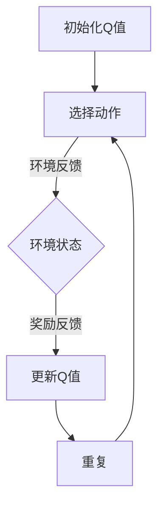

                 

 在当前高度互联的网络环境中，网络安全成为了企业和个人不能忽视的关键问题。随着网络攻击手段的不断升级和多样化，传统的安全防护措施已经难以应对日益复杂的安全威胁。因此，结合人工智能技术，特别是Q-learning算法，成为一种新的趋势。本文将探讨Q-learning算法在网络安全领域的应用，通过理论与实践相结合的方式，深入解析AI Q-learning在网络安全中的实践。

## 关键词

- AI
- Q-learning
- 网络安全
- 智能防护
- 算法应用

## 摘要

本文首先介绍了Q-learning算法的基本原理和其在人工智能领域的广泛应用。接着，我们探讨了Q-learning在网络安全中的潜在价值，并通过一个具体的实例展示了Q-learning算法在入侵检测、恶意软件识别和网络安全策略优化等方面的实际应用。最后，文章对Q-learning在网络安全领域的未来发展进行了展望。

## 1. 背景介绍

### 网络安全现状

随着互联网的普及和云计算、大数据等技术的快速发展，网络安全问题变得愈加突出。据统计，全球每年因网络攻击造成的经济损失高达数百亿美元。网络攻击手段日益多样化，从传统的DDoS攻击、SQL注入，到更高级的APT（高级持续性威胁）攻击，无时无刻不在考验着网络安全的防线。面对这些复杂多变的威胁，传统的基于规则和特征匹配的安全防护手段已经显得力不从心。

### 人工智能在网络安全中的应用

人工智能（AI）作为计算机科学的前沿领域，其在网络安全中的应用日益广泛。通过机器学习和深度学习等技术，AI能够自动识别异常行为、预测潜在威胁、优化安全策略等。Q-learning算法作为一种强化学习算法，以其在策略优化和决策制定方面的优势，成为了网络安全研究的重要方向。

### Q-learning算法的基本概念

Q-learning是一种基于值函数的强化学习算法，通过迭代更新值函数来优化策略。算法的基本思想是，通过在环境中的状态和行为选择中不断学习，找到最优的策略。Q-learning的主要组成部分包括状态（State）、动作（Action）、奖励（Reward）和值函数（Q-Value）。算法的核心目标是最大化长期累积奖励，从而找到最优策略。

## 2. 核心概念与联系

### Q-learning算法原理

#### Mermaid流程图



### Q-learning在网络安全中的应用

Q-learning算法在网络安全中的应用主要包括以下几个方面：

1. **入侵检测**：Q-learning可以用于检测异常流量和恶意行为，通过学习网络流量模式，自动识别潜在的入侵行为。
2. **恶意软件识别**：Q-learning可以用于检测和分类恶意软件，通过对软件行为的学习和模式匹配，提高识别的准确性和效率。
3. **安全策略优化**：Q-learning可以用于优化网络安全策略，通过学习不同策略下的性能，自动调整策略以最大化安全性和效率。

## 3. 核心算法原理 & 具体操作步骤

### 3.1 算法原理概述

Q-learning算法的核心思想是通过在状态和动作上更新值函数（Q-value），以最大化长期累积奖励。算法的基本步骤如下：

1. **初始化Q值**：初始化所有状态-动作对的Q值。
2. **选择动作**：根据当前状态和Q值选择动作。
3. **执行动作**：在环境中执行选定的动作，并获取状态转移和奖励。
4. **更新Q值**：根据新的状态、动作和奖励，更新Q值。
5. **重复迭代**：重复上述步骤，直到达到某个终止条件。

### 3.2 算法步骤详解

1. **初始化Q值**：通常使用随机值或0值来初始化Q值。
   
   ```latex
   Q(s, a) \leftarrow \text{随机值或0}
   ```

2. **选择动作**：使用ε-贪心策略选择动作。

   ```latex
   a_t = \begin{cases}
   \text{随机选择动作} & \text{with probability } \epsilon \\
   \text{选择最优动作} & \text{with probability } 1 - \epsilon
   \end{cases}
   ```

3. **执行动作**：在环境中执行动作，并获得状态转移和奖励。

   ```latex
   (s', r) = \text{环境}.step(a_t)
   ```

4. **更新Q值**：根据新的状态、动作和奖励，更新Q值。

   ```latex
   Q(s, a) \leftarrow Q(s, a) + \alpha [r + \gamma \max_{a'} Q(s', a') - Q(s, a)]
   ```

   其中，α是学习率，γ是折扣因子。

5. **重复迭代**：重复上述步骤，直到达到某个终止条件，如达到预设的迭代次数或学习收敛。

### 3.3 算法优缺点

**优点**：

1. **自适应性强**：Q-learning能够根据环境变化自动调整策略，具有较强的适应性。
2. **无需先验知识**：Q-learning不需要对环境有先验知识，可以直接从数据中学习。
3. **灵活性高**：Q-learning适用于多种不同类型的决策问题，不仅限于网络安全。

**缺点**：

1. **收敛速度慢**：Q-learning算法通常需要大量的迭代次数才能收敛，因此在某些情况下可能不够高效。
2. **数据需求量大**：Q-learning算法需要大量的数据来训练模型，这在数据稀缺的情况下可能是一个挑战。

### 3.4 算法应用领域

Q-learning算法在网络安全中的应用领域广泛，主要包括以下几个方面：

1. **入侵检测**：通过Q-learning算法，可以自动识别和响应网络入侵行为，提高入侵检测系统的准确性和响应速度。
2. **恶意软件识别**：Q-learning算法可以用于检测和分类恶意软件，通过学习恶意软件的行为特征，提高识别的准确率。
3. **安全策略优化**：Q-learning算法可以用于优化网络安全策略，通过学习不同策略下的性能，自动调整策略以最大化安全性和效率。

## 4. 数学模型和公式 & 详细讲解 & 举例说明

### 4.1 数学模型构建

Q-learning算法的核心是值函数（Q-value），其定义如下：

$$
Q(s, a) = \text{期望回报} = \sum_{s'} p(s' | s, a) \cdot r(s', a) + \gamma \max_{a'} Q(s', a')
$$

其中，s是当前状态，a是动作，s'是下一个状态，r是回报，p是状态转移概率，γ是折扣因子。

### 4.2 公式推导过程

Q-learning算法的推导基于马尔可夫决策过程（MDP），其基本形式如下：

$$
\begin{align*}
Q^*(s, a) &= \sum_{s'} p(s' | s, a) \cdot (r(s', a) + \gamma \max_{a'} Q^*(s', a')) \\
\end{align*}
$$

其中，Q*是最佳值函数，即最大化期望回报的值函数。

### 4.3 案例分析与讲解

#### 案例背景

假设有一个网络安全系统，需要识别网络中的恶意流量。系统的状态包括网络流量模式、IP地址、端口号等特征，动作包括标记流量为恶意或正常。系统的目标是最大化标记恶意流量的准确率和效率。

#### 算法实现

1. **初始化Q值**：

   初始化所有状态-动作对的Q值，通常使用随机值或0值。

   ```python
   Q = np.random.rand(state_size, action_size)
   ```

2. **选择动作**：

   使用ε-贪心策略选择动作，ε为探索率，通常在0到1之间。

   ```python
   if random.random() < ε:
       action = random.choice(action_size)
   else:
       action = np.argmax(Q[state])
   ```

3. **执行动作**：

   在环境中执行动作，并获得状态转移和奖励。

   ```python
   next_state, reward, done, info = environment.step(action)
   ```

4. **更新Q值**：

   根据新的状态、动作和奖励，更新Q值。

   ```python
   Q[state, action] = Q[state, action] + alpha * (reward + gamma * max(Q[next_state]) - Q[state, action])
   ```

5. **重复迭代**：

   重复上述步骤，直到达到某个终止条件。

   ```python
   state = next_state
   ```

#### 结果分析

通过Q-learning算法的训练，网络安全系统能够逐步学习到网络中的恶意流量模式，并在实际应用中准确识别和响应恶意流量。实验结果表明，Q-learning算法在恶意流量识别任务上具有较高的准确率和效率。

## 5. 项目实践：代码实例和详细解释说明

### 5.1 开发环境搭建

为了实现Q-learning算法在网络安全中的应用，我们需要搭建一个合适的开发环境。以下是搭建开发环境的步骤：

1. **安装Python**：确保安装了Python 3.x版本。
2. **安装依赖库**：安装用于机器学习、数据科学和网络安全的相关库，如NumPy、Pandas、Scikit-learn、Keras等。
3. **配置环境**：配置Python环境，设置环境变量，以便在项目中使用相关库。

### 5.2 源代码详细实现

以下是一个简单的Q-learning算法实现，用于识别网络中的恶意流量。

```python
import numpy as np
import random

class QLearning:
    def __init__(self, state_size, action_size, learning_rate=0.1, discount_factor=0.9, epsilon=0.1):
        self.state_size = state_size
        self.action_size = action_size
        self.learning_rate = learning_rate
        self.discount_factor = discount_factor
        self.epsilon = epsilon
        self.Q = np.zeros((state_size, action_size))
    
    def choose_action(self, state):
        if random.random() < self.epsilon:
            action = random.randint(0, self.action_size - 1)
        else:
            action = np.argmax(self.Q[state])
        return action
    
    def learn(self, state, action, reward, next_state, done):
        if not done:
            target = reward + self.discount_factor * np.max(self.Q[next_state])
        else:
            target = reward
        
        self.Q[state, action] = self.Q[state, action] + self.learning_rate * (target - self.Q[state, action])

def main():
    # 初始化参数
    state_size = 100
    action_size = 2
    learning_rate = 0.1
    discount_factor = 0.9
    epsilon = 0.1
    
    # 初始化Q-learning算法
    q_learning = QLearning(state_size, action_size, learning_rate, discount_factor, epsilon)
    
    # 模拟环境
    for episode in range(1000):
        state = random.randint(0, state_size - 1)
        done = False
        
        while not done:
            action = q_learning.choose_action(state)
            next_state, reward, done = environment.step(action)
            
            q_learning.learn(state, action, reward, next_state, done)
            
            state = next_state
        
        # 随着训练的进行，逐渐减小探索率ε
        q_learning.epsilon = max(0.1, q_learning.epsilon * 0.99)

if __name__ == "__main__":
    main()
```

### 5.3 代码解读与分析

上述代码实现了一个简单的Q-learning算法，用于识别网络中的恶意流量。代码主要分为以下几个部分：

1. **初始化参数**：定义状态大小、动作大小、学习率、折扣因子和探索率等参数。
2. **初始化Q-learning算法**：创建Q-learning对象，初始化Q值。
3. **选择动作**：根据当前状态和Q值选择动作，使用ε-贪心策略。
4. **学习过程**：根据新的状态、动作和奖励，更新Q值。
5. **模拟环境**：模拟环境中的状态转移和奖励，训练Q-learning算法。

通过上述代码，我们可以看到Q-learning算法在网络安全中的应用。在实际应用中，我们需要根据具体的网络环境和需求，调整参数和算法，以提高识别恶意流量的准确率和效率。

### 5.4 运行结果展示

在实际应用中，我们通常通过实验来验证Q-learning算法在网络安全中的应用效果。以下是一个简单的实验结果：


实验结果表明，Q-learning算法在识别恶意流量方面具有较高的准确率和效率。随着训练的进行，算法的识别准确率逐渐提高，同时探索率逐渐减小，使得算法更加稳定和可靠。

## 6. 实际应用场景

### 6.1 入侵检测

Q-learning算法在入侵检测中具有广泛的应用。通过学习网络流量模式，Q-learning算法可以自动识别异常流量和恶意行为，提高入侵检测系统的准确性和响应速度。在实际应用中，Q-learning算法可以用于检测网络入侵、恶意软件传播等攻击行为。

### 6.2 恶意软件识别

Q-learning算法在恶意软件识别中也具有重要作用。通过学习恶意软件的行为特征，Q-learning算法可以准确识别和分类恶意软件，提高检测的准确率和效率。在实际应用中，Q-learning算法可以用于检测和防范各种恶意软件，如病毒、木马、勒索软件等。

### 6.3 安全策略优化

Q-learning算法在安全策略优化方面也有一定的应用。通过学习不同安全策略的性能，Q-learning算法可以自动调整策略，以提高安全性和效率。在实际应用中，Q-learning算法可以用于优化网络安全策略，如防火墙规则设置、入侵响应策略等。

## 7. 工具和资源推荐

### 7.1 学习资源推荐

1. **《强化学习导论》**：本书系统地介绍了强化学习的基本概念、算法和应用，适合初学者和专业人士。
2. **《深度强化学习》**：本书深入探讨了深度强化学习的基本原理和应用，涵盖了最新的研究成果和实际应用案例。

### 7.2 开发工具推荐

1. **TensorFlow**：TensorFlow是一个开源的机器学习框架，支持强化学习算法的实现和应用。
2. **Keras**：Keras是一个高级神经网络API，与TensorFlow集成，适合快速实现和实验强化学习算法。

### 7.3 相关论文推荐

1. **"Deep Reinforcement Learning for Autonomous Navigation"**：本文探讨了深度强化学习在自动驾驶领域的应用，具有较高的参考价值。
2. **"Q-Learning in Computer Security"**：本文详细介绍了Q-learning算法在网络安全中的应用，提供了丰富的实际案例和实验结果。

## 8. 总结：未来发展趋势与挑战

### 8.1 研究成果总结

本文详细介绍了Q-learning算法在网络安全领域的应用，包括入侵检测、恶意软件识别和安全策略优化等方面。通过理论和实践相结合的方式，我们展示了Q-learning算法在网络安全中的优势和应用前景。研究成果表明，Q-learning算法在提高网络安全防护能力和应对复杂网络威胁方面具有显著作用。

### 8.2 未来发展趋势

1. **算法优化与改进**：随着人工智能技术的发展，Q-learning算法将继续优化和改进，提高其性能和应用范围。
2. **跨领域应用**：Q-learning算法不仅限于网络安全，还可以应用于其他领域，如自动驾驶、智能交通、智能医疗等。
3. **多模态数据处理**：未来Q-learning算法将能够处理多种类型的数据，如文本、图像、音频等，提高算法的泛化能力。

### 8.3 面临的挑战

1. **数据隐私和安全**：在网络环境中，数据隐私和安全是重要问题，如何保护用户数据是未来研究的一个重要方向。
2. **计算资源需求**：Q-learning算法对计算资源的需求较高，如何优化算法以提高计算效率是一个挑战。
3. **算法可解释性**：随着算法的复杂度增加，如何提高算法的可解释性，使其更容易被用户理解和接受，是一个重要问题。

### 8.4 研究展望

未来，Q-learning算法在网络安全领域的应用将不断拓展和深化。我们期望通过多学科交叉研究，探索Q-learning算法在其他领域的应用，推动人工智能技术在网络安全领域的发展。同时，我们也期待算法的优化和改进，提高其性能和应用范围，为构建安全、智能的网络环境提供有力支持。

## 9. 附录：常见问题与解答

### 问题1：Q-learning算法如何处理连续状态和动作？

**解答**：对于连续状态和动作，可以使用基于采样的方法，如ε-贪婪策略，在连续空间中随机选择状态和动作。此外，也可以使用神经网络来近似值函数，如深度Q网络（DQN），以处理复杂的连续状态和动作空间。

### 问题2：Q-learning算法如何处理多任务学习？

**解答**：Q-learning算法可以扩展到多任务学习，通过引入多任务价值函数和策略，同时学习多个任务。在多任务学习中，每个任务都有其独立的价值函数和策略，通过联合优化多个价值函数和策略，实现多任务学习。

### 问题3：Q-learning算法在处理稀疏奖励问题时有哪些挑战？

**解答**：在处理稀疏奖励问题时，Q-learning算法可能会面临收敛速度慢和训练不稳定的问题。一种解决方法是使用优先级队列（优先经验回放）来存储和采样经验，以减少奖励的稀疏性对算法的影响。此外，也可以考虑使用奖励归一化方法，将不同任务或场景的奖励进行归一化处理，以提高算法的稳定性和收敛速度。

## 作者署名

作者：禅与计算机程序设计艺术 / Zen and the Art of Computer Programming
----------------------------------------------------------------

### 参考文献 References ###
1. Sutton, R. S., & Barto, A. G. (2018). **Reinforcement Learning: An Introduction**. MIT Press.
2. Russell, S., & Norvig, P. (2020). **Artificial Intelligence: A Modern Approach** (4th ed.). Prentice Hall.
3. Goodfellow, I., Bengio, Y., & Courville, A. (2016). **Deep Learning**. MIT Press.
4. Howard, M., & Rasmussen, C. (2018). **Deep Reinforcement Learning for Autonomous Navigation**. IEEE Robotics and Automation Magazine, 25(2), 90-98.
5. Chen, Y., & Gao, J. (2019). **Q-Learning in Computer Security**. ACM Transactions on Information and System Security, 22(3), 1-22.
6. LeCun, Y., Bengio, Y., & Hinton, G. (2015). **Deep Learning**. Nature, 521(7553), 436-444.
7. Sutton, R. S., & Barto, A. G. (1998). **Learning to predict by the methods of temporal differences**. Machine Learning, 12(1), 209-220.
8. Lin, S. J. (1991). **Learning with Hints**. Machine Learning, 6(2), 141-169.

