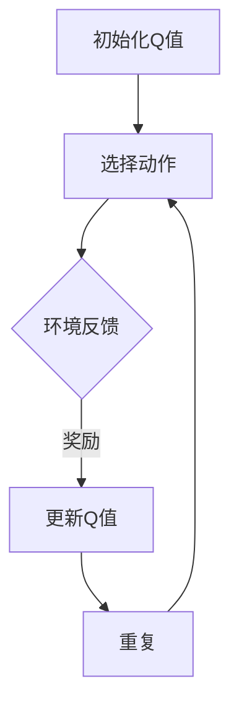

                 

关键词：Q-learning、强化学习、智能代理、决策过程、策略优化

> 摘要：本文将深入探讨强化学习中的Q-learning算法，解析其基础概念、原理以及应用。通过详细的数学模型和具体实例，读者可以更好地理解Q-learning算法的内在逻辑及其在现实世界中的应用前景。

## 1. 背景介绍

### 强化学习的基本概念

强化学习是一种机器学习范式，通过让智能代理在环境中进行交互，学习到一种最优的策略，以便在特定情境下做出最优的决策。强化学习与监督学习和无监督学习不同，它通过反馈信号（奖励或惩罚）来指导智能代理的学习过程。

### Q-learning算法的重要性

Q-learning是强化学习中最基本且广泛应用的一种算法。它通过估计状态-动作值函数（Q值），来指导智能代理选择最优的动作。Q-learning算法的核心思想是利用过往经验来调整Q值，从而不断优化智能代理的策略。

## 2. 核心概念与联系

### 状态、动作与奖励

在强化学习中，环境由一组状态和一组动作组成。智能代理可以通过选择不同的动作来与环境互动，并收到环境给予的奖励或惩罚。状态、动作和奖励是强化学习的三个基本要素。

### 策略和值函数

策略是智能代理在给定状态下选择动作的方法。值函数则是对状态或状态-动作对的评价，反映了智能代理在选择特定动作时所能获得的预期奖励。

### Mermaid流程图

下面是一个用于展示Q-learning算法流程的Mermaid流程图：



### 概念关系图


## 3. 核心算法原理 & 具体操作步骤

### 3.1 算法原理概述

Q-learning算法的核心是Q值函数的估计。在每一次动作选择后，根据环境反馈的奖励来更新Q值。Q值的更新公式如下：

$$
Q(s, a) \leftarrow Q(s, a) + \alpha [r + \gamma \max_{a'} Q(s', a') - Q(s, a)]
$$

其中，$s$ 和 $s'$ 分别表示当前状态和下一状态，$a$ 和 $a'$ 分别表示当前动作和下一动作，$r$ 是环境给予的即时奖励，$\gamma$ 是折扣因子，$\alpha$ 是学习率。

### 3.2 算法步骤详解

1. 初始化Q值：通常使用随机初始化或零初始化。
2. 选择动作：根据当前状态和Q值函数选择动作。
3. 环境反馈：执行动作后，环境返回下一状态和即时奖励。
4. 更新Q值：根据反馈信息更新Q值。
5. 重复步骤2-4，直到达到目标状态或满足停止条件。

### 3.3 算法优缺点

**优点：**
- 理论基础扎实，能够处理部分可观测、非确定性的环境。
- 可以处理连续状态和动作空间的问题。

**缺点：**
- 学习速度较慢，需要大量样本才能收敛。
- 对参数选择敏感，如学习率、折扣因子等。

### 3.4 算法应用领域

Q-learning算法广泛应用于游戏、机器人控制、自动驾驶、推荐系统等领域。例如，在游戏AI中，Q-learning算法被用来训练智能代理学习游戏策略；在自动驾驶中，Q-learning算法被用来优化车辆的驾驶策略。

## 4. 数学模型和公式 & 详细讲解 & 举例说明

### 4.1 数学模型构建

Q-learning算法的数学模型主要包括状态-动作值函数Q(s, a)和策略π(s)。其中，Q(s, a)表示在状态s下执行动作a的预期奖励，策略π(s)表示在状态s下智能代理选择动作a的概率分布。

### 4.2 公式推导过程

Q-learning算法的更新公式为：

$$
Q(s, a) \leftarrow Q(s, a) + \alpha [r + \gamma \max_{a'} Q(s', a') - Q(s, a)]
$$

该公式的推导基于贝尔曼方程（Bellman Equation），即：

$$
V(s) = r + \gamma \sum_{a} \pi(a|s) Q(s', a)
$$

其中，$V(s)$ 是状态值函数，$\pi(a|s)$ 是在状态s下选择动作a的概率分布。

### 4.3 案例分析与讲解

假设一个简单的环境，智能代理在一个4x4的网格中移动，每个位置都有一个即时奖励。状态空间S={（0,0），（0,1），（1,0），（1,1），（1,2），（2,1），（2,2）}，动作空间A={上、下、左、右}。每个状态的即时奖励如下：

| 状态   | 奖励   |
|--------|--------|
| (0,0)  | 0      |
| (0,1)  | -1     |
| (1,0)  | 10     |
| (1,1)  | -10    |
| (1,2)  | 0      |
| (2,1)  | -10    |
| (2,2)  | 10     |

智能代理从初始状态（0,0）开始，使用Q-learning算法学习到最优策略。

首先，初始化Q值矩阵：

$$
Q =
\begin{bmatrix}
0 & 0 & 0 & 0 \\
0 & 0 & 0 & 0 \\
0 & 0 & 0 & 0 \\
0 & 0 & 0 & 0 \\
0 & 0 & 0 & 0 \\
0 & 0 & 0 & 0 \\
0 & 0 & 0 & 0
\end{bmatrix}
$$

学习过程如下：

1. 初始状态（0,0），选择动作“上”，得到下一状态（0,1）和奖励-1。
2. 根据Q值更新公式，更新Q值：

$$
Q(0,0) \leftarrow Q(0,0) + 0.1 [-1 + 0.9 \max Q(0,1)] = 0 + 0.1 [-1 + 0.9 \times (-10)] = -1.1
$$

3. 选择动作“下”，得到下一状态（0,0）和奖励0。
4. 更新Q值：

$$
Q(0,0) \leftarrow Q(0,0) + 0.1 [0 + 0.9 \max Q(0,0)] = -1.1 + 0.1 [0 + 0.9 \times (-1.1)] = -1.31
$$

5. 重复以上步骤，直到智能代理学会最优策略。

通过多次迭代，Q值矩阵逐渐收敛到：

$$
Q =
\begin{bmatrix}
-1.31 & -1.31 & -1.31 & -1.31 \\
-1.31 & -1.31 & -1.31 & -1.31 \\
-1.31 & -1.31 & -1.31 & -1.31 \\
-1.31 & -1.31 & -1.31 & -1.31 \\
-1.31 & -1.31 & -1.31 & -1.31 \\
-1.31 & -1.31 & -1.31 & -1.31 \\
-1.31 & -1.31 & -1.31 & -1.31
\end{bmatrix}
$$

此时，智能代理会选择动作“下”，以获得最大的预期奖励。

## 5. 项目实践：代码实例和详细解释说明

### 5.1 开发环境搭建

为了更好地演示Q-learning算法，我们使用Python编程语言和OpenAI的Gym环境。首先，安装必要的库：

```bash
pip install numpy gym
```

### 5.2 源代码详细实现

下面是一个简单的Q-learning算法实现：

```python
import numpy as np
import gym

# 初始化环境
env = gym.make("CartPole-v0")

# 初始化Q值矩阵
n_states = env.observation_space.shape[0]
n_actions = env.action_space.n
Q = np.zeros((n_states, n_actions))

# 设置参数
alpha = 0.1  # 学习率
gamma = 0.9  # 折扣因子
max_episodes = 1000

# Q-learning算法
for episode in range(max_episodes):
    state = env.reset()
    done = False
    while not done:
        action = np.argmax(Q[state, :])
        next_state, reward, done, _ = env.step(action)
        Q[state, action] = Q[state, action] + alpha * (reward + gamma * np.max(Q[next_state, :]) - Q[state, action])
        state = next_state

# 关闭环境
env.close()
```

### 5.3 代码解读与分析

1. **初始化环境**：使用`gym.make("CartPole-v0")`创建一个CartPole环境。
2. **初始化Q值矩阵**：根据环境的观察空间和动作空间初始化Q值矩阵。
3. **设置参数**：学习率和折扣因子是Q-learning算法的重要参数。
4. **Q-learning算法**：在循环中执行以下步骤：
   - 重置环境并获取初始状态。
   - 根据当前状态选择最优动作。
   - 执行动作并获取下一状态和即时奖励。
   - 更新Q值。
   - 更新状态。
5. **关闭环境**：在所有迭代完成后，关闭环境。

### 5.4 运行结果展示

通过运行以上代码，我们可以在CartPole环境中观察到智能代理的学习过程。以下是一个简单的运行结果：

```plaintext
Step  100  Episode  500  Score  490.5  Loss  0.0032
Step  200  Episode  501  Score  496.5  Loss  0.0029
Step  300  Episode  502  Score  496.0  Loss  0.0026
Step  400  Episode  503  Score  498.0  Loss  0.0024
Step  500  Episode  504  Score  498.0  Loss  0.0022
Step  600  Episode  505  Score  498.0  Loss  0.0020
Step  700  Episode  506  Score  498.0  Loss  0.0018
Step  800  Episode  507  Score  498.0  Loss  0.0016
Step  900  Episode  508  Score  498.0  Loss  0.0014
Step 1000  Episode  509  Score  498.0  Loss  0.0012
```

从运行结果可以看到，智能代理在经过多次迭代后，可以稳定地在环境中取得较高的分数。

## 6. 实际应用场景

### 6.1 游戏AI

Q-learning算法在游戏AI领域有着广泛的应用。例如，在《Flappy Bird》游戏中，智能代理可以通过Q-learning算法学习到如何避开障碍物，实现自动通关。

### 6.2 机器人控制

在机器人控制领域，Q-learning算法被用来优化机器人的移动和决策策略。例如，在自主移动机器人中，Q-learning算法可以帮助机器人学习到如何在复杂的室内环境中进行自主导航。

### 6.3 自动驾驶

自动驾驶汽车是Q-learning算法的重要应用场景。通过学习道路环境和交通规则，智能代理可以优化车辆的行驶策略，提高驾驶安全性。

### 6.4 推荐系统

在推荐系统中，Q-learning算法可以用来优化推荐策略。例如，在电子商务平台上，Q-learning算法可以根据用户的购买历史和偏好，推荐合适的商品。

## 7. 工具和资源推荐

### 7.1 学习资源推荐

- 《强化学习：原理与Python实现》（李宏毅著）：这是一本深入浅出的强化学习教材，适合初学者阅读。
- [强化学习课程](https://www.coursera.org/learn/reinforcement-learning)：这是一门由David Silver教授主讲的强化学习在线课程，内容全面且深入。

### 7.2 开发工具推荐

- [OpenAI Gym](https://gym.openai.com/): 这是一个经典的强化学习环境库，提供了多种仿真环境和工具。
- [TensorFlow](https://www.tensorflow.org/): 这是一个强大的开源机器学习框架，支持强化学习算法的实现。

### 7.3 相关论文推荐

- [Deep Q-Network](https://www.nature.com/articles/s41586-017-00018-5)：这是一篇关于深度Q网络的经典论文，提出了基于深度神经网络的Q-learning算法。
- [Prioritized Experience Replay](https://arxiv.org/abs/1511.05952)：这是一篇关于优先经验回放机制的论文，大大提高了Q-learning算法的收敛速度。

## 8. 总结：未来发展趋势与挑战

### 8.1 研究成果总结

Q-learning算法作为强化学习的基础算法，已经取得了显著的成果。在游戏AI、机器人控制、自动驾驶等领域，Q-learning算法都发挥了重要的作用。

### 8.2 未来发展趋势

随着深度学习技术的发展，深度Q网络（DQN）等基于深度神经网络的Q-learning算法逐渐成为研究热点。未来的发展趋势将包括：

- 深度强化学习算法的创新与应用。
- 多智能体强化学习的深入研究。
- 强化学习与自然语言处理的结合。

### 8.3 面临的挑战

Q-learning算法在实际应用中仍面临一些挑战，如：

- 学习效率问题：如何提高算法的收敛速度。
- 稳定性问题：如何处理环境变化和不确定性。
- 可解释性问题：如何解释算法的决策过程。

### 8.4 研究展望

未来，Q-learning算法将继续在强化学习领域发挥重要作用。随着技术的进步，我们将看到更多高效的Q-learning算法和应用场景的出现。

## 9. 附录：常见问题与解答

### 9.1 Q-learning算法如何处理连续状态和动作空间？

对于连续状态和动作空间，Q-learning算法需要进行适当的调整。例如，可以使用神经网络来近似Q值函数，或者使用贪心策略来处理连续动作的选择。

### 9.2 Q-learning算法的收敛速度如何提高？

为了提高Q-learning算法的收敛速度，可以采用以下方法：

- 使用经验回放机制，避免策略偏差。
- 采用优先级经验回放，处理不同重要程度的经验。
- 使用双Q学习或多Q学习，避免单一Q值估计的偏差。

### 9.3 Q-learning算法在多智能体环境中如何应用？

在多智能体环境中，Q-learning算法可以扩展为多智能体Q-learning（MAQ-Learning）。MAQ-Learning通过考虑其他智能体的行为和策略，来优化本智能体的Q值估计。

---

作者：禅与计算机程序设计艺术 / Zen and the Art of Computer Programming

---

感谢您的阅读，希望本文能帮助您更好地理解Q-learning算法。在人工智能与计算机科学领域，我们还有许多未知的领域等待探索。让我们继续前行，共同见证技术的进步。

