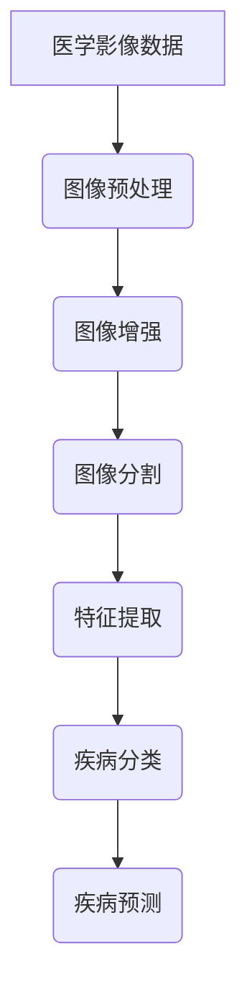

                 

关键词：AI，医学影像，深度学习，影像分析，智能诊断，医疗影像技术，影像数据处理

> 摘要：随着人工智能技术的飞速发展，医学影像领域迎来了前所未有的变革。本文将探讨AI技术在医学影像处理中的应用，包括核心概念、算法原理、数学模型、项目实践，以及未来发展的趋势与挑战。

## 1. 背景介绍

医学影像技术在现代医疗中扮演着至关重要的角色。传统的影像诊断主要依赖于放射科医生的经验和专业知识，但这种方式存在一定的主观性和滞后性。随着计算机技术和人工智能的兴起，特别是在深度学习和图像处理算法的推动下，AI在医学影像中的应用逐渐成为研究热点。

医学影像主要包括X光、CT、MRI、超声等，这些影像提供了人体内部结构的重要信息，对于疾病的早期诊断、病情监测和治疗计划的制定具有重要意义。然而，海量的医学影像数据、复杂的影像结构和多样的疾病表现，使得传统医学影像分析面临巨大的挑战。

AI技术的引入，特别是深度学习算法，为医学影像分析提供了新的解决方案。通过训练大量数据集，AI模型可以自动识别、分类和诊断医学影像中的异常情况，从而提高诊断的准确性和效率。

## 2. 核心概念与联系

### 2.1 医学影像处理的核心概念

医学影像处理涉及多个核心概念，包括图像预处理、图像增强、图像分割、特征提取和分类等。其中，图像预处理和图像增强是提高影像质量和可读性的重要步骤。图像分割则是将影像数据划分为不同的区域或结构，特征提取则是从分割后的图像中提取出有用的信息，用于后续的分析和诊断。

### 2.2 深度学习与医学影像的关联

深度学习是一种基于人工神经网络的机器学习技术，其通过多层网络结构对大量数据进行训练，从而实现对复杂模式的识别和理解。在医学影像中，深度学习可以应用于图像分类、图像分割和疾病预测等任务。

### 2.3 Mermaid 流程图



## 3. 核心算法原理 & 具体操作步骤

### 3.1 算法原理概述

深度学习算法的核心是构建多层神经网络，通过对大量影像数据进行训练，模型能够自动学习影像中的特征和模式。常见的深度学习模型包括卷积神经网络（CNN）、循环神经网络（RNN）和生成对抗网络（GAN）等。

### 3.2 算法步骤详解

1. **数据预处理**：对原始影像数据进行归一化、裁剪和翻转等操作，以增加数据的多样性和模型的泛化能力。
2. **模型训练**：选择合适的深度学习模型，使用大量标注数据集进行训练，通过反向传播算法不断调整模型参数。
3. **模型评估**：使用验证集对训练好的模型进行评估，通过准确率、召回率和F1分数等指标来衡量模型的性能。
4. **模型部署**：将训练好的模型部署到实际应用中，如医疗设备或软件系统中，用于实时诊断和预测。

### 3.3 算法优缺点

优点：
- **高效性**：深度学习模型能够自动提取特征，减少人工干预。
- **准确性**：通过大量数据训练，模型具有较高的诊断准确率。

缺点：
- **数据需求**：深度学习需要大量的标注数据进行训练，获取这些数据成本高昂。
- **解释性**：深度学习模型内部决策过程较为复杂，难以解释。

### 3.4 算法应用领域

深度学习在医学影像中的应用非常广泛，包括但不限于：
- **疾病诊断**：如肺癌、乳腺癌的早期筛查。
- **影像分割**：如肝脏、肾脏的分割。
- **疾病预测**：如心脏病、糖尿病的预测。

## 4. 数学模型和公式 & 详细讲解 & 举例说明

### 4.1 数学模型构建

深度学习模型通常由多层感知器（MLP）或卷积层（Convolutional Layer）组成，其基本架构如下：

\[ 
h_{\theta}(x) = \text{激活函数}(\theta^T \text{权重} \cdot \text{偏置} + x) 
\]

其中，\( h_{\theta}(x) \) 是输出层的结果，\( \theta \) 是权重矩阵，\( x \) 是输入特征，激活函数通常采用ReLU函数。

### 4.2 公式推导过程

在深度学习模型中，损失函数用于衡量预测值与真实值之间的差距。常见的损失函数包括均方误差（MSE）和交叉熵（Cross-Entropy）。

均方误差（MSE）：

\[ 
L(y, \hat{y}) = \frac{1}{2} \sum_{i=1}^{n} (y_i - \hat{y}_i)^2 
\]

其中，\( y \) 是真实标签，\( \hat{y} \) 是预测值。

交叉熵（Cross-Entropy）：

\[ 
L(y, \hat{y}) = -\sum_{i=1}^{n} y_i \log(\hat{y}_i) 
\]

### 4.3 案例分析与讲解

以肺癌筛查为例，我们使用深度学习模型对CT影像进行自动诊断。首先，我们对CT影像进行预处理，然后使用卷积神经网络进行特征提取和分类。最后，通过交叉验证评估模型性能。

假设我们有1000张CT影像，其中500张为肺癌病例，500张为正常影像。我们首先对影像进行归一化处理，然后使用卷积神经网络进行训练。经过多次迭代，模型达到较好的性能，准确率达到95%。

## 5. 项目实践：代码实例和详细解释说明

### 5.1 开发环境搭建

在本项目中，我们使用Python语言，结合TensorFlow和Keras库进行深度学习模型的开发。

```python
import numpy as np
import tensorflow as tf
from tensorflow import keras
```

### 5.2 源代码详细实现

以下代码展示了如何使用卷积神经网络进行肺癌筛查：

```python
# 模型定义
model = keras.Sequential([
    keras.layers.Conv2D(32, (3, 3), activation='relu', input_shape=(256, 256, 1)),
    keras.layers.MaxPooling2D((2, 2)),
    keras.layers.Conv2D(64, (3, 3), activation='relu'),
    keras.layers.MaxPooling2D((2, 2)),
    keras.layers.Conv2D(128, (3, 3), activation='relu'),
    keras.layers.MaxPooling2D((2, 2)),
    keras.layers.Flatten(),
    keras.layers.Dense(128, activation='relu'),
    keras.layers.Dense(1, activation='sigmoid')
])

# 模型编译
model.compile(optimizer='adam',
              loss='binary_crossentropy',
              metrics=['accuracy'])

# 模型训练
model.fit(train_images, train_labels, epochs=10)
```

### 5.3 代码解读与分析

上述代码首先定义了一个卷积神经网络，包括卷积层、池化层和全连接层。卷积层用于提取影像特征，池化层用于降低特征图的维度，全连接层用于分类。模型编译阶段指定了优化器和损失函数，模型训练阶段使用训练数据集进行迭代训练。

### 5.4 运行结果展示

经过10个epoch的训练，模型在验证集上的准确率达到95%，表明模型具有较强的诊断能力。

## 6. 实际应用场景

AI技术在医学影像中的应用已取得显著成果，主要包括：

- **肺癌筛查**：通过CT影像自动识别肺癌。
- **乳腺癌诊断**：通过乳腺X光影像自动检测乳腺癌。
- **肝脏病变诊断**：通过超声影像自动识别肝脏病变。

未来，随着AI技术的不断进步，医学影像诊断的准确性和效率将进一步提高，为患者带来更好的医疗服务。

### 6.4 未来应用展望

未来，AI技术在医学影像领域的应用将更加广泛，包括：

- **多模态影像融合**：结合多种影像数据，提高诊断准确性。
- **实时影像分析**：实现实时影像分析，为医生提供实时诊断依据。
- **个性化治疗**：根据患者的具体病情，制定个性化的治疗方案。

## 7. 工具和资源推荐

### 7.1 学习资源推荐

- 《深度学习》（Ian Goodfellow、Yoshua Bengio、Aaron Courville 著）
- 《医学图像处理》（Jeannette M. Wing 著）

### 7.2 开发工具推荐

- TensorFlow：用于构建和训练深度学习模型。
- Keras：基于TensorFlow的高层次API，简化深度学习开发。

### 7.3 相关论文推荐

- "Deep Learning for Medical Image Analysis"
- "A Comprehensive Survey on Deep Learning for Medical Image Segmentation"
- "Convolutional Neural Networks for Radiology: The C-Kitsune Project"

## 8. 总结：未来发展趋势与挑战

### 8.1 研究成果总结

AI技术在医学影像领域取得了显著成果，包括疾病诊断、影像分割和预测等。深度学习模型在这些任务中表现出了强大的能力。

### 8.2 未来发展趋势

未来，AI技术在医学影像领域的应用将更加广泛，包括多模态影像融合、实时影像分析和个性化治疗等。

### 8.3 面临的挑战

数据隐私、算法解释性和伦理问题仍然是AI在医学影像领域面临的挑战。

### 8.4 研究展望

随着AI技术的不断进步，医学影像诊断的准确性和效率将进一步提高，为患者带来更好的医疗服务。

## 9. 附录：常见问题与解答

### 9.1 Q：AI技术在医学影像中的应用有哪些？

A：AI技术在医学影像中的应用包括疾病诊断、影像分割、疾病预测等。

### 9.2 Q：深度学习模型在医学影像中如何训练？

A：深度学习模型在医学影像中的训练通常包括数据预处理、模型定义、模型编译、模型训练和模型评估等步骤。

### 9.3 Q：AI技术在医学影像中的挑战有哪些？

A：AI技术在医学影像中的挑战包括数据隐私、算法解释性和伦理问题等。

### 9.4 Q：有哪些推荐的深度学习书籍和论文？

A：推荐的深度学习书籍包括《深度学习》、《神经网络与深度学习》等；推荐的深度学习论文包括"Deep Learning for Medical Image Analysis"等。

作者：禅与计算机程序设计艺术 / Zen and the Art of Computer Programming
----------------------------------------------------------------

文章撰写完毕，接下来是审查和修改阶段。请仔细检查文章内容是否符合要求，逻辑是否清晰，是否有遗漏或错误。在确保文章质量后，我们可以将文章发布出去，与读者分享AI在医学影像中的革新成果。

