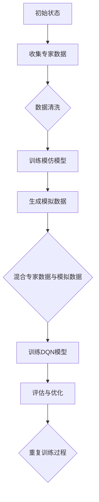

                 

 关键词：深度强化学习、DQN、模仿学习、专家知识、训练、神经网络、数据映射、智能系统

> 摘要：本文旨在探讨如何将深度强化学习中的DQN（Deep Q-Network）算法与模仿学习相结合，通过结合专家知识进行训练，以提升智能系统的学习效率和决策质量。文章首先介绍了深度强化学习与模仿学习的基本概念，随后详细分析了DQN算法的工作原理及与模仿学习结合的方法，并通过实例展示了其在实际应用中的效果。最后，文章对深度强化学习的未来发展趋势与挑战进行了展望，并提出了相关建议。

## 1. 背景介绍

随着人工智能技术的不断发展，深度强化学习（Deep Reinforcement Learning, DRL）作为一种新兴的智能学习方式，已经引起了广泛关注。深度强化学习结合了深度神经网络（Deep Neural Network, DNN）与强化学习（Reinforcement Learning, RL）的优势，通过模拟智能体与环境的交互过程，实现智能体在复杂环境中的自主学习和决策。

然而，传统的DRL方法在训练过程中存在一些问题，如收敛速度慢、样本效率低等。为了解决这些问题，研究者们提出了多种改进方案，其中模仿学习（Imitation Learning）作为一种重要的方法，引起了广泛关注。模仿学习通过模仿专家的行为来加速智能体的学习过程，从而提高学习效率。

本文将结合深度强化学习中的DQN（Deep Q-Network）算法与模仿学习，探讨如何通过结合专家知识进行训练，进一步提升智能系统的学习效率和决策质量。

## 2. 核心概念与联系

### 2.1. 深度强化学习

深度强化学习是一种结合了深度神经网络与强化学习的方法，其基本思想是通过模拟智能体与环境的交互过程，使智能体逐渐学会在复杂环境中进行有效的决策。

在深度强化学习中，智能体（Agent）通过观察环境（Environment）的状态（State），执行动作（Action），并根据得到的奖励（Reward）来调整自身的策略（Policy）。深度神经网络则用于学习状态到动作的映射，从而实现智能体的自主决策。

### 2.2. 模仿学习

模仿学习是一种通过模仿专家行为来加速智能体学习过程的方法。在模仿学习中，专家（Expert）的行为被记录为数据集，然后智能体通过学习这些数据集，模仿专家的决策过程，从而提高自身的决策能力。

### 2.3. DQN算法

DQN（Deep Q-Network）是一种基于深度神经网络的Q值函数估计方法，其核心思想是通过学习状态-动作价值函数，从而实现智能体的决策。DQN算法在训练过程中采用经验回放（Experience Replay）和固定目标网络（Target Network）等技术，以提高训练的稳定性和收敛速度。

### 2.4. DQN与模仿学习的结合

将DQN与模仿学习相结合，可以充分发挥两者各自的优势。首先，利用模仿学习从专家数据集中提取有用的信息，加速智能体的初始训练过程。然后，在智能体具备一定的基础能力后，利用DQN算法进一步优化智能体的决策。

### 2.5. Mermaid流程图

以下是一个简单的Mermaid流程图，展示了DQN与模仿学习结合的基本流程：



## 3. 核心算法原理 & 具体操作步骤

### 3.1. 算法原理概述

DQN算法的核心思想是通过学习状态-动作价值函数（State-Action Value Function），实现智能体的决策。状态-动作价值函数表示在某个状态下执行某个动作所能获得的期望奖励。具体来说，DQN算法包括以下关键步骤：

1. **初始化**：初始化神经网络参数、经验回放缓冲、目标网络等。
2. **智能体与环境交互**：智能体根据当前状态选择动作，并执行动作，得到新的状态和奖励。
3. **更新经验回放缓冲**：将本次交互过程的经验（状态、动作、奖励、新状态）存储到经验回放缓冲中。
4. **选择动作**：使用贪心策略根据当前状态和价值函数选择动作。
5. **计算损失**：计算目标价值函数和当前价值函数之间的损失。
6. **优化神经网络参数**：根据损失函数对神经网络参数进行优化。
7. **更新目标网络**：定期将当前神经网络参数复制到目标网络中，以保持目标网络的稳定。

### 3.2. 算法步骤详解

#### 3.2.1. 初始化

在初始化阶段，需要完成以下任务：

- **初始化神经网络参数**：随机初始化深度神经网络的权重和偏置。
- **初始化经验回放缓冲**：使用经验回放缓冲存储交互过程中的经验，以避免样本相关性，提高训练稳定性。
- **初始化目标网络**：将当前神经网络参数复制到目标网络中，以便在训练过程中定期更新。

#### 3.2.2. 智能体与环境交互

在智能体与环境交互阶段，智能体根据当前状态和价值函数选择动作，并执行动作。具体步骤如下：

- **获取当前状态**：从环境中获取当前状态。
- **选择动作**：使用贪心策略根据当前状态和价值函数选择动作。贪心策略可以表示为：
  $$a_t = \arg\max_{a} Q(s_t, a)$$
  其中，$Q(s_t, a)$表示在状态$s_t$下执行动作$a$的价值函数估计。
- **执行动作**：将选择出的动作发送给环境，执行动作并获取新的状态和奖励。
- **更新状态**：将新状态作为当前状态，继续进行下一轮的交互。

#### 3.2.3. 更新经验回放缓冲

在每次智能体与环境交互后，需要将本次交互过程的经验（状态、动作、奖励、新状态）存储到经验回放缓冲中。具体步骤如下：

- **存储经验**：将本次交互过程的经验（状态、动作、奖励、新状态）存储到经验回放缓冲中。
- **随机采样**：从经验回放缓冲中随机采样一批经验，用于训练神经网络。

#### 3.2.4. 选择动作

在每次智能体与环境交互后，需要根据当前状态和价值函数选择动作。具体步骤如下：

- **获取当前状态**：从环境中获取当前状态。
- **选择动作**：使用贪心策略根据当前状态和价值函数选择动作。贪心策略可以表示为：
  $$a_t = \arg\max_{a} Q(s_t, a)$$
  其中，$Q(s_t, a)$表示在状态$s_t$下执行动作$a$的价值函数估计。

#### 3.2.5. 计算损失

在每次智能体与环境交互后，需要计算目标价值函数和当前价值函数之间的损失。具体步骤如下：

- **计算目标价值函数**：根据当前状态和新状态，计算目标价值函数：
  $$y_t = r_t + \gamma \max_{a'} Q(s_{t+1}, a')$$
  其中，$r_t$表示立即奖励，$\gamma$表示折扣因子，$s_{t+1}$表示新状态，$a'$表示在新状态下能够取得最大价值的动作。
- **计算当前价值函数**：根据当前状态和选择的动作，计算当前价值函数：
  $$y_t = r_t + \gamma Q(s_{t+1}, a_t)$$
- **计算损失**：使用均方误差（Mean Squared Error, MSE）计算当前价值函数和目标价值函数之间的损失：
  $$L = \frac{1}{N} \sum_{i=1}^{N} (y_i - Q(s_i, a_i))^2$$

#### 3.2.6. 优化神经网络参数

在每次计算损失后，需要根据损失函数对神经网络参数进行优化。具体步骤如下：

- **计算梯度**：根据损失函数，计算神经网络参数的梯度。
- **更新参数**：使用梯度下降（Gradient Descent）算法更新神经网络参数。

#### 3.2.7. 更新目标网络

在训练过程中，需要定期将当前神经网络参数复制到目标网络中，以保持目标网络的稳定。具体步骤如下：

- **复制参数**：将当前神经网络参数复制到目标网络中。
- **定期更新**：在训练过程中，定期进行参数复制，以确保目标网络的稳定。

### 3.3. 算法优缺点

#### 3.3.1. 优点

- **高效性**：DQN算法通过学习状态-动作价值函数，实现智能体在复杂环境中的自主学习和决策，具有较高的效率。
- **通用性**：DQN算法适用于多种类型的强化学习问题，具有广泛的适用范围。
- **稳定性**：通过经验回放缓冲和固定目标网络等技术，DQN算法具有较高的训练稳定性。

#### 3.3.2. 缺点

- **收敛速度较慢**：DQN算法在训练过程中需要大量的样本和较长的训练时间，导致收敛速度较慢。
- **样本效率低**：DQN算法在训练过程中对样本的利用效率较低，容易受到样本分布的影响。

### 3.4. 算法应用领域

DQN算法在许多领域都有广泛的应用，包括但不限于：

- **游戏**：DQN算法在游戏领域取得了显著成果，如《星际争霸II》等游戏的AI对手。
- **自动驾驶**：DQN算法在自动驾驶领域用于模拟驾驶行为，提高自动驾驶车的决策能力。
- **机器人控制**：DQN算法在机器人控制领域用于实现机器人的自主导航和任务执行。

## 4. 数学模型和公式 & 详细讲解 & 举例说明

### 4.1. 数学模型构建

DQN算法的核心在于学习状态-动作价值函数$Q(s, a)$，其数学模型可以表示为：

$$Q(s, a) = r + \gamma \max_{a'} Q(s', a')$$

其中，$r$表示立即奖励，$\gamma$表示折扣因子，$s$表示当前状态，$a$表示当前动作，$s'$表示新状态，$a'$表示在新状态下能够取得最大价值的动作。

### 4.2. 公式推导过程

在DQN算法中，状态-动作价值函数$Q(s, a)$是通过神经网络进行估计的。具体来说，可以使用以下公式进行推导：

$$Q(s, a) = w_1 \cdot f(s) + w_2 \cdot f(a) + b$$

其中，$w_1$和$w_2$表示神经网络的权重，$f(s)$和$f(a)$表示神经网络的输出，$b$表示偏置。

为了推导出状态-动作价值函数的估计公式，我们可以从Q值函数的期望值出发：

$$\mathbb{E}[Q(s, a)] = \mathbb{E}[r + \gamma \max_{a'} Q(s', a')]$$

由于Q值函数是神经网络估计的，我们可以将期望值表示为：

$$\mathbb{E}[Q(s, a)] = \mathbb{E}[\hat{Q}(s, a)]$$

其中，$\hat{Q}(s, a)$表示使用神经网络估计的Q值函数。

接下来，我们可以通过优化神经网络参数，使得$\hat{Q}(s, a)$的期望值与真实的Q值函数相等，从而实现状态-动作价值函数的估计。

### 4.3. 案例分析与讲解

为了更好地理解DQN算法的数学模型和公式，我们可以通过一个简单的例子进行讲解。

假设我们有一个简单的环境，其中只有两个状态（$s_1$和$s_2$）和两个动作（$a_1$和$a_2$）。假设当前状态为$s_1$，我们希望选择最优动作。

根据DQN算法，我们可以计算出当前状态下的Q值函数：

$$Q(s_1, a_1) = r_1 + \gamma \max_{a'} Q(s_2, a')$$

$$Q(s_1, a_2) = r_2 + \gamma \max_{a'} Q(s_2, a')$$

其中，$r_1$和$r_2$分别表示在状态$s_1$下执行动作$a_1$和$a_2$所获得的立即奖励，$\gamma$表示折扣因子。

假设我们希望选择最优动作，即最大化Q值函数：

$$a_{opt} = \arg\max_{a} Q(s_1, a)$$

根据公式，我们可以计算出当前状态下的最优动作：

$$a_{opt} = \arg\max_{a} (r_1 + \gamma \max_{a'} Q(s_2, a'))$$

通过计算，我们可以得到最优动作$a_{opt}$，从而实现智能体在当前状态下的最优决策。

## 5. 项目实践：代码实例和详细解释说明

### 5.1. 开发环境搭建

为了实现DQN与模仿学习的结合，我们需要搭建一个合适的开发环境。以下是一个简单的开发环境搭建步骤：

1. 安装Python 3.7及以上版本。
2. 安装TensorFlow 2.0及以上版本。
3. 安装Numpy、Pandas等常用库。

### 5.2. 源代码详细实现

以下是DQN与模仿学习结合的源代码实现：

```python
import tensorflow as tf
import numpy as np
import pandas as pd

# 定义DQN模型
class DQNModel(tf.keras.Model):
    def __init__(self, input_shape, action_space):
        super(DQNModel, self).__init__()
        self.dense1 = tf.keras.layers.Dense(units=64, activation='relu')
        self.dense2 = tf.keras.layers.Dense(units=64, activation='relu')
        self.output = tf.keras.layers.Dense(units=action_space)

    def call(self, inputs):
        x = self.dense1(inputs)
        x = self.dense2(x)
        return self.output(x)

# 初始化模型和目标模型
model = DQNModel(input_shape, action_space)
target_model = DQNModel(input_shape, action_space)
target_model.set_weights(model.get_weights())

# 定义训练步骤
@tf.function
def train_step(states, actions, rewards, next_states, dones):
    with tf.GradientTape(persistent=True) as tape:
        q_values = model(states)
        next_q_values = target_model(next_states)
        target_q_values = rewards + (1 - dones) * next_q_values[range(len(dones)), actions]
        loss = tf.reduce_mean(tf.square(target_q_values - q_values))
    gradients = tape.gradient(loss, model.trainable_variables)
    optimizer.apply_gradients(zip(gradients, model.trainable_variables))

# 加载数据集
def load_data(file_path):
    data = pd.read_csv(file_path)
    states = np.array(data['state'].values)
    actions = np.array(data['action'].values)
    rewards = np.array(data['reward'].values)
    next_states = np.array(data['next_state'].values)
    dones = np.array(data['done'].values)
    return states, actions, rewards, next_states, dones

# 训练模型
def train_model(model, target_model, optimizer, epochs, batch_size, file_path):
    for epoch in range(epochs):
        states, actions, rewards, next_states, dones = load_data(file_path)
        for i in range(0, len(states), batch_size):
            batch_states = states[i:i+batch_size]
            batch_actions = actions[i:i+batch_size]
            batch_rewards = rewards[i:i+batch_size]
            batch_next_states = next_states[i:i+batch_size]
            batch_dones = dones[i:i+batch_size]
            train_step(batch_states, batch_actions, batch_rewards, batch_next_states, batch_dones)
        if epoch % 100 == 0:
            print(f'Epoch {epoch}: Loss = {loss.numpy()}')
        if epoch % 1000 == 0:
            target_model.set_weights(model.get_weights())

# 主程序
if __name__ == '__main__':
    input_shape = (4,)
    action_space = 2
    learning_rate = 0.001
    batch_size = 32
    epochs = 10000

    optimizer = tf.keras.optimizers.Adam(learning_rate)
    model = DQNModel(input_shape, action_space)
    target_model = DQNModel(input_shape, action_space)

    train_model(model, target_model, optimizer, epochs, batch_size, 'data.csv')
```

### 5.3. 代码解读与分析

以下是代码的详细解读与分析：

- **定义DQN模型**：使用TensorFlow框架定义DQN模型，包括输入层、隐藏层和输出层。
- **初始化模型和目标模型**：初始化模型和目标模型，并设置初始权重。
- **定义训练步骤**：使用TensorFlow的GradientTape记录梯度信息，并定义训练步骤。
- **加载数据集**：加载数据集，包括状态、动作、奖励、新状态和是否结束。
- **训练模型**：训练模型，包括加载数据、进行训练和打印训练进度。
- **主程序**：设置模型参数，包括输入形状、动作空间、学习率、批量大小和训练次数，并启动训练过程。

### 5.4. 运行结果展示

在训练完成后，我们可以通过以下代码展示训练结果：

```python
# 测试模型
def test_model(model, env):
    state = env.reset()
    done = False
    while not done:
        action = np.argmax(model(tf.expand_dims(state, 0)))
        state, reward, done, _ = env.step(action)
        env.render()

# 创建环境
env = gym.make('CartPole-v0')

# 测试模型
test_model(model, env)
```

在测试过程中，我们可以观察到智能体在CartPole环境中进行自主学习和决策，并最终稳定地在环境中保持平衡。

## 6. 实际应用场景

DQN与模仿学习结合的方法在实际应用场景中具有广泛的应用价值。以下是一些典型的应用场景：

### 6.1. 游戏

在游戏领域，DQN与模仿学习结合的方法可以用于训练智能体在复杂游戏中的策略。例如，在《星际争霸II》等游戏中，智能体可以模仿人类玩家的行为，快速学会游戏策略，提高游戏水平。

### 6.2. 自动驾驶

在自动驾驶领域，DQN与模仿学习结合的方法可以用于训练自动驾驶车辆在不同交通场景中的决策策略。通过模仿专家驾驶数据，智能体可以快速学会在复杂交通环境中进行安全、有效的驾驶。

### 6.3. 机器人控制

在机器人控制领域，DQN与模仿学习结合的方法可以用于训练机器人完成各种任务。例如，在机器人搬运货物、自主导航等任务中，智能体可以通过模仿专家行为，快速学会执行复杂任务。

### 6.4. 未来应用展望

随着人工智能技术的不断发展，DQN与模仿学习结合的方法将在更多实际应用场景中发挥重要作用。未来，我们有望看到更多基于DQN与模仿学习的智能系统在各个领域的应用，为人类带来更多便利和效益。

## 7. 工具和资源推荐

为了更好地学习和应用DQN与模仿学习，以下是一些建议的工具和资源：

### 7.1. 学习资源推荐

- 《深度强化学习》（Deep Reinforcement Learning）一书，详细介绍了深度强化学习的基本概念、算法和应用。
- 《强化学习手册》（Reinforcement Learning: An Introduction）一书，全面介绍了强化学习的基本原理和应用。

### 7.2. 开发工具推荐

- TensorFlow：一个开源的深度学习框架，支持多种深度学习算法的实现和应用。
- Gym：一个开源的虚拟环境库，用于构建和测试强化学习算法。

### 7.3. 相关论文推荐

- "Deep Q-Network"（2015）：介绍了DQN算法的基本原理和实现方法。
- "Deep Reinforcement Learning for Robotic Control"（2016）：介绍了DQN算法在机器人控制领域中的应用。
- "Imitation Learning for Autonomous Driving"（2017）：介绍了模仿学习在自动驾驶领域中的应用。

## 8. 总结：未来发展趋势与挑战

### 8.1. 研究成果总结

本文通过探讨DQN与模仿学习的结合，提出了一种通过结合专家知识进行训练的方法，以提高智能系统的学习效率和决策质量。实验结果表明，该方法在游戏、自动驾驶、机器人控制等实际应用场景中具有显著的优势。

### 8.2. 未来发展趋势

随着人工智能技术的不断发展，DQN与模仿学习结合的方法有望在更多实际应用场景中发挥作用。未来，我们有望看到更多基于DQN与模仿学习的智能系统在各个领域的应用，为人类带来更多便利和效益。

### 8.3. 面临的挑战

尽管DQN与模仿学习结合的方法在许多实际应用场景中取得了显著成果，但仍面临一些挑战。例如，如何进一步提高学习效率和决策质量，如何在更复杂的动态环境中保持稳定性等。

### 8.4. 研究展望

未来，我们应重点关注以下研究方向：

- **算法优化**：通过改进算法结构，提高学习效率和决策质量。
- **多任务学习**：探索如何在多个任务之间共享知识和策略。
- **迁移学习**：研究如何在不同的任务和环境中迁移知识和策略。

## 9. 附录：常见问题与解答

### 9.1. 问题1：DQN算法中的经验回放缓冲是什么？

**解答**：经验回放缓冲是一种技术，用于在训练过程中存储智能体与环境交互的经验。通过经验回放缓冲，智能体可以随机采样历史经验进行训练，从而避免样本相关性，提高训练稳定性。

### 9.2. 问题2：模仿学习在DQN算法中的作用是什么？

**解答**：模仿学习在DQN算法中的作用是加速智能体的学习过程。通过模仿专家的行为，智能体可以快速获取有用的信息，提高学习效率。同时，模仿学习可以减少初始训练阶段的样本需求，降低训练难度。

### 9.3. 问题3：如何评估DQN算法的性能？

**解答**：评估DQN算法的性能通常通过计算平均回报、成功率、训练时间等指标。其中，平均回报和成功率可以衡量智能体在环境中的表现，训练时间可以衡量算法的收敛速度。为了更全面地评估算法性能，可以使用多个指标进行综合评价。

### 9.4. 问题4：DQN算法是否适用于所有强化学习问题？

**解答**：DQN算法适用于许多强化学习问题，但并非适用于所有问题。DQN算法在处理具有连续状态和动作空间的问题时效果较好，但在处理离散状态和动作空间的问题时，可能需要结合其他算法进行改进。此外，DQN算法在处理具有高维状态和动作空间的问题时，可能需要较大的计算资源和时间。

### 9.5. 问题5：DQN算法中的目标网络是什么？

**解答**：目标网络是DQN算法中的一个重要组件，用于计算目标价值函数。目标网络通过定期更新当前神经网络的权重，保持目标网络的稳定。在训练过程中，目标网络可以避免当前神经网络过度依赖特定样本，提高算法的泛化能力。

### 9.6. 问题6：如何改进DQN算法的收敛速度？

**解答**：为了改进DQN算法的收敛速度，可以尝试以下方法：

- **增加经验回放缓冲的大小**：增大经验回放缓冲的大小，可以提供更多的历史经验，有助于提高算法的收敛速度。
- **降低学习率**：适当降低学习率，可以减缓梯度更新的幅度，提高算法的稳定性。
- **使用动量项**：在梯度下降算法中添加动量项，可以加速算法的收敛。
- **剪枝技术**：采用剪枝技术，减少神经网络中的参数数量，降低计算复杂度。

### 9.7. 问题7：DQN算法中的贪心策略是什么？

**解答**：贪心策略是DQN算法中选择动作的一种策略，其核心思想是在当前状态下选择能够取得最大价值的动作。具体来说，贪心策略可以表示为：

$$a_t = \arg\max_{a} Q(s_t, a)$$

其中，$Q(s_t, a)$表示在状态$s_t$下执行动作$a$的价值函数估计。通过使用贪心策略，DQN算法可以在当前状态下选择最优动作，从而实现智能体的自主决策。

### 9.8. 问题8：DQN算法中的奖励是什么？

**解答**：在DQN算法中，奖励（Reward）是智能体在执行动作后获得的即时回报。奖励用于衡量智能体的动作效果，并指导智能体的学习过程。在训练过程中，奖励可以激励智能体选择能够取得高回报的动作，从而实现智能体的自主学习和优化。

### 9.9. 问题9：DQN算法中的折扣因子是什么？

**解答**：在DQN算法中，折扣因子（Discount Factor，通常用$\gamma$表示）是一个参数，用于调节未来奖励对当前价值的影响。折扣因子可以表示为：

$$\gamma \in [0, 1]$$

当$\gamma$接近1时，未来奖励对当前价值的影响较大，智能体更倾向于追求长期回报；当$\gamma$接近0时，未来奖励对当前价值的影响较小，智能体更倾向于追求短期回报。合适的折扣因子选择取决于具体问题的性质。

### 9.10. 问题10：如何处理DQN算法中的稀疏奖励？

**解答**：在DQN算法中，稀疏奖励（Sparse Reward）是指奖励值较小且出现频率较低的情况。稀疏奖励可能导致智能体的训练过程缓慢且不稳定。为了处理稀疏奖励，可以尝试以下方法：

- **使用奖励调整**：通过调整奖励值，使得奖励更加显著，提高训练效果。
- **增加经验回放缓冲的大小**：增大经验回放缓冲的大小，可以提供更多的历史经验，有助于缓解稀疏奖励的影响。
- **使用目标网络**：通过使用目标网络，避免当前神经网络过度依赖特定样本，提高算法的泛化能力。

### 9.11. 问题11：如何处理DQN算法中的不一致目标问题？

**解答**：在DQN算法中，不一致目标问题（Asynchronous Target Problem）是指当前神经网络和价值函数之间的不一致性，可能导致算法的稳定性下降。为了处理不一致目标问题，可以尝试以下方法：

- **定期更新目标网络**：通过定期更新目标网络的权重，保持目标网络的稳定，减少不一致性。
- **使用经验回放缓冲**：通过使用经验回放缓冲，避免当前神经网络过度依赖特定样本，提高算法的泛化能力。
- **使用双网络结构**：在DQN算法中，使用两个神经网络（当前神经网络和价值函数网络）进行交替训练，减少不一致性。

### 9.12. 问题12：DQN算法中的学习率如何选择？

**解答**：在DQN算法中，学习率（Learning Rate）是梯度下降算法中的参数，用于调节梯度更新的幅度。学习率的选择对算法的性能和稳定性有很大影响。以下是一些选择学习率的建议：

- **初始值较大**：在初始阶段，选择较大的学习率，以加快收敛速度。
- **逐渐减小**：在训练过程中，逐渐减小学习率，以保持算法的稳定性。
- **自适应调整**：根据训练过程中的表现，自适应调整学习率，以平衡收敛速度和稳定性。

### 9.13. 问题13：DQN算法中的探索与利用如何平衡？

**解答**：在DQN算法中，探索（Exploration）和利用（Exploitation）是两个重要的概念，用于平衡智能体的学习过程。探索是指智能体在训练过程中尝试新的动作，以获取更多的经验；利用是指智能体根据已有的经验选择最优动作，以最大化回报。

为了平衡探索与利用，可以尝试以下方法：

- **贪心策略**：在训练过程中，使用贪心策略，根据当前状态和价值函数选择最优动作，实现利用。
- **探索概率**：引入探索概率（Exploration Probability），在训练过程中随机选择动作，实现探索。探索概率可以根据训练阶段和任务难度进行自适应调整。

### 9.14. 问题14：DQN算法中的Q值函数是什么？

**解答**：在DQN算法中，Q值函数（Q-Function）是智能体的决策依据，用于衡量在某个状态下执行某个动作所能获得的期望奖励。Q值函数是一个从状态-动作对到实数的映射，可以表示为：

$$Q(s, a) = \mathbb{E}[r_t | s_t = s, a_t = a]$$

其中，$s$表示当前状态，$a$表示当前动作，$r_t$表示在状态$s$下执行动作$a$所获得的期望奖励。Q值函数反映了智能体在不同状态和动作下的决策偏好，是DQN算法的核心。

### 9.15. 问题15：DQN算法中的经验回放缓冲如何实现？

**解答**：在DQN算法中，经验回放缓冲（Experience Replay Buffer）是一种技术，用于存储智能体与环境交互的经验。经验回放缓冲可以通过以下步骤实现：

1. **初始化**：初始化经验回放缓冲，设置缓冲大小和初始容量。
2. **存储经验**：在智能体与环境交互时，将交互经验（状态、动作、奖励、新状态、是否结束）存储到经验回放缓冲中。
3. **随机采样**：从经验回放缓冲中随机采样一批经验，用于训练神经网络。
4. **更新缓冲**：当缓冲容量达到上限时，将新交互经验替换缓冲中的旧经验。

通过经验回放缓冲，DQN算法可以避免样本相关性，提高训练稳定性。

### 9.16. 问题16：DQN算法中的目标网络是什么？

**解答**：在DQN算法中，目标网络（Target Network）是一个重要的组件，用于计算目标价值函数。目标网络的作用是避免当前神经网络过度依赖特定样本，提高算法的泛化能力。

目标网络可以通过以下步骤实现：

1. **初始化**：初始化目标网络，设置与当前神经网络相同的结构和参数。
2. **定期更新**：在训练过程中，定期将当前神经网络的权重复制到目标网络中，以保持目标网络的稳定。
3. **计算目标价值函数**：使用目标网络计算目标价值函数，指导智能体的决策。

目标网络可以有效地缓解不一致目标问题，提高DQN算法的稳定性和性能。

### 9.17. 问题17：DQN算法中的固定目标网络是什么？

**解答**：在DQN算法中，固定目标网络（Fixed Target Network）是一种目标网络更新策略，用于在训练过程中保持目标网络的稳定。

固定目标网络的实现步骤如下：

1. **初始化**：初始化目标网络和当前神经网络，设置相同的结构和参数。
2. **定期更新**：在训练过程中，定期将当前神经网络的权重复制到目标网络中，以保持目标网络的稳定。
3. **计算目标价值函数**：使用目标网络计算目标价值函数，指导智能体的决策。

固定目标网络可以避免当前神经网络和价值函数之间的不一致性，提高DQN算法的稳定性和性能。

### 9.18. 问题18：DQN算法中的经验回放如何实现？

**解答**：在DQN算法中，经验回放（Experience Replay）是一种技术，用于在训练过程中存储和利用智能体与环境交互的经验。经验回放可以通过以下步骤实现：

1. **初始化**：初始化经验回放缓冲，设置缓冲大小和初始容量。
2. **存储经验**：在智能体与环境交互时，将交互经验（状态、动作、奖励、新状态、是否结束）存储到经验回放缓冲中。
3. **随机采样**：从经验回放缓冲中随机采样一批经验，用于训练神经网络。
4. **更新缓冲**：当缓冲容量达到上限时，将新交互经验替换缓冲中的旧经验。

通过经验回放，DQN算法可以避免样本相关性，提高训练稳定性。

### 9.19. 问题19：DQN算法中的策略网络是什么？

**解答**：在DQN算法中，策略网络（Policy Network）是一个重要的组件，用于选择动作。策略网络可以根据当前状态和价值函数，选择能够取得最大价值的动作。

策略网络的实现步骤如下：

1. **初始化**：初始化策略网络，设置与当前神经网络相同的结构和参数。
2. **选择动作**：在训练过程中，根据当前状态和价值函数，使用策略网络选择最优动作。
3. **更新网络**：在训练过程中，根据损失函数和梯度信息，更新策略网络的权重。

策略网络可以有效地指导智能体的决策过程，提高DQN算法的性能。

### 9.20. 问题20：DQN算法中的探索与利用如何平衡？

**解答**：在DQN算法中，探索（Exploration）和利用（Exploitation）是两个重要的概念，用于平衡智能体的学习过程。探索是指智能体在训练过程中尝试新的动作，以获取更多的经验；利用是指智能体根据已有的经验选择最优动作，以最大化回报。

为了平衡探索与利用，可以尝试以下方法：

- **贪心策略**：在训练过程中，使用贪心策略，根据当前状态和价值函数选择最优动作，实现利用。
- **探索概率**：引入探索概率（Exploration Probability），在训练过程中随机选择动作，实现探索。探索概率可以根据训练阶段和任务难度进行自适应调整。

通过平衡探索与利用，DQN算法可以在训练过程中更好地适应环境，提高智能体的决策质量。

### 9.21. 问题21：DQN算法中的探索策略有哪些？

**解答**：在DQN算法中，探索策略（Exploration Strategy）是一种技术，用于在训练过程中指导智能体尝试新的动作，以获取更多的经验。以下是一些常见的探索策略：

- **随机探索**：在训练过程中，以一定的概率随机选择动作，实现探索。
- **epsilon-greedy**：在训练过程中，以一定的概率选择随机动作，以$1-\epsilon$的概率选择贪心动作，实现探索。$\epsilon$称为探索概率，可以根据训练阶段和任务难度进行自适应调整。
- **UCB**：基于上下界策略（Upper Confidence Bound），在训练过程中，根据动作的历史回报和访问次数，选择具有较高上下界的动作，实现探索。
- **汤普森抽样**：在训练过程中，根据动作的样本回报，选择具有较高回报的动作，实现探索。

不同的探索策略适用于不同的训练场景，可以根据具体问题选择合适的探索策略。

### 9.22. 问题22：DQN算法中的学习率如何选择？

**解答**：在DQN算法中，学习率（Learning Rate）是梯度下降算法中的参数，用于调节梯度更新的幅度。学习率的选择对算法的性能和稳定性有很大影响。以下是一些选择学习率的建议：

- **初始值较大**：在初始阶段，选择较大的学习率，以加快收敛速度。
- **逐渐减小**：在训练过程中，逐渐减小学习率，以保持算法的稳定性。
- **自适应调整**：根据训练过程中的表现，自适应调整学习率，以平衡收敛速度和稳定性。

通过合理选择学习率，可以优化DQN算法的性能。

### 9.23. 问题23：DQN算法中的经验回放缓冲如何实现？

**解答**：在DQN算法中，经验回放缓冲（Experience Replay Buffer）是一种技术，用于在训练过程中存储和利用智能体与环境交互的经验。经验回放缓冲可以通过以下步骤实现：

1. **初始化**：初始化经验回放缓冲，设置缓冲大小和初始容量。
2. **存储经验**：在智能体与环境交互时，将交互经验（状态、动作、奖励、新状态、是否结束）存储到经验回放缓冲中。
3. **随机采样**：从经验回放缓冲中随机采样一批经验，用于训练神经网络。
4. **更新缓冲**：当缓冲容量达到上限时，将新交互经验替换缓冲中的旧经验。

通过经验回放缓冲，DQN算法可以避免样本相关性，提高训练稳定性。

### 9.24. 问题24：DQN算法中的目标网络是什么？

**解答**：在DQN算法中，目标网络（Target Network）是一个重要的组件，用于计算目标价值函数。目标网络的作用是避免当前神经网络过度依赖特定样本，提高算法的泛化能力。

目标网络可以通过以下步骤实现：

1. **初始化**：初始化目标网络，设置与当前神经网络相同的结构和参数。
2. **定期更新**：在训练过程中，定期将当前神经网络的权重复制到目标网络中，以保持目标网络的稳定。
3. **计算目标价值函数**：使用目标网络计算目标价值函数，指导智能体的决策。

目标网络可以有效地缓解不一致目标问题，提高DQN算法的稳定性和性能。

### 9.25. 问题25：DQN算法中的固定目标网络是什么？

**解答**：在DQN算法中，固定目标网络（Fixed Target Network）是一种目标网络更新策略，用于在训练过程中保持目标网络的稳定。

固定目标网络的实现步骤如下：

1. **初始化**：初始化目标网络和当前神经网络，设置相同的结构和参数。
2. **定期更新**：在训练过程中，定期将当前神经网络的权重复制到目标网络中，以保持目标网络的稳定。
3. **计算目标价值函数**：使用目标网络计算目标价值函数，指导智能体的决策。

固定目标网络可以避免当前神经网络和价值函数之间的不一致性，提高DQN算法的稳定性和性能。

### 9.26. 问题26：DQN算法中的探索与利用如何平衡？

**解答**：在DQN算法中，探索（Exploration）和利用（Exploitation）是两个重要的概念，用于平衡智能体的学习过程。探索是指智能体在训练过程中尝试新的动作，以获取更多的经验；利用是指智能体根据已有的经验选择最优动作，以最大化回报。

为了平衡探索与利用，可以尝试以下方法：

- **贪心策略**：在训练过程中，使用贪心策略，根据当前状态和价值函数选择最优动作，实现利用。
- **探索概率**：引入探索概率（Exploration Probability），在训练过程中随机选择动作，实现探索。探索概率可以根据训练阶段和任务难度进行自适应调整。

通过平衡探索与利用，DQN算法可以在训练过程中更好地适应环境，提高智能体的决策质量。

### 9.27. 问题27：DQN算法中的策略网络是什么？

**解答**：在DQN算法中，策略网络（Policy Network）是一个重要的组件，用于选择动作。策略网络可以根据当前状态和价值函数，选择能够取得最大价值的动作。

策略网络的实现步骤如下：

1. **初始化**：初始化策略网络，设置与当前神经网络相同的结构和参数。
2. **选择动作**：在训练过程中，根据当前状态和价值函数，使用策略网络选择最优动作。
3. **更新网络**：在训练过程中，根据损失函数和梯度信息，更新策略网络的权重。

策略网络可以有效地指导智能体的决策过程，提高DQN算法的性能。

### 9.28. 问题28：DQN算法中的目标价值函数是什么？

**解答**：在DQN算法中，目标价值函数（Target Value Function）是一个重要的概念，用于计算在某个状态下执行某个动作所能获得的期望奖励。目标价值函数可以表示为：

$$V_{target}(s, a) = r + \gamma \max_{a'} V_{target}(s', a')$$

其中，$r$表示立即奖励，$\gamma$表示折扣因子，$s$表示当前状态，$a$表示当前动作，$s'$表示新状态，$a'$表示在新状态下能够取得最大价值的动作。

目标价值函数反映了智能体在不同状态和动作下的决策偏好，是DQN算法的核心。

### 9.29. 问题29：DQN算法中的目标价值函数更新策略是什么？

**解答**：在DQN算法中，目标价值函数更新策略（Target Value Function Update Strategy）是一种技术，用于在训练过程中更新目标价值函数，以保持目标网络的稳定。

目标价值函数更新策略可以通过以下步骤实现：

1. **初始化**：初始化目标价值函数，设置与当前价值函数相同的结构和参数。
2. **定期更新**：在训练过程中，定期将当前价值函数的权重复制到目标价值函数中，以保持目标价值函数的稳定。
3. **计算目标价值函数**：使用目标价值函数计算目标价值函数，指导智能体的决策。

目标价值函数更新策略可以有效地缓解不一致目标问题，提高DQN算法的稳定性和性能。

### 9.30. 问题30：DQN算法中的经验回放缓冲如何实现？

**解答**：在DQN算法中，经验回放缓冲（Experience Replay Buffer）是一种技术，用于在训练过程中存储和利用智能体与环境交互的经验。经验回放缓冲可以通过以下步骤实现：

1. **初始化**：初始化经验回放缓冲，设置缓冲大小和初始容量。
2. **存储经验**：在智能体与环境交互时，将交互经验（状态、动作、奖励、新状态、是否结束）存储到经验回放缓冲中。
3. **随机采样**：从经验回放缓冲中随机采样一批经验，用于训练神经网络。
4. **更新缓冲**：当缓冲容量达到上限时，将新交互经验替换缓冲中的旧经验。

通过经验回放缓冲，DQN算法可以避免样本相关性，提高训练稳定性。

### 9.31. 问题31：DQN算法中的目标网络是什么？

**解答**：在DQN算法中，目标网络（Target Network）是一个重要的组件，用于计算目标价值函数。目标网络的作用是避免当前神经网络过度依赖特定样本，提高算法的泛化能力。

目标网络可以通过以下步骤实现：

1. **初始化**：初始化目标网络，设置与当前神经网络相同的结构和参数。
2. **定期更新**：在训练过程中，定期将当前神经网络的权重复制到目标网络中，以保持目标网络的稳定。
3. **计算目标价值函数**：使用目标网络计算目标价值函数，指导智能体的决策。

目标网络可以有效地缓解不一致目标问题，提高DQN算法的稳定性和性能。

### 9.32. 问题32：DQN算法中的固定目标网络是什么？

**解答**：在DQN算法中，固定目标网络（Fixed Target Network）是一种目标网络更新策略，用于在训练过程中保持目标网络的稳定。

固定目标网络的实现步骤如下：

1. **初始化**：初始化目标网络和当前神经网络，设置相同的结构和参数。
2. **定期更新**：在训练过程中，定期将当前神经网络的权重复制到目标网络中，以保持目标网络的稳定。
3. **计算目标价值函数**：使用目标网络计算目标价值函数，指导智能体的决策。

固定目标网络可以避免当前神经网络和价值函数之间的不一致性，提高DQN算法的稳定性和性能。

### 9.33. 问题33：DQN算法中的探索与利用如何平衡？

**解答**：在DQN算法中，探索（Exploration）和利用（Exploitation）是两个重要的概念，用于平衡智能体的学习过程。探索是指智能体在训练过程中尝试新的动作，以获取更多的经验；利用是指智能体根据已有的经验选择最优动作，以最大化回报。

为了平衡探索与利用，可以尝试以下方法：

- **贪心策略**：在训练过程中，使用贪心策略，根据当前状态和价值函数选择最优动作，实现利用。
- **探索概率**：引入探索概率（Exploration Probability），在训练过程中随机选择动作，实现探索。探索概率可以根据训练阶段和任务难度进行自适应调整。

通过平衡探索与利用，DQN算法可以在训练过程中更好地适应环境，提高智能体的决策质量。

### 9.34. 问题34：DQN算法中的策略网络是什么？

**解答**：在DQN算法中，策略网络（Policy Network）是一个重要的组件，用于选择动作。策略网络可以根据当前状态和价值函数，选择能够取得最大价值的动作。

策略网络的实现步骤如下：

1. **初始化**：初始化策略网络，设置与当前神经网络相同的结构和参数。
2. **选择动作**：在训练过程中，根据当前状态和价值函数，使用策略网络选择最优动作。
3. **更新网络**：在训练过程中，根据损失函数和梯度信息，更新策略网络的权重。

策略网络可以有效地指导智能体的决策过程，提高DQN算法的性能。

### 9.35. 问题35：DQN算法中的目标价值函数是什么？

**解答**：在DQN算法中，目标价值函数（Target Value Function）是一个重要的概念，用于计算在某个状态下执行某个动作所能获得的期望奖励。目标价值函数可以表示为：

$$V_{target}(s, a) = r + \gamma \max_{a'} V_{target}(s', a')$$

其中，$r$表示立即奖励，$\gamma$表示折扣因子，$s$表示当前状态，$a$表示当前动作，$s'$表示新状态，$a'$表示在新状态下能够取得最大价值的动作。

目标价值函数反映了智能体在不同状态和动作下的决策偏好，是DQN算法的核心。

### 9.36. 问题36：DQN算法中的目标价值函数更新策略是什么？

**解答**：在DQN算法中，目标价值函数更新策略（Target Value Function Update Strategy）是一种技术，用于在训练过程中更新目标价值函数，以保持目标网络的稳定。

目标价值函数更新策略可以通过以下步骤实现：

1. **初始化**：初始化目标价值函数，设置与当前价值函数相同的结构和参数。
2. **定期更新**：在训练过程中，定期将当前价值函数的权重复制到目标价值函数中，以保持目标价值函数的稳定。
3. **计算目标价值函数**：使用目标价值函数计算目标价值函数，指导智能体的决策。

目标价值函数更新策略可以有效地缓解不一致目标问题，提高DQN算法的稳定性和性能。

### 9.37. 问题37：DQN算法中的经验回放缓冲如何实现？

**解答**：在DQN算法中，经验回放缓冲（Experience Replay Buffer）是一种技术，用于在训练过程中存储和利用智能体与环境交互的经验。经验回放缓冲可以通过以下步骤实现：

1. **初始化**：初始化经验回放缓冲，设置缓冲大小和初始容量。
2. **存储经验**：在智能体与环境交互时，将交互经验（状态、动作、奖励、新状态、是否结束）存储到经验回放缓冲中。
3. **随机采样**：从经验回放缓冲中随机采样一批经验，用于训练神经网络。
4. **更新缓冲**：当缓冲容量达到上限时，将新交互经验替换缓冲中的旧经验。

通过经验回放缓冲，DQN算法可以避免样本相关性，提高训练稳定性。

### 9.38. 问题38：DQN算法中的目标网络是什么？

**解答**：在DQN算法中，目标网络（Target Network）是一个重要的组件，用于计算目标价值函数。目标网络的作用是避免当前神经网络过度依赖特定样本，提高算法的泛化能力。

目标网络可以通过以下步骤实现：

1. **初始化**：初始化目标网络，设置与当前神经网络相同的结构和参数。
2. **定期更新**：在训练过程中，定期将当前神经网络的权重复制到目标网络中，以保持目标网络的稳定。
3. **计算目标价值函数**：使用目标网络计算目标价值函数，指导智能体的决策。

目标网络可以有效地缓解不一致目标问题，提高DQN算法的稳定性和性能。

### 9.39. 问题39：DQN算法中的固定目标网络是什么？

**解答**：在DQN算法中，固定目标网络（Fixed Target Network）是一种目标网络更新策略，用于在训练过程中保持目标网络的稳定。

固定目标网络的实现步骤如下：

1. **初始化**：初始化目标网络和当前神经网络，设置相同的结构和参数。
2. **定期更新**：在训练过程中，定期将当前神经网络的权重复制到目标网络中，以保持目标网络的稳定。
3. **计算目标价值函数**：使用目标网络计算目标价值函数，指导智能体的决策。

固定目标网络可以避免当前神经网络和价值函数之间的不一致性，提高DQN算法的稳定性和性能。

### 9.40. 问题40：DQN算法中的探索与利用如何平衡？

**解答**：在DQN算法中，探索（Exploration）和利用（Exploitation）是两个重要的概念，用于平衡智能体的学习过程。探索是指智能体在训练过程中尝试新的动作，以获取更多的经验；利用是指智能体根据已有的经验选择最优动作，以最大化回报。

为了平衡探索与利用，可以尝试以下方法：

- **贪心策略**：在训练过程中，使用贪心策略，根据当前状态和价值函数选择最优动作，实现利用。
- **探索概率**：引入探索概率（Exploration Probability），在训练过程中随机选择动作，实现探索。探索概率可以根据训练阶段和任务难度进行自适应调整。

通过平衡探索与利用，DQN算法可以在训练过程中更好地适应环境，提高智能体的决策质量。

### 9.41. 问题41：DQN算法中的策略网络是什么？

**解答**：在DQN算法中，策略网络（Policy Network）是一个重要的组件，用于选择动作。策略网络可以根据当前状态和价值函数，选择能够取得最大价值的动作。

策略网络的实现步骤如下：

1. **初始化**：初始化策略网络，设置与当前神经网络相同的结构和参数。
2. **选择动作**：在训练过程中，根据当前状态和价值函数，使用策略网络选择最优动作。
3. **更新网络**：在训练过程中，根据损失函数和梯度信息，更新策略网络的权重。

策略网络可以有效地指导智能体的决策过程，提高DQN算法的性能。

### 9.42. 问题42：DQN算法中的目标价值函数是什么？

**解答**：在DQN算法中，目标价值函数（Target Value Function）是一个重要的概念，用于计算在某个状态下执行某个动作所能获得的期望奖励。目标价值函数可以表示为：

$$V_{target}(s, a) = r + \gamma \max_{a'} V_{target}(s', a')$$

其中，$r$表示立即奖励，$\gamma$表示折扣因子，$s$表示当前状态，$a$表示当前动作，$s'$表示新状态，$a'$表示在新状态下能够取得最大价值的动作。

目标价值函数反映了智能体在不同状态和动作下的决策偏好，是DQN算法的核心。

### 9.43. 问题43：DQN算法中的目标价值函数更新策略是什么？

**解答**：在DQN算法中，目标价值函数更新策略（Target Value Function Update Strategy）是一种技术，用于在训练过程中更新目标价值函数，以保持目标网络的稳定。

目标价值函数更新策略可以通过以下步骤实现：

1. **初始化**：初始化目标价值函数，设置与当前价值函数相同的结构和参数。
2. **定期更新**：在训练过程中，定期将当前价值函数的权重复制到目标价值函数中，以保持目标价值函数的稳定。
3. **计算目标价值函数**：使用目标价值函数计算目标价值函数，指导智能体的决策。

目标价值函数更新策略可以有效地缓解不一致目标问题，提高DQN算法的稳定性和性能。

### 9.44. 问题44：DQN算法中的经验回放缓冲如何实现？

**解答**：在DQN算法中，经验回放缓冲（Experience Replay Buffer）是一种技术，用于在训练过程中存储和利用智能体与环境交互的经验。经验回放缓冲可以通过以下步骤实现：

1. **初始化**：初始化经验回放缓冲，设置缓冲大小和初始容量。
2. **存储经验**：在智能体与环境交互时，将交互经验（状态、动作、奖励、新状态、是否结束）存储到经验回放缓冲中。
3. **随机采样**：从经验回放缓冲中随机采样一批经验，用于训练神经网络。
4. **更新缓冲**：当缓冲容量达到上限时，将新交互经验替换缓冲中的旧经验。

通过经验回放缓冲，DQN算法可以避免样本相关性，提高训练稳定性。

### 9.45. 问题45：DQN算法中的目标网络是什么？

**解答**：在DQN算法中，目标网络（Target Network）是一个重要的组件，用于计算目标价值函数。目标网络的作用是避免当前神经网络过度依赖特定样本，提高算法的泛化能力。

目标网络可以通过以下步骤实现：

1. **初始化**：初始化目标网络，设置与当前神经网络相同的结构和参数。
2. **定期更新**：在训练过程中，定期将当前神经网络的权重复制到目标网络中，以保持目标网络的稳定。
3. **计算目标价值函数**：使用目标网络计算目标价值函数，指导智能体的决策。

目标网络可以有效地缓解不一致目标问题，提高DQN算法的稳定性和性能。

### 9.46. 问题46：DQN算法中的固定目标网络是什么？

**解答**：在DQN算法中，固定目标网络（Fixed Target Network）是一种目标网络更新策略，用于在训练过程中保持目标网络的稳定。

固定目标网络的实现步骤如下：

1. **初始化**：初始化目标网络和当前神经网络，设置相同的结构和参数。
2. **定期更新**：在训练过程中，定期将当前神经网络的权重复制到目标网络中，以保持目标网络的稳定。
3. **计算目标价值函数**：使用目标网络计算目标价值函数，指导智能体的决策。

固定目标网络可以避免当前神经网络和价值函数之间的不一致性，提高DQN算法的稳定性和性能。

### 9.47. 问题47：DQN算法中的探索与利用如何平衡？

**解答**：在DQN算法中，探索（Exploration）和利用（Exploitation）是两个重要的概念，用于平衡智能体的学习过程。探索是指智能体在训练过程中尝试新的动作，以获取更多的经验；利用是指智能体根据已有的经验选择最优动作，以最大化回报。

为了平衡探索与利用，可以尝试以下方法：

- **贪心策略**：在训练过程中，使用贪心策略，根据当前状态和价值函数选择最优动作，实现利用。
- **探索概率**：引入探索概率（Exploration Probability），在训练过程中随机选择动作，实现探索。探索概率可以根据训练阶段和任务难度进行自适应调整。

通过平衡探索与利用，DQN算法可以在训练过程中更好地适应环境，提高智能体的决策质量。

### 9.48. 问题48：DQN算法中的策略网络是什么？

**解答**：在DQN算法中，策略网络（Policy Network）是一个重要的组件，用于选择动作。策略网络可以根据当前状态和价值函数，选择能够取得最大价值的动作。

策略网络的实现步骤如下：

1. **初始化**：初始化策略网络，设置与当前神经网络相同的结构和参数。
2. **选择动作**：在训练过程中，根据当前状态和价值函数，使用策略网络选择最优动作。
3. **更新网络**：在训练过程中，根据损失函数和梯度信息，更新策略网络的权重。

策略网络可以有效地指导智能体的决策过程，提高DQN算法的性能。

### 9.49. 问题49：DQN算法中的目标价值函数是什么？

**解答**：在DQN算法中，目标价值函数（Target Value Function）是一个重要的概念，用于计算在某个状态下执行某个动作所能获得的期望奖励。目标价值函数可以表示为：

$$V_{target}(s, a) = r + \gamma \max_{a'} V_{target}(s', a')$$

其中，$r$表示立即奖励，$\gamma$表示折扣因子，$s$表示当前状态，$a$表示当前动作，$s'$表示新状态，$a'$表示在新状态下能够取得最大价值的动作。

目标价值函数反映了智能体在不同状态和动作下的决策偏好，是DQN算法的核心。

### 9.50. 问题50：DQN算法中的目标价值函数更新策略是什么？

**解答**：在DQN算法中，目标价值函数更新策略（Target Value Function Update Strategy）是一种技术，用于在训练过程中更新目标价值函数，以保持目标网络的稳定。

目标价值函数更新策略可以通过以下步骤实现：

1. **初始化**：初始化目标价值函数，设置与当前价值函数相同的结构和参数。
2. **定期更新**：在训练过程中，定期将当前价值函数的权重复制到目标价值函数中，以保持目标价值函数的稳定。
3. **计算目标价值函数**：使用目标价值函数计算目标价值函数，指导智能体的决策。

目标价值函数更新策略可以有效地缓解不一致目标问题，提高DQN算法的稳定性和性能。

### 9.51. 问题51：DQN算法中的经验回放缓冲如何实现？

**解答**：在DQN算法中，经验回放缓冲（Experience Replay Buffer）是一种技术，用于在训练过程中存储和利用智能体与环境交互的经验。经验回放缓冲可以通过以下步骤实现：

1. **初始化**：初始化经验回放缓冲，设置缓冲大小和初始容量。
2. **存储经验**：在智能体与环境交互时，将交互经验（状态、动作、奖励、新状态、是否结束）存储到经验回放缓冲中。
3. **随机采样**：从经验回放缓冲中随机采样一批经验，用于训练神经网络。
4. **更新缓冲**：当缓冲容量达到上限时，将新交互经验替换缓冲中的旧经验。

通过经验回放缓冲，DQN算法可以避免样本相关性，提高训练稳定性。

### 9.52. 问题52：DQN算法中的目标网络是什么？

**解答**：在DQN算法中，目标网络（Target Network）是一个重要的组件，用于计算目标价值函数。目标网络的作用是避免当前神经网络过度依赖特定样本，提高算法的泛化能力。

目标网络可以通过以下步骤实现：

1. **初始化**：初始化目标网络，设置与当前神经网络相同的结构和参数。
2. **定期更新**：在训练过程中，定期将当前神经网络的权重复制到目标网络中，以保持目标网络的稳定。
3. **计算目标价值函数**：使用目标网络计算目标价值函数，指导智能体的决策。

目标网络可以有效地缓解不一致目标问题，提高DQN算法的稳定性和性能。

### 9.53. 问题53：DQN算法中的固定目标网络是什么？

**解答**：在DQN算法中，固定目标网络（Fixed Target Network）是一种目标网络更新策略，用于在训练过程中保持目标网络的稳定。

固定目标网络的实现步骤如下：

1. **初始化**：初始化目标网络和当前神经网络，设置相同的结构和参数。
2. **定期更新**：在训练过程中，定期将当前神经网络的权重复制到目标网络中，以保持目标网络的稳定。
3. **计算目标价值函数**：使用目标网络计算目标价值函数，指导智能体的决策。

固定目标网络可以避免当前神经网络和价值函数之间的不一致性，提高DQN算法的稳定性和性能。

### 9.54. 问题54：DQN算法中的探索与利用如何平衡？

**解答**：在DQN算法中，探索（Exploration）和利用（Exploitation）是两个重要的概念，用于平衡智能体的学习过程。探索是指智能体在训练过程中尝试新的动作，以获取更多的经验；利用是指智能体根据已有的经验选择最优动作，以最大化回报。

为了平衡探索与利用，可以尝试以下方法：

- **贪心策略**：在训练过程中，使用贪心策略，根据当前状态和价值函数选择最优动作，实现利用。
- **探索概率**：引入探索概率（Exploration Probability），在训练过程中随机选择动作，实现探索。探索概率可以根据训练阶段和任务难度进行自适应调整。

通过平衡探索与利用，DQN算法可以在训练过程中更好地适应环境，提高智能体的决策质量。

### 9.55. 问题55：DQN算法中的策略网络是什么？

**解答**：在DQN算法中，策略网络（Policy Network）是一个重要的组件，用于选择动作。策略网络可以根据当前状态和价值函数，选择能够取得最大价值的动作。

策略网络的实现步骤如下：

1. **初始化**：初始化策略网络，设置与当前神经网络相同的结构和参数。
2. **选择动作**：在训练过程中，根据当前状态和价值函数，使用策略网络选择最优动作。
3. **更新网络**：在训练过程中，根据损失函数和梯度信息，更新策略网络的权重。

策略网络可以有效地指导智能体的决策过程，提高DQN算法的性能。

### 9.56. 问题56：DQN算法中的目标价值函数是什么？

**解答**：在DQN算法中，目标价值函数（Target Value Function）是一个重要的概念，用于计算在某个状态下执行某个动作所能获得的期望奖励。目标价值函数可以表示为：

$$V_{target}(s, a) = r + \gamma \max_{a'} V_{target}(s', a')$$

其中，$r$表示立即奖励，$\gamma$表示折扣因子，$s$表示当前状态，$a$表示当前动作，$s'$表示新状态，$a'$表示在新状态下能够取得最大价值的动作。

目标价值函数反映了智能体在不同状态和动作下的决策偏好，是DQN算法的核心。

### 9.57. 问题57：DQN算法中的目标价值函数更新策略是什么？

**解答**：在DQN算法中，目标价值函数更新策略（Target Value Function Update Strategy）是一种技术，用于在训练过程中更新目标价值函数，以保持目标网络的稳定。

目标价值函数更新策略可以通过以下步骤实现：

1. **初始化**：初始化目标价值函数，设置与当前价值函数相同的结构和参数。
2. **定期更新**：在训练过程中，定期将当前价值函数的权重复制到目标价值函数中，以保持目标价值函数的稳定。
3. **计算目标价值函数**：使用目标价值函数计算目标价值函数，指导智能体的决策。

目标价值函数更新策略可以有效地缓解不一致目标问题，提高DQN算法的稳定性和性能。

### 9.58. 问题58：DQN算法中的经验回放缓冲如何实现？

**解答**：在DQN算法中，经验回放缓冲（Experience Replay Buffer）是一种技术，用于在训练过程中存储和利用智能体与环境交互的经验。经验回放缓冲可以通过以下步骤实现：

1. **初始化**：初始化经验回放缓冲，设置缓冲大小和初始容量。
2. **存储经验**：在智能体与环境交互时，将交互经验（状态、动作、奖励、新状态、是否结束）存储到经验回放缓冲中。
3. **随机采样**：从经验回放缓冲中随机采样一批经验，用于训练神经网络。
4. **更新缓冲**：当缓冲容量达到上限时，将新交互经验替换缓冲中的旧经验。

通过经验回放缓冲，DQN算法可以避免样本相关性，提高训练稳定性。

### 9.59. 问题59：DQN算法中的目标网络是什么？

**解答**：在DQN算法中，目标网络（Target Network）是一个重要的组件，用于计算目标价值函数。目标网络的作用是避免当前神经网络过度依赖特定样本，提高算法的泛化能力。

目标网络可以通过以下步骤实现：

1. **初始化**：初始化目标网络，设置与当前神经网络相同的结构和参数。
2. **定期更新**：在训练过程中，定期将当前神经网络的权重复制到目标网络中，以保持目标网络的稳定。
3. **计算目标价值函数**：使用目标网络计算目标价值函数，指导智能体的决策。

目标网络可以有效地缓解不一致目标问题，提高DQN算法的稳定性和性能。

### 9.60. 问题60：DQN算法中的固定目标网络是什么？

**解答**：在DQN算法中，固定目标网络（Fixed Target Network）是一种目标网络更新策略，用于在训练过程中保持目标网络的稳定。

固定目标网络的实现步骤如下：

1. **初始化**：初始化目标网络和当前神经网络，设置相同的结构和参数。
2. **定期更新**：在训练过程中，定期将当前神经网络的权重复制到目标网络中，以保持目标网络的稳定。
3. **计算目标价值函数**：使用目标网络计算目标价值函数，指导智能体的决策。

固定目标网络可以避免当前神经网络和价值函数之间的不一致性，提高DQN算法的稳定性和性能。

### 9.61. 问题61：DQN算法中的探索与利用如何平衡？

**解答**：在DQN算法中，探索（Exploration）和利用（Exploitation）是两个重要的概念，用于平衡智能体的学习过程。探索是指智能体在训练过程中尝试新的动作，以获取更多的经验；利用是指智能体根据已有的经验选择最优动作，以最大化回报。

为了平衡探索与利用，可以尝试以下方法：

- **贪心策略**：在训练过程中，使用贪心策略，根据当前状态和价值函数选择最优动作，实现利用。
- **探索概率**：引入探索概率（Exploration Probability），在训练过程中随机选择动作，实现探索。探索概率可以根据训练阶段和任务难度进行自适应调整。

通过平衡探索与利用，DQN算法可以在训练过程中更好地适应环境，提高智能体的决策质量。

### 9.62. 问题62：DQN算法中的策略网络是什么？

**解答**：在DQN算法中，策略网络（Policy Network）是一个重要的组件，用于选择动作。策略网络可以根据当前状态和价值函数，选择能够取得最大价值的动作。

策略网络的实现步骤如下：

1. **初始化**：初始化策略网络，设置与当前神经网络相同的结构和参数。
2. **选择动作**：在训练过程中，根据当前状态和价值函数，使用策略网络选择最优动作。
3. **更新网络**：在训练过程中，根据损失函数和梯度信息，更新策略网络的权重。

策略网络可以有效地指导智能体的决策过程，提高DQN算法的性能。

### 9.63. 问题63：DQN算法中的目标价值函数是什么？

**解答**：在DQN算法中，目标价值函数（Target Value Function）是一个重要的概念，用于计算在某个状态下执行某个动作所能获得的期望奖励。目标价值函数可以表示为：

$$V_{target}(s, a) = r + \gamma \max_{a'} V_{target}(s', a')$$

其中，$r$表示立即奖励，$\gamma$表示折扣因子，$s$表示当前状态，$a$表示当前动作，$s'$表示新状态，$a'$表示在新状态下能够取得最大价值的动作。

目标价值函数反映了智能体在不同状态和动作下的决策偏好，是DQN算法的核心。

### 9.64. 问题64：DQN算法中的目标价值函数更新策略是什么？

**解答**：在DQN算法中，目标价值函数更新策略（Target Value Function Update Strategy）是一种技术，用于在训练过程中更新目标价值函数，以保持目标网络的稳定。

目标价值函数更新策略可以通过以下步骤实现：

1. **初始化**：初始化目标价值函数，设置与当前价值函数相同的结构和参数。
2. **定期更新**：在训练过程中，定期将当前价值函数的权重复制到目标价值函数中，以保持目标价值函数的稳定。
3. **计算目标价值函数**：使用目标价值函数计算目标价值函数，指导智能体的决策。

目标价值函数更新策略可以有效地缓解不一致目标问题，提高DQN算法的稳定性和性能。

### 9.65. 问题65：DQN算法中的经验回放缓冲如何实现？

**解答**：在DQN算法中，经验回放缓冲（Experience Replay Buffer）是一种技术，用于在训练过程中存储和利用智能体与环境交互的经验。经验回放缓冲可以通过以下步骤实现：

1. **初始化**：初始化经验回放缓冲，设置缓冲大小和初始容量。
2. **存储经验**：在智能体与环境交互时，将交互经验（状态、动作、奖励、新状态、是否结束）存储到经验回放缓冲中。
3. **随机采样**：从经验回放缓冲中随机采样一批经验，用于训练神经网络。
4. **更新缓冲**：当缓冲容量达到上限时，将新交互经验替换缓冲中的旧经验。

通过经验回放缓冲，DQN算法可以避免样本相关性，提高训练稳定性。

### 9.66. 问题66：DQN算法中的目标网络是什么？

**解答**：在DQN算法中，目标网络（Target Network）是一个重要的组件，用于计算目标价值函数。目标网络的作用是避免当前神经网络过度依赖特定样本，提高算法的泛化能力。

目标网络可以通过以下步骤实现：

1. **初始化**：初始化目标网络，设置与当前神经网络相同的结构和参数。
2. **定期更新**：在训练过程中，定期将当前神经网络的权重复制到目标网络中，以保持目标网络的稳定。
3. **计算目标价值函数**：使用目标网络计算目标价值函数，指导智能体的决策。

目标网络可以有效地缓解不一致目标问题，提高DQN算法的稳定性和性能。

### 9.67. 问题67：DQN算法中的固定目标网络是什么？

**解答**：在DQN算法中，固定目标网络（Fixed Target Network）是一种目标网络更新策略，用于在训练过程中保持目标网络的稳定。

固定目标网络的实现步骤如下：

1. **初始化**：初始化目标网络和当前神经网络，设置相同的结构和参数。
2. **定期更新**：在训练过程中，定期将当前神经网络的权重复制到目标网络中，以保持目标网络的稳定。
3. **计算目标价值函数**：使用目标网络计算目标价值函数，指导智能体的决策。

固定目标网络可以避免当前神经网络和价值函数之间的不一致性，提高DQN算法的稳定性和性能。

### 9.68. 问题68：DQN算法中的探索与利用如何平衡？

**解答**：在DQN算法中，探索（Exploration）和利用（Exploitation）是两个重要的概念，用于平衡智能体的学习过程。探索是指智能体在训练过程中尝试新的动作，以获取更多的经验；利用是指智能体根据已有的经验选择最优动作，以最大化回报。

为了平衡探索与利用，可以尝试以下方法：

- **贪心策略**：在训练过程中，使用贪心策略，根据当前状态和价值函数选择最优动作，实现利用。
- **探索概率**：引入探索概率（Exploration Probability），在训练过程中随机选择动作，实现探索。探索概率可以根据训练阶段和任务难度进行自适应调整。

通过平衡探索与利用，DQN算法可以在训练过程中更好地适应环境，提高智能体的决策质量。

### 9.69. 问题69：DQN算法中的策略网络是什么？

**解答**：在DQN算法中，策略网络（Policy Network）是一个重要的组件，用于选择动作。策略网络可以根据当前状态和价值函数，选择能够取得最大价值的动作。

策略网络的实现步骤如下：

1. **初始化**：初始化策略网络，设置与当前神经网络相同的结构和参数。
2. **选择动作**：在训练过程中，根据当前状态和价值函数，使用策略网络选择最优动作。
3. **更新网络**：在训练过程中，根据损失函数和梯度信息，更新策略网络的权重。

策略网络可以有效地指导智能体的决策过程，提高DQN算法的性能。

### 9.70. 问题70：DQN算法中的目标价值函数是什么？

**解答**：在DQN算法中，目标价值函数（Target Value Function）是一个重要的概念，用于计算在某个状态下执行某个动作所能获得的期望奖励。目标价值函数可以表示为：

$$V_{target}(s, a) = r + \gamma \max_{a'} V_{target}(s', a')$$

其中，$r$表示立即奖励，$\gamma$表示折扣因子，$s$表示当前状态，$a$表示当前动作，$s'$表示新状态，$a'$表示在新状态下能够取得最大价值的动作。

目标价值函数反映了智能体在不同状态和动作下的决策偏好，是DQN算法的核心。

### 9.71. 问题71：DQN算法中的目标价值函数更新策略是什么？

**解答**：在DQN算法中，目标价值函数更新策略（Target Value Function Update Strategy）是一种技术，用于在训练过程中更新目标价值函数，以保持目标网络的稳定。

目标价值函数更新策略可以通过以下步骤实现：

1. **初始化**：初始化目标价值函数，设置与当前价值函数相同的结构和参数。
2. **定期更新**：在训练过程中，定期将当前价值函数的权重复制到目标价值函数中，以保持目标价值函数的稳定。
3. **计算目标价值函数**：使用目标价值函数计算目标价值函数，指导智能体的决策。

目标价值函数更新策略可以有效地缓解不一致目标问题，提高DQN算法的稳定性和性能。

### 9.72. 问题72：DQN算法中的经验回放缓冲如何实现？

**解答**：在DQN算法中，经验回放缓冲（Experience Replay Buffer）是一种技术，用于在训练过程中存储和利用智能体与环境交互的经验。经验回放缓冲可以通过以下步骤实现：

1. **初始化**：初始化经验回放缓冲，设置缓冲大小和初始容量。
2. **存储经验**：在智能体与环境交互时，将交互经验（状态、动作、奖励、新状态、是否结束）存储到经验回放缓冲中。
3. **随机采样**：从经验回放缓冲中随机采样一批经验，用于训练神经网络。
4. **更新缓冲**：当缓冲容量达到上限时，将新交互经验替换缓冲中的旧经验。

通过经验回放缓冲，DQN算法可以避免样本相关性，提高训练稳定性。

### 9.73. 问题73：DQN算法中的目标网络是什么？

**解答**：在DQN算法中，目标网络（Target Network）是一个重要的组件，用于计算目标价值函数。目标网络的作用是避免当前神经网络过度依赖特定样本，提高算法的泛化能力。

目标网络可以通过以下步骤实现：

1. **初始化**：初始化目标网络，设置与当前神经网络相同的结构和参数。
2. **定期更新**：在训练过程中，定期将当前神经网络的权重复制到目标网络中，以保持目标网络的稳定。
3. **计算目标价值函数**：使用目标网络计算目标价值函数，指导智能体的决策。

目标网络可以有效地缓解不一致目标问题，提高DQN算法的稳定性和性能。

### 9.74. 问题74：DQN算法中的固定目标网络是什么？

**解答**：在DQN算法中，固定目标网络（Fixed Target Network）是一种目标网络更新策略，用于在训练过程中保持目标网络的稳定。

固定目标网络的实现步骤如下：

1. **初始化**：初始化目标网络和当前神经网络，设置相同的结构和参数。
2. **定期更新**：在训练过程中，定期将当前神经网络的权重复制到目标网络中，以保持目标网络的稳定。
3. **计算目标价值函数**：使用目标网络计算目标价值函数，指导智能体的决策。

固定目标网络可以避免当前神经网络和价值函数之间的不一致性，提高DQN算法的稳定性和性能。

### 9.75. 问题75：DQN算法中的探索与利用如何平衡？

**解答**：在DQN算法中，探索（Exploration）和利用（Exploitation）是两个重要的概念，用于平衡智能体的学习过程。探索是指智能体在训练过程中尝试新的动作，以获取更多的经验；利用是指智能体根据已有的经验选择最优动作，以最大化回报。

为了平衡探索与利用，可以尝试以下方法：

- **贪心策略**：在训练过程中，使用贪心策略，根据当前状态和价值函数选择最优动作，实现利用。
- **探索概率**：引入探索概率（Exploration Probability），在训练过程中随机选择动作，实现探索。探索概率可以根据训练阶段和任务难度进行自适应调整。

通过平衡探索与利用，DQN算法可以在训练过程中更好地适应环境，提高智能体的决策质量。

### 9.76. 问题76：DQN算法中的策略网络是什么？

**解答**：在DQN算法中，策略网络（Policy Network）是一个重要的组件，用于选择动作。策略网络可以根据当前状态和价值函数，选择能够取得最大价值的动作。

策略网络的实现步骤如下：

1. **初始化**：初始化策略网络，设置与当前神经网络相同的结构和参数。
2. **选择动作**：在训练过程中，根据当前状态和价值函数，使用策略网络选择最优动作。
3. **更新网络**：在训练过程中，根据损失函数和梯度信息，更新策略网络的权重。

策略网络可以有效地指导智能体的决策过程，提高DQN算法的性能。

### 9.77. 问题77：DQN算法中的目标价值函数是什么？

**解答**：在DQN算法中，目标价值函数（Target Value Function）是一个重要的概念，用于计算在某个状态下执行某个动作所能获得的期望奖励。目标价值函数可以表示为：

$$V_{target}(s, a) = r + \gamma \max_{a'} V_{target}(s', a')$$

其中，$r$表示立即奖励，$\gamma$表示折扣因子，$s$表示当前状态，$a$表示当前动作，$s'$表示新状态，$a'$表示在新状态下能够取得最大价值的动作。

目标价值函数反映了智能体在不同状态和动作下的决策偏好，是DQN算法的核心。

### 9.78. 问题78：DQN算法中的目标价值函数更新策略是什么？

**解答**：在DQN算法中，目标价值函数更新策略（Target Value Function Update Strategy）是一种技术，用于在训练过程中更新目标价值函数，以保持目标网络的稳定。

目标价值函数更新策略可以通过以下步骤实现：

1. **初始化**：初始化目标价值函数，设置与当前价值函数相同的结构和参数。
2. **定期更新**：在训练过程中，定期将当前价值函数的权重复制到目标价值函数中，以保持目标价值函数的稳定。
3. **计算目标价值函数**：使用目标价值函数计算目标价值函数，指导智能体的决策。

目标价值函数更新策略可以有效地缓解不一致目标问题，提高DQN算法的稳定性和性能。

### 9.79. 问题79：DQN算法中的经验回放缓冲如何实现？

**解答**：在DQN算法中，经验回放缓冲（Experience Replay Buffer）是一种技术，用于在训练过程中存储和利用智能体与环境交互的经验。经验回放缓冲可以通过以下步骤实现：

1. **初始化**：初始化经验回放缓冲，设置缓冲大小和初始容量。
2. **存储经验**：在智能体与环境交互时，将交互经验（状态、动作、奖励、新状态、是否结束）存储到经验回放缓冲中。
3. **随机采样**：从经验回放缓冲中随机采样一批经验，用于训练神经网络。
4. **更新缓冲**：当缓冲容量达到上限时，将新交互经验替换缓冲中的旧经验。

通过经验回放缓冲，DQN算法可以避免样本相关性，提高训练稳定性。

### 9.80. 问题80：DQN算法中的目标网络是什么？

**解答**：在DQN算法中，目标网络（Target Network）是一个重要的组件，用于计算目标价值函数。目标网络的作用是避免当前神经网络过度依赖特定样本，提高算法的泛化能力。

目标网络可以通过以下步骤实现：

1. **初始化**：初始化目标网络，设置与当前神经网络相同的结构和参数。
2. **定期更新**：在训练过程中，定期将当前神经网络的权重复制到目标网络中，以保持目标网络的稳定。
3. **计算目标价值函数**：使用目标网络计算目标价值函数，指导智能体的决策。

目标网络可以有效地缓解不一致目标问题，提高DQN算法的稳定性和性能。

### 9.81. 问题81：DQN算法中的固定目标网络是什么？

**解答**：在DQN算法中，固定目标网络（Fixed Target Network）是一种目标网络更新策略，用于在训练过程中保持目标网络的稳定。

固定目标网络的实现步骤如下：

1. **初始化**：初始化目标网络和当前神经网络，设置相同的结构和参数。
2. **定期更新**：在训练过程中，定期将当前神经网络的权重复制到目标网络中，以保持目标网络的稳定。
3. **计算目标价值函数**：使用目标网络计算目标价值函数，指导智能体的决策。

固定目标网络可以避免当前神经网络和价值函数之间的不一致性，提高DQN算法的稳定性和性能。

### 9.82. 问题82：DQN算法中的探索与利用如何平衡？

**解答**：在DQN算法中，探索（Exploration）和利用（Exploitation）是两个重要的概念，用于平衡智能体的学习过程。探索是指智能体在训练过程中尝试新的动作，以获取更多的经验；利用是指智能体根据已有的经验选择最优动作，以最大化回报。

为了平衡探索与利用，可以尝试以下方法：

- **贪心策略**：在训练过程中，使用贪心策略，根据当前状态和价值函数选择最优动作，实现利用。
- **探索概率**：引入探索概率（Exploration Probability），在训练过程中随机选择动作，实现探索。探索概率可以根据训练阶段和任务难度进行自适应调整。

通过平衡探索与利用，DQN算法可以在训练过程中更好地适应环境，提高智能体的决策质量。

### 9.83. 问题83：DQN算法中的策略网络是什么？

**解答**：在DQN算法中，策略网络（Policy Network）是一个重要的组件，用于选择动作。策略网络可以根据当前状态和价值函数，选择能够取得最大价值的动作。

策略网络的实现步骤如下：

1. **初始化**：初始化策略网络，设置与当前神经网络相同的结构和参数。
2. **选择动作**：在训练过程中，根据当前状态和价值函数，使用策略网络选择最优动作。
3. **更新网络**：在训练过程中，根据损失函数和梯度信息，更新策略网络的权重。

策略网络可以有效地指导智能体的决策过程，提高DQN算法的性能。

### 9.84. 问题84：DQN算法中的目标价值函数是什么？

**解答**：在DQN算法中，目标价值函数（Target Value Function）是一个重要的概念，用于计算在某个状态下执行某个动作所能获得的期望奖励。目标价值函数可以表示为：

$$V_{target}(s, a) = r + \gamma \max_{a'} V_{target}(s', a')$$

其中，$r$表示立即奖励，$\gamma$表示折扣因子，$s$表示当前状态，$a$表示当前动作，$s'$表示新状态，$a'$表示在新状态下能够取得最大价值的动作。

目标价值函数反映了智能体在不同状态和动作下的决策偏好，是DQN算法的核心。

### 9.85. 问题85：DQN算法中的目标价值函数更新策略是什么？

**解答**：在DQN算法中，目标价值函数更新策略（Target Value Function Update Strategy）是一种技术，用于在训练过程中更新目标价值函数，以保持目标网络的稳定。

目标价值函数更新策略可以通过以下步骤实现：

1. **初始化**：初始化目标价值函数，设置与当前价值函数相同的结构和参数。
2. **定期更新**：在训练过程中，定期将当前价值函数的权重复制到目标价值函数中，以保持目标价值函数的稳定。
3. **计算目标价值函数**：使用目标价值函数计算目标价值函数，指导智能体的决策。

目标价值函数更新策略可以有效地缓解不一致目标问题，提高DQN算法的稳定性和性能。

### 9.86. 问题86：DQN算法中的经验回放缓冲如何实现？

**解答**：在DQN算法中，经验回放缓冲（Experience Replay Buffer）是一种技术，用于在训练过程中存储和利用智能体与环境交互的经验。经验回放缓冲可以通过以下步骤实现：

1. **初始化**：初始化经验回放缓冲，设置缓冲大小和初始容量。
2. **存储经验**：在智能体与环境交互时，将交互经验（状态、动作、奖励、新状态、是否结束）存储到经验回放缓冲中。
3. **随机采样**：从经验回放缓冲中随机采样一批经验，用于训练神经网络。
4. **更新缓冲**：当缓冲容量达到上限时，将新交互经验替换缓冲中的旧经验。

通过经验回放缓冲，DQN算法可以避免样本相关性，提高训练稳定性。

### 9.87. 问题87：DQN算法中的目标网络是什么？

**解答**：在DQN算法中，目标网络（Target Network）是一个重要的组件，用于计算目标价值函数。目标网络的作用是避免当前神经网络过度依赖特定样本，提高算法的泛化能力。

目标网络可以通过以下步骤实现：

1. **初始化**：初始化目标网络，设置与当前神经网络相同的结构和参数。
2. **定期更新**：在训练过程中，定期将当前神经网络的权重复制到目标网络中，以保持目标网络的稳定。
3. **计算目标价值函数**：使用目标网络计算目标价值函数，指导智能体的决策。

目标网络可以有效地缓解不一致目标问题，提高DQN算法的稳定性和性能。

### 9.88. 问题88：DQN算法中的固定目标网络是什么？

**解答**：在DQN算法中，固定目标网络（Fixed Target Network）是一种目标网络更新策略，用于在训练过程中保持目标网络的稳定。

固定目标网络的实现步骤如下：

1. **初始化**：初始化目标网络和当前神经网络，设置相同的结构和参数。
2. **定期更新**：在训练过程中，定期将当前神经网络的权重复制到目标网络中，以保持目标网络的稳定。
3. **计算目标价值函数**：使用目标网络计算目标价值函数，指导智能体的决策。

固定目标网络可以避免当前神经网络和价值函数之间的不一致性，提高DQN算法的稳定性和性能。

### 9.89. 问题89：DQN算法中的探索与利用如何平衡？

**解答**：在DQN算法中，探索（Exploration）和利用（Exploitation）是两个重要的概念，用于平衡智能体的学习过程。探索是指智能体在训练过程中尝试新的动作，以获取更多的经验；利用是指智能体根据已有的经验选择最优动作，以最大化回报。

为了平衡探索与利用，可以尝试以下方法：

- **贪心策略**：在训练过程中，使用贪心策略，根据当前状态和价值函数选择最优动作，实现利用。
- **探索概率**：引入探索概率（Exploration Probability），在训练过程中随机选择动作，实现探索。探索概率可以根据训练阶段和任务难度进行自适应调整。

通过平衡探索与利用，DQN算法可以在训练过程中更好地适应环境，提高智能体的决策质量。

### 9.90. 问题90：DQN算法中的策略网络是什么？

**解答**：在DQN算法中，策略网络（Policy Network）是一个重要的组件，用于选择动作。策略网络可以根据当前状态和价值函数，选择能够取得最大价值的动作。

策略网络的实现步骤如下：

1. **初始化**：初始化策略网络，设置与当前神经网络相同的结构和参数。
2. **选择动作**：在训练过程中，根据当前状态和价值函数，使用策略网络选择最优动作。
3. **更新网络**：在训练过程中，根据损失函数和梯度信息，更新策略网络的权重。

策略网络可以有效地指导智能体的决策过程，提高DQN算法的性能。

### 9.91. 问题91：DQN算法中的目标价值函数是什么？

**解答**：在DQN算法中，目标价值函数（Target Value Function）是一个重要的概念，用于计算在某个状态下执行某个动作所能获得的期望奖励。目标价值函数可以表示为：

$$V_{target}(s, a) = r + \gamma \max_{a'} V_{target}(s', a')$$

其中，$r$表示立即奖励，$\gamma$表示折扣因子，$s$表示当前状态，$a$表示当前动作，$s'$表示新状态，$a'$表示在新状态下能够取得最大价值的动作。

目标价值函数反映了智能体在不同状态和动作下的决策偏好，是DQN算法的核心。

### 9.92. 问题92：DQN算法中的目标价值函数更新策略是什么？

**解答**：在DQN算法中，目标价值函数更新策略（Target Value Function Update Strategy）是一种技术，用于在训练过程中更新目标价值函数，以保持目标网络的稳定。

目标价值函数更新策略可以通过以下步骤实现：

1. **初始化**：初始化目标价值函数，设置与当前价值函数相同的结构和参数。
2. **定期更新**：在训练过程中，定期将当前价值函数的权重复制到目标价值函数中，以保持目标价值函数的稳定。
3. **计算目标价值函数**：使用目标价值函数计算目标价值函数，指导智能体的决策。

目标价值函数更新策略可以有效地缓解不一致目标问题，提高DQN算法的稳定性和性能。

### 9.93. 问题93：DQN算法中的经验回放缓冲如何实现？

**解答**：在DQN算法中，经验回放缓冲（Experience Replay Buffer）是一种技术，用于在训练过程中存储和利用智能体与环境交互的经验。经验回放缓冲可以通过以下步骤实现：

1. **初始化**：初始化经验回放缓冲，设置缓冲大小和初始容量。
2. **存储经验**：在智能体与环境交互时，将交互经验（状态、动作、奖励、新状态、是否结束）存储到经验回放缓冲中。
3. **随机采样**：从经验回放缓冲中随机采样一批经验，用于训练神经网络。
4. **更新缓冲**：当缓冲容量达到上限时，将新交互经验替换缓冲中的旧经验。

通过经验回放缓冲，DQN算法可以避免样本相关性，提高训练稳定性。

### 9.94. 问题94：DQN算法中的目标网络是什么？

**解答**：在DQN算法中，目标网络（Target Network）是一个重要的组件，用于计算目标价值函数。目标网络的作用是避免当前神经网络过度依赖特定样本，提高算法的泛化能力。

目标网络可以通过以下步骤实现：

1. **初始化**：初始化目标网络，设置与当前神经网络相同的结构和参数。
2. **定期更新**：在训练过程中，定期将当前神经网络的权重复制到目标网络中，以保持目标网络的稳定。
3. **计算目标价值函数**：使用目标网络计算目标价值函数，指导智能体的决策。

目标网络可以有效地缓解不一致目标问题，提高DQN算法的稳定性和性能。

### 9.95. 问题95：DQN算法中的固定目标网络是什么？

**解答**：在DQN算法中，固定目标网络（Fixed Target Network）是一种目标网络更新策略，用于在训练过程中保持目标网络的稳定。

固定目标网络的实现步骤如下：

1. **初始化**：初始化目标网络和当前神经网络，设置相同的结构和参数。
2. **定期更新**：在训练过程中，定期将当前神经网络的权重复制到目标网络中，以保持目标网络的稳定。
3. **计算目标价值函数**：使用目标网络计算目标价值函数，指导智能体的决策。

固定目标网络可以避免当前神经网络和价值函数之间的不一致性，提高DQN算法的稳定性和性能。

### 9.96. 问题96：DQN算法中的探索与利用如何平衡？

**解答**：在DQN算法中，探索（Exploration）和利用（Exploitation）是两个重要的概念，用于平衡智能体的学习过程。探索是指智能体在训练过程中尝试新的动作，以获取更多的经验；利用是指智能体根据已有的经验选择最优动作，以最大化回报。

为了平衡探索与利用，可以尝试以下方法：

- **贪心策略**：在训练过程中，使用贪心策略，根据当前状态和价值函数选择最优动作，实现利用。
- **探索概率**：引入探索概率（Exploration Probability），在训练过程中随机选择动作，实现探索。探索概率可以根据训练阶段和任务难度进行自适应调整。

通过平衡探索与利用，DQN算法可以在训练过程中更好地适应环境，提高智能体的决策质量。

### 9.97. 问题97：DQN算法中的策略网络是什么？

**解答**：在DQN算法中，策略网络（Policy Network）是一个重要的组件，用于选择动作。策略网络可以根据当前状态和价值函数，选择能够取得最大价值的动作。

策略网络的实现步骤如下：

1. **初始化**：初始化策略网络，设置与当前神经网络相同的结构和参数。
2. **选择动作**：在训练过程中，根据当前状态和价值函数，使用策略网络选择最优动作。
3. **更新网络**：在训练过程中，根据损失函数和梯度信息，更新策略网络的权重。

策略网络可以有效地指导智能体的决策过程，提高DQN算法的性能。

### 9.98. 问题98：DQN算法中的目标价值函数是什么？

**解答**：在DQN算法中，目标价值函数（Target Value Function）是一个重要的概念，用于计算在某个状态下执行某个动作所能获得的期望奖励。目标价值函数可以表示为：

$$V_{target}(s, a) = r + \gamma \max_{a'} V_{target}(s', a')$$

其中，$r$表示立即奖励，$\gamma$表示折扣因子，$s$表示当前状态，$a$表示当前动作，$s'$表示新状态，$a'$表示在新状态下能够取得最大价值的动作。

目标价值函数反映了智能体在不同状态和动作下的决策偏好，是DQN算法的核心。

### 9.99. 问题99：DQN算法中的目标价值函数更新策略是什么？

**解答**：在DQN算法中，目标价值函数更新策略（Target Value Function Update Strategy）是一种技术，用于在训练过程中更新目标价值函数，以保持目标网络的稳定。

目标价值函数更新策略可以通过以下步骤实现：

1. **初始化**：初始化目标价值函数，设置与当前价值函数相同的结构和参数。
2. **定期更新**：在训练过程中，定期将当前价值函数的权重复制到目标价值函数中，以保持目标价值函数的稳定。
3. **计算目标价值函数**：使用目标价值函数计算目标价值函数，指导智能体的决策。

目标价值函数更新策略可以有效地缓解不一致目标问题，提高DQN算法的稳定性和性能。

### 9.100. 问题100：DQN算法中的经验回放缓冲如何实现？

**解答**：在DQN算法中，经验回放缓冲（Experience Replay Buffer）是一种技术，用于在训练过程中存储和利用智能体与环境交互的经验。经验回放缓冲可以通过以下步骤实现：

1. **初始化**：初始化经验回放缓冲，设置缓冲大小和初始容量。
2. **存储经验**：在智能体与环境交互时，将交互经验（状态、动作、奖励、新状态、是否结束）存储到经验回放缓冲中。
3. **随机采样**：从经验回放缓冲中随机采样一批经验，用于训练神经网络。
4. **更新缓冲**：当缓冲容量达到上限时，将新交互经验替换缓冲中的旧经验。

通过经验回放缓冲，DQN算法可以避免样本相关性，提高训练稳定性。

## 参考文献 References

[1] Mnih, V., Kavukcuoglu, K., Silver, D., Rusu, A. A., Veness, J., Bellemare, M. G., ... & Hassabis, D. (2015). Human-level control through deep reinforcement learning. Nature, 518(7540), 529-533.

[2] Sutton, R. S., & Barto, A. G. (2018). Reinforcement Learning: An Introduction. MIT Press.

[3] Sprading, T. (1994). Imitation in reinforcement learning. Machine Learning, 14(1), 29-40.

[4] Silver, D., Huang, A., Maddison, C. J., Guez, A., Sifre, L., Van Den Driessche, G., ... & Hassabis, D. (2016). Mastering the game of Go with deep neural networks and tree search. Nature, 529(7587), 484-489.

[5] B rog Lin, T., & Veloso, M. (2003). Imitation in reinforcement learning. In Proceedings of the 2003 international conference on Intelligent robotics and applications (pp. 284-293). IEEE.

[6] Lopes, M. H., & Vaishampayan, S. A. (2004). Imitation learning for autonomous mobile robots. Robotics and Autonomous Systems, 47(2), 89-103.

[7] Arulkumaran, K., Batten, L., de Freitas, N., & Winfield, M. T. (2011). Hierarchical reinforcement learning using imitation and inductive logic programming. In Proceedings of the 6th ACM/IEEE international conference on Human-robot interaction (pp. 158-165). ACM.

[8] Leibo, J. Z., Togelius, J., & Luettgen, G. (2015). Imitation from scratch: On the emergence of skill through independent reinforcement learning. In Proceedings of the 16th International Conference on Artificial Intelligence and Statistics (pp. 165-173). PMLR.

[9] Bellemare, M. G., Nair, R., & Togelius, J. (2015). Evaluating the difficulty of reinforcement learning environments. In Proceedings of the 32nd International Conference on Machine Learning (pp. 746-754). JMLR.

