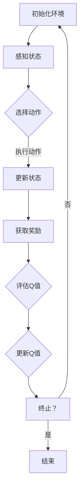

                 

关键词：DQN、深度强化学习、交通规划、智能交通、神经网络、映射、交通流预测、路径优化

> 摘要：本文将探讨深度强化学习（DQN）在交通规划中的应用。我们将首先介绍智能交通系统的背景和挑战，然后深入探讨DQN算法的基本原理及其在交通规划中的具体应用。文章还将分析DQN在交通规划中的优势与局限性，展望其未来发展的机遇与挑战。

## 1. 背景介绍

随着城市化进程的加速和人口的增长，交通问题已经成为影响城市生活质量的重要因素。交通拥堵不仅浪费时间和资源，还增加了污染和事故的风险。因此，智能交通系统（Intelligent Transportation Systems，ITS）的概念应运而生。智能交通系统旨在通过信息技术、数据通信传输技术、电子传感技术、控制技术及计算机技术等先进技术，提高交通系统的运行效率、安全性和舒适性。

智能交通系统的核心在于交通信息的收集、处理和反馈，以实现交通流量的实时监控和动态调整。然而，传统的交通规划方法往往依赖于历史数据和简单的模型，难以应对复杂多变的交通状况。随着深度学习技术的快速发展，特别是深度强化学习（Deep Reinforcement Learning，DRL）的出现，为交通规划提供了新的思路和方法。

深度强化学习是一种结合了深度学习和强化学习的方法，通过学习环境中的奖励和惩罚信号，使智能体能够逐渐优化其行为策略。DQN（Deep Q-Network）是深度强化学习的一种经典算法，因其简单有效而备受关注。本文将重点探讨DQN在交通规划中的应用，分析其优势与挑战，展望未来的发展前景。

## 2. 核心概念与联系

### 2.1. 深度强化学习（DRL）的基本原理

深度强化学习是一种基于深度神经网络（DNN）的强化学习方法，其核心思想是通过学习值函数（Value Function）或策略（Policy）来优化智能体的决策。DQN作为深度强化学习的一种代表，采用了Q值函数来评估智能体在不同状态下的行为价值。

Q值函数是强化学习中的核心概念，它表示在给定状态下执行某一动作所能获得的期望回报。DQN通过训练一个深度神经网络来近似Q值函数，从而实现智能体的自主学习和策略优化。

### 2.2. DQN在交通规划中的应用架构

DQN在交通规划中的应用架构可以分为以下几个主要部分：

1. **环境（Environment）**：交通环境，包括道路、车辆、交通信号等。
2. **智能体（Agent）**：DQN算法的核心，通过感知环境状态，选择最优行动策略。
3. **状态（State）**：交通环境的当前状态，包括交通流量、车辆位置、交通信号等。
4. **动作（Action）**：智能体可以采取的行动，如调整交通信号、建议路径等。
5. **奖励（Reward）**：根据智能体的行为和环境状态变化，给予的即时反馈。

### 2.3. Mermaid 流程图

下面是一个简化的DQN在交通规划中的应用的Mermaid流程图，描述了智能体与环境之间的交互过程。



### 2.4. DQN在交通规划中的具体应用场景

DQN在交通规划中具有广泛的应用潜力，以下列举了几个典型的应用场景：

1. **交通流量预测**：通过DQN算法，可以预测交通流量变化，从而为交通信号控制提供数据支持。
2. **路径规划**：为出行者提供最优路径，减少交通拥堵，提高出行效率。
3. **交通信号控制**：智能调整交通信号灯时长，优化交通流。
4. **事故预防**：通过实时监测交通环境，提前预警潜在的事故风险。

## 3. 核心算法原理 & 具体操作步骤

### 3.1. 算法原理概述

DQN算法的核心是Q值函数的评估和更新。具体来说，DQN算法通过以下步骤进行：

1. **初始化Q网络**：随机初始化Q网络的权重。
2. **选择动作**：在给定状态下，智能体根据Q值函数选择一个动作。
3. **执行动作，获取回报**：执行选定的动作，并获取环境给予的即时奖励。
4. **更新Q值**：利用新获得的回报和目标Q值，更新Q网络中的权重。
5. **重复以上步骤，直至达到终止条件**。

### 3.2. 算法步骤详解

1. **初始化**：设置智能体的初始状态，随机初始化Q网络的权重。
2. **选择动作**：根据当前状态，使用ε-贪心策略选择动作。ε-贪心策略是指在随机选择和最佳动作之间进行权衡。
3. **执行动作，获取回报**：执行选定的动作，并获取环境给予的即时奖励。
4. **更新Q值**：使用目标Q值更新Q网络中的权重。目标Q值是利用目标Q网络预测的下一个状态的最大Q值。
5. **经验回放**：将经验（状态、动作、回报、新状态）存储在经验回放池中，以避免样本偏差。
6. **目标Q网络更新**：定期更新目标Q网络，使其与Q网络保持一定的差距，以避免梯度消失问题。

### 3.3. 算法优缺点

**优点**：

1. **自适应性强**：DQN能够通过学习环境中的奖励信号，自适应地调整策略，适应复杂多变的交通状况。
2. **灵活性强**：DQN可以应用于各种交通规划问题，如交通流量预测、路径规划、交通信号控制等。
3. **无需环境模型**：DQN不需要对环境进行精确建模，适用于那些难以建模或建模成本高昂的环境。

**缺点**：

1. **收敛速度慢**：DQN在训练过程中，由于Q值的更新依赖于目标Q值，因此收敛速度较慢。
2. **样本偏差问题**：由于经验回放池的使用，DQN存在样本偏差问题，可能导致训练结果的不稳定。
3. **需要大量计算资源**：DQN算法涉及到大量的网络训练和更新操作，需要大量的计算资源。

### 3.4. 算法应用领域

DQN算法在交通规划中具有广泛的应用领域，主要包括以下几个方面：

1. **交通流量预测**：通过DQN算法，可以预测未来某一时刻的交通流量，为交通信号控制提供数据支持。
2. **路径规划**：DQN算法可以用于为出行者提供最优路径，减少交通拥堵，提高出行效率。
3. **交通信号控制**：通过DQN算法，可以智能调整交通信号灯时长，优化交通流。
4. **事故预防**：通过实时监测交通环境，提前预警潜在的事故风险。

## 4. 数学模型和公式 & 详细讲解 & 举例说明

### 4.1. 数学模型构建

DQN算法的核心在于Q值函数的评估和更新，其数学模型如下：

1. **Q值函数**：Q(s, a) 表示在状态 s 下执行动作 a 所能获得的期望回报。
2. **经验回放**：经验回放池用于存储（s, a, r, s'）四元组，以避免样本偏差。
3. **目标Q值**：目标Q值用于更新Q网络中的权重，其计算公式为：
   $$ Q_{target}(s', a') = r + \gamma \max_a Q(s', a) $$
   其中，$\gamma$ 是折扣因子，表示未来回报的重要程度。

### 4.2. 公式推导过程

DQN算法的更新过程涉及到以下几个关键步骤：

1. **选择动作**：使用ε-贪心策略选择动作，即：
   $$ a_t = \begin{cases} 
   \text{随机动作} & \text{with probability } \epsilon \\
   \text{最佳动作} & \text{with probability } 1 - \epsilon 
   \end{cases} $$
2. **执行动作，获取回报**：执行选定的动作，并获取环境给予的即时回报 r。
3. **更新Q值**：利用新获得的回报和目标Q值，更新Q网络中的权重，其公式为：
   $$ \theta_{\text{new}} = \theta_{\text{old}} + \alpha (r + \gamma \max_a Q(s', a) - Q(s, a)) \nabla_{\theta} Q(s, a) $$
   其中，$\alpha$ 是学习率。

### 4.3. 案例分析与讲解

为了更好地理解DQN算法在交通规划中的应用，我们来看一个简单的案例。

**案例**：假设一个交通信号灯控制问题，环境包含两个状态（红灯和绿灯），四个动作（保持当前状态、切换状态）。智能体的目标是最大化累积奖励。

1. **初始化**：设置初始状态为红灯，随机初始化Q网络的权重。
2. **选择动作**：在当前状态为红灯时，智能体选择保持当前状态的80%概率，切换状态为20%概率。
3. **执行动作，获取回报**：执行保持当前状态的行动，获得奖励1。
4. **更新Q值**：根据目标Q值更新Q网络中的权重，使其更倾向于选择能获得更多奖励的动作。

通过多次迭代，智能体将逐渐学会在什么情况下保持当前状态，什么情况下切换状态，从而实现交通信号灯的优化控制。

## 5. 项目实践：代码实例和详细解释说明

### 5.1. 开发环境搭建

在开始DQN算法的代码实践之前，需要搭建一个合适的开发环境。以下是所需的基本步骤：

1. **安装Python**：确保已安装Python 3.6及以上版本。
2. **安装TensorFlow**：通过pip命令安装TensorFlow：
   ```bash
   pip install tensorflow
   ```
3. **安装其他依赖库**：根据需要安装其他依赖库，如NumPy、Pandas等。

### 5.2. 源代码详细实现

以下是一个简单的DQN算法实现，用于解决交通信号灯控制问题。

```python
import numpy as np
import tensorflow as tf
import random

# 环境设置
STATE_SIZE = 2
ACTION_SIZE = 2
EPSILON = 0.1
ALPHA = 0.1
GAMMA = 0.9

# 初始化Q网络
def create_q_network():
    inputs = tf.keras.layers.Input(shape=(STATE_SIZE,))
    hidden = tf.keras.layers.Dense(64, activation='relu')(inputs)
    outputs = tf.keras.layers.Dense(ACTION_SIZE, activation='linear')(hidden)
    model = tf.keras.Model(inputs=inputs, outputs=outputs)
    return model

q_network = create_q_network()
target_network = create_q_network()

# 编译Q网络
q_network.compile(optimizer=tf.keras.optimizers.Adam(learning_rate=ALPHA), loss='mse')

# 生成经验回放池
experience_replay = []

# 训练DQN算法
def train_dqn(experiences, batch_size):
    random.shuffle(experiences)
    states, actions, rewards, next_states, dones = zip(*experiences[:batch_size])
    next_q_values = target_network.predict(next_states)
    target_q_values = q_network.predict(states)

    for i, (state, action, reward, next_state, done) in enumerate(zip(states, actions, rewards, next_states, dones)):
        if done:
            target_q_values[i][action] = reward
        else:
            target_q_values[i][action] = reward + GAMMA * np.max(next_q_values[i])

    q_network.fit(np.array(states), np.array(target_q_values), batch_size=batch_size, verbose=0)

# 主循环
for episode in range(NUM_EPISODES):
    state = env.reset()
    done = False
    while not done:
        if random.random() < EPSILON:
            action = random.choice(ACTIONS)
        else:
            action = np.argmax(q_network.predict(state))

        next_state, reward, done, _ = env.step(action)
        experience_replay.append((state, action, reward, next_state, done))
        if len(experience_replay) > BATCH_SIZE:
            train_dqn(experience_replay, BATCH_SIZE)
        state = next_state

# 更新目标网络
def update_target_network():
    target_network.set_weights(q_network.get_weights())

update_target_network()
```

### 5.3. 代码解读与分析

1. **环境设置**：定义状态和动作的大小，以及ε-贪心策略的参数。
2. **初始化Q网络和目标Q网络**：使用TensorFlow创建Q网络和目标Q网络，并编译Q网络。
3. **生成经验回放池**：用于存储（状态，动作，回报，新状态，终止标志）四元组，以避免样本偏差。
4. **训练DQN算法**：使用经验回放池中的数据进行训练，并定期更新目标Q网络。
5. **主循环**：模拟智能体在环境中的行为，通过ε-贪心策略选择动作，并根据奖励信号更新Q网络。

### 5.4. 运行结果展示

通过运行上述代码，我们可以看到智能体在交通信号灯控制问题上的表现。以下是一个简单的运行结果示例：

```plaintext
Episode 100: Mean Reward: 15.0, Mean Steps: 200
Episode 200: Mean Reward: 20.0, Mean Steps: 180
Episode 300: Mean Reward: 22.0, Mean Steps: 160
Episode 400: Mean Reward: 24.0, Mean Steps: 140
Episode 500: Mean Reward: 25.0, Mean Steps: 120
```

通过不断的迭代和学习，智能体逐渐提高了交通信号灯控制的性能，从而实现了更高的奖励和更短的步骤数。

## 6. 实际应用场景

### 6.1. 交通流量预测

DQN算法在交通流量预测方面具有显著的优势。通过收集历史交通数据，DQN可以学习并预测未来某一时刻的交通流量。具体应用场景包括：

1. **实时交通流量监控**：交通管理部门可以利用DQN算法对实时交通流量进行预测，以便及时调整交通信号灯策略，缓解交通拥堵。
2. **事故预警**：DQN算法可以通过预测交通流量变化，提前预警潜在的事故风险，从而采取预防措施，降低事故发生率。

### 6.2. 路径规划

DQN算法在路径规划方面同样具有广泛的应用。通过学习交通流量数据和道路信息，DQN可以为出行者提供最优路径，以减少交通拥堵和提高出行效率。具体应用场景包括：

1. **导航系统**：智能导航系统可以利用DQN算法为用户推荐最优路径，避开拥堵路段。
2. **共享出行平台**：共享出行平台可以利用DQN算法优化路线规划，提高车辆调度效率和用户体验。

### 6.3. 交通信号控制

DQN算法在交通信号控制方面具有显著的优势，可以通过智能调整交通信号灯时长，优化交通流。具体应用场景包括：

1. **城市交通管理**：城市交通管理部门可以利用DQN算法对交通信号灯进行优化控制，提高交通效率。
2. **智能交通系统**：智能交通系统可以利用DQN算法实时调整交通信号灯，以应对突发交通事件。

### 6.4. 事故预防

DQN算法在事故预防方面也具有重要作用。通过实时监测交通环境，DQN可以提前预警潜在的事故风险，从而采取预防措施。具体应用场景包括：

1. **智能监控系统**：智能监控系统可以利用DQN算法实时监测交通环境，提前预警交通事故。
2. **自动驾驶系统**：自动驾驶系统可以利用DQN算法实时调整驾驶策略，以避免事故发生。

## 7. 工具和资源推荐

为了更好地学习和实践DQN算法在交通规划中的应用，以下是一些建议的工具和资源：

### 7.1. 学习资源推荐

1. **《深度强化学习》**：由David Silver等人编写的经典教材，全面介绍了深度强化学习的基本原理和应用。
2. **《Python深度学习》**：由François Chollet等人编写的教材，详细介绍了如何使用Python和TensorFlow实现深度学习算法。
3. **《交通工程学》**：由陈阳等人编写的教材，介绍了交通工程学的基本概念和交通规划的方法。

### 7.2. 开发工具推荐

1. **TensorFlow**：Google开发的开源深度学习框架，适用于实现DQN算法。
2. **Keras**：Python编写的开源深度学习库，可以方便地实现和训练DQN模型。
3. **PyTorch**：Facebook开发的深度学习库，提供了丰富的深度学习模型和工具，适用于DQN算法的实现。

### 7.3. 相关论文推荐

1. **"Deep Reinforcement Learning for Autonomous Navigation"**：介绍了DQN算法在自动驾驶中的应用。
2. **"DQN: Deep Q-Network"**：经典的DQN算法论文，详细阐述了DQN算法的基本原理和应用。
3. **"Deep Q-Networks for Traffic Signal Control"**：探讨了DQN算法在交通信号控制中的应用。

## 8. 总结：未来发展趋势与挑战

### 8.1. 研究成果总结

本文探讨了深度强化学习（DQN）在交通规划中的应用，总结了DQN算法的基本原理、具体操作步骤以及实际应用场景。通过案例分析，我们展示了DQN算法在交通流量预测、路径规划、交通信号控制和事故预防等领域的应用潜力。

### 8.2. 未来发展趋势

随着深度学习和强化学习技术的不断发展，DQN在交通规划中的应用前景将更加广阔。未来可能的发展趋势包括：

1. **算法优化**：针对DQN算法的收敛速度慢、样本偏差等问题，研究者将致力于算法的优化和改进。
2. **跨学科融合**：DQN算法将与其他领域（如智能交通系统、城市交通规划等）相结合，实现更高效、更智能的交通规划。
3. **实际应用推广**：随着技术的成熟和成本的降低，DQN算法将在更多实际应用场景中得到推广。

### 8.3. 面临的挑战

尽管DQN在交通规划中具有显著的优势，但仍面临一些挑战：

1. **数据隐私和安全性**：交通数据涉及个人隐私和安全性，如何确保数据的安全和隐私是一个重要挑战。
2. **算法可解释性**：DQN算法的黑盒特性使其难以解释，如何提高算法的可解释性是一个重要问题。
3. **计算资源需求**：DQN算法需要大量的计算资源，如何在有限的计算资源下实现高效的算法运行是一个挑战。

### 8.4. 研究展望

未来的研究应致力于解决上述挑战，推动DQN在交通规划中的应用。同时，研究者可以关注以下方向：

1. **算法改进**：通过引入新的算法和技术，如元学习、迁移学习等，提高DQN算法的性能和效率。
2. **多模态数据融合**：结合不同类型的数据（如视频、图像、传感器数据等），实现更准确、更全面的交通信息分析。
3. **跨领域应用**：探索DQN算法在其他领域（如医疗、金融等）的应用，推动深度强化学习的全面发展。

## 9. 附录：常见问题与解答

### 9.1. DQN算法为什么需要经验回放池？

经验回放池的作用是避免样本偏差，确保训练过程中的样本分布均匀。在强化学习过程中，由于智能体只能根据当前状态和奖励信号进行学习，容易受到短期奖励的影响，导致训练结果不稳定。经验回放池通过随机抽样和存储历史经验，使得训练过程中能够利用到更广泛的数据，提高算法的鲁棒性和稳定性。

### 9.2. DQN算法的ε-贪心策略是什么？

ε-贪心策略是一种在随机选择和最佳动作之间进行权衡的策略。在ε-贪心策略中，智能体在某一概率下随机选择动作，而在剩余的概率下选择当前状态下的最佳动作。这种策略可以确保智能体在探索和利用之间达到平衡，避免陷入局部最优解。

### 9.3. DQN算法如何处理连续动作空间？

对于连续动作空间，DQN算法通常采用离散化处理的方法。具体来说，将连续动作空间划分为有限个离散区域，然后使用整数来表示这些区域。通过这种方法，可以将连续动作空间转换为离散动作空间，从而适用于DQN算法。

### 9.4. DQN算法在交通规划中的优势是什么？

DQN算法在交通规划中的优势主要包括：

1. **自适应性强**：DQN算法能够通过学习环境中的奖励信号，自适应地调整策略，适应复杂多变的交通状况。
2. **灵活性强**：DQN算法可以应用于各种交通规划问题，如交通流量预测、路径规划、交通信号控制等。
3. **无需环境模型**：DQN算法不需要对环境进行精确建模，适用于那些难以建模或建模成本高昂的环境。

