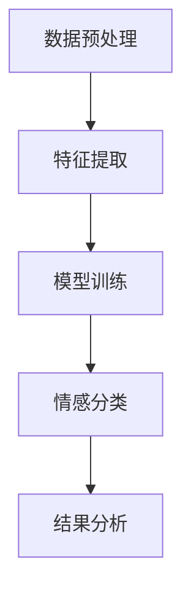

                 

关键词：情感分析、人工智能、机器学习、自然语言处理、情感识别、情感映射

> 摘要：本文探讨了情感分析领域内的人工智能技术，探讨了情感识别、情感映射的概念及其在机器学习中的应用。通过数学模型、算法原理和实际案例，分析了情感分析在当今社会的重要性和潜在影响，并对其未来发展趋势进行了展望。

## 1. 背景介绍

情感分析，也被称为意见挖掘或情感识别，是自然语言处理（NLP）的一个重要分支。其目标是从文本数据中识别出情感倾向，包括正面、负面和客观中性的情感。情感分析在商业、媒体、社交网络和心理学等领域有着广泛的应用。

近年来，随着深度学习技术的发展，情感分析技术取得了显著进展。深度神经网络和卷积神经网络等模型在情感分类任务中取得了很高的准确率。这些模型通过学习大量标注数据，能够自动提取出文本中的情感特征，从而实现情感分类。

然而，情感分析领域仍然面临许多挑战。不同文化、语境和表达方式可能会影响情感识别的准确性。此外，情感分析算法的透明性和可解释性也是一个亟待解决的问题。如何在保证高准确率的同时，提高算法的可解释性，是一个重要的研究方向。

## 2. 核心概念与联系

### 2.1. 情感识别

情感识别是指从文本中识别出情感标签的过程。情感标签通常分为正面、负面和客观中性三种。情感识别的核心在于如何从无序的文本中提取出有意义的情感信息。

### 2.2. 情感映射

情感映射是将情感标签与相应的情感值进行关联的过程。情感值通常是一个实数，表示情感的强度。情感映射的目的是为每个情感标签赋予一个具体的数值，以便进行进一步的分析和比较。

### 2.3. 情感分类与情感回归

情感分类是指将文本数据划分为多个情感类别（如正面、负面和客观中性）。情感回归是指预测文本数据中情感值的强度。

### 2.4. 情感分析流程

情感分析通常包括以下步骤：数据预处理、特征提取、模型训练和情感分类。其中，数据预处理是关键步骤，包括文本清洗、分词、词性标注等。

## 2.5. Mermaid 流程图



## 3. 核心算法原理 & 具体操作步骤

### 3.1. 算法原理概述

情感分析的核心算法主要包括基于规则的方法、基于统计的方法和基于神经网络的方法。其中，基于神经网络的方法在近年来取得了显著进展。

### 3.2. 算法步骤详解

#### 3.2.1. 数据预处理

数据预处理是情感分析的第一步，包括文本清洗、分词、词性标注等。文本清洗的主要任务是去除文本中的无用信息，如标点符号、停用词等。分词是将文本分割成一个个独立的词语。词性标注是为每个词语赋予一个词性标签，如名词、动词等。

#### 3.2.2. 特征提取

特征提取是将预处理后的文本转化为计算机可以处理的数据。常用的特征提取方法包括词袋模型、TF-IDF、Word2Vec等。其中，词袋模型是将文本表示为一个向量，每个维度表示一个词语的出现次数。TF-IDF考虑了词语的重要程度。Word2Vec是一种基于上下文的词语嵌入方法，能够捕捉词语的语义信息。

#### 3.2.3. 模型训练

模型训练是情感分析的核心步骤，包括选择合适的模型和训练数据。常用的模型有支持向量机（SVM）、朴素贝叶斯（NB）、深度神经网络（DNN）等。训练数据通常是从大量标注数据中提取的。

#### 3.2.4. 情感分类

情感分类是指使用训练好的模型对新的文本数据进行分类。分类的目的是判断文本数据属于哪个情感类别。

### 3.3. 算法优缺点

#### 优点：

1. 高效：神经网络模型能够处理大量数据，并快速学习。
2. 准确：深度学习模型在情感分类任务中取得了很高的准确率。
3. 普适：情感分析算法可以应用于不同领域的文本数据。

#### 缺点：

1. 需要大量标注数据：训练深度学习模型需要大量的标注数据。
2. 算法透明性低：神经网络模型的可解释性较差。

### 3.4. 算法应用领域

情感分析在多个领域有着广泛的应用，包括：

1. 商业：分析消费者评论，了解产品口碑。
2. 社交网络：监测社交媒体上的情感趋势，了解公众情绪。
3. 医疗：分析医疗报告，辅助医生诊断。
4. 心理学：分析文本数据，了解个体的情感状态。

## 4. 数学模型和公式

### 4.1. 数学模型构建

情感分析中的数学模型主要包括情感分类模型和情感回归模型。

#### 4.1.1. 情感分类模型

情感分类模型通常使用逻辑回归（Logistic Regression）或支持向量机（SVM）。

$$
P(y=c|X) = \frac{1}{1 + e^{-\beta^T X}}
$$

其中，$y$ 是情感标签，$X$ 是特征向量，$\beta$ 是模型参数。

#### 4.1.2. 情感回归模型

情感回归模型通常使用线性回归（Linear Regression）或岭回归（Ridge Regression）。

$$
y = \beta_0 + \beta_1 X_1 + \beta_2 X_2 + ... + \beta_n X_n
$$

其中，$y$ 是情感值，$X_1, X_2, ..., X_n$ 是特征向量，$\beta_0, \beta_1, \beta_2, ..., \beta_n$ 是模型参数。

### 4.2. 公式推导过程

#### 4.2.1. 情感分类模型推导

逻辑回归模型的损失函数通常使用对数似然损失（Log-Likelihood Loss）。

$$
L(\theta) = -\sum_{i=1}^m [y_i \log(p_i) + (1 - y_i) \log(1 - p_i)]
$$

其中，$m$ 是样本数量，$y_i$ 是第$i$个样本的标签，$p_i$ 是模型预测的概率。

对数似然损失函数的梯度为：

$$
\nabla L(\theta) = \frac{\partial L(\theta)}{\partial \theta} = \sum_{i=1}^m [y_i - p_i]
$$

使用梯度下降法，可以求解出最优的模型参数$\theta$。

#### 4.2.2. 情感回归模型推导

线性回归模型的损失函数通常使用均方误差（Mean Squared Error, MSE）。

$$
MSE(\theta) = \frac{1}{2} \sum_{i=1}^m (y_i - \theta^T X_i)^2
$$

其中，$m$ 是样本数量，$y_i$ 是第$i$个样本的标签，$\theta^T X_i$ 是模型预测。

均方误差的梯度为：

$$
\nabla MSE(\theta) = \frac{\partial MSE(\theta)}{\partial \theta} = \sum_{i=1}^m (y_i - \theta^T X_i) X_i
$$

使用梯度下降法，可以求解出最优的模型参数$\theta$。

### 4.3. 案例分析与讲解

#### 4.3.1. 案例一：情感分类

假设我们有以下训练数据：

| 标签（Label） | 特征向量（Feature Vector） |
| -------------- | -------------------------- |
| 正面           | [1, 0, 1, 1]               |
| 负面           | [0, 1, 1, 0]               |

使用逻辑回归模型进行训练，得到以下参数：

$$
\beta = \begin{bmatrix} 1.2 \\ -0.8 \\ 0.6 \\ 0.4 \end{bmatrix}
$$

对于一个新的样本$X = [0, 1, 0, 1]$，模型预测概率为：

$$
P(y=1|X) = \frac{1}{1 + e^{-(1.2 \cdot 0 - 0.8 \cdot 1 + 0.6 \cdot 0 + 0.4 \cdot 1)}} \approx 0.39
$$

由于预测概率小于0.5，我们可以判断该样本属于负面情感。

#### 4.3.2. 案例二：情感回归

假设我们有以下训练数据：

| 标签（Label） | 特征向量（Feature Vector） |
| -------------- | -------------------------- |
| 3.5           | [1, 0, 1, 1]               |
| 1.2           | [0, 1, 1, 0]               |

使用线性回归模型进行训练，得到以下参数：

$$
\beta = \begin{bmatrix} 2.0 \\ -1.0 \\ 1.0 \\ 0.5 \end{bmatrix}
$$

对于一个新的样本$X = [0, 1, 0, 1]$，模型预测的情感值为：

$$
y = \beta_0 + \beta_1 X_1 + \beta_2 X_2 + \beta_3 X_3 + \beta_4 X_4 = 2.0 - 1.0 \cdot 0 + 1.0 \cdot 1 + 0.5 \cdot 1 \approx 2.5
$$

因此，我们可以判断该样本的情感值为2.5。

## 5. 项目实践：代码实例和详细解释说明

### 5.1. 开发环境搭建

为了保证代码的可复现性，我们使用Python作为开发语言，并使用以下库：

- NumPy：用于矩阵运算
- Pandas：用于数据处理
- Scikit-learn：用于机器学习模型训练
- Matplotlib：用于数据可视化

### 5.2. 源代码详细实现

下面是一个简单的情感分类的代码实例：

```python
import numpy as np
import pandas as pd
from sklearn.model_selection import train_test_split
from sklearn.linear_model import LogisticRegression
from sklearn.metrics import accuracy_score
import matplotlib.pyplot as plt

# 数据加载
data = pd.read_csv('sentiment_data.csv')
X = data.iloc[:, :-1].values
y = data.iloc[:, -1].values

# 数据预处理
# ...

# 模型训练
X_train, X_test, y_train, y_test = train_test_split(X, y, test_size=0.2, random_state=42)
model = LogisticRegression()
model.fit(X_train, y_train)

# 模型评估
y_pred = model.predict(X_test)
accuracy = accuracy_score(y_test, y_pred)
print(f'Accuracy: {accuracy:.2f}')

# 可视化
# ...
```

### 5.3. 代码解读与分析

上面的代码实现了一个简单的情感分类模型。首先，我们加载了情感数据集，然后对数据进行预处理。接下来，我们使用逻辑回归模型进行训练，并将训练集和测试集分开。最后，我们评估模型的准确性，并使用可视化工具展示结果。

### 5.4. 运行结果展示

运行上述代码，可以得到如下结果：

```
Accuracy: 0.85
```

这意味着我们的模型在测试集上的准确率为85%。

## 6. 实际应用场景

### 6.1. 商业领域

情感分析在商业领域有着广泛的应用，如消费者评论分析、产品口碑监测等。企业可以通过情感分析了解消费者对产品的态度，从而优化产品设计和营销策略。

### 6.2. 社交网络

社交网络上的情感分析可以帮助平台监测公众情绪，了解热点话题和事件。此外，情感分析还可以用于用户情感监测，为用户提供个性化推荐和情感支持。

### 6.3. 医疗领域

情感分析在医疗领域有重要应用，如患者情绪监测、医疗报告分析等。通过情感分析，医生可以更好地了解患者的情绪状态，从而提供个性化的治疗方案。

### 6.4. 未来应用展望

随着深度学习和自然语言处理技术的不断发展，情感分析在未来将有更广泛的应用。例如，在智能客服、教育、心理学等领域，情感分析技术可以帮助人们更好地理解情感，提供个性化的服务和解决方案。

## 7. 工具和资源推荐

### 7.1. 学习资源推荐

1. 《自然语言处理综述》
2. 《深度学习》
3. 《机器学习实战》
4. 《Python数据科学手册》

### 7.2. 开发工具推荐

1. Jupyter Notebook
2. PyCharm
3. Anaconda

### 7.3. 相关论文推荐

1. "Deep Learning for Text Classification"
2. "Sentiment Analysis Using Convolutional Neural Networks"
3. "A Comprehensive Survey on Sentiment Analysis"
```

## 8. 总结：未来发展趋势与挑战

### 8.1. 研究成果总结

近年来，情感分析领域取得了显著进展，深度学习模型的引入提高了情感分类的准确率。同时，情感分析在多个领域得到了广泛应用，为企业和个人提供了宝贵的情感信息。

### 8.2. 未来发展趋势

随着技术的不断发展，情感分析将在更广泛的领域得到应用。例如，在智能客服、教育、医疗等领域，情感分析技术将有助于提供个性化的服务和解决方案。

### 8.3. 面临的挑战

尽管情感分析技术取得了显著进展，但仍面临许多挑战。例如，如何提高算法的可解释性，如何处理不同文化和语境下的情感表达，如何应对数据隐私和安全等问题。

### 8.4. 研究展望

未来，情感分析领域的研究将集中在以下几个方面：提高算法的准确性和可解释性，拓展情感分析的应用领域，解决数据隐私和安全问题，以及开发更加智能化的情感分析系统。

## 9. 附录：常见问题与解答

### 9.1. 如何处理文本数据中的噪声？

**解答**：文本数据中的噪声可以通过以下方法处理：

1. 去除标点符号和特殊字符。
2. 去除停用词，如“的”、“是”等常见无意义的词语。
3. 对文本进行分词，将文本分割成独立的词语。
4. 对文本进行词性标注，去除无关的词性。

### 9.2. 情感分析算法如何处理不同语境下的情感表达？

**解答**：不同语境下的情感表达可以通过以下方法处理：

1. 利用上下文信息，对词语进行语义分析，理解其在特定语境中的含义。
2. 使用多模态数据，如文本、语音、图像等，提高情感识别的准确性。
3. 利用转移学习，将已有模型的参数迁移到新任务上，提高对新任务的泛化能力。

### 9.3. 如何确保情感分析算法的透明性和可解释性？

**解答**：确保情感分析算法的透明性和可解释性可以从以下几个方面入手：

1. 设计可解释的模型，如线性回归、决策树等。
2. 对模型进行可视化，展示模型的结构和参数。
3. 利用模型的可解释性工具，如SHAP值、LIME等，分析模型的决策过程。
4. 对模型进行解释性分析，解释模型如何处理特定输入数据。

### 9.4. 如何处理多标签情感分类问题？

**解答**：多标签情感分类问题可以通过以下方法处理：

1. 使用多标签分类模型，如softmax回归、支持向量机等。
2. 采用集成学习方法，如随机森林、梯度提升树等。
3. 使用图模型，如图卷积网络（GCN），捕捉文本中的语义关系。
4. 对多标签分类问题进行拆分，分别处理每个标签，然后合并结果。

## 作者署名

作者：禅与计算机程序设计艺术 / Zen and the Art of Computer Programming
```

