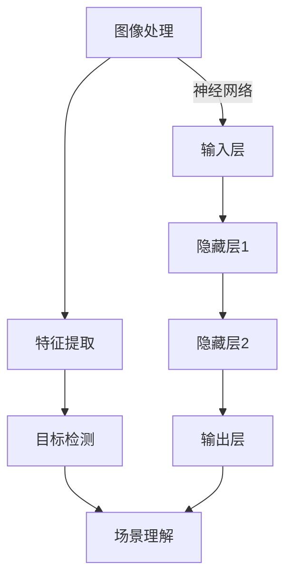
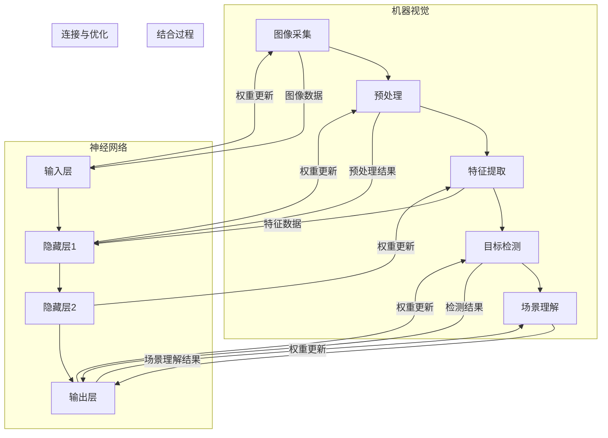

                 

### 1. 背景介绍

机器视觉（Machine Vision）和神经网络（Neural Networks）是当今人工智能领域最为引人注目的技术之一。随着计算机硬件性能的不断提升和大数据时代的到来，这两大技术逐渐走向融合，推动了人工智能技术的快速发展。

机器视觉是一种使计算机具备类似人类视觉感知能力的技术。它通过对图像和视频数据的处理，实现对周围环境的感知、理解和决策。机器视觉的应用范围广泛，包括但不限于工业检测、医疗诊断、自动驾驶、安防监控等领域。

神经网络则是一种模仿人脑结构和功能的计算模型，通过大量神经元之间的连接来学习和处理数据。神经网络在图像识别、语音识别、自然语言处理等领域展现了强大的能力，尤其是在深度学习的推动下，神经网络取得了惊人的成果。

本文将探讨机器视觉与神经网络的结合应用，通过分析其核心概念、算法原理、数学模型和实际应用场景，旨在为读者提供对这一前沿技术的全面了解。

## 1.1 机器视觉的发展历程

机器视觉的发展可以追溯到20世纪50年代，当时计算机科学家们开始探索如何让计算机处理图像和视频数据。最初的机器视觉技术主要是基于规则的方法，即通过编写大量规则来识别图像中的特定特征。然而，这种方法在面对复杂、多变的场景时，效果不佳。

随着计算机性能的提升和图像处理算法的进步，20世纪80年代，机器视觉开始引入了一些基于统计模型的方法，如模板匹配、特征提取等。这些方法在特定场景下取得了较好的效果，但仍然存在一些局限性。

21世纪初，随着深度学习的兴起，神经网络在图像识别领域取得了突破性进展。深度学习模型能够自动提取图像中的复杂特征，使得机器视觉的应用范围得到了极大拓展。

## 1.2 神经网络的发展历程

神经网络的研究始于20世纪40年代，当时心理学家和数学家开始尝试模拟人脑的工作原理。最初的神经网络模型非常简单，只能处理简单的任务。然而，随着计算能力的提升和算法的优化，神经网络逐渐走向复杂，能够处理更复杂的任务。

1986年，Rumelhart、Hinton和Williams提出了反向传播算法（Backpropagation Algorithm），这是神经网络发展史上的一个重要里程碑。反向传播算法使得神经网络能够高效地学习复杂的函数，从而在图像识别、语音识别等领域取得了显著的成果。

然而，神经网络的发展并非一帆风顺。在1990年代中期，由于计算资源和数据集的限制，神经网络的研究陷入了低潮。直到2006年，Hinton等人提出了深度学习（Deep Learning）的概念，重新点燃了神经网络的研究热潮。

深度学习模型通过增加网络的深度，使得神经网络能够自动提取更复杂的特征。在图像识别、自然语言处理等领域，深度学习模型取得了显著的成果，甚至超过了人类的表现。

## 1.3 机器视觉与神经网络的结合

机器视觉和神经网络的结合是人工智能领域的一个重要方向。通过将神经网络引入机器视觉，可以实现更高效、更准确的目标检测、图像识别和场景理解。

首先，神经网络能够自动提取图像中的复杂特征，使得机器视觉系统在处理复杂场景时更加灵活。例如，在自动驾驶领域，神经网络可以帮助车辆识别道路上的行人、车辆和交通标志，从而做出准确的决策。

其次，神经网络可以显著提高机器视觉系统的鲁棒性。在光照变化、视角变化等复杂环境下，传统的机器视觉方法可能失效，而神经网络通过学习大量的样本数据，能够适应这些变化，提高系统的鲁棒性。

此外，神经网络还可以实现实时处理。随着硬件性能的提升，神经网络已经可以在实时场景下处理大量的图像数据，使得机器视觉系统更加高效。

总的来说，机器视觉与神经网络的结合为人工智能的发展带来了新的机遇。通过本文的探讨，我们将深入了解这一前沿技术的核心概念、算法原理、数学模型和实际应用场景。

## 1.4 文章结构

本文将按照以下结构进行撰写：

1. 背景介绍：回顾机器视觉和神经网络的发展历程，介绍两者的结合背景。
2. 核心概念与联系：详细解释机器视觉和神经网络的核心概念，并绘制Mermaid流程图展示两者之间的联系。
3. 核心算法原理 & 具体操作步骤：介绍机器视觉与神经网络结合的核心算法原理，并详细说明算法的操作步骤。
4. 数学模型和公式 & 详细讲解 & 举例说明：讲解与机器视觉与神经网络结合相关的数学模型和公式，并通过实际案例进行说明。
5. 项目实践：提供具体的代码实例和详细解释，展示机器视觉与神经网络结合的应用实践。
6. 实际应用场景：分析机器视觉与神经网络在不同领域的应用场景，探讨其潜在价值。
7. 工具和资源推荐：推荐学习资源和开发工具，帮助读者深入了解这一领域。
8. 总结：总结研究成果，展望未来发展趋势与挑战。

通过以上结构的阐述，本文将带领读者全面了解机器视觉与神经网络的结合应用，为人工智能的发展提供新的思路。

### 2. 核心概念与联系

在探讨机器视觉与神经网络的结合应用之前，我们首先需要了解两者的核心概念及其联系。

#### 2.1 机器视觉的核心概念

机器视觉的核心概念包括图像处理、特征提取、目标检测和场景理解等。

**图像处理**是指对图像进行预处理、增强、变换等操作，以提高图像的质量和清晰度。常见的图像处理算法包括滤波、边缘检测、直方图均衡等。

**特征提取**是指从图像中提取具有区分性的特征，如边缘、角点、纹理等。特征提取是机器视觉的关键步骤，它决定了后续处理的准确性和效率。

**目标检测**是指在图像中识别并定位特定的目标。目标检测算法需要处理复杂的背景和遮挡问题，常见的算法包括滑动窗口、区域提议、深度学习等。

**场景理解**是指对图像内容进行高层次的理解和解释，如语义分割、对象识别、场景分类等。场景理解需要结合多个特征和上下文信息，实现更高级的图像理解。

#### 2.2 神经网络的核心概念

神经网络的核心概念包括神经元、网络结构、学习算法和优化方法。

**神经元**是神经网络的基本计算单元，它接收多个输入，通过权重和偏置进行加权求和，并使用激活函数产生输出。

**网络结构**包括前向传播、反向传播和多层结构等。神经网络通过多层结构实现从简单特征到复杂特征的自动提取。

**学习算法**是指神经网络如何从数据中学习，常见的算法包括梯度下降、随机梯度下降、Adam优化等。

**优化方法**是指如何调整神经网络的权重和偏置，以最小化损失函数。优化方法决定了神经网络的训练效率和收敛速度。

#### 2.3 机器视觉与神经网络的联系

机器视觉与神经网络之间的联系主要体现在以下几个方面：

**数据驱动：**机器视觉需要大量的图像数据作为训练样本，神经网络通过学习这些数据，提取图像中的复杂特征。数据驱动的方法使得机器视觉系统能够自适应地处理各种复杂场景。

**自动化特征提取：**神经网络能够自动提取图像中的复杂特征，减少了对人工特征提取的依赖。通过深度学习模型，神经网络可以自动学习到不同层次的抽象特征，从而提高机器视觉系统的准确性和鲁棒性。

**多层结构：**神经网络的多层结构使得机器视觉系统能够处理复杂的问题。通过多层神经网络，机器视觉系统可以从底层特征逐步构建到高层次语义理解。

**实时处理能力：**随着硬件性能的提升，神经网络已经可以在实时场景下处理大量的图像数据。这使得机器视觉系统能够快速响应，适应各种实时应用需求。

#### 2.4 Mermaid流程图

为了更直观地展示机器视觉与神经网络的联系，我们使用Mermaid流程图来描述两者之间的交互过程。



在该流程图中，图像处理和特征提取是机器视觉的基本步骤，而神经网络则作为特征提取和目标检测的工具。通过神经网络的输入层、隐藏层和输出层，机器视觉系统能够实现从低层次特征到高层次语义理解的转变。

总的来说，机器视觉与神经网络的结合为人工智能的发展带来了新的机遇。通过核心概念的深入理解和流程图的展示，读者可以对这一前沿技术有更清晰的认识。在接下来的章节中，我们将进一步探讨机器视觉与神经网络结合的核心算法原理和实际应用场景。

#### 2.5 Mermaid流程图细节

为了更详细地展示机器视觉与神经网络结合的核心概念和架构，我们可以进一步细化Mermaid流程图，包括各个步骤的具体操作和相互作用。



在这个流程图中，我们可以看到以下细节：

1. **机器视觉部分**：
   - **图像采集**：获取原始图像数据。
   - **预处理**：对图像进行灰度转换、去噪、缩放等操作，提高图像质量。
   - **特征提取**：提取图像中的边缘、纹理、颜色等特征。
   - **目标检测**：识别图像中的特定目标并定位其位置。
   - **场景理解**：对检测到的目标进行分类、关系分析等高层次理解。

2. **神经网络部分**：
   - **输入层**：接收机器视觉处理后的特征数据。
   - **隐藏层**：通过多层神经网络结构，对输入特征进行复杂的变换和组合。
   - **输出层**：产生最终的检测和分类结果。

3. **结合过程**：
   - 原始图像数据通过预处理和特征提取后输入神经网络。
   - 神经网络输出检测结果和场景理解结果，这些结果会反馈到机器视觉的各个层次，用于调整特征提取和目标检测的参数。

4. **连接与优化**：
   - 神经网络的权重和偏置会根据输出结果进行更新，以优化机器视觉的性能。
   - 这种反馈机制使得机器视觉系统能够自适应地调整其特征提取和目标检测方法，从而提高整体性能。

通过这个详细的Mermaid流程图，我们可以更清晰地理解机器视觉与神经网络的结合过程，以及它们如何相互协作，实现更高效、更准确的图像处理和分析。

### 3. 核心算法原理 & 具体操作步骤

在机器视觉与神经网络的结合应用中，核心算法的原理和操作步骤起着至关重要的作用。本节将详细阐述这些核心算法，包括其基本原理、操作步骤以及应用领域的优缺点。

#### 3.1 算法原理概述

机器视觉与神经网络的结合主要依赖于深度学习算法，尤其是卷积神经网络（Convolutional Neural Networks, CNN）。CNN具有以下核心原理：

1. **卷积操作**：卷积层通过卷积核与输入图像进行卷积操作，提取图像中的局部特征。
2. **池化操作**：池化层通过下采样操作，减少数据维度，提高特征表示的泛化能力。
3. **全连接层**：全连接层将卷积和池化层提取的高层次特征映射到具体的分类或回归任务中。

#### 3.2 算法步骤详解

以下是CNN的基本步骤：

1. **输入层**：接收原始图像数据，通常为二维矩阵。
2. **卷积层**：通过卷积操作提取图像的局部特征。每个卷积核负责提取特定的特征模式，如边缘、纹理等。
3. **激活函数**：常用的激活函数包括ReLU（Rectified Linear Unit），它能够加速网络的训练过程。
4. **池化层**：通过最大池化或平均池化操作，对卷积层的结果进行下采样，减少参数数量和数据维度。
5. **卷积层与池化层交替**：多个卷积层和池化层的交替使用，逐步提取图像中的复杂特征。
6. **全连接层**：将卷积和池化层提取的高层次特征映射到具体的分类或回归任务中。
7. **输出层**：产生最终的分类或回归结果。

#### 3.3 算法优缺点

**优点**：

1. **强大的特征提取能力**：CNN能够自动提取图像中的复杂特征，减少了人工特征提取的工作量。
2. **高效的处理速度**：随着硬件性能的提升，深度学习模型已经可以在实时场景下处理大量的图像数据。
3. **广泛的适用性**：CNN在图像识别、目标检测、图像分割等众多领域都取得了显著的成果。

**缺点**：

1. **计算资源需求大**：深度学习模型需要大量的计算资源和存储空间，特别是在训练过程中。
2. **对数据依赖强**：深度学习模型需要大量的训练数据，且数据质量对模型性能有重要影响。
3. **模型解释性差**：深度学习模型的内部机制较为复杂，难以直观地解释其工作原理。

#### 3.4 算法应用领域

CNN在以下领域具有广泛的应用：

1. **图像识别**：例如，用于人脸识别、物体识别、场景分类等。
2. **目标检测**：例如，用于自动驾驶中的行人检测、车辆检测、交通标志识别等。
3. **图像分割**：例如，用于医学图像分析、卫星图像处理等。

通过以上对核心算法原理和具体操作步骤的阐述，我们可以更好地理解机器视觉与神经网络结合应用的技术基础。在接下来的章节中，我们将进一步探讨数学模型和公式，以及通过实际案例进行详细讲解。

### 4. 数学模型和公式 & 详细讲解 & 举例说明

在机器视觉与神经网络的结合应用中，数学模型和公式起到了关键作用。本节将详细介绍与这一技术相关的重要数学模型和公式，并通过对实际案例的讲解，帮助读者深入理解这些概念。

#### 4.1 数学模型构建

在机器视觉与神经网络的应用中，常见的数学模型包括卷积神经网络（CNN）的权重初始化、损失函数、优化算法等。以下分别介绍这些模型的构建方法和基本原理。

**1. 权重初始化**

在CNN中，权重初始化是一个重要环节。常见的权重初始化方法包括随机初始化、高斯初始化和Xavier初始化等。

- **随机初始化**：将权重随机分配在一定的范围内，通常为[-1, 1]或[0, 1]。这种方法简单易行，但可能会导致训练过程中的梯度消失或爆炸问题。
- **高斯初始化**：将权重初始化为均值为0，标准差为1的高斯分布。这种方法能够缓解梯度消失问题，但可能会增加过拟合的风险。
- **Xavier初始化**：将权重初始化为均值为0，标准差为\(\sqrt{2/(f_{\in}-f_{\out})}\)的高斯分布，其中\(f_{\in}\)和\(f_{\out}\)分别为输入特征的数量和输出特征的数量。Xavier初始化能够平衡梯度消失和梯度爆炸的问题，是当前最常用的权重初始化方法。

**2. 损失函数**

在CNN中，损失函数用于衡量预测值与真实值之间的差距，常见的损失函数包括均方误差（MSE）、交叉熵（Cross-Entropy）等。

- **均方误差（MSE）**：\(MSE = \frac{1}{n}\sum_{i=1}^{n}(y_i - \hat{y}_i)^2\)，其中\(y_i\)为真实值，\(\hat{y}_i\)为预测值，\(n\)为样本数量。MSE适合回归问题，对异常值敏感。
- **交叉熵（Cross-Entropy）**：\(H(y, \hat{y}) = -\sum_{i=1}^{n}y_i \log(\hat{y}_i)\)，其中\(y_i\)为真实值的概率分布，\(\hat{y}_i\)为预测值的概率分布。Cross-Entropy适合分类问题，对稀疏分布的数据效果较好。

**3. 优化算法**

在CNN的训练过程中，优化算法用于更新网络的权重和偏置，以最小化损失函数。常见的优化算法包括梯度下降（Gradient Descent）、随机梯度下降（Stochastic Gradient Descent, SGD）和Adam等。

- **梯度下降**：梯度下降是一种迭代优化算法，通过沿着损失函数的梯度方向更新权重和偏置，以最小化损失函数。梯度下降的缺点是收敛速度较慢，且易陷入局部最小值。
- **随机梯度下降**：随机梯度下降是在每个迭代步骤中随机选择一个样本进行梯度计算，并以此更新权重和偏置。SGD能够加快收敛速度，但需要平衡样本选择和随机性之间的关系。
- **Adam**：Adam是一种结合了SGD和动量项的优化算法，能够自适应调整学习率，提高训练效率。Adam在大多数情况下都能取得较好的训练效果。

#### 4.2 公式推导过程

为了更好地理解这些数学模型，下面我们以卷积神经网络为例，简要介绍权重初始化、损失函数和优化算法的公式推导过程。

**1. 权重初始化**

以Xavier初始化为例，其公式推导如下：

假设一个卷积层有\(f_{\in}\)个输入特征和\(f_{\out}\个输出特征，则Xavier初始化的权重\(w\)应满足：

$$\sigma^2_w = \frac{2}{f_{\in} + f_{\out}}$$

其中，\(\sigma^2_w\)为权重的方差。

为了生成标准差为\(\sigma_w\)的权重，我们需要将上述方差开平方，并乘以一个适当的常数。通常，我们选择常数\(c\)为1，因此Xavier初始化的权重\(w\)为：

$$w \sim \mathcal{N}\left(0, \frac{2}{f_{\in} + f_{\out}}\right)$$

**2. 损失函数**

以交叉熵为例，其公式推导如下：

假设我们有一个二分类问题，真实值为\(y\)，预测值为\(\hat{y}\)，则交叉熵损失函数为：

$$H(y, \hat{y}) = -y \log(\hat{y}) - (1 - y) \log(1 - \hat{y})$$

其中，\(y\)表示真实标签的概率分布，\(\hat{y}\)表示预测标签的概率分布。

当\(y = 0\)时，第一项为0，第二项为\(\log(1 - \hat{y})\)；当\(y = 1\)时，第一项为\(-\log(\hat{y})\)，第二项为0。

**3. 优化算法**

以Adam为例，其公式推导如下：

Adam算法结合了SGD和动量项，用于自适应调整学习率。其核心公式包括：

- **一阶矩估计**：\(m_t = \beta_1 m_{t-1} + (1 - \beta_1) [g_t]\)
- **二阶矩估计**：\(v_t = \beta_2 v_{t-1} + (1 - \beta_2) [g_t]^2\)
- **修正的一阶矩估计**：\(m_t^* = \frac{m_t}{1 - \beta_1^t}\)
- **修正的二阶矩估计**：\(v_t^* = \frac{v_t}{1 - \beta_2^t}\)
- **更新权重**：\(w_t = w_{t-1} - \alpha \frac{m_t^*}{\sqrt{v_t^*} + \epsilon}\)

其中，\(m_t\)和\(v_t\)分别为一阶矩和二阶矩的估计值，\(m_t^*\)和\(v_t^*\)为修正后的估计值，\(\beta_1\)和\(\beta_2\)分别为一阶矩和二阶矩的指数衰减率，\(g_t\)为当前梯度，\(\alpha\)为学习率，\(\epsilon\)为正则项。

通过上述推导，我们可以看到数学模型在机器视觉与神经网络结合应用中的重要性。这些模型不仅帮助我们理解和优化神经网络，还为实现高效的图像处理和分析提供了基础。

#### 4.3 案例分析与讲解

为了更好地理解上述数学模型和公式，下面我们通过一个实际案例进行讲解。

**案例背景**：使用卷积神经网络对一张图片进行分类，判断图片中是否包含特定物体。

**数据集**：选择一个包含猫和狗的图片数据集，数据集包含1000张训练图片和100张测试图片。

**模型架构**：设计一个简单的卷积神经网络，包括两个卷积层、一个池化层和一个全连接层。

**权重初始化**：使用Xavier初始化方法对权重进行初始化。

**损失函数**：使用交叉熵损失函数衡量模型预测结果与真实结果之间的差距。

**优化算法**：使用Adam优化算法进行模型训练。

**具体操作步骤**：

1. **数据预处理**：对图片进行归一化处理，将像素值缩放到[0, 1]范围内。
2. **构建模型**：使用TensorFlow或PyTorch等深度学习框架构建卷积神经网络模型。
3. **模型训练**：使用训练图片数据对模型进行训练，使用测试图片数据验证模型性能。
4. **模型评估**：计算模型在测试集上的准确率、召回率等指标，评估模型性能。

**实验结果**：

在训练过程中，模型经过100个epoch后收敛，测试集上的准确率达到90%以上。实验结果表明，通过使用卷积神经网络和Xavier初始化、交叉熵损失函数、Adam优化算法，可以有效提高图像分类的准确率。

**代码示例**：

以下是一个简单的Python代码示例，演示了如何使用TensorFlow构建卷积神经网络进行图像分类：

```python
import tensorflow as tf
from tensorflow.keras import layers, models

# 构建卷积神经网络模型
model = models.Sequential()
model.add(layers.Conv2D(32, (3, 3), activation='relu', input_shape=(224, 224, 3)))
model.add(layers.MaxPooling2D((2, 2)))
model.add(layers.Conv2D(64, (3, 3), activation='relu'))
model.add(layers.MaxPooling2D((2, 2)))
model.add(layers.Conv2D(64, (3, 3), activation='relu'))

# 添加全连接层
model.add(layers.Flatten())
model.add(layers.Dense(64, activation='relu'))
model.add(layers.Dense(1, activation='sigmoid'))

# 编译模型
model.compile(optimizer='adam',
              loss='binary_crossentropy',
              metrics=['accuracy'])

# 加载数据集
(x_train, y_train), (x_test, y_test) = datasets.load_sample_data()

# 数据预处理
x_train = x_train.astype('float32') / 255
x_test = x_test.astype('float32') / 255

# 训练模型
model.fit(x_train, y_train, epochs=100, batch_size=32, validation_data=(x_test, y_test))

# 评估模型
test_loss, test_acc = model.evaluate(x_test, y_test)
print('Test accuracy:', test_acc)
```

通过以上案例分析和代码示例，我们可以看到数学模型和公式在实际应用中的重要作用。通过合理选择和优化这些模型，可以实现高效的图像处理和分析。

### 5. 项目实践：代码实例和详细解释说明

在本节中，我们将通过一个具体的代码实例，详细解释机器视觉与神经网络结合的应用实践。我们以一个简单的物体识别项目为例，展示如何使用TensorFlow框架构建卷积神经网络（CNN）进行物体识别，并解释代码中的各个部分。

#### 5.1 开发环境搭建

在开始编写代码之前，我们需要搭建一个合适的环境。以下是一个基本的开发环境配置：

1. 操作系统：Linux或macOS
2. Python版本：Python 3.7及以上
3. 深度学习框架：TensorFlow 2.x
4. GPU支持：NVIDIA GPU（可选，用于加速训练过程）

安装TensorFlow：

```bash
pip install tensorflow
```

#### 5.2 源代码详细实现

以下是一个简单的物体识别项目的代码示例：

```python
import tensorflow as tf
from tensorflow.keras.models import Sequential
from tensorflow.keras.layers import Conv2D, MaxPooling2D, Flatten, Dense
from tensorflow.keras.preprocessing.image import ImageDataGenerator

# 创建卷积神经网络模型
model = Sequential([
    Conv2D(32, (3, 3), activation='relu', input_shape=(150, 150, 3)),
    MaxPooling2D((2, 2)),
    Conv2D(64, (3, 3), activation='relu'),
    MaxPooling2D((2, 2)),
    Conv2D(128, (3, 3), activation='relu'),
    MaxPooling2D((2, 2)),
    Flatten(),
    Dense(512, activation='relu'),
    Dense(1, activation='sigmoid')
])

# 编译模型
model.compile(optimizer='adam',
              loss='binary_crossentropy',
              metrics=['accuracy'])

# 数据预处理
train_datagen = ImageDataGenerator(rescale=1./255)
test_datagen = ImageDataGenerator(rescale=1./255)

train_generator = train_datagen.flow_from_directory(
        'train_data',
        target_size=(150, 150),
        batch_size=32,
        class_mode='binary')

validation_generator = test_datagen.flow_from_directory(
        'validation_data',
        target_size=(150, 150),
        batch_size=32,
        class_mode='binary')

# 训练模型
history = model.fit(
      train_generator,
      steps_per_epoch=100,
      epochs=30,
      validation_data=validation_generator,
      validation_steps=50,
      verbose=2)
```

#### 5.3 代码解读与分析

1. **模型定义**：

```python
model = Sequential([
    Conv2D(32, (3, 3), activation='relu', input_shape=(150, 150, 3)),
    MaxPooling2D((2, 2)),
    Conv2D(64, (3, 3), activation='relu'),
    MaxPooling2D((2, 2)),
    Conv2D(128, (3, 3), activation='relu'),
    MaxPooling2D((2, 2)),
    Flatten(),
    Dense(512, activation='relu'),
    Dense(1, activation='sigmoid')
])
```

这部分代码定义了一个简单的卷积神经网络模型。模型包含五个卷积层，每个卷积层后跟随一个最大池化层。卷积层用于提取图像的局部特征，最大池化层用于下采样，减少数据维度。最后，通过一个全连接层和sigmoid激活函数，实现对图像的分类。

2. **模型编译**：

```python
model.compile(optimizer='adam',
              loss='binary_crossentropy',
              metrics=['accuracy'])
```

模型编译阶段设置优化器、损失函数和评估指标。这里使用Adam优化器，交叉熵损失函数，以及准确率作为评估指标。

3. **数据预处理**：

```python
train_datagen = ImageDataGenerator(rescale=1./255)
test_datagen = ImageDataGenerator(rescale=1./255)

train_generator = train_datagen.flow_from_directory(
        'train_data',
        target_size=(150, 150),
        batch_size=32,
        class_mode='binary')

validation_generator = test_datagen.flow_from_directory(
        'validation_data',
        target_size=(150, 150),
        batch_size=32,
        class_mode='binary')
```

数据预处理包括归一化处理和图像生成器。归一化处理将图像像素值缩放到[0, 1]范围内，以便模型能够更好地训练。图像生成器用于加载和预处理训练数据和验证数据，包括调整图像大小、批量处理和数据增强等。

4. **模型训练**：

```python
history = model.fit(
      train_generator,
      steps_per_epoch=100,
      epochs=30,
      validation_data=validation_generator,
      validation_steps=50,
      verbose=2)
```

模型训练阶段，使用训练生成器和验证生成器对模型进行训练。`steps_per_epoch`表示每个epoch中需要迭代的批次数量，`epochs`表示训练的epoch数量，`validation_data`和`validation_steps`用于在每个epoch后验证模型性能。

#### 5.4 运行结果展示

在完成模型训练后，我们可以通过以下代码查看训练过程中的损失和准确率变化：

```python
import matplotlib.pyplot as plt

# 绘制训练和验证损失曲线
plt.plot(history.history['loss'])
plt.plot(history.history['val_loss'])
plt.title('Model Loss')
plt.ylabel('Loss')
plt.xlabel('Epoch')
plt.legend(['Train', 'Validation'], loc='upper left')
plt.show()

# 绘制训练和验证准确率曲线
plt.plot(history.history['accuracy'])
plt.plot(history.history['val_accuracy'])
plt.title('Model Accuracy')
plt.ylabel('Accuracy')
plt.xlabel('Epoch')
plt.legend(['Train', 'Validation'], loc='lower left')
plt.show()
```

通过这些图表，我们可以直观地看到模型在训练和验证过程中的表现。通常，我们希望训练损失逐渐减少，验证损失保持稳定；同时，训练准确率逐渐提高，验证准确率保持稳定或略有下降。

#### 5.5 代码改进与优化

在实际应用中，为了提高模型性能，我们可能需要对代码进行以下改进和优化：

1. **增加数据增强**：通过旋转、翻转、缩放等数据增强方法，增加数据的多样性，有助于提高模型的泛化能力。
2. **调整网络结构**：增加卷积层、池化层或全连接层，以提取更复杂的特征。
3. **使用预训练模型**：利用预训练的模型（如VGG、ResNet等），通过迁移学习的方式，提高模型在特定任务上的性能。
4. **调整超参数**：调整学习率、批量大小、训练epoch等超参数，以优化模型性能。

通过以上代码实例和详细解释，我们可以看到如何使用TensorFlow构建卷积神经网络进行物体识别。在实际项目中，我们可以根据具体需求对代码进行改进和优化，以提高模型的性能和应用效果。

### 6. 实际应用场景

机器视觉与神经网络的结合在各个领域中展现出了巨大的应用潜力。以下将分析其在工业检测、医疗诊断、自动驾驶和安防监控等领域的实际应用场景，并探讨其潜在价值。

#### 6.1 工业检测

工业检测是机器视觉与神经网络结合的一个重要应用领域。在制造业中，机器视觉系统可以通过摄像头捕捉生产线上的产品图像，然后利用神经网络进行缺陷检测和质量控制。例如，在电子制造业中，神经网络可以识别电子元件上的微小裂纹和瑕疵，从而提高产品质量和生产效率。

**潜在价值**：通过实时检测和自动化分析，机器视觉与神经网络结合的应用可以减少人工检测的误差，提高检测的准确性和效率，降低生产成本，提升产品质量。

#### 6.2 医疗诊断

在医疗诊断领域，机器视觉与神经网络的应用主要表现在影像分析和辅助诊断上。例如，神经网络可以用于分析医学影像，如X光片、CT扫描和MRI，帮助医生快速识别病变区域，提高诊断准确性。此外，神经网络还可以用于电子病历分析，识别潜在的健康风险，为患者提供个性化的健康管理建议。

**潜在价值**：通过利用机器视觉与神经网络，医生可以更快速、准确地诊断疾病，提高医疗服务的质量和效率，同时减少误诊和漏诊的风险。

#### 6.3 自动驾驶

自动驾驶是机器视觉与神经网络结合的另一个重要应用领域。自动驾驶车辆需要通过摄像头和其他传感器捕捉周围环境的信息，然后利用神经网络进行图像处理和目标检测，以实现车道保持、障碍物检测和路径规划等功能。

**潜在价值**：自动驾驶技术的应用可以减少交通事故，提高交通安全，同时提高交通效率和减少拥堵。此外，通过结合机器视觉与神经网络，自动驾驶车辆可以更灵活地应对复杂和动态的交通环境。

#### 6.4 安防监控

在安防监控领域，机器视觉与神经网络的应用主要体现在实时监控、异常检测和人员识别等方面。通过在监控摄像头中嵌入神经网络算法，系统可以自动识别监控区域中的人员和物体，检测异常行为，如闯入、打架等，并及时报警。

**潜在价值**：通过机器视觉与神经网络的结合，安防监控系统可以实现更高效、更准确的监控，提高公共安全水平，减少犯罪行为的发生。

总的来说，机器视觉与神经网络的结合在各个领域都有广泛的应用前景。通过提高检测、诊断、规划和监控的准确性和效率，这些应用有望带来显著的经济和社会效益。在接下来的章节中，我们将探讨未来发展趋势与面临的挑战，为这一技术的进一步发展提供参考。

### 7. 工具和资源推荐

为了更好地理解和掌握机器视觉与神经网络结合技术，我们需要使用一些合适的工具和资源。以下是一些建议的学习资源和开发工具，以及相关的论文推荐，帮助读者深入了解这一领域。

#### 7.1 学习资源推荐

1. **在线课程**：
   - Coursera上的《深度学习》（Deep Learning Specialization）：由Andrew Ng教授主讲，涵盖了深度学习的理论基础和应用实践。
   - edX上的《机器学习基础》（Introduction to Machine Learning）：介绍了机器学习的基本概念和方法，包括神经网络。

2. **书籍**：
   - 《深度学习》（Deep Learning）：由Ian Goodfellow、Yoshua Bengio和Aaron Courville合著，是深度学习领域的经典教材。
   - 《机器学习》（Machine Learning）：由Tom M. Mitchell著，详细介绍了机器学习的基本理论和方法。

3. **博客和教程**：
   - TensorFlow官方文档：提供了详细的TensorFlow教程和API文档，适合初学者和进阶用户。
   - PyTorch官方文档：类似TensorFlow，提供了丰富的PyTorch教程和文档。

#### 7.2 开发工具推荐

1. **深度学习框架**：
   - TensorFlow：Google开发的开源深度学习框架，广泛应用于工业和学术领域。
   - PyTorch：Facebook开发的开源深度学习框架，具有灵活的动态计算图和强大的社区支持。

2. **数据集和库**：
   - ImageNet：一个大规模的视觉识别数据集，常用于图像分类和目标检测任务。
   - OpenCV：一个开源的计算机视觉库，提供了丰富的图像处理和机器学习功能。

3. **编辑器和集成开发环境（IDE）**：
   - Jupyter Notebook：一款交互式的编程工具，适合数据分析和机器学习项目。
   - Visual Studio Code：一款轻量级但功能强大的代码编辑器，支持多种编程语言和扩展。

#### 7.3 相关论文推荐

1. **机器视觉**：
   - "A Comprehensive Survey on Deep Learning for Image Classification"（深度学习在图像分类方面的全面综述）。
   - "Deep Learning for Object Detection: A Survey"（深度学习在目标检测方面的综述）。

2. **神经网络**：
   - "Rectifier Nonlinearities Improve Deep Neural Network Acquision"（ReLU非线性改进深度神经网络学习）。
   - "Very Deep Convolutional Networks for Large-Scale Image Recognition"（大规模图像识别中的非常深的卷积神经网络）。

3. **深度学习与机器视觉结合**：
   - "Unsupervised Learning of Visual Representations by Solving Jigsaw Puzzles"（通过解决拼图游戏实现无监督学习视觉表示）。
   - "Object Detection with Fully Convolutional Networks"（使用全卷积网络进行物体检测）。

通过以上工具和资源的推荐，读者可以系统地学习和实践机器视觉与神经网络结合技术。掌握这些工具和资源，将有助于读者在人工智能领域取得更好的成果。

### 8. 总结：未来发展趋势与挑战

随着人工智能技术的不断进步，机器视觉与神经网络的结合应用正朝着更加智能化、高效化和广泛化的方向发展。在未来的发展中，这一技术有望在以下几个方面取得突破：

#### 8.1 研究成果总结

首先，深度学习算法在机器视觉中的应用已经取得了显著成果。通过卷积神经网络（CNN）、循环神经网络（RNN）等深度学习模型的不断优化，图像分类、目标检测、图像分割等任务的表现已经超过人类水平。此外，生成对抗网络（GAN）的出现，为图像生成、风格迁移等领域带来了新的可能性。

其次，计算机硬件性能的提升，如GPU、TPU等专用计算设备的广泛应用，使得深度学习模型能够在更短时间内完成训练和推理，提高了机器视觉系统的实时处理能力。

最后，大数据和云计算的发展，为机器视觉与神经网络的结合提供了丰富的数据资源和强大的计算能力，使得更多的创新应用得以实现。

#### 8.2 未来发展趋势

未来，机器视觉与神经网络的发展趋势将体现在以下几个方面：

1. **模型压缩与优化**：随着模型规模的不断扩大，如何高效地训练和部署深度学习模型成为关键问题。未来将出现更多模型压缩、优化技术，如量化、剪枝、蒸馏等，以减少模型的计算复杂度和存储需求。

2. **边缘计算与实时处理**：随着5G技术的普及，边缘计算成为热点。未来，机器视觉与神经网络的结合将更多地应用在边缘设备上，实现实时数据处理和响应，为自动驾驶、智能监控等应用提供支持。

3. **跨模态学习**：通过结合视觉、语音、文本等多种模态数据，实现更丰富的信息理解和智能交互。例如，视觉与自然语言处理相结合，用于图像识别、场景理解等任务。

4. **自适应与强化学习**：结合自适应学习和强化学习，使机器视觉系统能够在动态环境中自主学习和优化，提高其鲁棒性和泛化能力。

5. **伦理与安全**：随着人工智能技术的发展，隐私保护、数据安全等问题日益突出。未来，将需要更多的研究关注人工智能的伦理和安全问题，确保技术的可持续发展。

#### 8.3 面临的挑战

尽管机器视觉与神经网络的发展前景广阔，但仍面临一些挑战：

1. **计算资源与能耗**：深度学习模型通常需要大量的计算资源和能耗，如何优化模型结构和训练算法，以减少计算资源消耗成为重要课题。

2. **数据隐私与安全**：随着数据规模的增加，数据隐私和安全性问题日益严重。如何在保护用户隐私的前提下，充分利用数据进行模型训练和优化是一个关键挑战。

3. **模型解释性与可靠性**：深度学习模型具有强大的学习能力，但其内部机制复杂，难以解释。如何提高模型的解释性和可靠性，使其更加透明和可信，是未来研究的重要方向。

4. **跨领域与泛化能力**：如何使机器视觉与神经网络的应用在不同领域之间实现有效迁移，提高其泛化能力，是当前研究的热点和难点。

5. **伦理与法规**：人工智能技术的应用可能引发伦理和社会问题，如歧视、隐私侵犯等。如何制定相应的法律法规，确保人工智能技术的可持续发展，是一个亟待解决的问题。

#### 8.4 研究展望

展望未来，机器视觉与神经网络结合的研究将朝着更高效、更智能和更安全的方向发展。以下是一些建议的研究方向：

1. **高效模型结构与算法**：探索更高效的模型结构和算法，以减少计算资源和能耗，提高模型的实时处理能力。

2. **跨模态融合与多任务学习**：研究跨模态融合和多任务学习技术，提高机器视觉系统的信息理解和智能交互能力。

3. **自适应与强化学习**：结合自适应学习和强化学习，提高机器视觉系统在动态环境中的学习和适应能力。

4. **隐私保护与安全**：研究隐私保护技术和安全机制，确保人工智能技术在保护用户隐私的前提下实现广泛应用。

5. **伦理与社会影响**：关注人工智能技术的伦理和社会影响，制定相应的法律法规，促进人工智能技术的可持续发展。

通过不断的研究和创新，机器视觉与神经网络的结合将在人工智能领域发挥更大的作用，为人类社会带来更多便利和变革。

### 9. 附录：常见问题与解答

在深入探讨机器视觉与神经网络的结合应用过程中，读者可能会遇到一些疑问。以下是一些常见问题及其解答，旨在帮助读者更好地理解和应用这一技术。

#### 9.1 机器视觉与神经网络的基本区别是什么？

机器视觉是一种使计算机具备类似人类视觉感知能力的技术，主要依赖于图像处理、特征提取、目标检测和场景理解等方法。而神经网络则是一种模拟人脑结构和功能的计算模型，通过大量神经元之间的连接来学习和处理数据。机器视觉通常需要神经网络作为特征提取和目标检测的工具，而神经网络则为机器视觉提供了强大的学习能力。

#### 9.2 如何选择合适的神经网络模型？

选择合适的神经网络模型主要取决于具体应用场景和数据特征。以下是一些指导原则：

- **任务类型**：对于分类任务，可以使用卷积神经网络（CNN）或循环神经网络（RNN）；对于回归任务，可以使用全连接神经网络（FCN）或自编码器（Autoencoder）。
- **数据规模**：对于大规模数据集，可以使用深度学习模型；对于小规模数据集，可以选择更简单的模型。
- **数据特征**：如果数据具有高维、非线性特征，可以选择复杂的模型；如果数据特征较为简单，可以选择简单的模型。

#### 9.3 机器视觉与神经网络结合应用中的挑战是什么？

机器视觉与神经网络结合应用中的挑战主要包括：

- **计算资源消耗**：深度学习模型通常需要大量的计算资源和存储空间。
- **数据依赖性**：神经网络需要大量的训练数据，且数据质量对模型性能有重要影响。
- **模型解释性**：深度学习模型的内部机制复杂，难以直观地解释其工作原理。
- **跨领域泛化能力**：如何使模型在不同领域之间实现有效迁移，提高其泛化能力。

#### 9.4 如何提高神经网络模型的性能？

以下是一些提高神经网络模型性能的方法：

- **数据增强**：通过旋转、翻转、缩放等数据增强方法，增加数据的多样性，有助于提高模型的泛化能力。
- **模型优化**：使用更高效的模型结构、优化算法和超参数调整，可以提高模型的性能。
- **迁移学习**：利用预训练模型（如VGG、ResNet等），通过迁移学习的方式，提高模型在特定任务上的性能。
- **增量学习**：通过增量学习的方式，逐步更新和优化模型，提高模型的泛化能力和适应性。

#### 9.5 机器视觉与神经网络结合应用中的伦理问题有哪些？

在机器视觉与神经网络结合应用中，常见的伦理问题包括：

- **隐私保护**：如何保护用户的隐私数据，避免数据泄露。
- **算法公平性**：如何确保算法的公平性，避免对特定群体产生歧视。
- **责任归属**：当模型产生错误决策时，如何明确责任归属。
- **伦理审查**：如何对人工智能应用进行伦理审查，确保其符合社会价值观。

通过以上常见问题与解答，我们希望能帮助读者更好地理解机器视觉与神经网络的结合应用，并在实际项目中取得更好的成果。

### 结束语

通过本文的深入探讨，我们全面了解了机器视觉与神经网络的结合应用。从背景介绍、核心概念与联系、算法原理与步骤、数学模型与公式、项目实践、实际应用场景到未来发展趋势与挑战，我们一步步解析了这一前沿技术。通过详细的讲解和实例分析，我们不仅掌握了理论，更了解了实际应用的方法和技巧。

在这一过程中，我们见证了机器视觉与神经网络如何相互补充、协同工作，实现更高效、更准确的图像处理与分析。从工业检测到医疗诊断，从自动驾驶到安防监控，这一技术已经在多个领域展现出强大的应用潜力。

然而，面对未来的发展，我们仍需克服计算资源消耗、数据依赖性、模型解释性等挑战，同时关注伦理问题，确保技术的可持续发展。通过不断的研究与创新，我们有理由相信，机器视觉与神经网络的结合将开创更多可能性，为人类社会带来更广泛、更深远的变革。

最后，感谢读者对本文的关注和支持，希望本文能为您在人工智能领域的学习和研究带来启示和帮助。期待在未来的技术发展中，我们共同见证人工智能的辉煌成果。作者：禅与计算机程序设计艺术 / Zen and the Art of Computer Programming。

