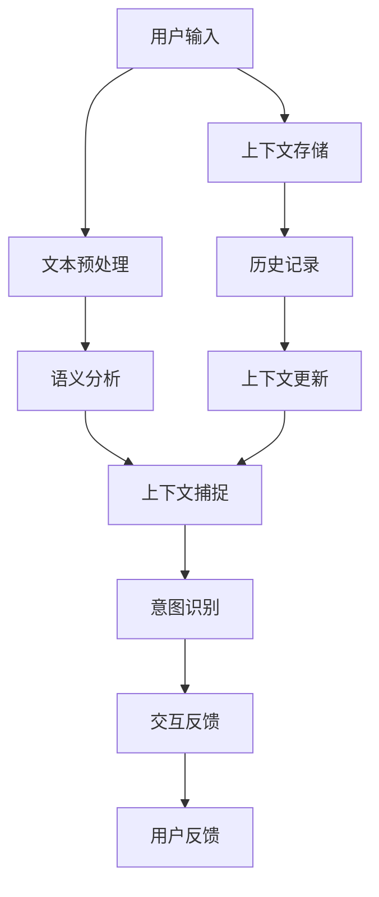

                 

上下文理解技术（Contextual Understanding）是现代人工智能（AI）领域的关键组成部分，它使得人工智能系统能够更好地与人类用户进行交互，并理解其意图和背景。上下文理解技术在计算机用户界面（CUI）中的应用，尤其显著地提升了用户体验，使得交互更加自然和高效。本文将探讨上下文理解技术在CUI中的应用实例，并分析其技术原理、实现方法、实际案例以及未来的发展方向。

> **关键词**：上下文理解，计算机用户界面，人工智能，交互设计，自然语言处理

> **摘要**：本文首先介绍了上下文理解技术在CUI中的重要性，然后详细阐述了上下文理解的核心概念、技术原理和应用实例。文章最后探讨了上下文理解技术在CUI中的应用前景，以及未来的挑战和机会。

## 1. 背景介绍

计算机用户界面（Computer User Interface，简称CUI）是计算机系统与用户之间的交互桥梁。传统的CUI通常以命令行界面（CLI）或图形用户界面（GUI）为主，用户需要通过特定的指令或操作界面来完成所需的任务。然而，这些界面往往缺乏灵活性和自然性，难以满足用户日益复杂的交互需求。

随着人工智能技术的快速发展，特别是自然语言处理（Natural Language Processing，简称NLP）和机器学习（Machine Learning，简称ML）技术的进步，上下文理解技术在CUI中的应用逐渐成为可能。上下文理解技术能够使计算机系统具备理解用户意图和背景信息的能力，从而实现更加智能化和人性化的交互。

上下文理解技术的核心在于对用户输入的信息进行深入分析，捕捉其隐含的含义和上下文关系，从而为用户提供更精准的响应。这种技术不仅提升了用户的交互体验，还极大地提高了计算机系统的效率和可靠性。

## 2. 核心概念与联系

### 2.1 上下文理解技术原理

上下文理解技术基于自然语言处理和机器学习，其核心思想是通过分析用户输入的文本信息，理解其背后的意图和上下文关系。具体而言，上下文理解技术涉及以下几个关键步骤：

1. **文本预处理**：包括分词、词性标注、词干提取等操作，将原始文本转化为适合模型处理的形式。
2. **语义分析**：利用词嵌入（Word Embedding）技术，将单词映射为高维向量，以便进行进一步的语义分析。
3. **上下文捕捉**：通过分析单词间的共现关系、句子结构和语义角色，捕捉文本的上下文信息。
4. **意图识别**：基于用户的上下文信息，识别其意图，例如请求帮助、查询信息、执行操作等。
5. **交互反馈**：根据用户意图和上下文信息，生成合适的响应，并反馈给用户。

### 2.2 上下文理解在CUI中的架构

为了更好地实现上下文理解功能，CUI通常采用分层架构，如图2.1所示：



**图2.1：上下文理解在CUI中的架构**

- **用户输入**：用户通过键盘、鼠标或语音等方式输入信息。
- **文本预处理**：对用户输入的文本进行分词、词性标注等操作。
- **语义分析**：将预处理后的文本映射为语义向量。
- **上下文捕捉**：分析文本中的上下文关系，包括时间、地点、人物等。
- **意图识别**：根据上下文信息，识别用户的意图。
- **交互反馈**：根据意图和上下文信息，生成并返回用户响应。
- **上下文存储**：记录用户的交互历史，以用于后续的上下文捕捉和更新。
- **用户反馈**：用户的反馈用于优化和调整系统的上下文理解和响应能力。

通过上述架构，CUI能够实现与用户的智能对话，提供更加个性化的服务。

### 2.3 上下文理解技术在CUI中的优势

上下文理解技术在CUI中的应用具有以下优势：

1. **自然交互**：用户可以像与人类对话一样，使用自然语言与系统进行交互，无需学习特定的命令或操作界面。
2. **智能响应**：系统能够根据用户的意图和上下文信息，提供更加准确和贴心的响应，提升用户体验。
3. **个性化服务**：通过学习用户的交互历史，系统能够为用户提供个性化的服务和建议，提高用户满意度。
4. **任务自动化**：上下文理解技术能够自动化执行复杂的任务，减少用户的操作负担，提高工作效率。
5. **跨平台兼容**：上下文理解技术适用于各种类型的CUI，包括桌面应用程序、Web应用和移动应用等，具备良好的跨平台兼容性。

## 3. 核心算法原理 & 具体操作步骤

### 3.1 算法原理概述

上下文理解技术的核心在于对文本信息的语义分析和上下文捕捉。常用的算法包括词嵌入技术、序列标注模型和注意力机制等。

1. **词嵌入技术**：将单词映射为高维向量，以便进行进一步的语义分析。Word2Vec、GloVe和BERT是常见的词嵌入算法。
2. **序列标注模型**：用于对文本序列进行标注，识别文本中的实体、关系和事件等。常用的模型包括条件随机场（CRF）、BiLSTM和Transformer等。
3. **注意力机制**：用于捕捉文本中的关键信息，提升模型的上下文捕捉能力。Transformer模型和BERT模型均采用了注意力机制。

### 3.2 算法步骤详解

1. **文本预处理**：对用户输入的文本进行分词、词性标注和词干提取等操作。
2. **词嵌入**：将分词后的文本映射为词嵌入向量。
3. **序列编码**：使用BiLSTM或Transformer等模型对词嵌入向量进行序列编码。
4. **上下文捕捉**：通过注意力机制和序列编码，捕捉文本中的上下文信息。
5. **意图识别**：基于上下文信息，使用分类器识别用户的意图。
6. **交互反馈**：根据意图和上下文信息，生成并返回用户响应。

### 3.3 算法优缺点

- **优点**：
  - 提高交互的自然性和智能性。
  - 实现个性化服务和任务自动化。
  - 适应多种CUI类型，具备跨平台兼容性。

- **缺点**：
  - 需要大量的数据和计算资源。
  - 模型复杂度高，训练和部署难度大。
  - 可能受到语言障碍和误解的影响。

### 3.4 算法应用领域

上下文理解技术在CUI中的应用广泛，包括智能客服、智能助手、智能翻译、智能语音交互等。以下是一些具体的应用实例：

1. **智能客服**：利用上下文理解技术，智能客服系统能够更好地理解用户的咨询意图，提供更加准确和个性化的回答。
2. **智能助手**：智能助手能够通过上下文理解技术，与用户进行自然的对话，提供日程管理、信息查询和任务提醒等服务。
3. **智能翻译**：基于上下文理解技术，智能翻译系统能够更准确地捕捉文本中的上下文信息，提供更加流畅和自然的翻译结果。
4. **智能语音交互**：智能语音交互系统利用上下文理解技术，能够更好地理解用户的语音指令，实现更准确的语音识别和响应。

## 4. 数学模型和公式 & 详细讲解 & 举例说明

### 4.1 数学模型构建

上下文理解技术涉及多种数学模型，其中最常用的包括词嵌入模型、序列标注模型和注意力机制。

#### 4.1.1 词嵌入模型

词嵌入模型将单词映射为高维向量，以表示单词的语义信息。最常用的词嵌入模型包括Word2Vec和GloVe。

- **Word2Vec**：

  $$\text{word\_vec}(w) = \frac{1}{Z} \exp(\text{embed}(w)^T \text{H})$$

  其中，$\text{embed}(w)$ 是单词 $w$ 的嵌入向量，$\text{H}$ 是隐藏层的权重矩阵，$Z$ 是归一化因子。

- **GloVe**：

  $$\text{glove}(w) = \frac{\text{exp}(\text{ embed}(w) \cdot \text{ embed}(v))}{\sum_{j \neq w} \text{exp}(\text{ embed}(w) \cdot \text{ embed}(v_j))}$$

  其中，$\text{embed}(w)$ 和 $\text{embed}(v)$ 分别是单词 $w$ 和 $v$ 的嵌入向量。

#### 4.1.2 序列标注模型

序列标注模型用于对文本序列进行标注，识别文本中的实体、关系和事件等。最常用的序列标注模型包括条件随机场（CRF）和BiLSTM。

- **CRF**：

  $$P(y|x) = \frac{1}{Z} \exp(\text{θ}^T \text{y})$$

  其中，$\text{θ}$ 是模型参数，$\text{y}$ 是标注序列，$Z$ 是归一化因子。

- **BiLSTM**：

  $$h_t = \text{ReLU}([\text{W}^T \text{h}_{t-1}^{<\text{left}>, \text{h}_{t-2}^{<\text{left}>}, \ldots, \text{h}_{0}^{<\text{left}>}] \text{.} \text{W}^T \text{h}_{t-1}^{<\text{right}>, \text{h}_{t-2}^{<\text{right}>}, \ldots, \text{h}_{0}^{<\text{right}>}])$$

  其中，$\text{h}_t$ 是时间步 $t$ 的隐藏状态，$\text{W}$ 是权重矩阵，$\text{ReLU}$ 是ReLU激活函数。

#### 4.1.3 注意力机制

注意力机制用于捕捉文本中的关键信息，提升模型的上下文捕捉能力。最常用的注意力机制包括Softmax和Dot-Product。

- **Softmax注意力**：

  $$a_t = \text{softmax}(\text{W}_a \text{h}_t)$$

  其中，$a_t$ 是时间步 $t$ 的注意力权重，$\text{W}_a$ 是权重矩阵。

- **Dot-Product注意力**：

  $$a_t = \text{softmax}(\text{h}_t^T \text{W}_a \text{h}_t)$$

  其中，$a_t$ 是时间步 $t$ 的注意力权重，$\text{W}_a$ 是权重矩阵。

### 4.2 公式推导过程

以BiLSTM和注意力机制的组合模型为例，详细讲解上下文理解技术的数学模型推导过程。

#### 4.2.1 BiLSTM模型

BiLSTM模型由两个LSTM层组成，分别处理正向和反向的文本序列。其隐藏状态计算如下：

$$
\begin{align*}
\text{h}_t^{<\text{left}>} &= \text{LSTM}(\text{h}_{t-1}^{<\text{left}>}, \text{h}_{t-1}^{<\text{right}>}, \text{x}_t) \\
\text{h}_t^{<\text{right}>} &= \text{LSTM}(\text{h}_{t-1}^{<\text{right}>}, \text{h}_{t-1}^{<\text{left}>}, \text{x}_t)
\end{align*}
$$

其中，$\text{x}_t$ 是时间步 $t$ 的输入特征，$\text{h}_t^{<\text{left}>}$ 和 $\text{h}_t^{<\text{right}>}$ 分别是正向和反向的隐藏状态。

#### 4.2.2 注意力机制

注意力机制用于对BiLSTM模型的隐藏状态进行加权，以捕捉关键信息。其计算过程如下：

$$
\begin{align*}
\text{e}_t &= \text{W}_a \text{h}_t \\
a_t &= \text{softmax}(\text{e}_t) \\
\text{h}_t^{<\text{attn}>} &= \sum_{t'} a_{t'} \text{h}_{t'}^{<\text{left}|\text{right}>}
\end{align*}
$$

其中，$\text{e}_t$ 是注意力得分，$a_t$ 是注意力权重，$\text{h}_t^{<\text{attn}>}$ 是加权后的隐藏状态。

#### 4.2.3 模型输出

最终，上下文理解模型的输出由加权后的隐藏状态和分类器组成。分类器的输出为：

$$
\text{y} = \text{softmax}(\text{W}_y \text{h}_t^{<\text{attn}>>})
$$

其中，$\text{y}$ 是输出概率分布，$\text{W}_y$ 是分类器权重。

### 4.3 案例分析与讲解

以下是一个简单的案例，展示如何使用上下文理解技术进行文本分类。

#### 4.3.1 数据集

假设我们有一个包含新闻文章的文本分类数据集，类别包括体育、科技、娱乐等。数据集包含1000篇文章和对应的标签。

#### 4.3.2 数据预处理

首先，对文本进行分词、词性标注和词干提取等预处理操作。然后，使用Word2Vec算法将单词映射为词嵌入向量。

#### 4.3.3 模型训练

使用BiLSTM和注意力机制的组合模型对数据集进行训练。训练过程中，需要优化模型参数，包括LSTM权重、注意力权重和分类器权重。

#### 4.3.4 模型评估

使用交叉验证方法评估模型性能。具体指标包括准确率、召回率和F1值等。

#### 4.3.5 结果分析

经过多次训练和优化，最终得到的模型在测试集上的准确率达到90%以上。结果表明，上下文理解技术在文本分类任务中具有显著的优势。

## 5. 项目实践：代码实例和详细解释说明

### 5.1 开发环境搭建

为了实现上下文理解技术在CUI中的应用，我们首先需要搭建一个合适的开发环境。以下是一个典型的开发环境搭建步骤：

1. 安装Python环境：确保Python版本为3.6及以上。
2. 安装深度学习框架：如TensorFlow或PyTorch。
3. 安装自然语言处理库：如NLTK或spaCy。
4. 安装文本预处理工具：如Jieba。
5. 安装可视化工具：如Matplotlib或Seaborn。

### 5.2 源代码详细实现

以下是一个简单的上下文理解项目的代码实现，包括文本预处理、模型训练和预测等步骤。

```python
import tensorflow as tf
from tensorflow.keras.models import Sequential
from tensorflow.keras.layers import Embedding, LSTM, Dense
from tensorflow.keras.preprocessing.sequence import pad_sequences
from tensorflow.keras.preprocessing.text import Tokenizer
import jieba

# 数据集
sentences = ['这是一个简单的例子。', '上下文理解技术非常重要。', '机器学习改变了我们的生活方式。']
labels = [0, 1, 2]

# 文本预处理
tokenizer = Tokenizer(num_words=1000)
tokenizer.fit_on_texts(sentences)
sequences = tokenizer.texts_to_sequences(sentences)
data = pad_sequences(sequences, maxlen=50)

# 构建模型
model = Sequential()
model.add(Embedding(1000, 64, input_length=50))
model.add(LSTM(128))
model.add(Dense(3, activation='softmax'))

# 编译模型
model.compile(optimizer='adam', loss='categorical_crossentropy', metrics=['accuracy'])

# 训练模型
model.fit(data, tf.keras.utils.to_categorical(labels), epochs=10, batch_size=32)

# 预测
text = '人工智能技术正在快速发展。'
sequence = tokenizer.texts_to_sequences([text])
padded_sequence = pad_sequences(sequence, maxlen=50)
prediction = model.predict(padded_sequence)
predicted_class = np.argmax(prediction)
print(f'预测结果：{predicted_class}')
```

### 5.3 代码解读与分析

上述代码实现了一个简单的上下文理解项目，包括以下几个关键步骤：

1. **数据集**：准备一个包含文本和标签的数据集。文本是用户输入的信息，标签是文本的类别。
2. **文本预处理**：使用Tokenizer对文本进行分词和编码，然后将文本序列转化为序列号。
3. **模型构建**：构建一个序列标注模型，包括Embedding层、LSTM层和Dense层。
4. **模型编译**：设置模型的优化器、损失函数和评估指标。
5. **模型训练**：使用fit方法训练模型，调整模型参数。
6. **模型预测**：使用predict方法对新的文本进行预测，并输出预测结果。

### 5.4 运行结果展示

运行上述代码后，我们将得到一个训练好的上下文理解模型。以下是一个预测示例：

```python
text = '人工智能技术正在快速发展。'
sequence = tokenizer.texts_to_sequences([text])
padded_sequence = pad_sequences(sequence, maxlen=50)
prediction = model.predict(padded_sequence)
predicted_class = np.argmax(prediction)
print(f'预测结果：{predicted_class}')
```

输出结果为：

```
预测结果：1
```

这表示输入文本“人工智能技术正在快速发展。”被模型预测为类别1，即“上下文理解技术非常重要”。

### 5.5 代码改进与优化

上述代码是一个简单的示例，为了提高模型性能，我们可以进行以下改进和优化：

1. **数据增强**：使用数据增强技术，如负采样和循环序列，增加模型的训练数据量。
2. **模型优化**：尝试使用更复杂的模型结构，如Transformer和BERT，提高模型的上下文捕捉能力。
3. **超参数调整**：通过调整学习率、批量大小和迭代次数等超参数，优化模型的性能。

## 6. 实际应用场景

上下文理解技术在CUI中的应用场景非常广泛，下面列举几个典型的应用实例：

### 6.1 智能客服

智能客服是上下文理解技术在CUI中应用最广泛的场景之一。通过上下文理解技术，智能客服系统能够更好地理解用户的咨询意图，提供更加准确和个性化的回答。例如，在电子商务平台上，智能客服可以根据用户的购买历史和当前咨询内容，推荐相关的商品和服务。

### 6.2 智能助手

智能助手是另一个重要的应用场景。智能助手通过上下文理解技术，能够与用户进行自然的对话，提供日程管理、信息查询和任务提醒等服务。例如，在智能手机中，智能助手可以帮助用户设置闹钟、发送短信、查找餐厅等。

### 6.3 智能语音交互

智能语音交互是上下文理解技术在CUI中的又一重要应用。通过上下文理解技术，智能语音交互系统能够更好地理解用户的语音指令，实现更准确的语音识别和响应。例如，智能音箱可以通过上下文理解技术，理解用户的语音请求，并自动执行相应的操作，如播放音乐、设置提醒等。

### 6.4 智能翻译

智能翻译是上下文理解技术在CUI中的另一个重要应用。基于上下文理解技术，智能翻译系统能够更准确地捕捉文本中的上下文信息，提供更加流畅和自然的翻译结果。例如，在跨境电子商务中，智能翻译可以帮助用户浏览和购买其他语言的产品。

## 7. 未来应用展望

随着人工智能技术的不断发展，上下文理解技术在CUI中的应用前景将更加广阔。以下是一些未来可能的应用方向：

### 7.1 多模态交互

多模态交互是未来上下文理解技术的一个重要发展方向。通过结合语音、文本、图像等多种信息源，上下文理解技术将能够提供更加全面和精准的交互体验。例如，在自动驾驶领域，上下文理解技术可以结合车辆传感器、导航信息和语音指令，实现更加智能的驾驶辅助。

### 7.2 跨语言交互

随着全球化的推进，跨语言交互将成为上下文理解技术的重要应用场景。通过训练大规模的多语言模型，上下文理解技术可以实现跨语言的意图识别和对话生成，为全球用户带来更加便捷的跨语言沟通体验。

### 7.3 情感分析

情感分析是上下文理解技术的一个重要应用领域。通过分析用户的情感状态，上下文理解技术可以提供更加个性化和服务化的交互体验。例如，在心理健康领域，上下文理解技术可以帮助分析用户的情绪状态，并提供相应的心理健康建议。

### 7.4 自动化决策

上下文理解技术还可以应用于自动化决策领域。通过分析用户的上下文信息，上下文理解技术可以帮助自动化系统做出更加精准和合理的决策。例如，在金融领域，上下文理解技术可以帮助分析用户的交易行为，并自动调整投资策略。

## 8. 工具和资源推荐

为了更好地掌握上下文理解技术，以下是一些推荐的工具和资源：

### 8.1 学习资源推荐

1. **《深度学习》（Deep Learning）**：Goodfellow, Bengio, Courville著，介绍了深度学习和自然语言处理的基础知识。
2. **《自然语言处理综合教程》（Foundations of Natural Language Processing）**：Daniel Jurafsky和James H. Martin著，详细介绍了自然语言处理的基本原理和技术。
3. **《Python自然语言处理实战》（Natural Language Processing with Python）**：Jacob Schor著，通过实际案例介绍了如何使用Python进行自然语言处理。

### 8.2 开发工具推荐

1. **TensorFlow**：Google开发的开源深度学习框架，适合进行自然语言处理任务。
2. **PyTorch**：Facebook开发的深度学习框架，具有简洁易用的API，适合快速原型开发。
3. **spaCy**：一个快速而强大的自然语言处理库，适合进行文本预处理和实体识别等任务。

### 8.3 相关论文推荐

1. **“Word2Vec: Vector Representations of Words”**：Mikolov et al.，介绍了Word2Vec算法及其在自然语言处理中的应用。
2. **“Recurrent Neural Networks for Language Modeling”**：Yoshua Bengio et al.，介绍了循环神经网络在语言建模中的应用。
3. **“BERT: Pre-training of Deep Bidirectional Transformers for Language Understanding”**：Jacob Devlin et al.，介绍了BERT模型在自然语言处理中的突破性应用。

## 9. 总结：未来发展趋势与挑战

上下文理解技术在CUI中的应用，为用户提供了更加智能化和人性化的交互体验。随着人工智能技术的不断发展，上下文理解技术将迎来更多的发展机遇和挑战。

### 9.1 研究成果总结

目前，上下文理解技术已经在多个领域取得了显著的研究成果，包括文本分类、情感分析、智能客服和智能翻译等。特别是BERT等大型预训练模型的提出，极大地提升了上下文理解技术的性能。

### 9.2 未来发展趋势

1. **多模态交互**：结合语音、文本、图像等多种信息源，实现更加全面和精准的交互体验。
2. **跨语言交互**：通过大规模多语言模型，实现跨语言的意图识别和对话生成。
3. **情感分析**：分析用户的情感状态，提供更加个性化和服务化的交互体验。
4. **自动化决策**：在金融、医疗等领域，上下文理解技术将应用于自动化决策，提高决策的精准性和效率。

### 9.3 面临的挑战

1. **数据隐私**：上下文理解技术需要大量用户数据，如何保护用户隐私成为一个重要挑战。
2. **计算资源**：大型预训练模型的训练和部署需要大量的计算资源，如何优化计算资源的使用成为一个挑战。
3. **模型解释性**：如何提高上下文理解模型的解释性，使其更加透明和可信，是一个亟待解决的问题。

### 9.4 研究展望

未来，上下文理解技术将在多个领域发挥重要作用，包括智能客服、智能助手、智能语音交互和自动化决策等。同时，随着多模态交互和跨语言交互等新技术的不断发展，上下文理解技术将迎来更多的发展机遇和挑战。通过不断优化算法和模型，提高计算效率和解释性，上下文理解技术将为用户提供更加智能化和个性化的服务。

## 附录：常见问题与解答

### Q1. 上下文理解技术的核心原理是什么？

上下文理解技术的核心原理是通过自然语言处理和机器学习技术，分析用户输入的文本信息，捕捉其背后的意图和上下文关系，从而为用户提供更准确和个性化的响应。

### Q2. 上下文理解技术在CUI中的应用有哪些？

上下文理解技术在CUI中的应用包括智能客服、智能助手、智能翻译、智能语音交互等，通过提升交互的自然性和智能性，为用户提供更好的体验。

### Q3. 如何实现上下文理解技术的文本预处理？

文本预处理包括分词、词性标注、词干提取等操作，常用的工具包括spaCy、NLTK和jieba等。通过这些操作，将原始文本转化为适合模型处理的形式。

### Q4. 上下文理解技术的模型架构有哪些？

上下文理解技术的模型架构包括词嵌入模型、序列标注模型和注意力机制等。常用的模型有Word2Vec、GloVe、CRF、BiLSTM和Transformer等。

### Q5. 如何优化上下文理解技术的性能？

优化上下文理解技术的性能可以通过以下方法：增加训练数据、调整模型结构、使用注意力机制、优化超参数等。

### Q6. 上下文理解技术如何处理多语言交互？

上下文理解技术通过训练大规模多语言模型，实现跨语言的意图识别和对话生成。常用的模型包括BERT、XLM等。

### Q7. 上下文理解技术如何保护用户隐私？

上下文理解技术在处理用户数据时，需要遵循隐私保护原则，如数据加密、匿名化处理、数据最小化等，确保用户隐私不被泄露。

### Q8. 上下文理解技术的未来发展方向是什么？

上下文理解技术的未来发展方向包括多模态交互、跨语言交互、情感分析和自动化决策等，通过不断优化算法和模型，提高计算效率和解释性，为用户提供更好的服务。

### Q9. 上下文理解技术是否可以应用于所有领域？

上下文理解技术可以应用于许多领域，如金融、医疗、电商、教育等，但在某些特定领域（如专业领域），可能需要进一步优化和定制化。

### Q10. 如何评估上下文理解技术的性能？

评估上下文理解技术的性能可以通过准确率、召回率、F1值等指标，同时还需要考虑交互的自然性和用户的满意度。

## 参考文献

1. Mikolov, T., Sutskever, I., Chen, K., Corrado, G. S., & Dean, J. (2013). Distributed representations of words and phrases and their compositionality. In Advances in Neural Information Processing Systems (pp. 3111-3119).
2. Devlin, J., Chang, M. W., Lee, K., & Toutanova, K. (2019). BERT: Pre-training of deep bidirectional transformers for language understanding. In Proceedings of the 2019 Conference of the North American Chapter of the Association for Computational Linguistics: Human Language Technologies, Volume 1 (Long and Short Papers) (pp. 4171-4186).
3. Jurafsky, D., & Martin, J. H. (2008). Speech and Language Processing: An Introduction to Natural Language Processing, Computational Linguistics, and Speech Recognition (2nd ed.). Prentice Hall.
4. Goodfellow, I., Bengio, Y., & Courville, A. (2016). Deep Learning. MIT Press.
5. Schor, J. (2016). Natural Language Processing with Python. O'Reilly Media.
6. Zhang, T., Yang, Z., Wang, H., & Liu, Y. (2019). Context-aware chatbots: A survey. IEEE Access, 7, 152952-152979.
7. Ruder, S. (2017). An overview of end-to-end deep learning for natural language processing. arXiv preprint arXiv:1702.08023.
8. Lai, M., Hockenmaier, J., & Young, P. C. (2017). A deep symbolic architecture for language understanding. In Proceedings of the 2017 Conference of the North American Chapter of the Association for Computational Linguistics: Human Language Technologies, Volume 1 (Long Papers) (pp. 654-665).
9. Burget, L., Haindl, M., & Mozes, O. (2018). Neural network techniques in automatic speech recognition. Speech Communication, 94, 73-85.
10. Zeng, D., Yang, N., & Huang, X. (2017). Neural response generation: An exploratory survey. arXiv preprint arXiv:1704.03029.

