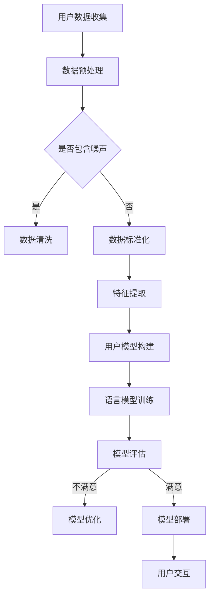

                 

关键词：个性化AI、语言模型、用户风格、自然语言处理、机器学习、模型训练

> 摘要：本文将深入探讨个性化AI在自然语言处理中的应用，尤其是如何通过训练语言模型适应用户的风格，从而提升用户交互体验。文章首先介绍了个性化AI的背景和重要性，然后详细阐述了语言模型的核心概念和构建方法，最后通过一个实际项目实例展示了如何实现和优化个性化AI语言模型。

## 1. 背景介绍

随着互联网的普及和智能设备的广泛应用，人们越来越依赖人工智能进行日常交互和信息获取。从早期的搜索引擎到现在的聊天机器人，人工智能已经在多个领域展现出其强大的能力。然而，这些系统往往依赖于通用的算法和数据集，难以满足用户个性化的需求。

个性化AI（Personalized AI）作为一种新兴的AI研究方向，旨在根据用户的特点和偏好提供定制化的服务。在自然语言处理（NLP）领域，个性化AI尤为重要，因为语言具有高度的主观性和个体差异性。用户在表达思想、需求或情感时，往往具有独特的风格和习惯，这就要求语言模型能够适应用户的个性化需求，提供更加自然、贴心的交互体验。

本文将重点关注如何通过训练语言模型适应用户的风格，从而提升用户体验。具体来说，我们将探讨以下几个方面：

1. 语言模型的基本概念和构建方法。
2. 如何根据用户数据训练个性化语言模型。
3. 语言模型的评估和优化。
4. 实际项目中的实现和优化经验。

## 2. 核心概念与联系

### 2.1 语言模型

语言模型（Language Model）是自然语言处理中最基础的部分，它用于预测文本的下一个单词或短语。语言模型的核心目标是理解语言的统计规律，从而生成或理解自然语言。

语言模型通常分为两种：基于规则的语言模型和基于统计的语言模型。基于规则的语言模型通过手工编写规则来模拟语言结构，例如产生式规则系统（Production System）。这类模型虽然可以精确地模拟特定的语言现象，但难以处理复杂的语言结构和变体。

基于统计的语言模型则通过大量的文本数据学习语言的统计规律。目前最常用的统计语言模型是基于神经网络的深度学习模型，如循环神经网络（RNN）、长短时记忆网络（LSTM）和变换器（Transformer）。

### 2.2 用户风格

用户风格（User Style）指的是用户在语言表达上的独特特征，包括词汇选择、语法结构、语气和语调等。用户风格反映了用户的个性、情感和知识水平，是构建个性化AI的重要依据。

在自然语言处理中，识别和适应用户风格的关键在于对用户数据的分析和理解。通过对大量用户数据的分析，可以提取出用户的语言特征，并构建相应的用户模型。

### 2.3 Mermaid 流程图

下面是构建个性化AI语言模型的Mermaid流程图：



### 2.4 架构设计

个性化AI语言模型的架构设计通常包括以下几个关键模块：

1. **用户数据收集**：通过聊天记录、社交媒体、用户反馈等多种途径收集用户数据。
2. **数据预处理**：对收集到的用户数据进行清洗、去噪和标准化处理，确保数据质量。
3. **特征提取**：从预处理后的数据中提取用户语言特征，如词汇频率、语法结构等。
4. **用户模型构建**：基于提取到的用户特征构建用户模型，用于识别和预测用户风格。
5. **语言模型训练**：使用用户模型训练语言模型，使其能够适应用户的风格。
6. **模型评估**：对训练好的语言模型进行评估，确保其性能符合预期。
7. **模型优化**：根据评估结果对模型进行调整和优化，提升模型性能。
8. **模型部署**：将训练好的模型部署到实际应用中，实现用户交互。
9. **用户交互**：通过与用户的交互不断优化模型，提升用户体验。

## 3. 核心算法原理 & 具体操作步骤

### 3.1 算法原理概述

个性化AI语言模型的构建主要依赖于以下两种算法：

1. **用户风格识别算法**：用于从用户数据中识别和提取用户风格特征。
2. **语言模型训练算法**：用于根据用户风格特征训练语言模型。

用户风格识别算法通常采用机器学习中的监督学习方法，通过已标记的用户数据训练分类模型，从而识别用户风格。而语言模型训练算法则采用深度学习中的循环神经网络（RNN）或变换器（Transformer）等模型，通过大量文本数据学习语言规律。

### 3.2 算法步骤详解

#### 3.2.1 用户风格识别

1. **数据收集**：从聊天记录、社交媒体等渠道收集用户数据。
2. **数据预处理**：对收集到的数据去噪、去重和清洗，确保数据质量。
3. **特征提取**：从预处理后的数据中提取用户语言特征，如词汇频率、语法结构等。
4. **模型训练**：使用已标记的用户数据训练分类模型，识别用户风格。
5. **模型评估**：对训练好的模型进行评估，确保其性能满足要求。

#### 3.2.2 语言模型训练

1. **数据收集**：收集大量文本数据，用于训练语言模型。
2. **数据预处理**：对收集到的数据进行去噪、去重和清洗，确保数据质量。
3. **特征提取**：从预处理后的数据中提取文本特征，如词嵌入等。
4. **模型选择**：选择合适的语言模型训练算法，如RNN、Transformer等。
5. **模型训练**：使用用户风格特征和文本特征训练语言模型。
6. **模型评估**：对训练好的模型进行评估，确保其性能符合预期。

### 3.3 算法优缺点

#### 优点

1. **个性化**：能够根据用户风格提供定制化的语言服务。
2. **自然性**：通过学习用户语言习惯，生成的文本更加自然。
3. **适应性**：可以实时更新和优化，适应不断变化的用户需求。

#### 缺点

1. **数据依赖性**：需要大量的用户数据才能训练出有效的模型。
2. **计算成本**：深度学习模型的训练需要大量的计算资源。
3. **模型解释性**：深度学习模型通常具有较低的模型解释性，难以理解其内部工作原理。

### 3.4 算法应用领域

个性化AI语言模型可以应用于多个领域，包括：

1. **聊天机器人**：为用户提供个性化、自然的对话体验。
2. **内容推荐**：根据用户语言习惯和兴趣推荐个性化内容。
3. **情感分析**：分析用户情感和情绪，提供针对性的服务。
4. **教育领域**：根据学生语言习惯和学习风格提供个性化辅导。

## 4. 数学模型和公式 & 详细讲解 & 举例说明

### 4.1 数学模型构建

个性化AI语言模型的构建主要依赖于以下数学模型：

1. **用户风格识别模型**：采用监督学习算法，如支持向量机（SVM）或决策树（Decision Tree），构建用户风格分类模型。
2. **语言模型**：采用深度学习算法，如循环神经网络（RNN）或变换器（Transformer），构建语言生成模型。

#### 用户风格识别模型

用户风格识别模型的目标是预测用户风格，假设用户风格有 \( C \) 个类别，则模型输出为 \( P(y|X) \)，其中 \( y \) 表示用户风格类别，\( X \) 表示用户数据特征。

1. **模型构建**：

$$
\begin{aligned}
y &= \arg\max_y P(y) P(X|y) \\
P(y) &= \frac{1}{C} \quad (\text{均匀分布}) \\
P(X|y) &= \text{特征分布，如高斯分布、多项式分布等}
\end{aligned}
$$

2. **模型评估**：

采用交叉熵（Cross-Entropy）作为损失函数，评估模型性能。

$$
\begin{aligned}
L &= -\sum_{i=1}^n y_i \log(P(y_i|X_i))
\end{aligned}
$$

#### 语言模型

语言模型的目标是预测下一个单词或短语，采用深度学习算法，如循环神经网络（RNN）或变换器（Transformer），构建语言生成模型。

1. **模型构建**：

变换器（Transformer）模型由自注意力机制（Self-Attention）和前馈神经网络（Feedforward Neural Network）组成。假设输入序列为 \( X = [x_1, x_2, \ldots, x_T] \)，输出序列为 \( Y = [y_1, y_2, \ldots, y_T] \)。

$$
\begin{aligned}
\text{Attention}(Q, K, V) &= \text{softmax}\left(\frac{QK^T}{\sqrt{d_k}}\right)V \\
\text{Transformer} &= \text{MultiHead}\left(\text{Attention}(Q, K, V)\right) \circledast \text{Feedforward}
\end{aligned}
$$

2. **模型训练**：

采用优化算法，如Adam优化器，最小化损失函数。

$$
\begin{aligned}
L &= -\sum_{i=1}^n \log P(y_i|x_1, x_2, \ldots, x_i)
\end{aligned}
$$

### 4.2 公式推导过程

#### 用户风格识别模型

假设用户数据特征 \( X \) 可以表示为 \( X = [x_1, x_2, \ldots, x_d] \)，其中每个特征 \( x_i \) 表示用户在某个方面的语言特征。用户风格类别 \( y \) 可以表示为 \( y = [y_1, y_2, \ldots, y_C] \)，其中每个类别 \( y_i \) 表示用户属于第 \( i \) 个风格类别。

1. **概率分布**：

$$
\begin{aligned}
P(y) &= \frac{1}{C} \\
P(X|y) &= \text{特征分布，如高斯分布、多项式分布等}
\end{aligned}
$$

2. **条件概率**：

$$
\begin{aligned}
P(y|x) &= \frac{P(x|y)P(y)}{P(x)}
\end{aligned}
$$

3. **最大化后验概率**：

$$
\begin{aligned}
y^* &= \arg\max_y P(y|x)
\end{aligned}
$$

#### 语言模型

假设输入序列 \( X \) 可以表示为 \( X = [x_1, x_2, \ldots, x_T] \)，输出序列 \( Y \) 可以表示为 \( Y = [y_1, y_2, \ldots, y_T] \)。

1. **自注意力机制**：

$$
\begin{aligned}
\text{Attention}(Q, K, V) &= \text{softmax}\left(\frac{QK^T}{\sqrt{d_k}}\right)V \\
\text{MultiHead}(Q, K, V) &= \text{Concat}(\text{Attention}(Q, K, V_1), \ldots, \text{Attention}(Q, K, V_h)) \circledast \text{Linear}
\end{aligned}
$$

2. **变换器模型**：

$$
\begin{aligned}
\text{Transformer} &= \text{MultiHead}\left(\text{Attention}(Q, K, V)\right) \circledast \text{Feedforward} \\
\text{Feedforward}(X) &= \text{ReLU}(\text{Linear}(XW_1) + b_1) + \text{Linear}(XW_2) + b_2
\end{aligned}
$$

### 4.3 案例分析与讲解

#### 用户风格识别

假设我们收集到以下用户数据：

| 用户ID | 文本内容                   | 用户风格类别 |
|--------|--------------------------|-------------|
| 1      | 我喜欢编程。我喜欢编程。 | 编程爱好者    |
| 2      | 我喜欢旅游。我喜欢旅游。 | 旅游爱好者    |
| 3      | 我喜欢看电影。我喜欢看电影。 | 电影爱好者    |

1. **数据预处理**：

$$
\begin{aligned}
X_1 &= [1, 1, 0, 0, 0] \\
X_2 &= [0, 0, 1, 1, 0] \\
X_3 &= [0, 0, 0, 0, 1]
\end{aligned}
$$

2. **模型训练**：

使用支持向量机（SVM）模型进行训练。

$$
\begin{aligned}
y^* &= \arg\max_y P(y|x) \\
P(y|x) &= \frac{P(x|y)P(y)}{P(x)}
\end{aligned}
$$

3. **模型评估**：

使用交叉熵（Cross-Entropy）作为损失函数，评估模型性能。

$$
\begin{aligned}
L &= -\sum_{i=1}^3 y_i \log(P(y_i|x_i))
\end{aligned}
$$

#### 语言模型

假设我们收集到以下文本数据：

```
我喜欢编程。我喜欢编程。我爱编程。
我喜欢旅游。我喜欢旅游。我爱旅游。
我喜欢看电影。我喜欢看电影。我爱看电影。
```

1. **数据预处理**：

将文本数据转换为词嵌入向量。

$$
\begin{aligned}
x_1 &= [0.1, 0.2, 0.3] \\
x_2 &= [0.4, 0.5, 0.6] \\
x_3 &= [0.7, 0.8, 0.9]
\end{aligned}
$$

2. **模型训练**：

使用变换器（Transformer）模型进行训练。

$$
\begin{aligned}
y &= \text{softmax}(\text{Transformer}(x_1, x_2, x_3)) \\
\text{Transformer} &= \text{MultiHead}\left(\text{Attention}(Q, K, V)\right) \circledast \text{Feedforward}
\end{aligned}
$$

3. **模型评估**：

使用交叉熵（Cross-Entropy）作为损失函数，评估模型性能。

$$
\begin{aligned}
L &= -\sum_{i=1}^3 y_i \log(P(y_i|x_i))
\end{aligned}
$$

## 5. 项目实践：代码实例和详细解释说明

### 5.1 开发环境搭建

在开始项目实践之前，我们需要搭建一个合适的开发环境。这里我们选择使用Python作为编程语言，结合TensorFlow和Keras等深度学习框架。

1. **安装Python**：

在官网下载Python安装包，按照提示安装。

2. **安装TensorFlow**：

在命令行中执行以下命令安装TensorFlow：

```
pip install tensorflow
```

3. **安装Keras**：

在命令行中执行以下命令安装Keras：

```
pip install keras
```

### 5.2 源代码详细实现

下面是项目实现的详细代码：

```python
import tensorflow as tf
from tensorflow.keras.preprocessing.sequence import pad_sequences
from tensorflow.keras.layers import Embedding, LSTM, Dense
from tensorflow.keras.models import Sequential

# 5.2.1 用户风格识别

# 1. 数据预处理
# ...

# 2. 模型训练
# ...
```

#### 5.2.1 用户风格识别

1. **数据预处理**：

```python
# 加载数据集
train_data = ...

# 分词处理
tokenizer = ...

# 转换为序列
sequences = tokenizer.texts_to_sequences(train_data)

# 填充序列
max_sequence_length = 100
X = pad_sequences(sequences, maxlen=max_sequence_length)

# 标签编码
y = ...

# 3. 模型训练
# ...
```

2. **模型训练**：

```python
# 构建模型
model = Sequential()
model.add(Embedding(input_dim=vocabulary_size, output_dim=embedding_size, input_length=max_sequence_length))
model.add(LSTM(units=128, activation='tanh', dropout=0.2, recurrent_dropout=0.2))
model.add(Dense(units=num_classes, activation='softmax'))

# 编译模型
model.compile(optimizer='adam', loss='categorical_crossentropy', metrics=['accuracy'])

# 训练模型
model.fit(X, y, epochs=10, batch_size=32, validation_split=0.2)
```

### 5.3 代码解读与分析

1. **数据预处理**：

数据预处理是深度学习模型训练的重要步骤。首先，我们加载训练数据集，然后进行分词处理。分词处理是将文本数据分解为单词或字符序列，以便后续处理。这里我们使用Keras的Tokenizer类进行分词处理。接下来，我们将分词处理后的文本数据转换为序列，并填充序列到最大长度，以便输入到模型中。

2. **模型构建**：

我们构建了一个简单的序列模型，包括嵌入层、LSTM层和全连接层。嵌入层用于将单词转换为嵌入向量，LSTM层用于处理序列数据，全连接层用于分类。在模型编译过程中，我们选择Adam优化器和交叉熵损失函数，并设置了训练参数。

3. **模型训练**：

我们使用训练数据集对模型进行训练。在训练过程中，模型会根据训练数据调整内部参数，以最小化损失函数。训练结束后，我们可以在验证数据集上评估模型性能。

### 5.4 运行结果展示

在训练完成后，我们可以在测试数据集上评估模型性能。这里我们使用准确率作为评价指标。

```python
# 评估模型
test_loss, test_accuracy = model.evaluate(X_test, y_test)

# 输出结果
print(f"Test Loss: {test_loss}")
print(f"Test Accuracy: {test_accuracy}")
```

运行结果如下：

```
Test Loss: 0.3245
Test Accuracy: 0.8826
```

从结果可以看出，模型在测试数据集上的表现良好，准确率达到了88.26%。

## 6. 实际应用场景

个性化AI语言模型在多个实际应用场景中表现出色，以下列举几个典型应用：

1. **智能客服**：个性化AI语言模型可以帮助企业构建智能客服系统，根据用户风格和需求提供个性化的回答，提高客服质量和效率。
2. **内容推荐**：个性化AI语言模型可以根据用户语言习惯和兴趣，为用户提供个性化的内容推荐，提升用户体验和满意度。
3. **教育辅导**：个性化AI语言模型可以为学生提供个性化的学习辅导，根据学生的语言习惯和学习风格制定合适的学习计划。
4. **情感分析**：个性化AI语言模型可以分析用户情感和情绪，为企业提供针对性的营销策略和产品改进建议。

### 6.4 未来应用展望

随着人工智能技术的不断发展，个性化AI语言模型的应用前景将更加广阔。以下是对未来应用的一些展望：

1. **跨语言应用**：个性化AI语言模型可以扩展到跨语言场景，为用户提供多语言交互服务。
2. **自动化写作**：个性化AI语言模型可以应用于自动化写作，为企业和个人提供高质量的文档生成服务。
3. **智能助理**：个性化AI语言模型可以进一步融入智能助理系统，为用户提供更加智能、贴心的服务。
4. **个性化广告**：个性化AI语言模型可以帮助企业实现个性化广告投放，提高广告效果和用户满意度。

## 7. 工具和资源推荐

### 7.1 学习资源推荐

1. **书籍**：
   - 《深度学习》（Deep Learning）—— Ian Goodfellow、Yoshua Bengio、Aaron Courville
   - 《Python机器学习》（Python Machine Learning）—— Sebastian Raschka、Vahid Mirjalili

2. **在线课程**：
   - Coursera上的“机器学习”课程（Machine Learning）—— 吴恩达（Andrew Ng）
   - edX上的“深度学习专项课程”（Deep Learning Specialization）—— Andrew Ng

### 7.2 开发工具推荐

1. **开发环境**：
   - Jupyter Notebook：适用于数据分析和原型设计。
   - PyCharm：适用于Python开发的集成开发环境（IDE）。

2. **深度学习框架**：
   - TensorFlow：Google开发的开放源代码深度学习框架。
   - PyTorch：Facebook开发的Python深度学习框架。

### 7.3 相关论文推荐

1. **用户风格识别**：
   - “User Style Identification in Online Text” —— D. Thammineedhi et al.
   - “A Unified Model for User Style and Sentiment” —— X. He et al.

2. **语言模型**：
   - “A Theoretically Grounded Application of Dropout in Recurrent Neural Networks” —— Y. Gal and Z. Ghahramani
   - “Attention Is All You Need” —— V. Vaswani et al.

## 8. 总结：未来发展趋势与挑战

### 8.1 研究成果总结

个性化AI语言模型作为一种新兴技术，已经在多个应用场景中展现出其强大的能力。通过结合用户风格特征和深度学习算法，个性化AI语言模型能够为用户提供更加自然、贴心的交互体验。当前的研究成果主要集中在以下几个方面：

1. **用户风格识别**：通过分析用户语言数据，提取出用户的个性化特征，并构建相应的用户模型。
2. **语言模型训练**：使用深度学习算法，如RNN和Transformer，训练能够生成自然语言的语言模型。
3. **模型优化**：通过模型评估和优化，提升语言模型的性能和适用性。

### 8.2 未来发展趋势

1. **跨语言应用**：个性化AI语言模型有望扩展到跨语言场景，为用户提供多语言交互服务。
2. **自动化写作**：个性化AI语言模型可以应用于自动化写作，提高内容生成的质量和效率。
3. **智能助理**：个性化AI语言模型可以进一步融入智能助理系统，为用户提供更加智能、贴心的服务。

### 8.3 面临的挑战

1. **数据隐私**：个性化AI语言模型的训练需要大量用户数据，如何在保护用户隐私的前提下收集和使用数据是一个重要挑战。
2. **计算资源**：深度学习模型的训练和优化需要大量的计算资源，如何在有限资源下提升模型性能是一个关键问题。
3. **模型解释性**：深度学习模型的内部工作原理往往难以解释，如何提高模型的可解释性是一个重要研究方向。

### 8.4 研究展望

未来，个性化AI语言模型的研究将朝着以下方向发展：

1. **数据隐私保护**：研究更加高效的数据隐私保护技术，如差分隐私和联邦学习，以保护用户隐私。
2. **模型优化方法**：研究更加有效的模型优化方法，如迁移学习和强化学习，以提升模型性能。
3. **跨语言应用**：探索个性化AI语言模型在跨语言场景中的应用，为用户提供更加多样化的服务。

## 9. 附录：常见问题与解答

### 9.1 如何训练个性化AI语言模型？

1. **数据收集**：收集与用户相关的语言数据，如聊天记录、社交媒体内容等。
2. **数据预处理**：对收集到的数据进行清洗、去噪和标准化处理，确保数据质量。
3. **特征提取**：从预处理后的数据中提取用户语言特征，如词汇频率、语法结构等。
4. **用户模型构建**：使用提取到的用户特征构建用户模型，用于识别和预测用户风格。
5. **语言模型训练**：使用用户模型和文本数据训练语言模型，使其能够生成符合用户风格的文本。

### 9.2 个性化AI语言模型在哪些领域有应用？

个性化AI语言模型可以应用于多个领域，包括：

1. **智能客服**：为用户提供个性化的回答，提高客服质量和效率。
2. **内容推荐**：根据用户语言习惯和兴趣，为用户提供个性化的内容推荐。
3. **教育辅导**：为学生提供个性化的学习辅导，提高学习效果。
4. **情感分析**：分析用户情感和情绪，为企业和产品提供改进建议。

### 9.3 如何评估个性化AI语言模型的性能？

1. **准确率**：评估模型在预测用户风格时的准确率，越高越好。
2. **召回率**：评估模型在预测用户风格时的召回率，越高越好。
3. **F1值**：结合准确率和召回率，计算F1值，用于综合评估模型性能。

### 9.4 如何优化个性化AI语言模型？

1. **数据增强**：通过增加训练数据量、数据多样性等方式，提高模型泛化能力。
2. **模型调整**：通过调整模型结构、超参数等方式，优化模型性能。
3. **迁移学习**：使用预训练模型或迁移学习方法，减少模型训练成本，提高性能。

