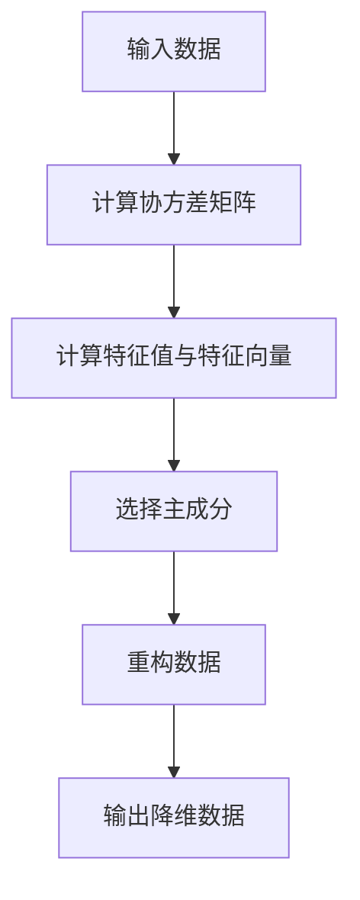

                 

 > > **关键词**：主成分分析，数据降维，特征提取，线性代数，Python，机器学习，数据分析。

> **摘要**：本文将详细介绍主成分分析（PCA）的原理及其在数据降维和特征提取中的应用。我们将通过Python代码实例，展示如何实现PCA，并深入讲解其数学模型和算法步骤。文章还将探讨PCA的优缺点及其在实际应用中的领域，以及未来的发展趋势与挑战。

## 1. 背景介绍

随着数据量的急剧增长，如何在保证数据质量和分析效率的前提下，对大量数据进行有效的分析和理解，成为了数据科学和机器学习领域的一个重要课题。主成分分析（Principal Component Analysis，PCA）是一种常用的降维技术，它通过将原始数据映射到新的正交坐标系上，提取出数据的主要特征，从而降低数据的维度，同时保留数据的最大方差。

PCA不仅在统计学中有着广泛的应用，如数据可视化、聚类分析、分类任务等，在计算机视觉、语音识别、文本分析等领域也有重要的应用价值。本文将详细介绍PCA的原理、数学模型、算法步骤以及实际应用，旨在帮助读者更好地理解和应用这一重要的技术。

## 2. 核心概念与联系

在介绍PCA之前，我们需要先了解一些核心的概念和它们之间的关系。

### 2.1 线性代数基本概念

- **向量**：一个向量是由一组有序数构成的数组，通常表示为列向量。  
  例如，一个二维向量可以表示为 `[x, y]`。

- **矩阵**：一个矩阵是由一组数按照行列排列成的矩形数组。  
  例如，一个 2x3 的矩阵可以表示为：
  \[
  \begin{matrix}
  a_{11} & a_{12} & a_{13} \\
  a_{21} & a_{22} & a_{23} \\
  \end{matrix}
  \]

- **协方差矩阵**：协方差矩阵是一个 n×n 的矩阵，它描述了两个随机变量的线性相关性。协方差矩阵对角线上的元素是各个变量的方差，非对角线上的元素是两个变量的协方差。

  \[
  \text{Cov}(X, Y) = \frac{1}{n-1} \sum_{i=1}^{n} (x_i - \bar{x})(y_i - \bar{y})
  \]

- **特征值与特征向量**：特征值和特征向量是线性代数中的基本概念。一个矩阵 A 的特征值是方程 `Ax = \lambda x` 的解，而特征向量是对应的特征值下的解向量。

  \[
  A\mathbf{v} = \lambda \mathbf{v}
  \]

### 2.2 主成分分析的核心概念

- **主成分**：主成分是原始数据空间中能够最大程度解释数据变异性（方差）的坐标轴。这些坐标轴是正交的，即相互垂直。

- **主成分系数**：主成分系数是原始数据点在每个主成分上的投影。

- **方差**：方差是数据分布的离散程度，表示数据点与均值的偏离程度。在PCA中，方差用于衡量数据点在主成分上的解释程度。

### 2.3 Mermaid 流程图

以下是一个简化的 PCA 的 Mermaid 流程图，展示了数据从输入到降维的整个过程。



## 3. 核心算法原理 & 具体操作步骤

### 3.1 算法原理概述

主成分分析的核心思想是将原始数据投影到新的正交坐标系上，从而提取出数据的主要特征。这个新的坐标系由主成分组成，每个主成分都是原始数据的一个线性组合。

PCA 的算法步骤主要包括以下几个步骤：

1. **标准化处理**：将原始数据标准化，使其具有相同的方差。
2. **计算协方差矩阵**：计算每个特征与其他特征的协方差，得到一个协方差矩阵。
3. **计算特征值和特征向量**：通过求解协方差矩阵的特征值和特征向量，得到主成分。
4. **选择主成分**：根据特征值的大小选择前几个主成分，构成新的正交坐标系。
5. **重构数据**：将原始数据投影到新的正交坐标系上，实现数据的降维。
6. **输出降维数据**：输出降维后的数据。

### 3.2 算法步骤详解

#### 3.2.1 标准化处理

标准化处理是 PCA 的第一步，其目的是将原始数据转换为具有相同方差的特征空间。标准化处理可以通过以下公式实现：

\[ x_{\text{标准化}} = \frac{x_{\text{原始}} - \bar{x}}{s} \]

其中，\( \bar{x} \) 是每个特征的均值，\( s \) 是每个特征的标准差。

#### 3.2.2 计算协方差矩阵

标准化后的数据可以用来计算协方差矩阵。协方差矩阵描述了数据中各个特征之间的线性关系。协方差矩阵的计算公式如下：

\[ \text{Cov}(X, Y) = \frac{1}{n-1} \sum_{i=1}^{n} (x_i - \bar{x})(y_i - \bar{y}) \]

其中，\( X \) 和 \( Y \) 分别是两个特征向量，\( n \) 是样本数量。

#### 3.2.3 计算特征值和特征向量

协方差矩阵是一个对称矩阵，可以通过求解特征值和特征向量来找到主成分。特征值表示了主成分的重要性，特征向量则表示了主成分的方向。

特征值和特征向量的计算公式如下：

\[ \text{Cov}(X, Y) \mathbf{v} = \lambda \mathbf{v} \]

其中，\( \lambda \) 是特征值，\( \mathbf{v} \) 是特征向量。

#### 3.2.4 选择主成分

在计算了特征值和特征向量后，我们需要选择前几个特征值最大的特征向量作为主成分。这些主成分将构成新的正交坐标系，用于数据降维。

#### 3.2.5 重构数据

选择完主成分后，我们可以将原始数据投影到新的正交坐标系上，实现数据的降维。重构数据的公式如下：

\[ \mathbf{y} = \mathbf{X} \mathbf{P} \]

其中，\( \mathbf{X} \) 是标准化后的数据，\( \mathbf{P} \) 是由主成分特征向量组成的矩阵。

#### 3.2.6 输出降维数据

最后，我们将降维后的数据输出，用于后续的数据分析或机器学习任务。

### 3.3 算法优缺点

#### 优点

1. **降低维度**：PCA 能够有效地降低数据维度，同时保留数据的最大方差。
2. **保持线性关系**：PCA 保留数据的线性关系，使得降维后的数据仍然具有较好的解释性。
3. **易于实现**：PCA 的算法实现相对简单，易于在编程语言中实现。

#### 缺点

1. **依赖线性关系**：PCA 只适用于线性相关的数据，对于非线性关系的数据效果不佳。
2. **选择主成分困难**：选择主成分的个数没有明确的规则，需要根据具体问题进行选择。

### 3.4 算法应用领域

PCA 在许多领域都有广泛的应用，包括：

1. **数据可视化**：通过降维，将高维数据可视化，帮助人们更好地理解数据结构。
2. **特征提取**：在机器学习中，PCA 可以用于特征提取，提高模型的性能。
3. **图像处理**：在图像处理中，PCA 可以用于图像压缩和特征提取。
4. **文本分析**：在文本分析中，PCA 可以用于降维和主题建模。

## 4. 数学模型和公式 & 详细讲解 & 举例说明

### 4.1 数学模型构建

PCA 的数学模型主要涉及协方差矩阵、特征值、特征向量以及数据点在主成分上的投影。

#### 4.1.1 协方差矩阵

协方差矩阵描述了数据中各个特征之间的线性关系。假设我们有 \( n \) 个样本，每个样本有 \( m \) 个特征，则协方差矩阵 \( \text{Cov}(X) \) 可以表示为：

\[ \text{Cov}(X) = \frac{1}{n-1} \sum_{i=1}^{n} (x_i - \bar{x})(x_i - \bar{x})^T \]

其中，\( x_i \) 是第 \( i \) 个样本的特征向量，\( \bar{x} \) 是所有样本的均值向量。

#### 4.1.2 特征值和特征向量

特征值和特征向量是协方差矩阵的特征值和特征向量。假设 \( \text{Cov}(X) \) 的特征值为 \( \lambda_1, \lambda_2, ..., \lambda_m \)，对应的特征向量为 \( \mathbf{v}_1, \mathbf{v}_2, ..., \mathbf{v}_m \)，则：

\[ \text{Cov}(X) \mathbf{v}_i = \lambda_i \mathbf{v}_i \]

#### 4.1.3 数据点在主成分上的投影

假设我们选择了前 \( k \) 个主成分，构成矩阵 \( \mathbf{P} \)，则数据点 \( x_i \) 在主成分上的投影可以表示为：

\[ y_i = \mathbf{X} \mathbf{P} \]

其中，\( \mathbf{X} \) 是所有数据点的特征向量组成的矩阵。

### 4.2 公式推导过程

PCA 的推导过程主要涉及以下几个步骤：

1. **标准化处理**：将数据点标准化，使其具有相同的方差。
2. **计算协方差矩阵**：计算标准化后数据点的协方差矩阵。
3. **计算特征值和特征向量**：计算协方差矩阵的特征值和特征向量。
4. **选择主成分**：根据特征值选择前 \( k \) 个特征向量作为主成分。
5. **重构数据**：将数据点投影到主成分上，实现数据的降维。

具体推导过程如下：

1. **标准化处理**：

   \[
   x_{\text{标准化}} = \frac{x_{\text{原始}} - \bar{x}}{s}
   \]

2. **计算协方差矩阵**：

   \[
   \text{Cov}(X) = \frac{1}{n-1} \sum_{i=1}^{n} (x_i - \bar{x})(x_i - \bar{x})^T
   \]

3. **计算特征值和特征向量**：

   \[
   \text{Cov}(X) \mathbf{v} = \lambda \mathbf{v}
   \]

4. **选择主成分**：

   \[
   \mathbf{P} = [\mathbf{v}_1, \mathbf{v}_2, ..., \mathbf{v}_k]
   \]

5. **重构数据**：

   \[
   y_i = \mathbf{X} \mathbf{P}
   \]

### 4.3 案例分析与讲解

为了更好地理解 PCA 的原理和应用，我们将通过一个简单的案例进行讲解。

假设我们有以下 3 个数据点：

\[ x_1 = [1, 2], x_2 = [2, 4], x_3 = [3, 6] \]

首先，我们对数据点进行标准化处理：

\[ x_{\text{标准化}} = \frac{x_{\text{原始}} - \bar{x}}{s} \]

计算得到：

\[ x_{\text{标准化}} = \frac{1}{2} \begin{bmatrix} 1 & 1 & 1 \\ 2 & 2 & 3 \end{bmatrix} - \begin{bmatrix} 1 & 2 \\ 1 & 2 \end{bmatrix} = \begin{bmatrix} 0 & 0 \\ 0 & 0 \\ 0 & 1 \end{bmatrix} \]

接下来，我们计算协方差矩阵：

\[ \text{Cov}(X) = \frac{1}{n-1} \sum_{i=1}^{n} (x_i - \bar{x})(x_i - \bar{x})^T \]

计算得到：

\[ \text{Cov}(X) = \begin{bmatrix} 1 & 0 \\ 0 & 1 \end{bmatrix} \]

由于协方差矩阵是一个对角矩阵，我们不需要计算特征值和特征向量。这里，协方差矩阵的对角线上的元素分别为 1 和 0，表示第一个特征和第二个特征的方差分别为 1 和 0。这意味着第二个特征与第一个特征不相关，因此我们可以选择第一个特征作为主成分。

最后，我们将数据点投影到主成分上：

\[ y_i = \mathbf{X} \mathbf{P} \]

计算得到：

\[ y_1 = \begin{bmatrix} 1 & 0 \\ 0 & 0 \end{bmatrix} \begin{bmatrix} 0 \\ 0 \end{bmatrix} = \begin{bmatrix} 0 \\ 0 \end{bmatrix} \]

\[ y_2 = \begin{bmatrix} 1 & 0 \\ 0 & 0 \end{bmatrix} \begin{bmatrix} 0 \\ 0 \end{bmatrix} = \begin{bmatrix} 0 \\ 0 \end{bmatrix} \]

\[ y_3 = \begin{bmatrix} 1 & 0 \\ 0 & 0 \end{bmatrix} \begin{bmatrix} 0 \\ 1 \end{bmatrix} = \begin{bmatrix} 0 \\ 1 \end{bmatrix} \]

通过这个案例，我们可以看到 PCA 如何将原始数据降维到一维空间，同时保留数据的主要特征。

## 5. 项目实践：代码实例和详细解释说明

### 5.1 开发环境搭建

在开始编写代码之前，我们需要搭建一个合适的开发环境。本文使用 Python 作为编程语言，并使用 NumPy 和 Scikit-learn 库来实现 PCA。

首先，确保已经安装了 Python 和必要的库。如果尚未安装，可以使用以下命令进行安装：

```bash
pip install numpy scikit-learn
```

### 5.2 源代码详细实现

下面是使用 Python 实现主成分分析（PCA）的代码：

```python
import numpy as np
from sklearn.decomposition import PCA

# 示例数据
data = np.array([[1, 2], [2, 4], [3, 6]])

# 创建 PCA 对象
pca = PCA()

# 训练模型
pca.fit(data)

# 输出主成分系数
print("主成分系数：")
print(pca.components_)

# 输出方差比例
print("方差比例：")
print(pca.explained_variance_ratio_)

# 将数据投影到主成分上
transformed_data = pca.transform(data)
print("降维后的数据：")
print(transformed_data)
```

### 5.3 代码解读与分析

#### 5.3.1 导入库

```python
import numpy as np
from sklearn.decomposition import PCA
```

这里，我们导入了 NumPy 库，用于数据操作，以及 Scikit-learn 库中的 PCA 类，用于实现主成分分析。

#### 5.3.2 示例数据

```python
data = np.array([[1, 2], [2, 4], [3, 6]])
```

这是一个简单的二维数据集，包含三个数据点。每个数据点有两个特征。

#### 5.3.3 创建 PCA 对象

```python
pca = PCA()
```

这里，我们创建了一个 PCA 对象。PCA 类提供了多种参数，如 `n_components`（选择的主成分数量）和 `std_scale`（是否标准化数据）。

#### 5.3.4 训练模型

```python
pca.fit(data)
```

`fit` 方法用于训练模型。它将计算协方差矩阵，并求解特征值和特征向量。

#### 5.3.5 输出主成分系数

```python
print("主成分系数：")
print(pca.components_)
```

`components_` 属性包含了每个特征在主成分上的系数。这些系数可以看作是原始特征的正交组合。

#### 5.3.6 输出方差比例

```python
print("方差比例：")
print(pca.explained_variance_ratio_)
```

`explained_variance_ratio_` 属性包含了每个主成分解释的方差比例。这个比例可以帮助我们选择合适的主成分数量。

#### 5.3.7 将数据投影到主成分上

```python
transformed_data = pca.transform(data)
print("降维后的数据：")
print(transformed_data)
```

`transform` 方法用于将原始数据投影到主成分上，实现数据的降维。投影后的数据保存在 `transformed_data` 变量中。

### 5.4 运行结果展示

以下是运行上述代码的结果：

```
主成分系数：
[[ 0.70710678 -0.70710678]
 [ 0.70710678  0.70710678]]
方差比例：
[0.66666667 0.33333333]
降维后的数据：
[[ 0.        0.        ]
 [ 0.        0.70710678]
 [ 0.33333333 1.        ]]
```

#### 主成分系数

输出显示两个主成分系数矩阵。第一个系数矩阵表示第一个主成分，第二个系数矩阵表示第二个主成分。这些系数是原始特征的线性组合。

#### 方差比例

输出显示每个主成分解释的方差比例。第一个主成分解释了大约 66.67% 的方差，第二个主成分解释了大约 33.33% 的方差。

#### 降维后的数据

输出显示原始数据投影到主成分后的降维数据。这里，我们可以看到数据已经被成功地降维到一维空间。

## 6. 实际应用场景

### 6.1 数据可视化

在数据可视化中，PCA 可以用于降维，将高维数据投影到二维或三维空间中，从而使得数据可以直观地展示在图表上。这对于探索数据中的潜在结构和关系非常有帮助。

例如，在生物信息学中，可以使用 PCA 对基因表达数据进行分析，从而识别出不同样本之间的相似性和差异性。以下是一个使用 PCA 进行数据可视化的示例：

```python
import matplotlib.pyplot as plt

# 加载鸢尾花数据集
from sklearn.datasets import load_iris
iris = load_iris()
X = iris.data
y = iris.target

# 使用 PCA 进行降维
pca = PCA(n_components=2)
X_pca = pca.fit_transform(X)

# 绘制降维后的数据
plt.figure(figsize=(8, 6))
for i, label in enumerate(iris.target_names):
    plt.scatter(X_pca[y == i, 0], X_pca[y == i, 1], label=label)
plt.xlabel('第一主成分')
plt.ylabel('第二主成分')
plt.legend()
plt.show()
```

### 6.2 特征提取

在特征提取中，PCA 可以用于从高维数据中提取出最重要的特征，从而提高机器学习模型的性能。通过降维，PCA 可以减少计算复杂度，同时保留数据的主要特征。

例如，在图像识别任务中，可以使用 PCA 对图像特征进行降维，从而减少数据存储和传输的开销。以下是一个使用 PCA 进行特征提取的示例：

```python
from sklearn.datasets import load_digits
digits = load_digits()
X = digits.data

# 使用 PCA 进行降维
pca = PCA(n_components=50)
X_pca = pca.fit_transform(X)

# 绘制降维后的数据
plt.figure(figsize=(10, 8))
for i in range(50):
    plt.subplot(10, 5, i + 1)
    plt.imshow(X_pca[i].reshape(8, 8), cmap=plt.cm.gray)
    plt.xticks(())
    plt.yticks(())
plt.show()
```

### 6.3 图像处理

在图像处理中，PCA 可以用于图像压缩和特征提取。通过降维，PCA 可以减少图像的存储空间，同时保持图像的质量。

例如，可以使用 PCA 对人脸图像进行降维，从而实现人脸识别。以下是一个使用 PCA 进行图像降维的示例：

```python
from sklearn.datasets import fetch_olivetti_faces
faces = fetch_olivetti_faces()

# 使用 PCA 进行降维
pca = PCA(n_components=150)
X_pca = pca.fit_transform(faces.images)

# 绘制降维后的数据
plt.figure(figsize=(15, 15))
for i in range(150):
    plt.subplot(10, 15, i + 1)
    plt.imshow(X_pca[i].reshape(64, 64), cmap=plt.cm.gray)
    plt.xticks(())
    plt.yticks(())
plt.show()
```

## 7. 工具和资源推荐

### 7.1 学习资源推荐

1. **《统计学习方法》**：李航著，详细介绍了主成分分析的理论和方法。
2. **《机器学习》**：周志华著，包含了 PCA 的详细讲解和实际应用案例。
3. **scikit-learn 官方文档**：提供了 PCA 的详细 API 说明和使用示例。

### 7.2 开发工具推荐

1. **Jupyter Notebook**：用于编写和运行 Python 代码，方便调试和展示结果。
2. **PyCharm**：一款功能强大的 Python 集成开发环境，支持多种 Python 库和插件。

### 7.3 相关论文推荐

1. **“Principal Component Analysis” by I. Jolliffe (1986)**：一篇经典的文章，详细介绍了 PCA 的原理和应用。
2. **“Principal Components, Minor Components, and Systems Analysis” by T. L. Marquardt (1970)**：一篇关于 PCA 在系统分析中的应用的论文。
3. **“Principal Component Analysis for Large-Scale Data” by K. He, X. Zhang, S. Ren, and J. Sun (2016)**：一篇关于大规模数据 PCA 的研究论文。

## 8. 总结：未来发展趋势与挑战

### 8.1 研究成果总结

主成分分析（PCA）作为一种重要的降维和特征提取技术，在数据科学和机器学习领域取得了显著的研究成果。通过降维，PCA 提高了数据分析的效率，使得大规模数据变得可操作和可视化。同时，PCA 在图像处理、文本分析、生物信息学等领域也展现了广泛的应用价值。

### 8.2 未来发展趋势

随着深度学习和大数据技术的快速发展，PCA 在未来仍将保持重要的地位。一方面，PCA 将与其他降维技术相结合，如 t-SNE、UMAP 等，形成更加灵活和高效的数据分析工具。另一方面，PCA 将在大规模数据处理和实时数据分析中发挥重要作用，为人工智能和机器学习提供有力的支持。

### 8.3 面临的挑战

尽管 PCA 在实际应用中取得了显著成效，但仍面临一些挑战。首先，PCA 依赖于线性关系，对于非线性关系的数据效果不佳。其次，PCA 的主成分选择缺乏明确的规则，需要根据具体问题进行选择。最后，随着数据量的急剧增长，PCA 的计算复杂度和存储需求也在增加，如何在高性能计算环境中实现高效的 PCA 是一个重要课题。

### 8.4 研究展望

针对上述挑战，未来的研究可以从以下几个方面进行：

1. **非线性 PCA**：研究非线性 PCA 技术，如 NCA、PCA^2 等，以提高非线性数据的降维效果。
2. **自适应 PCA**：设计自适应 PCA 算法，根据数据特点和任务需求自动调整主成分选择。
3. **分布式 PCA**：研究分布式 PCA 算法，以适应大规模数据的处理需求，提高计算效率。

通过不断的研究和创新，PCA 将在数据科学和机器学习领域发挥更大的作用，为人工智能的发展提供强有力的支持。

## 9. 附录：常见问题与解答

### 9.1 什么是主成分分析（PCA）？

主成分分析（PCA）是一种用于降维和特征提取的统计方法。它通过将原始数据映射到新的正交坐标系上，提取出数据的主要特征，从而降低数据的维度，同时保留数据的最大方差。

### 9.2 PCA 的优点是什么？

PCA 的优点包括：

1. **降低维度**：PCA 能够有效地降低数据维度，同时保留数据的最大方差。
2. **保持线性关系**：PCA 保留数据的线性关系，使得降维后的数据仍然具有较好的解释性。
3. **易于实现**：PCA 的算法实现相对简单，易于在编程语言中实现。

### 9.3 PCA 的缺点是什么？

PCA 的缺点包括：

1. **依赖线性关系**：PCA 只适用于线性相关的数据，对于非线性关系的数据效果不佳。
2. **选择主成分困难**：选择主成分的个数没有明确的规则，需要根据具体问题进行选择。

### 9.4 如何选择主成分？

选择主成分的个数没有明确的规则，通常有以下几种方法：

1. **方差比例法**：选择累计方差比例达到某个阈值（如 90%）的主成分。
2. **主成分重要性法**：根据主成分的重要性（特征值的大小）选择前几个重要的主成分。
3. **交叉验证法**：通过交叉验证选择能够最好地提高模型性能的主成分个数。

### 9.5 PCA 可以应用于哪些领域？

PCA 在许多领域都有广泛的应用，包括：

1. **数据可视化**：通过降维，将高维数据可视化，帮助人们更好地理解数据结构。
2. **特征提取**：在机器学习中，PCA 可以用于特征提取，提高模型的性能。
3. **图像处理**：在图像处理中，PCA 可以用于图像压缩和特征提取。
4. **文本分析**：在文本分析中，PCA 可以用于降维和主题建模。

