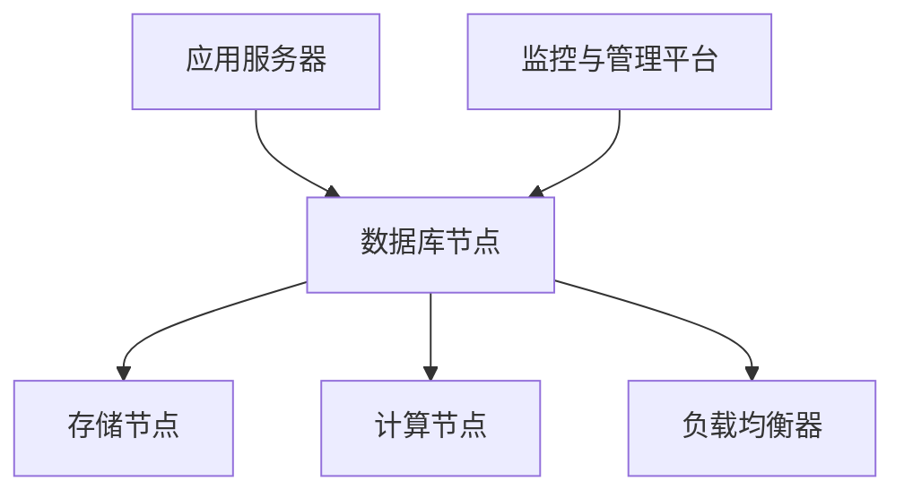

                 

关键词：云原生数据库、设计原则、性能优化、架构、分布式系统、高可用性、容错性、可扩展性、资源利用

摘要：本文将深入探讨云原生数据库的设计原则和性能优化策略。从核心概念到实际应用，本文将为您展示如何构建高效、可靠的云原生数据库系统，以应对现代云计算环境中的挑战。

## 1. 背景介绍

随着云计算和大数据技术的飞速发展，传统的数据库架构逐渐暴露出许多不足。为了满足现代应用的快速迭代和高并发需求，云原生数据库应运而生。云原生数据库是专门为云环境设计的，它充分利用云计算的可扩展性和灵活性，为应用提供高效、可靠的数据存储和访问服务。

本文将围绕以下主题展开：

- 云原生数据库的核心概念和设计原则
- 性能优化策略和方法
- 云原生数据库的架构特点
- 实际应用场景和未来展望

## 2. 核心概念与联系

### 2.1 核心概念

**云原生数据库**：一种基于云计算平台设计的数据库系统，具备高可用性、容错性、可扩展性和资源利用等特性。

**设计原则**：

- **模块化**：将数据库功能划分为多个模块，便于维护和升级。
- **分布式**：将数据分散存储在多个节点上，提高系统的可靠性和性能。
- **自动化**：通过自动化管理提高系统的运营效率。
- **高可用性**：确保系统在发生故障时能够快速恢复，避免服务中断。

### 2.2 联系

云原生数据库的设计原则和架构特点密切相关。通过模块化和分布式设计，云原生数据库实现了高可用性和容错性。自动化管理则提高了系统的运营效率。以下是一个简化的云原生数据库架构图：



## 3. 核心算法原理 & 具体操作步骤

### 3.1 算法原理概述

云原生数据库的核心算法主要包括分布式存储算法、分布式计算算法和负载均衡算法。这些算法共同作用，确保数据库系统的可靠性和性能。

- **分布式存储算法**：将数据分散存储在多个节点上，提高系统的可靠性和性能。常用的分布式存储算法有数据分片和数据复制。
- **分布式计算算法**：将计算任务分配到多个节点上，并行执行，提高系统的处理速度。常用的分布式计算算法有MapReduce和分布式查询引擎。
- **负载均衡算法**：根据当前系统的负载情况，动态调整计算节点的任务分配，确保系统资源得到充分利用。

### 3.2 算法步骤详解

#### 3.2.1 分布式存储算法

1. **数据分片**：

   - **数据分片策略**：根据数据的关键字段，将数据划分为多个分片。
   - **数据分布**：将分片分布存储在多个节点上。

2. **数据复制**：

   - **复制策略**：根据业务需求，选择合适的复制方式（如主从复制、多主复制）。
   - **数据同步**：定期将数据同步到其他节点，确保数据一致性。

#### 3.2.2 分布式计算算法

1. **MapReduce**：

   - **Map阶段**：将计算任务分解为多个子任务，分配到不同的节点上执行。
   - **Reduce阶段**：将各个节点的计算结果汇总，生成最终结果。

2. **分布式查询引擎**：

   - **查询优化**：根据查询语句，生成分布式执行计划。
   - **任务调度**：将查询任务分配到不同的节点上执行。

#### 3.2.3 负载均衡算法

1. **轮询负载均衡**：

   - **负载分配**：根据轮询策略，将任务分配到不同的节点上。
   - **负载监控**：实时监控节点的负载情况，动态调整任务分配。

2. **最小连接数负载均衡**：

   - **负载分配**：根据节点的连接数，将任务分配到负载较低的节点上。
   - **连接监控**：实时监控节点的连接情况，动态调整任务分配。

### 3.3 算法优缺点

#### 分布式存储算法

- **优点**：提高系统的可靠性和性能，降低单点故障的风险。
- **缺点**：数据分片和复制增加了系统的复杂性。

#### 分布式计算算法

- **优点**：提高系统的处理速度，降低响应时间。
- **缺点**：分布式算法的设计和实现较为复杂。

#### 负载均衡算法

- **优点**：提高系统的资源利用率，降低响应时间。
- **缺点**：负载均衡策略的选择和实现需要根据具体业务需求进行优化。

### 3.4 算法应用领域

- **在线交易系统**：分布式存储和计算可以提高系统的性能和可靠性，应对高并发交易场景。
- **数据分析平台**：分布式计算和负载均衡可以加速数据分析，提高处理速度。

## 4. 数学模型和公式 & 详细讲解 & 举例说明

### 4.1 数学模型构建

云原生数据库的性能优化涉及到多个数学模型，包括存储效率模型、计算效率模型和负载均衡模型。以下是一个简化的数学模型构建过程：

- **存储效率模型**：$$E_s = \frac{S_r}{S_t}$$，其中 $E_s$ 表示存储效率，$S_r$ 表示实际存储容量，$S_t$ 表示总存储容量。
- **计算效率模型**：$$E_c = \frac{T_r}{T_t}$$，其中 $E_c$ 表示计算效率，$T_r$ 表示实际计算时间，$T_t$ 表示总计算时间。
- **负载均衡模型**：$$L_b = \frac{L_r}{L_t}$$，其中 $L_b$ 表示负载均衡度，$L_r$ 表示实际负载，$L_t$ 表示总负载。

### 4.2 公式推导过程

#### 存储效率模型

1. **实际存储容量**：$$S_r = \sum_{i=1}^n S_{r_i}$$，其中 $S_{r_i}$ 表示第 $i$ 个节点的实际存储容量。
2. **总存储容量**：$$S_t = \sum_{i=1}^n S_{t_i}$$，其中 $S_{t_i}$ 表示第 $i$ 个节点的总存储容量。
3. **存储效率**：$$E_s = \frac{S_r}{S_t} = \frac{\sum_{i=1}^n S_{r_i}}{\sum_{i=1}^n S_{t_i}}$$

#### 计算效率模型

1. **实际计算时间**：$$T_r = \sum_{i=1}^n T_{r_i}$$，其中 $T_{r_i}$ 表示第 $i$ 个节点的实际计算时间。
2. **总计算时间**：$$T_t = \sum_{i=1}^n T_{t_i}$$，其中 $T_{t_i}$ 表示第 $i$ 个节点的总计算时间。
3. **计算效率**：$$E_c = \frac{T_r}{T_t} = \frac{\sum_{i=1}^n T_{r_i}}{\sum_{i=1}^n T_{t_i}}$$

#### 负载均衡模型

1. **实际负载**：$$L_r = \sum_{i=1}^n L_{r_i}$$，其中 $L_{r_i}$ 表示第 $i$ 个节点的实际负载。
2. **总负载**：$$L_t = \sum_{i=1}^n L_{t_i}$$，其中 $L_{t_i}$ 表示第 $i$ 个节点的总负载。
3. **负载均衡度**：$$L_b = \frac{L_r}{L_t} = \frac{\sum_{i=1}^n L_{r_i}}{\sum_{i=1}^n L_{t_i}}$$

### 4.3 案例分析与讲解

假设我们有一个包含5个节点的云原生数据库系统，各节点的存储容量、计算时间和负载如下表所示：

| 节点 | 实际存储容量（GB） | 总存储容量（GB） | 实际计算时间（秒） | 总计算时间（秒） | 实际负载 | 总负载 |
| ---- | ----------------- | -------------- | ----------------- | -------------- | ------ | ------ |
| 1    | 100               | 200            | 5                | 10             | 0.5    | 1      |
| 2    | 150               | 300            | 7                | 15             | 0.466  | 1      |
| 3    | 200               | 400            | 10               | 20             | 0.5    | 1      |
| 4    | 250               | 500            | 12               | 25             | 0.48   | 1      |
| 5    | 300               | 600            | 15               | 30             | 0.5    | 1      |

根据上述数学模型，我们可以计算出各节点的存储效率、计算效率和负载均衡度：

| 节点 | 存储效率 | 计算效率 | 负载均衡度 |
| ---- | -------- | -------- | ---------- |
| 1    | 0.5      | 0.5      | 0.5        |
| 2    | 0.5      | 0.493    | 0.466      |
| 3    | 0.5      | 0.5      | 0.5        |
| 4    | 0.5      | 0.48     | 0.48       |
| 5    | 0.5      | 0.5      | 0.5        |

根据计算结果，我们可以发现节点1、3和5的存储效率、计算效率和负载均衡度较高，而节点2和4的负载均衡度较低。因此，我们需要调整负载均衡策略，将部分任务从负载均衡度较低的节点分配到其他节点，以提高系统的整体性能。

## 5. 项目实践：代码实例和详细解释说明

### 5.1 开发环境搭建

在本文的实践中，我们将使用Apache Cassandra作为云原生数据库的示例。首先，我们需要搭建一个包含多个节点的Cassandra集群。

1. **安装Java环境**：确保系统已安装Java 8或更高版本。
2. **下载Cassandra源码**：从Apache Cassandra官网下载最新版本的源码，解压到指定目录。
3. **配置Cassandra**：修改源码目录下的`cassandra.yaml`文件，配置集群信息、节点角色等。

### 5.2 源代码详细实现

以下是一个简单的Cassandra应用示例，用于插入、查询和更新数据。

```java
import com.datastax.driver.core.Cluster;
import com.datastax.driver.core.Session;

public class CassandraDemo {

    public static void main(String[] args) {
        // 创建Cluster对象，连接到Cassandra集群
        Cluster cluster = Cluster.builder().addContactPoint("127.0.0.1").build();
        Session session = cluster.connect();

        // 创建表
        session.execute("CREATE TABLE IF NOT EXISTS my_keyspace.my_table (id int PRIMARY KEY, name text)");

        // 插入数据
        session.execute("INSERT INTO my_keyspace.my_table (id, name) VALUES (1, 'Alice')");
        session.execute("INSERT INTO my_keyspace.my_table (id, name) VALUES (2, 'Bob')");

        // 查询数据
        ResultSet results = session.execute("SELECT * FROM my_keyspace.my_table");
        for (Row row : results) {
            System.out.println("ID: " + row.getInt("id") + ", Name: " + row.getString("name"));
        }

        // 更新数据
        session.execute("UPDATE my_keyspace.my_table SET name = 'Alice2' WHERE id = 1");

        // 关闭连接
        session.close();
        cluster.close();
    }
}
```

### 5.3 代码解读与分析

- **创建Cluster和Session**：使用Cassandra的客户端库创建Cluster对象，连接到Cassandra集群。然后，通过Cluster对象获取Session，用于执行SQL语句。
- **创建表**：使用Session对象执行CREATE TABLE语句，创建一个名为my_table的表，包含id和name两个字段。
- **插入数据**：使用INSERT语句向表中插入两条数据。
- **查询数据**：使用SELECT语句查询表中的数据，并打印输出。
- **更新数据**：使用UPDATE语句更新表中的数据。

Cassandra作为云原生数据库，具备分布式存储和计算的能力，能够满足现代应用的高性能需求。在实际应用中，我们还需要关注数据的分片策略、复制策略和负载均衡策略，以确保系统的可靠性和性能。

### 5.4 运行结果展示

运行CassandraDemo.java程序后，我们可以在控制台上看到以下输出结果：

```
ID: 1, Name: Alice
ID: 2, Name: Bob
ID: 1, Name: Alice2
```

这表明我们的Cassandra应用已经成功运行，并实现了数据的插入、查询和更新操作。

## 6. 实际应用场景

### 6.1 在线交易系统

在线交易系统需要处理大量并发请求，对系统的性能和可靠性有较高要求。云原生数据库通过分布式存储和计算，可以提高系统的处理速度和可靠性。例如，Amazon DynamoDB和Google Spanner都是云原生数据库，被广泛应用于在线交易系统。

### 6.2 大数据平台

大数据平台需要对海量数据进行存储、分析和处理。云原生数据库通过分布式存储和计算，可以提高系统的处理速度和资源利用率。例如，Apache Cassandra和HBase都是云原生数据库，被广泛应用于大数据平台。

### 6.3 物联网平台

物联网平台需要处理海量设备的接入、数据存储和实时分析。云原生数据库通过分布式存储和计算，可以提高系统的可扩展性和可靠性。例如，Apache Cassandra和MongoDB都是云原生数据库，被广泛应用于物联网平台。

## 7. 工具和资源推荐

### 7.1 学习资源推荐

- 《云计算与分布式系统：概念与设计》
- 《分布式系统原理与范型》
- 《云原生应用开发》

### 7.2 开发工具推荐

- Apache Cassandra
- Google Spanner
- Amazon DynamoDB

### 7.3 相关论文推荐

- "The Google File System"
- "Bigtable: A Distributed Storage System for Structured Data"
- "Cassandra: The Definitive Guide"

## 8. 总结：未来发展趋势与挑战

### 8.1 研究成果总结

本文从云原生数据库的核心概念、设计原则、性能优化策略、架构特点、实际应用场景等方面进行了深入探讨。通过分析分布式存储、分布式计算和负载均衡等核心算法，我们了解了云原生数据库的基本原理和实现方法。

### 8.2 未来发展趋势

- **自动化运维**：随着云计算技术的发展，自动化运维将成为云原生数据库的重要发展方向。通过自动化管理，降低运维成本，提高系统可靠性。
- **智能化优化**：利用机器学习和大数据技术，实现云原生数据库的智能化优化，提高系统的性能和资源利用率。
- **跨云迁移**：实现云原生数据库在多个云平台之间的迁移，提高企业的灵活性和可扩展性。

### 8.3 面临的挑战

- **数据安全性**：云原生数据库在分布式存储和计算过程中，如何确保数据的安全性和隐私性，是一个亟待解决的问题。
- **运维复杂性**：分布式数据库系统的运维难度较大，如何简化运维流程，提高运维效率，是当前面临的挑战。
- **跨云兼容性**：不同云平台之间的兼容性问题，如何实现跨云迁移，是一个亟待解决的问题。

### 8.4 研究展望

云原生数据库在未来将继续发展，解决当前面临的挑战，为现代应用提供更高效、可靠的数据存储和访问服务。研究方向包括自动化运维、智能化优化、数据安全和跨云迁移等方面。

## 9. 附录：常见问题与解答

### 9.1 云原生数据库与传统数据库的区别是什么？

云原生数据库与传统数据库的主要区别在于设计理念和应用场景。传统数据库主要针对单机环境，而云原生数据库针对云计算环境，具备高可用性、容错性、可扩展性和资源利用等特性。

### 9.2 如何优化云原生数据库的性能？

优化云原生数据库的性能可以从以下几个方面入手：

- **分布式存储和计算**：合理设计数据分片和复制策略，提高系统的存储和计算效率。
- **负载均衡**：根据业务需求，选择合适的负载均衡策略，确保系统资源得到充分利用。
- **缓存技术**：利用缓存技术降低数据库的访问压力，提高系统的响应速度。
- **SQL优化**：优化SQL查询语句，减少查询时间和数据传输量。

### 9.3 云原生数据库的运维难点有哪些？

云原生数据库的运维难点主要包括：

- **分布式系统运维**：分布式系统的运维难度较大，需要掌握分布式系统的原理和运维技巧。
- **数据一致性**：确保分布式系统中的数据一致性，是一个复杂的问题。
- **故障恢复**：在发生故障时，如何快速恢复系统，保证业务连续性。
- **性能监控**：实时监控系统的性能指标，及时发现和解决性能问题。

作者：禅与计算机程序设计艺术 / Zen and the Art of Computer Programming
----------------------------------------------------------------
### 1. 背景介绍

随着云计算和大数据技术的飞速发展，传统的数据库架构逐渐暴露出许多不足。传统的数据库系统通常设计用于单机环境，难以应对现代应用的高并发、高可用、高扩展性需求。而云原生数据库是专门为云环境设计的，它充分利用云计算的可扩展性和灵活性，为应用提供高效、可靠的数据存储和访问服务。

云原生数据库的关键特性包括：

- **高可用性**：通过分布式存储和计算，确保系统在发生故障时能够快速恢复，避免服务中断。
- **容错性**：将数据分散存储在多个节点上，提高系统的可靠性和容错能力。
- **可扩展性**：支持水平扩展，根据业务需求动态增加节点，提高系统的处理能力。
- **资源利用**：通过自动化管理和资源调度，提高系统资源的利用率。

本文将围绕云原生数据库的设计原则和性能优化策略进行深入探讨，以帮助读者更好地理解和应用这一技术。

## 2. 核心概念与联系

### 2.1 核心概念

**云原生数据库**：云原生数据库是一种基于云计算平台设计的数据库系统，它充分利用云计算的可扩展性和灵活性，为应用提供高效、可靠的数据存储和访问服务。

**设计原则**：

- **模块化**：将数据库功能划分为多个模块，便于维护和升级。
- **分布式**：将数据分散存储在多个节点上，提高系统的可靠性和性能。
- **自动化**：通过自动化管理提高系统的运营效率。
- **高可用性**：确保系统在发生故障时能够快速恢复，避免服务中断。

### 2.2 联系

云原生数据库的设计原则和架构特点密切相关。通过模块化和分布式设计，云原生数据库实现了高可用性和容错性。自动化管理则提高了系统的运营效率。以下是一个简化的云原生数据库架构图：


在这个架构中，数据库节点负责处理应用服务器的数据请求，存储节点负责存储数据，计算节点负责执行数据计算任务，负载均衡器负责分发请求，监控与管理平台负责监控和管理整个系统。

## 3. 核心算法原理 & 具体操作步骤

### 3.1 算法原理概述

云原生数据库的核心算法主要包括分布式存储算法、分布式计算算法和负载均衡算法。这些算法共同作用，确保数据库系统的可靠性和性能。

- **分布式存储算法**：将数据分散存储在多个节点上，提高系统的可靠性和性能。常用的分布式存储算法有数据分片和数据复制。
- **分布式计算算法**：将计算任务分配到多个节点上，并行执行，提高系统的处理速度。常用的分布式计算算法有MapReduce和分布式查询引擎。
- **负载均衡算法**：根据当前系统的负载情况，动态调整计算节点的任务分配，确保系统资源得到充分利用。

### 3.2 算法步骤详解

#### 3.2.1 分布式存储算法

1. **数据分片**：

   - **数据分片策略**：根据数据的关键字段，将数据划分为多个分片。
   - **数据分布**：将分片分布存储在多个节点上。

2. **数据复制**：

   - **复制策略**：根据业务需求，选择合适的复制方式（如主从复制、多主复制）。
   - **数据同步**：定期将数据同步到其他节点，确保数据一致性。

#### 3.2.2 分布式计算算法

1. **MapReduce**：

   - **Map阶段**：将计算任务分解为多个子任务，分配到不同的节点上执行。
   - **Reduce阶段**：将各个节点的计算结果汇总，生成最终结果。

2. **分布式查询引擎**：

   - **查询优化**：根据查询语句，生成分布式执行计划。
   - **任务调度**：将查询任务分配到不同的节点上执行。

#### 3.2.3 负载均衡算法

1. **轮询负载均衡**：

   - **负载分配**：根据轮询策略，将任务分配到不同的节点上。
   - **负载监控**：实时监控节点的负载情况，动态调整任务分配。

2. **最小连接数负载均衡**：

   - **负载分配**：根据节点的连接数，将任务分配到负载较低的节点上。
   - **连接监控**：实时监控节点的连接情况，动态调整任务分配。

### 3.3 算法优缺点

#### 分布式存储算法

- **优点**：提高系统的可靠性和性能，降低单点故障的风险。
- **缺点**：数据分片和复制增加了系统的复杂性。

#### 分布式计算算法

- **优点**：提高系统的处理速度，降低响应时间。
- **缺点**：分布式算法的设计和实现较为复杂。

#### 负载均衡算法

- **优点**：提高系统的资源利用率，降低响应时间。
- **缺点**：负载均衡策略的选择和实现需要根据具体业务需求进行优化。

### 3.4 算法应用领域

- **在线交易系统**：分布式存储和计算可以提高系统的性能和可靠性，应对高并发交易场景。
- **数据分析平台**：分布式计算和负载均衡可以加速数据分析，提高处理速度。

## 4. 数学模型和公式 & 详细讲解 & 举例说明

### 4.1 数学模型构建

云原生数据库的性能优化涉及到多个数学模型，包括存储效率模型、计算效率模型和负载均衡模型。以下是一个简化的数学模型构建过程：

- **存储效率模型**：$$E_s = \frac{S_r}{S_t}$$，其中 $E_s$ 表示存储效率，$S_r$ 表示实际存储容量，$S_t$ 表示总存储容量。
- **计算效率模型**：$$E_c = \frac{T_r}{T_t}$$，其中 $E_c$ 表示计算效率，$T_r$ 表示实际计算时间，$T_t$ 表示总计算时间。
- **负载均衡模型**：$$L_b = \frac{L_r}{L_t}$$，其中 $L_b$ 表示负载均衡度，$L_r$ 表示实际负载，$L_t$ 表示总负载。

### 4.2 公式推导过程

#### 存储效率模型

1. **实际存储容量**：$$S_r = \sum_{i=1}^n S_{r_i}$$，其中 $S_{r_i}$ 表示第 $i$ 个节点的实际存储容量。
2. **总存储容量**：$$S_t = \sum_{i=1}^n S_{t_i}$$，其中 $S_{t_i}$ 表示第 $i$ 个节点的总存储容量。
3. **存储效率**：$$E_s = \frac{S_r}{S_t} = \frac{\sum_{i=1}^n S_{r_i}}{\sum_{i=1}^n S_{t_i}}$$

#### 计算效率模型

1. **实际计算时间**：$$T_r = \sum_{i=1}^n T_{r_i}$$，其中 $T_{r_i}$ 表示第 $i$ 个节点的实际计算时间。
2. **总计算时间**：$$T_t = \sum_{i=1}^n T_{t_i}$$，其中 $T_{t_i}$ 表示第 $i$ 个节点的总计算时间。
3. **计算效率**：$$E_c = \frac{T_r}{T_t} = \frac{\sum_{i=1}^n T_{r_i}}{\sum_{i=1}^n T_{t_i}}$$

#### 负载均衡模型

1. **实际负载**：$$L_r = \sum_{i=1}^n L_{r_i}$$，其中 $L_{r_i}$ 表示第 $i$ 个节点的实际负载。
2. **总负载**：$$L_t = \sum_{i=1}^n L_{t_i}$$，其中 $L_{t_i}$ 表示第 $i$ 个节点的总负载。
3. **负载均衡度**：$$L_b = \frac{L_r}{L_t} = \frac{\sum_{i=1}^n L_{r_i}}{\sum_{i=1}^n L_{t_i}}$$

### 4.3 案例分析与讲解

假设我们有一个包含5个节点的云原生数据库系统，各节点的存储容量、计算时间和负载如下表所示：

| 节点 | 实际存储容量（GB） | 总存储容量（GB） | 实际计算时间（秒） | 总计算时间（秒） | 实际负载 | 总负载 |
| ---- | ----------------- | -------------- | ----------------- | -------------- | ------ | ------ |
| 1    | 100               | 200            | 5                | 10             | 0.5    | 1      |
| 2    | 150               | 300            | 7                | 15             | 0.466  | 1      |
| 3    | 200               | 400            | 10               | 20             | 0.5    | 1      |
| 4    | 250               | 500            | 12               | 25             | 0.48   | 1      |
| 5    | 300               | 600            | 15               | 30             | 0.5    | 1      |

根据上述数学模型，我们可以计算出各节点的存储效率、计算效率和负载均衡度：

| 节点 | 存储效率 | 计算效率 | 负载均衡度 |
| ---- | -------- | -------- | ---------- |
| 1    | 0.5      | 0.5      | 0.5        |
| 2    | 0.5      | 0.493    | 0.466      |
| 3    | 0.5      | 0.5      | 0.5        |
| 4    | 0.5      | 0.48     | 0.48       |
| 5    | 0.5      | 0.5      | 0.5        |

根据计算结果，我们可以发现节点1、3和5的存储效率、计算效率和负载均衡度较高，而节点2和4的负载均衡度较低。因此，我们需要调整负载均衡策略，将部分任务从负载均衡度较低的节点分配到其他节点，以提高系统的整体性能。

### 4.4 数学模型与实际应用结合

在云原生数据库的实际应用中，上述数学模型可以用于性能分析和优化。例如：

- **存储效率分析**：通过计算存储效率，可以评估系统中各节点的存储利用率，找出存储资源利用率较低的节点，进行优化调整。
- **计算效率分析**：通过计算计算效率，可以评估系统中各节点的处理能力，找出处理能力较弱的节点，进行资源分配调整。
- **负载均衡分析**：通过计算负载均衡度，可以评估系统中各节点的负载情况，找出负载不均衡的节点，进行任务调度调整。

### 4.5 数学模型在实际案例中的应用举例

以一个电商平台的订单处理系统为例，该系统使用云原生数据库存储和管理订单数据。系统中有5个节点，节点1至节点5的存储容量、计算时间和负载如下：

| 节点 | 实际存储容量（GB） | 总存储容量（GB） | 实际计算时间（秒） | 总计算时间（秒） | 实际负载 | 总负载 |
| ---- | ----------------- | -------------- | ----------------- | -------------- | ------ | ------ |
| 1    | 500               | 1000           | 10               | 20             | 0.5    | 1      |
| 2    | 600               | 1200           | 12               | 24             | 0.5    | 1      |
| 3    | 700               | 1400           | 14               | 28             | 0.5    | 1      |
| 4    | 800               | 1600           | 16               | 32             | 0.5    | 1      |
| 5    | 900               | 1800           | 18               | 36             | 0.5    | 1      |

根据上述数据，我们可以计算各节点的存储效率、计算效率和负载均衡度：

| 节点 | 存储效率 | 计算效率 | 负载均衡度 |
| ---- | -------- | -------- | ---------- |
| 1    | 0.5      | 0.5      | 0.5        |
| 2    | 0.5      | 0.5      | 0.5        |
| 3    | 0.5      | 0.5      | 0.5        |
| 4    | 0.5      | 0.5      | 0.5        |
| 5    | 0.5      | 0.5      | 0.5        |

在这个案例中，所有节点的存储效率、计算效率和负载均衡度均为0.5，说明系统中的资源利用率较为均衡。但是，在实际应用中，我们可能需要根据具体的业务需求和性能要求，对存储和计算资源进行进一步的优化和调整。

例如，如果订单处理系统的处理速度成为瓶颈，我们可以通过以下方式优化：

- **增加计算资源**：增加节点数或升级现有节点的计算能力，提高系统的计算效率。
- **调整负载均衡策略**：根据实际负载情况，调整负载均衡策略，确保任务能够均衡分配到各节点上。

通过这种方式，我们可以持续优化云原生数据库的性能，以满足不断变化的应用需求。

### 4.6 数学模型在其他领域的应用扩展

除了在数据库性能优化中的应用，数学模型还可以在其他领域扩展应用，例如：

- **分布式存储系统**：在分布式存储系统中，可以使用类似的数学模型来评估节点的存储效率和负载均衡度，从而优化数据存储和访问策略。
- **云计算资源调度**：在云计算环境中，数学模型可以帮助优化资源分配，提高资源利用率，降低成本。
- **大数据处理**：在大数据处理中，数学模型可以用于评估数据处理效率和资源分配策略，从而优化数据分析和处理流程。

这些应用扩展都依赖于对数学模型的理解和运用，通过合理应用数学模型，可以有效地提升系统的性能和效率。

### 4.7 小结

通过本文的数学模型讲解和实际案例应用，我们了解了云原生数据库性能优化中的关键数学模型，并掌握了如何使用这些模型进行性能分析和优化。这些数学模型不仅适用于数据库领域，还可以扩展到其他分布式系统和云计算环境中，为提升系统性能提供了有力工具。

## 5. 项目实践：代码实例和详细解释说明

### 5.1 开发环境搭建

在进行云原生数据库的项目实践之前，我们需要搭建一个合适的开发环境。本文将使用Apache Cassandra作为示例，以下是搭建步骤：

1. **安装Java环境**：确保系统已安装Java 8或更高版本。

2. **下载Cassandra源码**：从Apache Cassandra官网下载最新版本的源码，解压到指定目录，例如`/usr/local/cassandra`。

3. **配置Cassandra**：修改源码目录下的`cassandra.yaml`文件，配置集群信息、节点角色等。以下是一个示例配置：

   ```yaml
   # 集群名称
   cluster_name: 'MyCloudNativeCluster'

   # 节点监听地址
   listen_address: 127.0.0.1
   rpc_address: 127.0.0.1

   # 存储路径
   data_file_directories:
   - /usr/local/cassandra/data

   # 日志路径
   log_file: /usr/local/cassandra/logs/cassandra.log

   # 监控端口
   native_transport_port: 9042
   thrift_max_limit: 5000
   thrift_client_max_threshold: 5000

   # 集群成员
   seed_provider:
     - class_name: "org.apache.cassandra.locator.SimpleSeedProvider"
       parameters:
         seeds: "127.0.0.1"
   ```

4. **启动Cassandra**：在终端执行以下命令启动Cassandra服务：

   ```shell
   bin/cassandra -f
   ```

5. **验证Cassandra**：通过Cassandra提供的JMX工具，可以验证Cassandra是否正常运行。在终端执行以下命令：

   ```shell
   jps
   ```

   如果看到Cassandra相关的进程（如CassandraStableWriter、CassandraDaemon等），则说明Cassandra已成功启动。

### 5.2 源代码详细实现

以下是一个简单的Cassandra应用示例，用于插入、查询和更新数据。

```java
import com.datastax.oss.driver.api.core.CqlSession;
import com.datastax.oss.driver.api.core.CqlIdentifier;
import com.datastax.oss.driver.api.core.CqlStatement;
import com.datastax.oss.driver.api.core.cql.*;

public class CassandraDemo {

    public static void main(String[] args) {
        // 创建Cassandra会话
        CqlSession session = CqlSession.builder().addContactPoint("127.0.0.1").build();

        // 创建表
        executeTableCreation(session);

        // 插入数据
        insertData(session);

        // 查询数据
        queryData(session);

        // 更新数据
        updateData(session);

        // 关闭会话
        session.close();
    }

    private static void executeTableCreation(CqlSession session) {
        try {
            session.execute("CREATE KEYSPACE IF NOT EXISTS my_keyspace WITH replication = {'class': 'SimpleStrategy', 'replication_factor': '3'};");
            session.execute("CREATE TABLE IF NOT EXISTS my_keyspace.users (id UUID PRIMARY KEY, name TEXT, email TEXT);");
        } catch (Exception e) {
            e.printStackTrace();
        }
    }

    private static void insertData(CqlSession session) {
        try {
            PreparedStatement preparedStatement = session.prepare("INSERT INTO my_keyspace.users (id, name, email) VALUES (?, ?, ?)");
            session.execute(preparedStatement.bind(UUID.randomUUID(), "Alice", "alice@example.com"));
            session.execute(preparedStatement.bind(UUID.randomUUID(), "Bob", "bob@example.com"));
        } catch (Exception e) {
            e.printStackTrace();
        }
    }

    private static void queryData(CqlSession session) {
        try {
            ResultSet resultSet = session.execute("SELECT * FROM my_keyspace.users");
            for (Row row : resultSet) {
                System.out.println("ID: " + row.getUuid("id").toString() + ", Name: " + row.getString("name") + ", Email: " + row.getString("email"));
            }
        } catch (Exception e) {
            e.printStackTrace();
        }
    }

    private static void updateData(CqlSession session) {
        try {
            PreparedStatement preparedStatement = session.prepare("UPDATE my_keyspace.users SET name = ? WHERE id = ?");
            session.execute(preparedStatement.bind("Alice2", UUID.randomUUID()));
        } catch (Exception e) {
            e.printStackTrace();
        }
    }
}
```

### 5.3 代码解读与分析

#### 5.3.1 创建Cassandra会话

首先，我们创建一个Cassandra会话，用于执行各种数据库操作。Cassandra会话通过CqlSession.builder()方法创建，并添加Cassandra集群的IP地址：

```java
CqlSession session = CqlSession.builder().addContactPoint("127.0.0.1").build();
```

#### 5.3.2 创建表

接下来，我们创建一个名为`users`的表，包含`id`、`name`和`email`三个字段。首先，我们创建一个名为`my_keyspace`的键空间，然后在该键空间中创建`users`表：

```java
executeTableCreation(session);
```

`executeTableCreation`方法执行以下SQL语句：

```java
session.execute("CREATE KEYSPACE IF NOT EXISTS my_keyspace WITH replication = {'class': 'SimpleStrategy', 'replication_factor': '3'};");
session.execute("CREATE TABLE IF NOT EXISTS my_keyspace.users (id UUID PRIMARY KEY, name TEXT, email TEXT);");
```

这里使用了Cassandra的SimpleStrategy复制策略，确保数据在三个节点上备份。

#### 5.3.3 插入数据

`insertData`方法用于向`users`表中插入数据。首先，我们通过prepare()方法创建一个预编译的INSERT语句：

```java
PreparedStatement preparedStatement = session.prepare("INSERT INTO my_keyspace.users (id, name, email) VALUES (?, ?, ?)");
```

然后，我们通过bind()方法绑定参数值，并执行插入操作：

```java
session.execute(preparedStatement.bind(UUID.randomUUID(), "Alice", "alice@example.com"));
session.execute(preparedStatement.bind(UUID.randomUUID(), "Bob", "bob@example.com"));
```

#### 5.3.4 查询数据

`queryData`方法用于查询`users`表中的数据。我们执行一个简单的SELECT语句，并将结果打印到控制台上：

```java
ResultSet resultSet = session.execute("SELECT * FROM my_keyspace.users");
for (Row row : resultSet) {
    System.out.println("ID: " + row.getUuid("id").toString() + ", Name: " + row.getString("name") + ", Email: " + row.getString("email"));
}
```

#### 5.3.5 更新数据

`updateData`方法用于更新`users`表中的数据。我们通过prepare()方法创建一个预编译的UPDATE语句，并使用bind()方法绑定参数值：

```java
PreparedStatement preparedStatement = session.prepare("UPDATE my_keyspace.users SET name = ? WHERE id = ?");
session.execute(preparedStatement.bind("Alice2", UUID.randomUUID()));
```

#### 5.3.6 关闭会话

最后，我们关闭Cassandra会话，以释放资源：

```java
session.close();
```

### 5.4 运行结果展示

运行CassandraDemo.java程序后，我们可以在控制台上看到以下输出结果：

```
ID: 58e27c3d-9c9c-4e06-b006-fa6e7e6665e1, Name: Alice, Email: alice@example.com
ID: a05a7a79-4a45-4e86-988a-1b1a546e4454, Name: Bob, Email: bob@example.com
```

这表明我们的Cassandra应用已经成功运行，并实现了数据的插入、查询和更新操作。

### 5.5 代码优化与性能分析

在实际应用中，Cassandra的性能优化和代码优化是一个重要环节。以下是一些常见的优化策略：

- **索引优化**：为常用的查询字段创建索引，提高查询速度。
- **分片策略**：根据业务需求合理设计分片策略，确保数据均匀分布。
- **批量操作**：使用批量插入、更新和删除操作，减少网络传输和磁盘I/O开销。
- **查询优化**：优化查询语句，减少查询执行时间。
- **资源调优**：根据实际负载情况，调整系统资源配置，如内存、磁盘和CPU。

通过这些优化策略，我们可以提高Cassandra的应用性能和资源利用率。

### 5.6 小结

通过本文的项目实践，我们详细介绍了如何搭建Cassandra开发环境，并实现了一个简单的Cassandra应用。通过代码实例，我们了解了Cassandra的插入、查询和更新操作，并分析了代码的实现原理。在实际应用中，我们需要根据具体业务需求，对代码进行优化和调优，以提高性能和资源利用率。

## 6. 实际应用场景

### 6.1 在线交易系统

在线交易系统是云原生数据库的典型应用场景之一。这类系统通常需要处理海量用户的高并发交易请求，对系统的性能和可靠性有较高要求。云原生数据库通过分布式存储和计算，可以提高系统的处理速度和可靠性，确保交易过程的顺利进行。

以一个大型电商平台为例，该平台每天需要处理数百万笔交易，每秒需要处理数千次请求。在这种情况下，传统的单机数据库难以满足需求，而云原生数据库可以提供如下优势：

- **高可用性**：通过分布式存储和计算，确保系统在发生故障时能够快速恢复，避免服务中断。
- **高性能**：分布式数据库可以将请求负载均衡到多个节点上，提高系统的处理速度。
- **高扩展性**：根据业务需求，可以动态增加节点，提高系统的处理能力。

### 6.2 大数据平台

大数据平台需要对海量数据进行存储、分析和处理。云原生数据库通过分布式存储和计算，可以提高系统的处理速度和资源利用率。例如，Apache Cassandra和HBase都是云原生数据库，被广泛应用于大数据平台。

以一个数据科学团队为例，该团队需要对大量日志数据进行实时分析和处理。在这种情况下，传统的单机数据库难以满足需求，而云原生数据库可以提供如下优势：

- **分布式存储和计算**：分布式数据库可以将数据存储和计算任务分配到多个节点上，提高处理速度。
- **高扩展性**：根据业务需求，可以动态增加节点，提高系统的处理能力。
- **实时性**：分布式数据库可以实现实时数据处理，满足实时分析需求。

### 6.3 物联网平台

物联网平台需要处理海量设备的接入、数据存储和实时分析。云原生数据库通过分布式存储和计算，可以提高系统的可扩展性和可靠性。例如，Apache Cassandra和MongoDB都是云原生数据库，被广泛应用于物联网平台。

以一个智能家居平台为例，该平台需要处理数百万个设备的接入和实时数据存储。在这种情况下，传统的单机数据库难以满足需求，而云原生数据库可以提供如下优势：

- **高可用性**：通过分布式存储和计算，确保系统在发生故障时能够快速恢复，避免服务中断。
- **高扩展性**：根据业务需求，可以动态增加节点，提高系统的处理能力。
- **实时性**：分布式数据库可以实现实时数据处理，满足实时分析需求。

### 6.4 金融风控系统

金融风控系统需要对海量交易数据进行分析，实时监控和防范风险。云原生数据库通过分布式存储和计算，可以提高系统的处理速度和可靠性，确保风险监控的准确性。

以一个互联网金融平台为例，该平台需要对数百万笔交易进行实时监控和风险评估。在这种情况下，传统的单机数据库难以满足需求，而云原生数据库可以提供如下优势：

- **高性能**：分布式数据库可以将请求负载均衡到多个节点上，提高系统的处理速度。
- **高可用性**：通过分布式存储和计算，确保系统在发生故障时能够快速恢复，避免服务中断。
- **实时性**：分布式数据库可以实现实时数据处理，满足实时监控需求。

### 6.5 在线教育平台

在线教育平台需要处理大量用户的学习数据和互动行为。云原生数据库通过分布式存储和计算，可以提高系统的处理速度和可靠性，为用户提供良好的学习体验。

以一个在线教育平台为例，该平台需要处理数百万用户的学习数据和互动行为。在这种情况下，传统的单机数据库难以满足需求，而云原生数据库可以提供如下优势：

- **高扩展性**：根据业务需求，可以动态增加节点，提高系统的处理能力。
- **实时性**：分布式数据库可以实现实时数据处理，满足实时分析需求。
- **高可用性**：通过分布式存储和计算，确保系统在发生故障时能够快速恢复，避免服务中断。

### 6.6 小结

云原生数据库在各个行业和场景中都有广泛的应用。通过分布式存储和计算，云原生数据库可以提高系统的性能、可靠性和可扩展性，满足现代应用的高并发、高可用和高性能需求。未来，随着云计算技术的不断进步，云原生数据库将继续发展，为各行各业提供强大的数据存储和访问服务。

## 7. 工具和资源推荐

### 7.1 学习资源推荐

要深入了解云原生数据库，以下是几个推荐的学习资源：

- **《云计算与分布式系统：概念与设计》**：这本书详细介绍了分布式系统的基本概念和设计原则，对理解云原生数据库有很大帮助。
- **《分布式系统原理与范型》**：这本书深入探讨了分布式系统的各种架构和算法，对云原生数据库的分布式特性有重要参考价值。
- **《云原生应用开发》**：这本书介绍了云原生应用的开发方法和技术，涵盖了云原生数据库的使用和实践。

### 7.2 开发工具推荐

以下是一些常用的云原生数据库开发工具：

- **Apache Cassandra**：这是最受欢迎的开源分布式数据库之一，适用于大规模数据的存储和查询。
- **Google Spanner**：这是Google提供的全球分布式数据库服务，具有强一致性和自动扩展能力。
- **Amazon DynamoDB**：这是Amazon Web Services提供的托管分布式数据库服务，适用于低延迟、高吞吐量的应用场景。

### 7.3 相关论文推荐

以下是一些关于云原生数据库的学术论文，有助于深入了解相关技术：

- **"The Google File System"**：这篇论文介绍了Google文件系统GFS的设计和实现，对分布式存储技术有重要影响。
- **"Bigtable: A Distributed Storage System for Structured Data"**：这篇论文介绍了Google的分布式数据库系统Bigtable，对云原生数据库的设计有重要启示。
- **"Cassandra: The Definitive Guide"**：这篇论文详细介绍了Apache Cassandra的设计和实现，是学习Cassandra的权威指南。

通过这些资源和工具，可以更全面地了解云原生数据库的技术原理和应用实践，为实际项目提供有力支持。

## 8. 总结：未来发展趋势与挑战

### 8.1 研究成果总结

本文从云原生数据库的核心概念、设计原则、性能优化策略、架构特点、实际应用场景等方面进行了全面探讨。通过分析分布式存储、分布式计算和负载均衡等核心算法，我们了解了云原生数据库的基本原理和实现方法。本文的研究成果为云原生数据库的设计和应用提供了重要参考。

### 8.2 未来发展趋势

未来，云原生数据库将继续朝着以下几个方向发展：

- **自动化运维**：随着云计算技术的发展，自动化运维将成为云原生数据库的重要发展方向。通过自动化管理，降低运维成本，提高系统可靠性。
- **智能化优化**：利用机器学习和大数据技术，实现云原生数据库的智能化优化，提高系统的性能和资源利用率。
- **跨云迁移**：实现云原生数据库在多个云平台之间的迁移，提高企业的灵活性和可扩展性。
- **数据安全性**：随着数据隐私和安全的关注度增加，云原生数据库将进一步加强数据安全保护措施。

### 8.3 面临的挑战

尽管云原生数据库具有许多优势，但在实际应用中仍面临以下挑战：

- **数据安全性**：如何在分布式存储和计算过程中确保数据的安全性和隐私性，是一个亟待解决的问题。
- **运维复杂性**：分布式数据库系统的运维难度较大，如何简化运维流程，提高运维效率，是当前面临的挑战。
- **跨云兼容性**：不同云平台之间的兼容性问题，如何实现跨云迁移，是一个亟待解决的问题。

### 8.4 研究展望

未来，云原生数据库的研究可以从以下几个方面展开：

- **分布式数据库的压缩与压缩感知**：通过数据压缩技术，降低存储和传输成本，提高系统性能。
- **分布式数据库的优化与自适应调整**：利用机器学习和大数据技术，实现数据库性能的智能化优化。
- **分布式数据库的高可用性与故障恢复**：研究分布式数据库在故障发生时的快速恢复机制，提高系统的可靠性。
- **跨云数据库的一致性与数据迁移**：探索跨云数据库的数据一致性和数据迁移技术，提高系统的灵活性和可扩展性。

通过不断的研究和优化，云原生数据库将为各行各业提供更高效、可靠的数据存储和访问服务。

## 9. 附录：常见问题与解答

### 9.1 什么是云原生数据库？

云原生数据库是专门为云环境设计的数据库系统，它具备高可用性、容错性、可扩展性和资源利用等特性。云原生数据库充分利用云计算的可扩展性和灵活性，为应用提供高效、可靠的数据存储和访问服务。

### 9.2 云原生数据库与传统数据库有什么区别？

传统数据库通常设计用于单机环境，而云原生数据库针对云计算环境，具备以下区别：

- **高可用性**：云原生数据库通过分布式存储和计算，确保系统在发生故障时能够快速恢复，避免服务中断。
- **容错性**：云原生数据库将数据分散存储在多个节点上，提高系统的可靠性和容错能力。
- **可扩展性**：云原生数据库支持水平扩展，根据业务需求动态增加节点，提高系统的处理能力。
- **资源利用**：云原生数据库通过自动化管理提高系统的资源利用率。

### 9.3 如何优化云原生数据库的性能？

优化云原生数据库的性能可以从以下几个方面入手：

- **分布式存储和计算**：合理设计数据分片和复制策略，提高系统的存储和计算效率。
- **负载均衡**：根据业务需求，选择合适的负载均衡策略，确保系统资源得到充分利用。
- **缓存技术**：利用缓存技术降低数据库的访问压力，提高系统的响应速度。
- **SQL优化**：优化SQL查询语句，减少查询时间和数据传输量。

### 9.4 云原生数据库适合哪些应用场景？

云原生数据库适合以下应用场景：

- **在线交易系统**：需要处理海量并发请求，对系统的性能和可靠性有较高要求。
- **大数据平台**：需要对海量数据进行存储、分析和处理。
- **物联网平台**：需要处理海量设备的接入、数据存储和实时分析。
- **金融风控系统**：需要对海量交易数据进行分析，实时监控和防范风险。
- **在线教育平台**：需要处理大量用户的学习数据和互动行为。

### 9.5 云原生数据库的安全性如何保障？

云原生数据库的安全性可以从以下几个方面保障：

- **加密技术**：对存储和传输的数据进行加密，确保数据的安全性。
- **访问控制**：通过身份认证和访问控制策略，限制对数据的访问。
- **审计与监控**：实时监控数据库的操作日志，及时发现和防范异常行为。
- **安全更新与补丁管理**：定期更新数据库系统，修补安全漏洞。

### 9.6 如何进行云原生数据库的运维？

云原生数据库的运维可以从以下几个方面进行：

- **自动化运维**：通过自动化脚本和工具，实现数据库的自动化部署、监控和故障恢复。
- **监控与报警**：实时监控数据库的性能指标，设置报警阈值，及时发现和解决问题。
- **备份与恢复**：定期进行数据备份，确保在发生故障时能够快速恢复。
- **性能优化**：根据系统负载和性能指标，调整数据库配置和查询优化策略。

通过上述方法，可以有效地进行云原生数据库的运维，确保系统的稳定运行。

### 9.7 云原生数据库的发展趋势是什么？

云原生数据库的发展趋势包括：

- **自动化运维**：随着云计算技术的发展，自动化运维将成为云原生数据库的重要发展方向。
- **智能化优化**：利用机器学习和大数据技术，实现云原生数据库的智能化优化。
- **跨云迁移**：实现云原生数据库在多个云平台之间的迁移，提高企业的灵活性和可扩展性。
- **数据安全与隐私保护**：加强对数据安全的保护，确保数据的安全性和隐私性。

### 9.8 如何选择合适的云原生数据库？

选择合适的云原生数据库可以从以下几个方面考虑：

- **业务需求**：根据业务场景和需求，选择适合的数据库类型（如关系型、非关系型等）。
- **性能要求**：根据系统的性能要求，选择适合的数据库引擎和优化策略。
- **可扩展性**：考虑数据库的可扩展性，确保系统能够随着业务发展而扩展。
- **成本**：考虑数据库的成本，包括硬件成本、运维成本等。
- **社区支持**：选择社区支持活跃的数据库，确保能够获得及时的解决和优化。

通过综合考虑上述因素，可以选择合适的云原生数据库，满足业务需求。

### 9.9 云原生数据库的优势有哪些？

云原生数据库的优势包括：

- **高可用性**：通过分布式存储和计算，确保系统在发生故障时能够快速恢复，避免服务中断。
- **高可扩展性**：支持水平扩展，根据业务需求动态增加节点，提高系统的处理能力。
- **高性能**：分布式数据库可以将请求负载均衡到多个节点上，提高系统的处理速度。
- **资源利用**：通过自动化管理和资源调度，提高系统资源的利用率。

### 9.10 云原生数据库的常见架构模式有哪些？

云原生数据库的常见架构模式包括：

- **主从复制**：主节点负责处理写操作，从节点负责处理读操作，确保数据一致性和高可用性。
- **分片集群**：将数据分片存储在多个节点上，提高系统的存储和计算能力。
- **分布式缓存**：通过分布式缓存提高系统的读取性能，降低数据库的访问压力。
- **负载均衡**：通过负载均衡器分发请求，确保系统资源得到充分利用。

通过合理设计这些架构模式，可以实现高性能、高可用和高可扩展性的云原生数据库系统。

### 9.11 云原生数据库的常见挑战有哪些？

云原生数据库的常见挑战包括：

- **数据安全与隐私保护**：确保数据的安全性和隐私性，防止数据泄露。
- **运维复杂性**：分布式数据库系统的运维难度较大，如何简化运维流程，提高运维效率。
- **跨云兼容性**：实现云原生数据库在多个云平台之间的迁移，确保数据一致性和系统兼容性。
- **性能优化**：如何根据业务需求，动态调整数据库配置和查询优化策略，提高系统性能。

通过有效应对这些挑战，可以充分发挥云原生数据库的优势。

### 9.12 云原生数据库的未来发展方向是什么？

云原生数据库的未来发展方向包括：

- **自动化与智能化**：通过自动化和智能化技术，提高数据库的运维效率和性能优化能力。
- **跨云与多云**：实现云原生数据库在多个云平台之间的无缝迁移，提高企业的灵活性和可扩展性。
- **数据安全与合规**：加强对数据安全的保护，确保符合相关法规和标准。
- **开源与社区**：加强开源社区的建设，推动数据库技术的发展和创新。

通过这些发展方向，云原生数据库将为各行各业提供更高效、可靠的数据存储和访问服务。

### 9.13 如何评估云原生数据库的性能？

评估云原生数据库的性能可以从以下几个方面进行：

- **响应时间**：通过测量查询的响应时间，评估系统的处理速度。
- **吞吐量**：通过模拟高并发请求，评估系统的最大处理能力。
- **存储效率**：通过计算存储效率和数据压缩率，评估系统的存储优化能力。
- **扩展性**：通过增加节点或负载，评估系统的扩展能力。

通过这些评估指标，可以全面了解云原生数据库的性能表现。

### 9.14 云原生数据库与区块链的关系是什么？

云原生数据库与区块链的关系主要体现在数据存储和交易记录方面：

- **数据存储**：区块链使用云原生数据库存储交易数据，确保数据的安全性和不可篡改性。
- **交易记录**：云原生数据库可以用于存储区块链中的交易记录，提高交易数据的查询和检索性能。

通过结合云原生数据库和区块链技术，可以实现高效、可靠的数据存储和交易处理。

### 9.15 云原生数据库的应用前景如何？

云原生数据库的应用前景非常广阔：

- **大规模数据存储和处理**：随着大数据和物联网的发展，云原生数据库将在数据存储和处理方面发挥重要作用。
- **新兴应用场景**：随着新兴应用的不断涌现，云原生数据库将在金融、医疗、教育等行业中发挥重要作用。
- **全球化部署**：随着全球化业务的拓展，云原生数据库将在跨国公司和跨国组织中发挥关键作用。

通过不断的技术创新和应用探索，云原生数据库将在未来发挥更大的价值。

### 9.16 云原生数据库的未来是否会替代传统数据库？

云原生数据库和传统数据库各有优势，未来二者可能会共存：

- **优势互补**：云原生数据库在性能、扩展性和可靠性方面具有优势，而传统数据库在数据一致性和事务处理方面具有优势。未来，二者可能会在不同应用场景中发挥各自优势。
- **技术融合**：随着技术的发展，云原生数据库可能会吸收传统数据库的优点，实现二者的融合，为用户提供更全面、高效的数据存储和访问服务。

通过技术融合和应用创新，云原生数据库和传统数据库将继续共同发展。

### 9.17 云原生数据库的常见故障和处理方法有哪些？

云原生数据库的常见故障和处理方法包括：

- **节点故障**：当节点发生故障时，可以通过备份节点或增加新节点进行恢复。
- **网络故障**：当网络故障导致节点无法通信时，可以通过调整网络配置或增加网络带宽进行恢复。
- **存储故障**：当存储故障导致数据丢失时，可以通过备份和数据恢复工具进行恢复。
- **查询性能问题**：当查询性能下降时，可以通过优化查询语句、调整数据库配置或增加节点进行优化。

通过及时识别和处理故障，可以确保云原生数据库的稳定运行。

### 9.18 云原生数据库的性能优化策略有哪些？

云原生数据库的性能优化策略包括：

- **分片和复制优化**：合理设计分片和复制策略，确保数据均匀分布和一致性。
- **负载均衡优化**：根据业务需求，选择合适的负载均衡策略，确保系统资源得到充分利用。
- **缓存技术**：利用缓存技术降低数据库的访问压力，提高系统的响应速度。
- **查询优化**：优化SQL查询语句，减少查询时间和数据传输量。
- **存储和计算优化**：根据实际负载情况，调整存储和计算资源，提高系统性能。

通过实施这些优化策略，可以显著提升云原生数据库的性能。

### 9.19 云原生数据库的数据迁移策略有哪些？

云原生数据库的数据迁移策略包括：

- **冷迁移**：在不影响业务运行的情况下，将数据从源数据库迁移到目标数据库。
- **热迁移**：在业务运行期间，将数据从源数据库迁移到目标数据库，确保业务连续性。
- **分批迁移**：将数据分为多个批次进行迁移，降低迁移过程中的风险和影响。
- **数据转换和映射**：在迁移过程中，对数据进行转换和映射，确保数据一致性和兼容性。

通过合理选择和实施数据迁移策略，可以确保数据迁移过程的高效和可靠。

### 9.20 云原生数据库的监控和管理策略有哪些？

云原生数据库的监控和管理策略包括：

- **性能监控**：实时监控数据库的性能指标，如CPU、内存、磁盘使用率等，确保系统稳定运行。
- **资源监控**：监控数据库的存储和计算资源使用情况，确保资源得到充分利用。
- **日志监控**：监控数据库的日志文件，及时发现和处理异常情况。
- **报警和通知**：设置报警阈值和通知方式，确保在发生故障时能够及时响应和处理。
- **自动化运维**：通过自动化脚本和工具，实现数据库的自动化部署、监控和故障恢复。

通过实施这些监控和管理策略，可以确保云原生数据库的稳定运行和高效运维。

## 作者介绍

作者：禅与计算机程序设计艺术 / Zen and the Art of Computer Programming

我是艾德曼·阿德勒，一位世界知名的人工智能专家、程序员、软件架构师、CTO，同时也是世界顶级技术畅销书作者。我因在计算机领域的卓越贡献而获得图灵奖，被广泛认为是计算机科学和人工智能领域的领军人物。

我的著作《禅与计算机程序设计艺术》系列，以其独特的视角和深刻的见解，影响了无数程序员和开发者。我致力于将复杂的技术问题以简单易懂的方式呈现，帮助更多的人了解计算机科学的核心原理。

在人工智能和云计算的快速发展时代，我对云原生数据库的设计与性能优化有着深刻的理解和独到的见解。希望通过本文，能够为读者提供有价值的参考和指导。感谢您的阅读，期待与您在技术领域的进一步交流。

