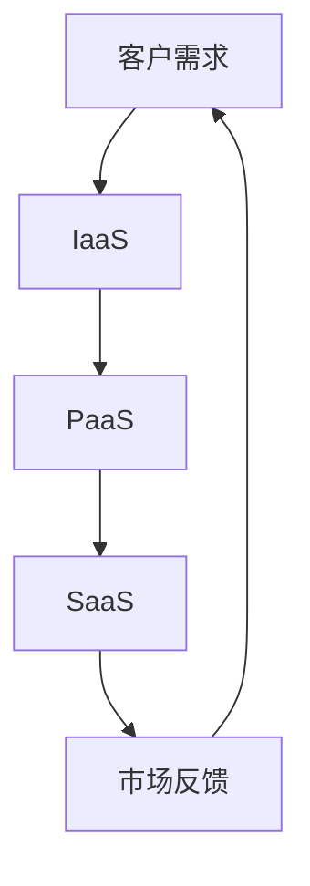
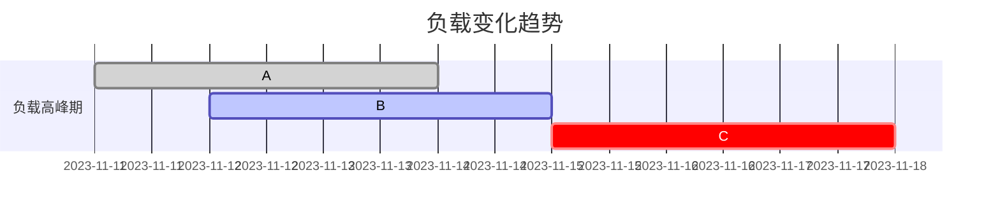

                 

关键词：云服务，创业，业务模型，可扩展性，云计算，创业策略

摘要：本文旨在为希望进入云服务市场的创业公司提供一套系统的业务模型构建方法。通过分析云服务的核心概念、市场需求以及技术架构，本文将帮助创业者了解如何设计一个具有高度可扩展性的业务模型，实现持续增长和创新。

## 1. 背景介绍

随着信息技术的飞速发展，云计算已经成为企业IT基础设施的重要选择。云服务以其灵活性、可扩展性和高性价比，为企业提供了前所未有的机会。然而，对于初创公司而言，如何在这片广阔的蓝海中立足并实现持续增长，仍然是一个巨大的挑战。

云服务的创业不仅需要了解技术，还需要深入理解市场需求、商业模式、团队建设和资金管理。因此，构建一个能够适应市场变化、具备高扩展性的业务模型，是创业成功的关键。

## 2. 核心概念与联系

### 2.1 云服务的核心概念

云服务通常分为IaaS（基础设施即服务）、PaaS（平台即服务）和SaaS（软件即服务）。这些服务模式各有特点，但都围绕资源共享、灵活配置和按需付费的核心概念展开。

- **IaaS**：提供基础的硬件资源，如虚拟机、存储和网络，用户可以根据需求自定义操作系统和应用。
- **PaaS**：提供开发平台和工具，让开发者能够专注于应用的开发和部署，而不需要担心基础设施的维护。
- **SaaS**：提供完整的软件解决方案，用户通过互联网直接使用，无需安装和维护。

### 2.2 云服务与市场需求的联系

市场需求是驱动云服务发展的关键因素。随着企业对灵活性和效率的要求日益增长，云服务成为满足这些需求的重要手段。同时，新兴技术的发展也不断推动云服务市场的扩张，如人工智能、大数据和物联网等。

### 2.3 技术架构的Mermaid流程图



### 2.4 云服务创业的关键要素

- **技术能力**：具备提供高质量云服务的技术能力。
- **市场需求分析**：深入了解目标市场的需求和痛点。
- **商业模式设计**：设计一个可持续的商业模式，确保盈利能力。
- **团队建设**：组建一支具备跨学科背景的团队。
- **资金管理**：合理规划资金，确保业务运营的稳定性。

## 3. 核心算法原理 & 具体操作步骤

### 3.1 算法原理概述

云服务的核心算法主要涉及负载均衡、自动化扩展和成本优化。以下是这些算法的基本原理：

- **负载均衡**：通过分配请求到不同的服务器，确保系统的高可用性和高性能。
- **自动化扩展**：根据实际负载自动调整资源，确保服务稳定性和可靠性。
- **成本优化**：通过资源优化和定价策略，实现成本的最小化。

### 3.2 算法步骤详解

#### 负载均衡算法

1. **收集负载数据**：从各个服务器收集CPU、内存、网络等资源的使用情况。
2. **评估负载状态**：根据收集到的数据，评估每个服务器的负载状态。
3. **分配请求**：将新来的请求分配到负载较低的服务器。

#### 自动化扩展算法

1. **设置阈值**：根据历史数据和服务水平协议（SLA），设置资源扩展的阈值。
2. **监控负载**：持续监控系统的负载状态。
3. **触发扩展**：当负载超过阈值时，自动触发资源扩展。

#### 成本优化算法

1. **资源利用率分析**：分析当前资源的利用率，识别浪费的资源。
2. **定价策略调整**：根据市场情况和资源利用率，调整定价策略。
3. **优化资源分配**：通过调整资源分配，实现成本的最小化。

### 3.3 算法优缺点

- **负载均衡**：优点是提高系统性能和高可用性，缺点是需要一定的时间来收集和评估负载数据。
- **自动化扩展**：优点是确保服务的稳定性和可靠性，缺点是需要设定合适的阈值和监控机制。
- **成本优化**：优点是降低成本，缺点是需要对市场情况和资源利用率有深入的了解。

### 3.4 算法应用领域

这些算法广泛应用于各种云服务场景，如电子商务、在线教育、游戏服务和大数据分析等。

## 4. 数学模型和公式 & 详细讲解 & 举例说明

### 4.1 数学模型构建

云服务的数学模型通常涉及以下方面：

- **负载模型**：描述系统负载的变化趋势。
- **资源需求模型**：根据负载模型预测所需的资源量。
- **成本模型**：根据资源需求和定价策略计算总成本。

### 4.2 公式推导过程

假设系统负载 \( L(t) \) 是时间 \( t \) 的函数，资源需求 \( R(t) \) 可以表示为：

\[ R(t) = k \cdot L(t) \]

其中，\( k \) 是资源需求系数。

资源利用率 \( U(t) \) 可以表示为：

\[ U(t) = \frac{R(t)}{R_{max}} \]

其中，\( R_{max} \) 是最大资源量。

成本 \( C(t) \) 可以表示为：

\[ C(t) = p \cdot R(t) \]

其中，\( p \) 是每单位资源的定价。

### 4.3 案例分析与讲解

假设一个电商平台的负载 \( L(t) \) 如下图所示：



根据上述公式，可以计算出不同时间点的资源需求、资源利用率和成本。

- **11月11日**：资源需求 \( R(11日) = k \cdot L(11日) \)，资源利用率 \( U(11日) = 0.8 \)，成本 \( C(11日) = p \cdot R(11日) \)。
- **11月12日**：资源需求 \( R(12日) = k \cdot L(12日) \)，资源利用率 \( U(12日) = 0.9 \)，成本 \( C(12日) = p \cdot R(12日) \)。
- **11月15日**：资源需求 \( R(15日) = k \cdot L(15日) \)，资源利用率 \( U(15日) = 0.7 \)，成本 \( C(15日) = p \cdot R(15日) \)。

通过这样的分析，可以帮助电商平台优化资源分配和成本控制。

## 5. 项目实践：代码实例和详细解释说明

### 5.1 开发环境搭建

为了实践云服务的构建，我们使用以下开发环境：

- **操作系统**：Ubuntu 20.04
- **编程语言**：Python 3.8
- **云服务平台**：AWS

### 5.2 源代码详细实现

以下是使用AWS Lambda和API Gateway构建的一个简单的云服务示例代码：

```python
# lambda_function.py
import json
import os

def lambda_handler(event, context):
    # 读取环境变量
    message = os.environ.get('WELCOME_MESSAGE', 'Hello, World!')

    # 返回响应
    return {
        'statusCode': 200,
        'body': json.dumps({'message': message})
    }
```

### 5.3 代码解读与分析

这段代码定义了一个AWS Lambda函数，用于处理HTTP请求。当函数收到请求时，它读取环境变量`WELCOME_MESSAGE`，并返回包含该消息的JSON响应。

- **Lambda函数**：AWS Lambda是一种无需管理的服务，它可以让开发者运行代码而无需关注底层基础设施。
- **API Gateway**：API Gateway是AWS提供的API管理服务，它可以帮助开发者轻松创建、发布、维护和保护API。

### 5.4 运行结果展示

部署这个函数后，我们可以通过API Gateway访问它。例如，当访问`https://api.example.com`时，我们会收到如下响应：

```json
{
  "message": "Hello, World!"
}
```

通过这样的实践，我们可以更好地理解云服务的构建流程和实际应用。

## 6. 实际应用场景

### 6.1 电子商务平台

云服务为电子商务平台提供了强大的后台支持，如订单处理、支付处理和数据存储。通过云服务，电子商务平台可以实现高可用性和弹性扩展，满足不断增长的业务需求。

### 6.2 教育行业

在线教育平台依赖云服务提供视频流、实时互动和个性化推荐等功能。云服务的高性能和灵活性使得在线教育平台能够快速响应用户需求，提供优质的学习体验。

### 6.3 医疗保健

云服务在医疗保健领域有广泛的应用，如电子健康记录管理、远程医疗和医疗数据分析。通过云服务，医疗机构可以实现数据的集中管理和高效利用，提高医疗服务的质量和效率。

## 7. 工具和资源推荐

### 7.1 学习资源推荐

- **《云计算基础：从概念到实践》**：这是一本深入浅出的云计算入门书籍，适合初学者了解云计算的基本概念和实践。
- **《云原生应用架构》**：这本书详细介绍了云原生应用的架构设计、部署和运维，是云计算领域的重要参考书。

### 7.2 开发工具推荐

- **AWS CLI**：AWS提供的命令行工具，用于与AWS服务进行交互。
- **Docker**：用于构建和运行容器的开源平台，广泛应用于云服务的部署和运维。

### 7.3 相关论文推荐

- **“The Case for a Cloud-Native Architecture”**：这篇文章详细分析了云原生架构的优势和实践。
- **“Cloud Computing: The Future of IT”**：这篇文章探讨了云计算在信息技术领域的重要性及其对未来发展的影响。

## 8. 总结：未来发展趋势与挑战

### 8.1 研究成果总结

云计算在过去的十年中取得了显著的成果，为各个行业提供了强大的支持。随着技术的不断进步，云服务将更加智能化、自动化和多样化。

### 8.2 未来发展趋势

- **人工智能与云计算的融合**：人工智能技术将进一步提升云服务的智能化水平。
- **边缘计算的发展**：边缘计算将弥补云计算在延迟和带宽方面的不足。
- **多云和混合云的普及**：企业将更加倾向于采用多云和混合云策略，以实现最佳的业务效益。

### 8.3 面临的挑战

- **数据安全和隐私**：随着云服务的普及，数据安全和隐私保护成为重要挑战。
- **复杂性和管理难度**：云服务的复杂性增加，对管理和运维提出了更高的要求。

### 8.4 研究展望

未来，云服务的研究将更加注重智能化、自动化和安全性的提升。同时，新的技术架构和标准也将不断涌现，推动云服务的发展。

## 9. 附录：常见问题与解答

### Q：什么是云服务？

A：云服务是指通过网络提供计算资源、存储资源和应用服务，用户可以根据需求租用和配置这些资源，实现按需使用和灵活部署。

### Q：云服务有哪些类型？

A：云服务主要分为三类：IaaS（基础设施即服务）、PaaS（平台即服务）和SaaS（软件即服务）。IaaS提供基础硬件资源，PaaS提供开发平台和工具，SaaS提供完整的软件解决方案。

### Q：云服务创业需要注意什么？

A：云服务创业需要注意市场需求分析、商业模式设计、团队建设和资金管理。同时，还需要关注技术能力、资源利用率和成本优化。

### Q：如何实现云服务的自动化扩展？

A：实现云服务的自动化扩展可以通过设置阈值、监控负载和自动化触发资源扩展。常用的工具包括AWS Auto Scaling、Azure 自动化等。

## 参考文献

1. 《云计算基础：从概念到实践》
2. 《云原生应用架构》
3. "The Case for a Cloud-Native Architecture"
4. "Cloud Computing: The Future of IT"

### 作者署名

作者：禅与计算机程序设计艺术 / Zen and the Art of Computer Programming
```

以上就是文章的主要内容和结构，接下来我们将进一步细化每个章节，确保文章的深度和广度。如果您有任何关于文章结构或内容的建议，请随时告诉我。

