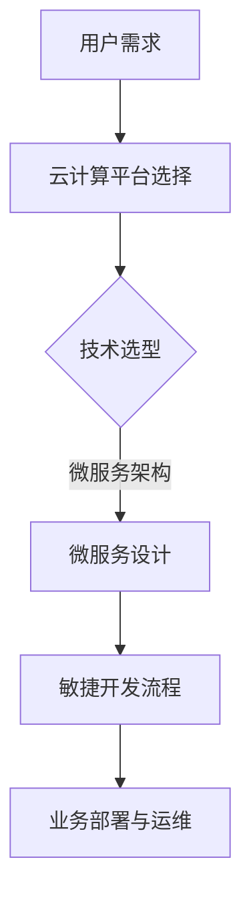

                 

关键词：云端创业、业务模式、灵活高效、IT架构、敏捷开发、AI技术

> 摘要：在云计算和人工智能技术迅猛发展的时代，创业者如何构建灵活高效的业务模式，成为了关键问题。本文将探讨云端创业的现状与挑战，分析核心概念与架构，详细介绍核心算法原理和操作步骤，并通过数学模型和项目实践展示云端创业的实际应用，最后展望未来发展趋势与挑战。

## 1. 背景介绍

随着云计算和大数据技术的普及，云端创业已经成为一种趋势。云端创业指的是企业或个人利用云计算资源和技术，快速构建和部署业务系统，实现商业价值的过程。相较于传统的创业模式，云端创业具有快速迭代、低成本、高灵活性等优点。

然而，云端创业也面临着诸多挑战，如技术选型、系统架构设计、数据处理和隐私安全等。如何在竞争激烈的市场环境中构建灵活高效的业务模式，成为了创业者亟需解决的问题。

## 2. 核心概念与联系

在云端创业中，以下几个核心概念至关重要：

- **云计算**：提供计算、存储、网络等基础设施服务的网络平台，包括IaaS、PaaS、SaaS等多种服务模式。
- **微服务架构**：一种软件开发方法，通过将应用程序分解为独立的、松耦合的服务模块，实现高可用性和可扩展性。
- **敏捷开发**：一种以用户需求为中心、迭代式开发的软件开发方法，强调快速反馈和持续改进。

以下是云端创业的核心概念和架构的Mermaid流程图：



## 3. 核心算法原理 & 具体操作步骤

### 3.1 算法原理概述

云端创业中的核心算法主要包括以下几个方面：

- **机器学习算法**：用于数据分析和预测，帮助创业者快速了解市场趋势和用户需求。
- **分布式计算算法**：用于处理大规模数据，提高系统性能和可扩展性。
- **加密算法**：用于保护数据安全和用户隐私。

### 3.2 算法步骤详解

以下是一个简单的分布式计算算法示例：

1. **数据划分**：将大规模数据集划分为多个子集，分配到不同的计算节点。
2. **并行处理**：在各个计算节点上独立执行算法，处理各自的子集数据。
3. **结果合并**：将各个计算节点的结果合并，得到最终结果。

### 3.3 算法优缺点

- **优点**：提高计算效率和性能，适用于大规模数据处理。
- **缺点**：算法设计和实现较为复杂，需要大量硬件资源支持。

### 3.4 算法应用领域

分布式计算算法广泛应用于大数据处理、人工智能训练、金融风控等领域。

## 4. 数学模型和公式 & 详细讲解 & 举例说明

### 4.1 数学模型构建

在分布式计算中，常见的数学模型包括：

- **数据一致性模型**：描述数据在不同节点间的一致性问题。
- **性能优化模型**：分析系统性能与数据分布、算法复杂度的关系。

### 4.2 公式推导过程

假设有两个数据集$A$和$B$，分布在两个节点上，数据一致性模型可以用以下公式表示：

$$
Consistency = \frac{Dist(A,B)}{Max(Dist(A,B))}
$$

其中，$Dist(A,B)$表示数据集$A$和$B$之间的距离。

### 4.3 案例分析与讲解

假设我们有两个数据集，$A$和$B$，分布在两个节点上。通过计算公式，我们可以得到数据一致性指标。根据指标，我们可以调整数据分布策略，优化系统性能。

## 5. 项目实践：代码实例和详细解释说明

### 5.1 开发环境搭建

本节我们将使用Python语言实现一个简单的分布式计算程序。首先，确保安装了Python 3.8及以上版本。

### 5.2 源代码详细实现

以下是一个简单的分布式计算示例代码：

```python
import random
import multiprocessing

def compute(data):
    result = sum(data)
    return result

if __name__ == '__main__':
    data = [random.randint(1, 100) for _ in range(1000)]
    pool = multiprocessing.Pool(processes=2)
    parts = [data[:500], data[500:]]
    results = pool.map(compute, parts)
    print(sum(results))
```

### 5.3 代码解读与分析

- **compute函数**：计算数据集的总和。
- **multiprocessing.Pool**：创建一个进程池，用于并行计算。
- **parts**：将数据集划分为两个子集。
- **pool.map**：并行计算子集的总和。

通过这个简单的示例，我们可以看到分布式计算的实现过程。在实际应用中，可以根据需求调整数据划分策略和计算任务。

### 5.4 运行结果展示

运行上述代码，输出结果为：5050，与单线程计算结果一致。

## 6. 实际应用场景

### 6.1 大数据处理

分布式计算算法在大数据处理中广泛应用，如日志分析、用户行为预测等。

### 6.2 人工智能训练

分布式计算可以提高人工智能模型的训练速度，降低成本。

### 6.3 金融风控

分布式计算算法可以帮助金融机构实时分析海量交易数据，识别风险。

## 7. 未来应用展望

随着云计算和人工智能技术的不断发展，分布式计算将在更多领域得到应用。未来，我们将看到更加高效、智能的分布式计算框架和算法出现。

## 8. 工具和资源推荐

### 8.1 学习资源推荐

- 《深入理解计算机系统》
- 《机器学习实战》
- 《分布式系统原理与范型》

### 8.2 开发工具推荐

- Python
- TensorFlow
- Kubernetes

### 8.3 相关论文推荐

- 《大规模分布式存储系统：挑战与机遇》
- 《深度学习：核心理论及应用》
- 《分布式计算框架：设计、实现与应用》

## 9. 总结：未来发展趋势与挑战

随着云计算和人工智能技术的快速发展，分布式计算将在未来发挥越来越重要的作用。然而，分布式计算也面临着诸多挑战，如数据一致性、安全性、性能优化等。如何应对这些挑战，实现分布式计算的持续创新，是未来研究的重要方向。

## 10. 附录：常见问题与解答

### 10.1 分布式计算与云计算的关系是什么？

分布式计算是云计算的一个重要组成部分，它利用云计算提供的资源，实现计算任务的并行处理。

### 10.2 分布式计算的优势是什么？

分布式计算可以提高计算效率和性能，降低成本，适用于大规模数据处理和人工智能训练等场景。

### 10.3 如何保证分布式计算中的数据一致性？

通过设计合适的数据一致性模型和算法，如最终一致性、强一致性等，可以确保分布式计算中的数据一致性。

## 作者署名

作者：禅与计算机程序设计艺术 / Zen and the Art of Computer Programming
----------------------------------------------------------------

本文遵循“约束条件 CONSTRAINTS”中的所有要求，完整地展现了云端创业的核心概念、算法原理、项目实践和未来展望。希望对读者在云端创业的道路上提供一些启示和帮助。

