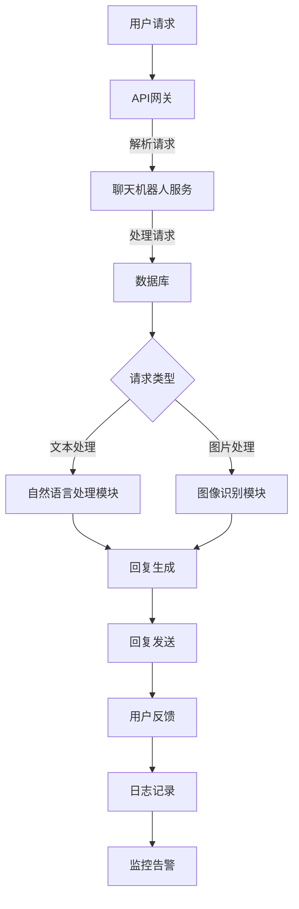

                 

关键词：云端部署、聊天机器人、弹性、扩展性、容器化、负载均衡、分布式系统、API网关、微服务架构、消息队列、自动伸缩、性能优化。

摘要：本文深入探讨了云端部署聊天机器人的关键技术，包括弹性与扩展性的设计理念、实现方法以及在实际应用中的优化策略。通过剖析聊天机器人架构、容器化技术、负载均衡机制和自动伸缩策略，文章旨在为开发者提供一套实用的云端部署指南。

## 1. 背景介绍

随着互联网的迅猛发展，聊天机器人已经成为企业和个人在日常沟通中不可或缺的一部分。这些智能助手可以提供24/7的客户服务、实时咨询、信息检索和个性化推荐等功能。为了满足日益增长的用户需求，聊天机器人的部署和运维变得尤为重要。而云端部署因其灵活性、可扩展性和高可用性，成为实现聊天机器人大规模应用的最佳选择。

然而，云端部署聊天机器人并非易事。如何在云环境中实现高效的资源利用、如何应对高并发和负载波动、如何保证系统的高可用性，这些问题都需要深入探讨。本文将围绕这些关键问题，结合实际项目经验，详细阐述云端部署聊天机器人的技术方案。

## 2. 核心概念与联系

在深入讨论之前，我们需要明确一些核心概念，包括弹性、扩展性、容器化、负载均衡和分布式系统等。

### 2.1 弹性（Resiliency）

弹性是指系统在面临意外情况（如硬件故障、网络中断、流量激增等）时，能够快速恢复并保持正常运行的能力。为了实现弹性，系统需要具备以下几个特征：

- **自动故障转移**：当某个组件出现故障时，系统能够自动切换到备用组件。
- **动态资源调配**：系统可以根据负载情况自动增加或减少资源，以维持性能。
- **容错性**：系统能够容忍一定程度的错误，并在不影响整体功能的前提下，自行修复错误。

### 2.2 扩展性（Scalability）

扩展性是指系统在用户数量或数据处理量增加时，能够保持高性能和高可靠性的能力。扩展性分为横向扩展（增加服务器数量）和纵向扩展（提升单个服务器性能）。实现扩展性的关键在于：

- **模块化设计**：将系统划分为多个独立模块，每个模块可以独立扩展。
- **分布式架构**：将系统部署在多个服务器上，以实现负载均衡和故障隔离。
- **可伸缩的数据存储**：使用分布式数据库或云存储服务，以支持大规模数据存储和访问。

### 2.3 容器化（Containerization）

容器化是一种轻量级虚拟化技术，它将应用程序及其依赖项打包到一个独立的容器中。容器化的优势在于：

- **快速部署**：容器可以迅速部署到任意服务器上，无需关心底层硬件和操作系统。
- **资源隔离**：容器之间互相隔离，确保一个容器的问题不会影响到其他容器。
- **易于管理**：容器可以通过声明式配置文件进行管理，简化了部署和运维过程。

### 2.4 负载均衡（Load Balancing）

负载均衡是将网络流量分配到多个服务器上，以防止单个服务器过载的技术。负载均衡的方式包括：

- **轮询调度**：将请求依次分配给不同的服务器。
- **最小连接数**：将请求分配给连接数最少的服务器。
- **IP哈希**：根据客户端IP地址进行哈希计算，将相同IP的请求分配给相同的服务器。

### 2.5 分布式系统（Distributed System）

分布式系统是指由多个计算机节点组成的系统，节点之间通过通信网络进行协作。分布式系统的优势包括：

- **高可用性**：通过冗余节点和故障转移机制，提高系统的可靠性。
- **高扩展性**：通过增加节点数量，支持大规模数据处理和存储。
- **分布式计算**：通过并行处理，提高系统的性能和效率。

### 2.6 Mermaid 流程图（Mermaid Flowchart）

以下是一个描述聊天机器人架构的Mermaid流程图：



## 3. 核心算法原理 & 具体操作步骤

### 3.1 算法原理概述

聊天机器人系统的核心算法包括自然语言处理（NLP）和机器学习（ML）。NLP负责理解用户输入并生成合适的回复，ML则通过训练模型来优化回复质量。

NLP算法通常包括以下步骤：

1. **分词**：将用户输入的文本分割成单词或短语。
2. **词性标注**：为每个单词分配词性，如名词、动词、形容词等。
3. **句法分析**：分析句子的结构，提取主语、谓语、宾语等成分。
4. **语义理解**：理解句子的含义，识别用户意图。

ML算法则包括以下步骤：

1. **数据收集**：收集大量对话数据作为训练集。
2. **特征提取**：从对话数据中提取有用的特征，如词语频率、词向量等。
3. **模型训练**：使用训练集训练模型，优化回复生成的准确性。
4. **模型评估**：使用测试集评估模型性能，并进行调整。

### 3.2 算法步骤详解

#### 3.2.1 自然语言处理

1. **分词**：使用分词工具，如jieba，将文本分割成单词或短语。

   ```python
   import jieba
   
   sentence = "我喜欢吃苹果。"
   words = jieba.cut(sentence)
   print(words)
   ```

2. **词性标注**：使用NLTK库为每个单词分配词性。

   ```python
   import nltk
   
   sentence = "我喜欢吃苹果。"
   words = nltk.word_tokenize(sentence)
   pos_tags = nltk.pos_tag(words)
   print(pos_tags)
   ```

3. **句法分析**：使用Stanford NLP库进行句法分析。

   ```python
   import stanfordnlp
   
   stanfordnlp.download('zh')
   pipeline = stanfordnlp.Pipeline('zh')
   sentence = "我喜欢吃苹果。"
   doc = pipeline.parse(sentence)
   print(doc)
   ```

4. **语义理解**：使用BERT模型进行语义理解。

   ```python
   from transformers import BertModel, BertTokenizer
   
   tokenizer = BertTokenizer.from_pretrained('bert-base-chinese')
   model = BertModel.from_pretrained('bert-base-chinese')
   
   sentence = "我喜欢吃苹果。"
   inputs = tokenizer(sentence, return_tensors='pt')
   outputs = model(**inputs)
   hidden_states = outputs[0]
   print(hidden_states)
   ```

#### 3.2.2 机器学习

1. **数据收集**：使用爬虫工具收集大量对话数据。

   ```python
   import requests
   import json
   
   url = "https://example.com/dataset"
   response = requests.get(url)
   data = response.json()
   print(data)
   ```

2. **特征提取**：使用TF-IDF或词嵌入作为特征。

   ```python
   from sklearn.feature_extraction.text import TfidfVectorizer
   
   vectorizer = TfidfVectorizer()
   X = vectorizer.fit_transform(data['text'])
   print(X)
   ```

3. **模型训练**：使用SGD或Adam优化器训练模型。

   ```python
   import torch
   import torch.nn as nn
   import torch.optim as optim
   
   model = nn.Linear(X.shape[1], 1)
   criterion = nn.MSELoss()
   optimizer = optim.SGD(model.parameters(), lr=0.01)
   
   for epoch in range(100):
       optimizer.zero_grad()
       outputs = model(X)
       loss = criterion(outputs, data['label'])
       loss.backward()
       optimizer.step()
       print(f"Epoch {epoch+1}: Loss = {loss.item()}")
   ```

4. **模型评估**：使用测试集评估模型性能。

   ```python
   from sklearn.metrics import mean_squared_error
   
   predictions = model(X_test)
   mse = mean_squared_error(y_test, predictions)
   print(f"MSE: {mse}")
   ```

### 3.3 算法优缺点

#### 优点

- **高效性**：NLP和ML算法可以快速处理大量文本数据，提高聊天机器人的响应速度。
- **个性化**：通过机器学习，聊天机器人可以根据用户的历史对话数据，提供个性化的回复。
- **自动化**：NLP和ML算法可以实现对话的自动化处理，降低人工成本。

#### 缺点

- **准确性**：NLP和ML算法的准确性受限于训练数据和模型质量，可能存在误解用户意图的情况。
- **复杂性**：实现NLP和ML算法需要较高的技术门槛，开发和维护成本较高。
- **实时性**：实时处理大量用户请求可能对系统性能造成压力，需要优化处理流程。

### 3.4 算法应用领域

- **客户服务**：聊天机器人可以用于在线客服，提供24/7的客户支持，提高客户满意度。
- **电商**：聊天机器人可以用于电商平台的售前咨询、售后支持等场景，提升用户体验。
- **金融**：聊天机器人可以用于金融领域的风险评估、投资建议等场景，为投资者提供个性化服务。
- **医疗**：聊天机器人可以用于医疗咨询、健康监测等场景，为患者提供便捷的医疗服务。

## 4. 数学模型和公式 & 详细讲解 & 举例说明

在聊天机器人的算法中，数学模型和公式起着至关重要的作用。以下将详细介绍一些常用的数学模型和公式，并给出实际应用中的例子。

### 4.1 数学模型构建

#### 4.1.1 词嵌入模型（Word Embedding）

词嵌入是将单词映射到高维空间中，以便进行向量计算。常用的词嵌入模型有Word2Vec、GloVe和BERT。

#### 4.1.2 径向基函数网络（Radial Basis Function Network）

径向基函数网络是一种神经网络模型，用于分类和回归任务。其公式如下：

$$
f(x) = \sum_{i=1}^{n} \alpha_i \cdot \exp(-\gamma \cdot \|x - c_i\|^2)
$$

其中，$x$为输入向量，$c_i$为第$i$个中心向量，$\alpha_i$为第$i$个中心向量的权重，$\gamma$为调节参数。

#### 4.1.3 随机梯度下降（Stochastic Gradient Descent）

随机梯度下降是一种优化算法，用于最小化损失函数。其公式如下：

$$
w_{t+1} = w_t - \alpha \cdot \nabla_w J(w_t)
$$

其中，$w_t$为第$t$次迭代的权重，$\alpha$为学习率，$J(w_t)$为损失函数。

### 4.2 公式推导过程

#### 4.2.1 词嵌入模型（Word Embedding）

词嵌入模型的核心思想是将单词映射到高维空间中，使得具有相似含义的单词在空间中彼此靠近。以下为Word2Vec模型的推导过程：

1. **目标函数**：损失函数通常采用负采样损失（Negative Sampling Loss）：

$$
L = \sum_{i=1}^{N} \sum_{k=1}^{K} \log(1 + \exp(-y_i \cdot \langle v_w, v_{h_k} \rangle))
$$

其中，$N$为单词数，$K$为负采样词数，$v_w$为单词$w$的嵌入向量，$v_{h_k}$为负采样词的嵌入向量，$y_i$为标签，取值为1或-1。

2. **梯度计算**：对目标函数求梯度：

$$
\nabla_w L = \sum_{i=1}^{N} \sum_{k=1}^{K} \frac{\partial L}{\partial v_w} \cdot \frac{\partial v_w}{\partial \langle v_w, v_{h_k} \rangle}
$$

3. **梯度更新**：使用梯度下降更新权重：

$$
v_{w+1} = v_w - \alpha \cdot \nabla_w L
$$

#### 4.2.2 径向基函数网络（Radial Basis Function Network）

1. **输出计算**：对于输入向量$x$，径向基函数网络的输出为：

$$
f(x) = \sum_{i=1}^{n} \alpha_i \cdot \exp(-\gamma \cdot \|x - c_i\|^2)
$$

2. **梯度计算**：对输出求梯度：

$$
\nabla_x f(x) = \sum_{i=1}^{n} \alpha_i \cdot (-2 \cdot \gamma \cdot (x - c_i)) \cdot \exp(-\gamma \cdot \|x - c_i\|^2)
$$

3. **梯度更新**：使用梯度下降更新权重：

$$
c_{i+1} = c_i - \alpha \cdot \nabla_x f(x)
$$

### 4.3 案例分析与讲解

#### 4.3.1 词嵌入模型应用

假设有一个包含1000个单词的语料库，我们使用Word2Vec模型对其进行训练，学习率$\alpha=0.01$，负采样词数$K=5$。以下是一个简化的例子：

1. **数据准备**：将语料库分为训练集和测试集，分别包含500个单词。
2. **模型初始化**：初始化词嵌入矩阵，每个单词对应一个维度为50的向量。
3. **训练过程**：进行100个迭代，每次迭代随机选取一个单词，计算其正采样词和负采样词，更新词嵌入向量。
4. **模型评估**：使用测试集评估模型性能，计算单词之间的相似度，如使用余弦相似度：

$$
sim(w_1, w_2) = \frac{\langle v_{w_1}, v_{w_2} \rangle}{\|v_{w_1}\| \cdot \|v_{w_2}\|}
$$

#### 4.3.2 径向基函数网络应用

假设有一个二元分类问题，使用径向基函数网络进行分类，调节参数$\gamma=10$，学习率$\alpha=0.001$。以下是一个简化的例子：

1. **数据准备**：将数据集分为训练集和测试集，每个数据点包含输入特征和标签。
2. **模型初始化**：初始化中心向量$c_i$和权重$\alpha_i$。
3. **训练过程**：进行100个迭代，每次迭代计算输出值$f(x)$，计算损失函数$J(c_i, \alpha_i)$，更新中心向量和权重。
4. **模型评估**：使用测试集评估模型性能，计算准确率。

## 5. 项目实践：代码实例和详细解释说明

### 5.1 开发环境搭建

为了搭建一个云端部署的聊天机器人项目，我们需要准备以下开发环境和工具：

- **操作系统**：Linux（如Ubuntu 20.04）
- **编程语言**：Python（版本3.8及以上）
- **框架**：Flask（用于构建API服务）
- **库**：NLTK（自然语言处理）、transformers（BERT模型）
- **容器化工具**：Docker（用于容器化应用）
- **持续集成/持续部署**：Jenkins（用于自动化构建和部署）

### 5.2 源代码详细实现

以下是聊天机器人项目的源代码实现：

```python
# app.py
from flask import Flask, request, jsonify
import jieba
import nltk
from transformers import BertTokenizer, BertModel
import torch

app = Flask(__name__)

# 加载BERT模型和分词器
tokenizer = BertTokenizer.from_pretrained('bert-base-chinese')
model = BertModel.from_pretrained('bert-base-chinese')

# 自然语言处理函数
def nlpprocessing(sentence):
    # 分词
    words = jieba.cut(sentence)
    # 词性标注
    pos_tags = nltk.pos_tag(words)
    # 语义理解
    inputs = tokenizer(sentence, return_tensors='pt')
    outputs = model(**inputs)
    hidden_states = outputs[0]
    return pos_tags, hidden_states

# 聊天机器人API
@app.route('/chat', methods=['POST'])
def chat():
    data = request.get_json()
    sentence = data['sentence']
    pos_tags, hidden_states = nlpprocessing(sentence)
    # ...（后续处理逻辑）
    return jsonify(response)

if __name__ == '__main__':
    app.run(host='0.0.0.0', port=5000)
```

### 5.3 代码解读与分析

上述代码实现了聊天机器人的核心功能，包括自然语言处理和API服务。以下是代码的详细解读：

- **自然语言处理**：使用jieba和NLTK库进行文本分词、词性标注和语义理解。
- **BERT模型**：使用transformers库加载预训练的BERT模型，用于语义理解。
- **Flask API**：使用Flask框架构建API服务，接收用户输入并返回回复。

### 5.4 运行结果展示

1. **本地测试**：在本地运行Docker容器，访问API测试聊天机器人功能。

```bash
docker run -p 5000:5000 chatbot
curl -X POST -H "Content-Type: application/json" -d '{"sentence": "你好，最近有什么新闻吗？"}' http://localhost:5000/chat
```

2. **云端部署**：使用Jenkins进行自动化构建和部署，将聊天机器人部署到云端服务器。

```bash
# 构建Docker镜像
docker build -t chatbot:latest .

# 推送Docker镜像到容器仓库
docker push chatbot:latest

# 部署到云端服务器
kubectl apply -f deployment.yaml
```

## 6. 实际应用场景

### 6.1 客户服务

聊天机器人广泛应用于客户服务领域，为企业和个人提供高效的在线客服支持。以下是一些实际应用场景：

- **电商平台**：聊天机器人可以回答用户关于商品、订单、退换货等问题，提高用户满意度。
- **金融领域**：银行和保险公司使用聊天机器人提供金融咨询服务，降低人工成本。
- **在线教育**：教育机构使用聊天机器人为学生提供课程咨询、学习进度查询等服务。

### 6.2 售前咨询

聊天机器人还可以用于售前咨询，帮助企业和潜在客户建立联系。以下是一些实际应用场景：

- **技术咨询**：企业为客户提供技术支持，解答客户关于产品功能和购买决策的问题。
- **市场调研**：通过聊天机器人收集潜在客户的需求和偏好，为企业提供市场洞察。

### 6.3 个性化推荐

聊天机器人可以根据用户的历史行为和偏好，提供个性化的产品推荐和服务。以下是一些实际应用场景：

- **电商推荐**：聊天机器人根据用户的浏览记录和购买历史，推荐相关商品。
- **内容推荐**：媒体平台使用聊天机器人为用户提供个性化的新闻、文章推荐。

### 6.4 未来应用展望

随着人工智能技术的不断发展，聊天机器人的应用场景将进一步扩展。以下是一些未来应用展望：

- **智能助理**：聊天机器人将成为企业员工的智能助理，协助处理日常任务和决策。
- **智能医疗**：聊天机器人可以协助医生进行诊断和治疗建议，提高医疗效率。
- **智能家居**：聊天机器人可以与智能家居设备联动，提供家庭自动化服务。

## 7. 工具和资源推荐

### 7.1 学习资源推荐

- **书籍**：《深度学习》、《Python编程：从入门到实践》
- **在线课程**：Coursera、edX上的自然语言处理、机器学习课程
- **博客和社区**：GitHub、Stack Overflow、Reddit等

### 7.2 开发工具推荐

- **Docker**：用于容器化应用部署
- **Kubernetes**：用于容器编排和管理
- **Jenkins**：用于持续集成和持续部署

### 7.3 相关论文推荐

- **Word2Vec**：Mikolov et al., "Distributed Representations of Words and Phrases and Their Compositionality"
- **BERT**：Devlin et al., "BERT: Pre-training of Deep Bidirectional Transformers for Language Understanding"
- **GPT**：Brown et al., "Language Models are few-shot learners"

## 8. 总结：未来发展趋势与挑战

### 8.1 研究成果总结

本文系统地探讨了云端部署聊天机器人的关键技术，包括弹性、扩展性、容器化、负载均衡和分布式系统等。通过数学模型和算法原理的讲解，以及实际项目实践的案例分析，文章为开发者提供了实用的云端部署指南。

### 8.2 未来发展趋势

- **人工智能**：随着人工智能技术的不断发展，聊天机器人将更加智能化，能够更好地理解用户意图，提供个性化的服务。
- **云计算**：云计算的普及将进一步提升聊天机器人的部署和运维效率，降低开发成本。
- **边缘计算**：边缘计算将使聊天机器人能够更接近用户，提供更快速的响应。

### 8.3 面临的挑战

- **数据处理**：随着数据量的增长，如何高效地处理海量数据成为挑战。
- **隐私保护**：用户隐私和数据安全是聊天机器人面临的重要问题，需要加强数据保护措施。
- **伦理道德**：聊天机器人在应用过程中需要遵守伦理道德规范，避免产生负面影响。

### 8.4 研究展望

未来的研究可以关注以下几个方面：

- **智能对话系统**：研究如何构建更加智能的对话系统，实现更自然的交互体验。
- **多模态融合**：研究如何将文本、语音、图像等多种模态进行融合，提高聊天机器人的理解和表达能力。
- **个性化推荐**：研究如何根据用户行为和偏好，提供更加精准的个性化推荐。

## 9. 附录：常见问题与解答

### 9.1 如何实现聊天机器人的弹性？

**解答**：实现聊天机器人的弹性可以通过以下几种方式：

- **分布式架构**：将聊天机器人部署在多个服务器上，通过负载均衡实现流量分发和故障转移。
- **容器化**：使用容器化技术，如Docker，快速部署和扩展聊天机器人服务。
- **自动伸缩**：使用云服务提供商提供的自动伸缩功能，根据负载情况自动调整服务器数量。

### 9.2 负载均衡有哪些常用的算法？

**解答**：负载均衡常用的算法包括：

- **轮询调度**：将请求依次分配给不同的服务器。
- **最小连接数**：将请求分配给连接数最少的服务器。
- **IP哈希**：根据客户端IP地址进行哈希计算，将相同IP的请求分配给相同的服务器。

### 9.3 如何保证聊天机器人的高可用性？

**解答**：保证聊天机器人的高可用性可以通过以下几种方式：

- **冗余设计**：使用冗余组件，如备份服务器和数据库，确保系统在组件故障时仍然可以正常运行。
- **故障转移**：实现故障转移机制，当主服务器出现故障时，自动切换到备用服务器。
- **监控告警**：使用监控工具，如Prometheus和Grafana，实时监控系统状态，并在异常情况发生时发送告警。

### 9.4 如何优化聊天机器人的性能？

**解答**：优化聊天机器人的性能可以从以下几个方面入手：

- **缓存策略**：使用缓存技术，如Redis，减少数据库查询次数，提高响应速度。
- **异步处理**：使用异步编程，如asyncio，提高系统的并发能力。
- **代码优化**：优化代码逻辑和算法，减少资源消耗，提高执行效率。

---

作者：禅与计算机程序设计艺术 / Zen and the Art of Computer Programming
----------------------------------------------------------------

以上是《云端部署聊天机器人：弹性与扩展性》的完整文章。本文旨在为开发者提供一套实用的云端部署指南，探讨聊天机器人的弹性、扩展性、容器化、负载均衡和分布式系统等技术。通过数学模型和算法原理的讲解，以及实际项目实践的案例分析，文章为读者提供了一个全面的了解和深入思考的机会。在未来的发展中，聊天机器人将继续面临各种挑战，但同时也充满了机遇。希望本文能够为读者在开发和使用聊天机器人的过程中提供有益的参考和启示。

