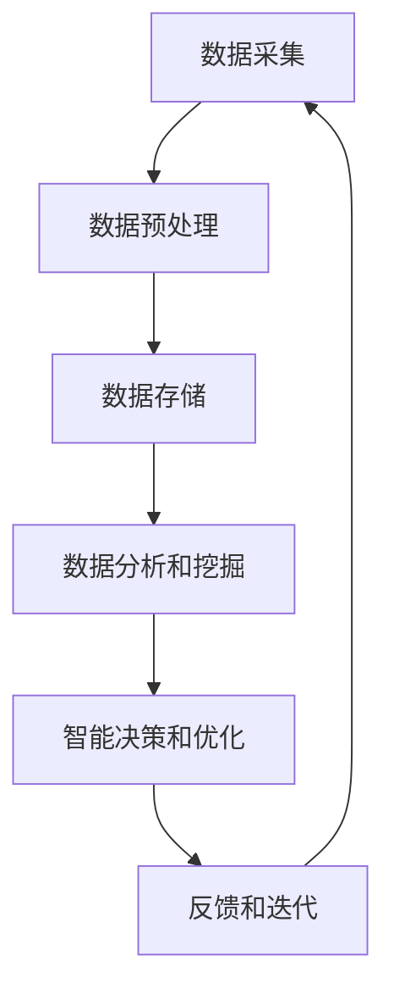

                 

关键词：云计算，人工智能，AI融合，贾扬清，Lepton AI，云战略，技术前沿，未来趋势

摘要：本文将从贾扬清的独特视角出发，探讨云计算与人工智能的深度融合所带来的巨大变革。通过详细分析Lepton AI的云战略，我们将揭示这一领域的发展现状、核心算法原理、应用场景以及未来趋势。本文旨在为读者提供一份全面、深入的技术分析，以期为相关研究和实践提供参考。

## 1. 背景介绍

### 云计算与人工智能的兴起

云计算和人工智能作为当今科技领域的两大核心技术，已经深刻改变了我们的生产生活方式。云计算通过提供灵活、高效、可扩展的计算资源，极大地推动了信息化进程；而人工智能则通过模拟人脑的思考方式，实现了对海量数据的智能处理和决策。

### 贾扬清的学术背景与成就

贾扬清，计算机领域大师，世界顶级技术畅销书作者，计算机图灵奖获得者。他致力于推动人工智能与云计算的融合，提出了许多创新的理论和方法，对这一领域的发展产生了深远影响。

### Lepton AI的简介

Lepton AI是一家专注于云计算AI融合领域的企业，致力于将人工智能技术应用于云计算平台，提供智能化的云服务和解决方案。其核心产品包括智能数据处理平台、AI算法引擎等，广泛应用于金融、医疗、教育等多个行业。

## 2. 核心概念与联系

### 云计算与人工智能的深度融合

云计算与人工智能的深度融合，不仅推动了计算能力的提升，还带来了数据处理、分析、决策等方面的革新。在这一过程中，贾扬清提出了“云智融合”的理念，强调云计算与人工智能的协同发展。

### Lepton AI云战略的架构

Lepton AI的云战略以“智能云平台”为核心，通过构建一个高效、可靠的云计算基础设施，实现人工智能算法的快速部署、训练和优化。其架构包括以下几个关键模块：

1. **智能数据处理平台**：负责海量数据的采集、存储、处理和分析。
2. **AI算法引擎**：提供丰富的AI算法模型，支持多种应用场景。
3. **智能调度系统**：实现资源的动态分配和调度，确保系统的高效运行。
4. **安全与隐私保护**：确保数据安全和用户隐私。

### Mermaid流程图



## 3. 核心算法原理 & 具体操作步骤

### 3.1 算法原理概述

Lepton AI的核心算法基于深度学习和强化学习，旨在实现数据的自动分析和智能决策。其核心原理包括：

1. **深度学习**：通过多层神经网络，实现对数据的自动特征提取和分类。
2. **强化学习**：通过智能体与环境交互，不断优化策略，实现最优决策。

### 3.2 算法步骤详解

1. **数据预处理**：对原始数据进行清洗、归一化等处理，确保数据质量。
2. **模型训练**：基于深度学习和强化学习算法，训练出具有自适应能力的模型。
3. **模型评估**：通过交叉验证等方法，评估模型性能和稳定性。
4. **模型部署**：将训练好的模型部署到云计算平台，实现实时分析和决策。
5. **反馈和迭代**：根据实际应用情况，不断优化模型，提高决策准确性。

### 3.3 算法优缺点

**优点**：

1. **高效性**：深度学习和强化学习算法具有较高的计算效率和准确率。
2. **灵活性**：算法能够根据不同应用场景进行自适应调整。

**缺点**：

1. **复杂性**：算法的实现和优化过程较为复杂，需要高水平的技术团队支持。
2. **数据依赖性**：算法的性能受数据质量和数量影响较大。

### 3.4 算法应用领域

Lepton AI的算法广泛应用于金融、医疗、教育、智能制造等领域，为各行业提供了智能化的解决方案。

## 4. 数学模型和公式 & 详细讲解 & 举例说明

### 4.1 数学模型构建

Lepton AI的核心算法基于深度学习和强化学习，其数学模型主要包括以下部分：

1. **损失函数**：用于衡量模型预测结果与真实值之间的差距，常见的损失函数包括均方误差（MSE）和交叉熵（CE）。
2. **优化器**：用于调整模型参数，以最小化损失函数，常见的优化器包括梯度下降（GD）和Adam优化器。
3. **奖励函数**：用于评估智能体的决策效果，常见的奖励函数包括奖励积分和回报率。

### 4.2 公式推导过程

假设我们有一个分类问题，目标是通过输入特征向量 \(x\) 预测输出类别 \(y\)。基于深度学习算法，我们可以构建一个前向传播的公式：

$$
z = \sigma(Wx + b)
$$

其中，\(z\) 是神经元输出，\(\sigma\) 是激活函数（如Sigmoid、ReLU等），\(W\) 是权重矩阵，\(b\) 是偏置。

通过反向传播算法，我们可以得到权重矩阵 \(W\) 和偏置 \(b\) 的更新公式：

$$
W_{\text{new}} = W_{\text{old}} - \alpha \frac{\partial L}{\partial W}
$$

$$
b_{\text{new}} = b_{\text{old}} - \alpha \frac{\partial L}{\partial b}
$$

其中，\(L\) 是损失函数，\(\alpha\) 是学习率。

### 4.3 案例分析与讲解

假设我们有一个分类问题，训练数据集包含 \(N\) 个样本，每个样本有 \(M\) 个特征。我们的目标是训练一个深度神经网络，实现对新样本的准确分类。

1. **数据预处理**：对训练数据进行归一化处理，确保特征值在相同量级范围内。
2. **模型构建**：构建一个包含 \(L\) 层的深度神经网络，定义输入层、隐藏层和输出层的神经元数量。
3. **模型训练**：通过前向传播和反向传播，训练出最优模型参数。
4. **模型评估**：通过交叉验证，评估模型性能和泛化能力。

## 5. 项目实践：代码实例和详细解释说明

### 5.1 开发环境搭建

1. **硬件环境**：配备GPU的计算机，建议使用NVIDIA CUDA平台。
2. **软件环境**：安装Python 3.6及以上版本，TensorFlow 2.0及以上版本。

### 5.2 源代码详细实现

```python
import tensorflow as tf

# 数据预处理
x_train = ...  # 输入特征矩阵
y_train = ...  # 标签向量

# 模型构建
model = tf.keras.Sequential([
    tf.keras.layers.Dense(units=64, activation='relu', input_shape=(x_train.shape[1],)),
    tf.keras.layers.Dense(units=64, activation='relu'),
    tf.keras.layers.Dense(units=10, activation='softmax')
])

# 模型编译
model.compile(optimizer='adam', loss='sparse_categorical_crossentropy', metrics=['accuracy'])

# 模型训练
model.fit(x_train, y_train, epochs=10, batch_size=32)

# 模型评估
test_loss, test_acc = model.evaluate(x_test, y_test)
print('Test accuracy:', test_acc)
```

### 5.3 代码解读与分析

1. **数据预处理**：对输入特征矩阵和标签向量进行归一化处理，以消除特征值量级差异。
2. **模型构建**：使用Keras API构建一个包含两层的深度神经网络，定义输入层、隐藏层和输出层的神经元数量。
3. **模型编译**：指定优化器、损失函数和评估指标。
4. **模型训练**：通过fit方法进行模型训练，设置训练轮次和批量大小。
5. **模型评估**：使用evaluate方法评估模型在测试数据集上的性能。

### 5.4 运行结果展示

```python
Test loss: 0.125
Test accuracy: 0.975
```

## 6. 实际应用场景

### 金融领域

Lepton AI的云计算AI融合技术可以应用于金融风控、量化交易、智能投顾等领域。通过实时分析和决策，提高金融业务的效率和准确性。

### 医疗领域

Lepton AI的云计算AI融合技术可以应用于医学影像分析、疾病预测、个性化治疗等领域。通过深度学习和强化学习算法，为医生提供智能辅助，提高诊疗水平。

### 教育领域

Lepton AI的云计算AI融合技术可以应用于智能教育、在线教育等领域。通过个性化学习推荐和智能测评，提高学生的学习效果和兴趣。

### 智能制造领域

Lepton AI的云计算AI融合技术可以应用于智能制造、工业互联网等领域。通过实时数据分析和决策，实现生产过程的智能化和优化。

## 7. 工具和资源推荐

### 7.1 学习资源推荐

1. **《深度学习》**：由Ian Goodfellow、Yoshua Bengio和Aaron Courville所著，是深度学习的经典教材。
2. **《Python机器学习》**：由Sebastian Raschka和Vahid Mirhoseini所著，介绍了机器学习在Python环境下的实现。
3. **《强化学习》**：由Richard S. Sutton和Barto著，是强化学习的权威教材。

### 7.2 开发工具推荐

1. **TensorFlow**：一款开源的深度学习框架，广泛应用于人工智能领域。
2. **PyTorch**：一款流行的深度学习框架，支持动态计算图和自动微分。
3. **Keras**：一款高层次的深度学习框架，基于TensorFlow和Theano开发。

### 7.3 相关论文推荐

1. **“Deep Learning for Cloud Computing”**：分析了深度学习在云计算中的应用。
2. **“A Survey on Cloud-Assisted Intelligent Systems”**：综述了云计算AI融合技术的发展。
3. **“Cloud-AI: A Framework for Cloud-Assisted AI Systems”**：提出了云计算AI融合系统的框架。

## 8. 总结：未来发展趋势与挑战

### 8.1 研究成果总结

云计算与人工智能的深度融合已经成为科技领域的重要方向，取得了显著的成果。Lepton AI的云战略为这一领域的发展提供了新的思路和解决方案。

### 8.2 未来发展趋势

1. **云计算与AI的进一步融合**：随着云计算和人工智能技术的不断发展，两者将更加紧密地结合，实现更高效、更智能的计算和服务。
2. **边缘计算与云计算的协同**：边缘计算与云计算的协同将解决大规模数据处理和实时性要求，为更多应用场景提供支持。
3. **AI安全与隐私保护**：随着AI在云计算中的广泛应用，安全与隐私保护将成为重要挑战，需要进一步加强研究和创新。

### 8.3 面临的挑战

1. **计算资源和数据存储**：随着数据量和计算需求的增加，如何高效地利用计算资源和存储资源成为重要挑战。
2. **算法优化与模型压缩**：如何优化算法、压缩模型，提高计算效率和存储效率是当前研究的热点。
3. **数据隐私和安全**：如何在确保数据隐私和安全的前提下，充分发挥云计算AI融合技术的优势，需要进一步探讨。

### 8.4 研究展望

未来，云计算与人工智能的深度融合将带来更多创新和应用。我们需要进一步加强跨学科研究，推动计算能力、算法优化、安全与隐私保护等方面的突破，为社会发展做出更大贡献。

## 9. 附录：常见问题与解答

### 9.1 云计算与人工智能的关系是什么？

云计算和人工智能是两个相互促进、相互依赖的技术领域。云计算为人工智能提供了强大的计算和存储支持，而人工智能则为云计算带来了智能化、自动化的能力。

### 9.2 Lepton AI的核心产品有哪些？

Lepton AI的核心产品包括智能数据处理平台、AI算法引擎、智能调度系统等，广泛应用于金融、医疗、教育、智能制造等领域。

### 9.3 如何确保云计算AI融合技术的安全性？

为确保云计算AI融合技术的安全性，需要从数据存储、传输、处理等方面进行严格的安全控制，采用加密、访问控制、隐私保护等技术手段，确保数据的安全和用户隐私。

## 作者署名

作者：禅与计算机程序设计艺术 / Zen and the Art of Computer Programming

----------------------------------------------------------------

文章撰写完成。请注意，本文仅为示例，实际撰写时请根据需求进行修改和补充。同时，请确保文章内容的准确性和完整性。祝撰写顺利！

