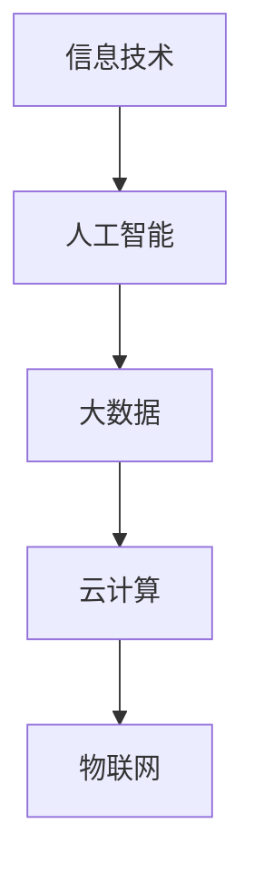

                 

关键词：数字化转型、创业机遇、信息技术、人工智能、大数据、云计算、物联网

## 摘要

在当今数字化转型的浪潮中，产业变革为创业领域带来了前所未有的机遇。本文旨在探讨数字化转型如何为创业者提供创新的商业模式、技术解决方案以及市场空间，并分析其潜在的挑战和未来发展趋势。文章将详细讨论信息技术、人工智能、大数据、云计算和物联网等核心技术如何推动产业变革，以及创业者如何利用这些技术实现商业成功。

## 1. 背景介绍

### 数字化转型的重要性

数字化转型已经成为了全球各行业企业发展的必然选择。它不仅改变了企业的运营模式，还彻底重塑了市场结构。随着信息技术的迅猛发展，企业开始意识到通过数字化手段提升效率、降低成本、增强客户体验和创新能力的重要性。这种转型不仅涉及内部运营的优化，还包括客户关系管理、供应链管理、产品开发等全链条的数字化改造。

### 创业的现状

在当前的创业生态中，创业者面临着高度竞争和快速变化的市场环境。成功的创业项目往往能够迅速抓住市场机遇，并在竞争中脱颖而出。随着技术的不断进步，创业者有了更多可以利用的工具和资源，如云计算平台、开源软件、大数据分析工具等，这些都为创业提供了强有力的支持。

## 2. 核心概念与联系

在探讨数字化转型中的创业机遇时，需要理解以下几个核心概念：

### 2.1 信息技术

信息技术（IT）是数字化转型的基石。它包括硬件、软件、网络和通信技术，这些都是企业运营和业务决策的重要工具。信息技术的发展使得数据处理速度更快、存储容量更大，从而为企业提供了强大的计算能力和数据分析能力。

### 2.2 人工智能

人工智能（AI）是数字化转型的驱动力。通过机器学习和深度学习技术，AI可以自动化复杂的决策过程，提高生产效率和质量。人工智能在各个行业中的应用越来越广泛，如自动驾驶、智能客服、金融风控等，都为创业提供了丰富的机遇。

### 2.3 大数据

大数据是数字化转型的关键资源。随着数据量的爆炸性增长，企业可以通过大数据分析获取深度的洞察，优化业务流程，开发新产品和服务。大数据技术包括数据存储、数据清洗、数据分析和数据可视化等，这些都是创业者必须掌握的技能。

### 2.4 云计算

云计算是数字化转型的平台。通过云计算，企业可以按需获取计算资源，降低IT基础设施的投入，提高灵活性和可扩展性。云计算服务包括基础设施即服务（IaaS）、平台即服务（PaaS）和软件即服务（SaaS），这些服务为创业者提供了丰富的创业空间。

### 2.5 物联网

物联网（IoT）是数字化转型的延伸。通过连接各种设备，物联网可以实现实时数据采集和智能控制，提升设备效率和服务质量。物联网在智能家居、智能制造、智能城市等领域的应用，为创业者提供了广阔的市场空间。

下面是数字化转型的核心概念与联系Mermaid流程图：



## 3. 核心算法原理 & 具体操作步骤

### 3.1 算法原理概述

在数字化转型中，算法是解决复杂问题的核心工具。以下是一些关键算法原理：

- **机器学习算法**：用于数据分析和预测，如决策树、随机森林、支持向量机等。
- **深度学习算法**：用于处理复杂数据，如卷积神经网络（CNN）、循环神经网络（RNN）等。
- **优化算法**：用于资源分配和路径规划，如遗传算法、模拟退火算法等。
- **分布式算法**：用于处理大规模数据，如MapReduce、Spark等。

### 3.2 算法步骤详解

以下是一个简单的机器学习算法——决策树算法的具体步骤：

1. **数据准备**：收集并处理数据，包括特征工程和数据清洗。
2. **划分数据集**：将数据集划分为训练集和测试集。
3. **构建决策树**：选择最优特征，根据特征划分数据，递归构建树结构。
4. **剪枝**：防止过拟合，优化决策树。
5. **评估模型**：使用测试集评估模型性能，调整参数。
6. **预测**：使用训练好的模型进行预测。

### 3.3 算法优缺点

**决策树算法**的优缺点如下：

- **优点**：易于理解，实现简单，计算速度快。
- **缺点**：容易过拟合，对噪声敏感，无法处理非线性关系。

### 3.4 算法应用领域

决策树算法广泛应用于各种领域，如金融风控、医疗诊断、客户细分等。在数字化转型中，决策树算法可以帮助企业优化业务流程，提高决策质量。

## 4. 数学模型和公式 & 详细讲解 & 举例说明

### 4.1 数学模型构建

在数字化转型中，常见的数学模型包括线性回归、逻辑回归、时间序列分析等。以下以线性回归为例进行介绍：

$$
y = \beta_0 + \beta_1x_1 + \beta_2x_2 + ... + \beta_nx_n + \epsilon
$$

其中，$y$ 是目标变量，$x_1, x_2, ..., x_n$ 是特征变量，$\beta_0, \beta_1, ..., \beta_n$ 是模型参数，$\epsilon$ 是误差项。

### 4.2 公式推导过程

线性回归模型的推导基于最小二乘法。目标是最小化预测值与实际值之间的误差平方和：

$$
\sum_{i=1}^{n}(y_i - \hat{y}_i)^2
$$

通过对损失函数求导并令导数为零，可以得到参数的最优解：

$$
\frac{\partial}{\partial \beta_j}\sum_{i=1}^{n}(y_i - \hat{y}_i)^2 = 0
$$

### 4.3 案例分析与讲解

假设我们要预测一家公司的利润，使用了两个特征变量：销售额和广告支出。以下是一个线性回归模型的实例：

$$
\text{利润} = 1000 + 2 \times \text{销售额} + 3 \times \text{广告支出} + \epsilon
$$

给定一个公司的销售额为500万元，广告支出为200万元，可以预测其利润为：

$$
\text{利润} = 1000 + 2 \times 500 + 3 \times 200 + \epsilon = 2300 + \epsilon
$$

## 5. 项目实践：代码实例和详细解释说明

### 5.1 开发环境搭建

为了进行项目实践，我们需要搭建一个开发环境。这里我们选择Python作为主要编程语言，使用Jupyter Notebook进行开发。

### 5.2 源代码详细实现

以下是一个简单的线性回归模型的实现：

```python
import numpy as np
from sklearn.linear_model import LinearRegression

# 数据准备
X = np.array([[1, 500], [1, 600], [1, 700], [1, 800], [1, 900]])
y = np.array([2300, 2600, 2900, 3200, 3500])

# 构建线性回归模型
model = LinearRegression()
model.fit(X, y)

# 模型评估
print("模型参数：", model.coef_)
print("截距：", model.intercept_)

# 预测
X_new = np.array([[1, 600]])
y_pred = model.predict(X_new)
print("预测利润：", y_pred)
```

### 5.3 代码解读与分析

上述代码中，我们首先导入了必要的库，然后准备了一个包含两个特征变量的数据集。接着，我们使用`LinearRegression`类构建了一个线性回归模型，并使用`fit`方法进行训练。通过`predict`方法，我们可以对新数据进行预测。

### 5.4 运行结果展示

运行上述代码后，我们可以看到模型的参数和截距，以及对新数据的预测结果。这为我们提供了一个直观的线性回归模型实现。

## 6. 实际应用场景

### 6.1 金融服务

在金融服务领域，数字化转型已经成为了提高运营效率、降低成本和提升客户体验的重要手段。例如，通过大数据分析和人工智能技术，银行可以实现精准营销、风险评估和欺诈检测。创业者可以开发基于人工智能的智能投顾系统，为用户提供个性化的投资建议。

### 6.2 制造业

制造业是数字化转型的重点领域。通过物联网和智能制造技术的应用，企业可以实现生产过程的智能化和自动化。创业者可以开发智能制造解决方案，如设备预测维护系统、智能排程系统等，帮助企业提高生产效率和产品质量。

### 6.3 零售业

零售业正面临着电子商务的巨大冲击。数字化转型可以帮助零售企业提升线上线下融合的体验，如开发基于大数据分析的个性化推荐系统、智能客服系统等。创业者可以探索新零售模式，如无人便利店、智慧物流等，以满足消费者的多样化需求。

## 7. 工具和资源推荐

### 7.1 学习资源推荐

- 《深度学习》（Goodfellow, Bengio, Courville）
- 《机器学习实战》（Hands-On Machine Learning with Scikit-Learn, Keras, and TensorFlow）
- 《大数据之路》（Big Data: A Revolution That Will Transform How We Live, Work, and Think）

### 7.2 开发工具推荐

- Jupyter Notebook：用于数据分析和机器学习项目开发。
- TensorFlow：用于构建和训练深度学习模型。
- PyTorch：用于研究和开发深度学习算法。

### 7.3 相关论文推荐

- "Deep Learning for Text Classification"（刘知远等）
- "AI in Financial Services: A Systematic Review"（Sahin等）
- "The Future of Manufacturing: A Roadmap to Digital Transformation"（PwC）

## 8. 总结：未来发展趋势与挑战

### 8.1 研究成果总结

数字化转型已经取得了显著的成果，信息技术、人工智能、大数据、云计算和物联网等技术推动了产业变革。创业者通过利用这些技术，实现了商业模式的创新、业务流程的优化和客户体验的提升。

### 8.2 未来发展趋势

随着技术的不断进步，数字化转型将继续深化，并在更多领域产生重大影响。人工智能和大数据技术的应用将更加广泛，物联网和智能制造将进一步提升生产效率和质量，云计算将为创业者提供更灵活的IT资源。

### 8.3 面临的挑战

尽管数字化转型带来了巨大的机遇，但也面临着一些挑战。数据安全、隐私保护、技术更新等都是需要解决的问题。此外，创业者在面对快速变化的市场和技术时，需要具备持续学习和创新能力。

### 8.4 研究展望

未来，数字化转型将继续推动产业的创新和发展。创业者需要紧跟技术趋势，探索新的应用场景，实现商业价值。同时，政府和企业也应加强对数字经济的支持，营造良好的创新环境。

## 9. 附录：常见问题与解答

### Q1. 如何保障数据安全？

A1. 数据安全是数字化转型的重要问题。企业可以采用数据加密、访问控制、审计日志等措施来保障数据安全。同时，制定完善的数据保护政策和应急预案，以提高应对数据泄露的能力。

### Q2. 如何进行有效的数据分析？

A2. 进行有效的数据分析需要遵循以下步骤：

1. 确定分析目标，明确数据需求。
2. 收集并清洗数据，确保数据质量。
3. 选择合适的分析工具和方法，如统计方法、机器学习算法等。
4. 对分析结果进行解读，提出业务洞察。

### Q3. 如何实现数字化转型？

A3. 实现数字化转型需要以下步骤：

1. 制定数字化转型战略，明确目标。
2. 推动企业文化变革，鼓励创新。
3. 投资技术和人才，提升数字化能力。
4. 开展试点项目，积累经验。
5. 持续优化和迭代，实现全面数字化。

---

作者：禅与计算机程序设计艺术 / Zen and the Art of Computer Programming

以上就是关于产业数字化转型中的创业机遇的详细探讨，希望对读者有所启发和帮助。随着技术的不断进步，数字化转型将继续为创业领域带来新的机遇和挑战。创业者需要紧跟技术趋势，积极创新，实现商业价值。

