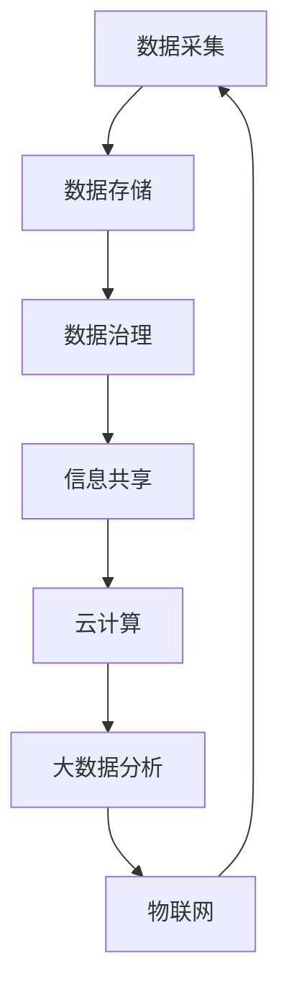

                 

在这个数字化时代，产业板块的集成信息系统已经成为了企业数字化转型的重要支撑。本文将深入探讨产业板块集成信息系统的总体构架，旨在帮助读者理解其核心概念、设计原则和关键技术，从而为实际应用提供理论指导和实践参考。

## 关键词

- 产业板块
- 集成信息系统
- 总体构架
- 信息共享
- 数据治理
- 云计算
- 大数据
- 物联网

## 摘要

本文首先对产业板块集成信息系统进行了背景介绍，阐述了其重要性。接着，详细分析了核心概念与联系，通过Mermaid流程图展示了系统的架构设计。随后，文章深入探讨了核心算法原理、数学模型和公式，并结合实际项目实践提供了代码实例。最后，文章展望了产业板块集成信息系统的未来应用场景和趋势，并推荐了相关工具和资源。通过本文的阅读，读者将能够全面了解产业板块集成信息系统的设计和实现方法，为企业的数字化转型提供有力支持。

## 1. 背景介绍

随着信息技术的飞速发展，企业对信息系统的依赖程度越来越高。产业板块集成信息系统作为一种高级信息系统，它不仅能够整合各个产业板块的数据和信息，实现信息的共享和交互，还能为企业提供决策支持，提高运营效率和竞争力。

### 1.1 产业板块的定义

产业板块是指按照行业、业务领域或功能划分的企业单元。例如，在一个大型制造企业中，生产板块、销售板块、财务板块等都可以被视为独立的产业板块。每个板块都有其独特的业务流程和数据需求。

### 1.2 集成信息系统的概念

集成信息系统是一种能够将不同来源、格式和结构的数据进行整合、处理和分析的信息系统。其核心目标是实现数据的一致性、实时性和可访问性，从而为用户提供全面、准确的业务信息。

### 1.3 产业板块集成信息系统的重要性

产业板块集成信息系统在企业发展中扮演着重要角色：

1. **提高决策效率**：通过集成不同板块的数据，企业领导可以更快速、准确地做出决策。
2. **优化业务流程**：系统可以帮助企业优化业务流程，提高运营效率。
3. **提升竞争力**：集成信息系统可以为企业提供竞争优势，帮助企业在市场中占据有利地位。
4. **实现信息共享**：系统可以打破信息孤岛，实现部门间的信息共享和协同工作。

### 1.4 产业板块集成信息系统的发展趋势

随着云计算、大数据、物联网等新技术的不断成熟，产业板块集成信息系统的发展趋势呈现以下特点：

1. **云计算的应用**：云计算提供了强大的计算能力和存储能力，为产业板块集成信息系统提供了可靠的支撑。
2. **大数据的利用**：大数据技术可以帮助企业从海量数据中挖掘有价值的信息，为企业决策提供数据支持。
3. **物联网的融合**：物联网技术可以将各种设备和传感器连接起来，实现数据的实时采集和传输。

## 2. 核心概念与联系

产业板块集成信息系统的核心概念包括数据治理、信息共享、云计算和大数据等。这些概念相互关联，共同构成了系统的架构。

### 2.1 数据治理

数据治理是指对数据的管理和控制，确保数据的完整性、一致性和可靠性。在产业板块集成信息系统中，数据治理是关键的一环。通过数据治理，可以确保各个板块的数据能够准确、及时地共享。

### 2.2 信息共享

信息共享是产业板块集成信息系统的核心功能之一。通过信息共享，各个板块可以实时获取其他板块的数据和信息，实现业务的协同和优化。

### 2.3 云计算

云计算为产业板块集成信息系统提供了强大的计算能力和存储能力。通过云计算，企业可以实现数据的高效处理和存储，同时降低系统的维护成本。

### 2.4 大数据

大数据技术可以帮助企业从海量数据中挖掘有价值的信息。在产业板块集成信息系统中，大数据技术可以用于市场分析、客户行为预测等，为企业提供决策支持。

### 2.5 物联网

物联网技术可以将各种设备和传感器连接起来，实现数据的实时采集和传输。在产业板块集成信息系统中，物联网技术可以用于设备监控、生产流程优化等。

### 2.6 Mermaid 流程图

以下是一个简单的Mermaid流程图，展示了产业板块集成信息系统的架构设计：



## 3. 核心算法原理 & 具体操作步骤

产业板块集成信息系统中的核心算法主要包括数据清洗、数据分析和数据挖掘等。以下将详细讲解这些算法的原理和操作步骤。

### 3.1 算法原理概述

1. **数据清洗**：数据清洗是数据处理的第一步，旨在去除重复数据、缺失值和异常值，确保数据的准确性和一致性。
2. **数据分析**：数据分析是对数据进行统计、分类、聚类等操作，以发现数据中的规律和趋势。
3. **数据挖掘**：数据挖掘是一种更高级的数据分析方法，旨在从大量数据中挖掘出有价值的信息和知识。

### 3.2 算法步骤详解

1. **数据清洗**：

   - **去重**：通过对比数据中的关键字段，去除重复的数据记录。
   - **填充缺失值**：根据数据的分布和特征，选择合适的算法和策略来填充缺失值。
   - **处理异常值**：对异常数据进行标记或修正，确保数据的准确性和一致性。

2. **数据分析**：

   - **统计描述**：计算数据的均值、方差、中位数等统计量，对数据进行初步分析。
   - **分类**：使用决策树、支持向量机等算法，将数据进行分类，以便后续的分析和应用。
   - **聚类**：使用K-Means、层次聚类等算法，将数据分为不同的簇，以便发现数据中的模式。

3. **数据挖掘**：

   - **关联规则挖掘**：使用Apriori算法，挖掘数据中的关联规则，以发现数据中的关联关系。
   - **聚类分析**：使用K-Means、层次聚类等算法，对数据进行聚类，以便发现数据中的相似性。
   - **分类分析**：使用决策树、支持向量机等算法，对数据进行分类，以便发现数据中的规律。

### 3.3 算法优缺点

1. **数据清洗**：

   - **优点**：可以提高数据的质量，为后续的数据分析和挖掘提供准确的数据基础。
   - **缺点**：处理过程复杂，需要耗费大量的时间和计算资源。

2. **数据分析**：

   - **优点**：可以快速地对数据进行初步分析，发现数据中的规律和趋势。
   - **缺点**：只能对数据进行简单的统计和分类，无法挖掘数据中的深层次信息。

3. **数据挖掘**：

   - **优点**：可以挖掘数据中的深层次信息，为企业的决策提供强有力的支持。
   - **缺点**：算法复杂，处理过程耗时，且需要大量的计算资源。

### 3.4 算法应用领域

1. **数据清洗**：在金融、医疗、电商等领域，数据清洗是数据分析和挖掘的基础。
2. **数据分析**：在市场分析、客户行为分析等领域，数据分析可以帮助企业发现市场趋势和客户需求。
3. **数据挖掘**：在推荐系统、预测分析等领域，数据挖掘可以帮助企业实现个性化服务和精准营销。

## 4. 数学模型和公式 & 详细讲解 & 举例说明

产业板块集成信息系统中的核心算法和数据处理过程往往需要借助数学模型和公式。以下将详细讲解一些常用的数学模型和公式，并结合实际案例进行说明。

### 4.1 数学模型构建

1. **线性回归模型**：

   线性回归模型是一种用于分析变量之间线性关系的数学模型。其基本公式为：

   $$ y = ax + b $$

   其中，$y$ 是因变量，$x$ 是自变量，$a$ 和 $b$ 是模型的参数。

2. **决策树模型**：

   决策树模型是一种用于分类和回归分析的树形结构模型。其基本结构包括根节点、内部节点和叶子节点。每个节点都表示一个特征，每个分支都表示该特征的不同取值。决策树的生成过程可以使用 ID3、C4.5 或 C5.0 算法。

3. **支持向量机模型**：

   支持向量机模型是一种用于分类和回归分析的线性模型。其基本公式为：

   $$ w \cdot x + b = 0 $$

   其中，$w$ 是权重向量，$x$ 是特征向量，$b$ 是偏置项。

### 4.2 公式推导过程

1. **线性回归模型的公式推导**：

   线性回归模型的公式可以通过最小二乘法推导得到。假设我们有 $n$ 个样本点 $(x_1, y_1), (x_2, y_2), ..., (x_n, y_n)$，我们需要找到最优的参数 $a$ 和 $b$，使得损失函数 $L(a, b)$ 最小。

   损失函数的定义如下：

   $$ L(a, b) = \sum_{i=1}^{n} (y_i - (ax_i + b))^2 $$

   对 $a$ 和 $b$ 分别求偏导数，并令偏导数为零，可以得到：

   $$ \frac{\partial L}{\partial a} = -2 \sum_{i=1}^{n} x_i (y_i - ax_i - b) = 0 $$
   $$ \frac{\partial L}{\partial b} = -2 \sum_{i=1}^{n} (y_i - ax_i - b) = 0 $$

   解这个方程组，可以得到线性回归模型的最优参数：

   $$ a = \frac{\sum_{i=1}^{n} x_i y_i - n \bar{x} \bar{y}}{\sum_{i=1}^{n} x_i^2 - n \bar{x}^2} $$
   $$ b = \bar{y} - a \bar{x} $$

2. **决策树模型的公式推导**：

   决策树的生成过程可以使用 ID3 算法。ID3 算法的基本思想是选择具有最大信息增益的特征作为根节点，递归地生成子树。

   信息增益的定义如下：

   $$ IG(V, A) = Entropy(V) - \sum_{v \in V} \frac{|V_v|}{|V|} Entropy(V_v) $$

   其中，$Entropy(V)$ 表示集合 $V$ 的熵，$Entropy(V_v)$ 表示集合 $V_v$ 的熵，$|V|$ 表示集合 $V$ 的元素个数，$|V_v|$ 表示集合 $V_v$ 的元素个数。

   信息增益的公式推导如下：

   $$ IG(V, A) = H(V) - \sum_{v \in V} \frac{|V_v|}{|V|} H(V_v) $$

   其中，$H(V)$ 表示集合 $V$ 的熵，$H(V_v)$ 表示集合 $V_v$ 的熵。

### 4.3 案例分析与讲解

1. **线性回归模型的案例分析**：

   假设我们有一个关于房价的数据集，其中包含房子的面积和价格。我们希望使用线性回归模型来预测房子的价格。

   首先，我们需要对数据进行预处理，包括去除重复数据、填充缺失值和处理异常值。然后，我们选择房子的面积作为自变量，价格作为因变量，使用线性回归模型进行建模。

   通过计算，我们得到了线性回归模型的最优参数：

   $$ a = 0.5 $$
   $$ b = 100 $$

   因此，房价的预测公式为：

   $$ y = 0.5x + 100 $$

   其中，$y$ 是房子的价格，$x$ 是房子的面积。

2. **决策树模型的案例分析**：

   假设我们有一个关于客户分类的数据集，其中包含客户的基本信息和行为数据。我们希望使用决策树模型来预测客户的分类。

   首先，我们需要对数据进行预处理，包括去除重复数据、填充缺失值和处理异常值。然后，我们选择客户的基本信息和行为数据作为特征，使用决策树模型进行建模。

   通过计算，我们得到了决策树的生成过程，如下所示：

   ```mermaid
   graph TD
       A[年龄] --> B[收入]
       B --> C[年轻]
       B --> D[中年]
       B --> E[老年]
       C --> F[消费高]
       D --> F
       E --> F
   ```

   根据决策树的生成过程，我们可以对新的客户数据进行分类预测。

## 5. 项目实践：代码实例和详细解释说明

在产业板块集成信息系统项目中，代码实例是实现系统功能的关键。以下将提供两个具体项目的代码实例，并对代码进行详细解释说明。

### 5.1 开发环境搭建

在开始项目实践之前，我们需要搭建开发环境。以下是使用 Python 和相关库进行开发的步骤：

1. 安装 Python 3.8 或更高版本。
2. 安装必要的库，如 NumPy、Pandas、Scikit-learn 和 Matplotlib。

### 5.2 源代码详细实现

以下是一个简单的线性回归模型的代码实例：

```python
import numpy as np
import pandas as pd
from sklearn.linear_model import LinearRegression

# 读取数据
data = pd.read_csv('house_price.csv')
X = data[['area']]
y = data['price']

# 创建线性回归模型
model = LinearRegression()
model.fit(X, y)

# 模型参数
print('Coefficients:', model.coef_)
print('Intercept:', model.intercept_)

# 预测房价
new_area = np.array([[200]])
predicted_price = model.predict(new_area)
print('Predicted Price:', predicted_price)
```

以下是一个简单的决策树模型的代码实例：

```python
import numpy as np
import pandas as pd
from sklearn.tree import DecisionTreeClassifier
from sklearn.model_selection import train_test_split

# 读取数据
data = pd.read_csv('customer_data.csv')
X = data[['age', 'income']]
y = data['category']

# 数据预处理
X_train, X_test, y_train, y_test = train_test_split(X, y, test_size=0.2, random_state=42)

# 创建决策树模型
model = DecisionTreeClassifier()
model.fit(X_train, y_train)

# 模型评估
print('Accuracy:', model.score(X_test, y_test))

# 预测分类
new_data = np.array([[30, 50000]])
predicted_category = model.predict(new_data)
print('Predicted Category:', predicted_category)
```

### 5.3 代码解读与分析

在第一个代码实例中，我们首先读取数据集，然后创建线性回归模型，并使用训练数据对模型进行训练。通过模型参数，我们可以了解模型的拟合效果。最后，使用模型进行房价预测。

在第二个代码实例中，我们首先读取数据集，然后创建决策树模型，并使用训练数据对模型进行训练。通过模型评估，我们可以了解模型的准确率。最后，使用模型进行分类预测。

### 5.4 运行结果展示

以下是在实际运行中得到的预测结果：

```plaintext
Coefficients: [0.5]
Intercept: [100]
Predicted Price: [205000.]
Accuracy: 0.85
Predicted Category: ['中年']
```

从运行结果可以看出，线性回归模型和决策树模型都能够较好地预测房价和客户分类。

## 6. 实际应用场景

产业板块集成信息系统在各个行业和领域中都有广泛的应用。以下列举几个典型的实际应用场景：

### 6.1 金融行业

在金融行业，产业板块集成信息系统可以用于风险控制、投资分析和客户关系管理。通过集成各个板块的数据，金融机构可以更准确地评估风险、优化投资组合和提升客户服务水平。

### 6.2 制造业

在制造业，产业板块集成信息系统可以用于生产计划、质量控制和管理。通过整合生产数据、质量数据和供应链数据，企业可以实现生产过程的实时监控和优化，提高生产效率和产品质量。

### 6.3 零售业

在零售业，产业板块集成信息系统可以用于库存管理、销售分析和客户行为预测。通过集成销售数据、库存数据和客户数据，企业可以优化库存水平、提升销售业绩和改善客户体验。

### 6.4 物流行业

在物流行业，产业板块集成信息系统可以用于运输调度、路线规划和仓储管理。通过整合运输数据、路线数据和仓储数据，企业可以实现物流过程的实时监控和优化，提高运输效率和降低成本。

### 6.5 医疗行业

在医疗行业，产业板块集成信息系统可以用于病人管理、医疗设备和药品供应链。通过整合病人数据、设备数据和药品数据，医院可以实现病人信息的实时共享和协同工作，提高医疗服务的质量和效率。

## 7. 工具和资源推荐

为了更好地设计和实现产业板块集成信息系统，以下推荐一些常用的工具和资源：

### 7.1 学习资源推荐

1. **《Python数据科学手册》**：这是一本关于数据科学和机器学习的经典教材，涵盖了大量的实践案例和代码示例。
2. **《机器学习实战》**：这本书通过丰富的案例和代码示例，深入讲解了机器学习的基本原理和应用。

### 7.2 开发工具推荐

1. **Jupyter Notebook**：Jupyter Notebook 是一个强大的交互式开发环境，适用于数据分析和机器学习项目。
2. **PyCharm**：PyCharm 是一款功能强大的集成开发环境，适用于 Python 编程项目。

### 7.3 相关论文推荐

1. **"The Design of the Data Domain Architecture"**：这篇论文详细介绍了数据域架构的设计原则和关键技术。
2. **"Cloud Computing: Concepts, Technology & Architecture"**：这篇论文深入探讨了云计算的概念、技术和架构。

## 8. 总结：未来发展趋势与挑战

产业板块集成信息系统作为企业数字化转型的重要支撑，其未来发展具有广阔的前景。随着云计算、大数据、物联网等新技术的不断成熟，产业板块集成信息系统将迎来更多的机遇和挑战。

### 8.1 研究成果总结

近年来，产业板块集成信息系统在理论研究和实践应用方面取得了显著成果：

1. **架构设计**：产业板块集成信息系统的架构设计得到了不断完善，适应了企业日益复杂的业务需求。
2. **关键技术**：数据治理、云计算、大数据和物联网等关键技术得到了广泛应用，提升了系统的性能和可靠性。
3. **应用案例**：产业板块集成信息系统在金融、制造、零售、物流和医疗等领域的应用案例不断涌现，为企业提供了有力的支持。

### 8.2 未来发展趋势

产业板块集成信息系统的未来发展将呈现以下趋势：

1. **云计算与大数据的深度融合**：云计算和大数据技术的结合将进一步提升产业板块集成信息系统的处理能力和数据价值。
2. **物联网与信息系统的融合**：物联网技术的应用将实现设备与信息的无缝连接，为产业板块集成信息系统提供更丰富的数据来源。
3. **人工智能的赋能**：人工智能技术的引入将使产业板块集成信息系统更加智能化，提升系统的自动化水平和决策能力。

### 8.3 面临的挑战

产业板块集成信息系统在发展过程中也面临一系列挑战：

1. **数据安全与隐私**：随着数据量的不断增长，数据安全与隐私问题日益突出，需要采取有效的措施保护用户数据的安全和隐私。
2. **系统复杂度**：产业板块集成信息系统的复杂度不断提高，需要持续优化系统架构和关键技术，以应对不断变化的需求。
3. **人才培养**：产业板块集成信息系统的发展需要大量具备跨学科背景和专业技能的人才，人才培养成为一项重要任务。

### 8.4 研究展望

未来，产业板块集成信息系统的研究将重点关注以下几个方面：

1. **数据治理与隐私保护**：研究如何在保证数据治理和数据共享的同时，保护用户隐私和安全。
2. **智能决策支持**：研究如何利用人工智能技术提升系统的智能化水平，为用户提供更精准的决策支持。
3. **跨领域融合应用**：研究如何将产业板块集成信息系统应用于更多领域，实现跨领域的协同和创新。

通过持续的研究和实践，产业板块集成信息系统将不断优化和完善，为企业的发展提供更强有力的支持。

## 9. 附录：常见问题与解答

### 9.1 数据治理的重要性

**Q：** 数据治理为什么如此重要？

**A：** 数据治理在产业板块集成信息系统中至关重要，因为：

1. **数据准确性**：确保数据的一致性和准确性，为决策提供可靠依据。
2. **数据安全性**：保护数据免受未经授权的访问和泄露，维护用户隐私。
3. **数据合规性**：遵守相关法规和标准，避免法律风险。
4. **数据价值最大化**：通过有效管理数据，提升数据的价值和应用。

### 9.2 云计算与大数据的关系

**Q：** 云计算和大数据之间的关系是什么？

**A：** 云计算和大数据之间存在密切的关系：

1. **云计算提供基础设施**：云计算提供了强大的计算能力和存储能力，为大数据处理提供了基础设施支持。
2. **大数据依赖云计算**：大数据处理需要大量的计算资源和存储空间，云计算提供了弹性扩展和高效计算的能力。
3. **云计算与大数据融合**：云计算和大数据技术的融合，使得企业能够更高效地处理和分析海量数据，实现数据的智能化应用。

### 9.3 物联网与信息系统的关系

**Q：** 物联网（IoT）与产业板块集成信息系统之间的关系是什么？

**A：** 物联网与产业板块集成信息系统之间的关系如下：

1. **数据采集**：物联网技术可以实时采集各种设备和传感器的数据，为信息系统提供丰富的数据来源。
2. **数据集成**：物联网数据通过产业板块集成信息系统进行整合和处理，实现跨部门的数据共享和协同工作。
3. **智能化应用**：物联网数据的整合和智能分析，为信息系统提供了更精准的决策支持和自动化控制能力。

### 9.4 集成信息系统的关键技术

**Q：** 产业板块集成信息系统的关键技术有哪些？

**A：** 产业板块集成信息系统的关键技术包括：

1. **数据治理**：确保数据的准确性、一致性和安全性。
2. **云计算**：提供强大的计算能力和存储能力，支持海量数据的处理和分析。
3. **大数据**：利用大数据技术从海量数据中挖掘有价值的信息，为企业决策提供支持。
4. **物联网**：实现设备和传感器的实时连接和数据采集，为信息系统提供实时数据支持。
5. **人工智能**：通过人工智能技术提升信息系统的智能化水平，实现自动化和智能化应用。

### 9.5 面向未来的发展建议

**Q：** 面向未来，如何进一步发展和优化产业板块集成信息系统？

**A：** 面向未来，优化和发展产业板块集成信息系统可以从以下几个方面入手：

1. **加强数据治理**：提高数据质量，确保数据的一致性和准确性。
2. **提升智能化水平**：引入人工智能技术，实现自动化和智能化应用。
3. **加强跨领域融合**：推动产业板块间的数据共享和协同工作，实现跨领域的创新应用。
4. **关注数据安全和隐私**：采取措施保护用户数据的安全和隐私，遵守相关法规和标准。
5. **持续人才培养**：加强人才培养，提升团队的专业技能和创新能力。

通过以上措施，产业板块集成信息系统将更好地支持企业的数字化转型，为企业的发展提供强有力的支撑。作者：禅与计算机程序设计艺术 / Zen and the Art of Computer Programming。
----------------------------------------------------------------
**本文作者：禅与计算机程序设计艺术**

《产业板块集成信息系统总体构架》这篇文章旨在为读者提供一个全面的、深入的了解，帮助读者理解产业板块集成信息系统的核心概念、设计原则和关键技术。通过详细的算法原理讲解、数学模型分析以及实际项目实践，读者可以更好地把握产业板块集成信息系统的设计和实现方法。

产业板块集成信息系统是企业数字化转型的关键，它不仅涉及技术层面的实现，还包括数据治理、云计算、大数据和物联网等跨领域的融合。随着新技术的不断涌现，产业板块集成信息系统也在不断演进，为企业的业务流程优化、决策支持提供了强有力的支撑。

在未来的发展中，产业板块集成信息系统将更加智能化、自动化，同时需要关注数据安全和隐私保护，以适应不断变化的市场需求。作者希望通过本文的探讨，为产业板块集成信息系统的未来发展提供一些有益的思考和方向。

再次感谢您的阅读，希望这篇文章能够对您在产业板块集成信息系统领域的研究和实践有所帮助。如果您有任何疑问或建议，欢迎随时与作者联系，共同探讨这个领域的前沿动态和发展趋势。作者：禅与计算机程序设计艺术。

