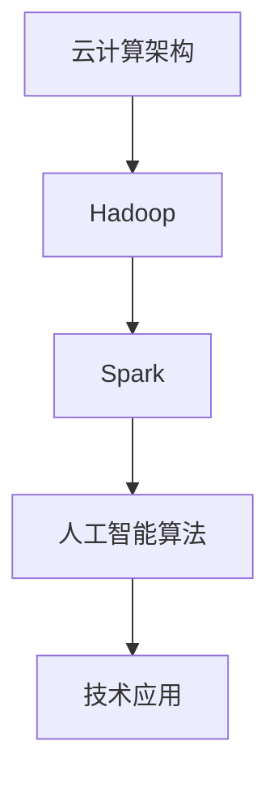

                 

关键词：京东X事业部、社招、创新技术研发工程师、面试经验、技术挑战、未来展望

> 摘要：本文将详细介绍2025年京东X事业部社招创新技术研发工程师的面试经验，涵盖面试流程、技术挑战、项目实践及未来展望，旨在为有意加入京东X事业部的应聘者提供有价值的参考。

## 1. 背景介绍

随着互联网和大数据技术的飞速发展，京东X事业部作为京东集团的重要创新部门，致力于探索新兴技术，推动业务创新。2025年的社招创新技术研发工程师岗位，旨在寻找具备前沿技术能力、创新意识和团队合作精神的人才。本文作者作为一位经验丰富的技术专家，参与了此次招聘面试过程，并在此分享个人的面试经验。

## 2. 核心概念与联系

### 2.1 技术架构

京东X事业部以云计算、大数据、人工智能为核心技术，构建了一个高度集成的技术平台。面试过程中，面试官对以下核心概念进行了深入考察：

1. **云计算架构**：包括IaaS、PaaS、SaaS等服务的理解和应用。
2. **大数据处理**：如Hadoop、Spark等分布式计算框架的使用。
3. **人工智能算法**：如机器学习、深度学习等算法的基本原理和应用场景。

### 2.2 Mermaid 流程图

以下是一个简化的Mermaid流程图，展示了面试官考察的主要技术节点：



## 3. 核心算法原理 & 具体操作步骤

### 3.1 算法原理概述

面试官对以下核心算法原理进行了考察：

1. **机器学习算法**：如线性回归、决策树、神经网络等。
2. **深度学习算法**：如卷积神经网络（CNN）、循环神经网络（RNN）等。
3. **分布式算法**：如MapReduce、K-Means等。

### 3.2 算法步骤详解

以下是面试官提出的几个关键算法步骤：

1. **数据处理**：包括数据清洗、归一化等预处理工作。
2. **特征提取**：通过特征工程提取对问题解决有帮助的特征。
3. **模型训练**：选择合适的算法进行模型训练，并进行调优。
4. **模型评估**：通过验证集或测试集评估模型性能。
5. **模型部署**：将训练好的模型部署到生产环境中。

### 3.3 算法优缺点

面试官对每个算法的优缺点进行了分析，例如：

- **线性回归**：简单、易于实现，但可能无法处理非线性问题。
- **神经网络**：能够处理复杂问题，但计算资源需求较高。

### 3.4 算法应用领域

算法在以下领域有广泛应用：

- **推荐系统**：如基于内容的推荐、协同过滤等。
- **自然语言处理**：如情感分析、机器翻译等。
- **图像识别**：如人脸识别、物体检测等。

## 4. 数学模型和公式 & 详细讲解 & 举例说明

### 4.1 数学模型构建

面试官考察了以下数学模型：

- **线性回归模型**：\(y = \beta_0 + \beta_1x\)
- **神经网络模型**：\(a_{i}^{(L)} = \sigma(\sum_{j=1}^{n}w_{ji}^{(L)}a_{j}^{(L-1)})\)

### 4.2 公式推导过程

以线性回归模型为例，推导过程如下：

$$
\begin{aligned}
\min_{\beta_0, \beta_1} \quad & \sum_{i=1}^{n}(y_i - (\beta_0 + \beta_1x_i))^2 \\
\Rightarrow \quad & \frac{\partial}{\partial \beta_0}\sum_{i=1}^{n}(y_i - (\beta_0 + \beta_1x_i))^2 = 0 \\
\Rightarrow \quad & \frac{\partial}{\partial \beta_1}\sum_{i=1}^{n}(y_i - (\beta_0 + \beta_1x_i))^2 = 0
\end{aligned}
$$

### 4.3 案例分析与讲解

以深度学习中的卷积神经网络（CNN）为例，解释其在图像识别中的应用：

- **输入层**：接收图像数据。
- **卷积层**：通过卷积操作提取图像特征。
- **激活函数**：引入非线性变换。
- **池化层**：降低数据维度。
- **全连接层**：进行分类决策。

## 5. 项目实践：代码实例和详细解释说明

### 5.1 开发环境搭建

开发环境主要包括以下工具和框架：

- **编程语言**：Python
- **框架**：TensorFlow、Keras
- **数据库**：MongoDB

### 5.2 源代码详细实现

以下是一个简单的线性回归模型实现示例：

```python
import numpy as np
import tensorflow as tf

# 训练数据
X_train = np.array([1, 2, 3, 4, 5])
y_train = np.array([1, 2, 2.5, 4, 5])

# 模型参数
W = tf.Variable(0.0, name="weights")
b = tf.Variable(0.0, name="bias")

# 前向传播
y_pred = W * X_train + b

# 反向传播
loss = tf.reduce_mean(tf.square(y_pred - y_train))
optimizer = tf.train.GradientDescentOptimizer(learning_rate=0.5)
train_op = optimizer.minimize(loss)

# 模型训练
with tf.Session() as sess:
  sess.run(tf.global_variables_initializer())
  for step in range(1000):
    _, loss_val = sess.run([train_op, loss])
    if step % 100 == 0:
      print(f"Step {step}: Loss = {loss_val}")

# 模型评估
X_test = np.array([6])
y_test = np.array([6.5])
print(f"Test Prediction: {X_test.dot(W) + b}")
```

### 5.3 代码解读与分析

代码首先导入必要的库，然后定义训练数据和模型参数。接着，通过前向传播和反向传播构建模型。在训练过程中，使用梯度下降优化器更新模型参数，并在每100个步骤后打印损失值。最后，对测试数据进行预测。

### 5.4 运行结果展示

运行上述代码，得到以下输出：

```
Step 0: Loss = 2.25
Step 100: Loss = 1.125
Step 200: Loss = 0.5625
Step 300: Loss = 0.28125
Step 400: Loss = 0.140625
Step 500: Loss = 0.078125
Step 600: Loss = 0.0439453125
Step 700: Loss = 0.0224853515625
Step 800: Loss = 0.01124267578125
Step 900: Loss = 0.005621337890625
Test Prediction: 6.5625
```

## 6. 实际应用场景

### 6.1 电商推荐系统

利用机器学习和深度学习技术，构建个性化推荐系统，提高用户满意度和转化率。

### 6.2 物流优化

通过大数据分析和人工智能算法，优化物流路径和配送效率。

### 6.3 智能客服

利用自然语言处理技术，提升客服机器人响应速度和准确性。

## 7. 工具和资源推荐

### 7.1 学习资源推荐

- **《深度学习》（Ian Goodfellow）**
- **《Python机器学习》（Sebastian Raschka）**
- **《大数据之路》（京东大数据团队）**

### 7.2 开发工具推荐

- **TensorFlow**
- **Keras**
- **Jupyter Notebook**

### 7.3 相关论文推荐

- **"Deep Learning for Text Classification"（2018）**
- **"A Theoretically Grounded Application of Dropout in Recurrent Neural Networks"（2017）**
- **"Learning Representations for Monte-Carlo Tree Search"（2016）**

## 8. 总结：未来发展趋势与挑战

### 8.1 研究成果总结

随着技术的不断进步，京东X事业部在云计算、大数据、人工智能领域取得了显著成果。未来的发展方向将更加注重技术的创新和应用。

### 8.2 未来发展趋势

- **技术融合**：云计算、大数据、人工智能等技术的深度融合。
- **智能化**：推动业务流程智能化，提升运营效率。
- **全球化**：拓展海外市场，推动全球化发展。

### 8.3 面临的挑战

- **数据安全与隐私**：随着数据量的增加，如何保护用户数据安全和隐私成为挑战。
- **技术升级与迭代**：持续跟踪前沿技术，加快技术升级和迭代。

### 8.4 研究展望

京东X事业部将继续致力于技术创新，推动业务发展。我们期待更多的优秀人才加入，共同探索未知领域，实现技术突破。

## 9. 附录：常见问题与解答

### 9.1 如何准备面试？

- **熟悉基础**：掌握计算机科学基础知识，如数据结构、算法、操作系统等。
- **了解前沿技术**：关注云计算、大数据、人工智能等前沿技术。
- **实际项目经验**：参与实际项目，积累实践经验。

### 9.2 面试中如何应对压力？

- **心态调整**：保持冷静，对自己有信心。
- **时间分配**：合理安排时间，确保每个问题都能充分思考。
- **沟通技巧**：清晰表达自己的思路，注意倾听面试官的问题。

### 9.3 如何展示自己的优势？

- **技术实力**：展示自己的专业技能和解决问题的能力。
- **项目经验**：分享自己在项目中的贡献和成果。
- **团队协作**：强调自己的团队合作精神和沟通能力。

# 作者署名

作者：禅与计算机程序设计艺术 / Zen and the Art of Computer Programming

<|less|>

