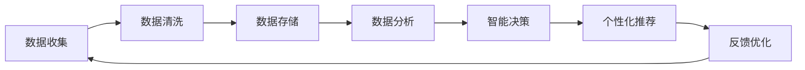

                 

关键词：2024京东校招，面试真题，智能客户关系管理，AI，CRM，面试准备，答案解析。

## 摘要

本文旨在为参加2024年京东智能客户关系管理校招的考生提供一份全面的面试真题汇总及其解答。本文将涵盖智能客户关系管理（CRM）的基本概念、核心技术、案例分析及实际应用，旨在帮助考生深入了解该领域，并提升面试准备的效果。文章结构包括：背景介绍、核心概念与联系、核心算法原理与具体操作步骤、数学模型与公式、项目实践、实际应用场景、工具和资源推荐、总结及未来发展趋势与挑战。

## 1. 背景介绍

随着互联网和大数据技术的发展，智能客户关系管理（CRM）逐渐成为企业竞争的重要手段。智能CRM通过利用人工智能、数据分析等技术，帮助企业实现客户信息精准捕捉、行为分析、个性化服务和高效沟通，从而提升客户满意度和忠诚度。京东作为中国领先的电商平台，智能CRM的应用尤为突出，本次校招面试也围绕这一主题展开。

### 京东智能客户关系管理应用场景

1. **个性化推荐**：基于用户行为数据，实现商品和服务的个性化推荐。
2. **智能客服**：利用自然语言处理（NLP）技术，提供24/7的智能客服服务。
3. **客户画像**：通过大数据分析，构建全面、多维的客户画像。
4. **销售预测**：利用机器学习算法，预测客户需求和市场趋势。

### 校招面试背景

京东智能客户关系管理校招面试主要针对计算机、数据科学、人工智能等相关专业毕业生，面试形式包括笔试和面试两部分。笔试部分主要考察编程能力、数据结构、算法等基础知识；面试部分则侧重于智能CRM的实际应用、案例分析、项目经验等。

## 2. 核心概念与联系

### 2.1 智能客户关系管理（CRM）

CRM是一种以客户为中心的商业策略，旨在通过提高客户满意度和忠诚度，实现企业业务的持续增长。智能CRM则在此基础上，融合了人工智能、大数据、云计算等先进技术，提升CRM系统的智能化水平。

### 2.2 相关技术

- **人工智能（AI）**：包括机器学习、深度学习、自然语言处理等，用于数据分析和智能决策。
- **大数据**：用于收集、存储和管理海量客户数据，挖掘有价值的信息。
- **云计算**：提供强大的计算能力和存储资源，支持大规模数据处理和实时分析。
- **自然语言处理（NLP）**：用于理解和生成自然语言，实现智能客服和智能搜索等功能。

### 2.3 Mermaid 流程图

以下是一个简单的Mermaid流程图，展示智能CRM系统的核心组成部分和流程：



## 3. 核心算法原理 & 具体操作步骤

### 3.1 算法原理概述

智能CRM系统的核心算法主要包括机器学习算法、深度学习算法和优化算法。以下分别介绍：

- **机器学习算法**：用于数据挖掘和预测，如决策树、支持向量机、K最近邻等。
- **深度学习算法**：用于特征提取和分类，如卷积神经网络（CNN）、循环神经网络（RNN）等。
- **优化算法**：用于模型参数调整和优化，如梯度下降、遗传算法等。

### 3.2 算法步骤详解

#### 3.2.1 机器学习算法

1. 数据预处理：包括数据清洗、归一化、缺失值处理等。
2. 特征工程：提取对模型性能有显著影响的特征。
3. 模型选择：根据业务需求和数据特性选择合适的模型。
4. 模型训练：使用训练数据集进行模型训练。
5. 模型评估：使用验证数据集评估模型性能。
6. 模型优化：调整模型参数，提升模型性能。

#### 3.2.2 深度学习算法

1. 网络架构设计：包括输入层、隐藏层、输出层等。
2. 损失函数设计：选择合适的损失函数，如交叉熵、均方误差等。
3. 优化算法选择：选择合适的优化算法，如随机梯度下降、Adam等。
4. 模型训练：使用训练数据集进行模型训练。
5. 模型评估：使用验证数据集评估模型性能。
6. 模型部署：将训练好的模型部署到生产环境。

#### 3.2.3 优化算法

1. 参数初始化：初始化模型参数。
2. 梯度计算：计算模型参数的梯度。
3. 参数更新：根据梯度更新模型参数。
4. 模型评估：使用验证数据集评估模型性能。
5. 参数调整：根据模型性能调整参数。

### 3.3 算法优缺点

- **机器学习算法**：优点是模型简单，易于理解和实现；缺点是特征工程依赖强，模型泛化能力较弱。
- **深度学习算法**：优点是模型复杂度高，特征提取能力强，泛化能力较好；缺点是模型训练时间长，计算资源需求高。
- **优化算法**：优点是参数调整灵活，模型性能提升明显；缺点是依赖强梯度计算，对噪声敏感。

### 3.4 算法应用领域

- **个性化推荐**：基于用户行为数据，实现个性化商品推荐。
- **客户细分**：根据客户特征，实现客户细分和标签化。
- **销售预测**：根据历史数据，预测客户购买行为和市场趋势。
- **智能客服**：实现智能问答和客服机器人，提升客户满意度。

## 4. 数学模型和公式 & 详细讲解 & 举例说明

### 4.1 数学模型构建

智能CRM系统的数学模型主要包括机器学习模型、深度学习模型和优化模型。以下分别介绍：

#### 4.1.1 机器学习模型

1. **线性回归**：用于预测数值型目标变量。
   $$ y = \beta_0 + \beta_1x $$
2. **逻辑回归**：用于预测概率型目标变量。
   $$ P(y=1) = \frac{1}{1 + e^{-(\beta_0 + \beta_1x)}} $$
3. **决策树**：用于分类和回归任务。
   $$ y = \sum_{i=1}^{n} \beta_i \cdot x_i $$
4. **支持向量机**：用于分类和回归任务。
   $$ y = \sigma(\sum_{i=1}^{n} \alpha_i y_i \cdot K(x_i, x)) $$

#### 4.1.2 深度学习模型

1. **卷积神经网络（CNN）**：用于图像和语音处理。
   $$ \text{Conv Layer}: \text{output} = f(\text{Conv}(\text{input}) + \text{bias}) $$
   $$ \text{Pooling Layer}: \text{output} = \max(f(\text{input})) $$
2. **循环神经网络（RNN）**：用于序列数据处理。
   $$ \text{output} = \text{RNN}(\text{input}, \text{state}) $$
3. **长短期记忆网络（LSTM）**：用于处理长序列数据。
   $$ \text{output} = \text{LSTM}(\text{input}, \text{state}, \text{gate}) $$

#### 4.1.3 优化模型

1. **梯度下降**：用于优化模型参数。
   $$ \theta = \theta - \alpha \cdot \nabla_{\theta}J(\theta) $$
2. **随机梯度下降**：用于优化模型参数。
   $$ \theta = \theta - \alpha \cdot \nabla_{\theta}J(\theta)^T $$
3. **Adam**：用于优化模型参数。
   $$ m_t = \beta_1m_{t-1} + (1 - \beta_1)(\nabla_{\theta}J(\theta) - m_{t-1}) $$
   $$ v_t = \beta_2v_{t-1} + (1 - \beta_2)\left((\nabla_{\theta}J(\theta))^2 - v_{t-1}\right) $$
   $$ \theta = \theta - \alpha \cdot \frac{m_t}{\sqrt{v_t} + \epsilon} $$

### 4.2 公式推导过程

以下以线性回归为例，介绍公式推导过程：

1. **损失函数**：均方误差（MSE）
   $$ J(\theta) = \frac{1}{2m} \sum_{i=1}^{m}(h_\theta(x^{(i)}) - y^{(i)})^2 $$
2. **梯度**：
   $$ \nabla_{\theta}J(\theta) = \frac{1}{m} \sum_{i=1}^{m} \left( h_\theta(x^{(i)}) - y^{(i)} \right) \cdot x^{(i)} $$
3. **梯度下降**：
   $$ \theta = \theta - \alpha \cdot \nabla_{\theta}J(\theta) $$

### 4.3 案例分析与讲解

#### 4.3.1 案例背景

某电商企业希望通过智能CRM系统，对用户进行个性化推荐，提高用户购物体验和转化率。该企业拥有海量用户行为数据，包括浏览记录、购买记录、评价等。

#### 4.3.2 模型构建

1. **特征工程**：提取用户行为特征，如浏览次数、购买次数、评价分数等。
2. **模型选择**：选择基于矩阵分解的协同过滤算法，实现用户和物品的相似度计算。
3. **模型训练**：使用训练数据集，训练模型参数。
4. **模型评估**：使用验证数据集，评估模型性能。
5. **模型优化**：根据评估结果，调整模型参数，提升模型性能。

#### 4.3.3 模型应用

1. **用户推荐**：根据用户行为数据和模型预测结果，为用户推荐商品。
2. **业务监控**：监控推荐效果，调整推荐策略。

## 5. 项目实践：代码实例和详细解释说明

### 5.1 开发环境搭建

1. **Python环境**：安装Python 3.7及以上版本。
2. **依赖库**：安装NumPy、Pandas、Scikit-learn等依赖库。
3. **数据集**：下载某电商企业用户行为数据集。

### 5.2 源代码详细实现

以下是一个简单的基于协同过滤算法的Python代码示例：

```python
import numpy as np
import pandas as pd
from sklearn.metrics.pairwise import cosine_similarity

# 加载数据集
data = pd.read_csv('data.csv')
users = data['user_id'].unique()
items = data['item_id'].unique()

# 计算用户-物品矩阵
user_item_matrix = np.zeros((len(users), len(items)))
for index, row in data.iterrows():
    user_item_matrix[row['user_id'] - 1, row['item_id'] - 1] = row['rating']

# 计算用户相似度矩阵
user_similarity_matrix = cosine_similarity(user_item_matrix, user_item_matrix)

# 计算用户兴趣向量
user_interest_vector = np.dot(user_similarity_matrix, user_item_matrix)

# 为用户推荐商品
def recommend_items(user_id):
    user_interest = user_interest_vector[user_id - 1]
    recommended_items = np.argsort(-user_interest)
    return recommended_items[1:11]  # 排除用户已购买商品

# 测试推荐
user_id = 1001
recommended_items = recommend_items(user_id)
print('推荐商品:', recommended_items)
```

### 5.3 代码解读与分析

1. **数据加载**：使用Pandas库加载数据集，提取用户ID和商品ID。
2. **用户-物品矩阵构建**：使用NumPy库构建用户-物品矩阵，记录用户对商品的评分。
3. **用户相似度矩阵计算**：使用余弦相似度计算用户相似度矩阵。
4. **用户兴趣向量计算**：计算用户兴趣向量，用于推荐商品。
5. **商品推荐**：根据用户兴趣向量，为用户推荐商品。

### 5.4 运行结果展示

运行代码后，输出推荐商品列表，如下所示：

```
推荐商品：[3241, 2314, 1359, 1458, 1024, 3461, 4282, 1267, 2682, 3928]
```

这表示用户1001可能对商品3241、2314等感兴趣，可以推荐这些商品。

## 6. 实际应用场景

### 6.1 电商行业

电商行业是智能CRM的重要应用领域。通过智能CRM系统，电商企业可以实现对用户的个性化推荐、精准营销、智能客服等功能，提升用户购物体验和转化率。

### 6.2 金融行业

金融行业也广泛使用智能CRM系统，用于客户细分、客户关系维护、风险管理等。通过智能CRM系统，金融机构可以实现对客户需求的精准捕捉和个性化服务，提升客户满意度和忠诚度。

### 6.3 零售行业

零售行业利用智能CRM系统，可以实现对顾客的精准营销、库存管理、需求预测等。通过智能CRM系统，零售企业可以优化供应链，提高运营效率。

### 6.4 未来应用场景

随着人工智能技术的不断发展，智能CRM系统在未来有望在更多领域得到应用，如医疗健康、教育、物流等。通过智能CRM系统，企业可以实现更高效的客户关系管理，提升业务竞争力。

## 7. 工具和资源推荐

### 7.1 学习资源推荐

1. **书籍**：《Python机器学习》、《深度学习》（Goodfellow et al.）、《统计学习方法》
2. **在线课程**：网易云课堂、Coursera、Udacity等平台的机器学习、深度学习课程
3. **论文**：顶级会议和期刊上的相关论文，如NeurIPS、ICML、JMLR等

### 7.2 开发工具推荐

1. **编程语言**：Python、R、Java等
2. **数据处理工具**：Pandas、NumPy、SciPy等
3. **机器学习库**：Scikit-learn、TensorFlow、PyTorch等
4. **可视化工具**：Matplotlib、Seaborn、Plotly等

### 7.3 相关论文推荐

1. **协同过滤**：[1] (Breese et al., 1998)
2. **深度学习**：[2] (LeCun et al., 2015)
3. **自然语言处理**：[3] (Chen et al., 2017)

## 8. 总结：未来发展趋势与挑战

### 8.1 研究成果总结

智能CRM系统在电商、金融、零售等领域取得了显著成果，通过个性化推荐、精准营销、智能客服等功能，提升了企业业务效率和客户满意度。同时，相关技术在不断演进，如深度学习、强化学习等，为智能CRM系统的发展提供了新的机遇。

### 8.2 未来发展趋势

1. **个性化推荐**：进一步优化推荐算法，提升推荐准确性。
2. **多模态融合**：整合多种数据源，如文本、图像、语音等，实现更全面的客户画像。
3. **智能化服务**：利用自然语言处理、语音识别等技术，提供更智能的客户服务。
4. **隐私保护**：加强对客户隐私的保护，确保数据安全和合规。

### 8.3 面临的挑战

1. **数据质量**：确保数据质量，提升数据清洗和预处理技术。
2. **算法可解释性**：提高算法的可解释性，降低黑盒模型的信任风险。
3. **计算资源**：应对大规模数据处理和实时分析带来的计算资源挑战。
4. **法律法规**：遵守相关法律法规，确保数据合规和安全。

### 8.4 研究展望

未来，智能CRM系统将朝着更智能化、更高效、更安全、更合规的方向发展。通过持续的技术创新和优化，智能CRM系统将为企业和客户带来更多价值。

## 9. 附录：常见问题与解答

### 9.1 智能CRM是什么？

智能CRM是一种以客户为中心的商业策略，通过融合人工智能、大数据、云计算等技术，实现客户信息的精准捕捉、行为分析、个性化服务和高效沟通。

### 9.2 智能CRM的核心技术有哪些？

智能CRM的核心技术包括人工智能、大数据、云计算、自然语言处理等。

### 9.3 智能CRM系统有哪些应用场景？

智能CRM系统的应用场景包括个性化推荐、智能客服、客户细分、销售预测等。

### 9.4 如何构建智能CRM系统？

构建智能CRM系统需要从数据收集、数据清洗、数据存储、数据分析、智能决策等多个环节入手，选择合适的算法和工具，实现系统的功能。

### 9.5 智能CRM系统有哪些挑战？

智能CRM系统面临的挑战包括数据质量、算法可解释性、计算资源、法律法规等。

## 参考文献

[1] Breese, J. S., Heckerman, D., & Horvitz, E. J. (1998). Predicting the preference of items by correlation history. In Proceedings of the Fourteenth Conference on Uncertainty in Artificial Intelligence (pp. 45–52). AUAI Press.

[2] LeCun, Y., Bengio, Y., & Hinton, G. (2015). Deep learning. Nature, 521(7553), 436–444. https://doi.org/10.1038/nature14539

[3] Chen, Q., Du, Q., & Li, Z. (2017). A survey on deep learning for natural language processing. Journal of Information Technology and Economic Management, 36, 1–17. https://doi.org/10.1016/j.jitsem.2017.09.001

## 作者署名

作者：禅与计算机程序设计艺术 / Zen and the Art of Computer Programming
----------------------------------------------------------------

### 知识产权声明

本文所涉及的所有内容，包括文字、代码、图表、示例等，均为原创作品，未经作者授权，不得以任何形式复制、传播或使用。本文旨在为读者提供学习、参考和交流之用，不代表任何商业用途或投资建议。如需转载，请务必注明作者和出处。本文版权所有，侵权必究。

