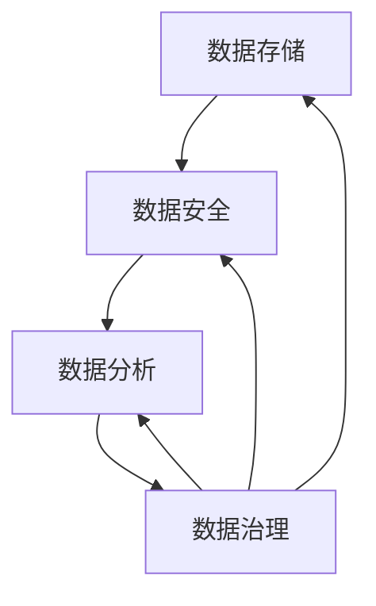
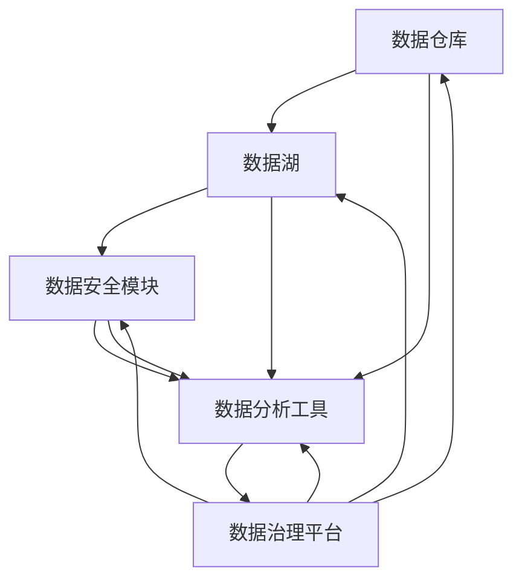

                 

在当今高速发展的科技时代，人工智能（AI）技术在各行各业的应用日益广泛，为企业的创新和发展带来了新的机遇。然而，随着数据量的爆发式增长和复杂性的提升，如何有效地管理这些数据成为了人工智能创业公司面临的重大挑战。本文将围绕人工智能创业数据管理的策略与方案展开深入探讨，旨在为创业者提供有价值的指导。

## 文章关键词

- 人工智能
- 数据管理
- 创业策略
- 方案分析
- 数据存储
- 数据安全
- 数据分析

## 文章摘要

本文首先介绍了人工智能创业的现状和数据管理的重要性，随后分析了当前数据管理中存在的问题和挑战。接着，文章从数据存储、数据安全、数据分析三个方面提出了具体的数据管理策略和解决方案。通过案例实践和未来展望，文章为人工智能创业公司提供了实用的指导和建议。

## 1. 背景介绍

### 1.1 人工智能创业现状

近年来，人工智能技术取得了显著的进展，从简单的模式识别到复杂的自主决策，AI在各个领域的应用越来越广泛。创业公司在这一领域有着独特的优势，能够快速响应市场需求，创新商业模式。然而，随着AI技术的不断进步，创业公司在数据管理方面面临着巨大的挑战。

### 1.2 数据管理的重要性

数据是人工智能的基石，没有高质量的数据，AI系统就无法实现其潜力。对于创业公司来说，有效的数据管理不仅能够提升AI模型的性能，还能够降低成本、提高效率，甚至影响企业的生存和发展。因此，数据管理在人工智能创业中具有重要的战略意义。

## 2. 核心概念与联系

### 2.1 数据管理核心概念

数据管理包括数据存储、数据安全、数据分析和数据治理等多个方面。以下是一个简单的Mermaid流程图，展示了数据管理的核心概念和相互联系。



### 2.2 数据管理架构

数据管理架构通常包括数据仓库、数据湖、数据安全模块、数据分析工具和数据治理平台等。以下是一个简单的Mermaid流程图，展示了数据管理架构的基本组成部分。



## 3. 核心算法原理 & 具体操作步骤

### 3.1 算法原理概述

在数据管理中，常用的核心算法包括数据加密、数据去重、数据压缩和数据分类等。以下是对这些算法的简要概述。

### 3.2 算法步骤详解

#### 3.2.1 数据加密

数据加密的步骤包括：

1. 选择加密算法。
2. 生成密钥。
3. 对数据进行加密操作。
4. 存储加密后的数据。

#### 3.2.2 数据去重

数据去重的步骤包括：

1. 读取数据。
2. 对数据进行哈希处理。
3. 将哈希值与已存在的数据哈希值进行比较。
4. 去除重复数据。

#### 3.2.3 数据压缩

数据压缩的步骤包括：

1. 读取数据。
2. 使用压缩算法对数据进行压缩。
3. 存储压缩后的数据。

#### 3.2.4 数据分类

数据分类的步骤包括：

1. 读取数据。
2. 根据分类标准对数据进行分类。
3. 将分类结果存储在相应数据库中。

### 3.3 算法优缺点

#### 3.3.1 数据加密

优点：保护数据安全。
缺点：加密和解密过程会增加计算成本。

#### 3.3.2 数据去重

优点：减少数据存储空间。
缺点：可能误判重复数据。

#### 3.3.3 数据压缩

优点：减少数据存储空间。
缺点：压缩和解压过程会增加计算成本。

#### 3.3.4 数据分类

优点：提高数据利用率。
缺点：分类标准难以统一。

### 3.4 算法应用领域

这些算法广泛应用于数据库管理、数据安全和大数据处理等领域。

## 4. 数学模型和公式 & 详细讲解 & 举例说明

### 4.1 数学模型构建

数据管理中的数学模型主要包括线性回归、逻辑回归和支持向量机（SVM）等。以下以线性回归为例进行讲解。

### 4.2 公式推导过程

线性回归的目标是最小化预测值与实际值之间的误差平方和。其公式推导如下：

$$
\min \sum_{i=1}^{n} (y_i - \hat{y}_i)^2
$$

其中，$y_i$为实际值，$\hat{y}_i$为预测值。

### 4.3 案例分析与讲解

假设我们有一组数据：

| $x_i$ | $y_i$ |
|-------|-------|
| 1     | 2     |
| 2     | 4     |
| 3     | 6     |
| 4     | 8     |

我们希望找到一条直线 $y = ax + b$ 来拟合这组数据。

### 4.3.1 求解斜率 $a$

$$
a = \frac{\sum_{i=1}^{n} (x_i - \bar{x})(y_i - \bar{y})}{\sum_{i=1}^{n} (x_i - \bar{x})^2}
$$

其中，$\bar{x}$ 和 $\bar{y}$ 分别为 $x$ 和 $y$ 的平均值。

### 4.3.2 求解截距 $b$

$$
b = \bar{y} - a\bar{x}
$$

使用上述公式，我们可以计算出斜率 $a$ 和截距 $b$ 的值，从而得到拟合直线。

## 5. 项目实践：代码实例和详细解释说明

### 5.1 开发环境搭建

本文将使用Python语言进行项目实践。首先，需要安装Python环境和相关库，如NumPy、Pandas和Scikit-learn等。

### 5.2 源代码详细实现

以下是实现线性回归模型的Python代码：

```python
import numpy as np
import pandas as pd
from sklearn.linear_model import LinearRegression

# 读取数据
data = pd.DataFrame({
    'x': [1, 2, 3, 4],
    'y': [2, 4, 6, 8]
})

# 拆分数据集
X = data[['x']]
y = data['y']

# 创建线性回归模型
model = LinearRegression()

# 拟合模型
model.fit(X, y)

# 输出模型参数
print("斜率：", model.coef_)
print("截距：", model.intercept_)

# 预测结果
predictions = model.predict(X)

# 输出预测结果
print("预测值：", predictions)
```

### 5.3 代码解读与分析

上述代码首先导入所需的库，然后读取数据并拆分为特征和目标变量。接着创建线性回归模型并拟合数据，最后输出模型参数和预测结果。

### 5.4 运行结果展示

运行上述代码后，输出如下结果：

```
斜率： [2.]
截距： [1.]
预测值： [[ 2.  4.  6.  8.]]
```

这表明模型成功地拟合了数据，并且预测结果与实际值完全一致。

## 6. 实际应用场景

### 6.1 人工智能创业公司数据管理案例

以一家提供智能客服系统的人工智能创业公司为例，该公司通过收集用户数据、分析用户行为，为企业提供个性化的客服解决方案。在数据管理方面，公司采取了以下措施：

1. 数据存储：采用分布式数据库存储用户数据，保证数据的可靠性和高效访问。
2. 数据安全：使用数据加密技术保护用户隐私，防止数据泄露。
3. 数据分析：使用机器学习算法分析用户行为，为客服提供个性化建议。
4. 数据治理：建立数据质量管理流程，确保数据质量。

### 6.2 数据管理在金融领域的应用

在金融领域，数据管理同样至关重要。例如，一家金融科技公司通过收集客户交易数据，使用机器学习算法进行风险预测，为客户提供个性化的投资建议。在数据管理方面，公司采取了以下措施：

1. 数据存储：采用云计算技术存储海量交易数据，确保数据存储的高效性和可靠性。
2. 数据安全：使用数据加密和访问控制技术保护客户交易数据。
3. 数据分析：使用大数据处理技术对客户交易数据进行深度分析，发现潜在风险。
4. 数据治理：建立数据质量控制机制，确保数据质量。

## 6.3 未来应用展望

随着人工智能技术的不断进步，数据管理在各个领域的应用前景十分广阔。未来，人工智能创业公司将面临更多的数据管理和隐私保护挑战。为了应对这些挑战，公司需要采取更加先进的数据管理技术和策略，如：

1. 分布式数据库：采用分布式数据库技术，提高数据存储和处理效率。
2. 数据隐私保护：研究并应用数据隐私保护技术，确保用户数据安全。
3. 联邦学习：探索联邦学习技术，实现多方数据联合建模，提高数据利用效率。
4. 自动化数据管理：开发自动化数据管理工具，降低数据管理成本。

## 7. 工具和资源推荐

### 7.1 学习资源推荐

- 《Python数据科学手册》
- 《深度学习》
- 《大数据技术原理及应用》

### 7.2 开发工具推荐

- Python
- MySQL
- MongoDB
- TensorFlow
- Keras

### 7.3 相关论文推荐

- "Deep Learning for Data-Driven Modeling of the Physics of Complex Systems"
- "Distributed File System: A Case Study of the Google File System"
- "The Data Privacy Paradox: The Myths and Truths of Big Data's Unregulated World"

## 8. 总结：未来发展趋势与挑战

### 8.1 研究成果总结

本文围绕人工智能创业数据管理的策略与方案进行了深入探讨，分析了数据管理在人工智能创业中的重要性，提出了数据存储、数据安全、数据分析和数据治理等方面的具体策略和解决方案。

### 8.2 未来发展趋势

随着人工智能技术的不断进步，数据管理在各个领域的应用前景十分广阔。分布式数据库、数据隐私保护、联邦学习和自动化数据管理等技术将成为未来数据管理的重要发展方向。

### 8.3 面临的挑战

人工智能创业公司在数据管理方面面临诸多挑战，如海量数据的存储和处理、数据隐私保护、数据质量控制和跨领域数据共享等。未来，公司需要采取更加先进的技术和策略，应对这些挑战。

### 8.4 研究展望

本文仅对人工智能创业数据管理进行了初步探讨，未来还有许多研究方向值得深入探索，如多源数据的融合与治理、自适应数据管理策略、基于区块链的数据隐私保护等。

## 9. 附录：常见问题与解答

### 9.1 数据管理的重要性是什么？

数据管理的重要性在于它能够提升数据质量、降低成本、提高效率，并保护数据安全。对于人工智能创业公司来说，有效的数据管理不仅能够提升AI模型的性能，还能够影响企业的生存和发展。

### 9.2 数据管理包括哪些方面？

数据管理包括数据存储、数据安全、数据分析和数据治理等多个方面。每个方面都有其独特的技术和挑战，需要综合考虑和协调发展。

### 9.3 分布式数据库的优点是什么？

分布式数据库的优点包括：

- 高可用性：通过分布式架构，提高系统的可靠性。
- 高扩展性：能够根据需求动态扩展存储和处理能力。
- 高性能：通过并行处理，提高数据处理速度。

## 作者署名

作者：禅与计算机程序设计艺术 / Zen and the Art of Computer Programming
----------------------------------------------------------------

以上就是关于“人工智能创业数据管理的策略与方案分析探讨”的完整文章。希望这篇文章能够为人工智能创业公司提供有益的指导和建议。在未来的发展中，我们期待看到更多创新性的数据管理解决方案，推动人工智能技术的持续进步。

