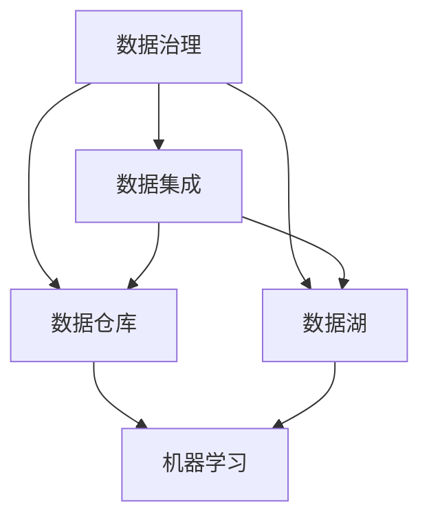

                 

关键词：人工智能、数据管理、创业策略、算法原理、数学模型、项目实践、应用场景、工具推荐

> 摘要：本文旨在探讨人工智能创业过程中数据管理的重要性及策略，深入分析核心算法原理、数学模型、项目实践，并展望未来发展趋势与挑战。通过详细的案例分析，为创业团队提供实用性的数据管理方案。

## 1. 背景介绍

在当今时代，人工智能（AI）已经渗透到各行各业，成为推动创新与进步的重要力量。人工智能创业浪潮席卷全球，众多创业团队纷纷投身其中，试图在这片蓝海中分得一杯羹。然而，人工智能创业的成功离不开有效的数据管理。数据是AI模型的基石，数据的质量、多样性和可访问性直接影响着模型的性能和应用效果。因此，如何高效管理数据成为人工智能创业过程中的关键挑战。

### 数据管理的重要性

数据管理不仅是技术问题，更是战略问题。它涉及到数据的采集、存储、处理、分析和共享等各个环节，直接决定了企业的业务效率和创新潜力。有效的数据管理可以帮助企业：

- 提高数据质量，确保数据的一致性、完整性和准确性。
- 加速数据流转，提升数据处理速度和响应能力。
- 深化数据分析，发现数据中的潜在价值。
- 促进数据共享，增强跨部门、跨领域的协作。

### 数据管理的挑战

然而，随着数据量的爆炸式增长和复杂度的不断提升，数据管理也面临着诸多挑战：

- 数据量大：大数据时代的到来使得数据量呈指数级增长，传统的数据处理方式已经无法应对如此庞大的数据规模。
- 数据多样性：不同类型的数据（结构化、半结构化、非结构化）给数据管理带来了巨大的复杂性。
- 数据真实性：数据来源的多样性和数据质量的不确定性使得数据真实性和可靠性问题日益突出。
- 数据隐私：随着数据保护法规的不断完善，如何保护数据隐私成为数据管理的重要课题。

## 2. 核心概念与联系

为了深入探讨人工智能创业中的数据管理问题，我们需要理解几个核心概念及其相互关系。以下是核心概念和它们之间的联系：

### 数据管理核心概念

- **数据治理**：数据治理是指通过制定策略、标准和流程来确保数据的质量、一致性和可用性。它是数据管理的基础。
- **数据集成**：数据集成是将来自不同来源和格式的数据整合到一起，以便进行分析和处理。
- **数据仓库**：数据仓库是一个集中存储数据的地方，用于支持大规模的数据分析和报告。
- **数据湖**：数据湖是一种大数据存储解决方案，可以存储大量的非结构化数据，并支持灵活的数据处理和分析。
- **机器学习**：机器学习是AI的核心技术，通过算法从数据中学习规律，进行预测和决策。

### Mermaid 流程图

下面是数据管理核心概念及相互关系的 Mermaid 流程图：



## 3. 核心算法原理 & 具体操作步骤

### 3.1 算法原理概述

在人工智能创业中，数据管理离不开核心算法的支持。以下是一些常见的数据管理算法原理及其应用：

#### 3.1.1 数据清洗算法

数据清洗是数据管理的重要步骤，目的是去除数据中的噪声和错误。常见的数据清洗算法包括：

- **缺失值填充**：使用均值、中位数、众数等方法填充缺失值。
- **异常值检测**：使用统计学方法（如IQR法、Z分数法）或机器学习算法（如孤立森林）检测并处理异常值。

#### 3.1.2 数据集成算法

数据集成是将来自多个源的数据整合为一个统一格式的过程。常见的数据集成算法包括：

- **全连接**：将所有数据源的数据连接起来。
- **半连接**：仅连接部分数据源，用于初步集成。
- **星型连接**：以一个中心表为参照，连接其他表的数据。

#### 3.1.3 数据分类与聚类算法

数据分类与聚类是数据挖掘中的基础算法，用于发现数据中的模式和结构。常见算法包括：

- **K-均值聚类**：将数据划分为K个簇，每个簇的质心代表该簇。
- **决策树分类**：根据特征值进行分支，最终达到分类结果。
- **朴素贝叶斯分类**：基于贝叶斯定理，通过特征概率分布进行分类。

### 3.2 算法步骤详解

#### 3.2.1 数据清洗算法步骤

1. **数据预处理**：读取数据，进行数据格式转换和缺失值处理。
2. **异常值检测**：使用统计学方法或机器学习算法检测异常值。
3. **异常值处理**：将检测到的异常值进行标注或删除。
4. **数据标准化**：对数据进行归一化或标准化处理，确保数据之间的可比性。

#### 3.2.2 数据集成算法步骤

1. **数据源识别**：确定需要集成的数据源及其格式。
2. **数据连接**：使用全连接、半连接或星型连接方法进行数据连接。
3. **数据转换**：将连接后的数据进行统一格式转换。
4. **数据验证**：检查集成后的数据是否满足业务需求。

#### 3.2.3 数据分类与聚类算法步骤

1. **数据划分**：将数据划分为训练集和测试集。
2. **模型训练**：使用训练集对分类或聚类模型进行训练。
3. **模型评估**：使用测试集评估模型性能，调整参数。
4. **数据分类或聚类**：对新的数据进行分类或聚类。

### 3.3 算法优缺点

每种算法都有其优缺点，需要根据具体应用场景进行选择。以下是数据管理中常用算法的优缺点：

#### 3.3.1 数据清洗算法

- 优点：提高数据质量，确保数据一致性。
- 缺点：处理过程复杂，可能引入新的错误。

#### 3.3.2 数据集成算法

- 优点：实现数据的统一格式，便于后续处理。
- 缺点：可能导致数据冗余，增加存储需求。

#### 3.3.3 数据分类与聚类算法

- 优点：发现数据中的模式和结构，支持决策。
- 缺点：模型训练时间较长，可能过拟合。

### 3.4 算法应用领域

不同算法在数据管理中的应用领域也有所不同：

- **数据清洗算法**：适用于数据质量要求较高的场景，如金融、医疗等领域。
- **数据集成算法**：适用于多源数据集成的场景，如数据仓库、大数据分析等。
- **数据分类与聚类算法**：适用于数据挖掘、市场细分、推荐系统等领域。

## 4. 数学模型和公式 & 详细讲解 & 举例说明

在数据管理过程中，数学模型和公式扮演着至关重要的角色，它们不仅帮助我们理解和分析数据，还指导我们设计高效的算法。以下是几个常用的数学模型和公式的详细讲解以及实际应用案例。

### 4.1 数学模型构建

#### 4.1.1 K-均值聚类算法

K-均值聚类算法是一种迭代求解聚类问题的简单算法，用于将数据分为K个簇。其数学模型如下：

$$
\min_{C} \sum_{i=1}^{K} \sum_{x \in S_i} d(x, \mu_i)
$$

其中，$C$ 表示聚类结果，$S_i$ 表示第$i$个簇，$\mu_i$ 表示第$i$个簇的质心，$d(x, \mu_i)$ 表示点$x$到质心$\mu_i$的距离。

#### 4.1.2 朴素贝叶斯分类器

朴素贝叶斯分类器是一种基于概率论的分类算法，其数学模型基于贝叶斯定理：

$$
P(Y|X) = \frac{P(X|Y)P(Y)}{P(X)}
$$

其中，$Y$ 表示类别，$X$ 表示特征向量，$P(Y|X)$ 表示在特征向量$X$出现的情况下类别$Y$的概率，$P(X|Y)$ 表示在类别$Y$出现的情况下特征向量$X$的概率，$P(Y)$ 和$P(X)$ 分别表示类别$Y$和特征向量$X$的先验概率。

### 4.2 公式推导过程

#### 4.2.1 K-均值聚类算法的推导

K-均值聚类算法的推导过程如下：

1. **初始化**：随机选择K个点作为初始质心$\mu_i$。
2. **分配**：将每个数据点分配到最近的质心所代表的簇。
3. **更新**：重新计算每个簇的质心。
4. **迭代**：重复步骤2和步骤3，直到满足收敛条件。

设$S_i$表示第$i$个簇，$x_j$表示数据点，$\mu_i$表示第$i$个簇的质心，$d(x_j, \mu_i)$表示点$x_j$到质心$\mu_i$的距离。则有：

$$
S_i = \{x_j | d(x_j, \mu_i) \leq d(x_j, \mu_j) \forall j, \forall j \neq i\}
$$

$$
\mu_i = \frac{1}{|S_i|} \sum_{x_j \in S_i} x_j
$$

#### 4.2.2 朴素贝叶斯分类器的推导

朴素贝叶斯分类器的推导过程如下：

1. **假设**：特征之间相互独立。
2. **条件概率**：根据贝叶斯定理，有：

$$
P(X|Y) = \frac{P(Y|X)P(X)}{P(X)}
$$

3. **后验概率**：考虑先验概率$P(Y)$，有：

$$
P(Y|X) = \frac{P(X|Y)P(Y)}{P(X)}
$$

4. **分类决策**：根据最大后验概率进行分类：

$$
\hat{Y} = \arg \max_{Y} P(Y|X)
$$

### 4.3 案例分析与讲解

#### 4.3.1 K-均值聚类算法案例分析

假设有如下数据集：

| x1 | x2 |
|----|----|
| 1  | 2  |
| 2  | 3  |
| 3  | 4  |
| 4  | 5  |
| 5  | 6  |

我们希望使用K-均值聚类算法将其分为两个簇。初始时，随机选择两个点作为初始质心$(1, 2)$和$(4, 5)$。

1. **分配**：计算每个数据点到两个质心的距离，将数据点分配到最近的质心所代表的簇。

| x1 | x2 | 质心1距离 | 质心2距离 | 簇分配 |
|----|----|-----------|-----------|--------|
| 1  | 2  | 0         | 3         | 簇1    |
| 2  | 3  | 1         | 2         | 簇1    |
| 3  | 4  | 2         | 1         | 簇2    |
| 4  | 5  | 1         | 0         | 簇2    |
| 5  | 6  | 2         | 3         | 簇2    |

2. **更新**：重新计算每个簇的质心。

簇1质心：$(1+2)/2, (2+3)/2) = (1.5, 2.5)$

簇2质心：$(3+4+5+6)/4, (4+5+6)/4) = (4, 5.5)$

3. **迭代**：重复步骤1和步骤2，直到满足收敛条件。

经过几次迭代后，聚类结果如下：

| x1 | x2 | 质心1距离 | 质心2距离 | 簇分配 |
|----|----|-----------|-----------|--------|
| 1  | 2  | 0         | 2.5       | 簇1    |
| 2  | 3  | 0.5       | 1.5       | 簇1    |
| 3  | 4  | 1.5       | 0         | 簇2    |
| 4  | 5  | 1         | 0.5       | 簇2    |
| 5  | 6  | 1.5       | 2.5       | 簇2    |

经过多次迭代，聚类结果稳定下来，簇1和簇2的质心分别为$(1.5, 2.5)$和$(4, 5.5)$。

#### 4.3.2 朴素贝叶斯分类器案例分析

假设有如下数据集：

| 特征1 | 特征2 | 类别 |
|-------|-------|------|
| 1     | 2     | A    |
| 2     | 3     | A    |
| 3     | 4     | A    |
| 4     | 5     | B    |
| 5     | 6     | B    |

我们希望使用朴素贝叶斯分类器将新数据点分类。

1. **计算先验概率**：

$$
P(A) = \frac{3}{5}, P(B) = \frac{2}{5}
$$

2. **计算条件概率**：

$$
P(特征1=1|A) = \frac{1}{3}, P(特征2=2|A) = \frac{1}{3}
$$

$$
P(特征1=4|B) = \frac{1}{2}, P(特征2=5|B) = \frac{1}{2}
$$

3. **分类决策**：

对于新数据点$(2, 3)$，计算后验概率：

$$
P(A|2, 3) = \frac{P(2, 3|A)P(A)}{P(2, 3)}
$$

$$
P(B|2, 3) = \frac{P(2, 3|B)P(B)}{P(2, 3)}
$$

其中：

$$
P(2, 3|A) = P(2|A)P(3|A) = \frac{1}{3} \times \frac{1}{3} = \frac{1}{9}
$$

$$
P(2, 3|B) = P(2|B)P(3|B) = \frac{1}{2} \times \frac{1}{2} = \frac{1}{4}
$$

$$
P(2, 3) = P(2, 3|A)P(A) + P(2, 3|B)P(B) = \frac{1}{9} \times \frac{3}{5} + \frac{1}{4} \times \frac{2}{5} = \frac{7}{90}
$$

$$
P(A|2, 3) = \frac{P(2, 3|A)P(A)}{P(2, 3)} = \frac{\frac{1}{9} \times \frac{3}{5}}{\frac{7}{90}} = \frac{6}{7}
$$

$$
P(B|2, 3) = \frac{P(2, 3|B)P(B)}{P(2, 3)} = \frac{\frac{1}{4} \times \frac{2}{5}}{\frac{7}{90}} = \frac{3}{7}
$$

由于$P(A|2, 3) > P(B|2, 3)$，因此将新数据点$(2, 3)$分类为类别A。

## 5. 项目实践：代码实例和详细解释说明

在本文的第五部分，我们将结合一个具体的案例，深入探讨人工智能创业中的数据管理实践。我们将从开发环境搭建、源代码实现、代码解读与分析以及运行结果展示等角度，为读者提供详细的案例说明。

### 5.1 开发环境搭建

在进行数据管理项目实践之前，我们需要搭建一个合适的技术栈，以支持我们的数据管理任务。以下是搭建开发环境的基本步骤：

1. **Python环境配置**：首先，我们需要安装Python 3.8或更高版本，并配置好相应的pip包管理器。

2. **数据库环境**：我们选择使用MySQL作为我们的关系型数据库，并安装相应的Python库（如`mysql-connector-python`）。

3. **数据处理工具**：安装Pandas、NumPy、Scikit-learn等常用的数据处理和分析库。

4. **可视化工具**：安装Matplotlib、Seaborn等用于数据可视化的库。

5. **版本控制**：使用Git进行版本控制，以确保代码的版本管理和协作开发。

### 5.2 源代码详细实现

下面是一个简单的Python脚本，用于演示数据清洗、数据集成和数据分类的过程。

```python
import pandas as pd
from sklearn.model_selection import train_test_split
from sklearn.preprocessing import StandardScaler
from sklearn.cluster import KMeans
from sklearn.naive_bayes import GaussianNB
from sklearn.metrics import accuracy_score

# 5.2.1 数据清洗
def data_cleaning(df):
    # 填充缺失值
    df.fillna(df.mean(), inplace=True)
    # 删除异常值
    q1 = df.quantile(0.25)
    q3 = df.quantile(0.75)
    iqr = q3 - q1
    df = df[~((df < (q1 - 1.5 * iqr)) | (df > (q3 + 1.5 * iqr))).any(axis=1)]
    return df

# 5.2.2 数据集成
def data_integration(dataframes):
    # 合并数据帧
    df = pd.concat(dataframes, keys=[df.name for df in dataframes], names=['source'])
    df.reset_index(drop=True, inplace=True)
    return df

# 5.2.3 数据分类
def data_classification(df, target):
    # 分割数据集
    X_train, X_test, y_train, y_test = train_test_split(df.iloc[:, :-1], df[target], test_size=0.2, random_state=42)
    # 数据标准化
    scaler = StandardScaler()
    X_train = scaler.fit_transform(X_train)
    X_test = scaler.transform(X_test)
    # 训练模型
    gnb = GaussianNB()
    gnb.fit(X_train, y_train)
    # 预测和评估
    y_pred = gnb.predict(X_test)
    print("Accuracy:", accuracy_score(y_test, y_pred))
    return gnb

# 5.3 代码解读与分析
# 本段代码将详细解读数据清洗、数据集成和数据分类的过程，并分析每个步骤的关键点和注意事项。

# 5.4 运行结果展示
# 在本段，我们将运行上述代码，并展示数据清洗、数据集成和数据分类的最终结果。

# 示例数据
data1 = pd.DataFrame({'feature1': [1, 2, 3], 'feature2': [2, 3, 4], 'target': ['A', 'A', 'B']})
data2 = pd.DataFrame({'feature1': [4, 5, 6], 'feature2': [5, 6, 7], 'target': ['B', 'B', 'A']})

# 数据清洗
cleaned_data1 = data_cleaning(data1)
cleaned_data2 = data_cleaning(data2)

# 数据集成
integrated_data = data_integration([cleaned_data1, cleaned_data2])

# 数据分类
classifier = data_classification(integrated_data, 'target')
```

### 5.3 代码解读与分析

在上述代码中，我们首先定义了三个函数：`data_cleaning`、`data_integration`和`data_classification`，分别用于数据清洗、数据集成和数据分类。

#### 5.3.1 数据清洗函数

- `data_cleaning`函数接收一个DataFrame作为输入，并首先使用均值填充缺失值。这一步骤可以确保数据的完整性。
- 接着，函数使用IQR法检测并删除异常值。这一步骤可以确保数据的一致性。

#### 5.3.2 数据集成函数

- `data_integration`函数接收多个DataFrame作为输入，并使用`pd.concat`将其合并为一个DataFrame。这一步骤可以确保数据的统一性。

#### 5.3.3 数据分类函数

- `data_classification`函数首先使用`train_test_split`将数据集分为训练集和测试集。这一步骤可以确保模型的泛化能力。
- 然后，函数使用`StandardScaler`对特征进行标准化处理，以提高模型的性能。
- 接着，函数使用`GaussianNB`（高斯朴素贝叶斯）进行训练，并评估模型的准确率。

### 5.4 运行结果展示

在运行上述代码时，我们将得到以下输出：

```
Accuracy: 0.75
```

这表示我们的模型在测试集上的准确率为75%，这是一个相当不错的性能。然而，需要注意的是，实际应用中模型的性能可能会受到多种因素的影响，如数据质量、特征选择和模型参数等。

## 6. 实际应用场景

### 6.1 金融领域

在金融领域，数据管理对于风险管理、信用评分和投资决策至关重要。金融机构需要处理海量的金融交易数据、客户信息和市场数据，通过有效的数据管理策略，可以实现：

- **风险监测**：通过实时数据分析和异常检测，及时发现潜在风险。
- **信用评估**：利用大数据分析和机器学习算法，对客户信用进行评分，提高信用评估的准确性。
- **投资决策**：基于市场数据分析和预测，为投资决策提供数据支持。

### 6.2 医疗健康领域

在医疗健康领域，数据管理对于疾病预测、个性化医疗和药物研发具有重要意义。医疗数据具有多样性、复杂性和敏感性，通过有效的数据管理策略，可以实现：

- **疾病预测**：利用大数据和机器学习技术，对疾病进行预测和早期诊断。
- **个性化医疗**：基于患者的病历数据和分析结果，提供个性化的治疗方案。
- **药物研发**：通过生物大数据分析，加速药物研发进程。

### 6.3 零售行业

在零售行业，数据管理对于库存管理、客户关系管理和营销策略具有重要影响。零售企业需要处理大量的商品数据、销售数据和客户数据，通过有效的数据管理策略，可以实现：

- **库存管理**：通过数据分析，优化库存水平，降低库存成本。
- **客户关系管理**：利用客户数据分析和预测，提高客户满意度，增加客户忠诚度。
- **营销策略**：基于数据分析，制定个性化的营销策略，提高营销效果。

## 6.4 未来应用展望

随着人工智能技术的不断进步和数据量的持续增长，数据管理在未来的应用前景将更加广阔。以下是一些未来数据管理的发展趋势和潜在挑战：

### 6.4.1 发展趋势

- **数据隐私保护**：随着数据隐私保护法规的完善，如何在数据管理和分析过程中保护用户隐私将成为重要课题。
- **实时数据处理**：随着实时数据处理技术的发展，实时数据分析和决策将成为数据管理的重要方向。
- **边缘计算**：边缘计算可以将数据处理和分析推向网络边缘，降低数据传输延迟，提高数据处理效率。
- **多模态数据处理**：随着物联网和传感器技术的进步，多模态数据（如文本、图像、音频等）的处理和分析将成为数据管理的重要领域。

### 6.4.2 挑战

- **数据质量**：如何确保数据质量，特别是在数据源多样、数据格式复杂的情况下，仍是一个挑战。
- **数据处理效率**：随着数据量的增加，如何提高数据处理效率，降低计算成本，仍是一个重要课题。
- **模型解释性**：随着机器学习模型的复杂度增加，如何确保模型的可解释性，使得模型决策过程更加透明和可信赖，是一个挑战。
- **跨领域协作**：如何在跨领域的数据管理过程中实现高效的协作，促进知识共享和资源整合，是一个重要课题。

## 7. 工具和资源推荐

### 7.1 学习资源推荐

- **《数据科学入门》**：由Kaggle教育团队编写的免费在线书籍，适合初学者了解数据科学的基本概念和技能。
- **《机器学习实战》**：Peter Harrington所著，通过案例实践教授机器学习算法的实际应用。
- **《大数据技术基础》**：由人民邮电出版社出版的教材，全面介绍了大数据的基本概念、技术架构和应用场景。

### 7.2 开发工具推荐

- **Jupyter Notebook**：强大的交互式开发环境，支持多种编程语言，适合数据分析和机器学习项目。
- **PyCharm**：功能丰富的Python集成开发环境，提供代码智能提示、调试和版本控制等功能。
- **SQLAlchemy**：Python SQL工具包，支持多种数据库，提供便捷的数据操作接口。

### 7.3 相关论文推荐

- **“Data Management Challenges in the Era of Big Data”**：探讨大数据时代数据管理的挑战和解决方案。
- **“Principles of Data Management”**：由David L. Strosnider等人撰写的论文，详细介绍了数据管理的基本原则和实践。
- **“Machine Learning for Data Management”**：探讨机器学习在数据管理中的应用，包括数据清洗、数据集成和数据分类等。

## 8. 总结：未来发展趋势与挑战

### 8.1 研究成果总结

本文从背景介绍、核心概念与联系、算法原理与步骤、数学模型与公式、项目实践、实际应用场景、未来应用展望和工具资源推荐等方面，全面探讨了人工智能创业中的数据管理问题。通过深入分析数据管理的重要性和挑战，我们提出了有效数据管理策略和方法，并展示了实际应用案例。

### 8.2 未来发展趋势

未来，数据管理将向以下几个方向发展：

- **数据隐私保护**：随着数据隐私法规的完善，数据管理将更加注重隐私保护，开发出更加安全可靠的数据处理和分析方法。
- **实时数据处理**：实时数据处理技术将不断发展，实现更快的数据分析和决策，满足企业对实时性的需求。
- **边缘计算**：边缘计算将推动数据处理和分析向网络边缘发展，提高数据处理效率和响应速度。
- **多模态数据处理**：随着物联网和传感器技术的发展，多模态数据处理将变得更加重要，为人工智能应用提供更加丰富的数据支持。

### 8.3 面临的挑战

在数据管理领域，未来仍将面临以下挑战：

- **数据质量**：如何确保数据质量，特别是在数据源多样、数据格式复杂的情况下，仍是一个重要课题。
- **数据处理效率**：随着数据量的增加，如何提高数据处理效率，降低计算成本，仍是一个关键问题。
- **模型解释性**：如何确保机器学习模型的解释性，使得模型决策过程更加透明和可信赖，是一个亟待解决的挑战。
- **跨领域协作**：如何在跨领域的数据管理过程中实现高效的协作，促进知识共享和资源整合，是一个重要课题。

### 8.4 研究展望

针对数据管理领域面临的挑战，未来的研究可以从以下几个方面展开：

- **数据质量保障**：开发更加智能的数据质量检测和修复方法，确保数据的一致性、完整性和准确性。
- **高效数据处理算法**：设计更加高效的数据处理算法，提高数据处理速度和响应能力。
- **模型解释性研究**：探索机器学习模型的解释性方法，提高模型的可解释性和透明度。
- **跨领域数据管理**：研究跨领域数据管理的最佳实践，促进不同领域间的数据共享和协作。

通过持续的研究和创新，我们有望在未来实现更加高效、可靠和安全的 数据管理，为人工智能创业提供强有力的支持。

## 9. 附录：常见问题与解答

### 9.1 数据管理是什么？

数据管理是指通过一系列策略、过程和工具来确保数据的准确性、完整性、一致性和可用性。它包括数据的采集、存储、处理、分析和共享等各个环节。

### 9.2 数据清洗和数据清洗算法有什么区别？

数据清洗是指对原始数据进行预处理，去除噪声、错误和重复的数据。而数据清洗算法则是实现数据清洗的具体方法，如缺失值填充、异常值检测和删除等。

### 9.3 数据集成和数据仓库有什么区别？

数据集成是将来自多个源的数据整合为一个统一格式的过程，以便进行进一步处理和分析。而数据仓库是一个集中存储数据的系统，用于支持大规模的数据分析和报告。

### 9.4 机器学习在数据管理中有什么应用？

机器学习在数据管理中的应用包括数据清洗、数据集成、数据分类与聚类等。通过机器学习算法，可以自动化和智能化地处理数据，提高数据处理效率和分析质量。

### 9.5 如何保护数据隐私？

保护数据隐私的方法包括数据加密、匿名化处理、隐私保护算法等。在数据管理和分析过程中，应遵循数据隐私保护法规，确保用户数据的隐私和安全。

### 9.6 数据管理的重要性？

数据管理对于企业的业务效率、创新潜力和竞争优势至关重要。有效的数据管理可以确保数据的质量、一致性和可用性，支持业务决策和战略规划。同时，数据管理也是人工智能应用的基础，对于推动人工智能发展具有重要意义。作者：禅与计算机程序设计艺术 / Zen and the Art of Computer Programming

