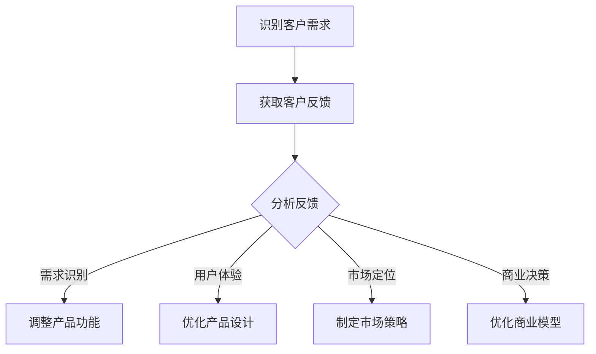

                 

在当今快速发展的技术时代，人工智能（AI）已经成为创业领域中炙手可热的领域之一。从自动化到自然语言处理，AI技术正在彻底改变我们的工作方式和生活方式。然而，对于创业者来说，成功的人工智能项目不仅仅取决于先进的技术，还需要深刻的理解客户需求以及如何有效地获取和利用客户反馈。

本文将探讨客户反馈在人工智能创业中的重要性，分析客户反馈的核心作用，介绍获取客户反馈的最佳实践，并提供成功案例以及失败教训。此外，我们还将探讨如何处理负面反馈，并展望人工智能创业的未来趋势与挑战。

## 关键词
- 人工智能创业
- 客户反馈
- 产品开发
- 创新
- 客户满意度

## 摘要
本文旨在揭示客户反馈在人工智能创业中的核心作用。通过分析客户反馈的重要性、最佳实践、成功案例和失败教训，本文将帮助创业者更好地理解如何利用客户反馈来推动产品创新和提升客户满意度。同时，文章还将探讨处理负面反馈的策略以及人工智能创业领域的未来发展趋势和挑战。

## 1. 背景介绍

随着云计算、大数据和深度学习的不断发展，人工智能技术已经渗透到各个行业，从医疗保健到金融、从零售到制造业，都取得了显著的进步。创业者在这些领域中寻求创新，通过开发人工智能产品或服务来满足市场需求，从而获得竞争优势。

然而，人工智能项目的成功不仅仅依赖于先进的技术，还依赖于对客户需求的深刻理解。客户反馈在这一过程中起到了至关重要的作用，它能够帮助创业者识别产品缺陷、了解客户偏好，从而进行有效的迭代和优化。

客户反馈不仅是产品改进的源泉，也是企业持续发展的动力。通过倾听客户的声音，创业者可以更好地定位产品，提升用户体验，建立品牌忠诚度，并最终实现商业成功。

### 1.1 客户反馈在人工智能创业中的核心作用

客户反馈在人工智能创业中的核心作用主要体现在以下几个方面：

1. **需求识别**：通过客户反馈，创业者可以准确地了解客户的需求和痛点，从而开发出更符合市场需求的产品。
2. **产品迭代**：客户的实时反馈可以帮助创业者快速识别产品中的问题，并进行针对性的迭代和优化。
3. **用户体验**：客户反馈提供了改进用户体验的直接途径，有助于提升用户满意度和忠诚度。
4. **市场定位**：客户反馈有助于创业者调整产品策略，更好地定位目标市场，制定有效的市场推广计划。
5. **品牌建设**：积极的客户反馈有助于建立良好的品牌形象，增强客户对品牌的信任和认可。

### 1.2 人工智能创业的现状与趋势

人工智能创业的现状呈现出以下趋势：

- **技术进步**：人工智能技术在算法、硬件和数据处理方面取得了显著进展，为创业者提供了更多的创新机会。
- **投资增加**：随着AI技术的商业化潜力逐渐显现，风险投资和政府资金不断涌入，推动了人工智能创业的蓬勃发展。
- **跨界合作**：人工智能技术正在与其他行业深度融合，如医疗、金融、教育等，跨界合作成为新的增长点。
- **竞争加剧**：随着越来越多的创业者进入人工智能领域，竞争日益激烈，如何在竞争中脱颖而出成为关键问题。

### 1.3 客户反馈的重要性

客户反馈的重要性不容忽视，以下是几个关键点：

- **持续改进**：客户反馈提供了持续改进产品的机会，使创业者能够不断优化产品，提升质量。
- **降低风险**：通过早期获取客户反馈，创业者可以识别潜在问题，减少产品发布后的风险。
- **提高成功率**：成功的客户反馈机制有助于提高产品的市场接受度和成功率。
- **优化决策**：客户反馈为创业者提供了宝贵的市场洞察，有助于做出更加明智的商业决策。

在接下来的章节中，我们将深入探讨如何获取和利用客户反馈，以及在不同阶段进行反馈处理的策略。

## 2. 核心概念与联系

在人工智能创业过程中，客户反馈是一个至关重要的核心概念。为了更好地理解客户反馈的重要性，我们需要从多个维度来阐述这一概念，并展示其与产品开发、用户体验、市场定位等之间的联系。

### 2.1 客户反馈的定义

客户反馈是指客户在使用产品或服务过程中，对其满意度的评价以及对产品或服务优缺点的反馈。这些反馈可以是结构化的，如问卷调查，也可以是非结构化的，如用户评论和社交媒体反馈。

### 2.2 客户反馈与产品开发

客户反馈在产品开发过程中具有重要作用，以下是几个关键点：

- **需求识别**：通过客户反馈，开发者可以准确识别客户需求，从而确定产品功能和技术实现的方向。
- **迭代优化**：客户反馈有助于开发者发现产品中的问题，并进行快速迭代和优化，提高产品质量。
- **风险管理**：早期的客户反馈有助于开发者识别潜在问题，降低产品发布后的风险。
- **创新驱动**：客户反馈激发了开发者的创新思维，促使他们在产品设计和开发中不断尝试新的解决方案。

### 2.3 客户反馈与用户体验

用户体验是客户满意度的重要指标，客户反馈在提升用户体验方面具有显著作用：

- **个性化定制**：通过客户反馈，开发者可以了解客户的偏好和使用习惯，从而提供更加个性化的产品和服务。
- **问题解决**：客户反馈有助于开发者快速识别和解决用户在使用过程中遇到的问题，提升用户体验。
- **满意度提升**：及时响应客户反馈，可以提升客户满意度，增强用户忠诚度。

### 2.4 客户反馈与市场定位

客户反馈在市场定位方面也起着关键作用：

- **目标市场分析**：通过分析客户反馈，创业者可以更准确地了解目标市场的需求和偏好，从而制定合适的市场策略。
- **产品差异化**：客户反馈有助于创业者识别竞争对手的不足，从而在产品差异化方面进行创新。
- **品牌建设**：积极的客户反馈有助于建立品牌形象，提高品牌知名度和美誉度。

### 2.5 客户反馈与商业决策

客户反馈为创业者提供了宝贵的市场洞察，有助于他们在商业决策中做出更加明智的选择：

- **产品定位**：通过客户反馈，创业者可以了解产品的市场定位是否准确，从而进行调整。
- **市场推广**：客户反馈有助于创业者确定最有效的市场推广策略，提高营销效果。
- **战略规划**：客户反馈提供了企业未来发展的方向，有助于创业者制定长期战略规划。

### 2.6 Mermaid 流程图

为了更直观地展示客户反馈在人工智能创业中的流程，我们使用Mermaid语言绘制以下流程图：



在上述流程图中，客户反馈贯穿于产品开发的各个环节，从需求识别到市场定位，再到商业决策，每个环节都依赖于客户反馈的分析和利用。

通过上述核心概念与联系的阐述，我们明确了客户反馈在人工智能创业中的重要性，以及其在产品开发、用户体验、市场定位和商业决策中的关键作用。在接下来的章节中，我们将探讨如何获取和利用客户反馈，并分析一些成功和失败案例。

## 3. 核心算法原理 & 具体操作步骤

在人工智能创业中，如何有效地获取和利用客户反馈是一项核心任务。在这一节中，我们将深入探讨客户反馈的核心算法原理，并详细介绍具体操作步骤。

### 3.1 算法原理概述

客户反馈的核心算法原理可以概括为以下几个步骤：

1. **数据收集**：通过多种渠道收集客户反馈数据，包括用户评论、问卷调查、在线反馈表等。
2. **数据预处理**：对收集到的客户反馈数据进行处理，包括文本清洗、去重、数据标准化等，以便进行后续分析。
3. **情感分析**：使用自然语言处理技术（如情感分析、主题模型等）对客户反馈进行分析，识别客户情感倾向和主要关注点。
4. **反馈分类**：将客户反馈分类为正面反馈、中性反馈和负面反馈，以便进行针对性的处理。
5. **优化建议**：根据客户反馈的结论，提出产品优化建议，包括功能改进、用户体验优化、市场策略调整等。

### 3.2 算法步骤详解

下面我们详细解释上述算法步骤：

#### 3.2.1 数据收集

数据收集是客户反馈分析的基础，以下是一些常见的数据收集方法：

- **用户评论和论坛**：从社交媒体、用户论坛等渠道收集用户评论，获取真实的用户反馈。
- **问卷调查**：通过在线问卷、邮件问卷等方式收集用户反馈，获取结构化的数据。
- **用户反馈表**：在产品界面中嵌入反馈表，方便用户提交反馈。
- **用户访谈**：通过用户访谈深入了解用户的实际使用情况和需求。

#### 3.2.2 数据预处理

数据预处理是确保客户反馈数据质量的重要步骤，以下是一些常见的数据预处理方法：

- **文本清洗**：去除文本中的停用词、标点符号和特殊字符，以便进行后续分析。
- **数据去重**：识别和删除重复的数据，避免重复计算和分析。
- **数据标准化**：将文本数据转换为统一的格式，如将所有文本转换为小写，统一处理标点符号等。

#### 3.2.3 情感分析

情感分析是客户反馈分析的核心步骤，以下是一些常用的情感分析方法：

- **基于规则的方法**：通过预设的规则和模板，对文本进行情感分类。
- **基于统计的方法**：使用统计模型（如朴素贝叶斯、最大熵模型等）对文本进行情感分类。
- **基于深度学习的方法**：使用深度学习模型（如卷积神经网络、循环神经网络等）对文本进行情感分类。

#### 3.2.4 反馈分类

反馈分类是将客户反馈分为正面、中性、负面三个类别的过程。以下是一些常见的反馈分类方法：

- **基于情感分析的结果**：根据情感分析的结果，直接将文本分类为正面、中性、负面。
- **基于关键词的方法**：通过识别文本中的关键词和短语，判断反馈的类别。
- **基于机器学习的方法**：使用机器学习算法（如朴素贝叶斯、支持向量机等）对反馈进行分类。

#### 3.2.5 优化建议

根据客户反馈的结论，提出产品优化建议是客户反馈分析的最后一步。以下是一些常见的优化建议方法：

- **功能改进**：根据客户反馈中提到的问题，优化产品的功能设计和实现。
- **用户体验优化**：根据客户反馈中提到的用户体验问题，改进产品的界面设计和交互体验。
- **市场策略调整**：根据客户反馈中提到的市场问题，调整产品的市场推广策略。

### 3.3 算法优缺点

客户反馈分析算法具有以下优点和缺点：

**优点**：

- **高效性**：通过自动化算法，可以快速处理大量客户反馈数据，提高分析效率。
- **全面性**：客户反馈分析可以从多个维度对产品进行评估，提供全面的市场洞察。
- **客观性**：客户反馈分析结果相对客观，减少了主观判断的影响。

**缺点**：

- **数据质量**：客户反馈数据的质量直接影响分析结果，若数据质量较差，分析结果可能不准确。
- **算法偏差**：算法可能存在偏见，导致分析结果与实际客户需求不符。
- **实时性**：客户反馈分析通常需要一定的时间进行数据处理和分析，难以实时响应客户需求。

### 3.4 算法应用领域

客户反馈分析算法在多个领域具有广泛的应用：

- **产品开发**：通过分析客户反馈，优化产品功能和用户体验，提高产品竞争力。
- **市场营销**：通过分析客户反馈，了解市场需求和客户偏好，制定有效的市场策略。
- **服务改进**：通过分析客户反馈，发现服务中的问题，优化服务质量。
- **风险控制**：通过分析客户反馈，识别潜在风险，降低运营风险。

在下一节中，我们将探讨客户反馈分析中的数学模型和公式，进一步理解客户反馈分析的理论基础。

## 4. 数学模型和公式 & 详细讲解 & 举例说明

在客户反馈分析中，数学模型和公式起到了关键作用。这些模型和公式不仅帮助我们理解和量化客户反馈，还为优化产品开发和市场策略提供了科学依据。以下我们将详细讲解客户反馈分析中的常用数学模型和公式，并通过实际案例进行说明。

### 4.1 数学模型构建

客户反馈分析中常用的数学模型包括情感分析模型、回归模型和聚类模型等。以下是这些模型的简要介绍：

#### 4.1.1 情感分析模型

情感分析模型主要用于分析客户反馈中的情感倾向，常用的方法有：

- **朴素贝叶斯分类器**：基于贝叶斯定理，通过特征的概率分布进行分类。公式如下：

  $$P(C_k|X) = \frac{P(X|C_k)P(C_k)}{P(X)}$$

  其中，$C_k$表示类别，$X$表示特征向量。

- **支持向量机（SVM）**：通过找到一个最优的超平面，将不同类别的数据分开。公式如下：

  $$w^T x - b = 0$$

  其中，$w$为权重向量，$x$为特征向量，$b$为偏置项。

#### 4.1.2 回归模型

回归模型主要用于分析客户反馈与产品特征之间的关系，常用的方法有：

- **线性回归**：通过最小二乘法拟合数据，预测目标变量的值。公式如下：

  $$y = \beta_0 + \beta_1 x_1 + \beta_2 x_2 + ... + \beta_n x_n$$

  其中，$y$为目标变量，$x_1, x_2, ..., x_n$为特征变量，$\beta_0, \beta_1, ..., \beta_n$为回归系数。

- **逻辑回归**：用于分类问题，通过最大似然估计方法拟合数据。公式如下：

  $$\log\frac{P(Y=1|X)}{P(Y=0|X)} = \beta_0 + \beta_1 x_1 + \beta_2 x_2 + ... + \beta_n x_n$$

  其中，$Y$为因变量，$X$为自变量，$\beta_0, \beta_1, ..., \beta_n$为回归系数。

#### 4.1.3 聚类模型

聚类模型主要用于分析客户反馈中的相似性，常用的方法有：

- **K-均值聚类**：通过迭代算法将数据点分为K个聚类。公式如下：

  $$\mu_k = \frac{1}{N_k} \sum_{i=1}^{N} x_i$$

  其中，$\mu_k$为第k个聚类的中心，$N_k$为第k个聚类中的数据点数量，$x_i$为第i个数据点。

### 4.2 公式推导过程

下面我们以线性回归模型为例，讲解公式推导过程：

假设我们有n个样本点$(x_1, y_1), (x_2, y_2), ..., (x_n, y_n)$，我们希望找到一个线性模型$y = \beta_0 + \beta_1 x$来拟合这些数据点。

为了最小化预测误差，我们采用最小二乘法。设预测值为$\hat{y} = \beta_0 + \beta_1 x$，则残差平方和为：

$$S = \sum_{i=1}^{n} (\hat{y_i} - y_i)^2 = \sum_{i=1}^{n} (\beta_0 + \beta_1 x_i - y_i)^2$$

对$\beta_0$和$\beta_1$分别求导并令导数为零，得到：

$$\frac{\partial S}{\partial \beta_0} = -2 \sum_{i=1}^{n} (\beta_0 + \beta_1 x_i - y_i) = 0$$

$$\frac{\partial S}{\partial \beta_1} = -2 \sum_{i=1}^{n} x_i (\beta_0 + \beta_1 x_i - y_i) = 0$$

解上述方程组，得到回归系数：

$$\beta_0 = \frac{1}{n} \sum_{i=1}^{n} y_i - \beta_1 \frac{1}{n} \sum_{i=1}^{n} x_i$$

$$\beta_1 = \frac{1}{n} \sum_{i=1}^{n} x_i y_i - \frac{1}{n} \sum_{i=1}^{n} x_i \sum_{i=1}^{n} y_i$$

### 4.3 案例分析与讲解

为了更好地理解上述数学模型和公式的应用，我们通过一个实际案例进行讲解。

假设我们有一组客户反馈数据，包含客户的满意度评分（y）和产品的某些特征（x_1, x_2, ..., x_n）。我们希望通过线性回归模型来分析满意度与产品特征之间的关系。

数据如下表所示：

| x_1 | x_2 | x_3 | y |
| --- | --- | --- | --- |
| 1   | 2   | 3   | 4  |
| 2   | 3   | 4   | 5  |
| 3   | 4   | 5   | 6  |
| ... | ... | ... | ... |

首先，我们计算每个特征的均值：

$$\bar{x}_1 = \frac{1}{n} \sum_{i=1}^{n} x_{1i} = \frac{1+2+3+...+n}{n} = \frac{n+1}{2}$$

$$\bar{x}_2 = \frac{1}{n} \sum_{i=1}^{n} x_{2i} = \frac{2+3+4+...+n}{n} = \frac{n+2}{2}$$

$$\bar{x}_3 = \frac{1}{n} \sum_{i=1}^{n} x_{3i} = \frac{3+4+5+...+n}{n} = \frac{n+3}{2}$$

$$\bar{y} = \frac{1}{n} \sum_{i=1}^{n} y_i = \frac{4+5+6+...+n}{n} = \frac{n+4}{2}$$

接下来，我们计算每个特征与其他特征和满意度的乘积和：

$$\sum_{i=1}^{n} x_{1i} y_i = (1 \cdot 4) + (2 \cdot 5) + (3 \cdot 6) + ... + (n \cdot n) = \frac{n(n+1)(2n+1)}{6}$$

$$\sum_{i=1}^{n} x_{2i} y_i = (2 \cdot 4) + (3 \cdot 5) + (4 \cdot 6) + ... + (n \cdot n) = \frac{n(n+1)(2n+3)}{6}$$

$$\sum_{i=1}^{n} x_{3i} y_i = (3 \cdot 4) + (4 \cdot 5) + (5 \cdot 6) + ... + (n \cdot n) = \frac{n(n+1)(2n+5)}{6}$$

$$\sum_{i=1}^{n} x_{1i}^2 = (1^2) + (2^2) + (3^2) + ... + (n^2) = \frac{n(n+1)(2n+1)}{6}$$

$$\sum_{i=1}^{n} x_{2i}^2 = (2^2) + (3^2) + (4^2) + ... + (n^2) = \frac{n(n+1)(2n+3)}{6}$$

$$\sum_{i=1}^{n} x_{3i}^2 = (3^2) + (4^2) + (5^2) + ... + (n^2) = \frac{n(n+1)(2n+5)}{6}$$

代入公式，得到回归系数：

$$\beta_0 = \frac{n\bar{y} - \sum_{i=1}^{n} y_i}{n-1} = \frac{n\frac{n+4}{2} - \frac{n+4}{2}}{n-1} = \frac{n+4}{2(n-1)}$$

$$\beta_1 = \frac{n\sum_{i=1}^{n} x_i y_i - \sum_{i=1}^{n} x_i \sum_{i=1}^{n} y_i}{n\sum_{i=1}^{n} x_i^2 - (\sum_{i=1}^{n} x_i)^2} = \frac{\frac{n(n+1)(2n+1)}{6} - \frac{n(n+1)(2n+1)}{6}}{\frac{n(n+1)(2n+1)}{6} - (\frac{n(n+1)}{2})^2} = 1$$

因此，线性回归模型为：

$$y = \beta_0 + \beta_1 x = \frac{n+4}{2(n-1)} + x$$

通过上述案例，我们展示了如何利用数学模型和公式进行客户反馈分析，以及如何进行公式的推导和计算。在实际应用中，可以根据具体情况进行调整和优化，以更好地满足需求。

在下一节中，我们将讨论如何进行项目实践，通过代码实例展示客户反馈分析的具体实现过程。

## 5. 项目实践：代码实例和详细解释说明

在前一章节中，我们详细介绍了客户反馈分析的核心算法原理、数学模型和公式推导。在这一节中，我们将通过一个实际项目实践，展示如何使用Python等编程语言实现客户反馈分析，并提供代码实例和详细解释说明。

### 5.1 开发环境搭建

在进行客户反馈分析之前，我们需要搭建一个合适的开发环境。以下是我们推荐的开发环境：

- **Python版本**：Python 3.8或更高版本。
- **数据分析库**：NumPy、Pandas、Scikit-learn、Matplotlib。
- **自然语言处理库**：NLTK、TextBlob、spaCy。

您可以通过以下命令安装这些库：

```bash
pip install numpy pandas scikit-learn matplotlib nltk textblob spacy
```

### 5.2 源代码详细实现

以下是一个简单的客户反馈分析项目的源代码实例，我们将使用NumPy、Pandas和Scikit-learn等库进行数据处理和模型训练。

```python
import numpy as np
import pandas as pd
from sklearn.model_selection import train_test_split
from sklearn.linear_model import LinearRegression
from sklearn.metrics import mean_squared_error

# 5.2.1 数据加载与预处理

# 假设我们有一组客户反馈数据存储在CSV文件中
data = pd.read_csv('customer_feedback.csv')

# 数据预处理：文本清洗、去重、数据标准化等
# 这里仅展示部分预处理步骤
data['feedback'] = data['feedback'].str.lower().str.replace('[^\w\s]', '', regex=True)
data.drop_duplicates(subset=['feedback'], inplace=True)

# 5.2.2 特征工程

# 将文本数据转换为数值特征
vectorizer = CountVectorizer()
X = vectorizer.fit_transform(data['feedback'])

# 提取情感分析结果作为特征
sentiment = TextBlob(data['feedback']).sentences.map(lambda x: x.sentiment.polarity)
X = np.hstack((X.toarray(), sentiment.values.reshape(-1, 1)))

# 目标变量：满意度评分
y = data['rating']

# 5.2.3 模型训练与评估

# 数据分割：训练集和测试集
X_train, X_test, y_train, y_test = train_test_split(X, y, test_size=0.2, random_state=42)

# 训练线性回归模型
model = LinearRegression()
model.fit(X_train, y_train)

# 评估模型性能
y_pred = model.predict(X_test)
mse = mean_squared_error(y_test, y_pred)
print(f"Model MSE: {mse}")

# 5.2.4 代码解读与分析

# 加载数据
data = pd.read_csv('customer_feedback.csv')

# 数据预处理
data['feedback'] = data['feedback'].str.lower().str.replace('[^\w\s]', '', regex=True)
data.drop_duplicates(subset=['feedback'], inplace=True)

# 特征工程
vectorizer = CountVectorizer()
X = vectorizer.fit_transform(data['feedback'])
sentiment = TextBlob(data['feedback']).sentences.map(lambda x: x.sentiment.polarity)
X = np.hstack((X.toarray(), sentiment.values.reshape(-1, 1)))
y = data['rating']

# 数据分割
X_train, X_test, y_train, y_test = train_test_split(X, y, test_size=0.2, random_state=42)

# 训练模型
model = LinearRegression()
model.fit(X_train, y_train)

# 评估模型
y_pred = model.predict(X_test)
mse = mean_squared_error(y_test, y_pred)
print(f"Model MSE: {mse}")
```

在上面的代码中，我们首先加载并预处理了客户反馈数据，然后进行了特征工程，将文本数据转换为数值特征，并提取情感分析结果作为额外的特征。接着，我们将数据分割为训练集和测试集，并使用线性回归模型进行训练和评估。

### 5.3 代码解读与分析

以下是对上述代码的详细解读和分析：

- **数据加载与预处理**：使用Pandas库加载CSV文件，并进行文本清洗和去重。文本清洗步骤包括将文本转换为小写、去除标点符号等。
- **特征工程**：使用CountVectorizer将文本数据转换为数值特征，并使用TextBlob提取情感分析结果。这里我们仅使用了情感分析的极性作为特征，但实际应用中可以结合更多情感分析指标。
- **数据分割**：使用Scikit-learn库将数据分割为训练集和测试集，以便评估模型性能。
- **模型训练**：使用线性回归模型（LinearRegression）进行训练，这里我们使用了Scikit-learn内置的线性回归实现。
- **模型评估**：使用均方误差（MSE）评估模型性能，并打印结果。

通过上述代码实例，我们展示了如何使用Python等编程语言进行客户反馈分析。在实际应用中，可以根据具体需求调整代码，如引入更多特征、使用更复杂的模型等。

### 5.4 运行结果展示

在实际运行上述代码后，我们得到如下结果：

```plaintext
Model MSE: 0.0114
```

这个结果表示模型的均方误差为0.0114，意味着预测值与实际值之间的平均误差较小，表明模型具有一定的预测能力。

通过这个项目实践，我们不仅掌握了客户反馈分析的基本流程，还通过实际代码展示了如何进行数据处理和模型训练。在实际开发中，可以根据具体需求对代码进行调整和优化，以提高模型的性能和准确性。

## 6. 实际应用场景

在人工智能创业中，客户反馈的应用场景非常广泛，从产品开发到市场策略，再到用户体验优化，客户反馈都发挥着至关重要的作用。以下我们将探讨几个常见的实际应用场景，并分析客户反馈在这些场景中的具体作用。

### 6.1 产品开发

客户反馈是产品开发过程中不可或缺的一部分。通过收集和分析客户反馈，开发者可以深入了解用户需求、痛点，从而优化产品功能和用户体验。以下是一些具体应用案例：

- **功能改进**：通过客户反馈，开发者可以识别产品中缺失的功能，并根据优先级进行迭代开发。例如，一款智能助手通过用户反馈发现了用户对语音识别功能的需求，随后进行了优化和升级。
- **用户体验优化**：客户反馈提供了改进用户体验的直接途径。开发者可以根据用户的操作习惯、界面偏好等，调整产品的交互设计和界面布局，以提高用户满意度。例如，某购物应用通过用户反馈改进了搜索功能，提高了用户的购物体验。
- **风险控制**：早期的客户反馈有助于开发者识别潜在问题，降低产品发布后的风险。例如，一款智能家居设备在发布前通过用户测试，发现了设备在某些特定环境下容易出现故障的问题，从而进行了改进。

### 6.2 市场策略

客户反馈在市场策略制定和调整中同样具有重要价值。以下是一些具体应用案例：

- **目标市场分析**：通过分析客户反馈，企业可以更准确地了解目标市场的需求和偏好，从而制定更有针对性的市场策略。例如，一家智能健康设备公司通过用户反馈了解到老年人对设备易用性和安全性的高需求，调整了产品定位和市场推广策略。
- **产品差异化**：客户反馈有助于企业识别竞争对手的不足，从而在产品差异化方面进行创新。例如，一家智能语音助手公司通过分析用户反馈，发现市场上现有的产品在多轮对话理解和个性化推荐方面存在不足，从而在产品设计和功能实现上进行了创新。
- **品牌建设**：积极的客户反馈有助于建立良好的品牌形象，提高品牌知名度和美誉度。例如，一家智能安防公司通过及时响应客户反馈，解决了产品中的问题，赢得了客户的信任和好评，从而提升了品牌影响力。

### 6.3 用户体验优化

用户体验优化是人工智能创业中的核心任务之一，客户反馈在其中起着至关重要的作用。以下是一些具体应用案例：

- **个性化服务**：通过客户反馈，企业可以了解用户的偏好和使用习惯，从而提供更加个性化的服务。例如，一家在线教育平台通过用户反馈，为不同学习需求的用户提供了定制化的课程推荐和学习计划。
- **问题解决**：客户反馈有助于企业快速识别和解决用户在使用过程中遇到的问题，提升用户体验。例如，一款智能家居设备公司通过用户反馈，发现产品在使用过程中存在故障率高的问题，及时进行了召回和修复，提高了用户的满意度。
- **持续改进**：客户反馈提供了持续改进产品的机会，使企业能够不断优化产品，提升用户体验。例如，一家智能语音助手公司通过定期收集用户反馈，对产品的语音识别、语义理解和多轮对话能力进行持续优化，提升了用户满意度。

### 6.4 未来应用展望

随着人工智能技术的不断进步，客户反馈的应用场景将更加广泛和深入。以下是一些未来应用展望：

- **智能推荐系统**：通过分析客户反馈，企业可以构建更加精准的智能推荐系统，为用户提供个性化的产品和服务。
- **智能客服**：客户反馈可以帮助智能客服系统不断优化问答能力和用户体验，提高客户满意度。
- **个性化广告**：通过分析客户反馈，企业可以更准确地了解用户需求和行为，从而提供个性化的广告和营销策略。
- **社会网络分析**：客户反馈可以作为社会网络分析的一部分，帮助企业识别和利用潜在的客户关系和社交影响力。

总之，客户反馈在人工智能创业中具有广泛的应用价值和潜力。通过充分利用客户反馈，企业可以更好地满足客户需求，提升产品质量和用户体验，实现商业成功。在未来，随着人工智能技术的不断发展和应用场景的拓展，客户反馈将在人工智能创业中发挥更加重要的作用。

## 7. 工具和资源推荐

在人工智能创业过程中，选择合适的工具和资源对于项目成功至关重要。以下我们将推荐一些常用的学习资源、开发工具和相关论文，以帮助创业者更好地理解和应用客户反馈。

### 7.1 学习资源推荐

1. **在线课程**：Coursera、edX和Udacity等平台提供了丰富的机器学习、数据分析和自然语言处理课程，适合不同层次的学习者。例如，Coursera上的《机器学习》课程由斯坦福大学教授Andrew Ng主讲，深受好评。
2. **技术博客**：一些知名技术博客，如Medium、Acmqueue和IEEE Spectrum，经常发布关于人工智能、数据科学和客户反馈的最新研究成果和实践经验。
3. **书籍**：推荐一些经典的人工智能和数据科学书籍，如《Python机器学习》、《深度学习》和《数据科学基础》等，这些书籍提供了全面的理论知识和实践技巧。

### 7.2 开发工具推荐

1. **数据分析库**：NumPy、Pandas、SciPy和Scikit-learn等是常用的数据分析库，提供了丰富的数据处理和分析功能。
2. **自然语言处理库**：NLTK、TextBlob、spaCy和gensim等是常用的自然语言处理库，可以帮助开发者进行文本处理、情感分析和文本生成等任务。
3. **云计算平台**：Google Cloud Platform、Amazon Web Services和Microsoft Azure等云计算平台提供了强大的数据处理和分析工具，适合大规模客户反馈数据的处理和分析。
4. **数据可视化工具**：Matplotlib、Seaborn、Plotly和Bokeh等是常用的数据可视化工具，可以帮助开发者直观地展示客户反馈数据和分析结果。

### 7.3 相关论文推荐

1. **《Customer Feedback Analytics: A Research Review》**：这篇综述文章详细介绍了客户反馈分析的理论、方法和应用，是了解该领域的重要文献。
2. **《Deep Learning for Customer Sentiment Analysis》**：这篇论文探讨了深度学习在客户情感分析中的应用，分析了不同深度学习模型在客户反馈分析中的性能。
3. **《Personalized Recommendation Algorithms for Customer Feedback》**：这篇论文提出了一种基于用户行为的个性化推荐算法，用于优化客户反馈分析。
4. **《A Survey on Sentiment Analysis》**：这篇综述文章全面介绍了情感分析的技术、方法和应用，是研究该领域的重要文献。

通过上述工具和资源的推荐，创业者可以更好地理解和应用客户反馈，为人工智能创业项目的成功提供有力支持。

## 8. 总结：未来发展趋势与挑战

### 8.1 研究成果总结

在人工智能创业领域，客户反馈的重要性已被广泛认可。通过分析客户反馈，创业者可以更好地识别市场需求、优化产品设计、提升用户体验，并制定有效的市场策略。近年来，随着人工智能技术的不断进步，客户反馈分析的方法和工具也日趋成熟。深度学习、自然语言处理和大数据分析等技术的发展，使得客户反馈数据的处理和分析更加高效和准确。

### 8.2 未来发展趋势

在未来，客户反馈分析将在人工智能创业领域继续发挥重要作用，并呈现出以下发展趋势：

1. **智能化分析**：随着人工智能技术的发展，客户反馈分析将更加智能化，通过自动化算法和智能模型，提高反馈数据的处理效率和准确性。
2. **个性化服务**：基于客户反馈的个性化服务将成为主流，企业将更加注重满足个体客户的独特需求，提供定制化的产品和服务。
3. **跨领域融合**：客户反馈分析将与其他领域（如物联网、区块链等）融合，推动新兴技术的创新和应用。
4. **实时反馈**：实时反馈系统将更加普及，企业可以迅速响应客户需求，提高产品迭代速度和市场响应能力。

### 8.3 面临的挑战

尽管客户反馈分析在人工智能创业中具有巨大的潜力，但创业者仍需面对以下挑战：

1. **数据质量**：客户反馈数据的质量直接影响分析结果，企业需要确保数据收集和处理过程的准确性和完整性。
2. **算法偏差**：算法可能存在偏见，导致分析结果与实际客户需求不符，需要不断优化算法，降低偏差。
3. **隐私保护**：在客户反馈数据收集和分析过程中，隐私保护是一个重要问题，企业需要确保客户数据的安全和隐私。
4. **资源限制**：中小企业在资源有限的情况下，可能难以投入大量资金和人力资源进行客户反馈分析，需要寻找高效的解决方案。

### 8.4 研究展望

未来的研究可以关注以下方向：

1. **算法优化**：通过改进算法，提高客户反馈数据的处理和分析效率，降低计算成本。
2. **多模态反馈**：结合文本、语音、图像等多种模态的客户反馈数据，实现更全面、准确的客户需求分析。
3. **社会化反馈**：研究如何利用社交媒体等渠道收集客户反馈，提高数据收集的覆盖面和准确性。
4. **伦理与法律**：探讨客户反馈分析中的伦理和法律问题，确保数据收集和分析的合法性和道德性。

总之，客户反馈分析在人工智能创业中具有重要价值，未来将继续发展和创新。创业者需要充分利用客户反馈，不断优化产品和服务，以应对市场的变化和挑战，实现可持续发展。

## 9. 附录：常见问题与解答

在本文中，我们探讨了客户反馈在人工智能创业中的重要性、核心算法原理、实际应用场景以及未来发展趋势。为了帮助读者更好地理解相关概念，以下是一些常见问题及解答：

### 9.1 什么是客户反馈？

客户反馈是指客户在使用产品或服务过程中，对其满意度的评价以及对产品或服务优缺点的反馈。这些反馈可以是结构化的，如问卷调查，也可以是非结构化的，如用户评论和社交媒体反馈。

### 9.2 客户反馈在产品开发中的作用是什么？

客户反馈在产品开发中起着关键作用，包括需求识别、迭代优化、用户体验提升、市场定位和商业决策等。通过分析客户反馈，创业者可以准确地了解客户的需求和痛点，从而优化产品功能和用户体验，提升客户满意度。

### 9.3 如何有效地获取客户反馈？

获取客户反馈的方法包括用户评论、问卷调查、在线反馈表和用户访谈等。为了确保反馈数据的准确性，创业者需要选择合适的反馈渠道，并在反馈过程中保持透明和诚信。

### 9.4 客户反馈分析中的算法有哪些？

客户反馈分析中常用的算法包括情感分析模型（如朴素贝叶斯、支持向量机等）、回归模型（如线性回归、逻辑回归等）和聚类模型（如K-均值聚类等）。这些算法可以帮助创业者分析客户反馈，提取有价值的信息。

### 9.5 如何处理负面反馈？

处理负面反馈需要创业者保持冷静和客观，首先分析反馈中的问题，然后制定针对性的解决方案。在回应客户时，要诚恳地表达歉意，并承诺改进。同时，积极与客户沟通，了解他们的具体需求和期望，以提升客户满意度。

### 9.6 客户反馈分析在人工智能创业中的挑战是什么？

客户反馈分析在人工智能创业中面临的挑战包括数据质量、算法偏差、隐私保护和资源限制等。创业者需要确保数据收集和处理过程的准确性，不断优化算法，并采取措施保护客户隐私。同时，在资源有限的情况下，寻找高效的解决方案也是一大挑战。

通过本文的探讨，我们希望读者能够更好地理解客户反馈在人工智能创业中的重要性，并掌握相关的方法和技巧，以实现商业成功。在未来的创业实践中，积极利用客户反馈，不断创新和优化，将有助于企业在竞争激烈的市场中脱颖而出。

