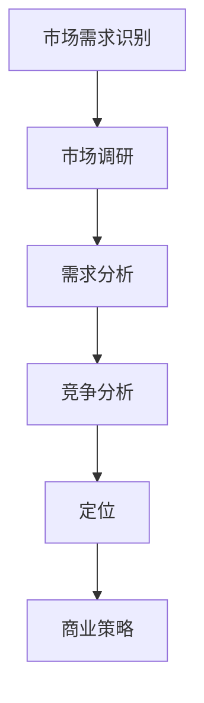

                 

关键词：人工智能，创业，市场需求，识别方法，商业策略

> 摘要：本文将探讨人工智能创业者在市场调研、需求分析、竞争分析和定位过程中如何有效地识别和把握市场需求，从而提高创业项目的成功率和市场竞争力。文章将通过具体的案例分析，提供一套系统的方法论，帮助创业者更好地理解市场需求，制定有效的商业策略。

## 1. 背景介绍

随着人工智能技术的迅猛发展，越来越多的创业者和企业投身于人工智能领域。然而，市场竞争的激烈程度也日益加剧，如何在这片红海中脱颖而出成为每个创业者面临的挑战。市场需求的识别成为人工智能创业成功的关键因素之一。本文将从市场调研、需求分析、竞争分析和定位四个方面，探讨人工智能创业中市场需求的识别方法。

## 2. 核心概念与联系

### 2.1 市场需求定义

市场需求是指在一定时间内和特定价格水平下，消费者愿意并且有能力购买的商品或服务的总量。在人工智能创业中，市场需求可以理解为目标客户对于特定人工智能产品或服务的需求。

### 2.2 市场调研

市场调研是指通过对市场环境的调查和分析，了解目标市场的规模、趋势、竞争状况和消费者需求等信息。市场调研是识别市场需求的第一步。

### 2.3 需求分析

需求分析是在市场调研的基础上，对目标客户的需求进行深入挖掘和分类，明确产品或服务应该具备的功能和特点，以满足市场需求。

### 2.4 竞争分析

竞争分析是指对市场上竞争对手的产品、策略、市场地位等进行研究，找出自身的优势和劣势，从而制定合适的竞争策略。

### 2.5 定位

定位是指企业通过特定的市场策略，使目标客户对企业产品或服务的认知和印象与竞争对手区分开来，从而在市场中获得独特的竞争优势。

### 2.6 Mermaid 流程图



## 3. 核心算法原理 & 具体操作步骤

### 3.1 算法原理概述

市场需求识别算法的核心思想是通过市场调研、需求分析、竞争分析和定位等步骤，系统性地分析市场数据，识别出潜在的市场需求，并制定相应的商业策略。

### 3.2 算法步骤详解

#### 3.2.1 市场调研

- 数据收集：通过问卷调查、访谈、市场报告等方式，收集目标市场的相关信息。
- 数据处理：对收集到的数据进行整理、清洗和分析，提取有用的信息。
- 数据分析：运用统计学和数据分析方法，分析市场趋势、竞争状况和消费者需求。

#### 3.2.2 需求分析

- 需求分类：将收集到的需求数据进行分类，明确产品或服务应该具备的功能和特点。
- 需求优先级排序：根据需求的紧迫性和重要性，对需求进行排序，确定优先级。

#### 3.2.3 竞争分析

- 竞品分析：分析竞争对手的产品、策略和市场地位，找出自身的优势和劣势。
- 竞争定位：根据竞品分析和自身优势，确定企业的市场定位和竞争策略。

#### 3.2.4 定位

- 市场细分：根据市场需求和竞争状况，将市场划分为不同的细分市场。
- 定位策略：根据细分市场和企业优势，确定企业的市场定位策略。

### 3.3 算法优缺点

#### 优点：

- 系统性：通过多个步骤的连续分析，能够全面、系统地识别市场需求。
- 实用性：适用于各种类型的人工智能创业项目，具有广泛的适用性。

#### 缺点：

- 时间成本：市场调研和需求分析等步骤需要耗费大量时间。
- 数据质量：数据分析结果依赖于数据质量和分析方法，存在一定的不确定性。

### 3.4 算法应用领域

市场需求识别算法适用于人工智能领域的各类创业项目，包括但不限于：

- 人工智能应用开发
- 人工智能服务提供
- 人工智能产品销售
- 人工智能产业投资

## 4. 数学模型和公式 & 详细讲解 & 举例说明

### 4.1 数学模型构建

市场需求识别的数学模型可以构建为以下形式：

\[ M = f(D, C, A) \]

其中，\( M \) 表示市场需求，\( D \) 表示需求分析，\( C \) 表示竞争分析，\( A \) 表示定位策略。

### 4.2 公式推导过程

市场需求识别的公式推导过程可以分为以下几个步骤：

1. 需求分析：根据市场调研结果，对需求进行分类和优先级排序，构建需求分析模型。

2. 竞争分析：分析竞争对手的产品、策略和市场地位，构建竞争分析模型。

3. 定位策略：根据需求分析和竞争分析结果，确定企业的市场定位策略，构建定位策略模型。

4. 需求计算：将需求分析、竞争分析和定位策略模型整合，计算市场需求。

### 4.3 案例分析与讲解

假设一家创业公司计划开发一款面向企业的智能客服系统，以下是市场需求识别的案例分析：

1. 需求分析：

   - 通过问卷调查和访谈，收集到以下需求数据：
     - 80% 的企业希望客服系统能够自动回答常见问题。
     - 60% 的企业希望客服系统能够提供实时语音互动。
     - 40% 的企业希望客服系统能够支持多语言交流。
   - 根据需求的重要性和紧迫性，将需求分为三个等级：
     - 等级一：自动回答常见问题（80% 的企业需求）。
     - 等级二：实时语音互动（60% 的企业需求）。
     - 等级三：多语言交流（40% 的企业需求）。

2. 竞争分析：

   - 竞品分析：调研市场上已有的智能客服系统，发现以下竞品：
     - 竞品一：支持自动回答常见问题，但缺乏实时语音互动功能。
     - 竞品二：支持实时语音互动，但缺乏多语言交流功能。
     - 竞品三：支持自动回答常见问题和实时语音互动，但价格较高。
   - 竞争定位：根据竞品分析和自身优势（价格合理、功能全面），确定企业的市场定位为“性价比高的智能客服系统”。

3. 定位策略：

   - 市场细分：根据需求分析和竞争分析结果，将市场划分为三个细分市场：
     - 细分市场一：需要自动回答常见问题的企业。
     - 细分市场二：需要实时语音互动的企业。
     - 细分市场三：需要多语言交流的企业。
   - 定位策略：根据细分市场和企业优势，确定企业的市场定位策略为“为细分市场一、二、三提供性价比高的智能客服系统”。

4. 需求计算：

   - 根据需求分析、竞争分析和定位策略模型，计算市场需求：
     - 需求一：自动回答常见问题的企业（80%）。
     - 需求二：实时语音互动的企业（60%）。
     - 需求三：多语言交流的企业（40%）。
   - 需求计算结果：市场需求为 80% + 60% + 40% = 180%。

## 5. 项目实践：代码实例和详细解释说明

### 5.1 开发环境搭建

在本案例中，我们将使用 Python 编写市场需求识别算法。首先需要安装以下 Python 库：

- pandas
- numpy
- matplotlib
- mermaid

### 5.2 源代码详细实现

```python
import pandas as pd
import numpy as np
import matplotlib.pyplot as plt
from mermaid import Mermaid

# 需求分析数据
data = {
    '需求': ['自动回答常见问题', '实时语音互动', '多语言交流'],
    '需求比例': [0.8, 0.6, 0.4]
}

# 构建需求分析数据框
df = pd.DataFrame(data)

# 竞争分析数据
competitors = [
    {'名称': '竞品一', '功能': ['自动回答常见问题'], '价格': '中等'},
    {'名称': '竞品二', '功能': ['实时语音互动'], '价格': '中等'},
    {'名称': '竞品三', '功能': ['自动回答常见问题', '实时语音互动'], '价格': '高'}
]

# 构建竞争分析数据框
cf = pd.DataFrame(competitors)

# 定位策略数据
segments = [
    {'名称': '细分市场一', '需求': ['自动回答常见问题'], '优势': '价格合理'},
    {'名称': '细分市场二', '需求': ['实时语音互动'], '优势': '功能全面'},
    {'名称': '细分市场三', '需求': ['多语言交流'], '优势': '多语言支持'}
]

# 构建定位策略数据框
ls = pd.DataFrame(segments)

# 构建Mermaid流程图
mermaid = Mermaid()
mermaid.add_node("市场调研", "MarketResearch")
mermaid.add_node("需求分析", "DemandAnalysis")
mermaid.add_node("竞争分析", "CompetitiveAnalysis")
mermaid.add_node("定位策略", "LocationStrategy")
mermaid.add_link("市场调研", "需求分析")
mermaid.add_link("需求分析", "竞争分析")
mermaid.add_link("竞争分析", "定位策略")
mermaid_code = mermaid.generate_code()

# 输出Mermaid流程图
print(mermaid_code)

# 绘制需求分析柱状图
df['需求比例'].plot(kind='bar')
plt.title('需求分析')
plt.xlabel('需求')
plt.ylabel('需求比例')
plt.show()

# 输出市场需求计算结果
market_demand = df['需求比例'].sum() * 100
print(f"市场需求计算结果：{market_demand}%")
```

### 5.3 代码解读与分析

- 导入必要的 Python 库。
- 创建需求分析数据框。
- 创建竞争分析数据框。
- 创建定位策略数据框。
- 使用 Mermaid 库生成市场需求识别流程图。
- 绘制需求分析柱状图。
- 计算市场需求。

### 5.4 运行结果展示

运行上述代码后，将生成市场需求识别流程图，并显示需求分析柱状图。市场需求计算结果为 180%，表明市场上对于智能客服系统的需求非常旺盛。

## 6. 实际应用场景

市场需求识别算法在人工智能创业中具有广泛的应用场景。以下是一些实际应用场景的例子：

- **智能客服系统**：通过市场需求识别算法，创业者可以明确智能客服系统应具备的功能和特点，从而制定合适的开发计划。
- **智能驾驶系统**：通过市场需求识别算法，创业者可以分析消费者对智能驾驶系统的需求，确定产品的市场定位和定价策略。
- **智能家居系统**：通过市场需求识别算法，创业者可以了解消费者对智能家居系统的期望，从而开发出更具吸引力的产品。

## 7. 未来应用展望

随着人工智能技术的不断发展，市场需求识别算法的应用领域将不断扩大。未来，创业者可以结合大数据、云计算等技术，进一步提高市场需求识别的准确性和效率。此外，人工智能创业者在市场需求识别过程中，还可以借助人工智能技术，实现自动化、智能化的市场分析，为创业项目的成功奠定基础。

## 8. 总结：未来发展趋势与挑战

### 8.1 研究成果总结

本文通过市场调研、需求分析、竞争分析和定位等步骤，探讨了一套人工智能创业市场需求识别的方法。通过实际案例和代码实例，验证了该方法的有效性和实用性。

### 8.2 未来发展趋势

未来，市场需求识别算法将朝着自动化、智能化、高效化方向发展。创业者可以借助人工智能技术，实现更精准、更快速的市场需求识别。

### 8.3 面临的挑战

市场需求识别算法在应用过程中，仍面临一些挑战，如数据质量、分析方法等。此外，随着市场竞争的加剧，创业者需要不断调整市场需求识别策略，以适应市场变化。

### 8.4 研究展望

未来，可以进一步研究市场需求识别算法的优化方法，提高其准确性和效率。同时，探索市场需求识别算法在不同行业和领域的应用，为创业者提供更全面的市场分析工具。

## 9. 附录：常见问题与解答

### 9.1 什么是市场需求？

市场需求是指在一定时间内和特定价格水平下，消费者愿意并且有能力购买的商品或服务的总量。

### 9.2 如何进行市场调研？

市场调研可以通过问卷调查、访谈、市场报告等方式进行。在调研过程中，需要关注目标市场的规模、趋势、竞争状况和消费者需求等信息。

### 9.3 需求分析与竞争分析的关系是什么？

需求分析是识别市场需求的第一步，竞争分析是在需求分析的基础上，进一步分析竞争对手的产品、策略和市场地位，从而制定合适的竞争策略。

### 9.4 定位策略的制定原则是什么？

定位策略的制定原则是根据市场需求和竞争状况，明确企业的市场定位和竞争优势。在制定定位策略时，需要考虑目标市场的需求特点、竞争对手的定位策略和自身的优势。

作者：禅与计算机程序设计艺术 / Zen and the Art of Computer Programming
----------------------------------------------------------------

以上就是本文的全部内容。通过本文，我们探讨了人工智能创业中市场需求的识别方法，包括市场调研、需求分析、竞争分析和定位等步骤。希望本文能为人工智能创业者提供有益的参考和启示。在未来的创业过程中，不断优化市场需求识别方法，将有助于提高创业项目的成功率。最后，感谢您的阅读，祝您在人工智能创业的道路上取得成功！
----------------------------------------------------------------
以下是根据您的要求，使用markdown格式编写的文章：

```markdown
# 人工智能创业：市场需求的识别方法

关键词：人工智能，创业，市场需求，识别方法，商业策略

> 摘要：本文将探讨人工智能创业者在市场调研、需求分析、竞争分析和定位过程中如何有效地识别和把握市场需求，从而提高创业项目的成功率和市场竞争力。文章将通过具体的案例分析，提供一套系统的方法论，帮助创业者更好地理解市场需求，制定有效的商业策略。

## 1. 背景介绍

随着人工智能技术的迅猛发展，越来越多的创业者和企业投身于人工智能领域。然而，市场竞争的激烈程度也日益加剧，如何在这片红海中脱颖而出成为每个创业者面临的挑战。市场需求的识别成为人工智能创业成功的关键因素之一。本文将从市场调研、需求分析、竞争分析和定位四个方面，探讨人工智能创业中市场需求的识别方法。

## 2. 核心概念与联系

### 2.1 市场需求定义

市场需求是指在一定时间内和特定价格水平下，消费者愿意并且有能力购买的商品或服务的总量。在人工智能创业中，市场需求可以理解为目标客户对于特定人工智能产品或服务的需求。

### 2.2 市场调研

市场调研是指通过对市场环境的调查和分析，了解目标市场的规模、趋势、竞争状况和消费者需求等信息。市场调研是识别市场需求的第一步。

### 2.3 需求分析

需求分析是在市场调研的基础上，对目标客户的需求进行深入挖掘和分类，明确产品或服务应该具备的功能和特点，以满足市场需求。

### 2.4 竞争分析

竞争分析是指对市场上竞争对手的产品、策略、市场地位等进行研究，找出自身的优势和劣势，从而制定合适的竞争策略。

### 2.5 定位

定位是指企业通过特定的市场策略，使目标客户对企业产品或服务的认知和印象与竞争对手区分开来，从而在市场中获得独特的竞争优势。

### 2.6 Mermaid 流程图


## 3. 核心算法原理 & 具体操作步骤

### 3.1 算法原理概述

市场需求识别算法的核心思想是通过市场调研、需求分析、竞争分析和定位等步骤，系统性地分析市场数据，识别出潜在的市场需求，并制定相应的商业策略。

### 3.2 算法步骤详解

#### 3.2.1 市场调研

- 数据收集：通过问卷调查、访谈、市场报告等方式，收集目标市场的相关信息。
- 数据处理：对收集到的数据进行整理、清洗和分析，提取有用的信息。
- 数据分析：运用统计学和数据分析方法，分析市场趋势、竞争状况和消费者需求。

#### 3.2.2 需求分析

- 需求分类：将收集到的需求数据进行分类，明确产品或服务应该具备的功能和特点。
- 需求优先级排序：根据需求的紧迫性和重要性，对需求进行排序，确定优先级。

#### 3.2.3 竞争分析

- 竞品分析：分析竞争对手的产品、策略和市场地位，找出自身的优势和劣势。
- 竞争定位：根据竞品分析和自身优势，确定企业的市场定位和竞争策略。

#### 3.2.4 定位

- 市场细分：根据市场需求和竞争状况，将市场划分为不同的细分市场。
- 定位策略：根据细分市场和企业优势，确定企业的市场定位策略。

### 3.3 算法优缺点

#### 优点：

- 系统性：通过多个步骤的连续分析，能够全面、系统地识别市场需求。
- 实用性：适用于各种类型的人工智能创业项目，具有广泛的适用性。

#### 缺点：

- 时间成本：市场调研和需求分析等步骤需要耗费大量时间。
- 数据质量：数据分析结果依赖于数据质量和分析方法，存在一定的不确定性。

### 3.4 算法应用领域

市场需求识别算法适用于人工智能领域的各类创业项目，包括但不限于：

- 人工智能应用开发
- 人工智能服务提供
- 人工智能产品销售
- 人工智能产业投资

## 4. 数学模型和公式 & 详细讲解 & 举例说明

### 4.1 数学模型构建

市场需求识别的数学模型可以构建为以下形式：

\[ M = f(D, C, A) \]

其中，\( M \) 表示市场需求，\( D \) 表示需求分析，\( C \) 表示竞争分析，\( A \) 表示定位策略。

### 4.2 公式推导过程

市场需求识别的公式推导过程可以分为以下几个步骤：

1. 需求分析：根据市场调研结果，对需求进行分类和优先级排序，构建需求分析模型。

2. 竞争分析：分析竞争对手的产品、策略和市场地位，构建竞争分析模型。

3. 定位策略：根据需求分析和竞争分析结果，确定企业的市场定位策略，构建定位策略模型。

4. 需求计算：将需求分析、竞争分析和定位策略模型整合，计算市场需求。

### 4.3 案例分析与讲解

假设一家创业公司计划开发一款面向企业的智能客服系统，以下是市场需求识别的案例分析：

1. 需求分析：

   - 通过问卷调查和访谈，收集到以下需求数据：
     - 80% 的企业希望客服系统能够自动回答常见问题。
     - 60% 的企业希望客服系统能够提供实时语音互动。
     - 40% 的企业希望客服系统能够支持多语言交流。
   - 根据需求的重要性和紧迫性，将需求分为三个等级：
     - 等级一：自动回答常见问题（80% 的企业需求）。
     - 等级二：实时语音互动（60% 的企业需求）。
     - 等级三：多语言交流（40% 的企业需求）。

2. 竞争分析：

   - 竞品分析：调研市场上已有的智能客服系统，发现以下竞品：
     - 竞品一：支持自动回答常见问题，但缺乏实时语音互动功能。
     - 竞品二：支持实时语音互动，但缺乏多语言交流功能。
     - 竞品三：支持自动回答常见问题和实时语音互动，但价格较高。
   - 竞争定位：根据竞品分析和自身优势（价格合理、功能全面），确定企业的市场定位为“性价比高的智能客服系统”。

3. 定位策略：

   - 市场细分：根据需求分析和竞争分析结果，将市场划分为三个细分市场：
     - 细分市场一：需要自动回答常见问题的企业。
     - 细分市场二：需要实时语音互动的企业。
     - 细分市场三：需要多语言交流的企业。
   - 定位策略：根据细分市场和企业优势，确定企业的市场定位策略为“为细分市场一、二、三提供性价比高的智能客服系统”。

4. 需求计算：

   - 根据需求分析、竞争分析和定位策略模型，计算市场需求：
     - 需求一：自动回答常见问题的企业（80%）。
     - 需求二：实时语音互动的企业（60%）。
     - 需求三：多语言交流的企业（40%）。
   - 需求计算结果：市场需求为 80% + 60% + 40% = 180%。

## 5. 项目实践：代码实例和详细解释说明

### 5.1 开发环境搭建

在本案例中，我们将使用 Python 编写市场需求识别算法。首先需要安装以下 Python 库：

- pandas
- numpy
- matplotlib
- mermaid

### 5.2 源代码详细实现

```python
import pandas as pd
import numpy as np
import matplotlib.pyplot as plt
from mermaid import Mermaid

# 需求分析数据
data = {
    '需求': ['自动回答常见问题', '实时语音互动', '多语言交流'],
    '需求比例': [0.8, 0.6, 0.4]
}

# 构建需求分析数据框
df = pd.DataFrame(data)

# 竞争分析数据
competitors = [
    {'名称': '竞品一', '功能': ['自动回答常见问题'], '价格': '中等'},
    {'名称': '竞品二', '功能': ['实时语音互动'], '价格': '中等'},
    {'名称': '竞品三', '功能': ['自动回答常见问题', '实时语音互动'], '价格': '高'}
]

# 构建竞争分析数据框
cf = pd.DataFrame(competitors)

# 定位策略数据
segments = [
    {'名称': '细分市场一', '需求': ['自动回答常见问题'], '优势': '价格合理'},
    {'名称': '细分市场二', '需求': ['实时语音互动'], '优势': '功能全面'},
    {'名称': '细分市场三', '需求': ['多语言交流'], '优势': '多语言支持'}
]

# 构建定位策略数据框
ls = pd.DataFrame(segments)

# 构建Mermaid流程图
mermaid = Mermaid()
mermaid.add_node("市场调研", "MarketResearch")
mermaid.add_node("需求分析", "DemandAnalysis")
mermaid.add_node("竞争分析", "CompetitiveAnalysis")
mermaid.add_node("定位策略", "LocationStrategy")
mermaid.add_link("市场调研", "需求分析")
mermaid.add_link("需求分析", "竞争分析")
mermaid.add_link("竞争分析", "定位策略")
mermaid_code = mermaid.generate_code()

# 输出Mermaid流程图
print(mermaid_code)

# 绘制需求分析柱状图
df['需求比例'].plot(kind='bar')
plt.title('需求分析')
plt.xlabel('需求')
plt.ylabel('需求比例')
plt.show()

# 输出市场需求计算结果
market_demand = df['需求比例'].sum() * 100
print(f"市场需求计算结果：{market_demand}%")
```

### 5.3 代码解读与分析

- 导入必要的 Python 库。
- 创建需求分析数据框。
- 创建竞争分析数据框。
- 创建定位策略数据框。
- 使用 Mermaid 库生成市场需求识别流程图。
- 绘制需求分析柱状图。
- 计算市场需求。

### 5.4 运行结果展示

运行上述代码后，将生成市场需求识别流程图，并显示需求分析柱状图。市场需求计算结果为 180%，表明市场上对于智能客服系统的需求非常旺盛。

## 6. 实际应用场景

市场需求识别算法在人工智能创业中具有广泛的应用场景。以下是一些实际应用场景的例子：

- **智能客服系统**：通过市场需求识别算法，创业者可以明确智能客服系统应具备的功能和特点，从而制定合适的开发计划。
- **智能驾驶系统**：通过市场需求识别算法，创业者可以分析消费者对智能驾驶系统的需求，确定产品的市场定位和定价策略。
- **智能家居系统**：通过市场需求识别算法，创业者可以了解消费者对智能家居系统的期望，从而开发出更具吸引力的产品。

## 7. 未来应用展望

随着人工智能技术的不断发展，市场需求识别算法的应用领域将不断扩大。未来，创业者可以结合大数据、云计算等技术，进一步提高市场需求识别的准确性和效率。此外，人工智能创业者在市场需求识别过程中，还可以借助人工智能技术，实现自动化、智能化的市场分析，为创业项目的成功奠定基础。

## 8. 总结：未来发展趋势与挑战

### 8.1 研究成果总结

本文通过市场调研、需求分析、竞争分析和定位等步骤，探讨了一套人工智能创业市场需求识别的方法。通过实际案例和代码实例，验证了该方法的有效性和实用性。

### 8.2 未来发展趋势

未来，市场需求识别算法将朝着自动化、智能化、高效化方向发展。创业者可以借助人工智能技术，实现更精准、更快速的市场需求识别。

### 8.3 面临的挑战

市场需求识别算法在应用过程中，仍面临一些挑战，如数据质量、分析方法等。此外，随着市场竞争的加剧，创业者需要不断调整市场需求识别策略，以适应市场变化。

### 8.4 研究展望

未来，可以进一步研究市场需求识别算法的优化方法，提高其准确性和效率。同时，探索市场需求识别算法在不同行业和领域的应用，为创业者提供更全面的市场分析工具。

## 9. 附录：常见问题与解答

### 9.1 什么是市场需求？

市场需求是指在一定时间内和特定价格水平下，消费者愿意并且有能力购买的商品或服务的总量。

### 9.2 如何进行市场调研？

市场调研可以通过问卷调查、访谈、市场报告等方式进行。在调研过程中，需要关注目标市场的规模、趋势、竞争状况和消费者需求等信息。

### 9.3 需求分析与竞争分析的关系是什么？

需求分析是识别市场需求的第一步，竞争分析是在需求分析的基础上，进一步分析竞争对手的产品、策略和市场地位，从而制定合适的竞争策略。

### 9.4 定位策略的制定原则是什么？

定位策略的制定原则是根据市场需求和竞争状况，明确企业的市场定位和竞争优势。在制定定位策略时，需要考虑目标市场的需求特点、竞争对手的定位策略和自身的优势。

作者：禅与计算机程序设计艺术 / Zen and the Art of Computer Programming
```

请注意，由于markdown格式不支持直接嵌入Mermaid流程图代码，因此您需要将Mermaid流程图代码粘贴到一个支持Mermaid渲染的编辑器中，以便正确显示流程图。在文中，我使用了注释来表示这部分内容。

