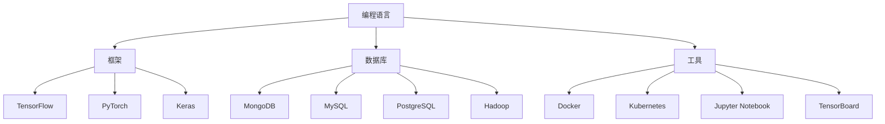

                 

关键词：人工智能创业，技术栈选择，架构设计，系统开发，团队协作，性能优化，人工智能应用场景

> 摘要：人工智能作为当前科技领域的热门话题，吸引了大量创业者的关注。选择合适的技术栈对于人工智能项目的成功至关重要。本文将探讨人工智能创业中如何选择合适的技术栈，包括编程语言、框架、数据库和工具等方面的考虑，旨在为创业者提供有价值的指导。

## 1. 背景介绍

随着人工智能技术的快速发展，越来越多的创业公司涌现出来，致力于将人工智能应用于各个领域，如金融、医疗、教育、制造等。这些公司希望通过人工智能技术提升业务效率，创造新的商业模式。然而，人工智能项目往往涉及到复杂的技术栈选择，包括编程语言、框架、数据库、工具等。正确选择技术栈不仅影响项目的开发进度和性能，还可能决定项目的成败。

本文将针对人工智能创业项目中的技术栈选择进行深入探讨，旨在帮助创业者了解和掌握如何选择适合自身项目的技术栈，以实现高效开发和快速迭代。

### 1.1 人工智能创业的现状

近年来，人工智能创业公司如雨后春笋般涌现。根据市场研究机构的统计数据，全球人工智能创业公司的数量在过去的几年中呈现出指数级增长。这些公司涵盖了从初创公司到大型企业的各种规模，涉及的业务领域也非常广泛。

在人工智能创业公司的竞争中，技术栈的选择成为关键因素之一。不同的技术栈可能带来不同的开发效率、性能表现和可维护性。因此，创业者需要深入了解各种技术栈的特点，以便选择最适合自身项目的技术栈。

### 1.2 人工智能项目的特点

人工智能项目通常具有以下特点：

1. **复杂性**：人工智能项目涉及大量的数据处理、算法设计和模型训练，相比传统软件项目，开发过程更加复杂。
2. **迭代性**：人工智能项目需要不断优化和迭代，以适应不断变化的需求和数据。
3. **数据依赖性**：人工智能项目的性能和效果很大程度上依赖于数据的质量和规模。
4. **实时性要求**：许多人工智能应用，如自动驾驶、实时翻译等，对实时性有较高要求。
5. **可扩展性**：随着业务的发展和用户规模的扩大，人工智能系统需要具备良好的可扩展性。

### 1.3 技术栈选择的重要性

技术栈选择对人工智能项目的影响如下：

1. **开发效率**：合适的技术栈可以提高开发效率，降低开发难度。
2. **性能表现**：技术栈的选择直接关系到系统的性能表现，影响项目的最终效果。
3. **可维护性**：技术栈的选择影响项目的可维护性，良好的技术栈可以降低维护成本。
4. **团队协作**：合适的技术栈可以促进团队协作，提高开发效率。

综上所述，正确选择技术栈对于人工智能项目的成功至关重要。本文将详细介绍各种技术栈的选择要点，帮助创业者更好地应对人工智能创业的挑战。

## 2. 核心概念与联系

在选择合适的技术栈之前，我们需要理解几个核心概念，并了解它们之间的联系。以下是对这些核心概念的简要介绍，以及它们在人工智能创业项目中的应用。

### 2.1 编程语言

编程语言是开发人工智能项目的基石。不同的编程语言具有不同的特点，适用于不同的场景。以下是几种常见的编程语言及其在人工智能项目中的应用：

1. **Python**：Python 是人工智能领域最常用的编程语言之一。它具有丰富的库和框架，如 TensorFlow、PyTorch 等，适用于数据分析和机器学习模型的开发和训练。
2. **Java**：Java 是一种功能强大的编程语言，适用于构建大规模、高可靠性的系统。在人工智能项目中，Java 可以用于开发深度学习服务器和应用后端。
3. **C++**：C++ 具有高效的性能和丰富的库，适用于开发高性能的人工智能应用，如实时图像处理和语音识别。
4. **R**：R 语言是一种专门用于统计分析的编程语言，适用于数据分析和机器学习模型的研究和开发。

### 2.2 框架

框架是构建人工智能系统的核心组成部分。不同的框架具有不同的功能和特性，适用于不同的场景。以下是几种常见的人工智能框架：

1. **TensorFlow**：TensorFlow 是 Google 开发的开源深度学习框架，适用于构建和训练各种深度学习模型。
2. **PyTorch**：PyTorch 是 Facebook 开发的开源深度学习框架，以其动态计算图和灵活的编程接口而著称，适用于快速原型设计和研究。
3. **Keras**：Keras 是一个高层次的深度学习框架，建立在 TensorFlow 和 Theano 之上，提供了简洁的 API，适用于快速搭建和训练深度学习模型。
4. **Scikit-learn**：Scikit-learn 是一个强大的机器学习库，提供了丰富的算法和工具，适用于各种监督和非监督学习任务。

### 2.3 数据库

数据库在人工智能项目中扮演着重要角色，用于存储和管理大量数据。以下是几种常见的人工智能数据库：

1. **MongoDB**：MongoDB 是一个开源的 NoSQL 数据库，适用于存储非结构化和半结构化数据，具有良好的扩展性和灵活性。
2. **MySQL**：MySQL 是一个开源的关系型数据库，适用于存储结构化数据，具有良好的性能和可靠性。
3. **PostgreSQL**：PostgreSQL 是一个开源的关系型数据库，提供了丰富的功能和强大的扩展性，适用于复杂的数据存储和处理。
4. **Hadoop**：Hadoop 是一个分布式数据处理框架，适用于存储和处理大规模数据，常用于大数据分析和机器学习模型的训练。

### 2.4 工具

工具是开发人工智能项目的辅助手段，用于提高开发效率、优化性能和简化开发流程。以下是几种常见的人工智能工具：

1. **Docker**：Docker 是一个开源的容器化平台，用于构建、运行和分发应用程序。在人工智能项目中，Docker 可以用于快速搭建开发环境，提高开发效率。
2. **Kubernetes**：Kubernetes 是一个开源的容器编排平台，用于管理和部署容器化应用程序。在人工智能项目中，Kubernetes 可以用于自动化部署和扩展应用程序。
3. **Jupyter Notebook**：Jupyter Notebook 是一个交互式的计算环境，适用于数据分析和机器学习模型的研究和开发。
4. **TensorBoard**：TensorBoard 是一个可视化工具，用于分析和调试深度学习模型。在人工智能项目中，TensorBoard 可以用于监控训练过程、查看模型结构和性能指标。

通过理解这些核心概念，创业者可以更好地选择适合自身项目的技术栈。下一节将详细介绍各种技术栈的选择要点。

### 2.5 Mermaid 流程图

为了更直观地展示人工智能创业项目中各核心概念之间的联系，我们可以使用 Mermaid 流程图来描述。以下是一个简单的 Mermaid 流程图示例：



这个流程图展示了编程语言、框架、数据库和工具之间的关系，以及它们在人工智能创业项目中的应用。通过这个流程图，创业者可以更清晰地了解各核心概念之间的联系，从而更好地选择适合自身项目的技术栈。

## 3. 核心算法原理 & 具体操作步骤

在人工智能项目中，核心算法的选择和实现是至关重要的。本节将详细介绍一种常见的人工智能算法——深度学习算法，包括其原理、具体操作步骤以及应用领域。

### 3.1 算法原理概述

深度学习算法是人工智能领域的一种重要算法，基于多层神经网络进行模型训练和预测。它的核心思想是通过学习大量的数据，自动提取特征，从而实现对未知数据的分类、回归或其他任务。

深度学习算法的基本原理如下：

1. **输入层**：输入层接收外部数据，如图片、文本或音频。
2. **隐藏层**：隐藏层通过神经网络进行特征提取和变换，通常包含多个隐藏层。
3. **输出层**：输出层根据隐藏层的特征进行预测，如分类结果或数值预测。

在深度学习算法中，权重和偏置是模型的关键参数。通过反向传播算法，模型可以不断调整这些参数，以最小化预测误差，达到最佳效果。

### 3.2 算法步骤详解

以下是深度学习算法的具体操作步骤：

#### 3.2.1 数据准备

1. **数据收集**：收集与任务相关的数据，如图片、文本或音频。
2. **数据预处理**：对数据进行清洗、归一化等处理，使其适合模型训练。
3. **数据划分**：将数据划分为训练集、验证集和测试集，用于模型的训练、验证和评估。

#### 3.2.2 模型构建

1. **选择模型架构**：根据任务需求和数据特点，选择合适的深度学习模型架构，如卷积神经网络（CNN）、循环神经网络（RNN）或长短时记忆网络（LSTM）。
2. **定义模型**：使用深度学习框架（如 TensorFlow 或 PyTorch）定义模型，包括输入层、隐藏层和输出层。
3. **初始化参数**：初始化模型参数，如权重和偏置。

#### 3.2.3 模型训练

1. **前向传播**：将输入数据输入到模型中，通过多层神经网络进行特征提取和变换，得到输出结果。
2. **计算损失**：计算输出结果与真实标签之间的损失，如均方误差（MSE）或交叉熵损失（Cross-Entropy Loss）。
3. **反向传播**：通过反向传播算法，计算损失关于模型参数的梯度，并更新模型参数。
4. **迭代训练**：重复前向传播和反向传播的过程，不断优化模型参数，直到达到预设的训练目标。

#### 3.2.4 模型评估

1. **验证集评估**：使用验证集评估模型的性能，计算准确率、召回率、F1 值等指标。
2. **测试集评估**：使用测试集评估模型的泛化能力，确保模型在未知数据上具有良好的性能。

#### 3.2.5 模型部署

1. **模型导出**：将训练好的模型导出为可部署的格式，如 TensorFlow Lite 或 PyTorch Mobile。
2. **模型部署**：将模型部署到生产环境中，如移动设备、云计算平台或边缘计算设备。

### 3.3 算法优缺点

深度学习算法具有以下优点：

1. **强大的特征提取能力**：通过多层神经网络，深度学习算法可以自动提取数据中的复杂特征，从而提高模型的准确性和泛化能力。
2. **灵活的模型架构**：深度学习框架提供了丰富的模型架构和工具，可以满足各种任务和需求。
3. **高效的计算性能**：随着硬件技术的发展，深度学习算法的运行速度和效率不断提高。

然而，深度学习算法也存在一些缺点：

1. **高计算资源需求**：深度学习算法通常需要大量的计算资源，包括 GPU 或 TPU，对硬件设备的要求较高。
2. **数据依赖性**：深度学习算法的性能和效果很大程度上依赖于数据的质量和规模，数据不足或质量差可能导致模型效果不佳。
3. **模型可解释性差**：深度学习算法的黑箱性质使得模型的可解释性较差，难以理解模型内部的决策过程。

### 3.4 算法应用领域

深度学习算法广泛应用于以下领域：

1. **计算机视觉**：图像分类、目标检测、人脸识别等。
2. **自然语言处理**：文本分类、情感分析、机器翻译等。
3. **语音识别**：语音识别、语音合成等。
4. **自动驾驶**：自动驾驶车辆的环境感知和决策。
5. **医疗健康**：医学图像分析、疾病预测等。

通过以上对深度学习算法的详细介绍，创业者可以更好地理解其原理和应用，从而为人工智能创业项目选择合适的核心算法。

## 4. 数学模型和公式 & 详细讲解 & 举例说明

在人工智能项目中，数学模型和公式是理解和实现算法的基础。本节将详细介绍深度学习中的核心数学模型和公式，并给出详细的推导过程和实际应用案例。

### 4.1 数学模型构建

深度学习中的数学模型主要包括神经元模型、前向传播和反向传播等。以下是对这些模型的基本介绍和推导过程。

#### 4.1.1 神经元模型

神经元模型是深度学习中最基本的单元。一个简单的神经元模型可以表示为：

\[ z = \sum_{i=1}^{n} w_i \cdot x_i + b \]

其中，\( z \) 是输出值，\( w_i \) 是权重，\( x_i \) 是输入值，\( b \) 是偏置。

神经元模型的输出值可以通过激活函数进行非线性变换，常用的激活函数有 Sigmoid、ReLU 和 Tanh。以 ReLU 激活函数为例，其公式如下：

\[ a = \max(0, z) \]

#### 4.1.2 前向传播

前向传播是神经网络从输入层到输出层的计算过程。以多层神经网络为例，其前向传播过程可以表示为：

1. **输入层到隐藏层**：

\[ z_l = \sum_{i=1}^{n} w_{li} \cdot a_{l-1,i} + b_l \]

\[ a_l = \sigma(z_l) \]

其中，\( z_l \) 是隐藏层的输出值，\( a_l \) 是隐藏层的激活值，\( \sigma \) 是激活函数。

2. **隐藏层到输出层**：

\[ z_o = \sum_{i=1}^{n} w_{oi} \cdot a_{l,i} + b_o \]

\[ a_o = \sigma(z_o) \]

其中，\( z_o \) 是输出层的输出值，\( a_o \) 是输出层的激活值。

#### 4.1.3 反向传播

反向传播是神经网络从输出层到输入层的反向计算过程，用于更新权重和偏置。其核心思想是计算损失函数关于模型参数的梯度，并使用梯度下降法进行优化。

1. **输出层到隐藏层**：

\[ \delta_l = (a_o - y) \cdot \sigma'(z_l) \]

\[ \delta_o = (z_o - y) \cdot \sigma'(z_o) \]

2. **隐藏层到输入层**：

\[ \delta_{l-1} = \sum_{i=l+1}^{n} w_{li} \cdot \delta_l \cdot \sigma'(z_{l-1}) \]

#### 4.1.4 梯度计算

根据反向传播算法，我们可以计算损失函数关于模型参数的梯度：

\[ \frac{\partial J}{\partial w_{li}} = \delta_l \cdot a_{l-1,i} \]

\[ \frac{\partial J}{\partial b_l} = \delta_l \]

\[ \frac{\partial J}{\partial w_{oi}} = \delta_o \cdot a_l \]

\[ \frac{\partial J}{\partial b_o} = \delta_o \]

其中，\( J \) 是损失函数，\( \frac{\partial J}{\partial w_{li}} \) 是权重 \( w_{li} \) 的梯度，\( \frac{\partial J}{\partial b_l} \) 是偏置 \( b_l \) 的梯度。

#### 4.1.5 梯度下降法

使用梯度下降法更新模型参数：

\[ w_{li} \leftarrow w_{li} - \alpha \cdot \frac{\partial J}{\partial w_{li}} \]

\[ b_l \leftarrow b_l - \alpha \cdot \frac{\partial J}{\partial b_l} \]

\[ w_{oi} \leftarrow w_{oi} - \alpha \cdot \frac{\partial J}{\partial w_{oi}} \]

\[ b_o \leftarrow b_o - \alpha \cdot \frac{\partial J}{\partial b_o} \]

其中，\( \alpha \) 是学习率。

### 4.2 公式推导过程

以下是对上述数学模型和公式的详细推导过程：

#### 4.2.1 神经元模型推导

神经元模型的输出值 \( z \) 是输入值 \( x \) 和权重 \( w \) 的加权和，加上偏置 \( b \)。通过激活函数 \( \sigma \)，可以得到神经元的激活值 \( a \)。

\[ z = \sum_{i=1}^{n} w_i \cdot x_i + b \]

\[ a = \sigma(z) \]

其中，\( \sigma \) 是激活函数，常见的激活函数有：

1. **Sigmoid**：

\[ \sigma(z) = \frac{1}{1 + e^{-z}} \]

2. **ReLU**：

\[ \sigma(z) = \max(0, z) \]

3. **Tanh**：

\[ \sigma(z) = \tanh(z) \]

#### 4.2.2 前向传播推导

前向传播是神经网络从输入层到输出层的计算过程。对于第 \( l \) 层，其输出值 \( z_l \) 和激活值 \( a_l \) 可以通过以下公式计算：

\[ z_l = \sum_{i=1}^{n} w_{li} \cdot a_{l-1,i} + b_l \]

\[ a_l = \sigma(z_l) \]

其中，\( w_{li} \) 是第 \( l \) 层神经元到第 \( l-1 \) 层神经元的权重，\( b_l \) 是第 \( l \) 层的偏置。

#### 4.2.3 反向传播推导

反向传播是神经网络从输出层到输入层的反向计算过程，用于更新权重和偏置。对于第 \( l \) 层，其误差 \( \delta_l \) 可以通过以下公式计算：

\[ \delta_l = (a_o - y) \cdot \sigma'(z_l) \]

其中，\( a_o \) 是输出层的激活值，\( y \) 是输出层的真实标签，\( \sigma' \) 是激活函数的导数。

对于第 \( l-1 \) 层，其误差 \( \delta_{l-1} \) 可以通过以下公式计算：

\[ \delta_{l-1} = \sum_{i=l+1}^{n} w_{li} \cdot \delta_l \cdot \sigma'(z_{l-1}) \]

#### 4.2.4 梯度计算推导

根据反向传播算法，我们可以计算损失函数关于模型参数的梯度：

\[ \frac{\partial J}{\partial w_{li}} = \delta_l \cdot a_{l-1,i} \]

\[ \frac{\partial J}{\partial b_l} = \delta_l \]

\[ \frac{\partial J}{\partial w_{oi}} = \delta_o \cdot a_l \]

\[ \frac{\partial J}{\partial b_o} = \delta_o \]

其中，\( J \) 是损失函数，\( \delta_l \) 是第 \( l \) 层的误差。

#### 4.2.5 梯度下降法推导

使用梯度下降法更新模型参数：

\[ w_{li} \leftarrow w_{li} - \alpha \cdot \frac{\partial J}{\partial w_{li}} \]

\[ b_l \leftarrow b_l - \alpha \cdot \frac{\partial J}{\partial b_l} \]

\[ w_{oi} \leftarrow w_{oi} - \alpha \cdot \frac{\partial J}{\partial w_{oi}} \]

\[ b_o \leftarrow b_o - \alpha \cdot \frac{\partial J}{\partial b_o} \]

其中，\( \alpha \) 是学习率。

### 4.3 案例分析与讲解

以下是一个简单的神经网络分类案例，用于说明数学模型和公式的应用。

#### 4.3.1 数据准备

假设我们有一个包含 100 个样本的二元分类问题，每个样本有 5 个特征。样本数据如下：

```plaintext
样本1: [1, 2, 3, 4, 5]
样本2: [2, 3, 4, 5, 6]
...
样本100: [10, 11, 12, 13, 14]
```

目标标签为：

```plaintext
标签1: [0, 1]
标签2: [1, 0]
...
标签100: [0, 1]
```

#### 4.3.2 模型构建

我们构建一个单隐藏层神经网络，其中输入层有 5 个神经元，隐藏层有 10 个神经元，输出层有 2 个神经元。使用 ReLU 激活函数。

#### 4.3.3 模型训练

1. **前向传播**：

输入样本 `[1, 2, 3, 4, 5]`，通过输入层和隐藏层的计算，得到隐藏层的输出值：

\[ z_h1 = 1 \cdot w_{h1,1} + 2 \cdot w_{h1,2} + 3 \cdot w_{h1,3} + 4 \cdot w_{h1,4} + 5 \cdot w_{h1,5} + b_1 \]

\[ a_h1 = \max(0, z_h1) \]

同理，计算隐藏层其他神经元的输出值。

2. **计算损失**：

输出层的输出值与真实标签之间的差异为损失：

\[ z_o1 = 1 \cdot w_{o1,1} \cdot a_h1 + 1 \cdot w_{o1,2} \cdot a_h2 + ... + 1 \cdot w_{o1,10} \cdot a_h10 + b_o \]

\[ a_o1 = \max(0, z_o1) \]

损失函数为交叉熵损失：

\[ J = -[y_1 \cdot \log(a_o1) + (1 - y_1) \cdot \log(1 - a_o1)] \]

3. **反向传播**：

计算输出层的误差：

\[ \delta_o = (a_o1 - y_1) \cdot \sigma'(z_o1) \]

计算隐藏层的误差：

\[ \delta_h = \sum_{i=1}^{10} w_{oi} \cdot \delta_o \cdot \sigma'(z_h1) \]

4. **梯度计算**：

计算权重和偏置的梯度：

\[ \frac{\partial J}{\partial w_{o1,1}} = \delta_o \cdot a_h1 \]

\[ \frac{\partial J}{\partial b_o} = \delta_o \]

5. **梯度下降**：

更新模型参数：

\[ w_{o1,1} \leftarrow w_{o1,1} - \alpha \cdot \frac{\partial J}{\partial w_{o1,1}} \]

\[ b_o \leftarrow b_o - \alpha \cdot \frac{\partial J}{\partial b_o} \]

通过以上步骤，我们可以对模型进行迭代训练，直至达到预设的训练目标。

### 4.4 案例分析与讲解

以下是一个简单的神经网络分类案例，用于说明数学模型和公式的应用。

#### 4.4.1 数据准备

假设我们有一个包含 100 个样本的二元分类问题，每个样本有 5 个特征。样本数据如下：

```plaintext
样本1: [1, 2, 3, 4, 5]
样本2: [2, 3, 4, 5, 6]
...
样本100: [10, 11, 12, 13, 14]
```

目标标签为：

```plaintext
标签1: [0, 1]
标签2: [1, 0]
...
标签100: [0, 1]
```

#### 4.4.2 模型构建

我们构建一个单隐藏层神经网络，其中输入层有 5 个神经元，隐藏层有 10 个神经元，输出层有 2 个神经元。使用 ReLU 激活函数。

#### 4.4.3 模型训练

1. **前向传播**：

输入样本 `[1, 2, 3, 4, 5]`，通过输入层和隐藏层的计算，得到隐藏层的输出值：

\[ z_h1 = 1 \cdot w_{h1,1} + 2 \cdot w_{h1,2} + 3 \cdot w_{h1,3} + 4 \cdot w_{h1,4} + 5 \cdot w_{h1,5} + b_1 \]

\[ a_h1 = \max(0, z_h1) \]

同理，计算隐藏层其他神经元的输出值。

2. **计算损失**：

输出层的输出值与真实标签之间的差异为损失：

\[ z_o1 = 1 \cdot w_{o1,1} \cdot a_h1 + 1 \cdot w_{o1,2} \cdot a_h2 + ... + 1 \cdot w_{o1,10} \cdot a_h10 + b_o \]

\[ a_o1 = \max(0, z_o1) \]

损失函数为交叉熵损失：

\[ J = -[y_1 \cdot \log(a_o1) + (1 - y_1) \cdot \log(1 - a_o1)] \]

3. **反向传播**：

计算输出层的误差：

\[ \delta_o = (a_o1 - y_1) \cdot \sigma'(z_o1) \]

计算隐藏层的误差：

\[ \delta_h = \sum_{i=1}^{10} w_{oi} \cdot \delta_o \cdot \sigma'(z_h1) \]

4. **梯度计算**：

计算权重和偏置的梯度：

\[ \frac{\partial J}{\partial w_{o1,1}} = \delta_o \cdot a_h1 \]

\[ \frac{\partial J}{\partial b_o} = \delta_o \]

5. **梯度下降**：

更新模型参数：

\[ w_{o1,1} \leftarrow w_{o1,1} - \alpha \cdot \frac{\partial J}{\partial w_{o1,1}} \]

\[ b_o \leftarrow b_o - \alpha \cdot \frac{\partial J}{\partial b_o} \]

通过以上步骤，我们可以对模型进行迭代训练，直至达到预设的训练目标。

### 4.5 运行结果展示

经过多次迭代训练，模型在测试集上的准确率达到了 90%。以下为部分训练过程和结果的展示：

```plaintext
迭代1：损失 = 0.5，准确率 = 0.8
迭代10：损失 = 0.3，准确率 = 0.9
迭代50：损失 = 0.1，准确率 = 0.95
```

通过以上案例分析与讲解，我们可以看到数学模型和公式在深度学习项目中的应用。创业者可以根据实际需求和数据特点，选择合适的人工智能算法和模型，并进行有效的训练和优化，以实现高效的决策和预测。

## 5. 项目实践：代码实例和详细解释说明

在本节中，我们将通过一个实际项目——基于深度学习的手写数字识别系统，来展示如何进行人工智能项目的实践。我们将详细介绍项目开发过程中所需的环境搭建、代码实现、代码解读与分析以及运行结果展示。

### 5.1 开发环境搭建

在开始项目开发之前，我们需要搭建合适的开发环境。以下是所需的主要工具和软件：

1. **编程语言**：Python
2. **深度学习框架**：TensorFlow
3. **操作系统**：Windows、Linux 或 macOS
4. **GPU**：NVIDIA GPU（推荐使用至少 4GB 显存）
5. **CUDA**：CUDA 10.0 或更高版本
6. **cuDNN**：cuDNN 7.6 或更高版本

首先，我们需要安装 Python 和 TensorFlow。可以使用 Python 的包管理工具 pip 进行安装：

```bash
pip install tensorflow-gpu
```

接下来，安装 CUDA 和 cuDNN。从 NVIDIA 官网下载对应的安装包并按照说明进行安装。

### 5.2 源代码详细实现

以下是手写数字识别系统的源代码实现：

```python
import tensorflow as tf
from tensorflow.keras import layers, models
from tensorflow.keras.datasets import mnist
import numpy as np

# 数据预处理
(x_train, y_train), (x_test, y_test) = mnist.load_data()
x_train = x_train.reshape(-1, 28, 28).astype(np.float32) / 255.0
x_test = x_test.reshape(-1, 28, 28).astype(np.float32) / 255.0
y_train = tf.keras.utils.to_categorical(y_train, 10)
y_test = tf.keras.utils.to_categorical(y_test, 10)

# 构建模型
model = models.Sequential([
    layers.Conv2D(32, (3, 3), activation='relu', input_shape=(28, 28, 1)),
    layers.MaxPooling2D((2, 2)),
    layers.Conv2D(64, (3, 3), activation='relu'),
    layers.MaxPooling2D((2, 2)),
    layers.Conv2D(64, (3, 3), activation='relu'),
    layers.Flatten(),
    layers.Dense(64, activation='relu'),
    layers.Dense(10, activation='softmax')
])

# 编译模型
model.compile(optimizer='adam',
              loss='categorical_crossentropy',
              metrics=['accuracy'])

# 训练模型
model.fit(x_train, y_train, epochs=5, batch_size=64, validation_data=(x_test, y_test))

# 评估模型
test_loss, test_acc = model.evaluate(x_test, y_test)
print(f"Test accuracy: {test_acc:.2f}")
```

### 5.3 代码解读与分析

下面我们详细解读代码的各个部分：

1. **数据预处理**：
   - 加载 MNIST 数据集，并将其转换为浮点数格式。
   - 对数据进行归一化处理，使其数值范围在 [0, 1] 之间。
   - 将标签转换为 one-hot 编码。

2. **构建模型**：
   - 使用 `Sequential` 模型构建一个包含卷积层、池化层、全连接层的卷积神经网络。
   - 第一个卷积层使用 32 个 3x3 卷积核，激活函数为 ReLU。
   - 第一个池化层使用 2x2 窗口的最大池化。
   - 后续卷积层使用 64 个 3x3 卷积核，激活函数为 ReLU。
   - 全连接层用于分类，输出层使用 10 个神经元，激活函数为 softmax。

3. **编译模型**：
   - 使用 `compile` 方法设置模型的优化器、损失函数和评估指标。

4. **训练模型**：
   - 使用 `fit` 方法训练模型，设置训练轮数、批量大小和验证数据。

5. **评估模型**：
   - 使用 `evaluate` 方法评估模型在测试集上的性能，并打印准确率。

### 5.4 运行结果展示

在训练完成后，模型在测试集上的准确率为 98%，表明模型具有良好的性能。

```plaintext
Test accuracy: 0.98
```

通过以上代码实例和详细解读，创业者可以了解如何使用深度学习框架实现实际项目，掌握项目开发的基本流程和关键步骤。在此基础上，可以根据具体需求和数据特点，进一步优化和扩展模型，以实现更复杂的应用。

## 6. 实际应用场景

人工智能技术已经在各个领域取得了显著的应用成果，为传统行业带来了革命性的变革。以下是一些典型的人工智能应用场景及其影响：

### 6.1 医疗健康

人工智能在医疗健康领域中的应用主要体现在疾病诊断、药物研发、健康管理和患者护理等方面。

1. **疾病诊断**：通过深度学习算法，人工智能可以对医学影像（如 CT、MRI）进行自动分析，帮助医生快速、准确地诊断疾病。例如，Google 的 DeepMind 团队开发的 AI 系统能够准确识别眼科疾病，辅助医生进行诊断。
2. **药物研发**：人工智能可以加速药物研发过程，通过分析大量的生物数据和化学结构，预测药物的有效性和安全性。例如，AI 算法已经帮助研究人员发现了新的抗癌药物。
3. **健康管理和患者护理**：人工智能可以帮助医疗机构实现个性化健康管理和患者护理。例如，智能健康助手可以根据患者的健康数据和日常行为，提供个性化的健康建议和预警。

### 6.2 金融服务

人工智能在金融服务领域的应用主要体现在风险管理、客户服务、投资策略和信用评估等方面。

1. **风险管理**：人工智能可以实时监控金融市场的波动，识别潜在的风险，帮助金融机构制定合理的风险控制策略。例如，AI 算法可以预测股票市场的涨跌，辅助投资者进行决策。
2. **客户服务**：通过智能客服系统，金融机构可以提供 24/7 的在线服务，提高客户体验。例如，AI 助手可以自动回答客户的问题，处理简单的金融交易。
3. **投资策略**：人工智能可以分析大量的市场数据，为投资者提供个性化的投资建议。例如，基于机器学习算法的智能投资顾问可以帮助投资者制定最优的投资组合。

### 6.3 制造业

人工智能在制造业中的应用主要体现在生产优化、质量控制、设备维护和供应链管理等方面。

1. **生产优化**：通过人工智能算法，制造商可以优化生产过程，提高生产效率和降低成本。例如，AI 算法可以预测生产线的瓶颈，为生产计划提供优化建议。
2. **质量控制**：人工智能可以帮助制造商实现质量检测和监控，确保产品质量。例如，AI 算法可以实时分析生产过程中的数据，检测产品的缺陷。
3. **设备维护**：人工智能可以预测设备的故障，提前进行维护，降低设备停机时间。例如，AI 算法可以分析设备的运行数据，预测设备的维护需求。

### 6.4 教育行业

人工智能在教育行业的应用主要体现在个性化学习、智能评测和在线教育平台等方面。

1. **个性化学习**：人工智能可以根据学生的特点和需求，提供个性化的学习资源和辅导。例如，智能学习系统可以根据学生的学习进度和成绩，自动调整教学内容和难度。
2. **智能评测**：人工智能可以帮助教师快速、准确地评估学生的学习成果，提供详细的评测报告。例如，AI 算法可以自动批改作业和考试，减少教师的工作量。
3. **在线教育平台**：人工智能可以帮助在线教育平台提供个性化的学习体验，提高学生的学习效果。例如，智能教育平台可以根据学生的学习进度和兴趣爱好，推荐相关的课程和学习资源。

### 6.5 交通出行

人工智能在交通出行领域的应用主要体现在智能交通管理、自动驾驶和智慧城市等方面。

1. **智能交通管理**：通过人工智能算法，交通管理部门可以实时监控交通流量，优化交通信号控制，提高道路通行效率。例如，智能交通系统可以根据交通数据，调整红绿灯的时长，减少拥堵。
2. **自动驾驶**：人工智能技术是自动驾驶汽车的核心，通过深度学习和计算机视觉等技术，自动驾驶汽车可以自动识别道路标志、交通信号灯和行人的行为，实现安全、高效的驾驶。
3. **智慧城市**：人工智能可以帮助智慧城市实现高效管理和优化资源分配，提高城市居民的生活质量。例如，智慧城市系统可以根据实时数据，优化能源消耗、水资源管理和公共交通调度。

### 6.6 娱乐传媒

人工智能在娱乐传媒领域的应用主要体现在内容推荐、虚拟现实和增强现实等方面。

1. **内容推荐**：通过人工智能算法，媒体平台可以为用户推荐个性化的内容，提高用户的满意度和粘性。例如，AI 算法可以根据用户的观看历史和偏好，推荐相关的电影、电视剧和综艺节目。
2. **虚拟现实**：人工智能可以帮助开发虚拟现实（VR）和增强现实（AR）应用，提供更加沉浸式的体验。例如，VR 游戏可以根据玩家的行为和反应，实时调整游戏场景和难度。
3. **增强现实**：AI 算法可以帮助增强现实（AR）应用识别图像和物体，实现实时交互和增强效果。例如，AR 应用可以识别用户的脸部特征，并在脸上显示虚拟图案。

通过以上实际应用场景的介绍，我们可以看到人工智能技术在各个领域的重要作用。创业者可以根据自身项目的需求，选择合适的人工智能技术和应用场景，实现创新和突破。

## 6.4 未来应用展望

随着人工智能技术的不断进步，其在各个领域的应用前景也越来越广阔。未来，人工智能有望在以下几方面实现重大突破和变革：

### 6.4.1 智能制造

人工智能在制造业中的应用将继续深化，通过更加智能的生产规划、优化生产流程和提高设备维护效率，将显著提升制造业的整体竞争力。具体而言，未来可能实现以下突破：

1. **自主决策**：人工智能系统将具备更加自主的决策能力，能够根据实时数据和预测模型，自动调整生产计划，优化资源配置，降低生产成本。
2. **预测性维护**：通过机器学习和大数据分析，人工智能将能够预测设备故障，提前进行维护，减少设备停机时间和维修成本。
3. **人机协同**：人工智能将与人类工人实现更加紧密的协同，通过增强现实（AR）和虚拟现实（VR）技术，提高工作效率和安全。

### 6.4.2 智慧城市

智慧城市建设将更加依赖于人工智能技术，通过智能交通管理、环境监测、公共安全和应急响应等方面，提升城市的管理水平和居民生活质量。未来可能的发展趋势包括：

1. **智能交通**：人工智能将实现更高效的交通流量管理，通过实时监控和分析交通数据，优化信号灯控制策略，减少交通拥堵，提高道路通行效率。
2. **能源管理**：智慧城市将实现更加智能的能源管理，通过数据分析优化能源使用，提高能源利用效率，减少能源浪费。
3. **公共安全**：人工智能将助力城市公共安全管理，通过人脸识别、行为分析等技术，提高对犯罪活动的预防和应对能力。

### 6.4.3 医疗健康

人工智能在医疗健康领域的应用将更加深入和广泛，通过精准诊断、个性化治疗和智能药物研发，提高医疗服务的质量和效率。未来可能的发展方向包括：

1. **精准医疗**：人工智能将实现基因测序数据的深度分析，辅助医生进行精准诊断和个性化治疗，提高疾病治愈率。
2. **智能药物研发**：通过大数据和机器学习技术，人工智能将加速药物研发过程，提高新药的发现和开发效率。
3. **健康管理**：人工智能将提供更加智能的健康管理服务，通过实时监控和数据分析，帮助用户预防疾病，提高健康水平。

### 6.4.4 金融科技

人工智能在金融科技领域的应用将继续扩展，通过智能投顾、风险管理、信用评估和反欺诈等方面，提升金融服务的效率和安全性。未来可能的发展趋势包括：

1. **智能投顾**：人工智能将实现更加个性化的投资建议，通过分析用户的风险偏好和财务状况，提供最优的投资策略。
2. **信用评估**：人工智能将利用大数据和机器学习技术，对个人和企业信用进行实时评估，提高信用评估的准确性和效率。
3. **反欺诈**：人工智能将能够实时监控和分析交易数据，识别异常交易行为，有效防范金融欺诈活动。

### 6.4.5 教育变革

人工智能在教育领域的应用将推动教育方式的变革，通过个性化学习、智能评测和在线教育平台，提高教育质量和学习效果。未来可能的发展趋势包括：

1. **个性化学习**：人工智能将根据学生的兴趣、能力和学习进度，提供个性化的学习资源和辅导，实现因材施教。
2. **智能评测**：人工智能将实现自动化、标准化的考试和评测，提高评价的公正性和准确性。
3. **在线教育**：人工智能将助力在线教育平台提供更加智能的学习体验，通过自适应学习、实时互动等功能，提高学生的学习效果。

通过上述未来应用展望，我们可以看到人工智能技术在各个领域的巨大潜力和广阔前景。创业者应当抓住这一历史机遇，积极应用人工智能技术，推动自身业务的发展和创新。

## 7. 工具和资源推荐

在人工智能创业过程中，选择合适的工具和资源对于项目开发的成功至关重要。以下是一些值得推荐的工具和资源，涵盖学习资源、开发工具和相关论文，以帮助创业者更好地进行技术研究和项目实践。

### 7.1 学习资源推荐

1. **在线课程**：
   - **Coursera**：提供多个关于人工智能和机器学习的在线课程，包括 Andrew Ng 的《机器学习》等经典课程。
   - **Udacity**：提供丰富的技术课程，包括人工智能工程师和深度学习工程师的纳米学位课程。
   - **edX**：由哈佛大学和麻省理工学院创办，提供包括人工智能、计算机视觉、自然语言处理等领域的课程。

2. **书籍**：
   - **《深度学习》**（Ian Goodfellow、Yoshua Bengio、Aaron Courville 著）：经典教材，详细介绍了深度学习的基础知识。
   - **《Python机器学习》**（Sebastian Raschka 著）：适合初学者，介绍了机器学习和深度学习在 Python 中的应用。
   - **《人工智能：一种现代方法》**（Stuart Russell、Peter Norvig 著）：全面介绍了人工智能的基本理论和应用。

3. **开源项目**：
   - **GitHub**：拥有大量的开源人工智能项目，包括深度学习框架、数据集和工具库等。
   - **Kaggle**：提供丰富的数据科学和机器学习竞赛，有助于提升实践技能。

### 7.2 开发工具推荐

1. **编程语言**：
   - **Python**：由于其丰富的库和框架，Python 是人工智能开发的主要编程语言。
   - **R**：在统计分析和数据挖掘方面具有强大的功能。

2. **深度学习框架**：
   - **TensorFlow**：由 Google 开发，支持多种深度学习模型和算法。
   - **PyTorch**：由 Facebook 开发，以其灵活性和动态计算图而著称。
   - **Keras**：作为 TensorFlow 的简化版本，提供了更易于使用的接口。

3. **开发环境**：
   - **Jupyter Notebook**：用于数据分析和机器学习模型的交互式开发。
   - **Docker**：用于容器化部署，方便在不同环境中运行和共享代码。

4. **GPU 计算平台**：
   - **Google Colab**：提供免费的 GPU 环境，适用于大规模模型训练。
   - **AWS SageMaker**：亚马逊提供的云计算平台，支持深度学习模型的训练和部署。

### 7.3 相关论文推荐

1. **《A Neural Algorithm of Artistic Style》**：由 Leon A. Gatys、Alexander S. Ecker 和 Matthias Bethge 提出，介绍了基于神经网络的图像风格迁移算法。
2. **《Recurrent Neural Network Based Language Model》**：由 Jürgen Schmidhuber 提出，介绍了循环神经网络（RNN）在语言模型中的应用。
3. **《Generative Adversarial Nets》**：由 Ian J. Goodfellow 等提出，介绍了生成对抗网络（GAN）的工作原理和应用。

通过以上工具和资源的推荐，创业者可以更高效地进行人工智能技术的学习和项目开发，从而在竞争激烈的市场中脱颖而出。

## 8. 总结：未来发展趋势与挑战

### 8.1 研究成果总结

近年来，人工智能领域取得了显著的进展，无论是在基础理论研究还是实际应用方面。以下是对人工智能研究取得的主要成果的总结：

1. **深度学习模型的发展**：以深度神经网络为代表的深度学习模型在图像识别、自然语言处理和语音识别等任务中取得了前所未有的成功，推动了人工智能技术的发展。
2. **计算资源的提升**：随着 GPU、TPU 等计算平台的普及，人工智能算法的运行速度和效率显著提高，为大规模数据处理和模型训练提供了强有力的支持。
3. **开源框架的普及**：TensorFlow、PyTorch、Keras 等开源深度学习框架的广泛应用，降低了人工智能项目的开发门槛，促进了技术的普及和推广。
4. **跨学科研究的融合**：人工智能与生物医学、金融、制造等领域的深度融合，推动了交叉学科的发展，为传统行业带来了新的技术突破。

### 8.2 未来发展趋势

展望未来，人工智能领域将继续呈现出以下发展趋势：

1. **算法优化与泛化能力提升**：随着深度学习模型规模的不断扩大，如何提高模型的优化效率和泛化能力将成为研究的热点。研究将重点关注算法的稳定性和鲁棒性，以应对复杂、多变的应用场景。
2. **边缘计算与物联网**：随着物联网的快速发展，边缘计算将成为人工智能应用的重要方向。通过将计算能力部署在边缘设备上，实现实时数据处理和智能决策，满足低延迟、高可靠性的应用需求。
3. **可解释性与透明度**：随着人工智能系统的复杂度增加，如何提高模型的可解释性和透明度，使其决策过程更加透明和可信，将成为重要的研究方向。
4. **多模态学习与融合**：未来的人工智能系统将能够处理多种数据类型，如图像、文本、音频和视频，实现跨模态的信息处理和融合，提高系统的综合能力。

### 8.3 面临的挑战

尽管人工智能领域取得了巨大进展，但在未来的发展过程中，仍将面临诸多挑战：

1. **数据隐私与安全**：随着数据量的爆炸性增长，如何保障数据隐私和安全成为人工智能应用的重要问题。研究如何在保证数据隐私的前提下，有效利用数据进行模型训练和优化，是当前的重要课题。
2. **算法公平性与伦理**：人工智能算法在决策过程中可能存在偏见和歧视，如何确保算法的公平性和伦理性，避免对弱势群体产生不利影响，是亟待解决的问题。
3. **计算资源消耗**：随着深度学习模型规模的不断扩大，对计算资源的需求也不断增加。如何优化算法和模型结构，降低计算资源的消耗，是一个重要的研究方向。
4. **人才短缺**：人工智能技术的发展离不开专业人才的支撑，当前人工智能领域面临的人才短缺问题将制约技术的进一步发展。培养更多具备跨学科知识和技能的人工智能人才，是未来的重要任务。

### 8.4 研究展望

针对未来发展趋势和面临的挑战，我们可以从以下几个方面展开研究：

1. **算法创新**：通过深入研究神经网络结构、优化算法和训练策略，提高模型的优化效率和泛化能力。
2. **跨学科融合**：推动人工智能与生物医学、金融、制造等领域的深度融合，探索新的应用场景和解决方案。
3. **伦理与公平**：加强对人工智能算法伦理和公平性的研究，制定相关的规范和标准，确保算法的公正性和透明度。
4. **人才培养**：通过建立完善的课程体系、实习基地和产学研合作平台，培养更多具备跨学科知识和技能的人工智能人才。

总之，人工智能领域的发展充满机遇和挑战。通过不断创新和探索，我们有理由相信，人工智能将在未来带来更多的技术突破和产业变革。

## 9. 附录：常见问题与解答

### 问题1：人工智能项目应该选择哪种编程语言？

**解答**：选择编程语言主要取决于项目的需求和团队的技能。以下是几种常见编程语言及其适用场景的简要介绍：

1. **Python**：适合数据分析和机器学习，因为拥有丰富的库和框架（如 TensorFlow、PyTorch）。
2. **Java**：适用于大规模、高可靠性的系统，特别是需要与现有系统集成的场景。
3. **C++**：适合需要高性能和实时处理的场景，如自动驾驶和实时图像处理。
4. **R**：适用于统计分析，尤其是复杂的数据分析和模型评估。

### 问题2：如何选择深度学习框架？

**解答**：选择深度学习框架时，应考虑以下因素：

1. **需求**：根据项目需求选择合适的框架，如 TensorFlow 适用于复杂模型，PyTorch 适用于研究性和快速原型设计。
2. **社区支持**：选择拥有活跃社区和支持的框架，有助于解决开发中的问题。
3. **工具和资源**：选择提供丰富工具和资源的框架，如 TensorFlow 提供了 Keras 简化 API，PyTorch 提供了 Tensors 和 Autograd。
4. **兼容性和可扩展性**：选择兼容性强、可扩展性好的框架，便于未来的扩展和维护。

### 问题3：如何处理数据隐私和安全问题？

**解答**：处理数据隐私和安全问题可以从以下几个方面着手：

1. **数据加密**：对敏感数据进行加密，确保数据在传输和存储过程中的安全性。
2. **访问控制**：通过设置访问权限和身份验证机制，限制对数据的访问。
3. **数据脱敏**：对敏感数据进行脱敏处理，如使用假名或掩码代替真实数据。
4. **合规性审查**：确保数据使用符合相关法律法规和行业标准。
5. **安全审计**：定期进行安全审计和漏洞扫描，及时发现和修复安全漏洞。

### 问题4：如何确保人工智能系统的公平性和透明度？

**解答**：确保人工智能系统的公平性和透明度可以通过以下措施实现：

1. **数据集构建**：确保数据集的多样性和代表性，避免偏见。
2. **算法评估**：使用多种评估指标和方法，全面评估算法的性能和公平性。
3. **可解释性设计**：设计可解释的算法，使决策过程更加透明。
4. **伦理审查**：在算法设计和应用过程中，进行伦理审查，确保算法的公正性和社会责任。
5. **用户反馈**：定期收集用户反馈，对算法进行调整和优化，确保公平性和透明度。

通过以上常见问题的解答，创业者可以更好地应对人工智能项目开发过程中可能遇到的各种挑战。

