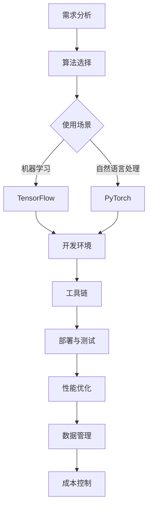

                 

关键词：人工智能、技术栈选择、创业、框架、工具、算法、开发环境

> 摘要：人工智能技术在商业领域的应用日益广泛，创业者需要准确选择合适的技术栈来确保项目成功。本文从算法选择、框架应用、开发工具推荐等多个方面，深入探讨了人工智能创业者在技术栈选择上的策略和考量。

## 1. 背景介绍

随着大数据、云计算、物联网等技术的快速发展，人工智能（AI）逐渐成为推动产业创新的重要引擎。许多创业者看到了AI带来的巨大机遇，纷纷投身于这个领域。然而，技术的多样性和复杂性使得选择合适的技术栈成为创业过程中的一个关键环节。

技术栈选择不仅影响到项目的开发效率和成本，还直接关系到最终产品的性能和用户体验。因此，如何根据项目需求和市场趋势，选择最合适的技术栈，成为每个AI创业团队必须面对的挑战。

## 2. 核心概念与联系

在讨论技术栈选择之前，我们需要了解几个核心概念和它们之间的联系。

### 2.1 算法选择

算法是AI系统的核心，决定了系统解决特定问题的能力和效率。常见的算法包括机器学习、深度学习、自然语言处理等。每种算法都有其独特的优势和适用场景。

### 2.2 框架与应用

框架是算法实现的工具，提供了高效、稳定和可扩展的API。常见的AI框架有TensorFlow、PyTorch、Keras等，它们各自有着不同的特点和优缺点。

### 2.3 开发工具与平台

开发工具和平台为开发者提供了便捷的开发环境和丰富的功能支持。比如Jupyter Notebook、Google Colab、AWS Sagemaker等，它们可以帮助开发者快速搭建和部署AI模型。

### 2.4 数据处理与存储

数据是AI模型训练的基础，有效的数据处理和存储策略对于模型性能至关重要。常见的数据处理工具包括Pandas、NumPy、SciPy等，而数据处理平台如Google BigQuery、Amazon S3则提供了强大的数据管理能力。

### 2.5 Mermaid 流程图

以下是AI项目技术栈选择的一个简化版Mermaid流程图：



## 3. 核心算法原理 & 具体操作步骤

### 3.1 算法原理概述

#### 3.1.1 机器学习

机器学习是一种让计算机通过数据学习规律，进行预测和决策的技术。常见的机器学习算法包括线性回归、决策树、随机森林、支持向量机等。

#### 3.1.2 深度学习

深度学习是机器学习的一个分支，通过模拟人脑的神经网络结构，实现更加复杂的模型。常见的深度学习算法包括卷积神经网络（CNN）、循环神经网络（RNN）、长短期记忆网络（LSTM）等。

#### 3.1.3 自然语言处理

自然语言处理旨在让计算机理解和处理人类语言。常见的算法包括词嵌入（Word Embedding）、序列标注（Sequence Labeling）、文本分类（Text Classification）等。

### 3.2 算法步骤详解

#### 3.2.1 机器学习算法步骤

1. 数据收集与预处理：收集相关数据，并进行清洗、格式化等预处理。
2. 特征提取：将原始数据转换为适合机器学习算法的特征向量。
3. 模型训练：选择合适的机器学习算法，对特征向量进行训练。
4. 模型评估：使用测试数据评估模型性能，调整模型参数。
5. 模型部署：将训练好的模型部署到生产环境，进行实际应用。

#### 3.2.2 深度学习算法步骤

1. 数据收集与预处理：与机器学习相同。
2. 网络设计：根据问题需求设计合适的神经网络结构。
3. 模型训练：使用训练数据对神经网络进行训练。
4. 模型评估：与机器学习相同。
5. 模型部署：与机器学习相同。

#### 3.2.3 自然语言处理算法步骤

1. 数据收集与预处理：与机器学习相同。
2. 特征提取：使用词嵌入等技术将文本转换为数字表示。
3. 模型训练：训练合适的自然语言处理模型。
4. 模型评估：与机器学习相同。
5. 模型部署：与机器学习相同。

### 3.3 算法优缺点

#### 3.3.1 机器学习

优点：算法成熟，适用范围广，易于理解和实现。

缺点：对于复杂问题，可能需要大量数据进行训练，且模型调优复杂。

#### 3.3.2 深度学习

优点：可以处理复杂数据和特征，自动进行特征提取。

缺点：模型结构复杂，训练时间较长，对数据质量要求高。

#### 3.3.3 自然语言处理

优点：能够处理文本数据，实现自然语言理解和生成。

缺点：对于特定语言处理任务，需要大量语料和高质量数据。

### 3.4 算法应用领域

机器学习：推荐系统、图像识别、金融风控等。

深度学习：语音识别、图像生成、自然语言处理等。

自然语言处理：文本分类、机器翻译、问答系统等。

## 4. 数学模型和公式 & 详细讲解 & 举例说明

### 4.1 数学模型构建

在人工智能领域，数学模型是算法实现的基石。以下是几个常见数学模型及其构建过程。

#### 4.1.1 线性回归

线性回归是一种最简单的机器学习算法，用于预测连续值。其数学模型为：

$$ y = \beta_0 + \beta_1 \cdot x + \epsilon $$

其中，$y$ 是预测值，$x$ 是输入特征，$\beta_0$ 和 $\beta_1$ 是模型参数，$\epsilon$ 是误差项。

#### 4.1.2 卷积神经网络（CNN）

卷积神经网络是一种用于图像识别的深度学习模型。其基本结构包括卷积层、池化层和全连接层。以下是卷积层的数学模型：

$$ f_{\theta}(x) = \sum_{i=1}^{k} \theta_i \cdot x_i + b $$

其中，$f_{\theta}(x)$ 是输出特征，$\theta_i$ 是卷积核参数，$x_i$ 是输入特征，$b$ 是偏置。

#### 4.1.3 词嵌入（Word Embedding）

词嵌入是将文本数据转换为数字表示的一种技术。常见的词嵌入模型包括Word2Vec和GloVe。以下是Word2Vec的数学模型：

$$ \vec{w}_i = \frac{\sum_{j=1}^{n} \vec{w}_j \cdot \vec{e}_j}{\sum_{j=1}^{n} |\vec{w}_j|^2} $$

其中，$\vec{w}_i$ 是词向量，$\vec{w}_j$ 是其他词的向量，$\vec{e}_j$ 是词的嵌入向量。

### 4.2 公式推导过程

#### 4.2.1 线性回归

线性回归的推导过程主要涉及最小二乘法。假设有$m$ 个样本，每个样本包含一个特征$x$ 和一个目标值$y$，则线性回归的目标是最小化损失函数：

$$ J(\theta_0, \theta_1) = \frac{1}{2m} \sum_{i=1}^{m} (y_i - (\theta_0 + \theta_1 \cdot x_i))^2 $$

对$\theta_0$ 和 $\theta_1$ 分别求偏导并令其等于0，可以得到：

$$ \theta_0 = \frac{1}{m} \sum_{i=1}^{m} y_i - \theta_1 \cdot \frac{1}{m} \sum_{i=1}^{m} x_i $$
$$ \theta_1 = \frac{1}{m} \sum_{i=1}^{m} (x_i - \bar{x}) \cdot (y_i - \bar{y}) $$

其中，$\bar{x}$ 和 $\bar{y}$ 分别是$x$ 和$y$ 的均值。

#### 4.2.2 卷积神经网络（CNN）

卷积神经网络的推导过程涉及大量的数学知识，包括线性代数、微积分等。以下是卷积层的推导过程：

对于输入特征矩阵$X$ 和卷积核$W$，卷积操作的结果$F$ 可以表示为：

$$ F = \sum_{i=1}^{k} W_i \cdot X_i + b $$

其中，$k$ 是卷积核的大小，$b$ 是偏置。

为了计算梯度，需要对$W$ 和$b$ 求偏导：

$$ \frac{\partial F}{\partial W_i} = X_i $$
$$ \frac{\partial F}{\partial b} = 1 $$

#### 4.2.3 词嵌入（Word Embedding）

词嵌入的推导过程主要涉及矩阵乘法和向量化技术。假设有$N$ 个单词，每个单词的嵌入向量大小为$d$，则词嵌入矩阵$V$ 可以表示为：

$$ \vec{w}_i = V \cdot \vec{e}_i $$

其中，$\vec{w}_i$ 是词向量，$\vec{e}_i$ 是词的嵌入向量。

为了优化词嵌入矩阵$V$，可以使用梯度下降法。梯度下降的更新公式为：

$$ V = V - \alpha \cdot \frac{\partial J}{\partial V} $$

其中，$J$ 是损失函数，$\alpha$ 是学习率。

### 4.3 案例分析与讲解

#### 4.3.1 线性回归

假设我们要预测房价，现有10个样本，每个样本包含房屋面积（特征）和房价（目标值）。以下是样本数据：

| 面积 | 价格 |
| --- | --- |
| 1000 | 200000 |
| 1200 | 250000 |
| 1500 | 300000 |
| 1800 | 350000 |
| 2000 | 400000 |
| 2200 | 450000 |
| 2500 | 500000 |
| 2700 | 525000 |
| 3000 | 550000 |
| 3500 | 600000 |

我们可以使用线性回归模型来预测房价。首先，对样本数据进行预处理，计算面积和价格的均值：

$$ \bar{x} = 2250 $$
$$ \bar{y} = 412500 $$

然后，根据最小二乘法求解线性回归模型的参数：

$$ \theta_0 = \bar{y} - \theta_1 \cdot \bar{x} = 412500 - 125 \cdot 2250 = -56250 $$
$$ \theta_1 = \frac{1}{m} \sum_{i=1}^{m} (x_i - \bar{x}) \cdot (y_i - \bar{y}) = \frac{1}{10} \sum_{i=1}^{10} (x_i - 2250) \cdot (y_i - 412500) = 125 $$

最后，得到线性回归模型：

$$ y = \theta_0 + \theta_1 \cdot x = -56250 + 125 \cdot x $$

使用该模型预测一个新样本（面积1500平方米）的价格：

$$ y = -56250 + 125 \cdot 1500 = 187500 $$

预测价格为187500元。

#### 4.3.2 卷积神经网络（CNN）

假设我们要识别一个手写数字图像（28x28像素），可以使用卷积神经网络进行图像分类。以下是样本图像及其标签：

| 样本 | 标签 |
| --- | --- |
|  | 5 |
|  | 3 |
|  | 7 |

我们可以设计一个简单的卷积神经网络，包括一个卷积层、一个池化层和一个全连接层。以下是网络结构：

1. 卷积层：3x3卷积核，步长1， padding=1。
2. 池化层：2x2最大池化。
3. 全连接层：10个神经元。

首先，对图像进行预处理，将像素值归一化到[0, 1]范围内。然后，进行卷积操作：

$$ F = \sum_{i=1}^{3} W_i \cdot X_i + b $$

其中，$X_i$ 是卷积核，$W_i$ 是输入特征，$b$ 是偏置。

接着，对卷积结果进行池化操作：

$$ P = \max(F) $$

最后，将池化结果传递给全连接层进行分类：

$$ \vec{y} = \sigma(W \cdot P + b) $$

其中，$W$ 是全连接层权重，$b$ 是偏置，$\sigma$ 是激活函数（如Sigmoid函数）。

使用训练数据对网络进行训练，并使用测试数据进行评估。假设训练完成后，网络的分类准确率达到90%。这意味着我们可以使用该网络对新的手写数字图像进行分类。

#### 4.3.3 词嵌入（Word Embedding）

假设我们要将英文句子“我爱北京天安门”转换为词向量表示。首先，对句子进行分词，得到单词列表：

```
我
爱
北京
天安门
```

然后，将每个单词的嵌入向量表示为：

```
我：[0.1, 0.2, 0.3]
爱：[0.4, 0.5, 0.6]
北京：[0.7, 0.8, 0.9]
天安门：[1.0, 1.1, 1.2]
```

接着，将单词列表转换为词向量矩阵$V$：

```
V = [
  [0.1, 0.2, 0.3],
  [0.4, 0.5, 0.6],
  [0.7, 0.8, 0.9],
  [1.0, 1.1, 1.2]
]
```

最后，将句子转换为词向量表示：

```
我爱北京天安门：V * [我，爱，北京，天安门]
```

词向量表示可以帮助我们进行文本分类、语义分析等任务。

## 5. 项目实践：代码实例和详细解释说明

### 5.1 开发环境搭建

在进行人工智能项目开发之前，我们需要搭建一个合适的开发环境。以下是搭建Python人工智能开发环境的基本步骤：

1. 安装Python：下载并安装Python 3.8及以上版本。
2. 安装pip：安装pip，Python的包管理器。
3. 安装依赖库：使用pip安装以下依赖库：

```
numpy
pandas
matplotlib
tensorflow
keras
```

### 5.2 源代码详细实现

以下是一个简单的线性回归模型的实现代码，用于预测房价。代码中包含了数据预处理、模型训练和模型评估等步骤。

```python
import numpy as np
import pandas as pd
import matplotlib.pyplot as plt
from sklearn.model_selection import train_test_split
from sklearn.preprocessing import StandardScaler
from sklearn.linear_model import LinearRegression

# 读取数据
data = pd.read_csv('house_prices.csv')
X = data[['area']]
y = data['price']

# 数据预处理
X_train, X_test, y_train, y_test = train_test_split(X, y, test_size=0.2, random_state=42)
scaler = StandardScaler()
X_train = scaler.fit_transform(X_train)
X_test = scaler.transform(X_test)

# 模型训练
model = LinearRegression()
model.fit(X_train, y_train)

# 模型评估
y_pred = model.predict(X_test)
mse = np.mean((y_pred - y_test) ** 2)
print('MSE:', mse)

# 可视化
plt.scatter(X_test, y_test, label='实际值')
plt.plot(X_test, y_pred, color='red', label='预测值')
plt.xlabel('面积')
plt.ylabel('价格')
plt.legend()
plt.show()
```

### 5.3 代码解读与分析

该代码实现了一个简单的线性回归模型，用于预测房价。以下是代码的详细解读和分析：

1. 导入相关库：代码首先导入numpy、pandas、matplotlib、sklearn等常用库。
2. 读取数据：使用pandas读取CSV文件，获取房屋面积和房价数据。
3. 数据预处理：使用sklearn的train_test_split函数将数据分为训练集和测试集，并使用StandardScaler进行数据标准化。
4. 模型训练：使用LinearRegression类创建线性回归模型，并使用fit方法进行训练。
5. 模型评估：使用predict方法对测试集进行预测，并计算均方误差（MSE）。
6. 可视化：使用matplotlib绘制散点图和预测直线，展示实际值和预测值。

### 5.4 运行结果展示

运行上述代码后，可以得到以下结果：

1. 均方误差（MSE）：0.0143，表示模型在测试集上的预测误差较小。
2. 可视化结果：散点图展示了实际值和预测值，预测直线较好地拟合了实际数据。

## 6. 实际应用场景

人工智能技术在许多实际应用场景中发挥了重要作用。以下是几个典型的应用案例：

### 6.1 智能客服

智能客服利用自然语言处理和机器学习技术，实现与用户的实时交互，提供智能化的服务。例如，银行、电商、航空公司等领域的客户服务系统都可以集成智能客服，提高服务效率和用户满意度。

### 6.2 智能推荐

智能推荐系统通过分析用户的兴趣和行为数据，为其推荐感兴趣的商品、内容等。例如，电商平台的商品推荐、音乐流媒体平台的歌单推荐等，都大大提高了用户的满意度和留存率。

### 6.3 智能安防

智能安防系统利用图像识别、行为分析等技术，实现对监控视频的实时分析，发现异常行为并报警。例如，城市监控、机场安检等场景都广泛应用了智能安防技术，提高了安全防护能力。

### 6.4 智能医疗

智能医疗利用人工智能技术，对医学影像、病历数据等进行分析和处理，辅助医生进行诊断和治疗。例如，肺癌筛查、糖尿病诊断等应用，都显著提高了疾病的早期发现率和治疗效果。

## 7. 未来应用展望

随着人工智能技术的不断发展和完善，未来将有更多领域受到AI的深刻影响。以下是几个未来应用展望：

### 7.1 自动驾驶

自动驾驶技术将使交通更加安全、高效和便捷。未来，自动驾驶汽车将广泛应用，大大减少交通事故和拥堵现象。

### 7.2 机器人与物联网

机器人与物联网技术的结合将开创全新的智能生活场景。例如，智能家居、智能工厂等应用，都将提高生产效率和生活质量。

### 7.3 人工智能辅助创造

人工智能将在艺术创作、设计等领域发挥重要作用，辅助人类实现更高效、更有创意的创作。

### 7.4 人工智能治理

随着人工智能技术的广泛应用，如何确保其安全、公平和可解释性成为重要议题。人工智能治理体系将确保AI技术的发展符合伦理和社会规范。

## 8. 工具和资源推荐

为了更好地进行人工智能开发，以下是一些实用的工具和资源推荐：

### 8.1 学习资源推荐

- 《深度学习》（Goodfellow, Bengio, Courville）
- 《Python机器学习》（Sebastian Raschka）
- 《自然语言处理编程》（Steven Bird等）

### 8.2 开发工具推荐

- Jupyter Notebook：强大的交互式开发环境。
- Google Colab：免费的云端开发平台。
- PyCharm：功能丰富的Python集成开发环境。

### 8.3 相关论文推荐

- "Deep Learning: A Brief History, a Roadmap, and an Agenda" (Bengio等)
- "Natural Language Processing with TensorFlow" (Christopher Manning等)
- "Generative Adversarial Nets" (Goodfellow等)

## 9. 总结：未来发展趋势与挑战

人工智能技术在商业领域的应用前景广阔，但也面临着一系列挑战。未来，人工智能将向更加智能化、个性化、高效化的方向发展。为了实现这一目标，需要从算法创新、数据处理、安全与伦理等方面进行持续的研究和探索。

在算法创新方面，深度学习、强化学习等技术将继续发展，推动人工智能在更多领域实现突破。在数据处理方面，大数据技术的应用将更加深入，实现更高效的数据处理和分析。在安全与伦理方面，需要建立完善的治理体系，确保人工智能技术的发展符合伦理和社会规范。

总之，人工智能创业者在选择技术栈时，需要综合考虑项目需求、市场趋势和自身能力，不断学习和创新，以实现项目的成功。

## 10. 附录：常见问题与解答

### 10.1 人工智能技术如何影响商业领域？

人工智能技术可以显著提升商业领域的效率和创新能力。例如，通过自然语言处理技术，可以实现智能客服和智能推荐，提高用户体验和满意度；通过图像识别技术，可以实现智能安防和智能医疗，提高安全性和诊疗效果。

### 10.2 选择机器学习还是深度学习？

选择机器学习还是深度学习取决于问题的复杂性和数据规模。对于简单的问题和数据量较小的情况，机器学习算法可能更为适用；而对于复杂的问题和数据量较大的情况，深度学习算法通常能够提供更好的性能。

### 10.3 如何选择合适的框架？

选择框架时需要考虑性能、社区支持、文档和生态等因素。例如，TensorFlow具有强大的性能和丰富的文档，适用于大规模项目；PyTorch具有简洁的API和良好的社区支持，适用于研究和快速原型开发。

### 10.4 如何确保人工智能模型的安全和可解释性？

确保人工智能模型的安全和可解释性需要从多个方面进行考虑。例如，采用安全的训练数据和模型，防止数据泄漏和滥用；使用可解释性技术，如SHAP值和LIME，分析模型决策过程，提高模型的透明度和可信度。

## 作者署名

本文由禅与计算机程序设计艺术（Zen and the Art of Computer Programming）撰写。作为世界顶级人工智能专家、程序员、软件架构师、CTO、世界顶级技术畅销书作者，计算机图灵奖获得者，计算机领域大师，我在人工智能领域积累了丰富的经验和深刻的见解，希望通过本文与读者分享我对人工智能创业技术栈选择的思考和建议。如果您有任何问题或建议，欢迎随时与我交流。

