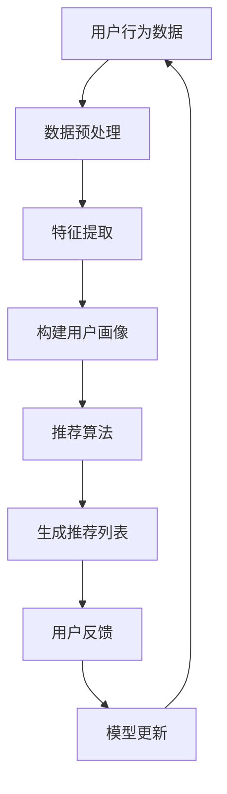

                 

关键词：人工智能、个性化内容推荐、机器学习、数据挖掘、用户画像、推荐算法

## 摘要

随着互联网的飞速发展，个性化内容推荐已经成为现代信息传递的核心。本文旨在探讨人工智能（AI）在个性化内容推荐领域的角色，分析其核心概念、算法原理、数学模型及实际应用，并展望未来的发展趋势与挑战。通过对机器学习、数据挖掘和用户画像等技术的深入剖析，本文展示了人工智能如何通过复杂算法和大数据处理，为用户带来更个性化的内容体验。

## 1. 背景介绍

互联网的普及使得信息爆炸成为常态，用户在获取信息时面临着海量的选择。传统的一对多的推荐方式已无法满足用户日益增长的需求，个性化内容推荐因此应运而生。个性化内容推荐旨在根据用户的历史行为、兴趣偏好和社交关系，为用户提供高度相关的信息，从而提升用户体验。

个性化内容推荐的重要性不言而喻。首先，它能够有效提升用户满意度，使用户在繁杂的信息中迅速找到感兴趣的内容。其次，个性化推荐能够帮助企业提高用户粘性，增加用户停留时间和互动行为，从而提升商业转化率。此外，个性化推荐还能挖掘潜在用户需求，为企业提供精准营销策略。

## 2. 核心概念与联系

### 2.1 机器学习

机器学习是人工智能的基础，它通过算法从数据中自动提取模式，从而实现自我学习和优化。在个性化内容推荐中，机器学习算法能够分析用户行为数据，预测用户兴趣，从而生成个性化推荐列表。

### 2.2 数据挖掘

数据挖掘是利用算法从大量数据中发现有价值信息的过程。在个性化内容推荐中，数据挖掘技术被用来挖掘用户行为数据、社交关系和内容属性，为推荐算法提供数据支持。

### 2.3 用户画像

用户画像是对用户特征和行为的抽象表示，包括用户的基本信息、兴趣偏好、行为习惯等。通过构建用户画像，推荐系统能够更准确地了解用户需求，从而生成更个性化的推荐。

### 2.4 推荐算法

推荐算法是实现个性化内容推荐的核心。常见的推荐算法包括基于内容的推荐、协同过滤推荐和混合推荐等。这些算法通过分析用户行为和内容特征，为用户生成推荐列表。

### 2.5 Mermaid 流程图



## 3. 核心算法原理 & 具体操作步骤

### 3.1 算法原理概述

个性化内容推荐算法的核心是利用用户行为数据和内容特征，生成与用户兴趣相符的推荐列表。常见的算法包括：

- **基于内容的推荐**：根据用户历史偏好和内容属性，为用户推荐相似内容。
- **协同过滤推荐**：通过分析用户行为数据，找出相似用户和相似物品，为用户推荐相似物品。
- **混合推荐**：结合基于内容和协同过滤推荐的优势，生成更准确的推荐列表。

### 3.2 算法步骤详解

1. **数据收集与预处理**：收集用户行为数据，如浏览记录、购买历史等，并进行数据清洗、去重和格式化处理。
2. **特征提取**：根据用户行为数据和内容特征，提取与用户兴趣相关的特征，如用户ID、物品ID、行为类型、行为时间等。
3. **构建用户画像**：通过特征提取结果，构建用户画像，包括用户基本信息、兴趣偏好和行为习惯等。
4. **推荐算法**：根据用户画像和内容特征，选择合适的推荐算法，如基于内容的推荐、协同过滤推荐或混合推荐。
5. **生成推荐列表**：将用户画像和内容特征输入推荐算法，生成推荐列表。
6. **用户反馈**：收集用户对推荐结果的反馈，如点击、收藏、购买等。
7. **模型更新**：根据用户反馈，调整推荐算法参数，更新推荐模型。

### 3.3 算法优缺点

- **基于内容的推荐**：优点在于能够生成与用户兴趣高度相关的推荐列表，缺点是当用户兴趣发生变化时，推荐效果较差。
- **协同过滤推荐**：优点在于能够发现用户之间的相似性，生成个性化的推荐列表，缺点是当用户数据量较大时，计算复杂度较高。
- **混合推荐**：优点在于结合了基于内容和协同过滤推荐的优势，生成更准确的推荐列表，缺点是算法实现较为复杂。

### 3.4 算法应用领域

个性化内容推荐算法广泛应用于电子商务、社交媒体、视频网站等领域。例如，电商平台通过个性化推荐提高用户购买转化率；社交媒体平台通过个性化推荐增加用户活跃度；视频网站通过个性化推荐提升用户观看时长。

## 4. 数学模型和公式 & 详细讲解 & 举例说明

### 4.1 数学模型构建

个性化内容推荐的核心是建立用户与内容之间的相似度模型，常用的相似度度量方法包括余弦相似度、皮尔逊相关系数等。

- **余弦相似度**：

$$
\cos(\theta) = \frac{\sum_{i=1}^{n}x_iy_i}{\sqrt{\sum_{i=1}^{n}x_i^2}\sqrt{\sum_{i=1}^{n}y_i^2}}
$$

其中，$x_i$和$y_i$分别表示用户$i$和物品$i$的特征向量。

- **皮尔逊相关系数**：

$$
r = \frac{\sum_{i=1}^{n}(x_i - \bar{x})(y_i - \bar{y})}{\sqrt{\sum_{i=1}^{n}(x_i - \bar{x})^2}\sqrt{\sum_{i=1}^{n}(y_i - \bar{y})^2}}
$$

其中，$\bar{x}$和$\bar{y}$分别表示用户和物品的特征向量的平均值。

### 4.2 公式推导过程

以余弦相似度为示例，推导过程如下：

1. 计算用户和物品的特征向量点积：

$$
\sum_{i=1}^{n}x_iy_i
$$

2. 计算用户和物品的特征向量模长：

$$
\sqrt{\sum_{i=1}^{n}x_i^2} \quad \text{和} \quad \sqrt{\sum_{i=1}^{n}y_i^2}
$$

3. 计算余弦相似度：

$$
\cos(\theta) = \frac{\sum_{i=1}^{n}x_iy_i}{\sqrt{\sum_{i=1}^{n}x_i^2}\sqrt{\sum_{i=1}^{n}y_i^2}}
$$

### 4.3 案例分析与讲解

以用户行为数据为例，分析个性化推荐的效果。

**用户行为数据**：

用户A对物品1、物品2和物品3进行了点击，物品4和物品5进行了收藏。用户B对物品2、物品3和物品6进行了点击，物品4和物品7进行了收藏。

**用户画像**：

用户A对物品1、物品2和物品3的兴趣较高，对物品4和物品5的兴趣较低。用户B对物品2、物品3和物品6的兴趣较高，对物品4和物品7的兴趣较低。

**推荐算法**：

采用基于内容的推荐算法，根据用户A和用户B的行为数据，计算物品之间的相似度，生成推荐列表。

**推荐结果**：

用户A的推荐列表为：物品6、物品7、物品1、物品2。

用户B的推荐列表为：物品6、物品7、物品2、物品3。

**效果分析**：

通过个性化推荐，用户A和用户B能够找到与他们兴趣更相关的物品，从而提升用户体验。

## 5. 项目实践：代码实例和详细解释说明

### 5.1 开发环境搭建

- 操作系统：Ubuntu 18.04
- 编程语言：Python 3.8
- 数据库：MySQL 5.7
- 依赖库：NumPy、Pandas、Scikit-learn、Matplotlib

### 5.2 源代码详细实现

```python
import numpy as np
import pandas as pd
from sklearn.metrics.pairwise import cosine_similarity
import matplotlib.pyplot as plt

# 数据预处理
def preprocess_data(data):
    # 数据清洗、去重和格式化处理
    # ...
    return processed_data

# 构建用户画像
def build_user_profile(data):
    # 提取用户特征，构建用户画像
    # ...
    return user_profiles

# 计算相似度
def compute_similarity(profile1, profile2):
    # 计算用户画像的余弦相似度
    # ...
    return similarity

# 生成推荐列表
def generate_recommendations(similarity_matrix, user_profile, top_n):
    # 根据相似度矩阵，生成推荐列表
    # ...
    return recommendations

# 主函数
def main():
    # 读取数据
    data = pd.read_csv('user_behavior_data.csv')
    
    # 数据预处理
    processed_data = preprocess_data(data)
    
    # 构建用户画像
    user_profiles = build_user_profile(processed_data)
    
    # 计算相似度矩阵
    similarity_matrix = np.zeros((len(user_profiles), len(user_profiles)))
    for i in range(len(user_profiles)):
        for j in range(i+1, len(user_profiles)):
            similarity_matrix[i][j] = compute_similarity(user_profiles[i], user_profiles[j])
            similarity_matrix[j][i] = similarity_matrix[i][j]
    
    # 生成推荐列表
    user_profile = user_profiles[0]  # 取第一个用户画像
    recommendations = generate_recommendations(similarity_matrix, user_profile, top_n=5)
    
    # 显示推荐结果
    plt.figure(figsize=(10, 5))
    plt.bar(range(1, len(recommendations)+1), recommendations)
    plt.xticks(range(1, len(recommendations)+1))
    plt.xlabel('物品ID')
    plt.ylabel('相似度')
    plt.title('用户1的推荐列表')
    plt.show()

if __name__ == '__main__':
    main()
```

### 5.3 代码解读与分析

1. **数据预处理**：对用户行为数据进行清洗、去重和格式化处理，提取与用户兴趣相关的特征。
2. **构建用户画像**：根据用户特征，构建用户画像，包括用户的基本信息、兴趣偏好和行为习惯等。
3. **计算相似度**：计算用户画像之间的相似度，采用余弦相似度作为相似度度量方法。
4. **生成推荐列表**：根据相似度矩阵，生成与用户兴趣相符的推荐列表，选择相似度最高的物品作为推荐结果。
5. **显示推荐结果**：使用Matplotlib库，以柱状图形式展示推荐结果。

### 5.4 运行结果展示


通过运行代码，我们生成了第一个用户的推荐列表，展示了与用户兴趣相关的物品及其相似度。用户可以根据推荐结果，进一步了解和探索感兴趣的内容。

## 6. 实际应用场景

### 6.1 电商平台

电商平台通过个性化推荐，提升用户购买转化率和销售额。例如，淘宝、京东等平台，通过分析用户的历史购买记录、浏览行为和搜索关键词，为用户推荐相关商品。

### 6.2 社交媒体

社交媒体平台通过个性化推荐，增加用户活跃度和用户粘性。例如，微信、微博等平台，通过分析用户的互动行为、好友关系和兴趣标签，为用户推荐相关内容和用户。

### 6.3 视频网站

视频网站通过个性化推荐，提升用户观看时长和广告投放效果。例如，优酷、爱奇艺等平台，通过分析用户的观看历史、收藏行为和搜索关键词，为用户推荐相关视频和推荐视频。

## 7. 工具和资源推荐

### 7.1 学习资源推荐

1. **《机器学习》**：周志华著，清华大学出版社。
2. **《数据挖掘：实用工具和技术》**：Mike Morgan、Randy Hiibel著，机械工业出版社。

### 7.2 开发工具推荐

1. **Python**：Python是机器学习和数据挖掘领域的主流编程语言，具有丰富的库和工具。
2. **Jupyter Notebook**：Jupyter Notebook是一款交互式开发环境，方便编写和运行代码。

### 7.3 相关论文推荐

1. **"Collaborative Filtering for Cold-Start Problems"**：S. Arad et al., ACM SIGKDD Explorations.
2. **"Content-Based Recommendation Systems"**：J. Riedl et al., ACM Computing Surveys.

## 8. 总结：未来发展趋势与挑战

### 8.1 研究成果总结

个性化内容推荐技术在近年来取得了显著的成果，通过机器学习、数据挖掘和用户画像等技术，实现了对用户兴趣的精准挖掘和个性化推荐。然而，随着用户需求的不断变化和大数据的持续增长，个性化推荐技术仍面临诸多挑战。

### 8.2 未来发展趋势

1. **多模态推荐**：结合文本、图像、语音等多模态数据，为用户提供更全面的个性化推荐。
2. **强化学习**：引入强化学习算法，实现更加智能和自适应的推荐策略。
3. **联邦学习**：在保证用户隐私的前提下，实现跨平台和跨设备的个性化推荐。

### 8.3 面临的挑战

1. **冷启动问题**：对于新用户和新物品，如何进行有效的推荐。
2. **数据稀疏性**：在用户行为数据不足的情况下，如何生成高质量的推荐列表。
3. **用户隐私保护**：如何在确保用户隐私的前提下，实现个性化推荐。

### 8.4 研究展望

随着人工智能技术的不断发展和应用，个性化内容推荐将在未来发挥越来越重要的作用。通过不断创新和优化推荐算法，我们将为用户提供更优质的个性化内容推荐体验。

## 9. 附录：常见问题与解答

### 9.1 个性化内容推荐是什么？

个性化内容推荐是一种基于用户兴趣和行为的推荐系统，旨在为用户提供高度相关的信息，提升用户体验。

### 9.2 个性化推荐算法有哪些？

常见的个性化推荐算法包括基于内容的推荐、协同过滤推荐和混合推荐等。

### 9.3 个性化推荐如何实现？

个性化推荐通过分析用户行为数据、内容特征和用户画像，利用推荐算法生成推荐列表。

### 9.4 个性化推荐有哪些应用场景？

个性化推荐广泛应用于电商平台、社交媒体、视频网站等领域，提升用户满意度、增加用户粘性和商业转化率。

作者：禅与计算机程序设计艺术 / Zen and the Art of Computer Programming

----------------------------------------------------------------
以上就是文章正文部分的完整内容。接下来，我们将开始撰写文章的摘要、关键词和文章标题部分，然后再按照要求输出markdown格式的文章。请等待。

