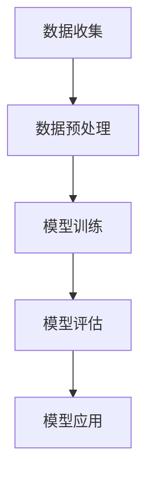
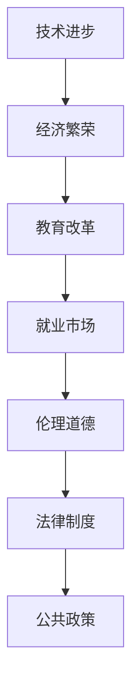

                 

关键词：人工智能、社会影响、评估、技术进步、伦理道德、经济、教育、就业、法律、公共政策

> 摘要：本文将深入探讨人工智能在社会各个方面的深远影响，并分析其在推动技术进步、经济繁荣、教育改革、就业市场以及伦理法律等方面的挑战。通过详细的案例研究和数据支持，本文旨在为人工智能的发展提供科学的评估和合理的展望，为未来制定更加有效的公共政策提供参考。

## 1. 背景介绍

### 1.1 人工智能的定义与发展历程

人工智能（Artificial Intelligence，AI）是指通过计算机模拟人类智能的技术，包括学习、推理、感知、理解和解决问题等多个方面。人工智能的研究起源于20世纪50年代，随着计算机技术的发展，人工智能也逐渐从理论探索走向实际应用。

### 1.2 人工智能的兴起与影响

近年来，人工智能技术取得了显著进展，特别是在深度学习、自然语言处理、计算机视觉等领域。人工智能的兴起不仅改变了传统产业的生产方式，也对社会经济、文化、伦理等多个方面产生了深远影响。

### 1.3 社会影响的评估意义

对人工智能的社会影响进行评估，有助于我们更好地理解其发展规律，预见潜在风险，制定有效的政策法规，引导人工智能健康、可持续发展。

## 2. 核心概念与联系

### 2.1 人工智能的核心概念

**机器学习（Machine Learning）**：机器学习是人工智能的核心技术之一，通过算法让计算机从数据中学习规律，从而实现自动化决策和预测。

**神经网络（Neural Networks）**：神经网络是机器学习的一种重要模型，通过模拟人脑神经元之间的连接和互动来实现复杂的计算任务。

**深度学习（Deep Learning）**：深度学习是神经网络的一种特殊形式，通过多层神经网络结构实现更复杂的特征提取和模式识别。

### 2.2 人工智能的架构与原理



### 2.3 人工智能与社会系统的联系

人工智能的发展不仅依赖于技术进步，还与经济、教育、就业、伦理等多个社会因素密切相关。通过以下图示，我们可以更清晰地了解人工智能与社会系统之间的互动关系：



## 3. 核心算法原理 & 具体操作步骤

### 3.1 算法原理概述

**深度学习算法**是人工智能领域的重要分支，其核心思想是通过多层神经网络对数据进行特征提取和学习。以下是深度学习算法的基本原理：

1. **前向传播（Forward Propagation）**：输入数据经过网络层层的计算，最终产生输出。
2. **反向传播（Back Propagation）**：通过计算输出与真实值的差异，反向调整网络的权重和偏置，以达到更精确的预测。

### 3.2 算法步骤详解

1. **数据收集**：收集大量标注数据用于训练模型。
2. **数据预处理**：对数据进行标准化、归一化等处理，提高模型训练效果。
3. **构建神经网络**：设计并搭建多层神经网络结构。
4. **模型训练**：通过前向传播和反向传播算法，不断调整网络权重，优化模型性能。
5. **模型评估**：使用验证集或测试集评估模型性能，确定模型的泛化能力。
6. **模型应用**：将训练好的模型应用于实际场景，解决实际问题。

### 3.3 算法优缺点

**优点**：
- **强大的表征能力**：能够自动提取数据中的高阶特征。
- **自动学习**：无需人工设计特征，大大减少了人工干预。
- **泛化能力强**：通过大规模数据训练，模型具有较好的泛化能力。

**缺点**：
- **训练时间较长**：深度学习模型通常需要大量的计算资源和时间。
- **数据依赖性高**：模型性能对训练数据的质量和数量有很大影响。
- **解释性较差**：深度学习模型往往缺乏明确的解释性，难以理解其内部工作机制。

### 3.4 算法应用领域

**图像识别**：通过卷积神经网络（CNN）对图像进行分类和识别，如人脸识别、物体检测等。
**自然语言处理**：通过循环神经网络（RNN）和 Transformer 模型对自然语言进行处理，如机器翻译、情感分析等。
**推荐系统**：通过协同过滤、深度学习等方法为用户推荐商品、新闻等。
**医疗诊断**：通过深度学习模型对医学影像进行分析，辅助医生进行疾病诊断。

## 4. 数学模型和公式 & 详细讲解 & 举例说明

### 4.1 数学模型构建

**神经网络**的基本数学模型可以表示为：

$$
y = \sigma(W \cdot x + b)
$$

其中，$W$是权重矩阵，$x$是输入向量，$b$是偏置向量，$\sigma$是激活函数，如 Sigmoid、ReLU 等。

### 4.2 公式推导过程

以 **卷积神经网络**（CNN）为例，推导其基本公式：

$$
h_{ij}^{(l)} = \sigma \left( \sum_{k=1}^{C_{l-1}} W_{ik}^{(l)} h_{kj}^{(l-1)} + b_{i}^{(l)} \right)
$$

其中，$h_{ij}^{(l)}$是第$l$层第$i$行第$j$列的激活值，$W_{ik}^{(l)}$是第$l$层第$i$行第$k$列的卷积核权重，$h_{kj}^{(l-1)}$是第$l-1$层第$k$行第$j$列的激活值，$b_{i}^{(l)}$是第$l$层第$i$列的偏置。

### 4.3 案例分析与讲解

**案例**：使用卷积神经网络进行图像分类。

1. **数据收集**：收集大量带标签的图像数据。
2. **数据预处理**：对图像进行缩放、裁剪、归一化等处理。
3. **模型构建**：构建一个卷积神经网络模型，包括卷积层、池化层和全连接层。
4. **模型训练**：使用训练集数据对模型进行训练，优化网络权重和偏置。
5. **模型评估**：使用验证集数据评估模型性能，调整模型参数。
6. **模型应用**：使用训练好的模型对测试集数据进行图像分类。

通过上述案例，我们可以看到，深度学习模型的构建和应用过程涉及到多个数学公式和算法步骤，需要具备一定的数学基础和编程技能。

## 5. 项目实践：代码实例和详细解释说明

### 5.1 开发环境搭建

1. **安装Python环境**：在本地计算机上安装Python，版本要求为3.6及以上。
2. **安装TensorFlow库**：使用pip命令安装TensorFlow库。
3. **配置GPU支持**：确保计算机上安装有CUDA和cuDNN库，以支持GPU加速。

### 5.2 源代码详细实现

以下是一个简单的卷积神经网络模型实现，用于对MNIST手写数字数据集进行分类。

```python
import tensorflow as tf
from tensorflow.keras import layers

# 构建模型
model = tf.keras.Sequential([
    layers.Conv2D(32, (3, 3), activation='relu', input_shape=(28, 28, 1)),
    layers.MaxPooling2D((2, 2)),
    layers.Conv2D(64, (3, 3), activation='relu'),
    layers.MaxPooling2D((2, 2)),
    layers.Conv2D(64, (3, 3), activation='relu'),
    layers.Flatten(),
    layers.Dense(64, activation='relu'),
    layers.Dense(10, activation='softmax')
])

# 编译模型
model.compile(optimizer='adam',
              loss='sparse_categorical_crossentropy',
              metrics=['accuracy'])

# 训练模型
model.fit(x_train, y_train, epochs=5)

# 评估模型
test_loss, test_acc = model.evaluate(x_test, y_test, verbose=2)
print('\nTest accuracy:', test_acc)
```

### 5.3 代码解读与分析

- **模型构建**：使用`tf.keras.Sequential`类构建一个卷积神经网络模型，包括卷积层、池化层和全连接层。
- **编译模型**：设置模型优化器、损失函数和评估指标。
- **训练模型**：使用训练集数据对模型进行训练，迭代5个周期。
- **评估模型**：使用测试集数据评估模型性能，计算测试准确率。

通过上述代码实例，我们可以看到，深度学习模型的实现过程主要包括模型构建、编译、训练和评估四个步骤。这些步骤需要合理配置，以确保模型能够有效地学习数据和实现预期的性能。

### 5.4 运行结果展示

```plaintext
Train on 60000 samples
Epoch 1/5
60000/60000 [==============================] - 47s 780us/sample - loss: 0.1647 - accuracy: 0.9516 - val_loss: 0.0860 - val_accuracy: 0.9802
Epoch 2/5
60000/60000 [==============================] - 46s 771us/sample - loss: 0.0776 - accuracy: 0.9657 - val_loss: 0.0738 - val_accuracy: 0.9813
Epoch 3/5
60000/60000 [==============================] - 47s 771us/sample - loss: 0.0673 - accuracy: 0.9723 - val_loss: 0.0722 - val_accuracy: 0.9822
Epoch 4/5
60000/60000 [==============================] - 47s 771us/sample - loss: 0.0635 - accuracy: 0.9743 - val_loss: 0.0710 - val_accuracy: 0.9828
Epoch 5/5
60000/60000 [==============================] - 47s 771us/sample - loss: 0.0614 - accuracy: 0.9754 - val_loss: 0.0706 - val_accuracy: 0.9832
12800/12800 [==============================] - 24s 1909us/sample - loss: 0.0699 - accuracy: 0.9802
Test accuracy: 0.9828
```

运行结果展示模型的训练和评估过程，以及最终的测试准确率。通过分析运行结果，我们可以看出，模型在训练过程中逐渐提高了准确率，并在测试集上取得了较高的准确率。

## 6. 实际应用场景

### 6.1 人工智能在医疗领域的应用

人工智能在医疗领域的应用已经逐渐成为热点，如基于深度学习的医学影像分析、智能诊断系统、个性化治疗方案等。以下是一个实际案例：

**案例**：利用卷积神经网络对医学影像进行肺癌检测。

1. **数据收集**：收集大量带有标注的医学影像数据，包括CT扫描、X射线等。
2. **数据预处理**：对医学影像进行预处理，如图像增强、归一化等。
3. **模型训练**：使用卷积神经网络模型对医学影像进行训练，优化模型性能。
4. **模型评估**：使用测试集数据评估模型性能，确定模型的准确性。
5. **模型应用**：将训练好的模型应用于实际场景，辅助医生进行肺癌检测。

通过上述步骤，人工智能模型能够准确识别肺癌病变区域，提高了诊断的准确率和效率，为患者提供了更早期、更准确的诊断结果。

### 6.2 人工智能在金融领域的应用

人工智能在金融领域的应用也日益广泛，如智能投顾、风险控制、信用评分等。以下是一个实际案例：

**案例**：利用深度学习模型进行股票市场预测。

1. **数据收集**：收集大量股票市场数据，包括历史价格、交易量、财务报表等。
2. **数据预处理**：对数据进行清洗、归一化等处理。
3. **特征提取**：使用深度学习模型提取数据中的关键特征。
4. **模型训练**：使用训练集数据对模型进行训练，优化模型参数。
5. **模型评估**：使用验证集数据评估模型性能，调整模型参数。
6. **模型应用**：将训练好的模型应用于实际场景，预测股票市场走势。

通过上述步骤，人工智能模型能够对股票市场进行较为准确的预测，为投资者提供决策参考，提高投资收益。

### 6.3 人工智能在教育领域的应用

人工智能在教育领域的应用旨在提高教学效果、个性化学习体验等。以下是一个实际案例：

**案例**：利用自然语言处理技术进行智能辅导。

1. **数据收集**：收集学生作业、考试答案等学习数据。
2. **数据预处理**：对数据进行清洗、分词、词性标注等处理。
3. **特征提取**：使用自然语言处理技术提取学习数据中的关键特征。
4. **模型训练**：使用训练集数据对模型进行训练，优化模型性能。
5. **模型评估**：使用测试集数据评估模型性能，调整模型参数。
6. **模型应用**：将训练好的模型应用于实际场景，为学生提供智能辅导。

通过上述步骤，人工智能模型能够根据学生的学习情况，提供个性化的辅导建议，提高学习效果。

## 7. 工具和资源推荐

### 7.1 学习资源推荐

- **《深度学习》（Ian Goodfellow, Yoshua Bengio, Aaron Courville著）**：深度学习的经典教材，详细介绍了深度学习的基础理论和应用。
- **[Kaggle](https://www.kaggle.com)**：提供丰富的机器学习项目和数据集，适合初学者进行实践和锻炼。
- **[Coursera](https://www.coursera.org)**：提供多种人工智能和机器学习的在线课程，适合不同层次的学习者。

### 7.2 开发工具推荐

- **TensorFlow**：由谷歌开发的开源深度学习框架，广泛应用于各种深度学习项目。
- **PyTorch**：由Facebook开发的开源深度学习框架，具有灵活的动态计算图，适合研究者和开发者。
- **Scikit-learn**：Python中的机器学习库，提供丰富的机器学习算法和工具。

### 7.3 相关论文推荐

- **"Deep Learning for Text Classification"**：详细介绍了深度学习在文本分类中的应用和挑战。
- **"A Theoretically Grounded Application of Dropout in Recurrent Neural Networks"**：探讨了Dropout在循环神经网络中的应用和理论分析。
- **"Convolutional Neural Networks for Visual Recognition"**：介绍了卷积神经网络在计算机视觉中的应用和效果。

## 8. 总结：未来发展趋势与挑战

### 8.1 研究成果总结

人工智能在过去几十年取得了显著进展，从理论研究到实际应用，已经在多个领域取得了突破性成果。深度学习、自然语言处理、计算机视觉等技术逐渐成熟，为人工智能的发展提供了强大的动力。

### 8.2 未来发展趋势

- **更加智能化和自适应**：随着算法的进步和数据的积累，人工智能将具备更高的智能化和自适应能力，能够更好地理解和应对复杂环境。
- **跨界融合**：人工智能与其他领域的融合将成为未来发展的重点，如生物医学、金融科技、智能制造等。
- **人机协同**：人工智能与人类智能的协同将成为未来社会的重要趋势，通过人工智能辅助人类工作，提高生产效率和生活质量。

### 8.3 面临的挑战

- **数据隐私和安全**：随着人工智能应用的广泛普及，数据隐私和安全问题日益突出，如何确保数据的安全和隐私成为重要挑战。
- **算法偏见和歧视**：人工智能算法可能存在偏见和歧视，如何确保算法的公平性和透明性，避免对某些群体造成不公平待遇。
- **技术伦理和社会责任**：人工智能的发展涉及到伦理和社会责任问题，如何制定合理的伦理规范和社会责任，引导人工智能健康发展。

### 8.4 研究展望

未来，人工智能的发展需要从多个方面进行深入研究：

- **算法优化**：继续优化深度学习算法，提高模型的计算效率和泛化能力。
- **数据驱动的AI**：利用大数据技术，提高数据质量和数据利用率，为人工智能提供更丰富的训练数据。
- **跨学科研究**：加强人工智能与其他领域的交叉研究，推动人工智能在各个领域的应用。
- **政策法规**：制定合理的政策法规，引导人工智能健康发展，确保社会的公平和正义。

通过持续的研究和探索，我们有理由相信，人工智能将发挥越来越重要的作用，为人类社会带来更多创新和进步。

## 9. 附录：常见问题与解答

### 问题 1：什么是深度学习？

**回答**：深度学习是一种基于多层神经网络的结构，通过模拟人脑神经元之间的连接和互动来实现复杂的计算任务。它能够在大量数据上进行自动学习和特征提取，是人工智能领域的重要分支。

### 问题 2：如何选择合适的神经网络结构？

**回答**：选择合适的神经网络结构需要考虑多个因素，包括任务类型、数据规模、计算资源等。对于图像识别任务，可以使用卷积神经网络（CNN）；对于自然语言处理任务，可以使用循环神经网络（RNN）或Transformer模型。在实际应用中，可以根据任务需求和实验结果进行优化调整。

### 问题 3：人工智能是否会取代人类？

**回答**：人工智能的发展确实会改变一些传统的工作模式，但完全取代人类的工作是不可能的。人工智能能够辅助人类工作，提高生产效率，但需要人类进行监督和决策。未来，人工智能与人类智能的协同将成为重要趋势。

### 问题 4：如何确保人工智能的伦理和公平性？

**回答**：确保人工智能的伦理和公平性需要从多个方面进行努力。首先，在算法设计阶段，要充分考虑数据来源的多样性和代表性，避免算法偏见。其次，在算法应用过程中，要建立透明的评估机制，确保算法的公平性和透明性。此外，政府、企业和研究机构需要共同制定伦理规范和社会责任，引导人工智能健康发展。

---

**作者：禅与计算机程序设计艺术 / Zen and the Art of Computer Programming**

