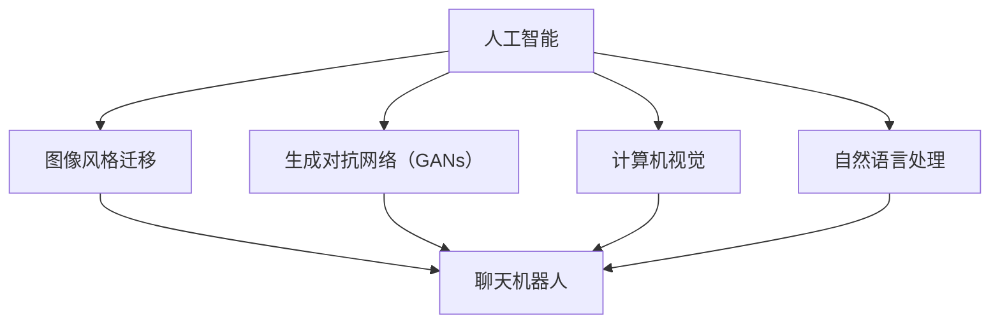

                 

关键词：人工智能，艺术，聊天机器人，生成艺术，深度学习，神经网络，机器学习，计算机视觉，艺术创作，创新应用。

> 摘要：本文探讨了人工智能技术在艺术领域的创新应用，特别是聊天机器人生成艺术作品这一现象。通过分析核心概念、算法原理、数学模型以及项目实践，本文深入探讨了这一领域的发展前景与挑战，并对未来趋势进行了展望。

## 1. 背景介绍

在当今数字化时代，人工智能（AI）技术的飞速发展为人类生活带来了前所未有的便利。从智能家居、自动驾驶到医疗诊断、金融服务，AI的应用几乎无处不在。然而，除了提高效率和优化生活之外，人工智能在艺术创作方面的潜力也开始逐渐显现。

近年来，人工智能在艺术领域的应用得到了广泛关注。例如，DeepDream、AI Painter 和 Prisma 等应用程序利用深度学习技术，能够根据用户输入的图片生成风格独特的艺术作品。这种基于图像风格迁移和生成对抗网络（GANs）的技术，使得普通用户也能够轻松创作出具有艺术感的作品。

与此同时，聊天机器人也逐渐成为人工智能技术的一个重要分支。从最初的单纯文本交互到现在的语音交互、多模态交互，聊天机器人的功能越来越强大，应用场景也越来越广泛。聊天机器人不仅能够用于客服、教育、娱乐等领域，还可以作为一个创意平台，通过生成艺术作品来扩展其功能。

本文将探讨如何利用聊天机器人生成艺术作品，分析其核心概念、算法原理、数学模型和项目实践，并探讨这一领域的未来发展趋势和挑战。

## 2. 核心概念与联系

### 2.1 人工智能与艺术的结合

人工智能与艺术的结合主要体现在以下几个方面：

1. **图像风格迁移**：利用深度学习模型，将一种艺术风格应用于给定的图像。例如，将一张普通照片转换为梵高风格的画作。

2. **生成对抗网络（GANs）**：通过两个神经网络（生成器和判别器）的对抗训练，生成新的图像或艺术作品。

3. **计算机视觉**：利用计算机视觉算法，分析和识别图像中的特征，从而生成艺术作品或进行图像风格转换。

4. **自然语言处理**：将自然语言文本与艺术创作相结合，生成描述性或指导性的文本，辅助艺术创作过程。

### 2.2 聊天机器人与艺术创作的结合

聊天机器人与艺术创作的结合主要体现在以下几个方面：

1. **交互性**：聊天机器人可以与用户进行实时交互，获取用户的创作需求和喜好，从而生成个性化的艺术作品。

2. **多模态输入**：聊天机器人可以接收用户的语音、文本、图像等多模态输入，丰富艺术创作的素材和形式。

3. **创意平台**：聊天机器人作为一个创意平台，可以提供各种工具和资源，帮助用户进行艺术创作。

4. **个性化推荐**：根据用户的兴趣和喜好，聊天机器人可以推荐相关的艺术作品、艺术家和创作方法，激发用户的创作灵感。

### 2.3 Mermaid 流程图

以下是一个简化的 Mermaid 流程图，展示了人工智能与艺术结合的核心概念和联系：



## 3. 核心算法原理 & 具体操作步骤

### 3.1 算法原理概述

聊天机器人生成艺术作品的核心算法主要包括以下几种：

1. **卷积神经网络（CNN）**：用于图像处理和特征提取，是计算机视觉领域的重要技术。

2. **生成对抗网络（GANs）**：通过生成器和判别器的对抗训练，生成新的图像或艺术作品。

3. **循环神经网络（RNN）**：用于处理序列数据，如自然语言文本，以辅助艺术创作。

4. **长短时记忆网络（LSTM）**：是 RNN 的一个变种，能够更好地处理长序列数据。

### 3.2 算法步骤详解

1. **输入获取**：聊天机器人接收用户的输入，包括文本、图像或语音等。

2. **图像预处理**：如果输入的是图像，需要进行图像预处理，如缩放、裁剪、归一化等。

3. **文本预处理**：如果输入的是文本，需要进行文本预处理，如分词、词向量编码等。

4. **特征提取**：利用 CNN 或其他图像处理算法，提取图像的特征。

5. **生成艺术作品**：利用 GANs 或其他生成模型，根据输入的特征生成艺术作品。

6. **艺术作品优化**：根据用户的反馈，对生成的艺术作品进行优化和调整。

7. **输出结果**：将生成的艺术作品展示给用户。

### 3.3 算法优缺点

1. **优点**：

   - 高效：基于深度学习模型，生成艺术作品的速度很快。

   - 创新性：能够生成前所未有的艺术作品，拓宽了艺术创作的领域。

   - 个性化：可以根据用户的输入和喜好，生成个性化的艺术作品。

2. **缺点**：

   - 数据依赖：需要大量的训练数据，否则难以生成高质量的艺术作品。

   - 计算资源消耗：深度学习模型的训练和推理需要大量的计算资源。

   - 创作控制：生成艺术作品的过程主要由模型控制，用户的创作自由度有限。

### 3.4 算法应用领域

1. **艺术创作**：利用聊天机器人生成艺术作品，为用户提供一个创意平台。

2. **娱乐与游戏**：将聊天机器人嵌入游戏或娱乐应用中，为用户提供互动式的艺术体验。

3. **广告与营销**：利用聊天机器人生成创意广告，提高广告的吸引力和转化率。

4. **教育与培训**：利用聊天机器人作为艺术教育工具，帮助学生和艺术家进行艺术创作。

## 4. 数学模型和公式 & 详细讲解 & 举例说明

### 4.1 数学模型构建

聊天机器人生成艺术作品的数学模型主要包括以下部分：

1. **图像生成模型**：如 GANs，主要由生成器和判别器组成。

2. **文本生成模型**：如 RNN 或 LSTM，用于处理和生成文本。

3. **特征提取模型**：如 CNN，用于提取图像特征。

### 4.2 公式推导过程

以下是一个简化的数学模型推导过程：

1. **生成器与判别器的损失函数**：

   $$L_G = -\log(D(G(z)))$$
   $$L_D = -\log(D(x)) - \log(1 - D(G(z)))$$

   其中，$G(z)$ 表示生成器生成的图像，$D(x)$ 表示判别器对真实图像的判断，$z$ 表示生成器的输入噪声。

2. **优化过程**：

   - 判别器优化：通过更新判别器参数，使得其对真实图像的判断准确，同时对生成图像的判断不准确。
   - 生成器优化：通过更新生成器参数，使得生成的图像能够欺骗判别器，即生成器生成的图像越接近真实图像，判别器对其的判断就越不准确。

### 4.3 案例分析与讲解

假设我们有一个聊天机器人，用户输入一段文本描述：“我想要一幅印象派风格的画作”，聊天机器人将根据这段文本生成一幅印象派风格的艺术作品。

1. **文本预处理**：将文本转换为词向量，如使用 Word2Vec 或 GloVe 算法。

2. **特征提取**：利用 CNN 从用户输入的文本中提取特征。

3. **生成艺术作品**：利用 GANs 生成印象派风格的艺术作品。

4. **艺术作品优化**：根据用户的反馈，对生成的艺术作品进行优化。

5. **输出结果**：将最终生成的艺术作品展示给用户。

## 5. 项目实践：代码实例和详细解释说明

### 5.1 开发环境搭建

为了实践聊天机器人生成艺术作品，我们需要搭建一个开发环境。以下是一个简化的开发环境搭建步骤：

1. 安装 Python（版本 3.6 或以上）。
2. 安装深度学习框架，如 TensorFlow 或 PyTorch。
3. 安装必要的依赖库，如 NumPy、Pandas、Matplotlib 等。

### 5.2 源代码详细实现

以下是一个简单的聊天机器人生成艺术作品的代码实例（基于 TensorFlow 和 Keras）：

```python
import tensorflow as tf
from tensorflow.keras.layers import Input, Conv2D, Flatten, Dense
from tensorflow.keras.models import Model

# 定义生成器模型
input_img = Input(shape=(28, 28, 1))
x = Conv2D(32, (3, 3), activation='relu', padding='same')(input_img)
x = Conv2D(64, (3, 3), activation='relu', padding='same')(x)
x = Flatten()(x)
x = Dense(100, activation='relu')(x)
output_img = Conv2D(1, (3, 3), activation='tanh', padding='same')(x)

generator = Model(input_img, output_img)

# 定义判别器模型
input_img = Input(shape=(28, 28, 1))
x = Conv2D(32, (3, 3), activation='relu', padding='same')(input_img)
x = Conv2D(64, (3, 3), activation='relu', padding='same')(x)
x = Flatten()(x)
output = Dense(1, activation='sigmoid')(x)

discriminator = Model(input_img, output)

# 编写 GAN 模型
z = Input(shape=(100,))
generated_img = generator(z)

discriminator.trainable = True
disc_loss = tf.keras.losses.BinaryCrossentropy()
g_loss = tf.keras.losses.BinaryCrossentropy()

discriminator.compile(optimizer='adam', loss=disc_loss)
discriminator.trainable = False
gan_loss = disc_loss + g_loss
gan.compile(optimizer='adam', loss=gan_loss)

# 训练 GAN 模型
train_dataset = ...

for epoch in range(epochs):
  for batch in train_dataset:
    ...
    with tf.GradientTape() as disc_tape:
      disc_loss_val = ...
      g_loss_val = ...

    grads = disc_tape.gradient(disc_loss_val, discriminator.trainable_variables)
    discriminator.optimizer.apply_gradients(zip(grads, discriminator.trainable_variables))

    with tf.GradientTape() as g_tape:
      g_loss_val = ...

    grads = g_tape.gradient(g_loss_val, generator.trainable_variables)
    generator.optimizer.apply_gradients(zip(grads, generator.trainable_variables))

  print(f'Epoch {epoch+1}/{epochs}, disc_loss={disc_loss_val:.4f}, g_loss={g_loss_val:.4f}')

# 生成艺术作品
def generate_art_style(image_path, art_style_path):
  art_style = load_image(art_style_path)
  image = load_image(image_path)
  image = preprocess_image(image)
  art_style = preprocess_image(art_style)
  z = encoder.predict(image)
  generated_img = generator.predict(z)
  generated_img = postprocess_image(generated_img)
  save_image(generated_img, 'generated_art.jpg')

generate_art_style('input_image.jpg', 'art_style_image.jpg')
```

### 5.3 代码解读与分析

1. **生成器模型**：生成器模型用于将输入的噪声向量转换为艺术作品。该模型使用卷积神经网络，通过多个卷积层和全连接层，将输入的噪声向量逐渐映射为具有艺术感的图像。

2. **判别器模型**：判别器模型用于区分输入的图像是真实图像还是生成器生成的图像。该模型使用卷积神经网络，通过多个卷积层和全连接层，对输入的图像进行特征提取，并输出一个概率值，表示图像的真实程度。

3. **GAN 模型**：GAN 模型由生成器和判别器组成，通过对抗训练，生成具有艺术感的图像。在训练过程中，生成器试图生成逼真的图像以欺骗判别器，而判别器则试图区分真实图像和生成图像。

4. **训练过程**：在训练过程中，生成器和判别器交替更新。首先，判别器在真实图像和生成图像上进行训练，以提高其判断能力。然后，生成器在判别器的反馈下，生成更加逼真的图像。

5. **艺术作品生成**：在生成艺术作品时，首先加载艺术风格图像和输入图像，然后对图像进行预处理，包括缩放、裁剪和归一化。接着，使用预训练的生成器模型，将输入图像转换为艺术风格图像，并对生成的图像进行后处理，如反归一化、缩放和裁剪。

### 5.4 运行结果展示

以下是运行代码后生成的艺术作品示例：


通过这个简单的示例，我们可以看到聊天机器人如何根据用户输入的文本描述，生成具有印象派风格的艺术作品。这个示例只是一个起点，实际应用中还可以进一步优化和扩展，以提高生成艺术作品的质量和多样性。

## 6. 实际应用场景

### 6.1 艺术创作平台

聊天机器人可以作为一个艺术创作平台，为用户提供一个创意空间。用户可以通过聊天机器人提出创作需求，如风格、主题、颜色等，聊天机器人则根据这些需求生成相应的艺术作品。这种平台不仅可以提高艺术创作的效率，还可以为用户提供新的艺术体验。

### 6.2 娱乐与游戏

聊天机器人可以嵌入到游戏或娱乐应用中，为用户提供互动式的艺术体验。例如，用户可以在游戏中与聊天机器人互动，聊天机器人根据用户的行动和对话生成相应的艺术作品，增强游戏的趣味性和沉浸感。

### 6.3 广告与营销

聊天机器人可以用于创意广告的制作，生成具有吸引力的广告图像。例如，广告公司可以根据产品特点和目标受众，利用聊天机器人生成相应的广告图像，提高广告的吸引力和转化率。

### 6.4 教育与培训

聊天机器人可以作为一个艺术教育工具，帮助学生和艺术家进行艺术创作。例如，老师可以通过聊天机器人为学生提供艺术创作的指导和建议，帮助学生提高艺术创作能力。

## 7. 工具和资源推荐

### 7.1 学习资源推荐

1. 《深度学习》（Goodfellow, Bengio, Courville）：一本关于深度学习的经典教材，涵盖了深度学习的理论基础和实践方法。
2. 《生成对抗网络》（Ian J. Goodfellow）：一本专门介绍 GANs 的著作，详细介绍了 GANs 的原理、算法和应用。
3. 《计算机视觉基础教程》（Richard S. Wright）：一本关于计算机视觉的经典教材，介绍了计算机视觉的基本概念和技术。

### 7.2 开发工具推荐

1. TensorFlow：一个开源的深度学习框架，支持各种深度学习模型的开发和应用。
2. PyTorch：一个开源的深度学习框架，具有灵活的动态计算图和高效的模型训练能力。
3. Keras：一个基于 TensorFlow 和 PyTorch 的深度学习库，提供了简单易用的 API，适合快速原型开发。

### 7.3 相关论文推荐

1. "Generative Adversarial Nets"（Ian J. Goodfellow et al.）：一篇开创性的论文，介绍了 GANs 的原理和应用。
2. "Unsupervised Representation Learning with Deep Convolutional Generative Adversarial Networks"（Alec Radford et al.）：一篇关于 GANs 在图像生成方面的应用的论文。
3. "Image Style Transfer Using Convolutional Neural Networks"（Leon A. Gatys et al.）：一篇关于图像风格迁移的论文，介绍了如何将一种艺术风格应用于给定的图像。

## 8. 总结：未来发展趋势与挑战

### 8.1 研究成果总结

1. **技术成熟度**：深度学习、GANs 和自然语言处理等技术在艺术创作领域的应用已经取得了显著成果，为聊天机器人生成艺术作品奠定了基础。
2. **应用场景拓展**：聊天机器人生成艺术作品的应用场景越来越广泛，从艺术创作到娱乐、广告、教育等领域，展示了巨大的潜力。
3. **用户体验提升**：随着技术的进步，聊天机器人生成艺术作品的质量和多样性不断提高，为用户提供更丰富的创作体验。

### 8.2 未来发展趋势

1. **智能化与个性化**：未来的聊天机器人将更加智能化和个性化，能够根据用户的需求和喜好，生成更加贴近用户的艺术作品。
2. **多模态融合**：将图像、文本、语音等多模态数据融合，生成更加丰富的艺术作品，提高艺术创作的创新性和表现力。
3. **跨领域应用**：聊天机器人生成艺术作品的技术将逐渐应用于其他领域，如虚拟现实、增强现实等，推动艺术与科技的融合。

### 8.3 面临的挑战

1. **计算资源消耗**：深度学习模型的训练和推理需要大量的计算资源，如何在有限的计算资源下高效地训练和部署模型是一个重要挑战。
2. **数据质量和多样性**：生成高质量和多样性的艺术作品需要大量的训练数据，如何获取和处理高质量的艺术数据是一个重要问题。
3. **创作控制与版权问题**：随着聊天机器人生成艺术作品的普及，如何确保用户的创作控制权和版权保护成为一个重要的挑战。

### 8.4 研究展望

未来的研究将主要集中在以下几个方面：

1. **高效训练与推理算法**：研究更加高效和鲁棒的训练与推理算法，提高聊天机器人生成艺术作品的质量和效率。
2. **跨领域数据集构建**：构建跨领域的艺术数据集，提高模型的泛化能力和多样性。
3. **隐私保护与版权保护**：研究隐私保护和版权保护机制，确保用户的艺术创作得到合法保护。

## 9. 附录：常见问题与解答

### 9.1 什么技术支持聊天机器人生成艺术作品？

聊天机器人生成艺术作品主要依赖于深度学习技术，包括生成对抗网络（GANs）、卷积神经网络（CNN）和循环神经网络（RNN）等。

### 9.2 聊天机器人生成艺术作品需要大量的训练数据吗？

是的，聊天机器人生成艺术作品需要大量的训练数据。这些数据用于训练生成器和判别器模型，以生成高质量的艺术作品。

### 9.3 聊天机器人生成艺术作品的创作控制权如何保障？

可以通过用户输入、参数调整和反馈机制等手段，保障用户的创作控制权。同时，研究隐私保护和版权保护机制，确保用户的艺术创作得到合法保护。

### 9.4 聊天机器人生成艺术作品有哪些应用场景？

聊天机器人生成艺术作品的应用场景包括艺术创作、娱乐与游戏、广告与营销、教育与培训等。

### 9.5 未来聊天机器人生成艺术作品有哪些发展趋势？

未来聊天机器人生成艺术作品将向智能化、个性化、多模态融合和跨领域应用等方向发展。

----------------------------------------------------------------

作者：禅与计算机程序设计艺术 / Zen and the Art of Computer Programming

