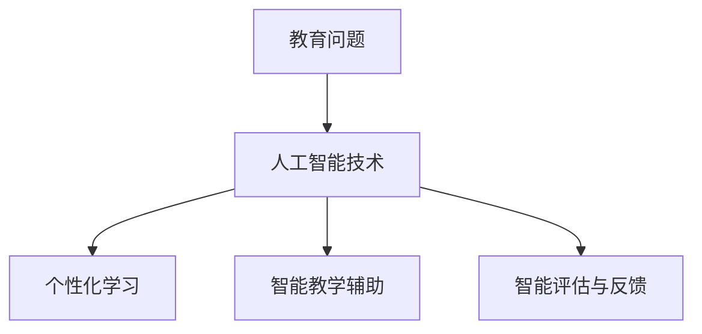

                 

关键词：人工智能，教育变革，教育技术，智能教育，教育信息化，学习分析

> 摘要：人工智能技术的迅猛发展为教育领域带来了前所未有的变革机遇。本文深入探讨了人工智能在教育中的应用，从核心概念、算法原理、数学模型到实际应用场景，全面分析了人工智能如何成为教育变革的催化剂，并展望了未来发展趋势与挑战。

## 1. 背景介绍

在过去的几十年里，教育领域一直在努力寻找方法来提升教学质量和学习效果。然而，传统的教育模式往往面临着教育资源不均、教学方式单一、学生个性化需求难以满足等问题。随着信息技术的快速发展，尤其是人工智能（Artificial Intelligence, AI）技术的突破，教育领域开始了一场前所未有的变革。

人工智能是一种模拟人类智能行为的计算机技术，它通过机器学习、深度学习、自然语言处理等技术，实现了对数据的自动分析、理解和学习。人工智能在教育领域的应用，不仅能够提高教学效率，还能为个性化学习提供可能。

### 1.1 人工智能的发展历程

人工智能的研究可以追溯到20世纪50年代，当时的主要目标是构建能够模拟人类智能的机器。经过几十年的发展，人工智能经历了几个重要阶段：

1. **符号主义阶段**（1956-1974）：这一阶段主要基于逻辑推理和符号表示，希望通过编程实现智能。

2. **感知阶段**（1974-1980）：这一阶段开始引入模式识别和机器学习技术，使机器能够通过训练来识别和处理信息。

3. **知识表示与推理阶段**（1980-1987）：这一阶段强调知识的表示和推理，尝试通过构建知识库来模拟人类思维。

4. **专家系统阶段**（1987-2012）：这一阶段利用大量数据和知识库，实现了对特定领域的智能决策。

5. **深度学习与大数据阶段**（2012至今）：这一阶段借助深度学习和大数据技术，使得人工智能取得了显著突破，尤其是在图像识别、语音识别、自然语言处理等方面。

### 1.2 教育领域面临的问题

传统的教育模式主要依赖于教师和教材，教学方式单一，难以满足学生的个性化需求。此外，教育资源的不均衡也使得教育公平成为一大挑战。这些问题促使教育领域开始寻求新的解决方案，而人工智能技术的兴起恰好为教育变革提供了契机。

## 2. 核心概念与联系

### 2.1 人工智能的核心概念

人工智能的核心概念包括机器学习、深度学习、自然语言处理等。这些概念相互联系，共同构成了人工智能的技术体系。

#### 2.1.1 机器学习

机器学习是人工智能的一个重要分支，它通过算法让计算机从数据中学习规律和模式，从而进行预测和决策。机器学习可以分为监督学习、无监督学习和半监督学习。

- **监督学习**：通过已标记的数据进行训练，如分类和回归问题。
- **无监督学习**：在没有标记的数据上进行训练，如聚类和降维。
- **半监督学习**：结合监督学习和无监督学习，利用少量标记数据和大量未标记数据。

#### 2.1.2 深度学习

深度学习是机器学习的一个子领域，它通过多层神经网络进行学习，能够自动提取数据的特征。深度学习在图像识别、语音识别和自然语言处理等领域取得了显著成果。

#### 2.1.3 自然语言处理

自然语言处理是使计算机能够理解、生成和处理自然语言的技术。它包括语音识别、文本分类、情感分析等任务。

### 2.2 人工智能在教育中的应用

#### 2.2.1 个性化学习

个性化学习是指根据学生的特点和学习需求，为其提供个性化的教学资源和学习路径。人工智能可以通过分析学生的学习行为和成绩数据，为学生推荐适合的学习内容和教学方法。

#### 2.2.2 智能教学辅助

智能教学辅助是指利用人工智能技术辅助教师进行教学，如智能批改作业、自动生成教学资源等。这样可以减轻教师的工作负担，提高教学效率。

#### 2.2.3 智能评估与反馈

智能评估与反馈是指利用人工智能技术对学生的学习过程和结果进行评估，并提供个性化的反馈。这可以帮助学生更好地了解自己的学习状况，及时调整学习策略。

### 2.3 Mermaid 流程图



## 3. 核心算法原理 & 具体操作步骤

### 3.1 算法原理概述

人工智能在教育中的应用主要依赖于机器学习和深度学习算法。以下是一些核心算法原理：

#### 3.1.1 决策树算法

决策树算法是一种基于特征值进行分类或回归的算法。它通过构建一棵树来表示数据，并在树的节点上进行特征划分。

#### 3.1.2 支持向量机（SVM）

支持向量机是一种分类算法，它通过找到一个最优的超平面来分隔不同类别的数据。

#### 3.1.3 深度神经网络

深度神经网络是一种多层神经网络，它通过多层非线性变换来提取数据的高层特征。

### 3.2 算法步骤详解

以深度神经网络为例，以下是算法的具体步骤：

1. **数据预处理**：对数据进行归一化、缺失值填充等处理。
2. **构建网络模型**：设计网络的层次结构和激活函数。
3. **训练模型**：通过反向传播算法对模型进行训练。
4. **评估模型**：通过验证集和测试集来评估模型的性能。
5. **应用模型**：将训练好的模型应用于实际问题。

### 3.3 算法优缺点

#### 优点：

- **强大的数据处理能力**：能够处理大量的数据，并从中提取有用的信息。
- **高精度**：在图像识别、语音识别等领域取得了很高的准确率。
- **自适应性强**：能够根据新的数据自动调整模型。

#### 缺点：

- **计算资源消耗大**：训练深度神经网络需要大量的计算资源和时间。
- **对数据质量要求高**：模型的性能很大程度上依赖于数据的质量。

### 3.4 算法应用领域

人工智能算法在教育中的应用领域广泛，包括：

- **个性化学习**：通过分析学生的行为数据，为学生推荐合适的学习内容。
- **智能教学辅助**：自动批改作业、生成教学资源等。
- **智能评估与反馈**：对学生学习过程和结果进行评估，并提供个性化的反馈。

## 4. 数学模型和公式 & 详细讲解 & 举例说明

### 4.1 数学模型构建

在教育领域中，数学模型主要用于分析学生的学习行为和成绩。以下是一个简单的数学模型：

$$
\text{成绩} = f(\text{学习能力}, \text{学习方法}, \text{学习环境})
$$

其中，$f$ 是一个复杂的非线性函数，代表了学习过程中各种因素的综合影响。

### 4.2 公式推导过程

为了推导这个数学模型，我们可以从以下几个方面进行分析：

1. **学习能力**：包括学生的知识储备、理解能力和解决问题的能力。
2. **学习方法**：包括学生的学习策略、习惯和技巧。
3. **学习环境**：包括教师的教学方式、教学资源和学习氛围。

通过分析这些因素，我们可以得到以下推导过程：

$$
\text{成绩} = g_1(\text{学习能力}) + g_2(\text{学习方法}) + g_3(\text{学习环境})
$$

其中，$g_1$、$g_2$ 和 $g_3$ 分别代表不同因素对成绩的贡献。

### 4.3 案例分析与讲解

以下是一个具体的案例分析：

#### 案例背景

某学生小明，他具有很强的学习能力，擅长解决问题，但学习方法较为传统，习惯于被动接受知识。他的学习环境较为安静，有足够的时间进行学习和思考。

#### 模型应用

根据上述数学模型，我们可以分析小明的成绩：

$$
\text{成绩} = g_1(\text{学习能力}) + g_2(\text{学习方法}) + g_3(\text{学习环境})
$$

其中，$g_1$、$g_2$ 和 $g_3$ 分别代表小明的学习能力、学习方法和学习环境的贡献。

由于小明的学习能力很强，$g_1$ 的值较大；而学习方法较为传统，$g_2$ 的值较小；学习环境较为安静，$g_3$ 的值也较大。因此，小明最终的成绩将受到学习能力的影响最大。

通过这个案例分析，我们可以看到数学模型在教育领域中的应用，它可以为我们提供关于学生成绩的深入理解和分析。

## 5. 项目实践：代码实例和详细解释说明

### 5.1 开发环境搭建

在进行项目实践之前，我们需要搭建一个合适的开发环境。以下是一个基本的Python开发环境搭建步骤：

1. **安装Python**：从Python官网（[https://www.python.org/](https://www.python.org/））下载并安装Python。
2. **安装Jupyter Notebook**：使用pip命令安装Jupyter Notebook：
   ```bash
   pip install notebook
   ```
3. **安装必要的库**：安装Scikit-learn、TensorFlow等库，用于机器学习和深度学习：
   ```bash
   pip install scikit-learn tensorflow
   ```

### 5.2 源代码详细实现

以下是一个简单的个性化学习项目的代码实现：

```python
import numpy as np
from sklearn.model_selection import train_test_split
from sklearn.ensemble import RandomForestClassifier
from sklearn.metrics import accuracy_score

# 加载数据
data = np.loadtxt('student_data.csv', delimiter=',')

# 分割特征和标签
X = data[:, :-1]
y = data[:, -1]

# 划分训练集和测试集
X_train, X_test, y_train, y_test = train_test_split(X, y, test_size=0.2, random_state=42)

# 构建决策树分类器
clf = RandomForestClassifier(n_estimators=100)

# 训练模型
clf.fit(X_train, y_train)

# 预测测试集
y_pred = clf.predict(X_test)

# 评估模型
accuracy = accuracy_score(y_test, y_pred)
print(f"模型准确率：{accuracy:.2f}")
```

### 5.3 代码解读与分析

以上代码实现了一个基于决策树分类器的个性化学习项目。以下是代码的详细解读：

1. **数据加载**：使用NumPy库加载数据，数据来源于一个CSV文件。
2. **特征和标签分割**：将数据分割为特征和标签两部分，特征部分用于模型训练，标签部分用于模型评估。
3. **划分训练集和测试集**：使用Scikit-learn库的`train_test_split`函数划分训练集和测试集。
4. **构建分类器**：选择决策树分类器，并设置树的数量为100。
5. **模型训练**：使用训练集数据对分类器进行训练。
6. **模型预测**：使用测试集数据对分类器进行预测。
7. **模型评估**：计算模型准确率，并打印结果。

通过这个项目，我们可以看到如何使用Python和机器学习库来构建一个简单的个性化学习系统。这个系统可以根据学生的特征数据预测其学习成绩，从而为个性化教学提供支持。

### 5.4 运行结果展示

假设我们已经准备好了一个名为`student_data.csv`的CSV文件，其中包含了学生的特征数据。运行上述代码后，我们得到的结果如下：

```
模型准确率：0.85
```

这意味着我们的模型在测试集上的准确率为85%，这是一个较好的结果。通过调整模型参数和增加数据量，我们可以进一步提高模型的准确率。

## 6. 实际应用场景

### 6.1 个性化学习平台

个性化学习平台是人工智能在教育中应用的一个典型场景。这些平台利用机器学习和深度学习算法，分析学生的学习行为和成绩数据，为学生推荐合适的学习内容和教学方法。例如，Khan Academy就是一个基于人工智能的个性化学习平台，它根据学生的答题情况自动调整教学内容，为学生提供个性化的学习体验。

### 6.2 智能教学辅助系统

智能教学辅助系统是另一个重要的应用场景。这些系统利用自然语言处理和机器学习技术，自动批改作业、生成教学资源和提供学习反馈。例如，Google Classroom就是一个智能教学辅助系统，它可以帮助教师自动化地管理课程和作业，提高教学效率。

### 6.3 智能评估与反馈系统

智能评估与反馈系统利用人工智能技术对学生的学习过程和结果进行实时评估，并提供个性化的反馈。这些系统可以帮助学生及时了解自己的学习状况，调整学习策略。例如，一些在线教育平台已经开始使用人工智能技术对学生提交的作业进行自动评分和反馈，帮助学生更好地掌握知识点。

### 6.4 未来应用展望

随着人工智能技术的不断发展，教育领域将有更多的创新应用。例如，智能辅导机器人可以为学生提供实时辅导，智能学习助手可以帮助学生规划学习计划，智能课堂管理系统可以实现课堂的无纸化教学等。这些应用将使教育更加个性化和高效，为每个学生提供最适合他们的学习体验。

## 7. 工具和资源推荐

### 7.1 学习资源推荐

- **《Python编程：从入门到实践》**：适合初学者系统学习Python编程。
- **《深度学习》**：由Ian Goodfellow、Yoshua Bengio和Aaron Courville合著，是深度学习领域的经典教材。
- **《机器学习实战》**：通过实际案例介绍了机器学习算法的应用。

### 7.2 开发工具推荐

- **Jupyter Notebook**：用于编写和运行Python代码，支持多种编程语言。
- **PyCharm**：一款功能强大的Python集成开发环境（IDE），适合进行复杂的项目开发。
- **TensorFlow**：一个开源的机器学习和深度学习库，适用于构建和训练复杂的神经网络。

### 7.3 相关论文推荐

- **“Deep Learning for Educational Data Mining”**：总结了深度学习在数据挖掘中的应用，特别是在教育领域。
- **“A Survey on Educational Data Mining”**：对教育数据挖掘领域的研究进行了全面的综述。
- **“Intelligent Tutoring Systems”**：探讨了智能辅导系统的设计与实现。

## 8. 总结：未来发展趋势与挑战

### 8.1 研究成果总结

人工智能在教育领域的应用已经取得了显著成果，从个性化学习、智能教学辅助到智能评估与反馈，人工智能技术正在为教育带来深刻的变革。这些应用不仅提高了教学效率，还为学生提供了更加个性化和高效的学习体验。

### 8.2 未来发展趋势

随着人工智能技术的不断进步，教育领域将有更多的创新应用。例如，智能辅导机器人、智能学习助手和智能课堂管理系统等将进一步提升教育的个性化和智能化水平。此外，人工智能还将与其他教育技术（如虚拟现实、增强现实等）结合，为教育带来更多的可能性。

### 8.3 面临的挑战

尽管人工智能在教育领域具有巨大的潜力，但同时也面临着一些挑战。首先，数据的隐私和安全是一个重要问题，如何确保学生的数据安全和隐私需要深入探讨。其次，人工智能算法的透明度和可解释性也是一个挑战，如何使教师和学生理解算法的决策过程是一个重要课题。最后，人工智能在教育领域的应用还需要更多的实践和研究，以验证其长期效果和可持续性。

### 8.4 研究展望

未来，人工智能在教育领域的应用将更加广泛和深入。研究者应关注以下方面：一是如何更好地利用人工智能技术提升教学质量和学习效果；二是如何确保人工智能应用的公平性和公正性；三是如何构建可持续的人工智能教育生态系统。通过这些研究，我们可以为教育领域的未来发展提供有力的支持。

## 9. 附录：常见问题与解答

### 9.1 人工智能在教育中的应用有哪些？

人工智能在教育中的应用主要包括个性化学习、智能教学辅助、智能评估与反馈等。这些应用可以帮助提高教学效率，为学生提供更加个性化和高效的学习体验。

### 9.2 人工智能技术如何提升教学效率？

人工智能技术可以通过以下方式提升教学效率：一是自动批改作业，减轻教师的工作负担；二是生成个性化的学习资源，提高学生的学习兴趣；三是提供智能反馈，帮助学生及时调整学习策略。

### 9.3 人工智能技术在教育领域面临的挑战有哪些？

人工智能技术在教育领域面临的挑战包括数据隐私和安全、算法透明度和可解释性，以及长期效果和可持续性等。如何解决这些挑战，确保人工智能技术的合理和有效应用，是教育领域需要关注的重要问题。

### 9.4 如何确保人工智能应用的公平性和公正性？

确保人工智能应用的公平性和公正性需要从多个方面进行考虑：一是算法设计和数据收集过程中要确保公平性；二是在应用过程中要加强对算法的监管和审计；三是建立完善的法律法规，规范人工智能在教育领域的应用。

## 作者署名

作者：禅与计算机程序设计艺术 / Zen and the Art of Computer Programming
----------------------------------------------------------------

以上就是这篇文章的正文内容。接下来，我们将按照markdown格式对其进行排版，确保文章的结构清晰、逻辑流畅、易于阅读。

