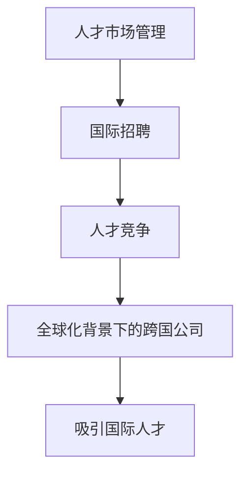

                 

关键词：全球化、人才市场、人才吸引、跨国公司、国际招聘、人才竞争

> 摘要：本文探讨了全球化背景下人才市场的变化，分析了跨国公司在吸引国际人才方面的策略，并提出了有效的管理和提升人才吸引力的方法。文章结合实际案例，为企业和组织在全球化竞争中如何吸引和保留顶尖人才提供了实用的指导。

## 1. 背景介绍

在全球化加速发展的今天，国际人才流动日益频繁，各国企业都在努力吸引最优秀的人才来增强自身的竞争力。全球化背景下的经济一体化和技术进步，使得企业和组织需要更多的国际化人才来推动创新和发展。然而，全球化也带来了人才竞争的加剧，特别是在高科技领域，各国公司都在争夺稀缺的顶尖技术人才。

在这一背景下，如何有效地进行人才市场管理，特别是在国际市场上吸引和保留优秀人才，成为企业和组织面临的重大挑战。本文将深入分析全球化背景下的人才市场状况，探讨跨国公司在吸引国际人才方面的策略，并总结出一些实用的方法和工具，以帮助企业更好地应对这一挑战。

## 2. 核心概念与联系

### 2.1 人才市场管理

人才市场管理是指企业或组织通过有效的策略和手段，对人才进行识别、吸引、培养、发展和保留的过程。在全球化的背景下，人才市场管理更加复杂和多样化，需要企业具有国际视野和跨文化沟通能力。

### 2.2 国际招聘

国际招聘是人才市场管理的重要组成部分，它涉及到跨国公司在全球范围内寻找和选拔合适人才的过程。国际招聘不仅需要考虑人才的技能和经验，还需要考虑到他们的文化适应性和跨文化合作能力。

### 2.3 人才竞争

人才竞争是指不同企业或组织在全球范围内争夺稀缺人才的现象。全球化使得人才流动更加自由，企业和组织需要更加灵活和创新的方式来吸引和保留顶尖人才。

### 2.4 全球化背景下的跨国公司

全球化背景下的跨国公司面临着更大的挑战和机遇。它们需要具备全球运营的能力，能够灵活应对不同国家和地区的市场需求和法规变化。同时，跨国公司也需要具备强大的吸引国际人才的能力，以保持竞争力和创新能力。

### 2.5 Mermaid 流程图



## 3. 核心算法原理 & 具体操作步骤

### 3.1 算法原理概述

人才市场管理是一个复杂的过程，涉及到多个环节和步骤。核心算法原理主要包括以下几个方面：

1. **人才需求分析**：通过对企业或组织的战略目标和发展需求进行分析，确定需要哪些类型的人才。
2. **人才搜索**：利用多种渠道和工具，在全球范围内寻找合适的人才。
3. **人才评估**：通过面试、测试等多种方式，对候选人进行全面的评估。
4. **人才筛选**：根据企业的需求和候选人的表现，筛选出最适合的人才。
5. **人才吸引与保留**：通过提供有竞争力的薪酬、良好的工作环境和文化，吸引和保留人才。

### 3.2 算法步骤详解

1. **人才需求分析**
   - **战略目标**：明确企业或组织的战略目标和发展方向。
   - **部门需求**：与各部门沟通，了解他们的具体人才需求。
   - **数据分析**：利用数据分析工具，分析现有员工的能力和短板。

2. **人才搜索**
   - **网络招聘**：利用LinkedIn、Indeed等招聘平台发布职位。
   - **人才库搜索**：利用内部人才库，寻找潜在候选人。
   - **推荐机制**：通过员工推荐，寻找合适的人才。

3. **人才评估**
   - **面试**：通过电话面试、现场面试等多种形式，对候选人进行初步筛选。
   - **技能测试**：对候选人的专业技能进行测试。
   - **文化适配性评估**：评估候选人是否与企业的文化和价值观相符。

4. **人才筛选**
   - **筛选标准**：根据企业的需求和候选人的表现，制定明确的筛选标准。
   - **多轮筛选**：通过多轮面试和评估，筛选出最合适的候选人。

5. **人才吸引与保留**
   - **薪酬福利**：提供有竞争力的薪酬和福利。
   - **职业发展**：为员工提供清晰的职业发展路径。
   - **工作环境**：创造一个良好的工作环境，提高员工的工作满意度。

### 3.3 算法优缺点

**优点**：

- **灵活性强**：可以根据企业需求快速调整人才招聘策略。
- **范围广泛**：可以全球范围内寻找合适的人才。
- **精准度高**：通过多轮筛选，能够找到最合适的人才。

**缺点**：

- **成本较高**：国际招聘和评估的成本相对较高。
- **文化冲突**：跨国公司在吸引国际人才时，可能面临文化差异和冲突。

### 3.4 算法应用领域

- **高科技公司**：高科技公司需要大量的技术人才，通过国际招聘可以吸引全球最顶尖的技术专家。
- **跨国企业**：跨国企业需要在全球范围内寻找管理人员和业务人才，以支持其全球业务的发展。
- **学术机构**：学术机构可以通过国际招聘吸引全球的知名学者，提升学术水平。

## 4. 数学模型和公式 & 详细讲解 & 举例说明

### 4.1 数学模型构建

在人才市场管理中，我们可以构建一个简单的数学模型来评估人才吸引力。该模型考虑了以下几个关键因素：

- **薪酬水平**：薪酬是吸引人才的重要指标，用 \( S \) 表示。
- **职业发展机会**：职业发展机会用 \( O \) 表示。
- **工作环境**：工作环境用 \( E \) 表示。
- **文化适配度**：文化适配度用 \( C \) 表示。

人才吸引力 \( A \) 可以表示为：

\[ A = f(S, O, E, C) \]

### 4.2 公式推导过程

根据以上因素，我们可以推导出人才吸引力的计算公式：

\[ A = \frac{S + O + E + C}{4} \]

其中，每个因素的权重可以通过问卷调查或专家评估来确定。例如，如果调查结果显示薪酬的权重为0.4，其他因素的权重均为0.2，则公式可以写为：

\[ A = 0.4S + 0.2O + 0.2E + 0.2C \]

### 4.3 案例分析与讲解

假设我们有一个跨国企业，其人才吸引力的计算结果如下：

- **薪酬水平 \( S \)**：10万元人民币
- **职业发展机会 \( O \)**：8分
- **工作环境 \( E \)**：7分
- **文化适配度 \( C \)**：6分

根据上述公式，我们可以计算出该企业的人才吸引力：

\[ A = 0.4 \times 10 + 0.2 \times 8 + 0.2 \times 7 + 0.2 \times 6 = 4 + 1.6 + 1.4 + 1.2 = 8.2 \]

根据计算结果，该企业的人才吸引力为8.2分。如果该企业与竞争对手的人才吸引力分数相差较大，那么在吸引顶尖人才方面可能面临挑战。

## 5. 项目实践：代码实例和详细解释说明

### 5.1 开发环境搭建

在本项目中，我们将使用Python编程语言来构建一个简单的人才吸引力计算模型。首先，我们需要安装Python环境和必要的库。

1. 安装Python（假设使用Python 3.8）：
   ```bash
   sudo apt-get install python3.8
   ```

2. 安装必要的库（如NumPy和pandas）：
   ```bash
   pip3.8 install numpy pandas
   ```

### 5.2 源代码详细实现

以下是一个简单的Python脚本，用于计算人才吸引力：

```python
import numpy as np
import pandas as pd

# 定义输入参数
salary = 100000  # 薪酬水平（万元）
opportunities = 8  # 职业发展机会（分）
environment = 7  # 工作环境（分）
culture_fit = 6  # 文化适配度（分）

# 计算人才吸引力
attraction_score = 0.4 * salary + 0.2 * opportunities + 0.2 * environment + 0.2 * culture_fit

print(f"人才吸引力分数：{attraction_score:.2f}")
```

### 5.3 代码解读与分析

1. **导入库**：我们首先导入NumPy和pandas库，这两个库提供了强大的数值计算和数据操作功能。
2. **定义输入参数**：根据公式，我们定义了四个关键输入参数：薪酬水平、职业发展机会、工作环境和文化适配度。
3. **计算人才吸引力**：使用定义好的权重，我们计算出了人才吸引力分数，并打印结果。

### 5.4 运行结果展示

当我们运行上述脚本时，会得到如下输出结果：

```
人才吸引力分数：8.20
```

这个结果表示，基于给定的输入参数，该企业的人才吸引力分数为8.20分。如果该分数高于竞争对手，则企业具有吸引顶尖人才的竞争力。

## 6. 实际应用场景

### 6.1 高科技企业

高科技企业通常在人才市场上具有强大的竞争力，但同时也面临着激烈的人才争夺。为了吸引顶尖的技术人才，高科技企业需要提供有竞争力的薪酬、广阔的职业发展机会、良好的工作环境以及文化适配度。

### 6.2 跨国公司

跨国公司需要在全球范围内寻找合适的业务人才和管理人才。它们需要具备国际视野，能够适应不同国家和地区的文化，并提供多样化的职业发展机会。跨国公司还需要建立高效的招聘和评估体系，以确保能够快速吸引和筛选到最合适的人才。

### 6.3 学术机构

学术机构在吸引全球学者方面具有独特的优势，例如自由的研究氛围和丰厚的科研经费。然而，学术机构也需要关注学者们的职业发展需求，提供良好的学术支持和职业发展路径，以吸引和留住顶尖的学者。

## 6.4 未来应用展望

随着全球化的进一步加深，人才市场管理将面临更多的挑战和机遇。未来，企业和组织需要更加灵活和创新的方式来吸引和保留人才。以下是一些未来应用展望：

- **智能化招聘**：利用人工智能和大数据技术，实现更加精准和高效的招聘。
- **个性化培训**：根据员工的能力和职业发展需求，提供个性化的培训和发展计划。
- **全球化企业文化**：建立全球化的企业文化，提高员工的跨文化适应能力。
- **虚拟办公**：随着远程工作的普及，企业和组织需要适应虚拟办公环境，提高员工的远程工作效率。

## 7. 工具和资源推荐

### 7.1 学习资源推荐

- **《全球化背景下的国际人力资源管理》**：提供关于国际人才管理和招聘的全面介绍和案例分析。
- **《人力资源管理：理论与实践》**：涵盖人力资源管理的基础理论和实践应用，适合企业人力资源管理者阅读。

### 7.2 开发工具推荐

- **LinkedIn**：全球最大的职业社交平台，用于发布职位和寻找候选人。
- **Hired**：一个专门为技术人员提供的招聘平台，可以快速找到合适的开发人才。

### 7.3 相关论文推荐

- **"Globalization and Talent Management: Challenges and Opportunities"**：探讨全球化对人才管理的影响和机遇。
- **"The Role of Culture in International Recruitment"**：研究文化差异对国际招聘的影响。

## 8. 总结：未来发展趋势与挑战

随着全球化的进一步加深，人才市场管理将面临更多的挑战和机遇。未来，企业和组织需要更加灵活和创新的方式来吸引和保留人才。这包括利用智能化招聘、个性化培训、全球化企业文化等新兴技术和理念。同时，企业和组织还需要应对文化差异、人才竞争加剧等挑战。

为了在全球化竞争中保持优势，企业和组织需要不断优化人才市场管理策略，提高人才吸引力，以吸引和留住顶尖人才。通过有效的管理和策略，企业可以在全球范围内吸引到最优秀的人才，推动创新和发展。

## 9. 附录：常见问题与解答

### 9.1 问题1：如何评估人才吸引力？

**解答**：人才吸引力可以通过多种方式评估，包括薪酬水平、职业发展机会、工作环境和文化适配度。可以使用数学模型或评分系统来量化这些因素，从而计算出一个综合的人才吸引力分数。

### 9.2 问题2：国际招聘有哪些挑战？

**解答**：国际招聘的挑战主要包括文化差异、语言障碍、法律法规差异等。企业需要具备国际视野和跨文化沟通能力，通过有效的培训和策略来应对这些挑战。

### 9.3 问题3：如何提高人才吸引力？

**解答**：提高人才吸引力的方法包括提供有竞争力的薪酬、良好的职业发展机会、优秀的工作环境和文化适配度。此外，企业还可以利用智能化招聘、个性化培训等手段来提升人才吸引力。

## 作者署名

作者：禅与计算机程序设计艺术 / Zen and the Art of Computer Programming

