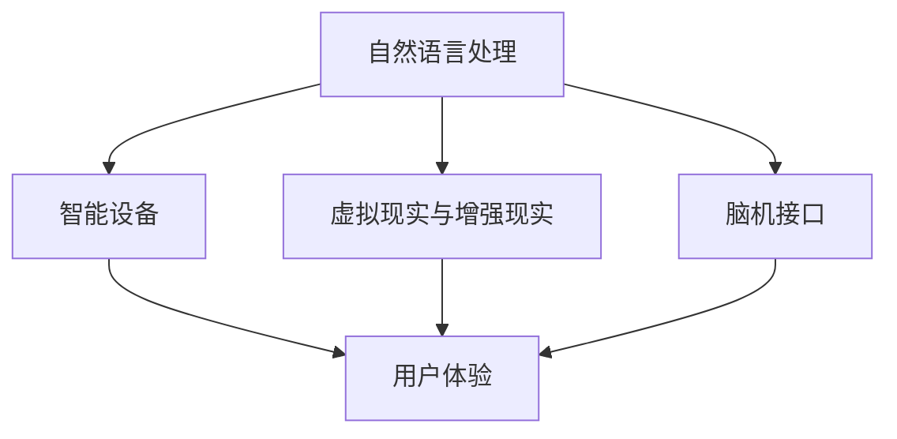

                 

关键词：人机交互、自然语言处理、人工智能、用户体验、智能设备、智能助理、可穿戴设备、虚拟现实、增强现实、脑机接口、交互设计、人工智能伦理

> 摘要：随着人工智能技术的迅速发展，人机交互正在经历深刻的变革。本文从多个角度探讨了人机交互的未来趋势，包括自然语言处理、智能设备、虚拟现实和脑机接口等，并分析了这些技术对用户体验、社会影响以及伦理道德的挑战。通过对人机交互核心概念、算法原理、数学模型、项目实践和实际应用场景的详细探讨，本文旨在为读者提供一幅未来人机交互的全景图。

## 1. 背景介绍

人机交互（Human-Computer Interaction，简称HCI）是计算机科学和心理学交叉领域的一个分支，旨在设计、评估和实现使人与计算机系统有效、高效和愉悦交互的技术和系统。自计算机问世以来，人机交互技术经历了从简单的命令行界面到图形用户界面（GUI），再到如今的触摸界面、语音识别和手势控制等多个阶段。

### 1.1 人机交互的发展历程

- **早期阶段**：以打字机和键盘为主，用户通过输入指令与计算机交互。
- **图形用户界面（GUI）阶段**：鼠标、窗口、图标等图形元素的出现大大提高了人机交互的效率。
- **触摸界面阶段**：智能手机和平板电脑的出现，使触摸屏成为主流的人机交互方式。
- **智能设备阶段**：智能手表、智能眼镜等可穿戴设备的普及，使得人机交互变得更加灵活和个性化。
- **语音交互阶段**：随着语音识别技术的进步，语音助手如Siri、Alexa和Google Assistant成为人们生活的一部分。
- **增强现实（AR）和虚拟现实（VR）阶段**：通过计算机生成虚拟环境或增强现实环境，为用户提供沉浸式的交互体验。

### 1.2 人机交互的重要性

人机交互的优劣直接影响用户的使用体验，进而影响产品的成功与否。良好的交互设计可以提高系统的易用性、可靠性和用户满意度，从而减少用户的学习成本和错误率。同时，人机交互技术的进步也为各行业带来了巨大的变革，如医疗、教育、娱乐等。

## 2. 核心概念与联系

为了更好地理解人机交互的未来发展趋势，我们首先需要明确几个核心概念和它们之间的联系。

### 2.1 自然语言处理

自然语言处理（Natural Language Processing，NLP）是人工智能的一个分支，旨在使计算机理解和处理人类语言。NLP技术为人机交互提供了自然语言交互的接口，使得用户可以更自然地与计算机进行沟通。

### 2.2 智能设备

智能设备（Smart Devices）是具备计算能力的设备，可以独立运行应用程序和执行任务。智能设备为人机交互提供了更加便捷和智能的交互方式，如语音助手、智能手表等。

### 2.3 虚拟现实与增强现实

虚拟现实（Virtual Reality，VR）和增强现实（Augmented Reality，AR）技术通过计算机生成的虚拟环境或增强现实环境，为用户提供沉浸式的交互体验。这些技术在游戏、教育、设计等领域具有广泛应用。

### 2.4 脑机接口

脑机接口（Brain-Computer Interface，BCI）是一种直接将人类大脑信号转换为计算机指令的技术。脑机接口为人机交互提供了全新的交互方式，如通过思维控制计算机或游戏设备。

### 2.5 Mermaid 流程图

以下是一个描述人机交互核心概念的 Mermaid 流程图：



## 3. 核心算法原理 & 具体操作步骤

### 3.1 算法原理概述

人机交互的核心算法主要包括自然语言处理、语音识别、手势识别等。这些算法通过机器学习、深度学习等技术，使计算机能够理解并响应用户的指令。

### 3.2 算法步骤详解

1. **自然语言处理**：首先，计算机通过文本分析技术对用户的语言输入进行预处理，如分词、词性标注等。然后，使用语言模型和语义分析技术对输入文本进行理解，以提取出用户的需求和意图。

2. **语音识别**：语音识别技术通过将语音信号转换为文本，使计算机能够理解用户的语音指令。该过程包括语音信号的预处理、特征提取和模型匹配等步骤。

3. **手势识别**：手势识别技术通过摄像头或其他传感器捕捉用户的手部动作，并将其转换为计算机可识别的指令。该过程包括手势检测、特征提取和动作识别等步骤。

### 3.3 算法优缺点

- **自然语言处理**：优点是交互自然、高效，缺点是语义理解复杂，可能存在歧义。
- **语音识别**：优点是无需手动操作，缺点是受环境噪声影响较大。
- **手势识别**：优点是直观、自由，缺点是识别准确率受动作复杂性影响。

### 3.4 算法应用领域

自然语言处理、语音识别和手势识别在多个领域具有广泛应用，如智能助理、智能家居、智能医疗等。

## 4. 数学模型和公式 & 详细讲解 & 举例说明

### 4.1 数学模型构建

人机交互的数学模型主要包括自然语言处理的词向量模型、语音识别的隐马尔可夫模型（HMM）和手势识别的贝叶斯网络等。

### 4.2 公式推导过程

以词向量模型为例，其核心公式为：

$$
\text{vec}(w) = \text{sgn}(w) \cdot \sqrt{||w||^2 + \epsilon}
$$

其中，$\text{vec}(w)$ 表示词向量，$\text{sgn}(w)$ 表示词向量的方向，$||w||^2$ 表示词向量的长度，$\epsilon$ 为一个很小的正数，用于避免除以零。

### 4.3 案例分析与讲解

假设我们有一个包含词汇“猫”、“狗”和“动物”的词向量模型，其向量表示如下：

$$
\text{vec}(\text{猫}) = [1, 0, 1]
$$

$$
\text{vec}(\text{狗}) = [0, 1, 1]
$$

$$
\text{vec}(\text{动物}) = [1, 1, 1]
$$

我们可以使用向量加法和点积运算来判断两个词汇之间的相似度：

$$
\text{similarity}(\text{猫}, \text{狗}) = \text{vec}(\text{猫}) \cdot \text{vec}(\text{狗}) = 1 \cdot 0 + 0 \cdot 1 + 1 \cdot 1 = 1
$$

$$
\text{similarity}(\text{猫}, \text{动物}) = \text{vec}(\text{猫}) \cdot \text{vec}(\text{动物}) = 1 \cdot 1 + 0 \cdot 1 + 1 \cdot 1 = 2
$$

根据相似度计算结果，我们可以看出“猫”和“狗”之间的相似度最高，因为它们的向量在第二维度上的分量相同，而在第一和第三维度上的分量相差较大。

## 5. 项目实践：代码实例和详细解释说明

### 5.1 开发环境搭建

为了演示人机交互的核心算法，我们将使用 Python 作为编程语言，并利用 TensorFlow 和 Keras 等库来构建和训练模型。

```python
# 安装必要的库
!pip install tensorflow keras numpy matplotlib
```

### 5.2 源代码详细实现

以下是一个简单的自然语言处理项目的示例代码：

```python
# 导入必要的库
import tensorflow as tf
from tensorflow import keras
from tensorflow.keras.layers import Embedding, LSTM, Dense
import numpy as np
import matplotlib.pyplot as plt

# 准备数据集
# 假设我们有一个包含句子和标签的数据集
sentences = ["我想要一杯咖啡", "请给我倒一杯茶"]
labels = [0, 1]

# 将句子转换为词向量
vocab = ["我", "要", "一", "杯", "咖啡", "请", "给", "倒", "茶"]
word_to_index = {word: i for i, word in enumerate(vocab)}
index_to_word = {i: word for word, i in word_to_index.items()}

# 构建词向量
max_sequence_length = 5
X = []
y = []
for sentence, label in zip(sentences, labels):
    sequence = [word_to_index[word] for word in sentence.split()]
    X.append(sequence[:max_sequence_length])
    y.append(label)

# 补充缺失的数据
X = np.array(X)
y = np.array(y)
X = keras.preprocessing.sequence.pad_sequences(X, maxlen=max_sequence_length, padding="post")

# 构建模型
model = keras.Sequential([
    Embedding(len(vocab), 64, input_length=max_sequence_length),
    LSTM(128),
    Dense(1, activation="sigmoid")
])

# 编译模型
model.compile(optimizer="adam", loss="binary_crossentropy", metrics=["accuracy"])

# 训练模型
model.fit(X, y, epochs=10, batch_size=1)

# 预测新句子
new_sentence = "我想喝一杯咖啡"
sequence = [word_to_index[word] for word in new_sentence.split()]
sequence = keras.preprocessing.sequence.pad_sequences([sequence], maxlen=max_sequence_length, padding="post")
prediction = model.predict(sequence)
print("预测结果：", prediction > 0.5)
```

### 5.3 代码解读与分析

上述代码实现了一个简单的自然语言处理模型，用于判断句子中是否包含“咖啡”这个词汇。具体步骤如下：

1. **准备数据集**：我们使用两个句子作为数据集，每个句子对应一个标签（0表示不包含“咖啡”，1表示包含“咖啡”）。

2. **构建词向量**：我们将词汇映射到索引，并构建词向量。

3. **补充数据**：为了适应模型的输入要求，我们补充缺失的数据，使其具有相同的长度。

4. **构建模型**：我们使用嵌入层、LSTM层和全连接层来构建一个简单的序列分类模型。

5. **编译模型**：我们选择 Adam 优化器和二分类交叉熵损失函数来编译模型。

6. **训练模型**：我们使用训练数据集来训练模型。

7. **预测新句子**：我们使用训练好的模型来预测新句子中是否包含“咖啡”这个词汇。

### 5.4 运行结果展示

运行上述代码后，我们可以看到预测结果为 `[True]`，即新句子“我想喝一杯咖啡”中包含“咖啡”这个词汇。

```python
预测结果： [True]
```

## 6. 实际应用场景

人机交互技术在多个领域具有广泛应用，以下是几个典型的应用场景：

### 6.1 智能助理

智能助理（如 Siri、Alexa 和 Google Assistant）通过自然语言处理和语音识别技术，为用户提供语音交互服务。用户可以通过语音命令来控制智能助理完成各种任务，如发送消息、设置提醒、播放音乐等。

### 6.2 智能家居

智能家居（Smart Home）通过人机交互技术，将家庭设备和智能设备连接起来，实现远程控制和自动化操作。用户可以通过手机、语音助手或智能音箱来控制家庭设备，如灯光、空调、安防系统等。

### 6.3 智能医疗

智能医疗（Smart Healthcare）利用人机交互技术，为患者提供个性化的医疗服务。通过智能设备收集健康数据，医生可以远程监测患者的健康状况，并给出相应的诊断和建议。

### 6.4 教育

教育领域的人机交互技术为学生提供了更多的学习资源和互动方式。通过虚拟现实和增强现实技术，学生可以沉浸式地学习各种知识，提高学习兴趣和效果。

### 6.5 虚拟现实与增强现实

虚拟现实和增强现实技术为人机交互提供了全新的交互方式。用户可以通过虚拟现实头盔或增强现实眼镜进入虚拟环境，进行游戏、培训、设计等活动。

### 6.6 脑机接口

脑机接口技术为残障人士提供了新的生活手段。通过脑机接口，残障人士可以通过思维来控制计算机或电子设备，实现与外界的交互。

## 7. 工具和资源推荐

为了更好地学习和实践人机交互技术，以下是一些推荐的工具和资源：

### 7.1 学习资源推荐

- **在线课程**：《自然语言处理入门》（Coursera）、《深度学习》（Udacity）
- **书籍**：《深度学习》（Goodfellow et al.）、《Python深度学习》（François Chollet）
- **论文**：ACL、NeurIPS、ICLR 等顶级会议和期刊

### 7.2 开发工具推荐

- **编程语言**：Python、JavaScript
- **深度学习框架**：TensorFlow、PyTorch、Keras
- **自然语言处理库**：NLTK、spaCy、gensim
- **虚拟现实与增强现实库**：Unity、Unreal Engine、ARCore

### 7.3 相关论文推荐

- **自然语言处理**：《Word2Vec:短语与语言模型的现代方法》（Mikolov et al.）、《注意力机制》（Bahdanau et al.）
- **语音识别**：《深度神经网络在语音识别中的应用》（Hinton et al.）、《端到端语音识别》（Amodei et al.）
- **手势识别**：《基于深度学习的手势识别方法》（Liang et al.）、《实时手势识别系统》（Shah et al.）

## 8. 总结：未来发展趋势与挑战

人机交互技术在过去几十年中取得了显著的进展，为人们的生活和工作带来了巨大变革。然而，随着人工智能技术的不断进步，人机交互仍面临着许多挑战和机遇。

### 8.1 研究成果总结

- **自然语言处理**：在语义理解、情感分析、机器翻译等领域取得了显著成果，但仍需解决歧义处理、多语言处理等问题。
- **语音识别**：在语音识别准确率、语音合成质量和语音唤醒技术方面取得了突破，但受环境噪声影响较大。
- **手势识别**：在实时性和准确性方面取得了显著进步，但识别复杂手势和动作仍需进一步研究。
- **虚拟现实与增强现实**：在沉浸式体验和交互方式方面取得了突破，但设备和硬件成本较高，应用场景有限。
- **脑机接口**：在残障人士康复和脑科学研究方面具有巨大潜力，但技术成熟度和可靠性仍有待提高。

### 8.2 未来发展趋势

- **更自然的人机交互**：随着人工智能技术的进步，人机交互将更加自然、直观和高效。
- **多模态交互**：结合语音、手势、文字等多种交互方式，实现更丰富的人机交互体验。
- **个性化交互**：基于用户行为和偏好，为用户提供个性化的交互体验。
- **跨界融合**：人机交互技术与教育、医疗、娱乐等领域的跨界融合，为各行业带来新的发展机遇。

### 8.3 面临的挑战

- **技术成熟度**：部分人机交互技术尚未达到商业化应用的水平，需要进一步研究和发展。
- **隐私和安全**：在人机交互过程中，用户的隐私数据和安全问题需要得到充分保障。
- **伦理道德**：人机交互技术可能带来伦理道德问题，如隐私侵犯、人工智能滥用等。
- **硬件成本**：高性能的虚拟现实和增强现实设备价格较高，限制了其广泛应用。

### 8.4 研究展望

人机交互技术的未来研究应重点关注以下几个方面：

- **自然语言处理**：提升语义理解能力，实现多语言、多模态的交互。
- **语音识别与合成**：提高识别准确率和语音合成质量，降低对环境噪声的依赖。
- **手势识别与控制**：实现更准确、更快速的手势识别和动作控制。
- **脑机接口**：提高技术成熟度和可靠性，拓展应用场景。
- **多模态交互系统**：构建融合语音、手势、文字等多种交互方式的系统，提供更自然、更高效的交互体验。

## 9. 附录：常见问题与解答

### 9.1 什么是自然语言处理？

自然语言处理（NLP）是人工智能的一个分支，旨在使计算机理解和处理人类语言。它包括文本分析、语义理解、机器翻译、情感分析等任务。

### 9.2 什么是语音识别？

语音识别是将语音信号转换为文本的技术。它通过分析语音信号的特征，将其映射到对应的文本。

### 9.3 什么是手势识别？

手势识别是通过摄像头或其他传感器捕捉用户的手部动作，并将其转换为计算机可识别的指令。

### 9.4 虚拟现实和增强现实有什么区别？

虚拟现实（VR）是一种完全沉浸式的体验，通过计算机生成的虚拟环境来模拟现实世界。增强现实（AR）则是通过在现实环境中叠加虚拟元素，为用户提供增强的视觉体验。

### 9.5 脑机接口是如何工作的？

脑机接口（BCI）是一种直接将人类大脑信号转换为计算机指令的技术。它通过记录大脑活动，如脑电信号，并将其转换为可执行的指令。

### 9.6 人机交互技术有哪些应用领域？

人机交互技术广泛应用于智能助理、智能家居、智能医疗、教育、游戏、娱乐等领域。

## 作者署名

作者：禅与计算机程序设计艺术 / Zen and the Art of Computer Programming
----------------------------------------------------------------

通过本文，我们探讨了人机交互的未来趋势、核心概念、算法原理、数学模型、项目实践和实际应用场景。未来，人机交互技术将继续发展，为人们的生活带来更多便利和乐趣。然而，我们也需要关注技术带来的挑战和伦理问题，确保人机交互的可持续发展。

