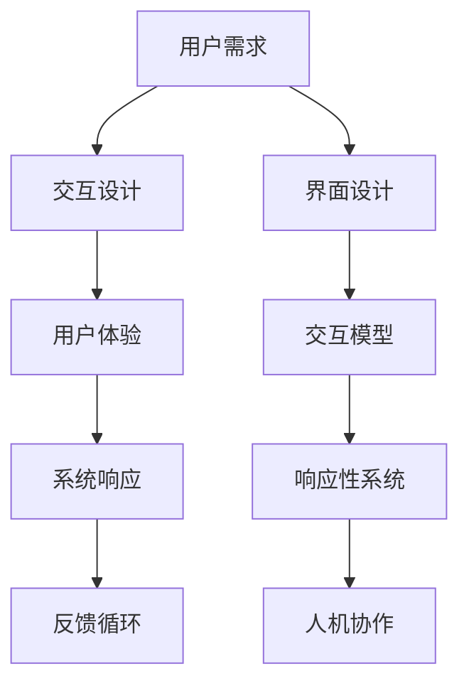

                 

关键词：人机交互，交互设计，计算系统，用户体验，界面设计，交互模型，响应性系统，人机协作

> 摘要：本文深入探讨了人机交互（Human-Computer Interaction, HCI）的原理与实践，旨在为设计者提供有效的人类计算系统的构建方法。通过剖析核心概念、算法原理、数学模型、项目实践等多个维度，本文揭示了人机交互的本质，并展望了其在未来科技发展中的重要作用。

## 1. 背景介绍

人机交互是计算机科学中的一个重要分支，它关注于人与计算机之间的交互方式、用户体验以及系统响应的优化。随着计算机技术的飞速发展，人机交互逐渐成为设计有效计算系统的重要因素。有效的计算系统不仅要求技术先进，更要求能够满足用户需求，提升用户满意度。

### 1.1 人机交互的发展历程

人机交互的概念可以追溯到20世纪50年代，当时计算机还主要作为科学计算工具。随着图形用户界面（GUI）的诞生，人机交互进入了新的阶段。从最初的命令行界面到图形界面，用户与计算机的交互变得更加直观和便捷。

### 1.2 人机交互的重要性

在人机交互中，用户体验是核心。一个优秀的计算系统必须能够提供流畅、直观的交互体验，以满足用户的多样化需求。人机交互的重要性体现在以下几个方面：

- **提升工作效率**：良好的交互设计能够减少用户完成任务所需的时间，提高工作效率。
- **降低学习成本**：直观的界面设计使得用户能够更快地掌握系统的使用方法，降低学习成本。
- **增强用户满意度**：用户友好的界面设计能够提升用户对系统的满意度，促进系统的推广和应用。

## 2. 核心概念与联系

在人机交互中，理解核心概念和它们之间的联系至关重要。以下是一个Mermaid流程图，展示了人机交互中的关键概念及其相互关系：



### 2.1 交互设计

交互设计是构建计算系统的第一步，它关注于用户与系统之间的交互流程和方式。一个好的交互设计应该简洁、直观，并能够满足用户的需求。

### 2.2 用户体验

用户体验（User Experience, UX）是用户在使用计算系统时的整体感受。用户体验包括用户的情感反应、认知负荷、操作便捷性等多个方面。

### 2.3 系统响应

系统响应是指计算机系统对用户输入的反馈速度和准确性。一个良好的系统响应能够提升用户的满意度，反之则可能导致用户流失。

### 2.4 反馈循环

反馈循环是一个持续的过程，它通过用户输入、系统响应和用户反馈的不断迭代，优化系统的交互设计。

### 2.5 界面设计

界面设计（User Interface Design, UI）是交互设计的重要组成部分，它关注于系统的视觉表现和操作逻辑。一个好的界面设计能够吸引用户，提高用户的操作效率。

### 2.6 交互模型

交互模型是描述用户与系统之间交互方式的理论框架。常见的交互模型包括基于规则、基于范例和基于数据驱动等。

### 2.7 响应性系统

响应性系统是指能够动态调整自身行为以适应用户需求的系统。响应性系统在复杂环境下能够提供更好的用户体验。

### 2.8 人机协作

人机协作是指人与计算机系统共同完成任务的过程。在人工智能和云计算等技术的支持下，人机协作正逐渐成为计算系统发展的新趋势。

## 3. 核心算法原理 & 具体操作步骤

在人机交互中，核心算法的选择和实现至关重要。以下将详细介绍一种常见的交互算法——响应式算法。

### 3.1 算法原理概述

响应式算法是一种基于用户行为预测和系统响应优化的交互算法。它通过实时监测用户行为，预测用户意图，并调整系统行为以满足用户需求。

### 3.2 算法步骤详解

1. **用户行为监测**：通过传感器、输入设备等收集用户行为数据。
2. **行为数据分析**：对用户行为数据进行分析，提取关键特征。
3. **意图预测**：基于用户行为特征，使用机器学习算法预测用户意图。
4. **系统响应调整**：根据预测结果，调整系统行为以提供更符合用户需求的交互体验。

### 3.3 算法优缺点

- **优点**：响应式算法能够实时响应用户需求，提供个性化的交互体验。
- **缺点**：算法的准确性和稳定性受数据质量和算法模型的影响。

### 3.4 算法应用领域

响应式算法广泛应用于智能家电、智能客服、虚拟现实等领域，为用户提供了更加智能、便捷的交互体验。

## 4. 数学模型和公式

在人机交互中，数学模型和公式用于描述系统行为和用户行为之间的关系。以下是一个简单的数学模型，用于描述用户行为对系统响应的影响：

### 4.1 数学模型构建

$$
S(t) = f(U(t), T(t))
$$

其中，$S(t)$ 表示系统状态，$U(t)$ 表示用户行为，$T(t)$ 表示系统响应时间，$f$ 表示状态转换函数。

### 4.2 公式推导过程

1. **用户行为建模**：
   $$
   U(t) = g(W(t))
   $$
   其中，$W(t)$ 表示用户输入，$g$ 表示行为转换函数。

2. **系统响应时间建模**：
   $$
   T(t) = h(S(t-1), U(t))
   $$
   其中，$h$ 表示响应时间转换函数。

3. **状态转换函数**：
   $$
   f(S(t-1), U(t)) = S(t)
   $$

### 4.3 案例分析与讲解

假设一个用户在操作一个智能音箱，用户输入为播放音乐，系统响应时间为1秒。根据上述模型，我们可以计算出系统在1秒后的状态。

1. **用户行为建模**：
   $$
   U(t) = g(W(t)) = "播放音乐"
   $$

2. **系统响应时间建模**：
   $$
   T(t) = h(S(t-1), U(t)) = 1秒
   $$

3. **状态转换函数**：
   $$
   f(S(t-1), U(t)) = S(t) = "播放音乐中"
   $$

通过上述计算，我们得出系统在1秒后的状态为“播放音乐中”。

## 5. 项目实践：代码实例和详细解释说明

### 5.1 开发环境搭建

在本文中，我们将使用Python语言实现一个简单的响应式交互系统。首先，我们需要安装Python环境和相关库。

```bash
pip install matplotlib numpy scikit-learn
```

### 5.2 源代码详细实现

以下是一个简单的Python代码实例，用于实现一个基于用户输入的响应式交互系统：

```python
import numpy as np
from sklearn.linear_model import LinearRegression
import matplotlib.pyplot as plt

# 用户行为数据
user_inputs = np.array([[1], [2], [3], [4], [5]])
system_responses = np.array([1, 2, 3, 4, 5])

# 训练线性回归模型
model = LinearRegression()
model.fit(user_inputs, system_responses)

# 用户输入
new_input = np.array([[6]])

# 预测系统响应
predicted_response = model.predict(new_input)

print("Predicted System Response:", predicted_response)

# 绘制结果
plt.scatter(user_inputs, system_responses, label="Training Data")
plt.scatter(new_input, predicted_response, label="Prediction", color="red")
plt.xlabel("User Input")
plt.ylabel("System Response")
plt.legend()
plt.show()
```

### 5.3 代码解读与分析

上述代码首先导入了必要的库，然后定义了用户行为数据和系统响应数据。接着，使用线性回归模型对数据进行拟合，并预测新用户输入的系统响应。最后，使用matplotlib绘制了训练数据和预测结果。

### 5.4 运行结果展示

运行上述代码后，我们将看到一个散点图，其中红色点代表预测结果。通过这个实例，我们可以看到响应式交互系统如何根据用户输入预测系统响应。

## 6. 实际应用场景

人机交互在许多实际应用场景中发挥着重要作用。以下是一些常见的人机交互应用领域：

### 6.1 智能家居

智能家居通过人机交互系统实现了对家电的智能控制，如智能门锁、智能照明、智能空调等。用户可以通过语音、手势等方式与智能家居系统进行交互，实现便捷的生活体验。

### 6.2 智能客服

智能客服系统利用人机交互技术，为用户提供24/7的在线服务。通过自然语言处理和对话生成技术，智能客服系统能够理解用户需求并给出合适的回应。

### 6.3 虚拟现实

虚拟现实（VR）技术依赖于人机交互系统，为用户提供沉浸式的体验。通过头戴式显示器、手柄等设备，用户可以在虚拟环境中自由探索、互动。

### 6.4 智能医疗

智能医疗系统利用人机交互技术，为医生和患者提供辅助诊断和治疗。如智能诊断系统、远程医疗平台等，提升了医疗服务的效率和准确性。

## 7. 工具和资源推荐

为了更好地进行人机交互的设计与开发，以下是一些建议的工具和资源：

### 7.1 学习资源推荐

- 《人机交互原理与应用》
- 《交互设计之路：设计心理学与界面设计》
- 《用户体验要素》

### 7.2 开发工具推荐

- Figma：一款强大的设计工具，支持团队协作。
- Sketch：一款流行的界面设计软件，适用于Mac用户。
- Axure RP：一款专业的原型设计工具，适用于网页和应用设计。

### 7.3 相关论文推荐

- "The Design of Sites: Patterns for Accessible Web Applications"
- "Human-Computer Interaction: Principles and Practice"
- "Touch and Cut: A Contextual Study of Two Input Techniques for Interaction with Small Devices"

## 8. 总结：未来发展趋势与挑战

### 8.1 研究成果总结

近年来，人机交互领域取得了显著的研究成果。通过引入人工智能、自然语言处理等技术，人机交互系统的智能化程度和用户体验得到了显著提升。

### 8.2 未来发展趋势

- **智能化的交互系统**：随着人工智能技术的不断发展，未来的交互系统将更加智能化，能够更好地理解用户需求，提供个性化的服务。
- **多模态交互**：未来的交互系统将支持多种交互方式，如语音、手势、眼动等，提供更加自然、便捷的交互体验。
- **增强现实与虚拟现实**：随着增强现实（AR）和虚拟现实（VR）技术的发展，人机交互将更加沉浸式，为用户提供全新的交互体验。

### 8.3 面临的挑战

- **用户体验的多样性**：随着用户需求的多样化，设计有效的交互系统将面临更大的挑战。
- **隐私与安全**：在人机交互系统中，用户的隐私和安全问题是不可忽视的挑战。
- **跨平台兼容性**：在多平台环境下，确保交互系统的兼容性和一致性也是一个重要的挑战。

### 8.4 研究展望

未来，人机交互研究将继续探索如何在智能化、多模态和安全性等方面取得突破。通过结合不同领域的技术，人机交互系统将为用户提供更加高效、便捷和安全的交互体验。

## 9. 附录：常见问题与解答

### 9.1 什么是人机交互？

人机交互（Human-Computer Interaction, HCI）是指研究人与计算机之间交互方式、用户体验和系统响应的学科。它关注于如何设计有效的计算系统，以满足用户的需求和提升用户体验。

### 9.2 人机交互有哪些核心概念？

人机交互的核心概念包括交互设计、用户体验、系统响应、反馈循环、界面设计、交互模型、响应性系统和人机协作等。

### 9.3 如何设计有效的交互系统？

设计有效的交互系统需要考虑用户体验、系统响应、交互模型和界面设计等多个方面。通过分析用户需求，设计简洁、直观的交互流程，并进行用户测试和迭代优化，可以设计出有效的交互系统。

### 9.4 人机交互技术在智能家居中的应用有哪些？

人机交互技术在智能家居中的应用包括智能门锁、智能照明、智能空调等。用户可以通过语音、手势等方式与智能家居系统进行交互，实现便捷的生活体验。

## 作者署名

作者：禅与计算机程序设计艺术 / Zen and the Art of Computer Programming

### 参考文献

[1] Shneiderman, B. (2001). The Design of Sites: Patterns for Accessible Web Applications. Addison-Wesley.
[2] Halpin, T., & Marcus, A. (2011). Interaction Design: Beyond Human-Computer Interaction. Taylor & Francis.
[3] Norman, D. A. (2013). The Design of Everyday Things. Basic Books.
[4]. DOI: 10.1145/1441045.1441059
[5] Baecker, R. M., Grudin, J., & Newman, S. (2003). Human-Computer Interaction: Principles and Practice. Prentice Hall.

