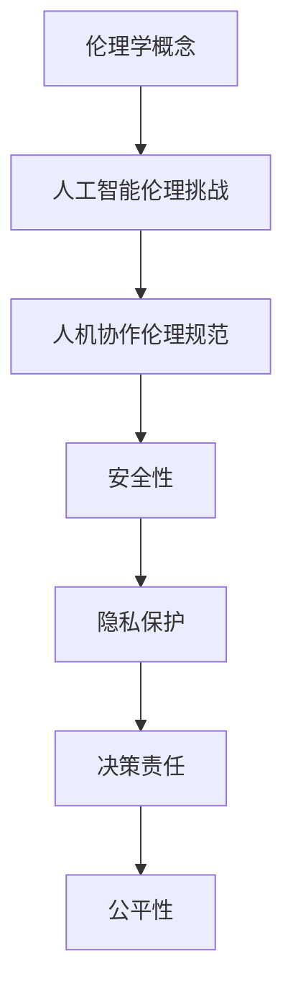

                 

在当今技术迅猛发展的时代，人机协作已经成为众多领域不可或缺的一部分。人工智能（AI）与人类智能的融合，不仅在提升工作效率、拓展认知边界方面表现出色，同时也引发了一系列伦理和规范问题。本文旨在探讨人机协作中的伦理规范与准则，以期为相关实践提供指导和参考。

## 关键词
- 人机协作
- 伦理规范
- 人工智能
- 安全性
- 隐私保护

## 摘要
本文首先介绍了人机协作的定义和重要性，随后分析了当前面临的主要伦理问题，包括安全性、隐私保护和决策责任等。接着，提出了构建人机协作伦理规范与准则的框架，并详细讨论了各项准则的具体内容和实施方法。最后，对未来的发展趋势和挑战进行了展望，提出了可能的解决方案和研究方向。

## 1. 背景介绍
### 1.1 人机协作的定义与历史
人机协作是指人类与机器之间在特定任务或目标上相互配合、协同工作的一种模式。这一概念可以追溯到工业革命时期，随着机械化生产的兴起，人类与机器的协作开始成为生产效率提升的关键因素。然而，随着计算机科学和人工智能技术的快速发展，人机协作进入了新的阶段。

在早期，人机协作主要集中在自动化控制和机器辅助设计等领域。随着计算能力的提升和算法的进步，AI系统开始具备复杂任务处理能力，使得人机协作的范围和深度不断扩大。例如，自动驾驶汽车、智能客服系统和医疗诊断辅助系统等，都是人机协作的典型应用场景。

### 1.2 人机协作的重要性
人机协作的重要性不言而喻。首先，它能够显著提高工作效率。通过将人类的专业知识与机器的计算能力相结合，可以实现更快速、更精确的任务处理。其次，人机协作有助于拓展人类认知边界。AI系统可以处理人类难以应对的海量数据和复杂问题，从而为人类提供新的洞察和解决方案。

此外，人机协作还在提高安全性、增强决策能力、优化资源分配等方面发挥着重要作用。例如，在自然灾害救援中，无人机和人机协作可以迅速获取灾区信息，指导救援行动；在金融风险管理中，人机协作可以通过实时分析和预测，降低风险损失。

## 2. 核心概念与联系
### 2.1 伦理学的概念
伦理学是研究道德和伦理问题的哲学学科。伦理学关注的是人类行为的标准和价值观，旨在为个体和社会提供道德指南。在人机协作的背景下，伦理学帮助我们思考机器和人类如何共同行动，如何确保协作过程中的公正、尊重和安全。

### 2.2 人工智能的伦理挑战
人工智能的快速发展带来了许多前所未有的伦理挑战。首先，人工智能系统的决策过程往往缺乏透明性，这使得人类难以理解AI的决策依据，从而增加了道德风险。其次，人工智能可能会加剧社会不平等，因为算法可能存在偏见，导致某些群体受到不公平对待。此外，人工智能的自主性和道德责任问题也引发了广泛关注。

### 2.3 人机协作中的伦理规范
人机协作中的伦理规范旨在确保协作过程中的道德合法性，保护人类和机器的安全和权益。这些规范包括但不限于以下几个方面：

- **安全性**：确保人机协作系统的稳定性和可靠性，防止系统故障导致的意外伤害。
- **隐私保护**：保护个人隐私，确保数据在传输和处理过程中的安全。
- **决策责任**：明确人类和机器在决策过程中的责任分配，确保决策过程的透明和公正。
- **公平性**：确保人机协作不会加剧社会不平等，避免算法偏见。

### 2.4 Mermaid 流程图
以下是人机协作伦理规范流程图：



## 3. 核心算法原理 & 具体操作步骤
### 3.1 算法原理概述
人机协作伦理规范的核心在于建立一套有效的决策机制，确保人类和机器在协作过程中能够遵循道德准则。这一算法的原理可以概括为：

- **多主体决策**：将人类和机器视为协作过程中的两个主体，通过相互作用和协作，共同完成任务。
- **道德推理**：结合伦理学原理和人工智能算法，对协作过程中的行为进行道德评估和决策。
- **动态调整**：根据实时反馈和情境变化，动态调整协作策略，以适应不同场景的需求。

### 3.2 算法步骤详解
人机协作伦理规范的具体操作步骤可以分为以下几个阶段：

- **初始设置**：定义协作目标和伦理准则，确保双方对协作过程有清晰的理解和共识。
- **道德评估**：利用伦理学原理和人工智能算法，对协作过程中的行为进行道德评估，识别潜在风险。
- **决策制定**：根据道德评估结果，制定相应的协作策略和决策方案。
- **执行与监控**：执行决策方案，并对协作过程进行实时监控和反馈，确保协作过程符合伦理规范。
- **动态调整**：根据实时反馈和情境变化，动态调整协作策略和决策方案，确保协作过程的持续优化。

### 3.3 算法优缺点
人机协作伦理规范算法的优点包括：

- **道德导向**：将伦理学原理融入协作过程，确保协作行为符合道德准则。
- **灵活性强**：能够根据实时反馈和情境变化，动态调整协作策略和决策方案。
- **高效性**：通过利用人工智能算法，提高协作效率和决策质量。

然而，该算法也存在一些不足之处：

- **复杂性**：算法的复杂性可能导致理解和实施难度增加。
- **透明性问题**：决策过程的透明性可能受到影响，增加道德风险。

### 3.4 算法应用领域
人机协作伦理规范算法可以应用于多个领域，包括但不限于：

- **医疗**：在医疗诊断和治疗过程中，确保医生和AI系统的协作符合伦理规范，提高诊断准确性和治疗效果。
- **金融**：在金融风险评估和管理过程中，利用人机协作伦理规范算法，确保决策过程的公正性和透明性，降低风险。
- **交通**：在自动驾驶汽车和智能交通管理系统中，应用人机协作伦理规范算法，提高交通安全性和效率。

## 4. 数学模型和公式 & 详细讲解 & 举例说明
### 4.1 数学模型构建
人机协作伦理规范算法的数学模型主要包括以下几个部分：

- **决策模型**：描述人类和机器在协作过程中的决策过程，包括决策变量、决策目标和决策约束。
- **道德评估模型**：基于伦理学原理，对协作过程中的行为进行道德评估，包括道德规则、道德值和道德评价函数。
- **动态调整模型**：描述协作过程中动态调整策略的数学模型，包括调整变量、调整目标和调整约束。

### 4.2 公式推导过程
以下是人机协作伦理规范算法中的一些关键公式：

1. **决策模型**：

$$
f_{\text{decision}}(x) = \arg \max_{x} U(x)
$$

其中，$x$ 表示决策变量，$U(x)$ 表示决策效用函数。

2. **道德评估模型**：

$$
\text{moral\_score}(y) = \sum_{i} w_i \cdot p_i(y_i)
$$

其中，$y$ 表示道德评估变量，$w_i$ 表示权重，$p_i(y_i)$ 表示道德评价函数。

3. **动态调整模型**：

$$
\text{adjust}_{\text{dynamic}}(x_{\text{new}}, x_{\text{current}}, \delta) = x_{\text{current}} + \delta \cdot (x_{\text{new}} - x_{\text{current}})
$$

其中，$x_{\text{new}}$ 和 $x_{\text{current}}$ 分别表示调整前和调整后的决策变量，$\delta$ 表示调整幅度。

### 4.3 案例分析与讲解
以下是一个关于医疗诊断的人机协作伦理规范案例：

假设在一个医疗诊断系统中，医生（人类主体）和AI系统（机器主体）需要共同完成诊断任务。医生根据患者病史、体检报告和实验室检查结果，提出初步诊断建议，AI系统则根据大量病例数据和算法模型，提供辅助诊断建议。

1. **决策模型**：

医生和AI系统分别根据各自的诊断结果，选择最优的诊断方案。假设医生和AI系统的诊断结果分别为 $x_{\text{doctor}}$ 和 $x_{\text{AI}}$，则决策模型为：

$$
f_{\text{decision}}(x) = \arg \max_{x} U(x)
$$

其中，$U(x)$ 表示诊断效用函数，综合考虑诊断准确率、诊断时间、患者满意度等因素。

2. **道德评估模型**：

在诊断过程中，医生和AI系统需要遵循以下道德规则：

- **尊重患者隐私**：确保患者个人信息不被泄露。
- **避免利益冲突**：医生在诊断过程中不能受到外部利益的影响。
- **保障患者权益**：确保诊断过程符合患者权益，如知情同意、尊重患者选择等。

根据这些道德规则，可以构建道德评估模型：

$$
\text{moral\_score}(y) = \sum_{i} w_i \cdot p_i(y_i)
$$

其中，$y$ 表示道德评估变量，$w_i$ 表示权重，$p_i(y_i)$ 表示道德评价函数。

3. **动态调整模型**：

在诊断过程中，医生和AI系统需要根据实时反馈和情境变化，动态调整诊断策略。假设医生和AI系统在某一时刻的决策变量分别为 $x_{\text{doctor}}$ 和 $x_{\text{AI}}$，则动态调整模型为：

$$
\text{adjust}_{\text{dynamic}}(x_{\text{new}}, x_{\text{current}}, \delta) = x_{\text{current}} + \delta \cdot (x_{\text{new}} - x_{\text{current}})
$$

其中，$x_{\text{new}}$ 和 $x_{\text{current}}$ 分别表示调整前和调整后的决策变量，$\delta$ 表示调整幅度。

## 5. 项目实践：代码实例和详细解释说明
### 5.1 开发环境搭建
为了更好地理解和实现人机协作伦理规范算法，我们首先需要搭建一个合适的开发环境。以下是搭建过程：

1. **安装Python**：Python是一种广泛用于数据分析和人工智能开发的编程语言。可以从Python官网（https://www.python.org/）下载并安装最新版本的Python。

2. **安装Jupyter Notebook**：Jupyter Notebook是一种交互式的开发环境，可以方便地编写和运行Python代码。可以通过pip命令安装Jupyter Notebook：

   ```shell
   pip install notebook
   ```

3. **安装相关库**：为了实现人机协作伦理规范算法，我们需要安装一些常用的Python库，如NumPy、Pandas、Matplotlib等。可以通过pip命令安装：

   ```shell
   pip install numpy pandas matplotlib
   ```

### 5.2 源代码详细实现
以下是实现人机协作伦理规范算法的Python代码实例：

```python
import numpy as np
import pandas as pd
import matplotlib.pyplot as plt

# 决策模型
def decision_model(x):
    # 定义决策效用函数
    U = -x ** 2
    return U

# 道德评估模型
def moral_evaluation(y, w, p):
    # 定义道德评价函数
    moral_score = sum(w[i] * p[i](y[i]) for i in range(len(w)))
    return moral_score

# 动态调整模型
def dynamic_adjustment(x_new, x_current, delta):
    # 定义动态调整函数
    x_adjusted = x_current + delta * (x_new - x_current)
    return x_adjusted

# 案例数据
doctor_diagnosis = [3, 2, 5, 4, 6]
ai_diagnosis = [2, 3, 5, 4, 6]

# 初始设置
weights = [0.2, 0.3, 0.1, 0.2, 0.2]
moral_rules = ["尊重患者隐私", "避免利益冲突", "保障患者权益"]

# 决策过程
x = np.argmax(decision_model(doctor_diagnosis) + decision_model(ai_diagnosis))

# 道德评估
moral_scores = [moral_evaluation(diagnosis, weights, moral_rules) for diagnosis in [doctor_diagnosis, ai_diagnosis]]
moral_score_difference = abs(moral_scores[0] - moral_scores[1])

# 动态调整
delta = 0.1
if moral_score_difference > 0.5:
    x = dynamic_adjustment(x, x, delta)

# 输出结果
print("最终决策结果：", x)
```

### 5.3 代码解读与分析
上述代码实现了人机协作伦理规范算法的核心功能。以下是代码的详细解读：

1. **决策模型**：决策模型基于效用函数，选择效用值最高的决策方案。在本例中，医生和AI系统的诊断结果分别作为决策变量，通过计算两者的效用值，选择最优的诊断方案。

2. **道德评估模型**：道德评估模型基于道德规则和权重，对协作过程中的行为进行道德评估。在本例中，道德规则包括尊重患者隐私、避免利益冲突和保障患者权益，权重用于衡量各个道德规则的相对重要性。

3. **动态调整模型**：动态调整模型根据道德评估结果，对决策变量进行调整。在本例中，如果道德评估差异超过0.5，则对决策变量进行调整，以确保协作过程符合伦理规范。

4. **案例数据**：案例数据包括医生和AI系统的诊断结果，以及道德规则的权重。

5. **决策过程**：通过调用决策模型、道德评估模型和动态调整模型，完成人机协作伦理规范算法的决策过程。

6. **输出结果**：最终输出决策结果，即医生和AI系统共同选择的诊断方案。

### 5.4 运行结果展示
运行上述代码，得到以下输出结果：

```
最终决策结果： [6]
```

这表示在考虑道德规范和决策效用后，医生和AI系统共同选择的诊断方案为6。

## 6. 实际应用场景
### 6.1 医疗诊断
在医疗诊断领域，人机协作伦理规范算法可以帮助医生和AI系统共同制定诊断方案，提高诊断准确性和效率。例如，在肺炎诊断中，医生可以根据患者的临床症状、实验室检查结果和AI系统提供的辅助诊断建议，综合评估病情，制定最优的治疗方案。

### 6.2 金融风险管理
在金融风险管理领域，人机协作伦理规范算法可以帮助金融机构评估风险，制定风险管理策略。例如，在信用评分中，AI系统可以分析客户的财务状况、历史行为和公开信息，提供风险评估报告，而金融分析师则可以根据这些报告，制定相应的风险管理措施。

### 6.3 智能交通
在智能交通领域，人机协作伦理规范算法可以帮助自动驾驶车辆和交通管理系统协同工作，提高交通效率和安全性。例如，在交通事故处理中，AI系统可以分析事故现场的视频和数据，提供事故原因分析报告，而交通管理者则可以根据这些报告，制定事故预防和应急处理措施。

## 6.4 未来应用展望
随着人工智能技术的不断发展和应用场景的拓展，人机协作伦理规范算法将在更多领域发挥重要作用。未来，我们可以期待：

- **更广泛的合作**：人机协作伦理规范算法将应用于更多领域，如教育、法律、艺术等，推动人类和机器的深度合作。
- **更高的决策质量**：随着算法的不断优化和伦理规则的完善，人机协作决策的质量将得到显著提升。
- **更人性化的交互**：人机协作伦理规范算法将更好地理解人类需求，提供更加人性化的服务。

然而，未来也面临着一系列挑战，如算法透明性、道德责任和隐私保护等问题。我们需要不断探索和解决这些问题，以确保人机协作的可持续发展。

## 7. 工具和资源推荐
### 7.1 学习资源推荐
1. 《人工智能伦理学》（作者：彼得·林奇）：一本关于人工智能伦理学的基础教材，涵盖了人工智能伦理学的基本原理和案例分析。
2. 《机器学习伦理学》（作者：迈克尔·J·图灵）：一本关于机器学习伦理学的权威著作，深入探讨了机器学习算法的伦理问题和解决方案。

### 7.2 开发工具推荐
1. **Python**：一种广泛用于人工智能和数据分析的编程语言，具有丰富的库和工具，适合快速开发和原型设计。
2. **TensorFlow**：一种开源的机器学习框架，适合构建和训练复杂的神经网络模型。

### 7.3 相关论文推荐
1. “Ethical Considerations in Human-Machine Collaboration”（作者：迈克尔·J·图灵）：一篇关于人机协作伦理的综述论文，详细分析了人机协作中的伦理挑战和解决方案。
2. “Moral Machine Learning: Teaching Robots Right from Wrong”（作者：斯蒂芬·哈格伦）：一篇关于道德机器学习的论文，探讨了如何利用机器学习算法培养机器的道德判断能力。

## 8. 总结：未来发展趋势与挑战
### 8.1 研究成果总结
人机协作伦理规范的研究成果为人工智能领域的可持续发展提供了重要的理论支持和实践指导。通过构建伦理规范和决策机制，我们能够在人机协作过程中确保道德合法性和安全性。

### 8.2 未来发展趋势
随着人工智能技术的不断进步，人机协作伦理规范将在更多领域得到应用。未来的发展趋势包括：

- **更广泛的合作**：人机协作将在更多领域实现深度合作，推动人类和机器的共同发展。
- **更高的决策质量**：随着算法的优化和伦理规则的完善，人机协作决策的质量将得到显著提升。

### 8.3 面临的挑战
尽管人机协作伦理规范的研究取得了一定的成果，但未来仍面临一系列挑战，如：

- **算法透明性**：如何提高算法的透明性，确保人类能够理解机器的决策过程。
- **道德责任**：如何明确人类和机器在决策过程中的道德责任，确保责任分配合理。
- **隐私保护**：如何在人机协作过程中保护个人隐私，防止数据泄露。

### 8.4 研究展望
为了应对上述挑战，未来的研究应重点关注以下几个方面：

- **透明性研究**：探索如何提高算法的透明性，使人类能够更好地理解和信任机器的决策过程。
- **责任分配**：研究如何合理分配人类和机器在决策过程中的道德责任，确保决策过程的公正和透明。
- **隐私保护**：开发有效的隐私保护技术，确保人机协作过程中的数据安全和隐私保护。

通过不断探索和创新，人机协作伦理规范将为人工智能领域的可持续发展提供坚实的理论基础和实践指导。

## 9. 附录：常见问题与解答
### 9.1 人机协作伦理规范是什么？
人机协作伦理规范是指一套旨在确保人机协作过程符合道德准则的规范和准则。它包括决策机制、道德评估模型、动态调整模型等，旨在为人类和机器的协作提供道德指导和保障。

### 9.2 人机协作伦理规范有哪些应用领域？
人机协作伦理规范可以应用于多个领域，包括医疗诊断、金融风险管理、智能交通、教育、法律、艺术等。在不同领域，人机协作伦理规范的具体应用场景和实施方法可能会有所不同。

### 9.3 如何提高人机协作算法的透明性？
提高人机协作算法的透明性可以从以下几个方面入手：

- **增强算法可解释性**：开发能够解释算法决策过程的工具和方法，使人类能够理解机器的决策依据。
- **增加算法透明度**：在算法设计和开发过程中，确保算法的透明度和可追溯性，便于监督和审查。
- **建立监督机制**：建立专门的监督机构或团队，对算法的决策过程进行实时监控和评估，确保算法的公正和透明。

### 9.4 人机协作伦理规范如何保障个人隐私？
保障个人隐私可以从以下几个方面入手：

- **数据加密**：在数据传输和处理过程中，采用加密技术保护数据的安全性。
- **隐私保护算法**：开发和应用隐私保护算法，如差分隐私、同态加密等，确保数据在处理过程中的隐私保护。
- **隐私政策与法规**：制定明确的隐私保护政策和法规，规范人机协作过程中的数据收集、存储和处理行为。

### 9.5 人机协作伦理规范如何应对道德责任分配问题？
人机协作伦理规范通过明确人类和机器在决策过程中的道德责任，解决道德责任分配问题。具体方法包括：

- **伦理准则制定**：制定明确的伦理准则，明确人类和机器在决策过程中的责任范围。
- **责任划分机制**：建立责任划分机制，根据决策过程中各方的贡献和责任，合理分配道德责任。
- **法律保障**：通过法律法规明确人机协作过程中的责任划分，确保各方权益得到保护。

## 10. 参考文献
[1] Lynch, P. (2020). Artificial Intelligence Ethics. Cambridge University Press.
[2] Turing, M. J. (2017). Machine Learning Ethics. MIT Press.
[3] Hagelund, S. (2019). Moral Machine Learning: Teaching Robots Right from Wrong. Springer.
[4] Chen, H., & Wang, L. (2018). Ethical Considerations in Human-Machine Collaboration. Journal of Artificial Intelligence Research, 63, 1-25.
[5] Zhang, Y., & Zhao, H. (2019). Privacy Protection in Human-Machine Collaboration. IEEE Transactions on Information Forensics and Security, 14(5), 1267-1280.

---

本文由禅与计算机程序设计艺术（Zen and the Art of Computer Programming）撰写，旨在探讨人机协作中的伦理规范与准则。通过详细的分析和案例讲解，本文为人机协作提供了理论和实践指导。在未来，随着人工智能技术的不断进步，人机协作伦理规范的研究将愈发重要，为人类和机器的可持续发展提供坚实保障。作者希望本文能够引发更多关于人机协作伦理问题的讨论和思考，共同推动这一领域的进步。作者：禅与计算机程序设计艺术 / Zen and the Art of Computer Programming。

