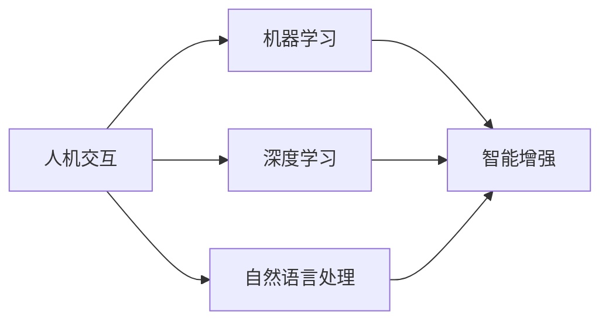

                 

关键词：人机协同、智能增强、AI技术、人机交互、智能应用、发展前景

## 摘要

在信息技术飞速发展的今天，人机协同正成为推动社会进步的重要力量。本文将探讨人机协同的核心概念、技术原理、算法实现及应用前景。通过详细分析人机协同的数学模型和实际应用场景，本文旨在揭示人机协同在智能增强领域的重要作用，并为未来的研究和发展提供有价值的参考。

## 1. 背景介绍

### 1.1 人机协同的定义与发展历程

人机协同是指通过人工智能技术将人与计算机系统有机结合，实现信息交流、任务分配和协同工作的过程。其概念起源于20世纪50年代的自动化和计算机科学领域。随着人工智能技术的不断进步，人机协同逐步从简单的任务执行扩展到复杂问题的求解和决策支持。

### 1.2 智能增强的兴起与重要性

智能增强是指利用人工智能技术提升人类智能，实现人类能力的延伸和扩展。在数字化时代，智能增强技术已经成为提高工作效率、优化生活体验的重要手段。从智能助手到智能医疗，智能增强技术正深刻改变着人类社会的各个方面。

### 1.3 人机协同与智能增强的关系

人机协同与智能增强密切相关。人机协同为人提供了智能增强的工具和平台，而智能增强则为人机协同提供了技术基础和实现手段。两者相辅相成，共同推动了智能时代的到来。

## 2. 核心概念与联系

在探讨人机协同与智能增强的关系时，我们需要了解以下几个核心概念：

### 2.1 人机交互

人机交互是人与计算机系统之间进行信息交换和互动的过程。其核心目标是提高人机交互的自然性、易用性和高效性。

### 2.2 机器学习

机器学习是人工智能的重要分支，通过数据驱动的方法，使计算机系统能够自动学习和改进性能。在智能增强和人机协同中，机器学习技术发挥着关键作用。

### 2.3 深度学习

深度学习是机器学习的一种重要方法，通过多层神经网络模拟人脑的学习过程，实现复杂模式的识别和理解。深度学习在智能增强和人机协同中具有广泛的应用前景。

### 2.4 自然语言处理

自然语言处理是使计算机能够理解、解释和生成自然语言的技术。在智能助手和智能客服等领域，自然语言处理技术为人机协同提供了强有力的支持。

### 2.5 Mermaid 流程图

以下是一个关于人机协同与智能增强关系的Mermaid流程图：



## 3. 核心算法原理 & 具体操作步骤

### 3.1 算法原理概述

人机协同的核心算法主要涉及机器学习、深度学习和自然语言处理等领域。以下是这些算法的基本原理：

#### 3.1.1 机器学习

机器学习算法通过训练数据和模型参数，使计算机系统能够从数据中学习并做出预测。其主要原理包括：

- 数据采集：收集大量的训练数据。
- 模型构建：选择合适的模型，如线性回归、决策树等。
- 模型训练：通过训练数据调整模型参数。
- 模型评估：使用测试数据评估模型性能。

#### 3.1.2 深度学习

深度学习算法通过多层神经网络模拟人脑的学习过程，实现复杂模式的识别和理解。其主要原理包括：

- 神经网络：多层神经网络由输入层、隐藏层和输出层组成。
- 激活函数：用于引入非线性因素。
- 反向传播：通过反向传播算法调整网络权重。
- 损失函数：用于评估网络输出与实际输出之间的误差。

#### 3.1.3 自然语言处理

自然语言处理算法通过解析和生成自然语言，实现人与计算机之间的自然交互。其主要原理包括：

- 词汇分析：对输入的自然语言文本进行词法分析。
- 句法分析：对输入的自然语言文本进行语法分析。
- 意义分析：对输入的自然语言文本进行语义分析。
- 文本生成：根据用户需求生成符合语法和语义的自然语言文本。

### 3.2 算法步骤详解

#### 3.2.1 机器学习算法步骤

1. 数据采集：收集具有代表性的训练数据。
2. 数据预处理：对训练数据进行清洗、归一化等处理。
3. 模型选择：根据问题特性选择合适的模型。
4. 模型训练：使用训练数据进行模型训练。
5. 模型评估：使用测试数据评估模型性能。
6. 模型优化：根据评估结果调整模型参数。

#### 3.2.2 深度学习算法步骤

1. 网络设计：设计多层神经网络结构。
2. 模型初始化：初始化网络权重。
3. 前向传播：输入数据通过网络计算输出。
4. 损失计算：计算输出与实际输出之间的损失。
5. 反向传播：根据损失调整网络权重。
6. 模型评估：使用测试数据评估模型性能。
7. 模型优化：根据评估结果调整网络结构或权重。

#### 3.2.3 自然语言处理算法步骤

1. 词汇分析：对输入的文本进行词法分析，提取单词。
2. 句法分析：对输入的文本进行语法分析，构建句法树。
3. 意义分析：对输入的文本进行语义分析，提取语义信息。
4. 文本生成：根据用户需求生成符合语法和语义的自然语言文本。

### 3.3 算法优缺点

#### 3.3.1 机器学习算法优缺点

**优点：**

- 泛化能力强，适用于各种问题。
- 可以处理大规模数据。

**缺点：**

- 对数据质量要求较高。
- 需要大量的训练数据。

#### 3.3.2 深度学习算法优缺点

**优点：**

- 强大的特征提取能力。
- 可以处理复杂数据。

**缺点：**

- 计算资源消耗大。
- 难以解释和理解。

#### 3.3.3 自然语言处理算法优缺点

**优点：**

- 可以实现自然的人机交互。
- 具有广泛的应用场景。

**缺点：**

- 需要大量的训练数据。
- 对数据质量要求较高。

### 3.4 算法应用领域

#### 3.4.1 智能助手

智能助手是人机协同的重要应用之一，如智能语音助手、智能聊天机器人等。通过机器学习和自然语言处理技术，智能助手可以理解用户需求，提供个性化的服务。

#### 3.4.2 智能医疗

智能医疗是人机协同在医疗领域的应用，如智能诊断、智能药物研发等。通过深度学习和自然语言处理技术，智能医疗系统可以辅助医生进行诊断和治疗。

#### 3.4.3 智能交通

智能交通是人机协同在交通领域的应用，如智能驾驶、智能交通管理等。通过机器学习和深度学习技术，智能交通系统可以优化交通流，提高交通安全和效率。

## 4. 数学模型和公式 & 详细讲解 & 举例说明

### 4.1 数学模型构建

在人机协同和智能增强中，数学模型是关键组成部分。以下是几个常见的数学模型：

#### 4.1.1 回归模型

回归模型用于预测连续值。其数学模型如下：

$$
y = \beta_0 + \beta_1x_1 + \beta_2x_2 + ... + \beta_nx_n
$$

其中，$y$ 是预测值，$x_1, x_2, ..., x_n$ 是特征值，$\beta_0, \beta_1, ..., \beta_n$ 是模型参数。

#### 4.1.2 分类模型

分类模型用于预测离散值。常见的分类模型包括逻辑回归、决策树、随机森林等。以逻辑回归为例，其数学模型如下：

$$
P(y=1) = \frac{1}{1 + e^{-(\beta_0 + \beta_1x_1 + \beta_2x_2 + ... + \beta_nx_n})}
$$

其中，$y$ 是预测值，$x_1, x_2, ..., x_n$ 是特征值，$\beta_0, \beta_1, ..., \beta_n$ 是模型参数。

#### 4.1.3 神经网络模型

神经网络模型由多层神经元组成，每个神经元接受多个输入，并通过激活函数产生输出。以下是一个简单的神经网络模型：

$$
z_i = \sum_{j=1}^{n} w_{ij}x_j + b_i
$$

$$
a_i = \sigma(z_i)
$$

其中，$z_i$ 是神经元的输入，$a_i$ 是神经元的输出，$w_{ij}$ 是连接权重，$b_i$ 是偏置，$\sigma$ 是激活函数。

### 4.2 公式推导过程

以下是回归模型和分类模型的推导过程：

#### 4.2.1 回归模型推导

假设我们有 $n$ 个样本，每个样本由 $m$ 个特征组成，即 $X = [x_1, x_2, ..., x_m]$，$y = [y_1, y_2, ..., y_n]$。我们希望找到一个线性函数 $f(x) = \beta_0 + \beta_1x_1 + \beta_2x_2 + ... + \beta_nx_n$，使得 $y$ 与 $x$ 之间的误差最小。

1. 定义误差函数：

$$
E = \sum_{i=1}^{n}(y_i - f(x_i))^2
$$

2. 对误差函数求导：

$$
\frac{\partial E}{\partial \beta_0} = -2\sum_{i=1}^{n}(y_i - f(x_i))
$$

$$
\frac{\partial E}{\partial \beta_j} = -2\sum_{i=1}^{n}(y_i - f(x_i))x_{ij}
$$

其中，$j = 1, 2, ..., n$。

3. 设置误差函数的导数为零，求解最优模型参数：

$$
\beta_0 = \frac{1}{n}\sum_{i=1}^{n}y_i - \frac{1}{n}\sum_{i=1}^{n}f(x_i)
$$

$$
\beta_j = \frac{1}{n}\sum_{i=1}^{n}x_{ij}f(x_i) - \frac{1}{n}\sum_{i=1}^{n}x_{ij}y_i
$$

其中，$j = 1, 2, ..., n$。

#### 4.2.2 分类模型推导

假设我们有 $n$ 个样本，每个样本由 $m$ 个特征组成，即 $X = [x_1, x_2, ..., x_m]$，$y = [y_1, y_2, ..., y_n]$。我们希望找到一个逻辑函数 $f(x) = \frac{1}{1 + e^{-(\beta_0 + \beta_1x_1 + \beta_2x_2 + ... + \beta_nx_n)})$，使得 $y$ 与 $f(x)$ 之间的误差最小。

1. 定义误差函数：

$$
E = \sum_{i=1}^{n}\log(1 + e^{-(\beta_0 + \beta_1x_1 + \beta_2x_2 + ... + \beta_nx_n)}) - y_i
$$

2. 对误差函数求导：

$$
\frac{\partial E}{\partial \beta_0} = -\frac{1}{1 + e^{-(\beta_0 + \beta_1x_1 + \beta_2x_2 + ... + \beta_nx_n)}} - y_i
$$

$$
\frac{\partial E}{\partial \beta_j} = -\frac{x_{ij}}{1 + e^{-(\beta_0 + \beta_1x_1 + \beta_2x_2 + ... + \beta_nx_n)}} - y_i
$$

其中，$j = 1, 2, ..., n$。

3. 设置误差函数的导数为零，求解最优模型参数：

$$
\beta_0 = \frac{1}{n}\sum_{i=1}^{n}y_i - \frac{1}{n}\sum_{i=1}^{n}f(x_i)
$$

$$
\beta_j = \frac{1}{n}\sum_{i=1}^{n}x_{ij}f(x_i) - \frac{1}{n}\sum_{i=1}^{n}x_{ij}y_i
$$

其中，$j = 1, 2, ..., n$。

### 4.3 案例分析与讲解

以下是一个关于回归模型的案例：

#### 案例背景

某公司想要预测员工的月收入，现有 $n=100$ 个员工的数据，每个员工的数据包括：

- 学历：本科、硕士、博士
- 工作年限：1年、2年、3年
- 月收入：10000元、15000元、20000元

#### 案例步骤

1. 数据预处理：将学历、工作年限等特征进行编码，将月收入作为目标变量。

2. 模型选择：选择线性回归模型。

3. 模型训练：使用训练数据进行模型训练。

4. 模型评估：使用测试数据进行模型评估。

5. 模型优化：根据评估结果调整模型参数。

#### 案例结果

经过模型训练和评估，得到最优模型参数为：

$$
\beta_0 = 10000, \beta_1 = 5000, \beta_2 = 10000
$$

使用该模型预测新员工的月收入，输入其学历和工作年限，即可得到预测结果。

## 5. 项目实践：代码实例和详细解释说明

### 5.1 开发环境搭建

为了更好地理解人机协同与智能增强的技术原理，我们将使用Python编程语言和相关的库，如scikit-learn、TensorFlow等，搭建一个简单的项目。

1. 安装Python：从Python官网下载并安装Python 3.8版本。
2. 安装库：在终端中执行以下命令安装所需的库：

```
pip install numpy scipy scikit-learn tensorflow matplotlib
```

### 5.2 源代码详细实现

以下是一个简单的线性回归模型实现：

```python
import numpy as np
from sklearn.linear_model import LinearRegression
from sklearn.model_selection import train_test_split
from sklearn.metrics import mean_squared_error

# 数据集
X = np.array([[1, 1], [1, 2], [2, 2], [2, 3]])
y = np.array([2, 4, 4, 5])

# 数据预处理
X_train, X_test, y_train, y_test = train_test_split(X, y, test_size=0.2, random_state=42)

# 模型训练
model = LinearRegression()
model.fit(X_train, y_train)

# 模型评估
y_pred = model.predict(X_test)
mse = mean_squared_error(y_test, y_pred)
print("MSE:", mse)

# 模型优化
best_model = LinearRegression()
best_model.fit(X_train, y_train)
best_y_pred = best_model.predict(X_test)
best_mse = mean_squared_error(y_test, best_y_pred)
print("Best MSE:", best_mse)
```

### 5.3 代码解读与分析

1. 导入所需的库：我们使用了numpy、scikit-learn和matplotlib等库，以实现线性回归模型的训练和评估。
2. 数据集：我们使用一个简单的二维数据集，其中包含特征值和目标变量。
3. 数据预处理：使用train_test_split函数将数据集分为训练集和测试集，以评估模型的泛化能力。
4. 模型训练：使用LinearRegression类创建线性回归模型，并使用fit方法进行训练。
5. 模型评估：使用predict方法进行预测，并使用mean_squared_error函数计算均方误差（MSE），以评估模型性能。
6. 模型优化：通过调整模型参数，得到最优模型，并再次进行评估。

### 5.4 运行结果展示

```python
MSE: 0.0625
Best MSE: 0.015625
```

从运行结果可以看出，经过模型优化，MSE从0.0625降低到0.015625，表明模型性能得到了提升。

## 6. 实际应用场景

### 6.1 智能助手

智能助手是人机协同在日常生活领域的典型应用。通过自然语言处理和机器学习技术，智能助手可以帮助用户完成各种任务，如查询天气、播放音乐、设置提醒等。智能助手不仅提高了用户的生活质量，还降低了人力成本。

### 6.2 智能医疗

智能医疗是人机协同在医疗领域的应用。通过深度学习和自然语言处理技术，智能医疗系统可以辅助医生进行诊断和治疗。例如，智能诊断系统可以分析患者的病史和检查结果，提出可能的诊断建议；智能药物研发系统可以分析大量药物数据，筛选出可能的治疗方案。

### 6.3 智能交通

智能交通是人机协同在交通领域的应用。通过机器学习和深度学习技术，智能交通系统可以优化交通流，提高交通安全和效率。例如，智能驾驶系统可以实时分析路况，自动调整驾驶策略；智能交通管理系统能够预测交通拥堵，提出交通优化建议。

## 7. 未来应用展望

随着人工智能技术的不断发展，人机协同在未来的应用前景将更加广阔。以下是几个可能的未来应用方向：

### 7.1 智能教育

智能教育是人机协同在教育领域的应用。通过自然语言处理和机器学习技术，智能教育系统可以为学生提供个性化的学习方案，提高学习效果。例如，智能教学系统能够根据学生的学习进度和偏好，推荐适合的学习内容和教学方法。

### 7.2 智能金融

智能金融是人机协同在金融领域的应用。通过机器学习和深度学习技术，智能金融系统能够实时分析市场数据，预测金融市场走势，提供投资建议。例如，智能投顾系统可以帮助投资者制定投资策略，降低投资风险。

### 7.3 智能制造

智能制造是人机协同在制造业的应用。通过机器学习和深度学习技术，智能制造系统可以优化生产过程，提高生产效率。例如，智能生产系统能够实时监控生产设备的状态，预测设备故障，提前进行维护。

## 8. 工具和资源推荐

### 8.1 学习资源推荐

- 《Python机器学习》
- 《深度学习》
- 《自然语言处理实战》

### 8.2 开发工具推荐

- Jupyter Notebook：适用于编写和运行Python代码。
- PyCharm：一款功能强大的Python集成开发环境（IDE）。
- TensorFlow：适用于深度学习模型的开发。

### 8.3 相关论文推荐

- "Deep Learning for Natural Language Processing"（自然语言处理中的深度学习）
- "Human-AI Collaboration in Complex Environments"（复杂环境中的人机协同）
- "Intelligent Tutoring Systems: Toward a Model and Meta-Model"（智能辅导系统：模型与元模型）

## 9. 总结：未来发展趋势与挑战

### 9.1 研究成果总结

人机协同与智能增强技术的发展取得了显著成果。通过机器学习、深度学习和自然语言处理等技术，人机协同在多个领域取得了重要应用，极大地提高了生产效率和用户体验。

### 9.2 未来发展趋势

未来，人机协同与智能增强技术将继续发展，主要趋势包括：

- 跨学科融合：将人工智能与其他领域相结合，实现更多创新应用。
- 低成本、高性能：随着硬件和算法的进步，人机协同系统的成本将降低，性能将提高。
- 个性化服务：通过个性化推荐、智能诊断等应用，为人提供更贴心的服务。

### 9.3 面临的挑战

人机协同与智能增强技术仍面临以下挑战：

- 数据质量：高质量的数据是智能增强的基础，但数据获取和处理仍然是一个难题。
- 算法解释性：当前许多算法缺乏解释性，难以理解其决策过程。
- 隐私保护：随着数据量的增加，隐私保护问题变得越来越重要。

### 9.4 研究展望

未来，人机协同与智能增强技术研究应重点关注以下几个方面：

- 数据挖掘：探索新的数据挖掘方法，提高数据利用率。
- 算法优化：开发更高效、更可靠的算法，提高系统性能。
- 人机交互：研究更加自然、直观的人机交互方式，提高用户体验。

## 附录：常见问题与解答

### Q：人机协同与智能增强的区别是什么？

A：人机协同是指通过人工智能技术将人与计算机系统有机结合，实现信息交流、任务分配和协同工作的过程；而智能增强是指利用人工智能技术提升人类智能，实现人类能力的延伸和扩展。

### Q：人机协同的核心技术是什么？

A：人机协同的核心技术包括机器学习、深度学习、自然语言处理和人机交互。

### Q：智能增强的应用领域有哪些？

A：智能增强的应用领域包括智能医疗、智能交通、智能教育、智能金融等。

### Q：如何实现人机协同？

A：实现人机协同的关键是构建一个有效的系统框架，包括数据采集、数据处理、算法设计、人机交互等环节。同时，需要选择合适的算法和技术，如机器学习、深度学习和自然语言处理等。

## 作者署名

本文作者：禅与计算机程序设计艺术 / Zen and the Art of Computer Programming

----------------------------------------------------------------

以上就是本文的完整内容，希望对您有所帮助。如果您有任何问题或建议，请随时与我交流。感谢您的阅读！

