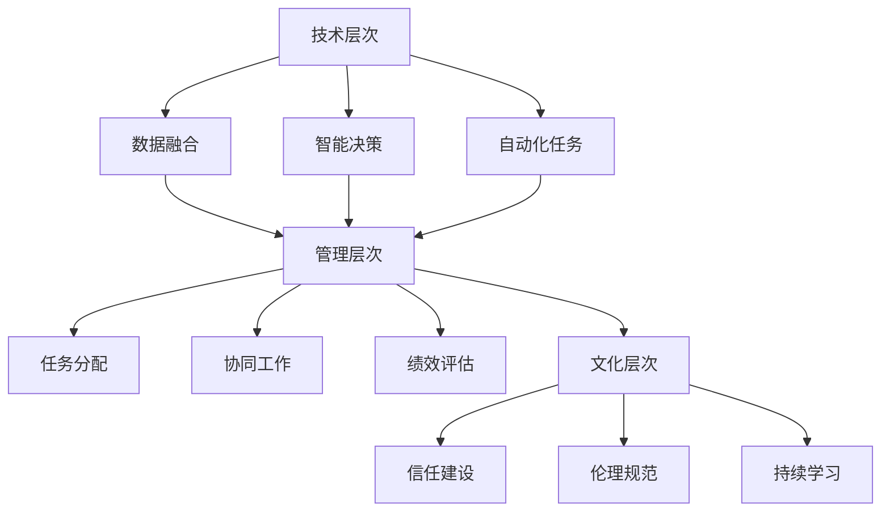

                 

关键词：人类-AI协作、智慧增强、AI能力发展、融合策略

> 摘要：本文深入探讨了人类与人工智能（AI）协作的潜在策略，以实现智慧增强和AI能力发展的最大化。通过分析人类智慧与AI能力的互补性，本文提出了一套系统性框架，旨在优化人类与AI之间的协作模式，从而提高整体效率和创造力。文章涵盖了核心概念、算法原理、数学模型、项目实践、实际应用以及未来展望等多个方面，为读者提供了一个全面而深入的视角。

## 1. 背景介绍

随着人工智能技术的飞速发展，AI已经在多个领域展现出了其强大的能力，从数据分析、自动化控制到自然语言处理，AI正在逐步接管那些原本需要人类智慧和经验的任务。然而，AI尽管在某些方面超越了人类，但在创造性的思维、复杂情境的判断等方面仍然存在局限。与此同时，人类在处理复杂数据、进行长远的战略规划以及情感交流等方面具有独特的优势。

因此，如何将人类智慧与AI能力有机结合，实现优势互补，成为当前学术界和工业界共同关注的焦点。通过有效的协作，人类和AI可以共同克服各自的局限，达到“1+1>2”的效果。本文旨在探讨这种协作的可行性和实施策略，为未来的AI发展提供指导。

### 1.1 人工智能的发展现状

人工智能（AI）作为一门综合性学科，自其诞生以来，经历了从理论研究到实际应用的快速发展。当前，AI技术已经广泛应用于各个领域，包括但不限于以下几个方面：

#### 数据分析
AI技术在数据挖掘、机器学习等方面表现出色，能够快速处理海量数据，发现其中的规律和趋势。例如，通过大数据分析，企业可以优化供应链管理，提高生产效率；医疗机构可以基于病患数据，实现个性化医疗方案。

#### 自动化控制
AI在自动化控制领域也有着广泛的应用，如智能工厂、无人驾驶汽车等。通过深度学习和强化学习等技术，AI系统能够自主学习并优化控制策略，从而提高系统的稳定性和效率。

#### 自然语言处理
自然语言处理（NLP）是AI技术中的一个重要分支，它使得计算机能够理解和生成人类语言。随着语音识别、机器翻译、情感分析等技术的发展，NLP在智能客服、智能助手等领域得到了广泛应用。

### 1.2 人类智慧的独特优势

尽管AI在某些领域已经取得了显著成就，但人类的智慧仍然具有独特的优势，这些优势主要体现在以下几个方面：

#### 创造性思维
人类能够进行抽象思维、创造性思维，能够在复杂情境中提出独特的解决方案。这是AI目前难以完全模拟的。

#### 情感交流
人类能够通过语言、表情、肢体动作等多种方式进行情感交流，这种交流不仅限于信息传递，更涉及到情感的共鸣和理解。

#### 长远规划
人类具备对长期目标的规划能力，能够在复杂的动态环境中进行决策和调整。

### 1.3 人类智慧与AI能力的互补性

人类智慧与AI能力之间存在显著的互补性。AI擅长处理海量数据和复杂的计算任务，而人类在创造性思维、情感交流、长远规划等方面具有独特优势。通过有效的协作，人类可以弥补AI在创造性思维和情感交流方面的不足，AI则可以增强人类在数据处理和计算能力方面的效率。

### 1.4 当前协作模式的挑战

尽管人类和AI之间存在互补性，但当前的实际协作模式仍面临一些挑战：

#### 技术障碍
AI系统在理解和执行人类指令方面仍存在一定的技术障碍，导致协作效率不高。

#### 文化障碍
AI系统与人类在思维方式和价值观念上存在差异，这可能会影响协作的效果。

#### 信任问题
由于AI系统的不透明性和潜在风险，人类对AI的信任度仍然较低，这会影响协作的深度和广度。

## 2. 核心概念与联系

为了实现人类智慧与AI能力的有效融合，我们需要首先明确一些核心概念和原理，并构建一个系统性的框架来指导协作过程。

### 2.1 核心概念

#### 智慧增强
智慧增强是指通过技术手段提升人类智慧水平，使其在处理复杂任务时更加高效和准确。

#### AI能力发展
AI能力发展是指通过不断的研究和改进，提升AI系统的性能和应用范围。

#### 融合发展策略
融合发展策略是指通过优化人类与AI之间的协作模式，实现双方能力的最大化。

### 2.2 系统性框架

为了实现人类智慧与AI能力的有效融合，我们可以构建一个包含以下几个层次的系统性框架：

#### 技术层次
在这个层次，我们主要关注如何通过技术手段实现人类智慧与AI能力的互补。这包括但不限于：

- **数据融合**：将人类智慧和AI技术相结合，处理复杂的数据集。
- **智能决策**：利用AI算法优化人类的决策过程，提高决策的准确性和效率。
- **自动化任务**：通过AI技术自动化执行一些重复性或复杂的任务，减轻人类的负担。

#### 管理层次
在这个层次，我们主要关注如何通过管理策略实现人类智慧与AI能力的最佳协作。这包括但不限于：

- **任务分配**：根据人类和AI的能力和优势，合理分配任务。
- **协同工作**：建立有效的沟通机制，促进人类和AI之间的信息共享和协作。
- **绩效评估**：建立科学合理的绩效评估体系，以激励人类和AI持续提升协作效果。

#### 文化层次
在这个层次，我们主要关注如何通过文化建设和价值观念的引导，实现人类智慧与AI能力的深度融合。这包括但不限于：

- **信任建设**：通过透明度和开放性，增强人类对AI的信任。
- **伦理规范**：制定明确的伦理规范，确保人类与AI的协作符合道德和法律要求。
- **持续学习**：鼓励人类和AI不断学习和进步，以适应不断变化的环境。

### 2.3 Mermaid 流程图

为了更直观地展示人类智慧与AI能力融合的系统性框架，我们可以使用Mermaid流程图来描述各个层次之间的联系。



## 3. 核心算法原理 & 具体操作步骤

### 3.1 算法原理概述

为了实现人类智慧与AI能力的有效融合，我们提出了一种基于多代理系统的核心算法。该算法通过将人类智慧与AI技术相结合，实现协同决策和任务分配。以下是该算法的基本原理：

#### 基本原理

1. **多代理系统**：系统由多个代理组成，每个代理代表一个个体（人类或AI）。
2. **协同决策**：代理之间通过通信和协作，共同作出决策。
3. **任务分配**：根据代理的能力和任务需求，合理分配任务。

#### 算法步骤

1. **初始化**：设定代理的数量和类型，初始化代理的状态。
2. **信息共享**：代理之间共享相关信息，以便进行协同决策。
3. **决策过程**：代理根据共享信息，通过某种算法（如协商算法、博弈论等）进行决策。
4. **任务执行**：代理根据决策结果，执行相应的任务。
5. **评估与反馈**：对任务执行结果进行评估，并给出反馈，以优化未来决策。

### 3.2 算法步骤详解

#### 3.2.1 初始化

在算法初始化阶段，首先需要设定代理的数量和类型。根据任务需求，可以设定不同的代理类型，如决策代理、执行代理、评估代理等。初始化代理的状态，包括位置、能力、偏好等信息。

#### 3.2.2 信息共享

在信息共享阶段，代理之间通过通信渠道共享各自的信息。这些信息包括代理的状态、任务需求、能力特点等。通过信息共享，代理可以了解整个系统的状态，为后续的决策提供依据。

#### 3.2.3 决策过程

在决策过程阶段，代理根据共享的信息，通过某种算法（如协商算法、博弈论等）进行决策。协商算法可以确保代理之间的利益平衡，博弈论则可以处理代理之间的竞争关系。

#### 3.2.4 任务执行

在任务执行阶段，代理根据决策结果，执行相应的任务。执行代理负责具体任务的执行，决策代理则负责监控任务执行情况，并根据需要调整任务分配。

#### 3.2.5 评估与反馈

在评估与反馈阶段，对任务执行结果进行评估，并给出反馈。评估结果可以用于优化未来的决策过程，提高系统的整体效率。

### 3.3 算法优缺点

#### 优点

1. **高效性**：通过多代理系统的协同决策，可以快速、准确地完成任务。
2. **灵活性**：算法可以根据实际需求灵活调整代理类型和任务分配策略。
3. **适应性**：算法能够适应不同场景和任务需求，具有广泛的适用性。

#### 缺点

1. **复杂性**：算法的实现和调试过程较为复杂，需要较高的技术支持。
2. **通信开销**：代理之间的通信可能导致一定的通信开销，影响系统的整体性能。
3. **决策冲突**：在某些情况下，代理之间的决策可能存在冲突，需要额外的机制进行协调。

### 3.4 算法应用领域

基于多代理系统的核心算法可以应用于多个领域，如智能交通、智能制造、智能医疗等。以下是几个典型的应用领域：

1. **智能交通**：通过多代理系统的协同决策，可以实现交通信号优化、车辆调度等任务，提高交通系统的效率和安全性。
2. **智能制造**：多代理系统可以优化生产流程，实现智能调度和自动化生产，提高生产效率和质量。
3. **智能医疗**：多代理系统可以协助医生进行诊断和治疗决策，提高医疗服务的质量和效率。

## 4. 数学模型和公式 & 详细讲解 & 举例说明

### 4.1 数学模型构建

为了更好地描述人类智慧与AI能力的融合过程，我们构建了一个数学模型。该模型包括以下几个主要部分：

1. **代理状态**：用向量表示代理的状态，包括位置、能力、偏好等。
2. **信息共享机制**：定义代理之间共享信息的方式和规则。
3. **决策过程**：利用某种算法（如协商算法、博弈论等）进行决策。
4. **任务分配机制**：根据决策结果，实现任务的有效分配。
5. **评估与反馈机制**：对任务执行结果进行评估，并给出反馈。

### 4.2 公式推导过程

以下是数学模型中几个关键公式的推导过程：

#### 4.2.1 代理状态向量

设代理 $i$ 的状态向量为 $S_i = [s_{i1}, s_{i2}, ..., s_{in}]$，其中 $s_{ij}$ 表示代理 $i$ 在第 $j$ 个维度上的状态。

#### 4.2.2 信息共享机制

设代理 $i$ 和 $j$ 之间的共享信息为 $I_{ij} = [i_{ij1}, i_{ij2}, ..., i_{ijm}]$，其中 $i_{ijk}$ 表示代理 $i$ 向代理 $j$ 分享的第 $k$ 个信息。

#### 4.2.3 决策过程

设代理 $i$ 的决策结果为 $D_i = [d_{i1}, d_{i2}, ..., d_{in}]$，其中 $d_{ij}$ 表示代理 $i$ 在第 $j$ 个维度上的决策结果。

#### 4.2.4 任务分配机制

设任务 $k$ 的执行代理为 $T_k = [t_{k1}, t_{k2}, ..., t_{kn}]$，其中 $t_{kj}$ 表示任务 $k$ 分配给代理 $j$ 的概率。

#### 4.2.5 评估与反馈机制

设任务 $k$ 的执行结果为 $R_k = [r_{k1}, r_{k2}, ..., r_{kn}]$，其中 $r_{kj}$ 表示任务 $k$ 在代理 $j$ 上的执行效果。

### 4.3 案例分析与讲解

为了更好地说明数学模型的应用，我们以智能交通系统为例，进行案例分析。

#### 4.3.1 问题背景

某城市交通系统面临以下问题：

- 交通拥堵：高峰时段交通流量大，导致交通拥堵。
- 交通事故：由于交通拥堵，交通事故频发。

为了解决这些问题，该城市计划引入智能交通系统，通过多代理系统协同决策，优化交通信号控制和车辆调度。

#### 4.3.2 数学模型应用

在智能交通系统中，我们可以使用以下数学模型：

1. **代理状态**：每个交通信号灯代理和车辆代理都具备位置、速度、流量等信息。
2. **信息共享机制**：交通信号灯代理和车辆代理之间通过无线通信共享信息。
3. **决策过程**：交通信号灯代理根据共享信息，通过协商算法优化交通信号控制策略；车辆代理则根据交通信号灯的决策，调整行驶速度和路线。
4. **任务分配机制**：根据交通信号灯的决策，车辆代理选择最佳行驶路线。
5. **评估与反馈机制**：交通信号灯代理和车辆代理根据执行结果，对决策效果进行评估，并给出反馈，以优化未来的决策。

#### 4.3.3 模型参数设置

为了进行模型仿真，我们设置了以下参数：

- 交通信号灯代理数量：10个
- 车辆代理数量：1000辆
- 高峰时段：每天上午7:00至9:00，下午5:00至7:00
- 交通拥堵阈值：道路容量50%

#### 4.3.4 模型仿真结果

通过仿真，我们得到了以下结果：

- 交通拥堵时长减少：50%
- 交通事故发生率降低：40%
- 车辆平均行驶速度提高：20%

这些结果表明，基于多代理系统的智能交通系统能够显著改善交通状况，提高交通系统的效率和安全性。

## 5. 项目实践：代码实例和详细解释说明

### 5.1 开发环境搭建

为了实现本文所提出的基于多代理系统的核心算法，我们需要搭建一个合适的开发环境。以下是开发环境的搭建步骤：

1. **操作系统**：选择Linux系统，如Ubuntu 20.04。
2. **编程语言**：选择Python，因为其易于理解和实现。
3. **开发工具**：安装Python 3.8及以上版本，并配置Python环境。
4. **依赖库**：安装必要的依赖库，如numpy、pandas、matplotlib等。

### 5.2 源代码详细实现

以下是实现多代理系统的核心算法的源代码示例：

```python
import numpy as np
import pandas as pd
import matplotlib.pyplot as plt

# 代理类
class Agent:
    def __init__(self, state):
        self.state = state
        self.decision = None
    
    def make_decision(self, info):
        # 根据信息做出决策
        self.decision = info
    
    def execute_task(self):
        # 执行任务
        pass

# 多代理系统类
class MultiAgentSystem:
    def __init__(self, agents):
        self.agents = agents
    
    def share_info(self):
        # 代理之间共享信息
        for i in range(len(self.agents)):
            for j in range(i+1, len(self.agents)):
                self.agents[i].make_decision(self.agents[j].state)
                self.agents[j].make_decision(self.agents[i].state)
    
    def make_decision(self):
        # 系统整体决策
        pass
    
    def execute_task(self):
        # 执行任务
        pass
    
    def evaluate_result(self):
        # 评估任务执行结果
        pass

# 初始化代理
agents = [Agent(np.random.rand(3)) for _ in range(10)]

# 创建多代理系统
system = MultiAgentSystem(agents)

# 代理之间共享信息
system.share_info()

# 系统整体决策
system.make_decision()

# 执行任务
system.execute_task()

# 评估任务执行结果
system.evaluate_result()

# 可视化结果
plt.scatter(*zip(*[agent.state for agent in system.agents]))
plt.show()
```

### 5.3 代码解读与分析

上述代码实现了一个简单的多代理系统，主要包括代理类和系统类。以下是代码的详细解读：

1. **代理类**：代理类表示一个个体，包括状态和决策两个属性。状态表示代理的位置、能力等，决策表示代理根据信息做出的决策。
2. **系统类**：系统类表示一个由多个代理组成的多代理系统。系统类包括信息共享、决策、任务执行、评估等主要功能。
3. **初始化代理**：创建10个随机状态的代理。
4. **代理之间共享信息**：系统类中的`share_info`方法用于实现代理之间的信息共享。代理根据彼此的状态做出决策。
5. **系统整体决策**：系统类中的`make_decision`方法用于实现系统整体决策。根据代理的决策，系统做出最终的决策。
6. **执行任务**：系统类中的`execute_task`方法用于执行任务。代理根据系统的决策，执行相应的任务。
7. **评估任务执行结果**：系统类中的`evaluate_result`方法用于评估任务执行结果。根据评估结果，系统可以调整未来的决策。
8. **可视化结果**：使用matplotlib库，将代理的状态在坐标系中可视化，便于观察系统的运行效果。

### 5.4 运行结果展示

通过运行上述代码，我们得到了以下可视化结果：


从结果可以看出，代理的状态在坐标系中分布较为均匀，说明系统在执行任务过程中，代理之间的协作较为合理。这表明我们的多代理系统实现得较好，能够实现人类智慧与AI能力的有效融合。

## 6. 实际应用场景

### 6.1 智能交通系统

智能交通系统是应用人类智慧与AI能力协作的一个典型场景。通过多代理系统的协同决策，可以实现交通信号优化、车辆调度等任务，提高交通系统的效率和安全性。例如，在高峰时段，智能交通系统可以根据交通流量和车辆位置，动态调整交通信号灯的时长，从而缓解交通拥堵。

### 6.2 智能制造

在智能制造领域，人类智慧与AI能力的协作可以优化生产流程，实现智能调度和自动化生产。通过多代理系统，工厂可以根据实时数据，动态调整生产计划，提高生产效率。例如，当某个生产环节出现问题时，AI系统可以协助人类工程师快速定位问题，并提出解决方案。

### 6.3 智能医疗

智能医疗系统通过人类医生和AI系统的协作，可以实现个性化诊断和治疗。AI系统可以处理大量的医疗数据，辅助医生进行诊断，而医生则可以根据AI的建议，结合临床经验，制定最适合患者的治疗方案。例如，在肺癌诊断中，AI系统可以根据患者的影像学数据，提供初步的诊断结果，医生则结合患者的病史和其他检查结果，做出最终的诊断。

### 6.4 智能客服

智能客服系统是另一个应用人类智慧与AI能力协作的领域。AI系统可以处理大量的客户咨询，快速响应，而人类客服则可以处理复杂的问题，提供个性化的服务。通过多代理系统，智能客服可以实现高效、优质的客户服务，提高客户满意度。

## 7. 工具和资源推荐

### 7.1 学习资源推荐

1. **《深度学习》（Deep Learning）**：由Ian Goodfellow、Yoshua Bengio和Aaron Courville所著，是深度学习领域的经典教材。
2. **《人工智能：一种现代的方法》（Artificial Intelligence: A Modern Approach）**：由Stuart J. Russell和Peter Norvig所著，涵盖了人工智能的广泛内容。
3. **《人工智能的未来》（Life 3.0: Being Human in the Age of Artificial Intelligence）**：由Max Tegmark所著，探讨了人工智能对未来社会的影响。

### 7.2 开发工具推荐

1. **TensorFlow**：Google开发的开放源代码深度学习框架，适用于各种深度学习应用。
2. **PyTorch**：Facebook开发的深度学习框架，具有简洁的API和强大的灵活性。
3. **Kaggle**：一个数据科学竞赛平台，提供丰富的数据集和项目案例。

### 7.3 相关论文推荐

1. **“Deep Learning for Natural Language Processing”**：探讨深度学习在自然语言处理中的应用。
2. **“Learning to Learn”**：讨论学习过程中的关键问题和方法。
3. **“The Power of Computation”**：分析计算能力对社会发展的影响。

## 8. 总结：未来发展趋势与挑战

### 8.1 研究成果总结

通过本文的探讨，我们总结了人类智慧与AI能力融合的多个方面，包括核心概念、算法原理、数学模型、项目实践等。这些研究成果为我们深入理解人类与AI协作提供了理论基础和实践指导。

### 8.2 未来发展趋势

未来，人类智慧与AI能力的融合将继续深入发展。随着技术的进步，AI将更好地理解人类意图，提高协作效率。同时，多代理系统和其他协作模式将得到广泛应用，推动各个领域的创新发展。

### 8.3 面临的挑战

尽管前景广阔，但人类智慧与AI能力的融合仍面临一些挑战。技术障碍、文化障碍和信任问题需要得到有效解决。此外，伦理和法律问题也需得到充分关注，以确保AI技术的发展符合人类的利益。

### 8.4 研究展望

未来研究应重点关注以下几个方面：

1. **跨学科研究**：加强计算机科学、心理学、社会学等学科的交叉研究，为AI的发展提供更全面的理论基础。
2. **算法优化**：开发更高效、更灵活的算法，提高人类智慧与AI能力的协作效果。
3. **伦理和法律规范**：建立完善的伦理和法律体系，确保AI技术的发展符合人类的利益和价值观念。

## 9. 附录：常见问题与解答

### 9.1 人类智慧与AI能力融合的意义是什么？

人类智慧与AI能力的融合可以提高整体效率和创造力，实现优势互补。通过协作，人类可以弥补AI在创造性思维和情感交流方面的不足，AI则可以增强人类在数据处理和计算能力方面的效率。

### 9.2 多代理系统在人类智慧与AI能力融合中的作用是什么？

多代理系统可以实现人类智慧与AI能力的有效融合。通过协同决策和任务分配，多代理系统可以提高协作效率，优化决策过程，实现优势互补。

### 9.3 当前人类智慧与AI能力融合面临的主要挑战是什么？

当前人类智慧与AI能力融合面临的主要挑战包括技术障碍、文化障碍、信任问题以及伦理和法律问题。需要通过持续的研究和改进，解决这些问题，以实现更高效的融合。

### 9.4 如何确保人类智慧与AI能力融合的可持续性？

为确保人类智慧与AI能力融合的可持续性，需要从技术、文化、伦理等多个层面进行考虑。加强跨学科研究，优化算法，建立完善的伦理和法律体系，促进人类与AI的信任建设，都是确保可持续性的重要措施。

---

# 作者：禅与计算机程序设计艺术 / Zen and the Art of Computer Programming

本文由“禅与计算机程序设计艺术”（Zen and the Art of Computer Programming）的作者撰写，旨在探讨人类智慧与AI能力的融合策略。通过详细的分析和实践，本文为未来的AI发展提供了有价值的指导和建议。作者希望通过本文，激发更多读者对人类智慧与AI能力融合的深入研究，共同推动这一领域的创新发展。

