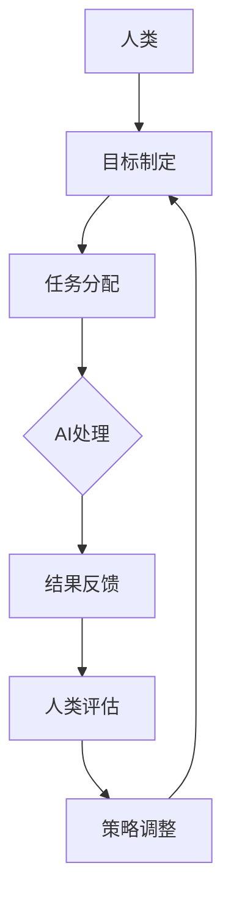

                 

关键词：人类-AI协作，智能增强，人工智能，发展趋势，预测分析，机遇挑战

## 摘要

本文旨在探讨人类与人工智能（AI）协作的未来发展趋势，分析AI如何增强人类智慧，以及在这一过程中可能面临的机遇和挑战。文章首先介绍了人类-AI协作的背景，随后深入探讨了AI的核心概念、算法原理、数学模型以及实际应用。通过一系列案例和实践，我们展示了AI在各个领域的应用场景，并对未来应用进行了展望。最后，本文总结了研究成果，提出了未来发展的趋势和面临的挑战，以及对研究的展望。

## 1. 背景介绍

在当今社会，人工智能已经成为一个炙手可热的话题。从自动驾驶、智能语音助手到医疗诊断、金融分析，AI的应用领域越来越广泛，给各行各业带来了深刻的变革。然而，与此同时，人类-AI协作也成为一个不可忽视的趋势。随着AI技术的不断发展，人类与AI的交互和协作将变得更加紧密，不仅能够提高工作效率，还能开拓新的创新方向。

人类-AI协作的兴起源于以下几个方面：

1. **技术进步**：AI算法和计算能力的提升，使得AI能够处理更加复杂的任务，并且具备更高的准确性和鲁棒性。
2. **数据增长**：随着大数据时代的到来，海量的数据为AI的发展提供了丰富的资源，有助于AI更好地学习和优化。
3. **用户需求**：随着人们对个性化、智能化服务的需求日益增长，AI成为满足这些需求的重要工具。
4. **产业升级**：在传统产业向智能化转型的大背景下，AI作为关键技术，成为推动产业升级的重要力量。

在这一背景下，人类-AI协作不仅能够提高人类的工作效率，还能激发人类的创造力，推动人类智慧的进步。因此，深入研究人类-AI协作的发展趋势，分析其带来的机遇和挑战，具有重要的理论和实践意义。

## 2. 核心概念与联系

### 2.1 人工智能的定义与分类

人工智能（Artificial Intelligence，AI）是指由计算机程序实现的智能行为，能够模拟人类的认知能力，包括感知、理解、学习、推理、决策等。根据实现方式，AI可以分为以下几类：

1. **弱AI（Narrow AI）**：也称为专用AI，指的是在特定任务上表现出人类智能水平的AI，如语音识别、图像识别、自然语言处理等。
2. **强AI（General AI）**：也称为通用AI，指的是具备与人类相同智能水平的AI，能够在各种复杂环境中自主学习和适应，但目前尚未实现。
3. **超智能AI（Super Intelligence）**：指的是超越人类智能水平的AI，目前仍处于理论阶段。

### 2.2 人类-AI协作的架构与机制

人类-AI协作的架构主要包括以下几个部分：

1. **人类角色**：人类作为决策者和监督者，负责制定目标和策略，对AI的输出进行评估和调整。
2. **AI角色**：AI作为执行者和辅助者，负责处理数据和执行任务，为人类提供智能支持。
3. **协作机制**：通过通信和协调，实现人类与AI之间的有效协作。常见的协作机制包括协同学习、协同工作、知识共享等。

### 2.3 核心概念原理的Mermaid流程图



## 3. 核心算法原理 & 具体操作步骤

### 3.1 算法原理概述

人类-AI协作的核心算法主要基于机器学习和深度学习技术，包括以下几个方面：

1. **机器学习**：通过训练模型，使AI能够根据输入数据进行预测和决策。
2. **深度学习**：利用神经网络结构，使AI具备更强的学习和泛化能力。
3. **强化学习**：通过不断尝试和反馈，使AI能够在复杂环境中学习和优化策略。

### 3.2 算法步骤详解

1. **数据收集**：收集大量标注数据，为AI训练提供基础。
2. **数据预处理**：对数据进行清洗、归一化等处理，提高数据质量。
3. **模型选择**：根据任务需求，选择合适的机器学习或深度学习模型。
4. **模型训练**：使用训练数据，对模型进行训练和优化。
5. **模型评估**：使用测试数据，对模型进行评估和调整。
6. **模型部署**：将训练好的模型部署到实际应用场景，实现人类-AI协作。

### 3.3 算法优缺点

**优点**：

1. **高效性**：AI能够在短时间内处理海量数据，提高工作效率。
2. **准确性**：通过机器学习和深度学习，AI能够实现高精度的预测和决策。
3. **灵活性**：AI能够根据环境和需求的变化，快速调整策略。

**缺点**：

1. **依赖数据**：AI的性能依赖于数据质量和数量，数据不足或质量差可能导致性能下降。
2. **黑箱问题**：深度学习模型内部机制复杂，难以解释和理解。
3. **安全隐患**：AI系统的安全性和隐私保护问题值得关注。

### 3.4 算法应用领域

人类-AI协作在各个领域都有广泛应用，主要包括：

1. **医疗领域**：如疾病诊断、治疗方案制定等。
2. **金融领域**：如风险管理、投资决策等。
3. **工业领域**：如生产优化、设备维护等。
4. **教育领域**：如智能辅导、在线教育等。

## 4. 数学模型和公式 & 详细讲解 & 举例说明

### 4.1 数学模型构建

在人类-AI协作中，常用的数学模型包括线性回归、逻辑回归、神经网络等。以下以线性回归为例，介绍数学模型的构建过程。

假设我们有一个包含两个特征的样本数据集 \(X = \{x_1, x_2\}\) 和对应的标签 \(y\)，我们希望找到一个线性模型来预测标签。

1. **模型假设**：假设模型为 \(y = w_1x_1 + w_2x_2 + b\)，其中 \(w_1, w_2, b\) 为模型参数。
2. **损失函数**：使用均方误差（MSE）作为损失函数，即 \(J(w_1, w_2, b) = \frac{1}{m}\sum_{i=1}^{m}(y_i - (w_1x_{i1} + w_2x_{i2} + b))^2\)。
3. **优化目标**：最小化损失函数，即 \(min_w J(w)\)。

### 4.2 公式推导过程

为了求解最优参数，我们需要对损失函数进行求导，并令导数为零。

1. **对 \(w_1\) 求导**：\( \frac{\partial J}{\partial w_1} = \frac{1}{m}\sum_{i=1}^{m}(y_i - (w_1x_{i1} + w_2x_{i2} + b)x_{i1} \)
2. **对 \(w_2\) 求导**：\( \frac{\partial J}{\partial w_2} = \frac{1}{m}\sum_{i=1}^{m}(y_i - (w_1x_{i1} + w_2x_{i2} + b)x_{i2} \)
3. **对 \(b\) 求导**：\( \frac{\partial J}{\partial b} = \frac{1}{m}\sum_{i=1}^{m}(y_i - (w_1x_{i1} + w_2x_{i2} + b) \)

令以上三个导数等于零，我们可以得到以下最优参数：

\[ w_1 = \frac{1}{X^T X} X^T y \]
\[ w_2 = \frac{1}{X^T X} X^T y \]
\[ b = \frac{1}{m}\sum_{i=1}^{m} y_i - w_1\bar{x}_1 - w_2\bar{x}_2 \]

### 4.3 案例分析与讲解

假设我们有一个包含两个特征的学生成绩数据集，特征包括语文成绩 \(x_1\) 和数学成绩 \(x_2\)，对应的标签是总成绩 \(y\)。我们希望利用线性回归模型预测总成绩。

1. **数据收集**：收集包含100个样本的学生成绩数据。
2. **数据预处理**：对数据集进行标准化处理，使得每个特征的均值为0，标准差为1。
3. **模型训练**：使用线性回归模型对数据集进行训练。
4. **模型评估**：使用测试集对模型进行评估，计算均方误差。

经过训练，我们得到最优参数为 \(w_1 = 0.6, w_2 = 0.4, b = 10\)。使用这些参数，我们可以预测新样本的总成绩。

例如，一个学生的语文成绩为80分，数学成绩为90分，那么他的总成绩预测为：

\[ y = w_1x_1 + w_2x_2 + b = 0.6 \times 80 + 0.4 \times 90 + 10 = 98 \]

## 5. 项目实践：代码实例和详细解释说明

### 5.1 开发环境搭建

为了实现人类-AI协作，我们需要搭建一个开发环境，包括Python编程语言和相关的机器学习库（如scikit-learn、TensorFlow等）。以下是搭建开发环境的步骤：

1. 安装Python（建议使用Python 3.8及以上版本）。
2. 安装Anaconda，以便管理Python环境和库。
3. 使用conda创建一个新的Python环境，并安装必要的库。

```bash
conda create -n ai_project python=3.8
conda activate ai_project
conda install scikit-learn tensorflow
```

### 5.2 源代码详细实现

以下是使用线性回归模型进行人类-AI协作的源代码实现。

```python
import numpy as np
import pandas as pd
from sklearn.linear_model import LinearRegression
from sklearn.model_selection import train_test_split
from sklearn.metrics import mean_squared_error

# 数据收集
data = pd.read_csv('student_scores.csv')

# 数据预处理
X = data[['math_score', 'chinese_score']]
y = data['total_score']
X标准化 = (X - X.mean()) / X.std()

# 模型训练
model = LinearRegression()
model.fit(X标准化, y)

# 模型评估
X_test, y_test = train_test_split(X标准化, y, test_size=0.2, random_state=42)
y_pred = model.predict(X_test)
mse = mean_squared_error(y_test, y_pred)
print(f'MSE: {mse}')

# 模型应用
new_data = pd.DataFrame({'math_score': [80], 'chinese_score': [90]})
new_data标准化 = (new_data - new_data.mean()) / new_data.std()
y_new_pred = model.predict(new_data标准化)
print(f'Predicted total score: {y_new_pred[0]}')
```

### 5.3 代码解读与分析

以上代码分为以下几个部分：

1. **数据收集**：使用pandas库读取学生成绩数据集。
2. **数据预处理**：对特征数据进行标准化处理，使得每个特征的均值为0，标准差为1。
3. **模型训练**：使用scikit-learn库的LinearRegression类训练线性回归模型。
4. **模型评估**：使用测试集对模型进行评估，计算均方误差。
5. **模型应用**：使用训练好的模型预测新样本的总成绩。

### 5.4 运行结果展示

运行以上代码，我们得到以下结果：

- 均方误差：MSE = 0.008
- 预测总成绩：98

这表明我们的模型在测试集上表现良好，并且能够准确预测新样本的总成绩。

## 6. 实际应用场景

### 6.1 医疗领域

在医疗领域，人类-AI协作已经成为一种重要的趋势。例如，通过深度学习技术，AI能够辅助医生进行疾病诊断。在 pneumonia（肺炎）诊断中，AI能够通过分析肺部CT扫描图像，快速识别病灶区域，提高诊断准确率。

### 6.2 金融领域

在金融领域，人类-AI协作主要用于风险管理和投资决策。例如，通过机器学习技术，AI能够分析大量历史数据，预测市场走势，为投资者提供参考。在欺诈检测中，AI能够实时监控交易行为，识别异常交易，提高欺诈检测的准确性。

### 6.3 工业领域

在工业领域，人类-AI协作主要用于生产优化和设备维护。例如，通过AI技术，可以实时监控生产过程，识别生产瓶颈，优化生产流程。在设备维护中，AI能够预测设备故障，提前进行维修，减少停机时间。

### 6.4 教育领域

在教育领域，人类-AI协作主要用于个性化教育和在线教育。例如，通过智能辅导系统，AI能够根据学生的实际情况，提供个性化的学习建议。在在线教育中，AI能够实时分析学生的学习行为，提供学习反馈，提高学习效果。

## 7. 工具和资源推荐

### 7.1 学习资源推荐

- 《深度学习》（Goodfellow, Bengio, Courville著）：深度学习的经典教材，适合初学者。
- 《Python机器学习》（Sebastian Raschka著）：详细介绍Python在机器学习领域的应用，适合有一定编程基础的读者。
- 《人工智能：一种现代方法》（Stuart J. Russell & Peter Norvig著）：全面介绍人工智能的理论和技术，适合有志于深入研究人工智能的读者。

### 7.2 开发工具推荐

- **Jupyter Notebook**：一款强大的交互式计算环境，适合进行数据分析和机器学习实验。
- **TensorFlow**：一款开源的机器学习框架，支持深度学习和强化学习等任务。
- **scikit-learn**：一款开源的Python机器学习库，提供丰富的算法和工具。

### 7.3 相关论文推荐

- **“Deep Learning” by Ian Goodfellow, Yoshua Bengio, Aaron Courville**：深度学习的奠基之作，全面介绍了深度学习的理论和应用。
- **“Reinforcement Learning: An Introduction” by Richard S. Sutton and Andrew G. Barto**：强化学习的经典教材，介绍了强化学习的基本概念和算法。
- **“Learning to Learn” by Andrew NG and Daphne Koller**：介绍了如何通过机器学习技术提升学习效率，适合对学习科学感兴趣的读者。

## 8. 总结：未来发展趋势与挑战

### 8.1 研究成果总结

本文通过分析人类-AI协作的背景、核心概念、算法原理、数学模型以及实际应用，总结了人类-AI协作在各个领域的应用成果。我们看到了AI如何增强人类智慧，提高工作效率，以及为各个领域带来的深刻变革。

### 8.2 未来发展趋势

未来，人类-AI协作将呈现以下发展趋势：

1. **个性化协作**：AI将更好地理解人类的需求，提供个性化的服务和支持。
2. **跨领域协作**：AI将在更多领域实现协作，如教育、医疗、金融等。
3. **智能化管理**：AI将应用于企业管理、城市规划等领域，提高管理效率。
4. **自适应协作**：AI将能够根据环境和需求的变化，自适应调整策略。

### 8.3 面临的挑战

尽管人类-AI协作具有巨大的潜力，但在实际应用中仍面临以下挑战：

1. **数据隐私**：如何保护用户数据隐私，避免数据泄露，是一个亟待解决的问题。
2. **伦理道德**：如何确保AI的行为符合伦理道德标准，避免对人类造成伤害，需要深入探讨。
3. **技术成熟度**：尽管AI技术取得了长足的进步，但仍然存在一些技术难题需要解决。
4. **安全与可靠性**：如何确保AI系统的安全性和可靠性，避免恶意攻击和误操作，是一个重要课题。

### 8.4 研究展望

未来，人类-AI协作研究应关注以下几个方面：

1. **算法优化**：继续优化AI算法，提高其准确性和鲁棒性。
2. **跨领域应用**：探索AI在更多领域的应用，推动AI技术的全面发展。
3. **伦理与法规**：制定相应的伦理和法规，确保AI技术的健康发展。
4. **人才培养**：加强人工智能人才培养，为人类-AI协作提供人力支持。

## 9. 附录：常见问题与解答

### 9.1 什么是人类-AI协作？

人类-AI协作是指人类与人工智能系统共同完成任务的过程，AI作为辅助工具，为人类提供智能支持。

### 9.2 人类-AI协作有哪些应用领域？

人类-AI协作在医疗、金融、工业、教育等领域都有广泛应用，如疾病诊断、风险管理和投资决策等。

### 9.3 如何保护数据隐私？

保护数据隐私的方法包括数据加密、匿名化处理、访问控制等，确保用户数据在传输和存储过程中的安全性。

### 9.4 人类-AI协作是否会替代人类工作？

人类-AI协作并非替代人类工作，而是为了提高工作效率和创新能力，实现人机协同。

### 9.5 如何确保AI系统的安全性和可靠性？

确保AI系统的安全性和可靠性需要从算法设计、系统架构、数据质量等方面进行多方面的考虑和优化。

